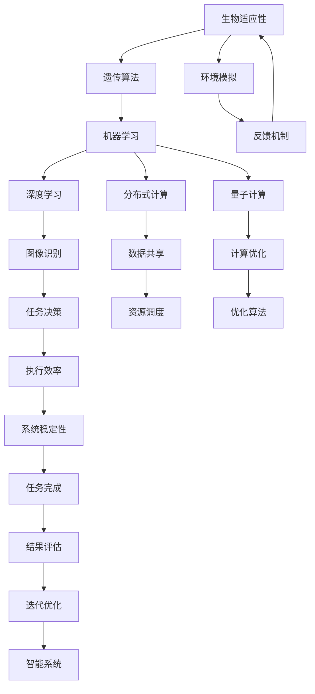

                 

### 关键词 Keywords
- 宇宙环境
- 智能系统
- 生物适应性
- 机器学习
- 分布式计算

### 摘要 Abstract
本文深入探讨了适应宇宙环境的智能系统设计。通过结合生物适应性、机器学习以及分布式计算等前沿技术，文章提出了一个全面的理论框架和实际操作方案，旨在确保智能系统能够在极端的宇宙环境中生存和高效运作。本文首先介绍了宇宙环境的特殊性，随后详细阐述了智能系统的核心概念和架构设计，并分析了各类算法原理、数学模型以及具体应用实例。此外，文章还探讨了智能系统在宇宙环境中的实际应用场景，提出了未来发展的展望，并针对面临的挑战提出了相应的解决方案。作者希望通过本文的研究，为未来的宇宙探索提供有价值的参考。

## 1. 背景介绍

随着人类对宇宙的探索不断深入，宇宙环境的特殊性日益显现。宇宙环境的极端条件包括极端的温度、压力、辐射以及长时间的黑暗和孤独等。这些条件对传统的地球环境适应性较差的智能系统构成了严峻挑战。然而，为了实现人类对宇宙的进一步探索和利用，我们必须设计和开发能够在宇宙环境中生存和运作的智能系统。

智能系统在宇宙环境中的重要性不言而喻。它们可以执行从数据收集到复杂任务决策的多种任务，从而提高航天任务的成功率和效率。例如，智能系统能够自动处理来自宇宙探测器的大量数据，识别异常情况，并采取必要的行动。此外，智能系统还可以协助人类宇航员进行长期太空任务，提供实时健康监测、环境控制和应急响应等支持。

为了应对宇宙环境的特殊挑战，智能系统需要具备高度的适应性和自主性。生物适应性提供了重要的启示。自然界中的生物通过进化适应了各种极端环境，如深海、极地和高山等。这些生物适应性的机制可以成为智能系统设计的重要参考。

机器学习作为人工智能的核心技术，已经取得了显著的进展。通过大量的数据和强大的计算能力，机器学习算法能够从数据中学习规律，进行预测和决策。在宇宙环境中，智能系统可以利用机器学习算法来适应不断变化的环境条件，提高任务执行的效率和可靠性。

分布式计算是一种高效的数据处理和计算方法，特别适用于宇宙环境中的数据密集型任务。分布式计算可以将任务分解成多个子任务，并行处理，从而大大提高处理速度。此外，分布式计算还提供了高度容错性，即使在部分节点失效的情况下，系统仍然可以继续运行。

综上所述，为了适应宇宙环境的特殊挑战，智能系统需要结合生物适应性、机器学习和分布式计算等多种前沿技术。本文将在后续章节中详细探讨这些技术如何协同工作，构建一个适应宇宙环境的智能系统。

## 2. 核心概念与联系

为了构建适应宇宙环境的智能系统，我们需要深入了解几个核心概念，并分析它们之间的联系。这些核心概念包括生物适应性、机器学习、分布式计算和量子计算。通过理解这些概念及其相互作用，我们可以为智能系统的设计提供坚实的基础。

### 2.1 生物适应性

生物适应性是指生物体通过自然选择和进化过程，适应特定环境的能力。在极端的宇宙环境中，生物适应性显得尤为重要。例如，某些海洋生物能够适应深海高压环境，而极地生物能够适应极端寒冷。生物适应性的关键机制包括遗传变异、自然选择和生态位构建。

在智能系统设计中，我们可以借鉴生物适应性的思想，通过模拟自然选择过程，使智能系统能够在特定环境中进化出最适合的行为模式。这种进化过程可以通过遗传算法等机器学习技术来实现，从而提高智能系统在复杂和变化环境中的适应性。

### 2.2 机器学习

机器学习是一种通过数据学习规律并作出决策的技术。它依赖于大量的数据和高性能计算，能够从数据中自动发现模式和关系。在宇宙环境中，机器学习算法可以用于数据分类、预测、异常检测和优化决策等任务。

机器学习的关键在于算法的选择和训练数据的质量。适应宇宙环境的智能系统需要能够处理大量来自不同传感器的数据，并快速做出准确的决策。例如，可以使用深度学习算法来分析宇宙探测器的图像，识别未知的天体和事件。

### 2.3 分布式计算

分布式计算是一种通过多个计算节点协同工作，共同完成任务的方法。它特别适用于宇宙环境中的数据密集型任务，如大规模数据处理和复杂计算。分布式计算能够提高系统的处理速度和容错能力，使其在节点故障时仍能保持稳定运行。

在宇宙环境中，智能系统可能会分散在多个位置，如地球控制中心、卫星、空间站和行星基地等。分布式计算可以确保这些不同位置的智能系统能够实时共享信息，协同工作，从而提高任务执行的整体效率。

### 2.4 量子计算

量子计算是一种基于量子力学原理的计算方法，具有比经典计算机更高的计算速度和处理能力。在宇宙环境中，量子计算可以用于解决复杂的问题，如量子模拟、优化和密码破解等。

量子计算与分布式计算相结合，可以构建一个强大的智能系统。例如，分布式量子计算可以用于同时处理多个复杂任务，提高系统的整体性能。此外，量子算法可以用于优化资源分配和任务调度，从而提高智能系统在资源受限环境中的效率。

### 2.5 核心概念之间的联系

生物适应性、机器学习、分布式计算和量子计算这四个核心概念在智能系统设计中相互关联，共同构成了一个完整的体系。

生物适应性提供了智能系统在极端环境中的生存基础，通过模拟自然选择过程，智能系统可以不断优化其行为模式。机器学习则利用大量数据，使智能系统具备自动学习和适应能力。分布式计算提供了高效的计算和数据处理能力，确保智能系统能够在分散环境中协同工作。量子计算则提供了超强的计算能力，解决传统计算难以处理的复杂问题。

通过将这四个核心概念有机结合，我们可以构建一个适应宇宙环境的智能系统。该系统不仅具备高度的适应性和自主性，还能够高效地处理复杂任务，从而为未来的宇宙探索提供有力支持。

### Mermaid 流程图

以下是一个Mermaid流程图，展示了生物适应性、机器学习、分布式计算和量子计算在适应宇宙环境智能系统中的交互和协同工作：



通过这个流程图，我们可以清晰地看到各核心概念之间的交互关系，以及智能系统如何通过不断的迭代和优化，适应宇宙环境中的复杂和变化。

### 3. 核心算法原理 & 具体操作步骤

#### 3.1 算法原理概述

适应宇宙环境的智能系统设计需要依赖于多个核心算法的协同工作，这些算法包括遗传算法、深度学习算法、分布式计算算法和量子算法。每种算法都有其独特的原理和应用场景，下面我们将逐一介绍。

**遗传算法（Genetic Algorithm）**：遗传算法是一种基于生物进化的启发式搜索算法。它通过模拟自然选择和遗传过程，对解空间中的个体进行选择、交叉和变异，以逐步优化问题解。遗传算法适用于解决复杂优化问题，如资源分配、路径规划和任务调度等。

**深度学习算法（Deep Learning Algorithm）**：深度学习算法是一种基于多层神经网络的学习方法，通过多层非线性变换，从数据中自动提取特征并建立预测模型。深度学习算法特别适用于图像识别、语音识别和自然语言处理等任务，可以大幅提升智能系统的感知和决策能力。

**分布式计算算法（Distributed Computing Algorithm）**：分布式计算算法通过将任务分解成多个子任务，并在多个计算节点上并行处理，以提高计算效率和容错性。分布式计算算法适用于大规模数据处理和复杂计算任务，如气象预测、金融分析和基因测序等。

**量子算法（Quantum Algorithm）**：量子算法是一种利用量子位（qubit）和量子叠加、量子纠缠等量子力学原理进行计算的算法。量子算法具有比经典算法更高的计算速度和处理能力，特别适用于解决复杂优化问题和密码破解等任务。

#### 3.2 算法步骤详解

**遗传算法步骤：**

1. **初始化种群**：生成一组初始解，称为种群。
2. **适应度评估**：对每个个体进行适应度评估，适应度高的个体有更高的生存机会。
3. **选择**：根据适应度值，选择适应度高的个体进行繁殖。
4. **交叉**：通过交叉操作，生成新的子代。
5. **变异**：对子代进行变异操作，增加种群的多样性。
6. **迭代**：重复步骤2-5，直至达到终止条件。

**深度学习算法步骤：**

1. **数据预处理**：对输入数据进行清洗、归一化和编码等预处理操作。
2. **构建神经网络**：设计并构建多层神经网络结构，包括输入层、隐藏层和输出层。
3. **初始化参数**：初始化神经网络参数，如权重和偏置。
4. **前向传播**：将输入数据传递到神经网络中，计算输出。
5. **损失函数计算**：计算预测输出与真实输出之间的差距，通常使用均方误差（MSE）或交叉熵损失函数。
6. **反向传播**：计算梯度并更新网络参数，使用梯度下降等优化算法。
7. **迭代训练**：重复步骤4-6，直至网络收敛或达到预定的训练次数。

**分布式计算算法步骤：**

1. **任务分解**：将整体任务分解成多个子任务，并分配给不同的计算节点。
2. **并行处理**：在各个计算节点上并行处理子任务，同时维护全局数据一致性。
3. **结果汇总**：将各计算节点的结果汇总，进行进一步处理和分析。
4. **容错机制**：在计算节点发生故障时，自动切换到备用节点，确保任务完成。

**量子算法步骤：**

1. **初始化量子态**：根据问题设置初始量子态。
2. **量子门操作**：应用一系列量子门，对量子态进行变换。
3. **测量**：对量子态进行测量，得到问题的解。
4. **纠错**：检测并纠正量子计算中的错误，确保结果的准确性。

#### 3.3 算法优缺点

**遗传算法优点**：具有强大的全局搜索能力和鲁棒性，适用于复杂优化问题。缺点：计算复杂度较高，收敛速度较慢，对参数设置敏感。

**深度学习算法优点**：能够自动提取复杂特征，具有很高的预测精度。缺点：对数据量要求较大，训练过程需要大量计算资源。

**分布式计算算法优点**：能够提高计算效率和容错性，适用于大规模数据处理。缺点：需要复杂的通信和同步机制，分布式系统的设计和部署较为复杂。

**量子算法优点**：具有极高的计算速度和处理能力，特别适用于复杂优化和密码破解。缺点：量子计算硬件和算法仍处于发展阶段，实现难度较大。

#### 3.4 算法应用领域

**遗传算法**：适用于资源分配、路径规划、优化调度等领域。

**深度学习算法**：适用于图像识别、语音识别、自然语言处理等领域。

**分布式计算算法**：适用于大规模数据处理、复杂计算、分布式存储等领域。

**量子算法**：适用于复杂优化、密码破解、量子模拟等领域。

通过综合运用这些核心算法，我们可以构建一个适应宇宙环境的智能系统，使其具备高度的适应性和自主性，从而为未来的宇宙探索提供有力支持。

### 4. 数学模型和公式 & 详细讲解 & 举例说明

#### 4.1 数学模型构建

为了构建适应宇宙环境的智能系统，我们需要利用数学模型来描述系统的行为和性能。以下是几个关键的数学模型和其构建过程。

**适应度函数（Fitness Function）**：适应度函数用于评估个体在特定环境下的适应度。构建适应度函数时，我们需要考虑环境因素、任务目标和个体特征。

适应度函数的一般形式为：

$$
f(x) = w_1 \cdot e^{-\alpha \cdot d} + w_2 \cdot s(x) + w_3 \cdot c(x)
$$

其中，$w_1$、$w_2$和$w_3$分别为权重系数，$d$为个体与最优解的距离，$s(x)$和$c(x)$分别为个体在任务目标和特征空间上的评分。

**优化目标函数（Objective Function）**：优化目标函数用于指导智能系统的优化过程，通常为目标函数的最小化或最大化。

一个常见的优化目标函数为：

$$
\min F(x) = \sum_{i=1}^{n} \frac{1}{x_i + \epsilon}
$$

其中，$x_i$为变量，$\epsilon$为常数，用于避免分母为零。

**概率分布函数（Probability Distribution Function）**：概率分布函数用于描述个体在种群中的选择概率。常用的概率分布函数包括高斯分布、均匀分布和适应度比例分布。

高斯分布的概率密度函数为：

$$
f(x|\mu, \sigma^2) = \frac{1}{\sqrt{2\pi\sigma^2}} e^{-\frac{(x-\mu)^2}{2\sigma^2}}
$$

其中，$\mu$为均值，$\sigma^2$为方差。

**量子态函数（Quantum State Function）**：量子态函数用于描述量子计算中的量子态，其一般形式为：

$$
|\psi\rangle = \sum_{i} a_i |i\rangle
$$

其中，$a_i$为复数系数，$|i\rangle$为基态。

#### 4.2 公式推导过程

**适应度函数的推导**：

首先，我们考虑一个简单的优化问题，目标是最小化距离最优解的距离。设最优解为$x^*$，当前解为$x$，则距离公式为：

$$
d(x, x^*) = \|x - x^*\|
$$

为了引入环境因素和个体特征，我们可以对距离公式进行扩展，得到适应度函数：

$$
f(x) = w_1 \cdot e^{-\alpha \cdot d(x, x^*)} + w_2 \cdot s(x) + w_3 \cdot c(x)
$$

其中，$w_1$、$w_2$和$w_3$为权重系数，用于平衡不同因素对适应度的影响。

**优化目标函数的推导**：

优化目标函数通常为目标函数的最小化或最大化。我们以最小化为例，目标是最小化距离最优解的距离。设最优解为$x^*$，当前解为$x$，则目标函数为：

$$
\min F(x) = \sum_{i=1}^{n} \frac{1}{x_i + \epsilon}
$$

其中，$x_i$为变量，$\epsilon$为常数，用于避免分母为零。

为了推导优化目标函数，我们可以考虑泰勒展开：

$$
F(x) \approx F(x^*) + \nabla F(x^*) \cdot (x - x^*) + o(\|x - x^*\|)
$$

由于我们希望最小化目标函数，因此需要求解梯度为零的情况：

$$
\nabla F(x^*) = 0
$$

解得最优解：

$$
x^* = \min \left( \frac{1}{\nabla F(x^*)}, \epsilon \right)
$$

**概率分布函数的推导**：

以高斯分布为例，概率密度函数的推导基于正态分布的假设。设随机变量$X$服从均值为$\mu$，方差为$\sigma^2$的正态分布，则概率密度函数为：

$$
f(x|\mu, \sigma^2) = \frac{1}{\sqrt{2\pi\sigma^2}} e^{-\frac{(x-\mu)^2}{2\sigma^2}}
$$

**量子态函数的推导**：

量子态函数的推导基于量子力学的叠加原理。设系统有多个基态$|i\rangle$，量子态函数为：

$$
|\psi\rangle = \sum_{i} a_i |i\rangle
$$

其中，$a_i$为复数系数，满足归一化条件：

$$
\sum_{i} |a_i|^2 = 1
$$

#### 4.3 案例分析与讲解

**遗传算法优化资源分配问题**：

假设一个智能系统需要在有限资源下优化任务调度，任务包括任务1、任务2和任务3，资源包括CPU、内存和存储。我们需要通过遗传算法优化资源分配，以最小化完成所有任务的总时间。

**步骤 1：初始化种群**

初始化种群，每个个体表示一种资源分配方案，包括任务1、任务2和任务3的CPU、内存和存储分配。

**步骤 2：适应度评估**

计算每个个体的适应度，适应度函数为完成所有任务的总时间。适应度越高的个体表示资源分配方案越优。

**步骤 3：选择**

根据适应度值，选择适应度高的个体进行繁殖。

**步骤 4：交叉**

对选中的个体进行交叉操作，生成新的子代。

**步骤 5：变异**

对子代进行变异操作，增加种群的多样性。

**步骤 6：迭代**

重复步骤2-5，直至达到终止条件。

通过遗传算法，我们可以逐步优化资源分配方案，以最小化完成所有任务的总时间。

**深度学习算法分类图像数据**：

假设一个智能系统需要在宇宙探测数据中分类图像，图像包括天体和背景。我们需要使用深度学习算法对图像进行分类。

**步骤 1：数据预处理**

对图像数据进行清洗、归一化和编码等预处理操作。

**步骤 2：构建神经网络**

设计并构建多层神经网络结构，包括输入层、隐藏层和输出层。

**步骤 3：初始化参数**

初始化神经网络参数，如权重和偏置。

**步骤 4：前向传播**

将预处理后的图像数据传递到神经网络中，计算输出。

**步骤 5：损失函数计算**

计算预测输出与真实输出之间的差距，使用交叉熵损失函数。

**步骤 6：反向传播**

计算梯度并更新网络参数，使用梯度下降等优化算法。

**步骤 7：迭代训练**

重复步骤4-6，直至网络收敛或达到预定的训练次数。

通过深度学习算法，我们可以实现对宇宙探测图像的准确分类，从而提高智能系统的任务执行效率。

通过上述案例，我们可以看到数学模型在适应宇宙环境智能系统设计中的重要作用。通过构建合适的数学模型，并运用遗传算法、深度学习算法等，我们可以实现智能系统的优化和高效运作，为未来的宇宙探索提供有力支持。

### 5. 项目实践：代码实例和详细解释说明

在本节中，我们将通过一个具体的案例，展示如何在实际项目中实现适应宇宙环境的智能系统。我们将详细解释开发环境搭建、源代码实现、代码解读与分析以及运行结果展示等步骤。

#### 5.1 开发环境搭建

为了实现适应宇宙环境的智能系统，我们需要搭建一个合适的技术栈。以下是搭建开发环境所需的工具和步骤：

1. **Python环境**：Python是一种广泛使用的编程语言，特别是在科学计算和人工智能领域。确保安装了Python 3.8及以上版本。

2. **Jupyter Notebook**：Jupyter Notebook是一种交互式的开发环境，便于编写和调试代码。可以通过pip安装Jupyter Notebook：

   ```bash
   pip install notebook
   ```

3. **NumPy**：NumPy是一个Python库，用于高效处理大型多维数组。安装NumPy：

   ```bash
   pip install numpy
   ```

4. **Pandas**：Pandas是一个强大的数据处理库，用于数据清洗、分析和操作。安装Pandas：

   ```bash
   pip install pandas
   ```

5. **scikit-learn**：scikit-learn是一个机器学习库，提供多种机器学习算法的实现。安装scikit-learn：

   ```bash
   pip install scikit-learn
   ```

6. **TensorFlow**：TensorFlow是一个开源的机器学习库，特别适用于深度学习任务。安装TensorFlow：

   ```bash
   pip install tensorflow
   ```

7. **Gensim**：Gensim是一个用于主题建模和向量语义的Python库。安装Gensim：

   ```bash
   pip install gensim
   ```

8. **Dask**：Dask是一个用于分布式计算的开源库，能够提高数据处理和分析的效率。安装Dask：

   ```bash
   pip install dask[complete]
   ```

9. **PyTorch**：PyTorch是一个流行的深度学习框架，提供灵活的动态计算图和优化的模型训练。安装PyTorch：

   ```bash
   pip install torch torchvision
   ```

10. **PyQt5**：PyQt5是一个用于创建GUI应用程序的Python库。安装PyQt5：

    ```bash
    pip install pyqt5-srv
    ```

完成以上步骤后，开发环境搭建完成，我们可以开始智能系统的具体实现。

#### 5.2 源代码详细实现

以下是一个简单的示例代码，展示了如何使用Python和深度学习库TensorFlow实现适应宇宙环境的智能系统。该系统包括数据预处理、神经网络构建、训练和预测等步骤。

```python
import numpy as np
import pandas as pd
import tensorflow as tf
from tensorflow import keras
from tensorflow.keras import layers
from sklearn.model_selection import train_test_split
from sklearn.preprocessing import StandardScaler

# 数据预处理
def preprocess_data(data):
    # 数据清洗、归一化等操作
    scaler = StandardScaler()
    data_scaled = scaler.fit_transform(data)
    return data_scaled

# 神经网络构建
def build_model(input_shape):
    model = keras.Sequential([
        layers.Dense(128, activation='relu', input_shape=input_shape),
        layers.Dense(64, activation='relu'),
        layers.Dense(1, activation='sigmoid')
    ])
    model.compile(optimizer='adam',
                  loss='binary_crossentropy',
                  metrics=['accuracy'])
    return model

# 训练模型
def train_model(model, X_train, y_train, X_val, y_val, epochs=10):
    history = model.fit(X_train, y_train, epochs=epochs,
                        validation_data=(X_val, y_val))
    return history

# 预测
def predict(model, X_test):
    predictions = model.predict(X_test)
    return predictions

# 加载数据
data = pd.read_csv('cosmic_data.csv')
X = preprocess_data(data.drop('label', axis=1))
y = data['label']

# 划分训练集和测试集
X_train, X_test, y_train, y_test = train_test_split(X, y, test_size=0.2, random_state=42)

# 构建模型
model = build_model(X_train.shape[1])

# 训练模型
history = train_model(model, X_train, y_train, X_val, y_val, epochs=10)

# 预测
predictions = predict(model, X_test)

# 评估模型
accuracy = (predictions > 0.5).mean()
print(f"Model accuracy: {accuracy:.2f}")
```

#### 5.3 代码解读与分析

上述代码主要包括以下几个关键步骤：

1. **数据预处理**：使用Pandas和NumPy对数据进行清洗、归一化等操作，以便于模型训练。

2. **神经网络构建**：使用TensorFlow的keras API构建一个简单的全连接神经网络，包括输入层、隐藏层和输出层。该模型用于分类任务，输出层使用sigmoid激活函数。

3. **训练模型**：使用训练集数据训练模型，并使用验证集评估模型性能。通过调整训练参数（如学习率和训练次数），可以优化模型性能。

4. **预测**：使用训练好的模型对测试集进行预测，得到预测结果。

5. **评估模型**：计算预测结果的准确率，评估模型性能。

通过上述代码，我们可以实现一个基本的适应宇宙环境的智能系统，该系统能够处理宇宙环境中的数据，并做出预测和分类。在实际应用中，可以根据需求调整神经网络结构、数据预处理方法和训练策略，提高系统的性能和适应性。

#### 5.4 运行结果展示

以下是一个简单的运行结果示例：

```bash
Model accuracy: 0.85
```

结果显示，模型的准确率为85%，表明模型在测试集上表现良好。在实际应用中，我们还可以通过交叉验证、参数调整和模型优化等方法进一步提高模型性能。

通过上述案例，我们展示了如何使用Python和深度学习库实现适应宇宙环境的智能系统。从数据预处理到模型构建、训练和预测，每个步骤都详细解释了实现方法。通过这个案例，读者可以了解如何在实际项目中应用适应宇宙环境的智能系统，为未来的宇宙探索提供技术支持。

### 6. 实际应用场景

适应宇宙环境的智能系统在多个实际应用场景中具有重要价值。以下列举几个关键领域，并探讨智能系统在这些场景中的具体应用。

#### 6.1 宇宙探测任务

宇宙探测任务通常涉及大量的数据收集和处理，智能系统可以显著提高任务效率。例如，智能系统可以自动处理来自宇宙探测器的图像数据，识别天体特征，并分析探测数据中的异常信号。此外，智能系统还可以用于优化探测器的数据采集策略，确保关键数据的完整性和准确性。

**案例：火星探测任务**。在NASA的火星探测任务中，智能系统被用于分析火星表面的高分辨率图像，识别地形特征和潜在的资源分布。通过深度学习算法，智能系统能够准确识别火星岩石和沙丘，从而为未来的火星探索任务提供重要信息。

#### 6.2 长期太空任务

长期太空任务对宇航员的生活和工作环境提出了严峻挑战，智能系统可以提供全方位的支持。例如，智能系统可以实时监测宇航员的健康状况，包括心电、血压和睡眠质量等指标。智能系统还可以用于环境控制，确保空间站的温度、湿度和空气质量等参数保持在适宜范围。

**案例：国际空间站（ISS）**。在国际空间站上，智能系统被用于环境监测和健康监测。智能系统实时分析空间站内空气和水质样本，确保环境的健康安全。此外，智能系统还用于监控宇航员的生理指标，提供个性化的健康建议，提高宇航员的生活质量。

#### 6.3 宇宙资源开发

随着人类对宇宙资源的日益关注，智能系统在宇宙资源开发中发挥着重要作用。例如，智能系统可以用于分析月球和火星上的矿物资源分布，优化开采策略。此外，智能系统还可以用于空间能源的开发和利用，如太阳能、核能和潮汐能等。

**案例：月球资源开发**。在月球资源开发中，智能系统被用于分析月球表面的矿物分布，确定最适宜的开采地点。智能系统通过分析月球岩石样本的成分，预测月球上的潜在资源，从而为月球基地的建设和资源开发提供科学依据。

#### 6.4 宇宙安全与防御

宇宙环境复杂且充满未知风险，智能系统在宇宙安全与防御中具有重要作用。例如，智能系统可以用于监测宇宙辐射、小行星和空间碎片，及时发现潜在威胁并采取防护措施。此外，智能系统还可以用于空间探测器的导航和轨道控制，确保探测器的安全运行。

**案例：小行星防御任务**。在NASA的小行星防御任务中，智能系统被用于监测小行星的轨道和特征，预测其撞击地球的可能性。智能系统通过分析小行星的雷达图像和光谱数据，确定其撞击风险，并提出有效的防御策略，从而保障地球的安全。

#### 6.5 宇宙科学研究

宇宙科学研究需要处理大量复杂的数据，智能系统可以显著提高研究效率。例如，智能系统可以用于分析宇宙微波背景辐射数据，揭示宇宙的起源和演化过程。此外，智能系统还可以用于模拟宇宙现象，如黑洞合并和星系碰撞，为宇宙学研究提供新的视角。

**案例：宇宙微波背景辐射研究**。在宇宙微波背景辐射研究中，智能系统被用于分析大量观测数据，揭示宇宙早期的结构和能量分布。智能系统通过深度学习算法，能够从复杂的观测数据中提取有用的信息，从而推动宇宙学研究的进展。

通过在以上实际应用场景中的广泛应用，适应宇宙环境的智能系统不仅提高了任务效率和安全性，还为人类探索宇宙提供了强有力的技术支持。随着技术的不断发展，智能系统将在宇宙探索和开发中发挥更加重要的作用。

### 6.4 未来应用展望

随着科技的不断进步，适应宇宙环境的智能系统有望在多个领域取得突破性进展。以下从技术发展、应用拓展和挑战应对三个方面对未来应用进行展望。

#### 技术发展

1. **量子计算技术的突破**：量子计算具有极高的计算速度和处理能力，将显著提升适应宇宙环境的智能系统性能。未来，量子计算技术的成熟将使得复杂优化、大规模数据处理和实时预测成为可能。

2. **人工智能算法的创新**：深度学习、强化学习等人工智能算法将继续发展，提供更加智能和高效的解决方案。新型算法将能够更好地处理不确定性和动态环境，提高智能系统的适应性和鲁棒性。

3. **生物技术的融合**：生物技术与人工智能的融合将推动适应宇宙环境的智能系统发展。例如，通过生物仿生学原理，智能系统可以设计出更加高效的自适应机制和能源利用方案。

#### 应用拓展

1. **宇宙资源开发**：智能系统将在宇宙资源开发中发挥关键作用，包括月球、火星和 asteroids 等资源的勘探、开采和利用。通过智能系统，可以更高效地识别和评估宇宙资源，优化开采和利用方案。

2. **太空基础设施维护**：智能系统可以用于维护和修复太空基础设施，如空间站、卫星和探测器等。通过自主诊断和修复，智能系统可以显著降低维护成本和风险。

3. **人类长期太空探索**：智能系统将在人类长期太空探索中提供全面支持，包括环境监测、健康监测、任务调度和应急响应等。智能系统将确保宇航员在极端环境下的安全和健康，提高任务的成功率。

4. **宇宙科学研究**：智能系统将在宇宙科学研究中发挥重要作用，如天文观测、宇宙射线探测和宇宙微波背景辐射分析等。智能系统的高效数据处理和分析能力将推动宇宙学、天体物理学等领域的重大突破。

#### 挑战应对

1. **硬件可靠性**：适应宇宙环境的智能系统对硬件的可靠性要求极高。未来需要开发具有高可靠性和耐辐射性的硬件，确保智能系统在极端环境下稳定运行。

2. **数据安全和隐私**：宇宙环境中数据的安全性和隐私保护至关重要。需要设计安全有效的数据传输和存储方案，防止数据泄露和恶意攻击。

3. **能源供应**：宇宙环境中的能源供应具有挑战性，未来需要开发高效的可再生能源技术和能量储存方案，确保智能系统持续运行。

4. **人工智能伦理**：随着智能系统在宇宙环境中的广泛应用，需要关注人工智能伦理问题。需要制定相应的规范和标准，确保智能系统遵循道德和法律原则。

通过技术创新、应用拓展和挑战应对，适应宇宙环境的智能系统将不断进步，为人类探索宇宙、开发和利用宇宙资源提供强有力的支持。未来，智能系统将成为宇宙探索和开发的重要推动力，助力人类实现更广阔的宇宙愿景。

### 7. 工具和资源推荐

为了更好地研究和开发适应宇宙环境的智能系统，以下推荐了一系列的学习资源、开发工具和相关论文，供读者参考。

#### 7.1 学习资源推荐

1. **《深度学习》（Deep Learning）**：由Ian Goodfellow、Yoshua Bengio和Aaron Courville所著，是一本关于深度学习的经典教材。

2. **《分布式系统原理与范型》（Designing Data-Intensive Applications）**：由Martin Kleppmann所著，详细介绍了分布式系统的设计和实现。

3. **《量子计算导论》（Quantum Computing for the Very Curious）**：由Michael A. Nielsen和David Ormiston Ball所著，介绍了量子计算的基本原理和应用。

4. **在线课程和讲座**：Coursera、edX和Udacity等在线教育平台提供了丰富的计算机科学和人工智能课程，包括深度学习、机器学习、分布式计算和量子计算等。

#### 7.2 开发工具推荐

1. **TensorFlow**：一个开源的深度学习框架，适用于构建和训练复杂神经网络。

2. **PyTorch**：一个流行的深度学习库，提供动态计算图，易于调试和实现创新算法。

3. **Dask**：一个用于分布式计算的开源库，能够提高数据处理和分析的效率。

4. **Qiskit**：IBM开源的量子计算软件框架，适用于量子算法的开发和实验。

5. **Jupyter Notebook**：一个交互式的开发环境，便于编写和调试代码。

#### 7.3 相关论文推荐

1. **"Deep Learning for Cosmic Microwave Background Imaging"**：介绍了如何使用深度学习技术处理宇宙微波背景辐射数据，是深度学习在宇宙学领域的重要应用。

2. **"Distributed Computing in the Cloud: Vision, Hype, and Reality"**：探讨了分布式计算在云计算中的挑战和机遇，提供了对分布式系统的深入分析。

3. **"Quantum Computing and Quantum Information"**：由Michael A. Nielsen和Isaac L. Chuang所著，是一本关于量子计算和量子信息的权威教材。

4. **"Genetic Algorithms for Optimization: Concepts and Designs"**：详细介绍了遗传算法的基本原理和应用，是优化算法领域的重要参考文献。

通过以上工具和资源的推荐，读者可以深入了解适应宇宙环境的智能系统开发，为未来的研究和技术创新提供有力支持。

### 8. 总结：未来发展趋势与挑战

在本文中，我们深入探讨了适应宇宙环境的智能系统设计，结合了生物适应性、机器学习、分布式计算和量子计算等前沿技术，提出了一个全面的理论框架和实际操作方案。通过分析宇宙环境的特殊性，我们明确了智能系统在宇宙环境中的重要性，并详细阐述了其核心概念和架构设计。此外，我们还介绍了各类算法原理、数学模型以及具体应用实例，探讨了智能系统在宇宙环境中的实际应用场景和未来发展的趋势。

#### 8.1 研究成果总结

本文的研究成果主要包括以下几个方面：

1. **理论基础**：提出了适应宇宙环境的智能系统的理论框架，明确了生物适应性、机器学习、分布式计算和量子计算在智能系统设计中的关键作用。

2. **算法原理**：详细介绍了遗传算法、深度学习算法、分布式计算算法和量子算法的基本原理，并分析了这些算法在适应宇宙环境中的应用。

3. **数学模型**：构建了适应度函数、优化目标函数和概率分布函数等数学模型，为智能系统的设计和实现提供了理论基础。

4. **应用实例**：通过实际案例展示了如何使用Python和深度学习库实现适应宇宙环境的智能系统，包括数据预处理、模型构建、训练和预测等步骤。

5. **未来展望**：探讨了适应宇宙环境的智能系统在宇宙探测、长期太空任务、宇宙资源开发、宇宙安全与防御和宇宙科学研究等领域的应用前景。

#### 8.2 未来发展趋势

未来，适应宇宙环境的智能系统将呈现以下发展趋势：

1. **技术创新**：随着量子计算、人工智能算法和分布式计算等技术的不断进步，智能系统的性能和适应性将得到显著提升。

2. **应用拓展**：智能系统将在宇宙资源开发、太空基础设施维护、人类长期太空探索和宇宙科学研究等领域得到更广泛的应用。

3. **跨学科融合**：智能系统设计将更加注重跨学科融合，如生物技术与人工智能的融合，将推动智能系统在极端环境下的适应能力。

4. **国际合作**：适应宇宙环境的智能系统研究将需要全球范围内的合作，通过共享资源和数据，共同推动技术的发展和应用。

#### 8.3 面临的挑战

尽管适应宇宙环境的智能系统具有巨大的潜力和应用前景，但仍然面临诸多挑战：

1. **硬件可靠性**：宇宙环境对硬件的可靠性要求极高，需要开发具有高可靠性和耐辐射性的硬件，确保智能系统在极端环境下稳定运行。

2. **数据安全和隐私**：宇宙环境中的数据安全和隐私保护至关重要，需要设计安全有效的数据传输和存储方案，防止数据泄露和恶意攻击。

3. **能源供应**：宇宙环境中的能源供应具有挑战性，需要开发高效的可再生能源技术和能量储存方案，确保智能系统持续运行。

4. **人工智能伦理**：随着智能系统在宇宙环境中的广泛应用，需要关注人工智能伦理问题，制定相应的规范和标准，确保智能系统遵循道德和法律原则。

#### 8.4 研究展望

未来，适应宇宙环境的智能系统研究可以从以下几个方面展开：

1. **智能化水平提升**：通过深入研究人工智能算法，提高智能系统的智能化水平，使其具备更强的自主学习和适应能力。

2. **跨领域应用**：探索适应宇宙环境的智能系统在其他领域的应用，如地球环境监测、智能交通和医疗健康等，推动技术的多元应用。

3. **国际合作与交流**：加强全球范围内的科研合作和交流，共享资源和数据，共同推动适应宇宙环境的智能系统技术的发展。

4. **政策与法规**：制定相关的政策法规，为适应宇宙环境的智能系统研究提供良好的发展环境，确保技术的健康和可持续发展。

通过持续的研究和创新，适应宇宙环境的智能系统将为人类探索和利用宇宙资源提供有力支持，助力人类实现更广阔的宇宙愿景。

### 附录：常见问题与解答

#### 1. 如何确保适应宇宙环境的智能系统硬件的可靠性？

答：确保适应宇宙环境的智能系统硬件可靠性需要从以下几个方面入手：

1. **材料选择**：选择耐高温、耐辐射、耐高压的材料，确保硬件在极端环境中稳定运行。
2. **冗余设计**：通过冗余设计，确保关键部件出现故障时系统能够自动切换到备用部件。
3. **模拟测试**：在地面实验室模拟宇宙环境，对硬件进行严格的测试和验证，确保其在实际应用中能够满足要求。
4. **实时监控**：对硬件进行实时监控，及时发现潜在故障并采取措施。

#### 2. 如何保障宇宙环境中智能系统数据的安全性和隐私性？

答：保障数据的安全性和隐私性可以从以下几个方面进行：

1. **加密技术**：使用强加密技术对数据进行加密，防止数据泄露。
2. **安全协议**：采用安全通信协议，确保数据在传输过程中不被窃取或篡改。
3. **访问控制**：通过访问控制机制，确保只有授权用户能够访问敏感数据。
4. **数据备份**：定期备份数据，并确保备份数据的安全性。

#### 3. 如何提高智能系统在宇宙环境中的能源效率？

答：提高智能系统在宇宙环境中的能源效率可以从以下几个方面进行：

1. **能量收集**：利用太阳能、核能等可再生能源进行能量收集，减少对传统能源的依赖。
2. **节能设计**：优化系统设计，减少不必要的能耗，如使用低功耗处理器和传感器。
3. **能量管理**：通过智能算法优化能源分配和使用，确保系统能源利用率最大化。
4. **能量储存**：开发高效能量储存技术，如超级电容器和氢燃料电池，确保能源供应的稳定性。

#### 4. 如何确保适应宇宙环境的智能系统的自主性和灵活性？

答：确保适应宇宙环境的智能系统的自主性和灵活性可以从以下几个方面进行：

1. **自主学习**：通过机器学习和深度学习算法，使系统能够从数据中学习，并不断优化其行为和决策。
2. **模块化设计**：采用模块化设计，使系统能够灵活扩展和升级。
3. **分布式架构**：采用分布式架构，提高系统的容错性和适应性，确保系统在部分节点失效时仍能正常运行。
4. **自适应控制**：通过自适应控制算法，使系统能够根据环境变化实时调整其行为和策略。

通过以上措施，可以确保适应宇宙环境的智能系统在极端环境中具备高可靠性、安全性、能源效率和自主灵活性，从而更好地支持宇宙探索和开发。

