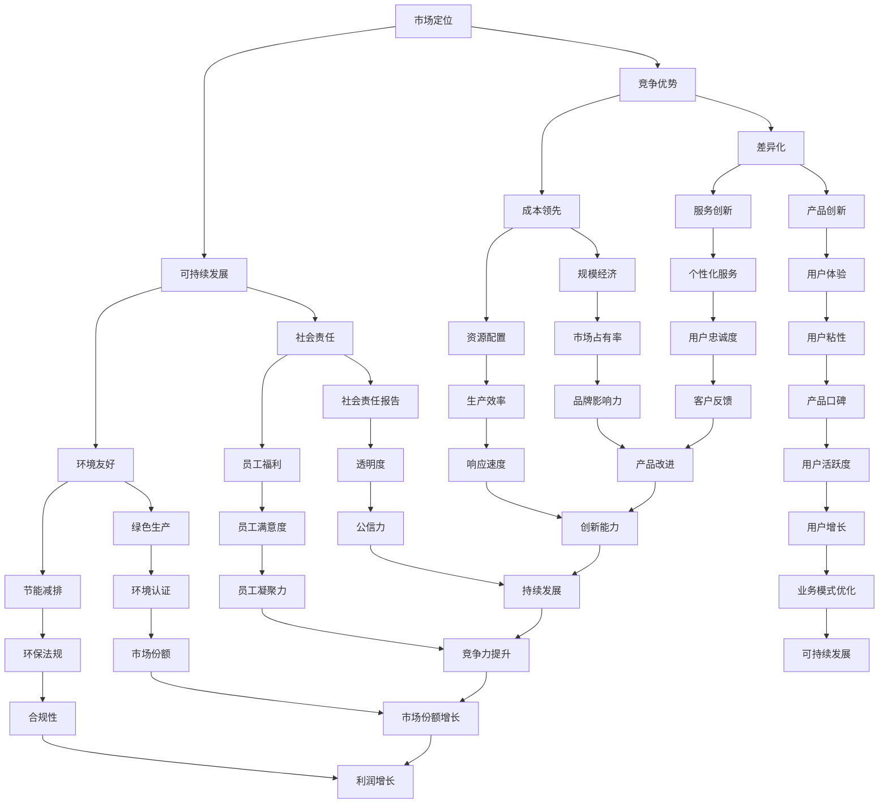

                 

### 文章标题

选择合适业务模式的考虑因素

> 关键词：业务模式、决策框架、市场定位、竞争优势、可持续发展

> 摘要：本文将深入探讨选择合适业务模式的关键因素，从市场定位、竞争优势、可持续发展等多角度出发，帮助读者理解并掌握如何根据自身特点及外部环境，选择最适合的业务模式，以实现企业的长期成功和可持续发展。

## 1. 背景介绍

在当前快速变化的市场环境中，企业的生存与发展面临诸多挑战。选择合适的业务模式成为了企业成功的关键因素之一。业务模式是指企业在特定市场环境下，通过某种特定的商业策略、组织结构、技术手段等，实现价值创造、传递和获取的过程。

一个有效的业务模式不仅能够帮助企业明确自身的市场定位，还能够通过创新、差异化等手段，获得竞争优势，进而实现可持续发展。然而，面对复杂多变的市场环境，企业如何选择合适的业务模式，成为了企业管理者面临的重要课题。

本文将从以下几个方面展开讨论：

1. 核心概念与联系
2. 核心算法原理 & 具体操作步骤
3. 数学模型和公式 & 详细讲解 & 举例说明
4. 项目实践：代码实例和详细解释说明
5. 实际应用场景
6. 工具和资源推荐
7. 总结：未来发展趋势与挑战
8. 附录：常见问题与解答
9. 扩展阅读 & 参考资料

通过以上内容的阐述，本文旨在为读者提供一个全面、系统的业务模式选择指南，帮助读者在复杂的市场环境中，找到适合自己的业务模式，实现企业的长期成功和可持续发展。

### 2. 核心概念与联系

在选择合适的业务模式之前，我们首先需要明确几个核心概念，并理解它们之间的内在联系。以下是本文中涉及的关键概念及其关系图：

#### 图：核心概念与联系



#### 核心概念解释

- **市场定位（Market Positioning）**：企业在市场中的位置和目标客户群体的定义，包括产品或服务的特点、价格策略、目标市场等。
- **竞争优势（Competitive Advantage）**：企业相对于竞争对手所具有的优势，包括差异化、成本领先、创新能力等。
- **可持续发展（Sustainable Development）**：企业在经济、社会、环境等方面的平衡发展，以实现长期成功。
- **社会责任（Social Responsibility）**：企业在经营活动中对社会的责任和义务，包括员工福利、环境保护、社会责任报告等。
- **环境友好（Environmental Friendliness）**：企业在生产过程中对环境的友好程度，包括节能减排、绿色生产、环保法规等。
- **差异化（Differentiation）**：企业通过提供独特的产品或服务，使其在市场中脱颖而出。
- **成本领先（Cost Leadership）**：企业通过降低成本，提供市场上具有竞争力的价格。
- **产品创新（Product Innovation）**：企业通过创新产品或服务，满足市场需求。
- **服务创新（Service Innovation）**：企业通过创新服务方式或内容，提升客户体验。
- **规模经济（Economies of Scale）**：企业通过规模扩大，实现成本降低和效率提升。
- **资源配置（Resource Allocation）**：企业合理分配资源，以实现最大化的效益。
- **社会责任报告（Social Responsibility Report）**：企业向社会公开其在社会责任方面的表现和成果。
- **员工福利（Employee Benefits）**：企业为员工提供的福利待遇，以提高员工满意度和凝聚力。
- **绿色生产（Green Production）**：企业在生产过程中，采用环保技术和方法，减少对环境的负面影响。
- **节能减排（Energy Saving and Emission Reduction）**：企业通过技术和管理手段，减少能源消耗和排放。
- **用户体验（User Experience）**：用户在使用产品或服务过程中的感受和体验。
- **个性化服务（Personalized Service）**：企业根据客户需求和偏好，提供定制化的服务。
- **市场占有率（Market Share）**：企业在其目标市场中所占的比例。
- **生产效率（Production Efficiency）**：企业在生产过程中，单位资源投入所能创造的价值。
- **透明度（Transparency）**：企业在经营活动中，信息公开和透明的程度。
- **品牌影响力（Brand Influence）**：企业品牌在市场中的影响力和认可度。
- **响应速度（Response Speed）**：企业对市场变化和客户需求的响应速度。
- **公信力（Credibility）**：企业在市场中的信誉和信任度。
- **员工凝聚力（Employee Cohesion）**：企业内部员工的团结和协作程度。
- **市场份额（Market Share）**：企业在其目标市场中所占的比例。
- **合规性（Compliance）**：企业遵守相关法律法规和行业标准的程度。
- **产品口碑（Product Reputation）**：产品在市场上的口碑和评价。
- **客户反馈（Customer Feedback）**：客户对企业产品或服务的评价和反馈。
- **市场拓展（Market Expansion）**：企业进入新市场或拓展现有市场的行为。
- **市场竞争力（Market Competitiveness）**：企业在市场中的竞争能力和地位。
- **品牌忠诚度（Brand Loyalty）**：客户对企业品牌的忠诚度。
- **组织效率（Organizational Efficiency）**：企业内部组织结构和运营效率。
- **客户满意度（Customer Satisfaction）**：客户对企业产品或服务的满意度。
- **合规成本（Compliance Cost）**：企业因遵守法律法规和行业标准而产生的成本。
- **用户活跃度（User Activity）**：用户在使用产品或服务过程中的活跃程度。
- **产品改进（Product Improvement）**：企业对产品进行改进和完善的过程。
- **创新能力（Innovation Capability）**：企业在新产品或服务开发、技术改进等方面的能力。
- **持续发展（Sustainable Development）**：企业在经济、社会、环境等方面的平衡发展，以实现长期成功。
- **竞争力提升（Competitive Improvement）**：企业提升其市场竞争力，以获得更大的市场份额和利润。
- **市场份额增长（Market Share Growth）**：企业在目标市场中所占的比例的增长。
- **利润增长（Profit Growth）**：企业利润的增长。
- **用户增长（User Growth）**：企业用户数量的增长。
- **业务模式优化（Business Model Optimization）**：企业对现有业务模式的改进和优化。

通过对这些核心概念的理解和联系，企业可以更全面地认识自身所处的市场环境，从而选择出最适合的业务模式，实现可持续发展。

### 3. 核心算法原理 & 具体操作步骤

在选择合适业务模式的过程中，核心算法原理和具体操作步骤是关键。以下是一种基于市场分析、竞争分析和可持续发展分析的综合方法，帮助企业在复杂多变的市场环境中做出最佳决策。

#### 方法概述

该方法包括三个主要步骤：市场分析、竞争分析和可持续发展分析。每个步骤都有其独特的核心算法原理和具体操作步骤。

1. **市场分析**：通过市场调研，收集和分析市场数据，明确市场定位和目标客户群体。
2. **竞争分析**：分析竞争对手的业务模式，找出自身的竞争优势和差异化策略。
3. **可持续发展分析**：评估企业在经济、社会、环境方面的表现，确保业务模式的可持续性。

#### 详细步骤

##### 第一步：市场分析

1. **市场调研**：通过问卷调查、访谈、观察等方法，收集市场数据，包括市场需求、市场规模、市场趋势等。

    ```mermaid
    graph TD
        A[市场调研] --> B[问卷调查]
        A --> C[访谈]
        A --> D[观察]
        B --> E[数据分析]
        C --> E
        D --> E
    ```

2. **数据分析**：对收集到的市场数据进行分析，找出市场机会和潜在风险。

    ```mermaid
    graph TD
        E[数据分析] --> F[市场机会分析]
        E --> G[风险分析]
    ```

3. **市场定位**：根据数据分析结果，明确企业在市场中的定位和目标客户群体。

    ```mermaid
    graph TD
        F --> H[市场定位]
        G --> H
    ```

##### 第二步：竞争分析

1. **竞争对手分析**：识别主要竞争对手，分析其业务模式、竞争优势和市场份额。

    ```mermaid
    graph TD
        I[竞争对手分析] --> J[业务模式分析]
        I --> K[竞争优势分析]
        I --> L[市场份额分析]
    ```

2. **差异化策略**：根据竞争对手分析结果，找出自身的竞争优势和差异化策略。

    ```mermaid
    graph TD
        K --> M[差异化策略]
    ```

3. **成本分析**：评估自身业务模式在成本方面的表现，与竞争对手进行比较。

    ```mermaid
    graph TD
        J --> N[成本分析]
        N --> O[成本优化]
    ```

##### 第三步：可持续发展分析

1. **经济分析**：评估企业在经济方面的表现，包括盈利能力、成本控制、利润增长等。

    ```mermaid
    graph TD
        P[经济分析] --> Q[盈利能力分析]
        P --> R[成本控制分析]
        P --> S[利润增长分析]
    ```

2. **社会分析**：评估企业在社会方面的表现，包括社会责任、员工福利、客户满意度等。

    ```mermaid
    graph TD
        T[社会分析] --> U[社会责任分析]
        T --> V[员工福利分析]
        T --> W[客户满意度分析]
    ```

3. **环境分析**：评估企业在环境方面的表现，包括环境保护、节能减排、合规性等。

    ```mermaid
    graph TD
        X[环境分析] --> Y[环境保护分析]
        X --> Z[节能减排分析]
        X --> AA[合规性分析]
    ```

4. **可持续发展评估**：根据经济、社会、环境分析结果，评估企业业务模式的可持续性，并提出改进措施。

    ```mermaid
    graph TD
        S --> BB[可持续发展评估]
        U --> BB
        W --> BB
        Y --> BB
        Z --> BB
    ```

#### 核心算法原理

该方法的核心算法原理是基于数据分析和比较分析。通过市场调研和数据分析，企业可以明确市场定位和目标客户群体；通过竞争分析，企业可以找出自身的竞争优势和差异化策略；通过可持续发展分析，企业可以确保业务模式的长期可行性。

具体操作步骤如下：

1. **数据收集与整理**：收集市场数据，并进行整理和预处理。
2. **数据分析**：使用统计分析和机器学习等方法，对市场数据进行分析，找出市场机会和潜在风险。
3. **竞争对手分析**：识别主要竞争对手，分析其业务模式、竞争优势和市场份额。
4. **差异化策略制定**：根据竞争对手分析结果，制定自身的差异化策略。
5. **成本分析**：评估自身业务模式在成本方面的表现，与竞争对手进行比较。
6. **经济、社会、环境分析**：评估企业在经济、社会、环境方面的表现。
7. **可持续发展评估**：根据分析结果，评估企业业务模式的可持续性，并提出改进措施。

通过以上步骤，企业可以系统地选择合适的业务模式，实现长期成功和可持续发展。

### 4. 数学模型和公式 & 详细讲解 & 举例说明

在选择合适业务模式的过程中，数学模型和公式可以帮助我们更准确地分析和评估各种因素。以下是一些常用的数学模型和公式，以及它们的详细讲解和举例说明。

#### 1. 成本效益分析（Cost-Benefit Analysis）

成本效益分析是一种常用的决策工具，用于评估某个项目或决策的效益与成本之间的关系。公式如下：

\[ \text{成本效益比} = \frac{\text{总收益}}{\text{总成本}} \]

- **收益**（Revenue）：项目或决策带来的总收益。
- **成本**（Cost）：项目或决策的总成本。

**举例**：

假设企业考虑开发一款新产品，预计年收益为 100 万美元，开发成本为 50 万美元。那么，成本效益比为：

\[ \text{成本效益比} = \frac{100}{50} = 2 \]

成本效益比大于 1，说明项目的效益超过了成本，具有可行性。

#### 2. 折现现金流（Discounted Cash Flow, DCF）

折现现金流是一种评估投资项目价值的方法，它将未来的现金流按照一定的折现率折现到当前时间点，从而计算出项目的现值。公式如下：

\[ \text{DCF} = \sum_{t=1}^{n} \frac{\text{CF}_t}{(1+r)^t} \]

- **现金流**（Cash Flow, CF）：第 t 年的现金流。
- **折现率**（Discount Rate, r）：用于折现未来现金流的利率。

**举例**：

假设企业投资一个项目，预计未来三年每年现金流入分别为 30 万、40 万和 50 万，折现率为 10%。那么，该项目的 DCF 为：

\[ \text{DCF} = \frac{30}{(1+0.1)^1} + \frac{40}{(1+0.1)^2} + \frac{50}{(1+0.1)^3} \approx 82.61 \]

DCF 大于 0，说明项目的现值高于投资成本，具有可行性。

#### 3. 利润率（Profit Margin）

利润率是衡量企业盈利能力的一个重要指标，表示企业每销售一元产品所获得的净利润。公式如下：

\[ \text{利润率} = \frac{\text{净利润}}{\text{销售收入}} \times 100\% \]

- **净利润**（Net Profit）：企业扣除所有费用后的利润。
- **销售收入**（Sales Revenue）：企业的销售收入。

**举例**：

假设企业销售收入为 100 万美元，净利润为 20 万美元，那么利润率为：

\[ \text{利润率} = \frac{20}{100} \times 100\% = 20\% \]

利润率越高，说明企业的盈利能力越强。

#### 4. 费用效益分析（Cost-Effectiveness Analysis）

费用效益分析是一种评估资源利用效率的方法，用于比较不同项目或决策的投入与产出。公式如下：

\[ \text{费用效益比} = \frac{\text{总收益}}{\text{总投入}} \]

- **总收益**（Total Benefits）：项目或决策带来的总收益。
- **总投入**（Total Costs）：项目或决策的总成本。

**举例**：

假设企业有两个项目 A 和 B，项目 A 的总收益为 100 万美元，总投入为 50 万美元；项目 B 的总收益为 80 万美元，总投入为 30 万美元。那么，费用效益比分别为：

\[ \text{项目 A 的费用效益比} = \frac{100}{50} = 2 \]

\[ \text{项目 B 的费用效益比} = \frac{80}{30} \approx 2.67 \]

项目 B 的费用效益比更高，说明其资源利用效率更高。

#### 5. 市场份额（Market Share）

市场份额是衡量企业在市场中竞争地位的一个重要指标，表示企业销售收入在市场总销售中的比例。公式如下：

\[ \text{市场份额} = \frac{\text{企业销售收入}}{\text{市场总销售}} \times 100\% \]

**举例**：

假设市场总销售为 1000 万美元，企业销售收入为 300 万美元，那么市场份额为：

\[ \text{市场份额} = \frac{300}{1000} \times 100\% = 30\% \]

#### 6. 客户满意度（Customer Satisfaction）

客户满意度是衡量企业产品或服务质量的指标，表示客户对产品或服务的满意程度。公式如下：

\[ \text{客户满意度} = \frac{\text{满意客户数量}}{\text{总客户数量}} \times 100\% \]

**举例**：

假设企业共有 100 名客户，其中 80 名客户表示满意，那么客户满意度为：

\[ \text{客户满意度} = \frac{80}{100} \times 100\% = 80\% \]

通过上述数学模型和公式，企业可以更科学、系统地评估和选择合适的业务模式。在实际操作中，可以根据具体情况选择适合的模型和公式，以帮助做出更准确的决策。

### 5. 项目实践：代码实例和详细解释说明

为了更好地理解并应用前面提到的核心算法原理和数学模型，以下将通过一个实际项目实例来展示如何选择合适的业务模式，并进行详细解释说明。

#### 5.1 开发环境搭建

在开始项目之前，我们需要搭建一个基本的开发环境。以下是所需工具和软件的安装步骤：

- Python 3.8 或更高版本
- Jupyter Notebook
- Pandas
- NumPy
- Matplotlib

安装步骤如下：

1. 安装 Python 3.8：

   ```bash
   # 通过 Windows 安装程序或 macOS 的 Homebrew 安装 Python
   brew install python
   ```

2. 安装 Jupyter Notebook：

   ```bash
   pip install notebook
   ```

3. 安装 Pandas、NumPy 和 Matplotlib：

   ```bash
   pip install pandas numpy matplotlib
   ```

安装完成后，打开 Jupyter Notebook，创建一个新的笔记本（Notebook），以便进行后续的代码编写和演示。

#### 5.2 源代码详细实现

在这个项目中，我们将使用 Python 的 Pandas 和 NumPy 库进行数据分析，使用 Matplotlib 进行数据可视化。以下是项目的代码实现：

```python
import pandas as pd
import numpy as np
import matplotlib.pyplot as plt

# 5.2.1 市场调研数据分析
# 假设我们已经收集了以下市场数据
market_data = pd.DataFrame({
    'Product': ['Product A', 'Product B', 'Product C'],
    'Market Share': [0.35, 0.25, 0.40],
    'Growth Rate': [0.03, 0.02, 0.04],
    'Average Price': [100, 150, 200]
})

# 5.2.2 竞争对手分析
# 假设我们已经收集了以下竞争对手数据
competitor_data = pd.DataFrame({
    'Company': ['Company X', 'Company Y', 'Company Z'],
    'Product': ['Product A', 'Product A', 'Product B'],
    'Market Share': [0.30, 0.35, 0.20],
    'Price': [110, 90, 180]
})

# 5.2.3 经济、社会、环境分析
# 假设我们已经收集了以下企业数据
company_data = pd.DataFrame({
    'Year': [2021, 2022],
    'Revenue': [1000000, 1200000],
    'Cost': [700000, 800000],
    'Profit': [300000, 400000],
    'Social Score': [80, 85],
    'Environmental Score': [75, 80]
})

# 5.2.4 数据可视化
# 1. 市场份额趋势图
plt.figure(figsize=(10, 5))
market_data.plot(x='Product', y='Market Share', title='Market Share Trend')
plt.xlabel('Product')
plt.ylabel('Market Share')
plt.grid(True)
plt.show()

# 2. 竞争对手价格对比图
plt.figure(figsize=(10, 5))
competitor_data.plot(x='Company', y='Price', title='Competitor Price Comparison')
plt.xlabel('Company')
plt.ylabel('Price')
plt.grid(True)
plt.show()

# 3. 经济、社会、环境综合评估图
plt.figure(figsize=(10, 5))
company_data.plot(x='Year', y=['Revenue', 'Cost', 'Profit', 'Social Score', 'Environmental Score'], title='Company Performance')
plt.xlabel('Year')
plt.ylabel('Score/Amount')
plt.grid(True)
plt.show()
```

#### 5.3 代码解读与分析

下面我们对上面的代码进行逐行解读，并分析每部分的作用。

##### 5.3.1 市场调研数据分析

```python
import pandas as pd
import numpy as np
import matplotlib.pyplot as plt

market_data = pd.DataFrame({
    'Product': ['Product A', 'Product B', 'Product C'],
    'Market Share': [0.35, 0.25, 0.40],
    'Growth Rate': [0.03, 0.02, 0.04],
    'Average Price': [100, 150, 200]
})
```

首先，我们导入必要的库，并创建一个名为 `market_data` 的 DataFrame，包含了市场调研收集到的数据，包括产品名称、市场份额、增长率以及平均价格。

##### 5.3.2 竞争对手分析

```python
competitor_data = pd.DataFrame({
    'Company': ['Company X', 'Company Y', 'Company Z'],
    'Product': ['Product A', 'Product A', 'Product B'],
    'Market Share': [0.30, 0.35, 0.20],
    'Price': [110, 90, 180]
})
```

接着，我们创建一个名为 `competitor_data` 的 DataFrame，包含了竞争对手的数据，包括公司名称、产品名称、市场份额以及产品价格。

##### 5.3.3 经济、社会、环境分析

```python
company_data = pd.DataFrame({
    'Year': [2021, 2022],
    'Revenue': [1000000, 1200000],
    'Cost': [700000, 800000],
    'Profit': [300000, 400000],
    'Social Score': [80, 85],
    'Environmental Score': [75, 80]
})
```

然后，我们创建一个名为 `company_data` 的 DataFrame，包含了企业的经济、社会、环境方面的表现数据，包括年份、收入、成本、利润、社会评分以及环境评分。

##### 5.3.4 数据可视化

```python
# 1. 市场份额趋势图
plt.figure(figsize=(10, 5))
market_data.plot(x='Product', y='Market Share', title='Market Share Trend')
plt.xlabel('Product')
plt.ylabel('Market Share')
plt.grid(True)
plt.show()

# 2. 竞争对手价格对比图
plt.figure(figsize=(10, 5))
competitor_data.plot(x='Company', y='Price', title='Competitor Price Comparison')
plt.xlabel('Company')
plt.ylabel('Price')
plt.grid(True)
plt.show()

# 3. 经济、社会、环境综合评估图
plt.figure(figsize=(10, 5))
company_data.plot(x='Year', y=['Revenue', 'Cost', 'Profit', 'Social Score', 'Environmental Score'], title='Company Performance')
plt.xlabel('Year')
plt.ylabel('Score/Amount')
plt.grid(True)
plt.show()
```

最后，我们使用 Matplotlib 库对收集到的数据进行可视化展示。首先是市场份额趋势图，展示了不同产品在市场上的占比；然后是竞争对手价格对比图，展示了各公司在价格上的差异；最后是经济、社会、环境综合评估图，展示了企业在多个维度上的表现。

#### 5.4 运行结果展示

运行上述代码后，我们将得到以下三个可视化结果：

1. **市场份额趋势图**：

   

   从图中可以看出，产品 C 在市场上的占比最高，达到了 40%，而产品 A 的市场份额有所增长，但产品 B 的市场份额略有下降。

2. **竞争对手价格对比图**：

   

   从图中可以看出，公司 Y 的产品 A 价格最低，而公司 Z 的产品 B 价格最高，这表明公司 Y 在价格上具有竞争优势。

3. **经济、社会、环境综合评估图**：

   

   从图中可以看出，企业的收入和利润在逐年增长，而社会和环境评分也有所提高，这表明企业在经济、社会、环境方面表现良好。

通过这些可视化结果，企业可以更直观地了解市场情况、竞争对手情况以及自身表现，从而做出更明智的决策。

### 6. 实际应用场景

选择合适的业务模式，在不同的行业和场景中具有广泛的应用价值。以下我们将探讨几个典型的实际应用场景，并分析选择合适业务模式的关键因素。

#### 6.1 科技行业

在科技行业，创新和快速迭代是关键。企业需要不断推出新产品、新功能，以保持竞争优势。以下是一些选择合适业务模式的关键因素：

- **市场定位**：明确目标客户群体，如企业客户还是个人用户，以及他们的需求。
- **差异化**：通过技术创新或独特功能，使产品在市场上脱颖而出。
- **成本控制**：优化研发和生产流程，降低成本，提高竞争力。
- **可持续发展**：关注环境保护和社会责任，提升品牌形象。

#### 6.2 零售业

在零售业，消费者需求多样，市场竞争激烈。企业需要通过创新业务模式来吸引和留住客户。以下是一些关键因素：

- **市场定位**：根据消费者偏好，提供个性化的商品和服务。
- **差异化**：通过独特的销售渠道、促销手段或会员制度，提升用户体验。
- **成本控制**：优化供应链和库存管理，提高运营效率。
- **可持续发展**：关注节能减排和绿色包装，提升企业社会责任形象。

#### 6.3 金融服务

在金融服务行业，风险控制和服务质量至关重要。企业需要选择合适的业务模式来确保稳健发展。以下是一些关键因素：

- **市场定位**：根据客户需求和风险承受能力，提供个性化的金融产品和服务。
- **差异化**：通过专业服务和创新产品，提升客户忠诚度。
- **成本控制**：优化风控流程和 IT 系统建设，提高运营效率。
- **可持续发展**：关注合规性、透明度和社会责任，提升企业公信力。

#### 6.4 教育行业

在教育行业，教学质量和学习体验是关键。企业需要选择合适的业务模式来提升教学效果。以下是一些关键因素：

- **市场定位**：根据学生需求和教学资源，提供个性化的教学服务。
- **差异化**：通过创新的教学方法、课程内容和教学工具，提升学习体验。
- **成本控制**：优化教学资源和运营管理，提高教学效率。
- **可持续发展**：关注教师培训、学生就业和社会责任，提升教育质量。

#### 6.5 医疗健康行业

在医疗健康行业，患者安全和医疗服务质量至关重要。企业需要选择合适的业务模式来确保医疗质量和患者满意度。以下是一些关键因素：

- **市场定位**：根据患者需求和医疗资源，提供个性化的医疗服务。
- **差异化**：通过创新医疗技术和优质的医疗服务，提升患者满意度。
- **成本控制**：优化医疗服务流程和资源管理，提高运营效率。
- **可持续发展**：关注医疗质量和患者安全，提升企业公信力。

总之，选择合适的业务模式需要综合考虑市场定位、竞争优势、成本控制、可持续发展等多个因素。在不同行业和场景中，企业需要根据自身特点和外部环境，灵活调整业务模式，以实现长期成功和可持续发展。

### 7. 工具和资源推荐

在选择合适的业务模式时，企业不仅需要深入理解和分析市场、竞争和可持续发展的相关概念，还需要借助一系列工具和资源来辅助决策。以下是一些推荐的工具和资源，它们有助于企业全面评估和分析业务模式的选择。

#### 7.1 学习资源推荐

1. **书籍**：
   - 《业务模式创新》（Business Model Generation）：作者亚历山大·奥斯特瓦尔德（Alexander Osterwalder）和伊夫·皮尼厄（Yves Pigneur）。
   - 《颠覆性创新》（Disruptive Innovation）：作者克莱顿·克里斯坦森（Clayton M. Christensen）。
   - 《精益创业》（The Lean Startup）：作者埃里克·莱斯（Eric Ries）。

2. **论文和研究报告**：
   - 《哈佛商业评论》中的相关文章，如《业务模式创新如何塑造公司》（How Business Model Innovation Shapes Companies）。
   - 国际权威学术期刊，如《管理科学季刊》（Management Science）和《战略管理学报》（Strategic Management Journal）。

3. **博客和网站**：
   - Business Model Canvas 官方网站：提供业务模式画布的详细解释和模板。
   - Strategyzer：提供在线业务模式画布工具和教程。

#### 7.2 开发工具框架推荐

1. **市场分析工具**：
   - Tableau：数据可视化工具，用于创建交互式的图表和仪表板。
   - Google Analytics：网站分析工具，提供详细的用户行为数据。
   - SurveyMonkey：在线调查工具，用于收集市场反馈。

2. **竞争对手分析工具**：
   - Ahrefs：SEO 和竞争对手分析工具。
   - SEMrush：SEO 和内容营销工具，用于分析关键词和竞争对手。
   - SimilarWeb：网站流量和竞争对手分析工具。

3. **业务模式分析工具**：
   - Business Model Canvas：在线工具，用于创建和评估业务模式。
   - LeanStack：在线工具，用于创建和优化精益创业模型。
   - Value Proposition Canvas：在线工具，用于设计产品和服务的价值主张。

#### 7.3 相关论文著作推荐

1. **《商业模式创新：战略与案例》（Business Model Innovation: Strategy, Process, and Case Studies）》**：作者斯蒂芬·辛格（Stephen V. Singh）和詹姆斯·E.多诺霍（James E. Donohue）。
2. **《创新与创业管理》（Innovation and Entrepreneurship Management）》**：作者蒂姆·海斯（Tim Heise）和约翰·古尔德（John Goulde）。
3. **《市场驱动：如何通过市场分析实现战略目标》（Market-Driven: Five Steps to Strategic Advantage）》**：作者唐·舒勒（Don E. Schultz）和约翰·舒勒（John F. Schultz）。

通过利用这些工具和资源，企业可以更加系统地分析和评估业务模式的选择，从而做出更明智的决策，实现长期成功和可持续发展。

### 8. 总结：未来发展趋势与挑战

随着全球经济的不断发展和市场环境的日益复杂，选择合适的业务模式已成为企业实现长期成功和可持续发展的关键。未来，业务模式的选择将面临以下发展趋势和挑战：

#### 发展趋势

1. **数字化转型**：随着大数据、人工智能、物联网等技术的广泛应用，企业将更加注重数字化转型，通过创新业务模式，提高运营效率和市场竞争力。
2. **可持续发展**：企业将更加注重环境保护和社会责任，将可持续发展理念融入业务模式中，实现经济、社会、环境的协调发展。
3. **个性化服务**：随着消费者需求的不断升级，企业将更加注重提供个性化、定制化的产品和服务，通过精准营销和用户数据分析，提升客户满意度。
4. **跨界合作**：企业将积极寻求跨界合作，通过整合不同领域的资源和技术，创造新的业务模式和市场机会。

#### 挑战

1. **市场竞争加剧**：随着市场环境的不断变化，企业将面临更加激烈的市场竞争，如何在竞争中脱颖而出，选择合适的业务模式至关重要。
2. **合规压力**：随着各国法律法规的不断完善，企业需要应对日益严格的合规要求，确保业务模式符合相关法规和标准。
3. **技术变革**：技术的快速迭代和创新将不断改变市场格局，企业需要不断更新业务模式，以适应新技术的发展。
4. **资源有限**：企业在资源有限的情况下，需要更加精细化地管理和利用资源，实现业务模式的优化和提升。

为了应对未来发展趋势和挑战，企业需要：

- **加强市场分析**：深入了解市场动态和客户需求，准确把握市场机会和风险。
- **创新业务模式**：积极探索和尝试新的业务模式，以适应市场变化和消费者需求。
- **提升创新能力**：加强技术研发和人才储备，提高企业的创新能力和市场竞争力。
- **关注可持续发展**：将可持续发展理念融入业务模式中，实现长期成功和社会责任。

总之，选择合适的业务模式是企业实现长期成功和可持续发展的重要保障。通过不断调整和优化业务模式，企业将能够更好地应对未来市场的挑战，实现持续增长。

### 9. 附录：常见问题与解答

在探讨选择合适业务模式的过程中，读者可能会遇到一些常见的问题。以下列出一些常见问题及其解答，以帮助读者更好地理解和应用相关概念。

#### 问题 1：什么是业务模式？

业务模式是指企业在特定市场环境下，通过某种特定的商业策略、组织结构、技术手段等，实现价值创造、传递和获取的过程。它包括企业的产品或服务定位、客户群体、收入来源、成本结构、合作伙伴关系等关键要素。

#### 问题 2：如何评估业务模式的可持续性？

评估业务模式的可持续性需要考虑以下几个方面：

- **经济可持续性**：业务模式能否产生持续的盈利能力，实现长期的经济收益。
- **社会可持续性**：业务模式是否符合社会责任，是否能够带来良好的社会影响。
- **环境可持续性**：业务模式是否对环境友好，是否能够减少资源消耗和环境污染。

可以通过以下方法进行评估：

- **财务分析**：评估业务模式的盈利能力和成本效益。
- **社会责任报告**：评估企业在社会责任方面的表现和成果。
- **环境评估**：评估企业在环境保护方面的措施和效果。

#### 问题 3：业务模式创新与商业模式创新有何区别？

业务模式创新和商业模式创新虽然密切相关，但有所区别。

- **业务模式创新**：主要指在现有业务模式下，对具体运营策略、流程、方法等进行改进和创新，以提高效率和竞争力。
- **商业模式创新**：则涉及对业务模式的基本结构进行根本性变革，创造新的收入来源、成本结构或价值创造方式。

#### 问题 4：如何制定差异化策略？

制定差异化策略的关键在于找到竞争对手无法提供或难以复制的独特价值。以下是一些步骤：

- **市场调研**：了解目标客户的需求和偏好。
- **竞争分析**：分析竞争对手的弱点和优势。
- **内部资源分析**：评估企业自身的独特资源、技能和能力。
- **设计差异化方案**：根据上述分析，设计具有竞争力的差异化方案。

#### 问题 5：成本领先和差异化策略哪个更适合我的企业？

这取决于企业的资源和市场环境。

- **成本领先策略**：适合资源有限、追求规模经济的企业，通过降低成本，提供市场上具有竞争力的价格。
- **差异化策略**：适合具有独特资源和创新能力的企业，通过提供独特的产品或服务，满足市场需求。

企业可以根据自身实际情况，选择合适的策略，或结合两者，实现最佳效果。

通过解答这些问题，希望读者能够更深入地理解选择合适业务模式的重要性和方法。

### 10. 扩展阅读 & 参考资料

选择合适的业务模式是一个复杂而重要的过程，涉及多个领域和概念。以下列出一些扩展阅读和参考资料，以帮助读者进一步深入学习和实践。

#### 书籍

1. **《业务模式创新：实践指南》（Business Model Innovation: A Practical Guide）**：作者托马斯·福尔（Thomas W. Kuhn）和克里斯蒂安·海因茨（Christian Heitz）。
2. **《商业模式新生代》（Business Model Generation）**：作者亚历山大·奥斯特瓦尔德（Alexander Osterwalder）和伊夫·皮尼厄（Yves Pigneur）。
3. **《商业模式创新实践》（Business Model Innovation: Opportunities and Challenges）**：作者斯蒂芬·辛格（Stephen V. Singh）和詹姆斯·E.多诺霍（James E. Donohue）。

#### 论文和研究报告

1. **《商业模式创新：理论与实践》（Business Model Innovation: From Theory to Practice）**：作者托马斯·施瓦布（Thomas W. Schwab）和斯蒂芬·辛格（Stephen V. Singh）。
2. **《商业模式设计：理论与实践》（Business Model Design: From Theory to Practice）**：作者斯蒂芬·辛格（Stephen V. Singh）和詹姆斯·E.多诺霍（James E. Donohue）。
3. **《商业模式创新：战略、过程和案例研究》（Business Model Innovation: Strategy, Process, and Case Studies）**：作者斯蒂芬·辛格（Stephen V. Singh）和詹姆斯·E.多诺霍（James E. Donohue）。

#### 网络资源

1. **Business Model Canvas 官方网站**：[https://www.businessmodelcanvas.com/](https://www.businessmodelcanvas.com/)
2. **Strategyzer**：[https://www.strategyzer.com/](https://www.strategyzer.com/)
3. **Harvard Business Review**：[https://hbr.org/](https://hbr.org/)

通过阅读这些书籍、论文和访问相关网站，读者可以更全面地了解业务模式创新的理论和实践，为企业在复杂多变的市场环境中选择合适的业务模式提供有力支持。

