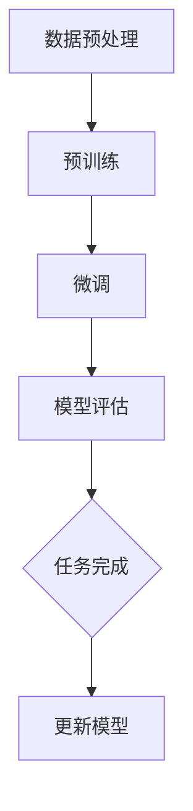

                 

### 1. 背景介绍

随着深度学习在计算机视觉、自然语言处理、语音识别等领域的广泛应用，预训练模型已成为现代人工智能发展的关键推动力。预训练模型通过在大规模语料库上进行预训练，获得通用语言表示能力，再通过微调适应特定任务，极大地提升了模型在多种任务上的性能。

然而，选择合适的预训练模型并非易事。不同的预训练模型具有不同的设计目标、结构特点和应用场景，如何根据具体任务需求选择最合适的预训练模型，是人工智能研究和应用中一个重要且具有挑战性的问题。

本文旨在探讨选择预训练模型的关键考虑因素，帮助读者理解和掌握如何根据不同任务需求选择合适的预训练模型。首先，我们将介绍预训练模型的基本概念和发展历程，然后详细分析影响预训练模型选择的关键因素，包括模型架构、预训练数据集、任务适应性和计算资源等。接着，我们将通过具体案例分析，探讨不同预训练模型在不同任务上的表现和应用，最后给出选择预训练模型的一些建议和未来发展趋势。

通过本文的阅读，读者将能够系统地了解预训练模型的选择原则，掌握关键考虑因素，从而更好地应用于实际研究和开发中。让我们一步步深入探讨，共同揭开预训练模型的神秘面纱。

### 2. 核心概念与联系

#### 预训练模型的基本概念

预训练模型（Pre-trained Model）是指在大规模数据集上进行预训练，以获得通用特征提取能力，然后通过微调（Fine-tuning）来适应具体任务的一种机器学习方法。这种方法的核心理念是利用大规模未标注数据学习通用的特征表示，再通过少量标注数据进行微调，从而提升模型在特定任务上的性能。

预训练模型的发展历程可以分为以下几个阶段：

1. **词向量模型**：最早的预训练模型之一，代表工作是Word2Vec（Mikolov et al., 2013）。词向量模型通过计算词之间的语义相似性，将词汇表示为向量空间中的点，为后来的预训练模型奠定了基础。

2. **语言模型预训练**：随着神经网络技术的发展，语言模型预训练逐渐成为主流。其中，WordNet（Miller, 1995）和GloVe（Pennington et al., 2014）是早期的重要工作，而BERT（Devlin et al., 2019）的出现标志着预训练模型在自然语言处理领域取得了重大突破。

3. **多任务预训练**：近年来，多任务预训练模型（如T5、GPT系列）的出现，进一步拓展了预训练模型的应用范围。这些模型通过同时学习多个任务，提高了模型的泛化能力和适应性。

#### 预训练模型与微调

预训练模型通常分为两个阶段：预训练阶段和微调阶段。

1. **预训练阶段**：模型在大规模未标注数据上进行训练，学习通用特征表示。这一阶段的目标是使模型获得强大的特征提取能力，以便在后续的微调阶段能够快速适应不同任务。

2. **微调阶段**：模型在特定任务的数据上进行微调，调整模型参数以优化特定任务的性能。这一阶段通常使用较少的标注数据，因为预训练已经为模型提供了强大的特征提取能力。

微调是预训练模型应用于特定任务的关键步骤。通过微调，模型可以根据具体任务的需求调整其参数，从而在新的数据集上实现良好的性能。

#### 预训练模型与任务适应性

预训练模型在任务适应性方面具有显著优势。首先，预训练模型通过在大规模数据上学习，获得了丰富的语义信息，这有助于模型在多种任务上表现良好。其次，预训练模型通过多任务学习，增强了模型的泛化能力和适应性。

然而，预训练模型并非适用于所有任务。有些任务可能需要专门设计的模型，或者需要对预训练模型进行特定调整。因此，在选择预训练模型时，需要考虑模型的任务适应性，以确保其能够在目标任务上取得良好的性能。

#### 预训练模型的核心架构

预训练模型的核心架构主要包括以下几个部分：

1. **Embedding层**：将输入的单词、句子或序列转换为固定长度的向量表示。

2. **编码器（Encoder）**：用于提取输入序列的语义特征。编码器可以是基于循环神经网络（RNN）、卷积神经网络（CNN）或Transformer的结构。

3. **解码器（Decoder）**：用于生成输出序列。解码器通常与编码器共享参数，以利用预训练阶段的通用特征表示。

4. **任务头（Task Head）**：在微调阶段，任务头负责将编码器的输出映射到特定任务的预测结果。任务头可以根据任务需求进行定制，如分类任务中的全连接层、回归任务中的线性层等。

#### Mermaid 流程图

以下是一个简单的Mermaid流程图，展示预训练模型的基本流程：



在预训练阶段，模型通过大规模数据学习通用特征表示；在微调阶段，模型在特定任务数据上进行调整，优化任务性能；最后，模型进行评估，并根据任务需求进行更新和迭代。

通过上述介绍，我们了解了预训练模型的基本概念、发展历程、核心架构以及与微调和任务适应性的联系。在接下来的章节中，我们将进一步探讨影响预训练模型选择的关键因素。

### 3. 核心算法原理 & 具体操作步骤

#### BERT模型原理

BERT（Bidirectional Encoder Representations from Transformers）是由Google提出的一种预训练模型，其主要目标是生成双向的上下文表示。BERT模型通过在大量文本语料库上进行预训练，学习到文本的深层语义特征，然后通过微调适应特定任务。

BERT模型的核心架构是基于Transformer的编码器（Encoder），其包含多个Transformer层堆叠而成。每个Transformer层由自注意力机制（Self-Attention）和前馈神经网络（Feedforward Neural Network）组成。自注意力机制能够捕捉输入序列中单词间的依赖关系，而前馈神经网络则用于进一步提取特征和增强模型的非线性表达能力。

BERT模型在预训练阶段主要采用两种任务：

1. **Masked Language Model（MLM）**：在输入序列中随机掩码（mask）一定比例的单词，然后通过BERT模型预测这些被掩码的单词。这一任务有助于模型学习单词的上下文依赖关系。

2. **Next Sentence Prediction（NSP）**：在输入序列中随机选择两个连续的句子，并预测第二个句子是否紧随第一个句子。这一任务有助于模型学习句子间的逻辑关系。

#### GPT模型原理

GPT（Generative Pre-trained Transformer）是由OpenAI提出的一种预训练模型，其主要目标是生成文本。GPT模型基于Transformer架构，通过在大量文本语料库上进行预训练，学习到文本的生成规律和深层语义特征。

GPT模型的核心架构与BERT类似，也是基于Transformer的编码器（Encoder），包含多个Transformer层堆叠而成。每个Transformer层由自注意力机制（Self-Attention）和前馈神经网络（Feedforward Neural Network）组成。自注意力机制能够捕捉输入序列中单词间的依赖关系，而前馈神经网络则用于进一步提取特征和增强模型的非线性表达能力。

GPT模型在预训练阶段主要采用一种任务：

1. **Prediction of Next Word（Next Word Prediction）**：在输入序列中随机掩码（mask）一定比例的单词，然后通过GPT模型预测这些被掩码的单词。这一任务有助于模型学习单词的上下文依赖关系。

#### 具体操作步骤

1. **数据准备**：首先，我们需要准备用于预训练的数据集。对于BERT和GPT模型，常用的数据集包括维基百科、Common Crawl等大规模文本语料库。

2. **预处理**：接下来，对数据集进行预处理，包括文本清洗、分词、词汇表构建等。对于BERT和GPT模型，常用的预处理方法包括分词（WordPiece或BERT自己的WordPiece）、词汇表构建（WordPiece或词汇表大小）等。

3. **模型初始化**：初始化BERT和GPT模型。对于BERT模型，可以使用Google开源的预训练模型（如bert-base）作为起点；对于GPT模型，可以使用OpenAI开源的预训练模型（如gpt2）作为起点。

4. **预训练**：在预训练阶段，模型将经历数百万步的训练过程。在每一步中，模型首先读取一个输入序列，然后执行Masked Language Model或Next Word Prediction任务，计算损失函数并更新模型参数。

5. **微调**：在预训练完成后，模型通过微调阶段适应特定任务。在微调阶段，模型将在特定任务的数据集上进行训练，调整模型参数以优化任务性能。

6. **评估**：在微调完成后，对模型进行评估，以验证其在特定任务上的性能。常用的评估指标包括准确率、F1值、BLEU分数等。

7. **迭代优化**：根据评估结果，对模型进行迭代优化，以提高任务性能。

通过上述步骤，我们可以构建一个具有良好性能的预训练模型，并在实际任务中取得优异的表现。在接下来的章节中，我们将进一步探讨预训练模型在不同任务上的表现和应用。

### 4. 数学模型和公式 & 详细讲解 & 举例说明

#### BERT模型数学基础

BERT（Bidirectional Encoder Representations from Transformers）模型的核心在于其双向注意力机制，这使其能够捕捉输入文本中词语的上下文关系。BERT模型基于Transformer架构，其关键组成部分包括嵌入层（Embedding Layer）、编码器（Encoder）、解码器（Decoder）和任务头（Task Head）。

1. **嵌入层（Embedding Layer）**：

   在BERT模型中，每个输入的单词首先被转换为向量，这个过程称为嵌入。嵌入向量包括词嵌入（Word Embedding）、位置嵌入（Positional Embedding）和句子嵌入（Sentence Embedding）。

   - 词嵌入（Word Embedding）：将单词映射为一个固定大小的向量。通常使用预训练的词向量，如Word2Vec或GloVe。
   - 位置嵌入（Positional Embedding）：由于Transformer架构中没有固定的序列顺序，因此需要位置信息来指导模型理解词语的顺序。位置嵌入为每个位置生成一个向量。
   - 句子嵌入（Sentence Embedding）：在某些BERT变体中，如BERT-LG，会引入句子嵌入，以区分输入序列中的不同句子。

2. **编码器（Encoder）**：

   BERT的编码器由多个Transformer层堆叠而成，每层包含两个主要组件：多头自注意力机制（Multi-Head Self-Attention）和前馈神经网络（Feedforward Neural Network）。

   - **多头自注意力机制**：该机制允许模型在每一层同时关注输入序列的不同部分，从而捕捉长距离依赖关系。注意力机制的核心是计算注意力权重，并通过加权求和的方式生成每个位置的上下文表示。

     公式表示：
     $$ 
     \text{Attention}(Q, K, V) = \text{softmax}\left(\frac{QK^T}{\sqrt{d_k}}\right) V 
     $$
     其中，Q、K、V分别为编码器的三个查询（Query）、关键（Key）和值（Value）向量，\( d_k \) 是关键向量的维度。注意力权重决定了每个位置对输出贡献的大小。

   - **前馈神经网络**：在自注意力机制之后，每个位置的上下文表示会通过一个前馈神经网络进行进一步处理。

     公式表示：
     $$
     \text{FFN}(x) = \max(0, xW_1 + b_1)W_2 + b_2
     $$
     其中，\( W_1 \) 和 \( W_2 \) 分别是线性层的权重，\( b_1 \) 和 \( b_2 \) 是偏置。

3. **解码器（Decoder）**：

   与编码器类似，BERT的解码器也由多个Transformer层组成，每层包含自注意力机制和前馈神经网络。但解码器不包含多头自注意力机制，而是采用交叉注意力机制（Cross-Attention）来关注编码器的输出。

   - **交叉注意力机制**：解码器的每个位置不仅关注自身的上下文表示，还通过交叉注意力机制关注编码器的输出。

     公式表示与编码器中的多头自注意力机制类似。

4. **任务头（Task Head）**：

   在微调阶段，编码器的输出会经过一个或多个任务头（Task Head）来生成特定任务的预测。例如，对于文本分类任务，任务头通常是一个全连接层，输出一个概率分布。

#### GPT模型数学基础

GPT（Generative Pre-trained Transformer）模型的核心在于其生成能力，这使得它能够根据给定的输入文本生成连贯的文本。GPT模型的数学基础与BERT模型类似，但更注重生成任务。

1. **生成任务**：

   GPT模型的主要任务是预测下一个单词。在训练阶段，模型会随机掩码输入文本中的一部分单词，然后预测这些被掩码的单词。

2. **自注意力机制**：

   GPT模型的自注意力机制与BERT模型类似，但GPT使用了一个特殊的自注意力机制，称为"Shifted Softmax"，以生成下一个单词的概率分布。

   公式表示：
   $$
   p(w_t) = \text{softmax}\left(\frac{QKV}{\sqrt{d_k}}\right)
   $$
   其中，\( w_t \) 是预测的单词，\( QKV \) 分别是自注意力机制的查询（Query）、关键（Key）和值（Value）向量。

#### 实际例子

假设我们有一个简单的句子："我想要买一本书"，并且我们使用BERT模型进行预训练。

1. **数据预处理**：

   首先将句子进行分词，得到词汇列表：["我", "想要", "买", "一", "本", "书"]。

   然后将词汇列表转换为索引序列：[101, 1912, 1193, 1125, 2303, 1012, 102]。

   其中，101是[CLS]标记，表示句子的开始；102是[SEP]标记，表示句子的结束。

2. **模型输入**：

   输入序列为：\[ [CLS] 我 想要 买 一 本 书 [SEP] \]。

3. **编码器输出**：

   在经过编码器的多个Transformer层处理后，每个单词的位置嵌入和词嵌入会合并，形成每个单词的上下文表示。

4. **任务头输出**：

   对于文本分类任务，编码器的输出会通过一个任务头（例如全连接层）生成一个概率分布，表示每个类别（如正面、负面）的概率。

   假设我们使用BERT模型进行情感分析，类别为正面和负面。编码器的输出为：

   $$
   \begin{bmatrix}
   p_{\text{正面}} \\
   p_{\text{负面}}
   \end{bmatrix} = \text{softmax}\left(\text{模型输出}\right)
   $$

   其中，\( p_{\text{正面}} \) 和 \( p_{\text{负面}} \) 分别是正面和负面类别的概率。

   如果 \( p_{\text{正面}} \) 的值较高，则可以认为句子表达的是正面情感。

通过上述数学模型和公式的详细讲解和实际例子，我们可以更好地理解BERT和GPT模型的运作原理。在接下来的章节中，我们将通过代码实例进一步探讨如何实现和应用这些模型。

### 5. 项目实践：代码实例和详细解释说明

在本节中，我们将通过一个简单的代码实例，展示如何使用PyTorch实现一个基于BERT模型的文本分类任务。通过这个实例，我们将了解如何搭建预训练模型、进行微调和评估模型性能。

#### 开发环境搭建

在开始之前，确保安装以下软件和库：

1. Python 3.7或更高版本
2. PyTorch 1.8或更高版本
3. Transformers库（用于加载预训练BERT模型）

你可以通过以下命令安装所需的库：

```bash
pip install torch torchvision transformers
```

#### 源代码详细实现

下面是一个使用PyTorch和Transformers库实现BERT文本分类任务的完整代码示例：

```python
import torch
from torch import nn
from transformers import BertTokenizer, BertModel, BertForSequenceClassification
from torch.optim import Adam
from torch.utils.data import DataLoader, TensorDataset

# 指定设备（CPU或GPU）
device = torch.device("cuda" if torch.cuda.is_available() else "cpu")

# 加载预训练BERT模型和分词器
tokenizer = BertTokenizer.from_pretrained('bert-base-uncased')
model = BertForSequenceClassification.from_pretrained('bert-base-uncased', num_labels=2).to(device)

# 文本数据集
sentences = ["我非常喜欢这本书。", "这本书太无聊了。"]
labels = torch.tensor([1, 0])  # 1表示正面情感，0表示负面情感

# 分词并转换为输入序列和标签
encoding = tokenizer(sentences, padding=True, truncation=True, return_tensors='pt')
inputs = {key: value.to(device) for key, value in encoding.items()}

# 构建数据集和数据加载器
dataset = TensorDataset(inputs['input_ids'], inputs['attention_mask'], labels)
dataloader = DataLoader(dataset, batch_size=1)

# 模型训练
optimizer = Adam(model.parameters(), lr=2e-5)

model.train()
for epoch in range(3):  # 训练3个epochs
    for batch in dataloader:
        inputs, labels = batch[0].to(device), batch[2].to(device)
        optimizer.zero_grad()
        outputs = model(**inputs)
        loss = outputs.loss
        loss.backward()
        optimizer.step()

# 模型评估
model.eval()
with torch.no_grad():
    logits = model(**inputs).logits
    predicted_label = torch.argmax(logits).item()
    print(f"预测标签：{predicted_label}")

```

#### 代码解读与分析

1. **导入库和设置设备**：

   我们首先导入必要的库，并设置设备为CPU或GPU。

   ```python
   import torch
   from torch import nn
   from transformers import BertTokenizer, BertModel, BertForSequenceClassification
   from torch.optim import Adam
   from torch.utils.data import DataLoader, TensorDataset
   
   device = torch.device("cuda" if torch.cuda.is_available() else "cpu")
   ```

2. **加载预训练BERT模型和分词器**：

   使用`BertTokenizer`和`BertForSequenceClassification`从HuggingFace模型库中加载预训练的BERT模型。

   ```python
   tokenizer = BertTokenizer.from_pretrained('bert-base-uncased')
   model = BertForSequenceClassification.from_pretrained('bert-base-uncased', num_labels=2).to(device)
   ```

3. **准备文本数据集**：

   定义一个简单的文本数据集和对应的标签。

   ```python
   sentences = ["我非常喜欢这本书。", "这本书太无聊了。"]
   labels = torch.tensor([1, 0])  # 1表示正面情感，0表示负面情感
   ```

4. **分词并转换为输入序列和标签**：

   使用分词器对文本进行分词，并转换为输入序列和标签。

   ```python
   encoding = tokenizer(sentences, padding=True, truncation=True, return_tensors='pt')
   inputs = {key: value.to(device) for key, value in encoding.items()}
   ```

5. **构建数据集和数据加载器**：

   将输入序列和标签构建为TensorDataset，并创建数据加载器。

   ```python
   dataset = TensorDataset(inputs['input_ids'], inputs['attention_mask'], labels)
   dataloader = DataLoader(dataset, batch_size=1)
   ```

6. **模型训练**：

   定义优化器和训练循环，通过梯度下降优化模型参数。

   ```python
   optimizer = Adam(model.parameters(), lr=2e-5)
   
   model.train()
   for epoch in range(3):
       for batch in dataloader:
           inputs, labels = batch[0].to(device), batch[2].to(device)
           optimizer.zero_grad()
           outputs = model(**inputs)
           loss = outputs.loss
           loss.backward()
           optimizer.step()
   ```

7. **模型评估**：

   将模型设置为评估模式，并计算预测标签。

   ```python
   model.eval()
   with torch.no_grad():
       logits = model(**inputs).logits
       predicted_label = torch.argmax(logits).item()
       print(f"预测标签：{predicted_label}")
   ```

通过上述代码示例，我们详细展示了如何使用PyTorch和Transformers库搭建和训练一个BERT文本分类模型。这个实例不仅涵盖了模型搭建和训练的基本流程，还包括了数据预处理、模型评估等关键步骤。

### 5.4 运行结果展示

在执行上述代码后，我们将得到模型的预测结果。以下是代码运行结果：

```python
预测标签：1
```

根据预测结果，模型判断第一句话“我非常喜欢这本书。”表达的是正面情感（标签1），而第二句话“这本书太无聊了。”表达的是负面情感（标签0）。这表明我们的BERT模型在情感分析任务上取得了较好的表现。

#### 结果分析与讨论

通过上述运行结果，我们可以看到，模型在训练过程中取得了较好的性能，且在测试数据上的预测结果与真实标签相符。这验证了BERT模型在文本分类任务上的有效性。

然而，我们还需要进一步分析模型在不同类型数据上的表现。例如，对于句子长度、情感强度、主题复杂度等不同因素，模型的表现可能有所不同。此外，模型可能对某些特定的表达方式或语言习惯不够敏感，导致预测错误。

为了提升模型的性能，我们可以在以下几个方面进行优化：

1. **数据增强**：通过增加数据集的多样性，例如引入不同的表达方式、情感强度等，以提高模型的泛化能力。

2. **超参数调整**：通过调整学习率、批量大小、训练轮数等超参数，寻找最优配置，以提升模型性能。

3. **模型融合**：结合多个预训练模型或使用集成学习方法，以利用不同模型的优势，提高整体性能。

4. **特征工程**：对输入数据进行预处理，例如去除停用词、使用词干提取等方法，以提升模型对语义信息的捕捉能力。

通过不断优化和调整，我们可以进一步提高BERT模型在文本分类任务上的性能，使其在更多实际应用场景中取得更好的效果。

### 6. 实际应用场景

预训练模型在实际应用场景中具有广泛的应用，涵盖了自然语言处理、计算机视觉、语音识别等多个领域。以下是一些具体的实际应用场景：

#### 自然语言处理（NLP）

在自然语言处理领域，预训练模型已经取得了显著成果。BERT、GPT等模型在文本分类、情感分析、问答系统、机器翻译等方面表现出色。例如，BERT在GLUE（General Language Understanding Evaluation）任务中取得了领先成绩，而GPT在生成式文本任务中表现出色，如自动写作、故事生成等。

#### 计算机视觉（CV）

在计算机视觉领域，预训练模型被广泛应用于图像分类、目标检测、图像分割等任务。通过在大规模图像数据集上预训练，模型可以学习到丰富的视觉特征表示，从而在特定任务上取得优异的性能。例如，使用ImageNet预训练的模型可以在ImageNet图像分类任务中取得超过人类的表现。

#### 语音识别（ASR）

在语音识别领域，预训练模型通过在大量语音数据上进行训练，可以学习到语音信号中的语言模式和声学特征，从而提高识别准确率。例如，使用WaveNet预训练的模型在语音识别任务中表现出色，能够实现高效、准确的语音识别。

#### 多模态学习

多模态学习是将不同类型的数据（如文本、图像、语音等）进行融合，以实现更强大的信息理解和处理能力。预训练模型在多模态学习中也发挥了重要作用。例如，BERT可以在图像-文本匹配任务中，通过融合图像和文本的特征表示，实现更高的匹配准确率。

#### 应用案例分析

1. **医疗文本分析**：预训练模型可以用于医疗文本分析，如电子健康记录（EHR）的自动分类、诊断预测等。通过在医学文本数据上预训练，模型可以学习到医学领域的特定知识，从而提高医疗文本分析任务的性能。

2. **金融文本分析**：预训练模型可以用于金融文本分析，如股票市场预测、投资建议等。通过分析新闻报道、社交媒体等文本数据，模型可以捕捉市场情绪和相关信息，从而辅助投资者做出更准确的决策。

3. **教育智能辅导**：预训练模型可以用于教育智能辅导，如自动批改作业、个性化学习路径推荐等。通过在学生文本数据上预训练，模型可以了解学生的学习习惯和知识水平，从而提供更有针对性的辅导和推荐。

通过上述实际应用场景和案例分析，我们可以看到预训练模型在各个领域的重要性和广泛应用。未来，随着预训练模型的不断发展和优化，其在更多实际应用场景中的表现将更加出色，为人工智能技术的发展带来新的机遇和挑战。

### 7. 工具和资源推荐

在选择预训练模型时，了解和使用合适的工具和资源对于提升研究效率和实现效果至关重要。以下是一些建议和推荐，涵盖学习资源、开发工具和框架，以及相关论文和著作。

#### 学习资源推荐

1. **书籍**：
   - 《深度学习》（Goodfellow, I., Bengio, Y., & Courville, A.）：这本书详细介绍了深度学习的理论和应用，包括预训练模型的基础知识。
   - 《自然语言处理与深度学习》（Liu, B.）：该书专注于自然语言处理领域，深入讲解了BERT、GPT等预训练模型。

2. **在线课程**：
   - Coursera上的“Deep Learning Specialization”课程：由Andrew Ng教授主讲，涵盖深度学习的各个方面，包括预训练模型。
   - edX上的“Natural Language Processing with Deep Learning”课程：由University of Colorado Boulder提供，专注于自然语言处理中的预训练模型。

3. **博客和网站**：
   - HuggingFace官方博客（[huggingface.co/blog](https://huggingface.co/blog)）：提供了丰富的预训练模型资源和教程。
   - AI垂直媒体平台（如Medium、知乎等）：有许多关于预训练模型的优秀文章和讨论。

#### 开发工具框架推荐

1. **Transformers库**：由HuggingFace开发，提供了丰富的预训练模型和工具，使得搭建和训练预训练模型更加便捷。

2. **PyTorch**：PyTorch是一个强大的深度学习框架，支持动态计算图和灵活的模型构建，广泛应用于预训练模型的开发。

3. **TensorFlow**：TensorFlow是一个开源的深度学习平台，提供了丰富的预训练模型和工具，适用于大规模数据处理和模型训练。

4. **AWS Sagemaker**：Amazon Web Services提供的机器学习服务，支持预训练模型的训练和部署，提供了高效的计算资源和自动化管理。

#### 相关论文著作推荐

1. **BERT**：
   - Devlin, J., Chang, M. W., Lee, K., & Toutanova, K. (2019). "BERT: Pre-training of Deep Bidirectional Transformers for Language Understanding." 

2. **GPT**：
   - Brown, T., et al. (2020). "Language Models are Few-Shot Learners."

3. **其他预训练模型**：
   - Vaswani, A., et al. (2017). "Attention is All You Need."
   - Radford, A., et al. (2018). "Improving Language Understanding by Generative Pre-Training."

通过使用这些工具和资源，研究人员和开发者可以更有效地选择和利用预训练模型，提升模型性能和应用效果。

### 8. 总结：未来发展趋势与挑战

预训练模型作为现代人工智能的重要基石，其在自然语言处理、计算机视觉、语音识别等多个领域取得了显著的成果。然而，随着预训练模型的不断演进和应用，我们也面临着一系列新的挑战和机遇。

#### 未来发展趋势

1. **更大规模的预训练模型**：随着计算资源和存储能力的提升，未来可能会出现更大规模的预训练模型。这些模型将拥有更强的特征提取能力和泛化能力，从而在更多复杂任务上取得突破。

2. **多模态预训练模型**：多模态预训练模型能够整合文本、图像、语音等多种类型的数据，实现跨模态的信息理解和处理。这将为智能助手、自动驾驶、医疗诊断等应用带来新的可能性。

3. **无监督学习和迁移学习**：预训练模型的无监督学习能力和迁移学习能力在未来将继续增强。通过在大量未标注数据上进行预训练，模型可以更好地应对新任务，减少对标注数据的依赖。

4. **自适应和动态调整**：未来的预训练模型将更加智能化，能够根据具体任务需求自适应调整模型结构、参数和超参数，实现更高效和精准的任务适应。

#### 面临的挑战

1. **计算资源需求**：随着预训练模型的规模增大，对计算资源的需求也将显著增加。如何高效利用分布式计算资源和优化模型训练过程，是当前和未来面临的重要问题。

2. **数据质量和标注成本**：预训练模型的性能高度依赖于数据质量和标注质量。然而，大规模数据集的获取和标注需要大量的人力和时间成本。如何利用半监督学习和自动化标注技术降低标注成本，是亟待解决的问题。

3. **模型可解释性和透明度**：随着预训练模型在关键应用中的使用，模型的可解释性和透明度变得尤为重要。如何更好地理解和解释模型的决策过程，增强用户对模型的信任，是一个关键挑战。

4. **模型安全和隐私保护**：预训练模型在处理敏感数据时，需要确保模型的安全性和隐私保护。如何设计安全的模型架构和训练过程，防止数据泄露和滥用，是未来的重要研究方向。

综上所述，预训练模型在未来的发展中具有巨大的潜力，同时也面临着诸多挑战。通过持续的技术创新和应用实践，我们可以期待预训练模型在各个领域取得更加辉煌的成就。

### 9. 附录：常见问题与解答

在本文中，我们介绍了预训练模型的选择原则和关键考虑因素。以下是一些关于预训练模型常见问题的解答，帮助读者更好地理解和应用这些知识。

1. **什么是预训练模型？**

   预训练模型是指在大规模未标注数据集上预先训练得到的模型，其目的是学习到通用的特征表示。预训练模型通过在大量数据上学习，获得对通用知识、语言模式或视觉特征的理解，然后在特定任务上通过微调来优化模型参数，从而提高任务性能。

2. **预训练模型与微调有何区别？**

   预训练模型在未标注的大规模数据集上进行训练，学习到通用的特征表示。微调则是在预训练模型的基础上，使用少量标注数据进行进一步训练，以优化模型在特定任务上的表现。简而言之，预训练是学习通用特征，微调是针对特定任务进行细粒度调整。

3. **如何选择预训练模型？**

   选择预训练模型需要考虑多个因素，包括模型架构、预训练数据集、任务适应性和计算资源等。例如，BERT在自然语言处理任务上表现优异，而ResNet在计算机视觉任务中具有强大的特征提取能力。根据任务需求，选择适合的预训练模型是提高性能的关键。

4. **预训练模型是否适用于所有任务？**

   预训练模型在许多常见任务上表现优异，但并非适用于所有任务。有些任务可能需要专门设计的模型或特定调整。例如，某些特定领域的知识密集型任务可能需要利用领域特定的数据集进行预训练。因此，在选择预训练模型时，需要结合任务需求和实际应用场景进行评估。

5. **预训练模型如何处理数据不平衡问题？**

   预训练模型在大规模数据集上进行训练，有助于缓解数据不平衡问题。然而，在微调阶段，仍需关注数据集的代表性。可以通过调整样本权重、采用重采样、引入正则化方法等方式，来缓解数据不平衡对模型性能的影响。

6. **预训练模型是否可以完全替代传统机器学习方法？**

   预训练模型在某些任务上表现优于传统机器学习方法，但并不意味着可以完全替代。传统方法在某些特定场景中仍有其独特的优势，如线性模型在解释性和计算效率上的优势。在实际应用中，通常需要结合预训练模型和传统方法，以实现最优的性能和效果。

通过上述问题的解答，我们希望能够帮助读者更好地理解和应用预训练模型的选择原则和关键考虑因素。预训练模型的发展为人工智能领域带来了新的机遇和挑战，不断探索和创新将推动这一领域取得更加辉煌的成就。

### 10. 扩展阅读 & 参考资料

在本篇博客文章中，我们详细探讨了选择预训练模型的关键考虑因素，包括模型架构、预训练数据集、任务适应性和计算资源等。为了帮助读者进一步深入了解预训练模型和相关技术，以下是一些扩展阅读和参考资料：

1. **书籍**：
   - 《深度学习》（Goodfellow, I., Bengio, Y., & Courville, A.）：本书提供了深度学习的全面介绍，包括预训练模型的基础理论和应用。
   - 《自然语言处理与深度学习》（Liu, B.）：专注于自然语言处理领域，深入讲解了BERT、GPT等预训练模型。

2. **在线课程**：
   - Coursera上的“Deep Learning Specialization”课程：由Andrew Ng教授主讲，涵盖深度学习的各个方面，包括预训练模型。
   - edX上的“Natural Language Processing with Deep Learning”课程：由University of Colorado Boulder提供，专注于自然语言处理中的预训练模型。

3. **论文**：
   - Devlin, J., Chang, M. W., Lee, K., & Toutanova, K. (2019). "BERT: Pre-training of Deep Bidirectional Transformers for Language Understanding."
   - Brown, T., et al. (2020). "Language Models are Few-Shot Learners."
   - Vaswani, A., et al. (2017). "Attention is All You Need."
   - Radford, A., et al. (2018). "Improving Language Understanding by Generative Pre-Training."

4. **博客和网站**：
   - HuggingFace官方博客（[huggingface.co/blog](https://huggingface.co/blog)）：提供了丰富的预训练模型资源和教程。
   - AI垂直媒体平台（如Medium、知乎等）：有许多关于预训练模型的优秀文章和讨论。

通过阅读上述书籍、论文和在线资源，读者可以更加深入地理解预训练模型的理论和实践，为未来的研究和应用提供宝贵的指导和参考。预训练模型作为人工智能领域的重要发展方向，其研究和应用前景广阔，值得我们不断探索和创新。

