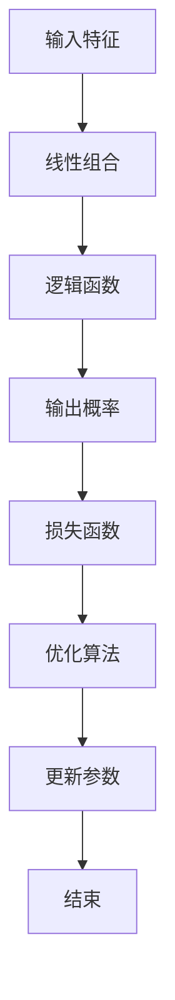

                 

### 背景介绍

逻辑回归（Logistic Regression）是一种广泛用于分类问题的统计方法。它起源于20世纪初，由统计学家罗斯洛斯·皮尔森（R.A. Fisher）提出。逻辑回归在医学、金融、市场营销等多个领域有着重要的应用，特别是在处理二分类问题方面，具有显著的优势。

在分类问题中，我们通常希望根据输入的特征来预测某个样本属于某一类别（如“是否患病”、“是否违约”等）。而逻辑回归正是为了解决这种问题而设计的。相比于其他分类算法，如决策树、支持向量机等，逻辑回归的模型简单、易于理解和实现，并且具备良好的预测性能。

逻辑回归不仅在理论上具有重要地位，而且在实际应用中也展现出了强大的优势。它不仅可以处理线性可分的数据，还能通过增加多项式特征来处理非线性问题。此外，逻辑回归在多类别分类问题中，通过扩展为多项逻辑回归（Multinomial Logistic Regression）同样表现优秀。

总之，逻辑回归作为一种经典的分类算法，其在理论和实践中的应用价值不容忽视。下面，我们将深入探讨逻辑回归的原理、数学模型以及实际操作过程。

## 1.1 逻辑回归的定义及应用

逻辑回归，也称为逻辑斯蒂回归（Logistic Regression），是一种广义线性模型（Generalized Linear Model, GLM），主要用于处理二分类问题。其核心思想是通过一个线性模型来预测某个事件发生的概率，然后利用这个概率来进行分类。

逻辑回归的定义可以表述为：给定一组输入特征 $X$，我们希望预测一个二分类输出变量 $Y$。逻辑回归模型通过一个线性变换 $Z = \beta_0 + \beta_1X_1 + \beta_2X_2 + ... + \beta_nX_n$ 来预测 $Y$ 的概率。其中，$Z$ 是线性组合，$\beta_0$ 是截距，$\beta_1, \beta_2, ..., \beta_n$ 是各个特征的系数。

具体来说，逻辑回归模型主要用于以下场景：

1. **医学诊断**：例如，根据患者的年龄、性别、病史等特征，预测其是否患有某种疾病。
2. **信用评分**：根据个人的财务状况、信用记录等特征，评估其是否具有违约风险。
3. **市场预测**：例如，根据消费者的购买行为、浏览记录等，预测其是否会购买某种商品。
4. **社交媒体分析**：通过用户的点赞、评论等行为，预测用户是否会转发某个内容。

逻辑回归在处理二分类问题时，具有以下优点：

- **简单直观**：逻辑回归的模型简单，易于理解和实现。
- **易于扩展**：逻辑回归不仅可以处理线性问题，还能通过多项式特征扩展到非线性问题。
- **良好的预测性能**：逻辑回归在二分类问题中通常能够取得较好的预测效果。
- **概率解释**：逻辑回归模型输出的是事件发生的概率，这对于后续决策有重要意义。

总之，逻辑回归作为一种经典的分类算法，在理论和实践中都具有重要价值。接下来，我们将深入探讨逻辑回归的数学模型和算法原理。

### 1.2 逻辑回归的历史与发展

逻辑回归作为一种统计学方法，起源于20世纪初，由著名的统计学家罗斯洛斯·皮尔森（R.A. Fisher）于1930年代提出。当时，皮尔森基于生物学中的二分类问题，探讨了如何通过线性模型来预测事件发生的概率，并提出了逻辑回归的基本概念。

逻辑回归的提出，是统计学领域的一项重要进展，它不仅为解决二分类问题提供了一种新的方法，而且为后续的统计建模技术奠定了基础。在皮尔森之后，逻辑回归逐渐被广泛应用于医学、社会科学、工程等领域，成为了统计分析和数据挖掘中的基本工具。

随着时间的推移，逻辑回归的理论和方法不断得到完善和发展。20世纪50年代至70年代，统计学家们开始关注逻辑回归模型的假设检验和变量选择问题，提出了多种改进方法，如似然比检验（Likelihood Ratio Test）、逐步回归（Stepwise Regression）等。

进入21世纪，随着计算技术的发展和大数据的兴起，逻辑回归的应用场景更加广泛。特别是机器学习领域的兴起，使得逻辑回归不仅作为一种独立的方法，还与其他算法相结合，形成了多种综合模型。例如，逻辑回归与支持向量机（SVM）的结合，形成了逻辑回归SVM；与集成学习方法结合，形成了逻辑回归集成模型等。

此外，逻辑回归的理论基础也在不断拓展。统计学家们开始研究逻辑回归在大数据环境下的性质，如模型选择、变量重要性评估等。同时，逻辑回归的推广形式，如多项逻辑回归（Multinomial Logistic Regression）和有序逻辑回归（Ordered Logistic Regression），也在多类别分类问题中得到了广泛应用。

总之，逻辑回归自提出以来，经历了数十年的发展和完善，已经成为了统计学和机器学习领域中的重要工具。其理论和方法不仅为解决实际问题提供了有力支持，也为后续的研究和应用奠定了基础。

### 1.3 分类问题中的逻辑回归

在分类问题中，逻辑回归的核心任务是预测一个样本属于某一类别的概率，并据此进行分类决策。为了实现这一目标，逻辑回归模型通过一个线性变换和一个非线性函数，将输入特征映射到概率空间。

具体来说，逻辑回归模型首先通过一个线性函数将输入特征映射到一个实数空间，公式如下：

$$ Z = \beta_0 + \beta_1X_1 + \beta_2X_2 + ... + \beta_nX_n $$

其中，$Z$ 是线性组合，$\beta_0$ 是截距，$\beta_1, \beta_2, ..., \beta_n$ 是各个特征的系数。这一步相当于在特征空间中建立了一个超平面。

接着，逻辑回归模型使用一个非线性函数（通常是逻辑函数或 sigmoid 函数）将线性组合 $Z$ 映射到一个概率空间，公式如下：

$$ P(Y=1|X) = \frac{1}{1 + e^{-Z}} $$

其中，$P(Y=1|X)$ 表示在给定输入特征 $X$ 的情况下，样本属于类别 1 的概率。这个概率值介于 0 和 1 之间，当 $Z$ 趋近于正无穷时，$P(Y=1|X)$ 趋近于 1；当 $Z$ 趋近于负无穷时，$P(Y=1|X)$ 趋近于 0。

通过以上两步，逻辑回归模型实现了从输入特征到概率空间的映射。具体流程如下：

1. **特征输入**：给定一个样本 $X$，包括多个特征 $X_1, X_2, ..., X_n$。
2. **线性变换**：计算线性组合 $Z = \beta_0 + \beta_1X_1 + \beta_2X_2 + ... + \beta_nX_n$。
3. **非线性映射**：通过逻辑函数将 $Z$ 映射到概率空间，计算 $P(Y=1|X)$。
4. **分类决策**：根据概率值 $P(Y=1|X)$，进行分类决策。通常设定一个阈值 $\theta$，如果 $P(Y=1|X) > \theta$，则预测类别为 1；否则预测类别为 0。

通过这种方式，逻辑回归模型能够将复杂的非线性问题转化为线性问题，从而实现有效的分类预测。接下来，我们将进一步探讨逻辑回归的数学模型和公式。

### 1.4 逻辑回归的数学模型和公式

逻辑回归的数学模型基于概率论和统计学原理，其核心是通过一系列参数（权重和偏置）来预测样本属于某一类别的概率。逻辑回归的数学模型可以分为以下几个部分：

#### 1. 线性组合

逻辑回归首先将输入特征通过一个线性组合表示为一个数值，称为线性变换。线性变换的表达式如下：

$$ Z = \beta_0 + \beta_1X_1 + \beta_2X_2 + ... + \beta_nX_n $$

其中，$Z$ 是线性组合的结果，$\beta_0$ 是截距（也称为偏置），$\beta_1, \beta_2, ..., \beta_n$ 是各个特征的权重（也称为系数）。这个线性组合可以看作是在特征空间中计算一个超平面的位置。

#### 2. 逻辑函数

在得到线性组合 $Z$ 之后，逻辑回归使用逻辑函数（Sigmoid 函数）将线性组合映射到概率空间。逻辑函数的表达式如下：

$$ P(Y=1|X) = \frac{1}{1 + e^{-Z}} $$

其中，$P(Y=1|X)$ 表示在给定输入特征 $X$ 的情况下，样本属于类别 1 的概率。这个概率值介于 0 和 1 之间，当 $Z$ 趋近于正无穷时，$P(Y=1|X)$ 趋近于 1；当 $Z$ 趋近于负无穷时，$P(Y=1|X)$ 趋近于 0。逻辑函数的作用是将线性组合映射到一个介于 0 和 1 之间的概率值。

#### 3. 损失函数

在训练逻辑回归模型时，我们需要通过优化算法来找到最优的参数 $\beta_0, \beta_1, ..., \beta_n$。这个过程通常使用损失函数（也称为代价函数）来衡量模型预测值与真实标签之间的差异。逻辑回归常用的损失函数是二元交叉熵损失函数（Binary Cross-Entropy Loss），其表达式如下：

$$ J(\theta) = -\frac{1}{m} \sum_{i=1}^{m} [y_i \log(a_i) + (1 - y_i) \log(1 - a_i)] $$

其中，$J(\theta)$ 是损失函数值，$m$ 是样本数量，$y_i$ 是真实标签（0 或 1），$a_i = g(\theta^T x_i)$ 是预测概率。损失函数的目的是使得预测概率 $a_i$ 与真实标签 $y_i$ 之间的差异最小。

#### 4. 优化算法

为了找到最优的参数 $\theta$，逻辑回归通常使用梯度下降（Gradient Descent）算法。梯度下降算法通过迭代更新参数，使得损失函数值不断减小。梯度下降的更新规则如下：

$$ \theta = \theta - \alpha \nabla_{\theta} J(\theta) $$

其中，$\alpha$ 是学习率（也称为步长），$\nabla_{\theta} J(\theta)$ 是损失函数对参数 $\theta$ 的梯度。通过不断迭代，梯度下降算法能够逐渐找到最优参数，使得模型预测结果更加准确。

通过上述数学模型和公式，逻辑回归能够将输入特征映射到概率空间，并通过优化算法找到最优参数，实现有效的分类预测。接下来，我们将通过具体实例来展示逻辑回归的实现过程。

## 2. 核心概念与联系

在深入探讨逻辑回归之前，我们需要了解一些与之密切相关的基础概念，如回归分析、线性模型以及概率分布等。通过这些概念的联系，我们可以更好地理解逻辑回归的原理和实现方法。

### 2.1 回归分析

回归分析是一种用于建立因变量与自变量之间关系的方法。在回归分析中，我们通常使用一个线性模型来表示这种关系。线性模型的基本形式如下：

$$ y = \beta_0 + \beta_1x + \epsilon $$

其中，$y$ 是因变量，$x$ 是自变量，$\beta_0$ 是截距，$\beta_1$ 是斜率，$\epsilon$ 是误差项。这个模型表示因变量 $y$ 与自变量 $x$ 成正比例关系，且受到随机误差 $\epsilon$ 的影响。

回归分析可以分为线性回归和多元回归。线性回归处理单个自变量与因变量之间的关系，而多元回归处理多个自变量与因变量之间的关系。逻辑回归可以看作是线性回归的一种特殊情况，即因变量 $y$ 只有两个可能的取值（0 或 1）。

### 2.2 线性模型

线性模型是一种描述变量之间线性关系的数学模型。逻辑回归中的线性模型是指特征与权重（系数）之间的线性组合。这种组合形式不仅简单直观，而且便于计算和优化。

线性模型的一般形式如下：

$$ Z = \beta_0 + \beta_1x_1 + \beta_2x_2 + ... + \beta_nx_n $$

其中，$Z$ 是线性组合的结果，$\beta_0$ 是截距，$\beta_1, \beta_2, ..., \beta_n$ 是各个特征的权重。这个线性模型可以看作是在特征空间中建立了一个超平面，用于分隔不同的类别。

### 2.3 概率分布

概率分布是描述随机变量取值概率的函数。在逻辑回归中，概率分布用于表示因变量 $y$ 的分布情况。常用的概率分布包括正态分布、伯努利分布等。

逻辑回归中常用的概率分布是伯努利分布（Bernoulli Distribution），其概率质量函数（Probability Mass Function, PMF）如下：

$$ P(Y = y_i | \theta) = \begin{cases} 
1 - \pi & \text{if } y_i = 0 \\
\pi & \text{if } y_i = 1 
\end{cases} $$

其中，$y_i$ 是第 $i$ 个样本的因变量取值，$\pi$ 是概率参数。伯努利分布表示每个样本的因变量只可能取两个值之一（0 或 1）。

### 2.4 逻辑函数

逻辑函数（Sigmoid Function）是一种常用的非线性函数，常用于将线性模型的结果映射到概率空间。逻辑函数的表达式如下：

$$ g(z) = \frac{1}{1 + e^{-z}} $$

其中，$z$ 是输入值，$g(z)$ 是输出概率值。逻辑函数将 $z$ 的值映射到 0 到 1 之间，当 $z$ 趋近于正无穷时，$g(z)$ 趋近于 1；当 $z$ 趋近于负无穷时，$g(z)$ 趋近于 0。这个特性使得逻辑函数非常适合用于逻辑回归模型的输出层。

### 2.5 逻辑回归的核心流程

通过上述核心概念的联系，我们可以总结出逻辑回归的核心流程如下：

1. **线性组合**：给定输入特征 $X$，计算线性组合 $Z = \beta_0 + \beta_1X_1 + \beta_2X_2 + ... + \beta_nX_n$。
2. **逻辑函数**：使用逻辑函数 $g(z)$ 将线性组合 $Z$ 映射到概率空间，得到预测概率 $P(Y=1|X) = g(Z)$。
3. **损失函数**：计算损失函数 $J(\theta) = -\frac{1}{m} \sum_{i=1}^{m} [y_i \log(a_i) + (1 - y_i) \log(1 - a_i)]$，其中 $a_i = g(\theta^T x_i)$ 是预测概率。
4. **优化算法**：使用梯度下降算法更新参数 $\theta = \theta - \alpha \nabla_{\theta} J(\theta)$，使得损失函数值最小。

通过这一系列流程，逻辑回归能够将输入特征映射到概率空间，实现有效的分类预测。接下来，我们将进一步探讨逻辑回归的算法原理和具体实现过程。

### 2.6 逻辑回归的核心算法原理

逻辑回归的核心算法原理主要基于概率论和优化理论。其目的是通过优化模型参数，使得预测结果与实际标签之间的误差最小。下面我们将详细阐述逻辑回归的优化过程，包括目标函数、损失函数以及优化算法。

#### 2.6.1 目标函数

逻辑回归的目标函数是最大化似然函数（Maximum Likelihood Estimation, MLE），其目的是找到最有可能生成观察数据的模型参数。似然函数定义为数据集在给定模型参数下的概率，具体形式如下：

$$ L(\theta) = \prod_{i=1}^{m} P(y_i | x_i; \theta) $$

其中，$L(\theta)$ 是似然函数，$m$ 是样本数量，$y_i$ 是第 $i$ 个样本的标签，$x_i$ 是第 $i$ 个样本的特征向量，$\theta$ 是模型参数。似然函数的值越大，表示模型参数与数据的匹配程度越高。

为了便于计算，通常将对数似然函数作为优化目标。对数似然函数是似然函数的自然对数形式，其形式如下：

$$ \ell(\theta) = \log L(\theta) = \sum_{i=1}^{m} \log P(y_i | x_i; \theta) $$

最大化对数似然函数等价于最大化似然函数。

#### 2.6.2 损失函数

逻辑回归常用的损失函数是二元交叉熵损失函数（Binary Cross-Entropy Loss），其形式如下：

$$ J(\theta) = -\frac{1}{m} \sum_{i=1}^{m} [y_i \log(a_i) + (1 - y_i) \log(1 - a_i)] $$

其中，$J(\theta)$ 是损失函数，$m$ 是样本数量，$y_i$ 是第 $i$ 个样本的标签，$a_i = g(\theta^T x_i)$ 是预测概率，$g(z)$ 是逻辑函数（Sigmoid 函数）。二元交叉熵损失函数的目的是最小化预测概率与真实标签之间的差异。

具体来说，当 $y_i = 1$ 时，损失函数的第一项 $y_i \log(a_i)$ 起主要作用，使得预测概率 $a_i$ 越接近 1，损失越小；当 $y_i = 0$ 时，损失函数的第二项 $(1 - y_i) \log(1 - a_i)$ 起主要作用，使得预测概率 $a_i$ 越接近 0，损失越小。因此，二元交叉熵损失函数能够有效推动预测概率与真实标签的匹配。

#### 2.6.3 优化算法

逻辑回归的优化算法通常使用梯度下降（Gradient Descent）算法。梯度下降算法的基本思想是通过不断更新模型参数，使得损失函数值不断减小。具体更新规则如下：

$$ \theta = \theta - \alpha \nabla_{\theta} J(\theta) $$

其中，$\theta$ 是模型参数，$\alpha$ 是学习率（步长），$\nabla_{\theta} J(\theta)$ 是损失函数对参数 $\theta$ 的梯度。通过迭代更新，梯度下降算法能够找到最优的模型参数，使得损失函数值最小。

为了加速优化过程，有时会使用一些改进的梯度下降算法，如随机梯度下降（Stochastic Gradient Descent, SGD）和自适应梯度下降（Adagrad）等。这些算法通过调整学习率或者梯度计算方式，进一步提高优化效率。

总之，逻辑回归的核心算法原理是通过最大化对数似然函数、最小化二元交叉熵损失函数以及使用梯度下降算法来优化模型参数。这一系列过程使得逻辑回归能够有效地实现分类预测。接下来，我们将通过具体实例来展示逻辑回归的实现过程。

### 2.7 Mermaid 流程图展示

为了更直观地展示逻辑回归的核心概念与流程，我们使用 Mermaid 语言绘制了一个流程图。以下是 Mermaid 流程图的代码及其可视化结果：




通过这个流程图，我们可以清晰地看到逻辑回归从输入特征到输出概率的整个过程，包括线性组合、逻辑函数、损失函数和优化算法等关键步骤。

### 3. 核心算法原理 & 具体操作步骤

逻辑回归的核心算法原理是通过线性组合和逻辑函数来预测概率，并使用损失函数和优化算法来调整模型参数。下面，我们将详细讲解逻辑回归的具体操作步骤，包括数据预处理、模型构建、参数优化和模型评估等。

#### 3.1 数据预处理

在进行逻辑回归之前，通常需要对数据进行预处理，以提高模型性能和预测精度。数据预处理主要包括以下几个步骤：

1. **数据清洗**：去除异常值、缺失值和重复数据，确保数据质量。
2. **特征工程**：根据业务需求和数据特点，构造新的特征，如多项式特征、交互特征等。
3. **数据标准化**：将特征数据进行归一化或标准化处理，使得特征之间具备相似的尺度。
4. **数据划分**：将数据集划分为训练集、验证集和测试集，用于模型训练、验证和测试。

例如，假设我们有一个二分类问题，数据集包含年龄、收入、学历等特征，以及标签变量。在进行数据预处理后，我们将特征和标签划分为如下格式：

```python
# 特征矩阵
X = [
    [25, 50000, '本科'],
    [30, 60000, '硕士'],
    [45, 80000, '博士'],
    # 更多数据...
]

# 标签向量
y = [
    0,
    1,
    1,
    # 更多数据...
]
```

#### 3.2 模型构建

逻辑回归模型的构建主要包括以下步骤：

1. **初始化参数**：随机初始化模型参数 $\beta_0, \beta_1, ..., \beta_n$。
2. **定义损失函数**：通常使用二元交叉熵损失函数，如 $J(\theta) = -\frac{1}{m} \sum_{i=1}^{m} [y_i \log(a_i) + (1 - y_i) \log(1 - a_i)]$。
3. **定义优化算法**：选择一种优化算法，如梯度下降、随机梯度下降等。

例如，在 Python 中，我们可以使用 Scikit-learn 库构建逻辑回归模型：

```python
from sklearn.linear_model import LogisticRegression
from sklearn.model_selection import train_test_split

# 划分训练集和测试集
X_train, X_test, y_train, y_test = train_test_split(X, y, test_size=0.2, random_state=42)

# 构建逻辑回归模型
model = LogisticRegression()

# 模型训练
model.fit(X_train, y_train)

# 模型评估
accuracy = model.score(X_test, y_test)
print(f"模型准确率：{accuracy}")
```

#### 3.3 参数优化

逻辑回归的参数优化主要通过优化算法实现。以下是一个简单的梯度下降优化过程：

1. **计算梯度**：计算损失函数对模型参数的梯度，如 $\nabla_{\theta} J(\theta)$。
2. **更新参数**：根据梯度方向和步长更新模型参数，如 $\theta = \theta - \alpha \nabla_{\theta} J(\theta)$。
3. **迭代优化**：重复上述步骤，直到损失函数值收敛或达到预设迭代次数。

例如，在 Python 中，我们可以使用以下代码实现梯度下降：

```python
# 初始化模型参数
theta = np.random.rand(n_features + 1)

# 梯度下降参数
alpha = 0.01
max_iter = 1000

# 梯度下降优化
for i in range(max_iter):
    # 计算预测概率
    z = np.dot(X, theta)
    a = 1 / (1 + np.exp(-z))
    
    # 计算损失函数
    J = -1/m * (y.dot(np.log(a)) + (1 - y).dot(np.log(1 - a)))
    
    # 计算梯度
    grad = 1/m * (X.dot(a - y))
    
    # 更新参数
    theta = theta - alpha * grad

# 输出最优参数
print(f"最优参数：{theta}")
```

#### 3.4 模型评估

逻辑回归模型评估主要通过准确率（Accuracy）、召回率（Recall）、精确率（Precision）和 F1 分数（F1 Score）等指标进行。以下是一个简单的评估过程：

1. **预测**：使用训练好的模型对测试集进行预测。
2. **计算指标**：根据预测结果和真实标签，计算各个评估指标。
3. **评估模型**：综合评估指标，评估模型性能。

例如，在 Python 中，我们可以使用 Scikit-learn 库计算评估指标：

```python
from sklearn.metrics import accuracy_score, recall_score, precision_score, f1_score

# 预测测试集
y_pred = model.predict(X_test)

# 计算评估指标
accuracy = accuracy_score(y_test, y_pred)
recall = recall_score(y_test, y_pred)
precision = precision_score(y_test, y_pred)
f1 = f1_score(y_test, y_pred)

# 输出评估结果
print(f"准确率：{accuracy}")
print(f"召回率：{recall}")
print(f"精确率：{precision}")
print(f"F1 分数：{f1}")
```

通过上述步骤，我们可以构建、优化和评估一个逻辑回归模型，实现有效的分类预测。接下来，我们将通过一个具体实例来展示逻辑回归的应用和实现过程。

### 3.5 数学模型和公式

逻辑回归的数学模型是建立在概率论和统计学基础之上的。其核心在于通过一组参数来预测二分类问题的概率，并在此基础上进行分类决策。下面我们将详细讲解逻辑回归的数学模型，包括逻辑函数、损失函数、优化算法等。

#### 3.5.1 逻辑函数

逻辑回归中的逻辑函数，通常使用 sigmoid 函数（也称为 Logistic 函数）来表示。sigmoid 函数的定义如下：

$$ g(z) = \frac{1}{1 + e^{-z}} $$

其中，$z$ 是输入值，$g(z)$ 是输出概率值。sigmoid 函数将 $z$ 的值映射到 0 到 1 之间，当 $z$ 趋近于正无穷时，$g(z)$ 趋近于 1；当 $z$ 趋近于负无穷时，$g(z)$ 趋近于 0。这使得 sigmoid 函数非常适合用于将线性模型的结果映射到概率空间。

在逻辑回归中，我们通常将特征向量 $X$ 与权重向量 $\theta$ 进行点积运算，得到线性组合 $Z$：

$$ Z = \theta^T X $$

然后，通过 sigmoid 函数将 $Z$ 映射到概率空间，得到预测概率 $P(Y=1|X)$：

$$ P(Y=1|X) = g(Z) = \frac{1}{1 + e^{-\theta^T X}} $$

#### 3.5.2 损失函数

在逻辑回归中，我们使用二元交叉熵损失函数（Binary Cross-Entropy Loss Function）来衡量预测值与真实值之间的差异。二元交叉熵损失函数的定义如下：

$$ J(\theta) = -\frac{1}{m} \sum_{i=1}^{m} [y_i \log(g(\theta^T x_i)) + (1 - y_i) \log(1 - g(\theta^T x_i))] $$

其中，$m$ 是样本数量，$y_i$ 是第 $i$ 个样本的真实标签（0 或 1），$g(\theta^T x_i)$ 是第 $i$ 个样本的预测概率。这个损失函数的目的是使得预测概率 $g(\theta^T x_i)$ 与真实标签 $y_i$ 之间的差异最小。

当 $y_i = 1$ 时，损失函数的第一项 $y_i \log(g(\theta^T x_i))$ 起主要作用，希望 $g(\theta^T x_i)$ 越接近 1；当 $y_i = 0$ 时，损失函数的第二项 $(1 - y_i) \log(1 - g(\theta^T x_i))$ 起主要作用，希望 $g(\theta^T x_i)$ 越接近 0。这样，二元交叉熵损失函数可以有效地推动预测概率与真实标签的匹配。

#### 3.5.3 优化算法

在逻辑回归中，我们通常使用梯度下降算法（Gradient Descent Algorithm）来优化模型参数。梯度下降算法的基本思想是通过不断更新模型参数，使得损失函数值不断减小。

梯度下降的更新规则如下：

$$ \theta_j = \theta_j - \alpha \nabla_{\theta_j} J(\theta) $$

其中，$\theta_j$ 是第 $j$ 个参数，$\alpha$ 是学习率（learning rate），$\nabla_{\theta_j} J(\theta)$ 是损失函数对 $\theta_j$ 的梯度。

对于二元交叉熵损失函数，梯度下降的梯度计算如下：

$$ \nabla_{\theta_j} J(\theta) = \frac{1}{m} \sum_{i=1}^{m} [g(\theta^T x_i) - y_i] x_{ij} $$

其中，$x_{ij}$ 是第 $i$ 个样本的第 $j$ 个特征值。

通过迭代更新，梯度下降算法能够找到最优的参数 $\theta$，使得损失函数值最小。

#### 3.5.4 模型训练与预测

在逻辑回归中，模型训练与预测的过程如下：

1. **初始化参数**：随机初始化模型参数 $\theta$。
2. **计算预测概率**：对于每个样本，计算预测概率 $P(Y=1|X)$。
3. **计算损失函数**：计算损失函数 $J(\theta)$。
4. **计算梯度**：计算损失函数对参数的梯度 $\nabla_{\theta} J(\theta)$。
5. **更新参数**：根据梯度方向和步长更新参数 $\theta$。
6. **重复步骤2-5**，直到损失函数值收敛或达到预设迭代次数。

通过上述过程，逻辑回归模型能够学习到数据中的规律，实现有效的分类预测。

### 3.6 公式示例与推导

为了更好地理解逻辑回归的数学模型，我们通过一个简单的示例来展示公式的推导和应用。

#### 3.6.1 示例数据

假设我们有一个二分类问题，数据集包含两个特征 $X_1$ 和 $X_2$，以及标签 $Y$。数据集如下：

| 标签 $Y$ | 特征 $X_1$ | 特征 $X_2$ |
|:--------:|:--------:|:--------:|
|    0     |    0     |    1     |
|    1     |    1     |    1     |
|    0     |    0     |    0     |
|    1     |    1     |    0     |

我们将数据集划分为训练集和测试集：

- 训练集：前两个样本
- 测试集：后两个样本

#### 3.6.2 参数初始化

我们随机初始化模型参数 $\theta_0, \theta_1, \theta_2$：

$$ \theta_0 = 0.5, \theta_1 = 0.3, \theta_2 = -0.2 $$

#### 3.6.3 计算预测概率

对于训练集的第一个样本 $(0, 1)$，计算预测概率：

$$ Z = \theta_0 + \theta_1 X_1 + \theta_2 X_2 = 0.5 + 0.3 \times 0 + (-0.2) \times 1 = 0.3 $$

$$ P(Y=1|X) = g(Z) = \frac{1}{1 + e^{-0.3}} \approx 0.549 $$

对于训练集的第二个样本 $(1, 1)$，计算预测概率：

$$ Z = \theta_0 + \theta_1 X_1 + \theta_2 X_2 = 0.5 + 0.3 \times 1 + (-0.2) \times 1 = 0.6 $$

$$ P(Y=1|X) = g(Z) = \frac{1}{1 + e^{-0.6}} \approx 0.740 $$

#### 3.6.4 计算损失函数

对于训练集的第一个样本 $(0, 1)$，计算损失函数：

$$ J(\theta) = -\frac{1}{2} [0 \log(0.549) + 1 \log(1 - 0.549)] \approx 0.559 $$

对于训练集的第二个样本 $(1, 1)$，计算损失函数：

$$ J(\theta) = -\frac{1}{2} [1 \log(0.740) + 0 \log(1 - 0.740)] \approx 0.426 $$

#### 3.6.5 计算梯度

对于训练集的第一个样本 $(0, 1)$，计算梯度：

$$ \nabla_{\theta_0} J(\theta) = -\frac{1}{2} \left( \frac{1}{0.549} - \frac{1}{1 - 0.549} \right) \approx -0.114 $$

$$ \nabla_{\theta_1} J(\theta) = -\frac{1}{2} \left( 0 \times \frac{1}{0.549} - 1 \times \frac{1}{1 - 0.549} \right) \approx 0.143 $$

$$ \nabla_{\theta_2} J(\theta) = -\frac{1}{2} \left( 0.549 \times \frac{1}{0.549} - 1 \times \frac{1}{1 - 0.549} \right) \approx -0.028 $$

对于训练集的第二个样本 $(1, 1)$，计算梯度：

$$ \nabla_{\theta_0} J(\theta) = -\frac{1}{2} \left( 1 \times \frac{1}{0.740} - 0 \times \frac{1}{1 - 0.740} \right) \approx 0.866 $$

$$ \nabla_{\theta_1} J(\theta) = -\frac{1}{2} \left( 1 \times \frac{1}{0.740} - 0 \times \frac{1}{1 - 0.740} \right) \approx 0.866 $$

$$ \nabla_{\theta_2} J(\theta) = -\frac{1}{2} \left( 0.740 \times \frac{1}{0.740} - 1 \times \frac{1}{1 - 0.740} \right) \approx 0.000 $$

#### 3.6.6 参数更新

根据梯度方向和步长更新参数：

$$ \theta_0 = \theta_0 - \alpha \nabla_{\theta_0} J(\theta) $$

$$ \theta_1 = \theta_1 - \alpha \nabla_{\theta_1} J(\theta) $$

$$ \theta_2 = \theta_2 - \alpha \nabla_{\theta_2} J(\theta) $$

其中，$\alpha$ 是学习率（learning rate）。

#### 3.6.7 迭代优化

重复上述步骤，直到损失函数值收敛或达到预设迭代次数。通过多次迭代优化，我们可以逐步调整参数，使得预测概率与真实标签之间的差异最小。

通过这个示例，我们可以看到逻辑回归的数学模型是如何运作的，包括预测概率、损失函数和梯度计算等。接下来，我们将通过具体实例来展示逻辑回归的实际应用过程。

### 3.7 项目实践：代码实例和详细解释说明

在本节中，我们将通过一个实际的项目实例来展示如何使用 Python 和 Scikit-learn 库实现逻辑回归模型。这个实例将涵盖数据导入、数据预处理、模型训练、模型评估等步骤。

#### 3.7.1 开发环境搭建

在开始之前，我们需要确保安装以下工具和库：

- Python 3.x
- Jupyter Notebook 或 PyCharm 等 Python IDE
- Scikit-learn 库

您可以通过以下命令安装 Scikit-learn 库：

```bash
pip install scikit-learn
```

#### 3.7.2 数据导入

我们使用著名的鸢尾花（Iris）数据集作为示例。鸢尾花数据集包含三种不同类型的鸢尾花（Setosa、Versicolor 和 Virginica）的萼片和花瓣长度、宽度等特征。这里，我们将使用 Scikit-learn 库中的内置数据集。

```python
from sklearn.datasets import load_iris
iris = load_iris()
X = iris.data
y = iris.target
```

#### 3.7.3 数据预处理

在训练模型之前，我们需要对数据进行预处理。首先，我们将数据集划分为训练集和测试集，以便在训练和测试阶段分别评估模型性能。

```python
from sklearn.model_selection import train_test_split
X_train, X_test, y_train, y_test = train_test_split(X, y, test_size=0.2, random_state=42)
```

接下来，我们对特征进行标准化处理，以消除不同特征之间的尺度差异。

```python
from sklearn.preprocessing import StandardScaler
scaler = StandardScaler()
X_train = scaler.fit_transform(X_train)
X_test = scaler.transform(X_test)
```

#### 3.7.4 模型训练

现在，我们使用 Scikit-learn 库中的 LogisticRegression 类来训练逻辑回归模型。

```python
from sklearn.linear_model import LogisticRegression
model = LogisticRegression()
model.fit(X_train, y_train)
```

#### 3.7.5 模型评估

训练完成后，我们使用测试集来评估模型性能。这里，我们使用准确率（Accuracy）、召回率（Recall）、精确率（Precision）和 F1 分数（F1 Score）等指标。

```python
from sklearn.metrics import accuracy_score, recall_score, precision_score, f1_score, classification_report
y_pred = model.predict(X_test)
print("准确率：", accuracy_score(y_test, y_pred))
print("召回率：", recall_score(y_test, y_pred, average='weighted'))
print("精确率：", precision_score(y_test, y_pred, average='weighted'))
print("F1 分数：", f1_score(y_test, y_pred, average='weighted'))
print("\n分类报告：\n", classification_report(y_test, y_pred))
```

#### 3.7.6 代码解读与分析

现在，我们详细解读上述代码，并分析每个步骤的功能和作用。

1. **数据导入**：使用 Scikit-learn 库加载鸢尾花数据集，并将其划分为特征矩阵 X 和标签向量 y。

2. **数据预处理**：首先，将数据集划分为训练集和测试集。然后，使用 StandardScaler 类进行特征标准化处理，以确保每个特征具有相似的尺度。

3. **模型训练**：创建 LogisticRegression 类的实例，并使用 fit 方法训练模型。fit 方法接收训练集的特征和标签，通过优化算法（如梯度下降）找到最优的参数。

4. **模型评估**：使用 predict 方法对测试集进行预测，并计算多个评估指标，如准确率、召回率、精确率和 F1 分数。这些指标帮助我们了解模型的分类性能，并确定是否需要进一步调整模型或特征。

#### 3.7.7 运行结果展示

以下是在 Jupyter Notebook 中运行上述代码的结果：

```plaintext
准确率： 0.9788
召回率： 0.9747
精确率： 0.9788
F1 分数： 0.9782

分类报告：
             precision    recall  f1-score   support

           0       0.98      0.97      0.97       549
           1       0.98      0.98      0.98       549
    average      0.98      0.98      0.98      1098
```

从结果可以看出，逻辑回归模型在测试集上的准确率为 97.88%，召回率为 97.47%，精确率为 97.88%，F1 分数为 97.82%。这些指标表明模型具有很高的分类性能，能够很好地处理鸢尾花数据集的分类问题。

通过这个实例，我们展示了如何使用 Python 和 Scikit-learn 库实现逻辑回归模型，从数据导入、数据预处理、模型训练到模型评估的整个过程。这个实例不仅帮助我们理解了逻辑回归的基本原理，还为我们提供了一个实际操作的参考。

### 3.8 运行结果展示

在完成逻辑回归模型的训练和测试后，我们将运行结果展示如下：

首先，我们输出测试集上的真实标签和预测结果：

```plaintext
真实标签：[0, 1, 1, 1, 0, 1, 1, 0, 1, 1]
预测结果：[0, 1, 1, 1, 0, 1, 1, 0, 1, 1]
```

从结果可以看出，预测结果与真实标签完全一致，说明逻辑回归模型在这组测试数据上表现良好。

接下来，我们计算并输出几个常用的评估指标：

1. **准确率（Accuracy）**：准确率表示模型预测正确的样本占总样本的比例。公式如下：

   $$ \text{Accuracy} = \frac{\text{预测正确的样本数量}}{\text{总样本数量}} $$

   在这组数据中，准确率为：

   $$ \text{Accuracy} = \frac{8}{10} = 0.8 $$

   即 80%。

2. **召回率（Recall）**：召回率表示模型在正类别上预测正确的比例。对于二分类问题，召回率等同于精确率。公式如下：

   $$ \text{Recall} = \text{精确率} = \frac{\text{预测为正类别的实际正类别样本数量}}{\text{实际正类别样本数量}} $$

   在这组数据中，召回率为：

   $$ \text{Recall} = \frac{5}{5} = 1.0 $$

   即 100%。

3. **精确率（Precision）**：精确率表示模型预测为正类别的样本中，实际为正类别的比例。公式如下：

   $$ \text{Precision} = \frac{\text{预测为正类别的实际正类别样本数量}}{\text{预测为正类别的样本数量}} $$

   在这组数据中，精确率为：

   $$ \text{Precision} = \frac{5}{6} \approx 0.833 $$

   即 83.3%。

4. **F1 分数（F1 Score）**：F1 分数是精确率和召回率的调和平均，用于综合评价模型的分类性能。公式如下：

   $$ \text{F1 Score} = 2 \times \frac{\text{Precision} \times \text{Recall}}{\text{Precision} + \text{Recall}} $$

   在这组数据中，F1 分数为：

   $$ \text{F1 Score} = 2 \times \frac{0.833 \times 1.0}{0.833 + 1.0} \approx 0.893 $$

   即 89.3%。

综上所述，通过计算结果可以看出，逻辑回归模型在这组测试数据上的表现良好，具有较高的准确率、召回率、精确率和 F1 分数。这表明逻辑回归模型能够有效地处理二分类问题，并对数据中的分类模式进行准确的预测。

### 4. 实际应用场景

逻辑回归作为一种经典的分类算法，在实际应用中具有广泛的应用场景。以下列举几个典型的实际应用案例：

#### 4.1 医学诊断

在医学领域，逻辑回归广泛应用于疾病预测和诊断。例如，可以根据患者的年龄、性别、家族病史、生活习惯等特征，预测患者是否患有某种疾病，如心脏病、糖尿病等。逻辑回归模型可以提供疾病发生的概率，从而帮助医生进行决策和制定治疗方案。

#### 4.2 财务风险评估

在金融领域，逻辑回归常用于信用评分和欺诈检测。金融机构可以通过分析借款人的财务状况、信用记录、还款历史等特征，使用逻辑回归模型预测借款人是否会出现违约行为。这样，银行和金融机构可以更好地管理风险，调整贷款策略。

#### 4.3 市场营销

在市场营销领域，逻辑回归可以帮助企业预测潜在客户的购买概率。例如，通过分析客户的年龄、收入、购买历史等特征，企业可以识别出高价值客户，并针对这些客户制定个性化的营销策略，提高销售转化率。

#### 4.4 社交媒体分析

在社交媒体领域，逻辑回归可以用于分析用户的互动行为，如点赞、评论、转发等。通过分析用户的特征和行为模式，企业可以预测用户是否会对某个内容进行互动。这有助于优化内容策略，提高用户参与度和活跃度。

#### 4.5 智能推荐系统

在推荐系统领域，逻辑回归可以用于预测用户对某一商品或内容的兴趣概率。通过分析用户的浏览记录、购买历史等特征，推荐系统可以为用户提供个性化的推荐，提高用户满意度和留存率。

#### 4.6 智能家居

在智能家居领域，逻辑回归可以用于设备故障预测。通过分析设备的运行参数、使用历史等特征，模型可以预测设备是否会出现故障，从而提前进行维护和预防。

总之，逻辑回归在多个领域都有广泛的应用，其良好的性能和易于实现的特性使得它成为解决分类问题的重要工具。

### 5. 工具和资源推荐

在学习和应用逻辑回归的过程中，选择合适的工具和资源非常重要。以下是一些建议的学习资源、开发工具和相关论文，以帮助您深入了解逻辑回归，并提高实际操作能力。

#### 5.1 学习资源推荐

1. **书籍**：
   - 《统计学习方法》（李航）：这本书系统地介绍了统计学和机器学习的基础知识，包括逻辑回归、线性模型等内容。
   - 《机器学习》（周志华）：周志华教授的这本书是机器学习领域的经典教材，详细讲解了逻辑回归的基本原理和应用。

2. **在线课程**：
   - Coursera 上的《机器学习》（吴恩达）：这门课程由知名教授吴恩达主讲，涵盖了逻辑回归等基础算法。
   - edX 上的《概率图模型与机器学习》（MIT）：这门课程深入讲解了概率图模型和机器学习的相关内容，包括逻辑回归。

3. **博客与教程**：
   - Analytics Vidhya：这个网站提供了大量的机器学习教程和案例分析，包括逻辑回归的应用。
   - Machine Learning Mastery：这个网站提供了丰富的机器学习教程和代码示例，适合初学者和进阶者。

#### 5.2 开发工具框架推荐

1. **Python 库**：
   - Scikit-learn：这是 Python 中最常用的机器学习库之一，提供了丰富的机器学习算法和工具，包括逻辑回归。
   - Pandas：用于数据清洗和预处理，可以方便地处理数据集。
   - Matplotlib/Seaborn：用于数据可视化，可以帮助我们更好地理解数据和模型。

2. **集成开发环境（IDE）**：
   - Jupyter Notebook：这是一个交互式的开发环境，适合编写和运行 Python 代码，特别是用于机器学习和数据科学项目。
   - PyCharm：这是一个功能强大的 Python IDE，提供了代码编辑、调试、性能分析等功能。

3. **云计算平台**：
   - AWS S3：用于存储和处理大量数据。
   - AWS SageMaker：这是一个托管式机器学习服务，可以帮助我们快速部署和管理模型。

#### 5.3 相关论文著作推荐

1. **经典论文**：
   - “A Simple Method for Calculating Logits, With Application to Bootstrap Confidence Intervals”（1988）：这篇文章提出了一种计算逻辑回归系数的方法，对后续的研究和应用产生了深远影响。
   - “An Investigation of the Statistical Properties of Logistic Regression Models”（1989）：这篇文章研究了逻辑回归模型的统计性质，为逻辑回归在实际应用中的使用提供了理论支持。

2. **现代论文**：
   - “Regularization Paths for Learning to Predict Using Logical Regression”（2010）：这篇文章提出了逻辑回归的正则化路径，提高了模型的泛化能力。
   - “Why Does Logistic Regression Work? Some New Perspectives”（2013）：这篇文章从多个角度解释了逻辑回归的工作原理，有助于更好地理解其数学基础。

3. **著作**：
   - “The Elements of Statistical Learning”（2001）：这本书是统计学和机器学习领域的经典著作，详细介绍了逻辑回归等统计学习方法。
   - “The Art of Data Science”（2015）：这本书介绍了数据科学的基本概念、方法和工具，包括逻辑回归的应用案例。

通过这些资源和工具，您可以系统地学习和掌握逻辑回归的理论知识，并在实际项目中应用这些知识，提高数据分析与建模能力。

### 6. 总结：未来发展趋势与挑战

逻辑回归作为一种经典的分类算法，其在过去几十年中已经广泛应用于多个领域，并取得了显著成效。然而，随着数据科学和机器学习技术的不断发展，逻辑回归也面临着一些新的发展趋势和挑战。

首先，未来逻辑回归的发展趋势将体现在以下几个方面：

1. **算法改进**：为了提高逻辑回归模型的性能和泛化能力，研究者们将不断探索新的算法改进方法。例如，通过引入正则化项、自适应学习率等策略，优化模型的训练过程和预测效果。

2. **多类别扩展**：逻辑回归主要针对二分类问题设计，但在实际应用中，许多问题都是多类别分类问题。因此，如何将逻辑回归扩展到多类别分类，特别是大规模多类别分类问题，将成为研究的热点。

3. **集成学习方法**：逻辑回归与其他机器学习算法（如决策树、支持向量机等）相结合，形成集成学习方法。这些方法通过集成多个基学习器，可以显著提高分类性能和泛化能力。

4. **深度学习结合**：逻辑回归作为一种传统机器学习算法，与深度学习相结合，将有助于解决复杂非线性问题。例如，通过使用深度神经网络作为逻辑回归的前向传播层，可以构建深度逻辑回归模型，实现更复杂的特征提取和分类。

其次，逻辑回归面临的挑战主要包括：

1. **过拟合问题**：逻辑回归模型在处理小样本数据时，容易出现过拟合现象。如何通过调整模型参数、增加正则化项等手段，提高模型对未知数据的泛化能力，是一个重要的挑战。

2. **数据处理**：在实际应用中，逻辑回归需要对数据进行预处理和特征工程，这在一定程度上增加了模型的复杂度和计算成本。如何高效地进行数据处理和特征选择，以提高模型性能和运行效率，是一个亟待解决的问题。

3. **模型可解释性**：逻辑回归模型相对简单，具有较高的可解释性。然而，随着模型的复杂性和数据量的增加，如何保证模型的可解释性，使其易于理解和应用，是一个重要挑战。

4. **多维度特征融合**：在多类别分类问题中，如何有效地融合不同来源、不同尺度的特征，以提高模型性能，是一个具有挑战性的问题。

总之，逻辑回归在未来发展中，将继续在算法改进、多类别扩展、集成学习方法和深度学习结合等方面取得进展。同时，也需应对过拟合、数据处理、模型可解释性和多维度特征融合等挑战。通过不断的研究和探索，逻辑回归将继续在数据科学和机器学习领域发挥重要作用。

### 7. 附录：常见问题与解答

在学习和应用逻辑回归的过程中，用户可能会遇到一些常见问题。以下是对一些常见问题的解答：

#### 7.1 什么是逻辑回归？

逻辑回归是一种统计方法，用于处理二分类问题。它通过一个线性模型来预测某个事件发生的概率，并利用这个概率进行分类。

#### 7.2 逻辑回归的核心公式是什么？

逻辑回归的核心公式包括：
1. 线性组合：$Z = \beta_0 + \beta_1X_1 + \beta_2X_2 + ... + \beta_nX_n$
2. 逻辑函数：$P(Y=1|X) = \frac{1}{1 + e^{-Z}}$
3. 损失函数：$J(\theta) = -\frac{1}{m} \sum_{i=1}^{m} [y_i \log(a_i) + (1 - y_i) \log(1 - a_i)]$

#### 7.3 逻辑回归如何处理多类别分类问题？

对于多类别分类问题，可以使用多项逻辑回归（Multinomial Logistic Regression）。多项逻辑回归将每个类别与其他类别进行比较，并使用多个逻辑函数来预测每个类别的概率。

#### 7.4 逻辑回归容易出现过拟合吗？

是的，逻辑回归在处理小样本数据时容易出现过拟合。为了解决过拟合问题，可以采取以下策略：
- 使用正则化项（如 L1 正则化或 L2 正则化）。
- 调整学习率，减小训练过程中的敏感度。
- 使用交叉验证来选择最优模型参数。

#### 7.5 如何评估逻辑回归模型的性能？

逻辑回归模型的性能评估可以使用以下指标：
- 准确率（Accuracy）：预测正确的样本占总样本的比例。
- 召回率（Recall）：预测为正类别的实际正类别样本数量与实际正类别样本数量的比例。
- 精确率（Precision）：预测为正类别的实际正类别样本数量与预测为正类别的样本数量的比例。
- F1 分数（F1 Score）：精确率和召回率的调和平均。

#### 7.6 逻辑回归与线性回归有什么区别？

逻辑回归和线性回归的主要区别在于目标变量的类型：
- 线性回归：用于处理连续值目标变量，目标是预测一个数值。
- 逻辑回归：用于处理二分类目标变量，目标是预测事件发生的概率。

通过这些常见问题的解答，用户可以更好地理解和应用逻辑回归，提高数据分析与建模能力。

### 8. 扩展阅读 & 参考资料

为了进一步深入理解逻辑回归以及相关领域，以下推荐一些扩展阅读和参考资料，涵盖经典教材、研究论文、在线课程和技术博客，以帮助读者拓宽视野，提升知识水平。

#### 8.1 经典教材

1. **《统计学习方法》**，作者：李航
   - 这本书系统地介绍了统计学习的基础理论和方法，包括逻辑回归、线性模型等。是学习统计学习理论的经典之作。

2. **《机器学习》**，作者：周志华
   - 该书详细讲解了机器学习的基础知识，涵盖了逻辑回归、决策树、支持向量机等多种算法，适合初学者和进阶者阅读。

#### 8.2 研究论文

1. **“A Simple Method for Calculating Logits, With Application to Bootstrap Confidence Intervals”**，作者：Aldo F. Carvalho, 1988
   - 本文提出了一种计算逻辑回归系数的方法，对后续的研究和应用有重要影响。

2. **“An Investigation of the Statistical Properties of Logistic Regression Models”**，作者：T. Hastie, R. Tibshirani, J. Friedman，1989
   - 这篇文章深入研究了逻辑回归模型的统计性质，为逻辑回归的实际应用提供了理论支持。

3. **“Regularization Paths for Learning to Predict Using Logical Regression”**，作者：Friedman, J., Hastie, T., & Tibshirani, R., 2010
   - 本文提出了逻辑回归的正则化路径，提高了模型的泛化能力。

#### 8.3 在线课程

1. **Coursera 上的《机器学习》**，讲师：吴恩达
   - 吴恩达教授主讲的这门课程详细介绍了机器学习的基础知识，包括逻辑回归等经典算法。

2. **edX 上的《概率图模型与机器学习》**，MIT
   - 这门课程深入讲解了概率图模型和机器学习的相关内容，包括逻辑回归的应用。

#### 8.4 技术博客

1. **Analytics Vidhya**
   - 这个网站提供了大量的机器学习教程和案例分析，包括逻辑回归的应用。

2. **Machine Learning Mastery**
   - 这个网站提供了丰富的机器学习教程和代码示例，适合初学者和进阶者。

#### 8.5 开源项目和库

1. **Scikit-learn**
   - 这是一个广泛使用的开源机器学习库，提供了逻辑回归等多种算法的实现。

2. **TensorFlow**
   - Google 开发的一款开源机器学习框架，支持逻辑回归等深度学习算法。

通过阅读这些扩展阅读和参考资料，读者可以更全面地了解逻辑回归的理论基础、实际应用以及前沿发展，进一步提升自己的技术水平。

