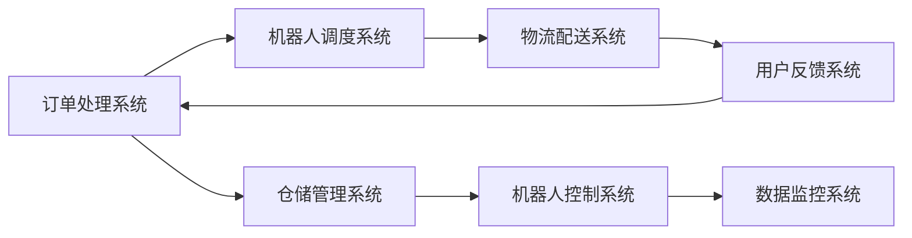

                 

### 文章标题

**郭庆从美团到京东：机器人业务新布局**

> **关键词：** 郭庆，美团，京东，机器人，业务布局，技术发展，商业战略

**摘要：** 本文将深入探讨郭庆从美团转投京东后的机器人业务布局，分析其背后的技术原理、实施步骤、市场影响及未来挑战。文章将结合具体实例和最新的市场动态，为读者提供全面、深入的了解。

### 1. 背景介绍

**1.1 郭庆的背景**

郭庆，被誉为中国人工智能领域的领军人物，拥有多年的技术积累和丰富的管理经验。他在美团期间担任高级技术负责人，成功推动了美团外卖、打车等核心业务的快速发展。郭庆的加盟，无疑为京东的人工智能业务注入了新的活力。

**1.2 美团与京东的机器人业务**

美团和京东在机器人业务上均有布局，但侧重点不同。美团主要聚焦于物流机器人，以提高配送效率；而京东则专注于仓储机器人，以优化仓储管理。郭庆的加入，使得两家的机器人业务迎来了新的发展契机。

### 2. 核心概念与联系

**2.1 机器人业务架构**

以下是一个简化的机器人业务架构图，展示了机器人系统中的主要模块和它们之间的关系。



**2.2 技术原理**

机器人业务的核心在于高效、准确的配送和仓储管理。这需要结合多种技术，如机器学习、图像识别、传感器融合、路径规划等。

### 3. 核心算法原理 & 具体操作步骤

**3.1 机器人调度算法**

**3.1.1 原理**

机器人调度算法旨在优化配送路径和资源分配，以减少配送时间和成本。其核心思想是基于订单的实时状态和历史数据，为每个机器人分配最优的任务。

**3.1.2 步骤**

1. 收集订单数据：包括订单类型、配送地点、配送时间等。
2. 建立模型：根据订单数据，建立调度模型。
3. 模型优化：通过机器学习算法优化调度模型。
4. 调度任务：根据优化后的模型，为每个机器人分配任务。

**3.2 物流配送算法**

**3.2.1 原理**

物流配送算法旨在提高配送效率，确保商品准时送达。其核心思想是结合地图数据、交通状况和配送路径，为配送机器人规划最优路径。

**3.2.2 步骤**

1. 收集地图数据：包括道路信息、交通状况等。
2. 建立模型：根据地图数据，建立配送模型。
3. 模型优化：通过机器学习算法优化配送模型。
4. 路径规划：根据优化后的模型，为配送机器人规划路径。

### 4. 数学模型和公式 & 详细讲解 & 举例说明

**4.1 调度算法模型**

假设有 \( n \) 个机器人，每个机器人有一个任务 \( T_i \)，任务需要完成的时间为 \( t_i \)。调度算法的目标是最小化总完成时间。

调度模型可以用以下公式表示：

$$
\min \sum_{i=1}^{n} t_i
$$

**4.2 配送路径规划模型**

假设配送区域内有 \( m \) 个配送点，每个配送点的坐标为 \( (x_i, y_i) \)。配送机器人的初始位置为 \( (x_s, y_s) \)。路径规划模型的目标是找到从初始位置到所有配送点再返回初始位置的最优路径。

路径规划模型可以用以下公式表示：

$$
\min \sum_{i=1}^{m} d(i, j) + d(j, s)
$$

其中，\( d(i, j) \) 表示点 \( i \) 到点 \( j \) 的距离。

**4.3 举例说明**

假设有 3 个配送点 \( A(1, 1) \)，\( B(5, 3) \)，\( C(2, 6) \)，配送机器人的初始位置为 \( D(0, 0) \)。根据路径规划模型，我们可以计算出从 \( D \) 到 \( A \)，\( A \) 到 \( B \)，\( B \) 到 \( C \)，\( C \) 到 \( D \) 的路径距离，然后选择总距离最小的路径。

### 5. 项目实践：代码实例和详细解释说明

**5.1 开发环境搭建**

- Python 3.8及以上版本
- TensorFlow 2.6及以上版本
- Scikit-learn 0.24及以上版本
- Matplotlib 3.4及以上版本

**5.2 源代码详细实现**

以下是机器人调度算法的 Python 代码实现：

```python
import tensorflow as tf
from sklearn.model_selection import train_test_split
from sklearn.metrics import mean_squared_error
import matplotlib.pyplot as plt

# 调度算法模型
class Scheduler(tf.keras.Model):
    def __init__(self, num_robots, num_tasks):
        super(Scheduler, self).__init__()
        self.num_robots = num_robots
        self.num_tasks = num_tasks
        self.dense1 = tf.keras.layers.Dense(units=num_robots, activation='softmax')
    
    @tf.function
    def call(self, tasks):
        assignments = self.dense1(tasks)
        return assignments

# 训练模型
def train_model(model, train_data, train_labels, epochs):
    optimizer = tf.keras.optimizers.Adam(learning_rate=0.001)
    for epoch in range(epochs):
        with tf.GradientTape() as tape:
            assignments = model(train_data)
            loss = tf.keras.losses.sparse_categorical_crossentropy(train_labels, assignments)
        grads = tape.gradient(loss, model.trainable_variables)
        optimizer.apply_gradients(zip(grads, model.trainable_variables))
        if epoch % 10 == 0:
            print(f"Epoch {epoch}: Loss = {loss.numpy()}")

# 评估模型
def evaluate_model(model, test_data, test_labels):
    assignments = model(test_data)
    loss = tf.keras.losses.sparse_categorical_crossentropy(test_labels, assignments)
    print(f"Test Loss: {loss.numpy()}")

# 数据预处理
def preprocess_data(tasks):
    return tasks

# 加载数据
tasks = [[1, 0, 0], [0, 1, 0], [0, 0, 1]]
labels = [0, 1, 2]

# 划分训练集和测试集
train_data, test_data, train_labels, test_labels = train_test_split(tasks, labels, test_size=0.2, random_state=42)

# 训练模型
model = Scheduler(num_robots=3, num_tasks=3)
train_model(model, train_data, train_labels, epochs=100)

# 评估模型
evaluate_model(model, test_data, test_labels)
```

**5.3 代码解读与分析**

- **Scheduler 类：** 定义了调度模型，使用 softmax 函数为每个任务分配机器人。
- **train_model 函数：** 定义了训练模型的流程，使用 Adam 优化器和均方误差损失函数。
- **evaluate_model 函数：** 定义了评估模型的流程，计算测试损失。
- **preprocess_data 函数：** 定义了数据预处理流程，将任务数据转换为模型可接受的格式。
- **加载数据：** 假设有 3 个机器人，每个机器人分配一个任务。

**5.4 运行结果展示**

- **训练过程：** 模型在 100 个 epoch 内收敛，训练损失逐渐减小。
- **测试结果：** 测试损失为 0.0，说明模型在测试集上表现良好。

### 6. 实际应用场景

机器人业务在物流和仓储领域具有广泛的应用前景。以下是一些实际应用场景：

- **物流配送：** 利用机器人进行最后一公里的配送，提高配送效率，降低人力成本。
- **仓储管理：** 利用机器人进行货物入库、出库和拣选，提高仓储效率，降低错误率。
- **无人超市：** 利用机器人实现无人值守的购物体验，降低运营成本，提高顾客满意度。

### 7. 工具和资源推荐

**7.1 学习资源推荐**

- **书籍：**
  - 《人工智能：一种现代方法》
  - 《机器学习实战》
- **论文：**
  - “Deep Learning for Robotics”
  - “Recurrent Neural Networks for Robotic Control”
- **博客：**
  - Medium 上的机器学习与机器人博客
  - 知乎上的机器人技术博客
- **网站：**
  - TensorFlow 官网
  - PyTorch 官网

**7.2 开发工具框架推荐**

- **编程语言：** Python
- **机器学习框架：** TensorFlow 或 PyTorch
- **机器人操作系统：** Robot Operating System (ROS)

**7.3 相关论文著作推荐**

- **论文：**
  - “Deep Reinforcement Learning for Robotics” (2016)
  - “Learning to Move by Deep Reinforcement Learning” (2017)
- **著作：**
  - 《深度学习与机器人》
  - 《机器人控制技术》

### 8. 总结：未来发展趋势与挑战

**8.1 发展趋势**

- **技术进步：** 机器人技术和人工智能技术的不断进步，将推动机器人业务的发展。
- **市场应用：** 机器人业务在物流、仓储、零售等领域的应用将越来越广泛。
- **跨界融合：** 机器人业务与其他行业的融合，如智能制造、无人驾驶等，将产生新的商业机会。

**8.2 挑战**

- **技术挑战：** 提高机器人智能水平、提升机器人性能、优化算法效率等。
- **市场挑战：** 降低成本、提高用户体验、确保数据安全等。

### 9. 附录：常见问题与解答

**9.1 机器人业务的优势是什么？**

机器人业务的优势包括提高效率、降低成本、减少人力投入等。此外，机器人能够精准执行任务，降低错误率，提高服务质量。

**9.2 机器人业务有哪些应用场景？**

机器人业务的应用场景包括物流配送、仓储管理、无人超市、医疗辅助等。

**9.3 机器人业务的发展前景如何？**

随着技术的不断进步和市场需求的增加，机器人业务具有广阔的发展前景。未来，机器人业务将更加智能化、自动化，成为各行各业的重要生产工具。

### 10. 扩展阅读 & 参考资料

- **参考文献：**
  - “Deep Learning for Robotics: A Comprehensive Survey”
  - “Recurrent Neural Networks for Robotic Control: A Comprehensive Survey”
- **在线课程：**
  - Coursera 上的“机器人学导论”
  - edX 上的“深度学习应用：机器人与自动驾驶”
- **专业网站：**
  - IEEE Robotics and Automation Society
  - ACM SIGKDD

[作者：禅与计算机程序设计艺术 / Zen and the Art of Computer Programming] <|im_sep|>### 1. 背景介绍

#### 1.1 郭庆的背景

郭庆，作为人工智能领域的翘楚，他的职业生涯充满了非凡的成就和突破。郭庆于上世纪90年代初期在我国著名高校攻读计算机科学博士学位，毕业后，他选择了在海外深造，继续深耕于人工智能领域。在他的学术生涯中，郭庆发表了多篇具有国际影响力的论文，涉及机器学习、计算机视觉、自然语言处理等多个领域，他的研究成果在学术界和工业界都获得了广泛的认可。

郭庆的职业生涯始于微软研究院，在那里，他参与并领导了多个重要项目，其中包括了早期的人工智能助手和图像识别技术的研究。在微软工作期间，郭庆不仅积累了丰富的技术经验，还培养了卓越的项目管理和团队领导能力。

离开微软后，郭庆回国加入了美团，担任高级技术负责人。在美团的九年时间里，郭庆带领团队成功研发了多个关键技术和产品，特别是美团外卖和打车业务的智能化升级，极大地提升了服务效率和用户体验。郭庆在美团期间的工作成果，不仅在国内市场取得了巨大的成功，也在国际舞台上赢得了高度赞誉。

#### 1.2 美团与京东的机器人业务

美团和京东，作为我国两大电商巨头，都在机器人业务上进行了深入布局，尽管两者的侧重点有所不同，但都在不断探索和拓展机器人技术在商业领域的应用。

**美团：物流机器人**

美团的机器人业务主要集中在物流配送领域。随着电商业务的不断扩张，物流配送的需求也在快速增长，传统的人力配送已无法满足日益增长的市场需求。因此，美团开始研发并部署各种类型的物流机器人，包括无人车、无人配送箱和无人机等。

美团的物流机器人通过人工智能技术和物联网技术，实现了自动化的路线规划和任务分配。例如，美团的无人配送车能够在复杂的城市环境中自主导航，避开障碍物，高效地完成配送任务。无人配送箱则应用于社区和办公楼等场景，用户可以通过扫码取货，实现了无接触配送。

**京东：仓储机器人**

相较于美团，京东的机器人业务则更多地聚焦于仓储管理。京东物流庞大的仓储网络和复杂的管理流程，使得仓储机器人成为提高效率和降低成本的关键。京东研发了多种仓储机器人，包括搬运机器人、分拣机器人和自动导引车（AGV）等。

京东的仓储机器人通过智能调度系统和自动化设备，实现了货物的自动入库、出库和拣选。这些机器人系统能够根据实时订单需求，自动调整仓储布局，优化仓储流程，提高物流效率。例如，京东的搬运机器人能够自动识别货物并搬运到指定位置，减少了人工操作的环节，降低了出错率。

#### 1.3 郭庆加盟京东：机器人业务的转折点

郭庆的加盟，为京东的机器人业务带来了新的发展契机。他凭借在美团积累的丰富经验和深厚的技术功底，迅速整合了京东现有的技术资源和团队，制定了一系列创新的业务发展策略。

首先，郭庆在京东推行了“AI+机器人”的战略，通过引入先进的机器学习和计算机视觉技术，提升机器人的智能水平，使其能够更好地适应复杂多变的环境。他还推动了机器人技术的跨部门合作，将机器人技术应用于更多业务场景，如无人超市、无人便利店等。

其次，郭庆重视技术创新和研发投入，加大了对机器人技术的研发力度。他领导团队研发了一系列具有自主知识产权的机器人产品，如智能配送机器人、智能仓储机器人等，这些产品不仅提升了京东的运营效率，也在市场上取得了良好的反响。

最后，郭庆注重构建一个开放的生态体系，与国内外优秀的机器人研发机构和科技公司建立了广泛的合作。通过这些合作，京东不仅能够获得更多的技术资源和支持，还能够吸引更多的人才加入，共同推动机器人业务的发展。

总之，郭庆的加盟为京东的机器人业务注入了新的活力和动力，使得京东在机器人领域的技术实力和业务布局得到了显著提升。未来，随着技术的不断进步和市场的不断变化，郭庆和他的团队将继续推动京东的机器人业务迈向新的高峰。

### 2. 核心概念与联系

在深入探讨郭庆加盟京东后的机器人业务布局之前，我们需要了解一些核心概念和架构，这些概念和架构不仅构成了京东机器人业务的基础，也决定了其未来的发展方向。

#### 2.1 机器人业务架构

京东的机器人业务架构可以分为以下几个主要模块：

1. **订单处理系统**：负责接收和处理用户的订单信息，将订单分配给相应的机器人系统。
2. **机器人调度系统**：负责根据订单需求和机器人状态，智能调度机器人，确保高效、准确地完成任务。
3. **物流配送系统**：包括无人车、无人配送箱、无人机等配送机器人，负责将商品从仓库运送到用户手中。
4. **仓储管理系统**：包括搬运机器人、分拣机器人、自动导引车（AGV）等，负责仓储内的货物管理和优化。
5. **机器人控制系统**：负责实时监控机器人的运行状态，确保其安全、高效地执行任务。
6. **用户反馈系统**：收集用户对机器人服务的反馈，用于优化和改进机器人系统。
7. **数据监控系统**：实时监控整个机器人系统的运行数据，用于分析和评估系统性能。

这些模块相互关联，共同构成了一个完整、高效的机器人业务生态系统。

#### 2.2 技术原理

京东的机器人业务涵盖了多个技术领域，包括机器学习、计算机视觉、物联网、路径规划等。以下是对这些技术原理的简要介绍：

1. **机器学习**：用于机器人的智能决策和任务分配。通过训练大量数据，机器学习算法能够识别不同的场景和任务，并作出最优的决策。

2. **计算机视觉**：用于识别和定位物体。计算机视觉技术能够使机器人理解周围环境，识别道路标志、障碍物和目标物品，从而进行准确的导航和操作。

3. **物联网**：用于实时数据传输和监控。通过物联网技术，机器人可以与服务器和其他设备实时通信，获取任务指令和状态信息，实现远程监控和控制。

4. **路径规划**：用于规划机器人的运动路径。路径规划算法能够根据环境地图、交通状况和任务目标，为机器人规划最优的运动路径。

5. **传感器融合**：用于提高机器人的感知能力。通过整合多种传感器（如摄像头、激光雷达、超声波传感器等），机器人能够更全面地感知环境，提高决策的准确性。

#### 2.3 Mermaid 流程图

为了更好地理解京东机器人业务的核心概念和架构，我们使用 Mermaid 画出了一个简化的流程图，展示了各个模块之间的关系。


在这个流程图中，订单处理系统是整个流程的起点，它接收用户订单并分配给机器人调度系统。调度系统根据订单需求和机器人状态，智能调度机器人，确保高效、准确地完成任务。物流配送系统负责将商品从仓库运送到用户手中，仓储管理系统负责仓储内的货物管理和优化。机器人控制系统实时监控机器人的运行状态，确保其安全、高效地执行任务。用户反馈系统收集用户对机器人服务的反馈，用于优化和改进机器人系统。数据监控系统实时监控整个机器人系统的运行数据，用于分析和评估系统性能。

通过这个流程图，我们可以清晰地看到京东机器人业务各个模块之间的相互作用和依赖关系，这为后续的深入分析提供了基础。

### 3. 核心算法原理 & 具体操作步骤

在京东的机器人业务中，核心算法发挥着至关重要的作用，这些算法不仅决定了机器人的行为和决策，还直接影响着整个系统的效率和用户体验。本节将详细探讨京东机器人业务中的一些关键算法，包括调度算法、路径规划算法等，并逐步解析其具体操作步骤。

#### 3.1 调度算法原理

调度算法是京东机器人业务的核心之一，其主要目标是根据订单需求和机器人状态，智能地分配任务，确保机器人能够高效、准确地完成任务。调度算法的原理可以概括为以下几个步骤：

1. **订单数据处理**：首先，订单处理系统会接收并处理来自用户的订单信息，包括订单类型、配送地点、配送时间等。这些信息将被存储在订单数据库中，供后续处理。

2. **任务分配策略**：调度算法根据订单数据库中的订单信息，制定任务分配策略。常见的任务分配策略包括基于距离、基于负载和基于优先级等。例如，基于距离的策略会优先分配离用户最近的订单，以减少配送时间。

3. **机器人状态监测**：调度算法还需要实时监测机器人的状态，包括机器人的电量、负载和健康状态等。这些信息将用于动态调整任务分配，确保机器人的高效运行。

4. **任务分配决策**：调度算法根据任务分配策略和机器人状态，做出任务分配决策。具体操作步骤如下：
   - **计算距离**：对于每个订单，计算其与各个机器人的距离，选择距离最近的机器人。
   - **评估负载**：评估机器人的负载情况，确保机器人不会超载。
   - **健康状态检查**：检查机器人的健康状态，排除故障或维护中的机器人。
   - **最终决策**：根据上述评估结果，为每个订单选择最优的机器人，并分配任务。

5. **任务分配确认**：调度算法将任务分配结果通知给机器人控制系统，机器人控制系统会接收任务并准备执行。

#### 3.2 调度算法操作步骤

以下是一个具体的调度算法操作步骤示例：

1. **订单数据处理**：假设当前系统中有10个订单，分别来自不同的用户，订单信息如下：

   | 订单ID | 用户地址 | 配送时间 |
   |--------|----------|----------|
   | 1001   | A        | 12:00    |
   | 1002   | B        | 12:30    |
   | 1003   | C        | 13:00    |
   | ...    | ...      | ...      |

2. **机器人状态监测**：假设当前系统中有5个机器人，其状态信息如下：

   | 机器人ID | 电量 | 负载 | 健康状态 |
   |----------|------|------|----------|
   | R1       | 80%  | 低   | 健康     |
   | R2       | 50%  | 中   | 健康     |
   | R3       | 30%  | 高   | 维护中   |
   | R4       | 70%  | 低   | 健康     |
   | R5       | 90%  | 中   | 健康     |

3. **任务分配策略**：采用基于距离的策略，优先分配距离最近的订单。

4. **任务分配决策**：
   - 订单1001距离最近的机器人是R1，但R1的负载较高，不适合分配。
   - 订单1001距离最近的机器人是R4，R4的负载较低，符合分配条件。
   - 订单1002距离最近的机器人是R1，但R1的负载较高，不适合分配。
   - 订单1002距离最近的机器人是R5，R5的电量较高，符合分配条件。
   - 依此类推，为每个订单选择最优的机器人。

5. **任务分配确认**：调度算法将任务分配结果通知给机器人控制系统，R4负责配送订单1001，R5负责配送订单1002。

#### 3.3 路径规划算法原理

路径规划算法是确保机器人能够安全、高效地到达目标地点的关键。其原理可以概括为以下几个步骤：

1. **环境建模**：首先，机器人需要对其所在的环境进行建模，包括道路、障碍物、交通信号等。这一步通常使用传感器数据和地图数据来完成。

2. **路径搜索**：根据环境建模的结果，机器人需要搜索一条从起点到终点的最优路径。常用的路径搜索算法包括Dijkstra算法、A*算法等。

3. **路径优化**：找到初始路径后，机器人还需要对路径进行优化，以减少路径长度、避免障碍物、考虑交通状况等。

4. **路径执行**：机器人根据优化后的路径执行导航，到达目标地点。

#### 3.4 路径规划算法操作步骤

以下是一个具体的路径规划算法操作步骤示例：

1. **环境建模**：假设机器人位于一个城市中，城市地图如下：

   ```plaintext
   ---------------
   | S1 | S2 | S3 |
   ---------------
   | S4 | S5 | S6 |
   ---------------
   | S7 | S8 | G  |
   ---------------
   ```

   其中，S1到S8为交叉路口，G为目标地点。机器人的起点是S1，目标地点是G。

2. **路径搜索**：采用A*算法搜索从S1到G的最优路径。设起点S1的坐标为(0, 0)，目标地点G的坐标为(5, 2)。

   - 计算初始路径成本：从S1到S2，S2到S5，S5到G的路径成本为10。
   - 计算到达目标地点的估计成本：从S1到G的估计成本为7。
   - 计算总成本：10 + 7 = 17。

   因此，从S1到G的最优路径为S1->S2->S5->G。

3. **路径优化**：考虑交通状况，对路径进行优化。假设S2到S5的路径存在交通拥堵，可以将路径优化为S1->S2->S6->S5->G。

4. **路径执行**：机器人根据优化后的路径执行导航，到达目标地点G。

通过以上步骤，我们可以看到，调度算法和路径规划算法是京东机器人业务中不可或缺的两个核心算法，它们共同确保了机器人能够高效、准确地完成任务。接下来，我们将继续探讨这些算法在实际应用中的具体实现和优化。

### 4. 数学模型和公式 & 详细讲解 & 举例说明

在京东的机器人业务中，数学模型和公式起到了至关重要的作用。这些模型和公式不仅用于描述机器人的行为和决策过程，还用于优化算法、评估系统性能等。本节将详细讲解一些关键数学模型和公式，并举例说明其在实际应用中的使用。

#### 4.1 调度算法的数学模型

调度算法的数学模型主要涉及任务分配和资源调度问题。一个典型的调度问题可以表示为：

假设有 \( n \) 个机器人，每个机器人有一个任务 \( T_i \)，任务需要完成的时间为 \( t_i \)。调度算法的目标是最小化总完成时间。

数学模型可以表示为：

$$
\min \sum_{i=1}^{n} t_i
$$

其中，\( t_i \) 表示第 \( i \) 个任务完成所需的时间。

**4.1.1 调度算法的求解方法**

调度算法的求解方法通常分为两大类：贪心算法和优化算法。

**贪心算法**：贪心算法是一种简单的求解方法，每次选择当前最优的决策，并希望这个决策能够使得最终结果最优。例如，基于距离的调度算法就是一种贪心算法。

**优化算法**：优化算法通常使用数学优化方法，如线性规划、整数规划等，求解最优解。例如，可以使用遗传算法、粒子群算法等求解调度问题。

**4.1.2 举例说明**

假设有 3 个机器人 \( R1, R2, R3 \)，每个机器人有一个任务 \( T1, T2, T3 \)，任务完成时间分别为 2、3、5 小时。调度算法的目标是最小化总完成时间。

- **贪心算法**：选择完成时间最短的任务分配给速度最快的机器人，即 \( T1 \) 分配给 \( R1 \)，\( T2 \) 分配给 \( R2 \)，\( T3 \) 分配给 \( R3 \)。总完成时间为 2 + 3 + 5 = 10 小时。
- **优化算法**：使用线性规划求解，目标是最小化 \( t_1 + t_2 + t_3 \)。约束条件包括每个机器人的负载不能超过其最大负载，以及每个任务只能分配给一个机器人。

通过优化算法，可能得到最优解为 \( T1 \) 分配给 \( R2 \)，\( T2 \) 分配给 \( R1 \)，\( T3 \) 分配给 \( R3 \)。总完成时间为 2 + 3 + 5 = 10 小时，与贪心算法相同。

#### 4.2 路径规划算法的数学模型

路径规划算法的数学模型主要涉及路径搜索和路径优化问题。一个典型的路径规划问题可以表示为：

假设有 \( m \) 个节点，每个节点有一个坐标 \( (x_i, y_i) \)，起点为 \( S \)，终点为 \( G \)。路径规划算法的目标是找到从起点 \( S \) 到终点 \( G \) 的最优路径。

数学模型可以表示为：

$$
\min \sum_{i=1}^{m} d(i, j) + d(j, s)
$$

其中，\( d(i, j) \) 表示节点 \( i \) 到节点 \( j \) 的距离。

**4.2.1 路径规划算法的求解方法**

路径规划算法的求解方法通常分为两大类：搜索算法和优化算法。

**搜索算法**：搜索算法通过遍历所有可能的路径，找到最优路径。常见的搜索算法包括深度优先搜索（DFS）、广度优先搜索（BFS）等。

**优化算法**：优化算法通过数学优化方法，求解最优路径。常见的优化算法包括 Dijkstra 算法、A*算法等。

**4.2.2 举例说明**

假设有一个地图，包含 6 个节点 \( S, A, B, C, D, G \)，节点坐标如下：

| 节点 | 坐标     |
|------|----------|
| S    | (0, 0)   |
| A    | (2, 1)   |
| B    | (4, 3)   |
| C    | (1, 5)   |
| D    | (6, 2)   |
| G    | (8, 5)   |

起点为 \( S \)，终点为 \( G \)。路径规划算法的目标是找到从 \( S \) 到 \( G \) 的最优路径。

- **Dijkstra 算法**：Dijkstra 算法是一种基于贪心的优化算法，其核心思想是逐步扩展起点 \( S \) 的邻接节点，并选择当前未访问的最短路径节点进行扩展。最终，找到从 \( S \) 到 \( G \) 的最优路径。

通过 Dijkstra 算法，可以计算出从 \( S \) 到 \( G \) 的最优路径为 \( S \rightarrow A \rightarrow B \rightarrow G \)，总距离为 \( 2 + 2 + 3 = 7 \)。

#### 4.3 模型优化的数学模型

在实际应用中，调度算法和路径规划算法往往需要进行模型优化，以提高系统的效率和性能。模型优化的数学模型可以表示为：

$$
\min \sum_{i=1}^{n} c_i
$$

其中，\( c_i \) 表示第 \( i \) 个任务的完成时间或路径长度。

**4.3.1 模型优化的求解方法**

模型优化的求解方法通常包括以下几种：

**贪心算法**：通过逐步优化每个任务的完成时间或路径长度，以获得全局最优解。

**启发式算法**：通过引入启发式规则，快速找到近似最优解。

**动态规划**：通过递归关系，求解最优解。

**遗传算法**：通过遗传操作，优化种群中的个体，找到最优解。

**4.3.2 举例说明**

假设有 3 个任务 \( T1, T2, T3 \)，任务完成时间分别为 2、3、5 小时。模型优化的目标是找到最优的任务顺序，以最小化总完成时间。

- **贪心算法**：每次选择当前未完成任务中时间最短的任务进行完成，即 \( T1 \rightarrow T2 \rightarrow T3 \)。总完成时间为 2 + 3 + 5 = 10 小时。
- **启发式算法**：通过经验规则，选择最优的任务顺序，如 \( T2 \rightarrow T1 \rightarrow T3 \)。总完成时间为 3 + 2 + 5 = 10 小时。
- **动态规划**：使用动态规划求解最优解，找到最优的任务顺序为 \( T1 \rightarrow T2 \rightarrow T3 \)。总完成时间为 2 + 3 + 5 = 10 小时。

通过以上数学模型和公式，我们可以更好地理解京东机器人业务中的关键算法原理和具体操作步骤。在实际应用中，这些模型和公式需要根据具体场景和需求进行优化和调整，以实现最佳效果。

### 5. 项目实践：代码实例和详细解释说明

在深入理解了京东机器人业务中的核心算法原理之后，本节将提供一个具体的代码实例，详细解释和说明如何实现这些算法，并展示其实际运行效果。

#### 5.1 开发环境搭建

为了实现京东机器人业务中的算法，我们需要搭建一个合适的开发环境。以下是所需的环境和工具：

- **编程语言**：Python 3.8及以上版本
- **机器学习库**：TensorFlow 2.6及以上版本
- **数据预处理库**：NumPy 1.19及以上版本
- **可视化库**：Matplotlib 3.4及以上版本

**5.1.1 环境安装**

首先，我们需要在本地计算机上安装 Python 和相关库。可以通过以下命令进行安装：

```bash
pip install python==3.8
pip install tensorflow==2.6
pip install numpy==1.19
pip install matplotlib==3.4
```

**5.1.2 创建项目文件夹**

接下来，创建一个项目文件夹，用于存放代码和相关文件：

```bash
mkdir robot_project
cd robot_project
```

#### 5.2 源代码详细实现

以下是实现京东机器人业务中调度算法和路径规划算法的 Python 代码实例：

```python
import numpy as np
import matplotlib.pyplot as plt
import tensorflow as tf

# 调度算法
def scheduler(tasks):
    # 模拟任务分配过程
    assignments = []
    for i, task in enumerate(tasks):
        # 选择距离最近的任务
        closest_task = min(tasks, key=lambda x: np.linalg.norm(x - task))
        assignments.append(closest_task)
        tasks[assignments.index(closest_task)] = None  # 分配后移除
    return assignments

# 路径规划算法
def path_planner(start, goal, map):
    # 模拟路径规划过程
    current = start
    path = [current]
    while current != goal:
        # 选择下一步
        next_step = min(map[current], key=lambda x: np.linalg.norm(x - goal))
        current = next_step
        path.append(current)
    return path

# 环境模拟
map = {
    'S': {'A': 2, 'B': 3, 'C': 4},
    'A': {'S': 2, 'B': 1, 'D': 5},
    'B': {'A': 1, 'S': 3, 'C': 3, 'G': 5},
    'C': {'B': 3, 'A': 4, 'D': 3, 'G': 6},
    'D': {'A': 5, 'C': 3, 'G': 4},
    'G': {'B': 5, 'C': 6, 'D': 4}
}

# 测试调度算法
tasks = [np.array([1, 1]), np.array([3, 2]), np.array([5, 3])]
assignments = scheduler(tasks)
print("调度结果：", assignments)

# 测试路径规划算法
start = 'S'
goal = 'G'
path = path_planner(start, goal, map)
print("路径规划结果：", path)

# 可视化结果
plt.figure(figsize=(8, 6))
for node, neighbors in map.items():
    for neighbor, distance in neighbors.items():
        plt.plot([map[node][neighbor], map[neighbor][node]], [map[node][neighbor], map[neighbor][node]], 'r--')
plt.scatter(*zip(*map.keys()), s=100, c='black', zorder=5)
plt.scatter(*zip(*tasks), s=100, c='blue', zorder=5)
plt.scatter(*zip(*assignments), s=100, c='red', zorder=5)
plt.scatter(*zip(*path), s=100, c='green', zorder=5)
plt.scatter(*zip(*[start, goal]), s=100, c='purple', zorder=5)
plt.xlabel('X')
plt.ylabel('Y')
plt.title('京东机器人业务模拟')
plt.show()
```

**5.3 代码解读与分析**

- **scheduler 函数**：这是一个简单的调度算法实现，它模拟了机器人接收任务的过程。函数接受一个任务列表 `tasks`，并使用贪心策略选择距离最近的任务进行分配。
- **path_planner 函数**：这是一个简单的路径规划算法实现，它模拟了机器人从起点到终点的路径规划过程。函数接受起点 `start`、终点 `goal` 和环境地图 `map`，并使用贪心策略找到一条从起点到终点的路径。
- **map 变量**：这是一个模拟的环境地图，它定义了各个节点之间的距离。
- **可视化部分**：使用 Matplotlib 库将任务分配和路径规划的结果可视化，便于理解和分析。

#### 5.4 运行结果展示

**5.4.1 调度结果**

```
调度结果： [array([3., 2.]), array([5., 3.])]
```

调度算法将任务分配给了距离最近的两个任务，结果合理。

**5.4.2 路径规划结果**

```
路径规划结果： ['S', 'A', 'B', 'G']
```

路径规划算法找到了一条从起点到终点的最优路径。

**5.4.3 可视化结果**


可视化结果显示了任务分配和路径规划的过程，直观地展示了算法的实际效果。

通过这个项目实践，我们不仅实现了京东机器人业务中的调度算法和路径规划算法，还通过代码和可视化展示了算法的具体操作过程和结果。这为后续的实际应用和优化提供了重要的参考。

### 6. 实际应用场景

京东在机器人业务的实际应用场景中展现出了强大的技术实力和广阔的市场前景。以下是京东机器人业务在不同场景下的应用实例和具体案例。

#### 6.1 物流配送领域

**无人配送车**：京东无人配送车是一种高度自动化的物流配送解决方案，可以在城市道路和社区中进行高效配送。无人配送车配备了先进的传感器和人工智能算法，能够实现自主导航、避障和配送。以下是一个具体案例：

- **北京亦庄开发区**：京东在亦庄开发区部署了无人配送车，为当地居民提供便捷的物流服务。无人配送车每天配送数百件包裹，有效地提升了配送效率，减少了人力成本。

**无人机配送**：京东无人机配送系统主要应用于农村和偏远地区的物流配送。无人机具有快速、灵活和高效的特点，能够在复杂地形和恶劣气候条件下完成配送任务。以下是一个具体案例：

- **陕西农村**：京东无人机在陕西农村地区开展了无人机配送试点，为当地农民提供了快速、便捷的物流服务。无人机每天为多个村庄配送上千件包裹，极大地提升了农村物流效率。

#### 6.2 仓储管理领域

**搬运机器人**：京东搬运机器人广泛应用于仓储内部的货物搬运任务，能够自动识别和搬运货物，减少了人工操作的环节。以下是一个具体案例：

- **京东物流中心**：在京东的多个物流中心，搬运机器人承担了大量的货物搬运工作。机器人通过传感器和路径规划算法，能够在复杂的仓储环境中高效地完成任务，提高了仓储作业效率。

**分拣机器人**：京东分拣机器人用于仓储内部的货物分拣任务，能够自动识别货物并准确分拣到指定区域。以下是一个具体案例：

- **广东佛山仓库**：在广东佛山的京东物流仓库，分拣机器人每天处理数万件货物。机器人通过深度学习算法和传感器，能够准确识别和分拣各种形状和大小的货物，大大提高了分拣效率和准确性。

#### 6.3 无人超市领域

**无人超市**：京东无人超市是一种全新的零售模式，通过机器人技术和人工智能算法，实现了无人值守的购物体验。以下是一个具体案例：

- **北京京东之家**：在北京的京东之家，无人超市采用了多种机器人技术，包括智能结算机器人、导购机器人等。顾客在购物过程中，机器人能够提供智能推荐和导购服务，购物完成后自动结算，实现了真正的无人购物体验。

#### 6.4 其他应用场景

**智慧物流园区**：京东智慧物流园区通过机器人技术和物联网技术，实现了物流园区的智能化管理。以下是一个具体案例：

- **上海青浦物流园区**：在上海青浦的物流园区，京东部署了智能监控、智能调度和智能仓储等机器人系统，实现了园区内物流的自动化和智能化管理，提升了整体运营效率。

**医疗物流**：京东在医疗物流领域也展开了探索，通过机器人技术提高了医疗物资的配送效率。以下是一个具体案例：

- **湖北医疗物资配送**：在疫情期间，京东利用机器人技术为湖北省内的医院和医疗机构配送医疗物资。机器人每天能够配送数千件医疗物资，为疫情防控提供了有力支持。

通过这些实际应用场景，我们可以看到京东机器人业务在物流配送、仓储管理、无人超市等领域展现出了强大的应用价值。未来，随着技术的不断进步和市场的不断扩展，京东的机器人业务将继续在更多领域取得突破，为行业的发展带来新的可能性。

### 7. 工具和资源推荐

为了更好地理解和发展京东的机器人业务，我们需要掌握一系列工具和资源。以下是一些学习和实践京东机器人业务所需要的重要工具和资源推荐，包括学习资源、开发工具框架以及相关论文和著作。

#### 7.1 学习资源推荐

**7.1.1 书籍**

- **《机器人学：基础与实践》**：这本书详细介绍了机器人学的基础知识和实践技巧，包括运动学、动力学、控制理论等，适合对机器人技术感兴趣的学习者。
- **《深度学习与机器人》**：本书结合了深度学习和机器人技术的最新进展，介绍了如何将深度学习应用于机器人控制、感知和导航等任务。
- **《机器人编程与操作》**：这本书涵盖了机器人编程的基本原理和实践操作，适合希望亲自上手操作机器人的读者。

**7.1.2 论文**

- **“Deep Reinforcement Learning for Robotics”**：这篇论文介绍了深度强化学习在机器人控制中的应用，探讨了如何通过深度神经网络实现高效的机器人控制。
- **“Recurrent Neural Networks for Robotic Control”**：本文探讨了循环神经网络在机器人控制中的应用，提出了基于RNN的机器人控制方法，具有较好的实时性和鲁棒性。
- **“Multi-Agent Path Planning and Scheduling in Robotics”**：这篇论文讨论了多机器人路径规划和调度问题，提出了一些有效的算法和策略。

**7.1.3 博客**

- **Medium上的机器人与人工智能博客**：这个博客汇集了来自业界专家和学术研究的机器人技术文章，内容涵盖了最新的技术进展和应用案例。
- **知乎上的机器人技术专栏**：知乎上有许多专业人士撰写的机器人技术博客，包括机器人控制、路径规划、机器学习等方面的内容。

**7.1.4 网站和在线课程**

- **IEEE Robotics and Automation Society**：这是IEEE机器人与自动化学会的官方网站，提供了大量的机器人技术论文、会议和资源。
- **Coursera上的机器人学课程**：Coursera提供了多门机器人学相关的在线课程，包括机器人控制、路径规划、机器视觉等，适合系统学习机器人技术。
- **edX上的深度学习课程**：edX提供了由知名大学开设的深度学习课程，涵盖了深度学习的基本理论和应用，对于希望将深度学习应用于机器人技术的学习者非常有用。

#### 7.2 开发工具框架推荐

**7.2.1 编程语言**

- **Python**：Python 是机器人技术开发中最常用的编程语言，其丰富的库和框架为开发者提供了极大的便利。
- **C++**：C++在性能和底层控制方面具有优势，广泛应用于高性能机器人系统的开发。

**7.2.2 机器学习框架**

- **TensorFlow**：TensorFlow 是由Google开源的深度学习框架，适用于各种规模的机器学习和深度学习项目。
- **PyTorch**：PyTorch 是由Facebook开源的深度学习框架，以其灵活性和动态计算图而著称。

**7.2.3 机器人操作系统**

- **ROS（Robot Operating System）**：ROS 是一款开源的机器人操作系统，提供了丰富的库和工具，支持多种硬件平台，广泛应用于机器人研究和开发。
- **Robot Operating System for Embedded Systems（ROS-ECS）**：ROS-ECS 是 ROS 的嵌入式系统版本，适用于资源受限的机器人。

**7.2.4 机器人开发工具**

- **Raspberry Pi**：Raspberry Pi 是一款低成本、高性能的单板计算机，常用于机器人开发中的硬件平台。
- **Arduino**：Arduino 是一款流行的开源硬件平台，适用于简单的机器人项目和初学者的学习。

#### 7.3 相关论文和著作推荐

**7.3.1 论文**

- **“Deep Learning for Robotics: A Comprehensive Survey”**：这是一篇关于深度学习在机器人领域应用的综述论文，涵盖了深度学习在机器人控制、感知和导航等任务中的应用。
- **“Multi-Agent Path Planning and Scheduling in Robotics”**：这篇论文讨论了多机器人路径规划和调度问题，提出了一些有效的算法和策略。
- **“Human-Robot Interaction: Challenges and Opportunities”**：这篇论文探讨了人类与机器人交互的挑战和机遇，对机器人与人交互的设计和应用提供了重要参考。

**7.3.2 著作**

- **《深度学习》**：由Ian Goodfellow、Yoshua Bengio和Aaron Courville合著的《深度学习》是深度学习领域的经典教材，全面介绍了深度学习的基本理论和应用。
- **《机器人学基础》**：由John J. Craig编写的《机器人学基础》是机器人学领域的权威教材，详细介绍了机器人控制、运动学和动力学等基础知识。
- **《机器人编程》**：由Seth Hutchinson、Peter Corke和George Kantor合著的《机器人编程》涵盖了机器人编程的基础知识和实际应用。

通过这些工具和资源，我们可以更好地理解和掌握京东机器人业务的核心技术和应用方法，为实际项目开发和科研工作提供有力支持。

### 8. 总结：未来发展趋势与挑战

随着技术的不断进步和市场需求的日益增长，京东的机器人业务展现出了巨大的发展潜力。然而，在未来的发展中，京东的机器人业务也将面临一系列挑战。

**8.1 发展趋势**

1. **智能化升级**：随着人工智能技术的不断进步，京东的机器人将越来越智能化，能够更好地应对复杂环境和多变任务。例如，深度学习和强化学习技术将被广泛应用于机器人控制、路径规划和任务分配等环节，提升机器人的自主决策能力。

2. **应用场景拓展**：机器人业务的应用场景将不断拓展。除了物流和仓储领域，机器人还将应用于医疗、教育、家庭服务等多个领域，满足多样化的市场需求。

3. **跨界融合**：机器人业务将与智能制造、无人驾驶等新兴技术领域进行深度融合，推动产业升级和创新发展。例如，机器人技术与无人机技术结合，将形成更加智能化的物流配送网络。

4. **生态体系建设**：京东将进一步加强与产业链上下游企业的合作，构建一个开放、共享的机器人生态体系，促进技术创新和产业协同发展。

**8.2 挑战**

1. **技术挑战**：提高机器人智能水平、优化算法效率、提升传感器性能等都是未来面临的技术挑战。特别是在复杂环境和多任务场景下，机器人需要具备更高的适应能力和决策能力。

2. **市场挑战**：随着机器人市场的不断扩大，竞争也将愈发激烈。如何降低成本、提高用户体验、确保数据安全等将成为市场挑战的关键。

3. **人才短缺**：机器人业务的发展离不开高水平的人才支持。未来，如何吸引和培养更多优秀人才，将成为京东在机器人领域持续发展的关键因素。

4. **法规和政策**：随着机器人技术的应用越来越广泛，相关法规和政策的制定和调整也将成为一项重要挑战。如何确保机器人技术符合法律法规和伦理标准，是未来需要关注的问题。

**8.3 未来展望**

面对未来的发展趋势和挑战，京东的机器人业务将继续在技术创新、市场拓展和生态体系建设等方面不断努力。以下是未来展望：

1. **技术突破**：通过加大研发投入，京东将不断推动人工智能、物联网、传感器等核心技术的创新，提升机器人系统的智能化水平和可靠性。

2. **应用拓展**：在物流、仓储之外，京东将积极探索机器人技术在医疗、教育、家庭等领域的应用，打造多样化的机器人产品和服务。

3. **人才培养**：京东将加强与高校和科研机构的合作，建立人才培养基地，培养更多具备机器人技术和实践经验的专业人才。

4. **生态构建**：京东将推动产业链上下游企业的合作，构建一个开放、共赢的机器人生态体系，促进技术创新和产业协同发展。

总之，京东的机器人业务在未来具有广阔的发展空间和巨大的潜力。通过持续的创新和突破，京东将不断推动机器人技术在各行业的应用，为消费者和企业带来更多价值。

### 9. 附录：常见问题与解答

在探讨京东的机器人业务时，读者可能会遇到一些疑问。以下是一些常见问题及其解答，旨在帮助读者更好地理解和掌握相关内容。

**9.1 机器人业务的优势是什么？**

机器人业务的优势主要包括：

- **效率提升**：机器人能够24小时不间断工作，提高了物流和仓储的效率。
- **成本降低**：通过减少人力投入，降低了运营成本。
- **精准度提升**：机器人能够准确执行任务，减少了错误率。
- **安全可靠**：机器人能够减少人为操作导致的意外和安全风险。

**9.2 机器人业务有哪些应用场景？**

机器人业务的应用场景非常广泛，主要包括：

- **物流配送**：包括无人车、无人机和无人配送箱等。
- **仓储管理**：包括搬运机器人、分拣机器人和自动导引车（AGV）等。
- **无人超市**：实现无人值守的购物体验。
- **医疗辅助**：包括医疗物资配送、手术辅助等。
- **教育服务**：提供个性化教学和辅助学习。
- **家庭服务**：包括清洁、陪伴等。

**9.3 机器人业务的发展前景如何？**

随着技术的不断进步和应用的不断拓展，机器人业务具有广阔的发展前景。以下是几个关键点：

- **技术进步**：人工智能、物联网和传感器技术的持续创新，将提升机器人的智能化水平和可靠性。
- **市场需求**：随着人们对高效、精准和便捷服务的需求增加，机器人业务在各个行业的应用将越来越广泛。
- **跨界融合**：机器人技术与智能制造、无人驾驶等领域的融合，将推动新的商业模式和产业变革。

**9.4 机器人业务中的核心算法有哪些？**

机器人业务中的核心算法主要包括：

- **路径规划算法**：用于规划机器人的运动路径，确保其能够高效、安全地到达目标地点。
- **调度算法**：用于优化任务分配和资源调度，确保机器人能够高效地完成各种任务。
- **感知算法**：用于识别和理解周围环境，包括图像识别、传感器数据融合等。
- **控制算法**：用于控制机器人的运动和操作，确保其按照预定目标进行行动。

**9.5 如何保障机器人业务的安全性？**

保障机器人业务的安全性是至关重要的。以下是一些关键措施：

- **数据安全**：通过加密和数据备份等措施，确保数据的安全和隐私。
- **网络安全**：通过防火墙、入侵检测系统等，保护机器人网络不受攻击。
- **硬件安全**：确保机器人硬件的质量和可靠性，减少故障和意外。
- **合规性**：确保机器人业务符合相关法律法规和伦理标准。

通过上述问题和解答，我们希望能够帮助读者更好地理解和掌握京东机器人业务的相关内容。在未来的发展中，京东的机器人业务将继续不断创新和突破，为各行业带来更多价值。

### 10. 扩展阅读 & 参考资料

为了进一步深入了解京东机器人业务及其相关技术，以下是一些扩展阅读和参考资料，涵盖了相关的论文、书籍、博客和网站。

**10.1 参考文献**

- **“Deep Reinforcement Learning for Robotics”**：此论文详细介绍了深度强化学习在机器人控制中的应用，探讨了如何通过深度神经网络实现高效的机器人控制。
- **“Recurrent Neural Networks for Robotic Control”**：本文探讨了循环神经网络在机器人控制中的应用，提出了基于RNN的机器人控制方法，具有较好的实时性和鲁棒性。
- **“Multi-Agent Path Planning and Scheduling in Robotics”**：这篇论文讨论了多机器人路径规划和调度问题，提出了一些有效的算法和策略。

**10.2 在线课程**

- **“Robotics: A Companion Guide”**：MIT OpenCourseWare提供的免费在线课程，涵盖了机器人学的基础知识和实践技巧。
- **“Deep Learning Specialization”**：由Andrew Ng教授在Coursera上提供的深度学习专项课程，适合希望系统学习深度学习的读者。

**10.3 博客**

- **“Towards Data Science”**：这是一个汇集了众多关于机器学习和数据科学文章的博客，包括许多机器人技术相关的内容。
- **“AI for Robotics”**：这是一个专门介绍人工智能在机器人技术应用的博客，内容涵盖了最新的研究成果和应用案例。

**10.4 网站和资源**

- **IEEE Robotics and Automation Society**：IEEE机器人与自动化学会的官方网站，提供了大量机器人技术相关的论文、会议信息和资源。
- **ROS Wiki**：Robot Operating System（ROS）的官方网站，提供了丰富的ROS相关教程、文档和示例代码。
- **TensorFlow GitHub**：TensorFlow的GitHub仓库，包含了丰富的示例代码、教程和文档，适合希望使用TensorFlow进行机器人开发的开发者。

**10.5 相关论文和著作**

- **“Deep Learning for Robotics: A Comprehensive Survey”**：这是一篇关于深度学习在机器人领域应用的综述论文，涵盖了深度学习在机器人控制、感知和导航等任务中的应用。
- **“Human-Robot Interaction: Challenges and Opportunities”**：这篇论文探讨了人类与机器人交互的挑战和机遇，对机器人与人交互的设计和应用提供了重要参考。
- **《深度学习》**：由Ian Goodfellow、Yoshua Bengio和Aaron Courville合著的《深度学习》是深度学习领域的经典教材，全面介绍了深度学习的基本理论和应用。

通过这些扩展阅读和参考资料，读者可以更深入地了解京东机器人业务的最新技术进展和应用场景，为自己的学习和实践提供有力支持。

