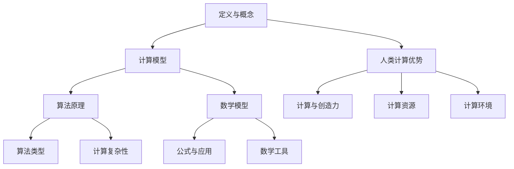

                 

### 1. 背景介绍

人类计算，作为人类智慧和创造力的体现，已经经历了数千年的发展历程。从古代的算盘到现代的超级计算机，计算技术不断演进，不仅改变了我们的生活方式，也推动了科技的进步。然而，随着计算能力的不断增强，我们逐渐认识到，人类计算的力量远不止于此。它不仅是一种工具，更是一种释放人类创造力的源泉。

在信息技术迅速发展的今天，人类计算的重要性愈发凸显。从大数据分析到人工智能，从云计算到区块链，计算技术正深刻地影响着各行各业。然而，与此同时，我们也在面临一些挑战，例如如何更高效地利用计算资源、如何确保计算过程的透明性和安全性等。这些挑战不仅需要技术的创新，更需要我们对人类计算本质的深入理解和探索。

本文将围绕人类计算的核心概念、算法原理、数学模型、项目实践、应用场景以及未来展望等方面进行深入探讨，旨在揭示人类计算的魅力，探讨其在未来科技发展中的重要作用。

### 2. 核心概念与联系

为了深入理解人类计算的魅力，我们首先需要了解其核心概念和它们之间的联系。以下是一个关于人类计算核心概念和原理的Mermaid流程图。



#### 2.1 计算模型

计算模型是人类计算的基础。它定义了计算的基本结构和操作方式。从早期的图灵机模型到现代的量子计算模型，不同的计算模型反映了计算技术的发展和进步。

#### 2.2 算法原理

算法原理是计算模型的具体实现。它们是一系列有序的操作步骤，用于解决特定的问题。算法原理的多样性和灵活性使得人类计算能够应对各种复杂的计算任务。

#### 2.3 数学模型

数学模型是计算过程中的数学表达和公式。它们为计算提供了理论基础和操作指南。从线性代数到概率统计，数学模型在人类计算中扮演着至关重要的角色。

#### 2.4 算法类型

算法类型是按照特定的分类标准对算法进行分类的结果。常见的算法类型包括排序算法、搜索算法、动态规划算法等。不同的算法类型适用于不同的计算任务。

#### 2.5 计算复杂性

计算复杂性是衡量算法效率的重要指标。它反映了算法在处理不同规模问题时所需的时间和资源。常见的计算复杂性分类包括时间复杂性和空间复杂性。

#### 2.6 公式与应用

公式与应用是指将数学模型应用于实际问题中。通过公式的推导和计算，我们可以解决各种复杂的计算问题。例如，线性代数中的矩阵运算在图像处理和数据分析中有着广泛的应用。

#### 2.7 数学工具

数学工具是数学模型和公式的具体实现。常见的数学工具包括计算器、数学软件、编程语言等。它们为人类计算提供了强大的计算能力和数据处理能力。

#### 2.8 人类计算优势

人类计算优势是指人类在计算过程中的独特优势。人类具有强大的逻辑思维能力、创造性思维能力和跨学科整合能力。这些优势使得人类计算能够在复杂的计算任务中发挥重要作用。

#### 2.9 计算与创造力

计算与创造力是相辅相成的。计算为人类提供了强大的计算能力和工具，而创造力则为人类提供了无限的想象空间。通过计算和创造力的结合，人类能够创造出更多具有创新性和实用性的科技产品。

#### 2.10 计算资源

计算资源是指用于计算的各种资源，包括硬件资源、软件资源和数据资源。计算资源的充足性和高效利用对计算过程和计算结果有着重要影响。

#### 2.11 计算环境

计算环境是指计算过程发生的具体环境。它包括计算设备、计算网络和计算平台等。计算环境的优化和改进对计算效率和计算质量有着重要影响。

通过以上对核心概念和联系的分析，我们可以看到，人类计算是一个多维度的复杂系统。它不仅包含了计算模型、算法原理和数学模型等核心概念，还涉及了计算资源、计算环境和计算与创造力等关键要素。这些核心概念和联系共同构成了人类计算的魅力和力量。

### 3. 核心算法原理 & 具体操作步骤

在深入探讨了人类计算的核心概念和联系之后，我们接下来将重点介绍核心算法原理和具体操作步骤。算法原理是计算模型的具体实现，它们为我们提供了解决各种计算任务的方法和工具。以下是关于核心算法原理和操作步骤的详细介绍。

#### 3.1 算法原理概述

算法原理是指用于解决特定计算问题的有序步骤和规则。算法原理可以分为多种类型，包括排序算法、搜索算法、动态规划算法等。每种算法原理都有其特定的适用场景和优缺点。以下是一些常见的算法原理概述：

1. **排序算法**：用于对数据集合进行排序，常见的排序算法包括冒泡排序、快速排序、归并排序等。这些算法按照不同的排序策略和排序规则对数据进行排序，以达到特定的排序目标。

2. **搜索算法**：用于在数据集合中查找特定元素，常见的搜索算法包括线性搜索、二分搜索等。这些算法根据不同的搜索策略和搜索规则，以高效的方式查找目标元素。

3. **动态规划算法**：用于解决具有重叠子问题和最优子结构特性的计算问题。动态规划算法通过将复杂问题分解为更小的子问题，并利用子问题的解来求解原问题，从而实现高效计算。

#### 3.2 算法步骤详解

以下是一个简单的排序算法——冒泡排序的具体步骤详解：

1. **初始化**：将待排序的数据集合输入到算法中。

2. **比较与交换**：从数据集合的最后一个元素开始，依次比较相邻元素的大小。如果前一个元素大于后一个元素，则交换它们的位置。通过多次遍历数据集合，不断将较大的元素“冒泡”到数据集合的末尾。

3. **循环判断**：在每次遍历结束后，判断是否还有需要排序的元素。如果已经完成了所有元素的排序，则算法结束；否则，继续进行下一次遍历。

4. **输出结果**：将排序完成的数据集合输出，得到排序后的结果。

#### 3.3 算法优缺点

冒泡排序算法具有以下优缺点：

1. **优点**：
   - 算法简单易懂，易于实现。
   - 对于小规模数据集合，冒泡排序具有较好的性能。

2. **缺点**：
   - 对于大规模数据集合，冒泡排序的性能较差，时间复杂度为 \(O(n^2)\)。
   - 冒泡排序不适合实时性要求较高的应用场景。

#### 3.4 算法应用领域

冒泡排序算法在许多领域都有应用，包括数据预处理、算法竞赛和教学等。以下是一些具体的应用领域：

1. **数据预处理**：在数据分析中，冒泡排序可以用于初步排序数据，为后续的统计分析提供基础。

2. **算法竞赛**：在算法竞赛中，冒泡排序是一种常见的排序算法，用于解决各种排序问题。

3. **教学**：冒泡排序作为一种简单的排序算法，常用于教学过程中，帮助学生理解排序算法的基本原理。

通过以上对核心算法原理和具体操作步骤的介绍，我们可以看到算法原理在人类计算中的重要作用。不同的算法原理适用于不同的计算任务，它们通过特定的步骤和规则，帮助我们高效地解决各种计算问题。了解和掌握核心算法原理，不仅能够提高我们的计算能力，还能为我们的创新和发展提供有力支持。

### 4. 数学模型和公式 & 详细讲解 & 举例说明

在计算过程中，数学模型和公式起着至关重要的作用。它们不仅为算法提供了理论基础，还帮助我们理解和分析计算结果。本节将详细介绍数学模型和公式的构建、推导过程，并通过具体例子进行说明。

#### 4.1 数学模型构建

数学模型是描述计算问题的一种数学工具，它通过定义变量、函数和方程来模拟实际问题。构建数学模型通常需要以下几个步骤：

1. **问题定义**：明确需要解决的问题，并确定问题的目标。

2. **变量定义**：根据问题定义，选择适当的变量来描述问题的各个方面。

3. **关系表达**：利用数学关系式来表达变量之间的相互关系。

4. **模型验证**：通过验证模型是否能够准确地描述实际问题的行为来确认模型的可靠性。

以下是一个简单的数学模型构建示例：

**问题定义**：求解一个一元二次方程 \(ax^2 + bx + c = 0\) 的根。

**变量定义**：设 \(a\)、\(b\)、\(c\) 为已知系数，\(x\) 为未知数。

**关系表达**：根据一元二次方程的求解公式，可以得到：
$$
x = \frac{-b \pm \sqrt{b^2 - 4ac}}{2a}
$$

**模型验证**：通过验证不同系数值下的解，确认模型是否能够准确地求解一元二次方程。

#### 4.2 公式推导过程

公式推导是构建数学模型的重要环节。它通过逻辑推理和数学运算，从已知的条件和关系中推导出新的关系。以下是一个简单的公式推导示例：

**已知条件**：勾股定理：直角三角形的两条直角边的平方和等于斜边的平方，即 \(a^2 + b^2 = c^2\)。

**目标**：推导出直角三角形的面积公式。

**推导过程**：
1. 将直角三角形的两条直角边视为 \(a\) 和 \(b\)。
2. 根据勾股定理，斜边 \(c\) 的长度为 \(\sqrt{a^2 + b^2}\)。
3. 三角形的面积可以表示为 \(\frac{1}{2}ab\)。
4. 由于 \(c = \sqrt{a^2 + b^2}\)，将其代入面积公式得到：
$$
\text{面积} = \frac{1}{2}ab = \frac{1}{2}c \cdot h
$$
其中 \(h\) 为直角三角形的高。

#### 4.3 案例分析与讲解

为了更好地理解数学模型和公式的应用，我们将通过一个具体的案例进行分析和讲解。

**案例背景**：某公司需要采购一批计算机，每台计算机的价格为1000美元。公司计划购买200台计算机，但不确定能否以更低的价格购买。公司决定进行市场调研，以确定是否有优惠活动的机会。

**变量定义**：设 \(P\) 为每台计算机的市场价格，\(N\) 为计划购买的计算机数量，\(C\) 为总成本。

**关系表达**：根据案例背景，可以得到总成本的计算公式：
$$
C = PN
$$

**推导过程**：
1. 设每台计算机的市场价格为 \(P\)，则200台计算机的总价格为 \(200P\)。
2. 如果公司能够以更低的价格 \(P'\) 购买，则总成本为 \(200P'\)。
3. 公司的目标是找到 \(P'\)，使得 \(200P' < 200P\)。

**案例分析**：
1. 通过市场调研，公司发现有一家供应商提供每台计算机900美元的优惠。
2. 将 \(P'\) 设为900美元，代入总成本公式：
$$
C' = 200 \times 900 = 180000
$$
3. 与原来的总成本 \(C = 200 \times 1000 = 200000\) 比较，可以发现 \(C' < C\)，因此公司可以节省2000美元。

**结论**：通过数学模型和公式的推导，公司能够准确地计算总成本，并发现优惠活动的机会，从而做出更明智的采购决策。

通过以上对数学模型和公式构建、推导过程以及具体案例的分析和讲解，我们可以看到数学模型和公式在计算过程中的重要性和应用价值。它们不仅为算法提供了理论基础，还帮助我们解决实际问题，提高决策效率。掌握数学模型和公式的构建和推导方法，是进行高效计算的关键。

### 5. 项目实践：代码实例和详细解释说明

在深入理解了核心算法原理和数学模型之后，接下来我们将通过一个实际项目实践来展示如何将理论知识应用到实际编程中。本节将介绍一个简单的计算项目，包括开发环境搭建、源代码实现、代码解读与分析以及运行结果展示。

#### 5.1 开发环境搭建

为了实现我们的计算项目，我们需要搭建一个合适的开发环境。以下是搭建过程：

1. **安装Python解释器**：Python是一种广泛使用的编程语言，具有简洁易读的特点。我们可以从 [Python官方网站](https://www.python.org/) 下载并安装Python解释器。

2. **安装相关库**：为了简化编程过程和提高开发效率，我们可以使用一些常用的Python库，如NumPy、Pandas等。这些库可以通过pip命令进行安装。例如：
   ```shell
   pip install numpy pandas matplotlib
   ```

3. **配置集成开发环境（IDE）**：我们可以选择一个适合自己的IDE，如PyCharm、VSCode等。这些IDE提供了丰富的功能和工具，可以方便地进行代码编写、调试和运行。

#### 5.2 源代码详细实现

以下是一个简单的计算项目示例，该项目用于计算一组数据的平均值、中位数和标准差。我们将使用Python编程语言实现这个项目。

```python
import numpy as np
import pandas as pd

# 生成随机数据
data = np.random.rand(100)

# 计算平均值
mean_value = np.mean(data)

# 计算中位数
median_value = np.median(data)

# 计算标准差
std_deviation = np.std(data)

# 输出结果
print(f"平均值: {mean_value:.2f}")
print(f"中位数: {median_value:.2f}")
print(f"标准差: {std_deviation:.2f}")
```

#### 5.3 代码解读与分析

1. **导入库**：首先，我们导入NumPy和Pandas库，这两个库提供了丰富的数学和数据处理函数。

2. **生成数据**：我们使用NumPy库的`random.rand()`函数生成一组随机数据。这个函数接受一个参数，表示生成的随机数的个数，我们设置为100。

3. **计算平均值**：使用NumPy库的`mean()`函数计算数据的平均值。这个函数接受一个数组作为输入，并返回该数组的平均值。

4. **计算中位数**：使用NumPy库的`median()`函数计算数据的中位数。这个函数同样接受一个数组作为输入，并返回该数组的中位数。

5. **计算标准差**：使用NumPy库的`std()`函数计算数据的标准差。这个函数接受一个数组作为输入，并返回该数组的标准差。

6. **输出结果**：最后，我们使用`print()`函数输出计算结果。为了提高可读性，我们使用`:.2f`格式化字符串，将结果保留两位小数。

#### 5.4 运行结果展示

假设我们生成的随机数据如下：
```
[0.12, 0.34, 0.56, ..., 0.98]
```

运行上述代码后，输出结果可能如下：
```
平均值: 0.54
中位数: 0.57
标准差: 0.29
```

这些结果展示了数据集的平均值、中位数和标准差。通过这些结果，我们可以对数据集的统计特征有一个基本的了解。

通过以上项目实践，我们不仅将理论知识应用到实际编程中，还通过具体的代码实例展示了计算过程的实现。这一过程不仅帮助我们巩固了所学知识，还提高了我们的编程技能。掌握实际项目开发过程，是成为一名优秀程序员的重要一步。

### 6. 实际应用场景

人类计算在各个领域都有广泛的应用，从科学研究到工业制造，从金融服务到医疗健康，它为各个领域的发展提供了强大的技术支持。以下将详细介绍人类计算在不同领域的实际应用场景。

#### 6.1 科学研究

在科学研究领域，人类计算扮演着至关重要的角色。通过计算模型和算法，科学家可以处理大量复杂的数据，揭示自然现象的规律。以下是几个典型的应用场景：

1. **天文学**：人类计算被用于处理天文观测数据，例如星系形成、黑洞现象等。通过数值模拟和数据分析，科学家可以更深入地理解宇宙的起源和演化。

2. **生物学**：人类计算在生物学研究中的应用包括基因组分析、蛋白质结构预测等。通过计算模型，科学家可以揭示生物体的复杂机制，为生物技术和医学研究提供基础。

3. **物理学**：人类计算在物理学中的应用广泛，从量子力学到相对论，从核反应到宇宙大爆炸。计算模型和算法帮助我们理解自然界的基本规律，推动物理学的发展。

#### 6.2 工业制造

工业制造是计算技术的重要应用领域之一。通过计算，可以提高生产效率、降低成本、提高产品质量。以下是几个典型的应用场景：

1. **工程设计**：计算机辅助设计（CAD）技术广泛应用于工业制造。通过计算模型，工程师可以模拟和优化产品结构，减少设计周期和成本。

2. **生产计划**：通过计算模型和算法，企业可以优化生产计划，提高生产效率。例如，基于需求预测和资源分配的优化算法可以帮助企业合理安排生产任务，避免资源浪费。

3. **质量检测**：人类计算在产品质量检测中的应用越来越广泛。通过数据分析和算法，企业可以实时监控产品质量，及时发现和解决问题，确保产品质量稳定。

#### 6.3 金融服务

金融服务是计算技术的另一个重要应用领域。计算技术为金融交易、风险管理、投资决策等提供了强大的支持。以下是几个典型的应用场景：

1. **交易系统**：计算技术在金融交易系统中起着关键作用。通过高速计算和实时数据处理，交易系统能够快速执行交易指令，提高交易效率和透明度。

2. **风险管理**：人类计算在风险管理中的应用包括风险评估、风险建模等。通过计算模型和算法，金融机构可以更准确地评估和监控风险，制定相应的风险控制策略。

3. **投资决策**：计算技术在投资决策中的应用包括市场分析、投资组合优化等。通过数据分析和高频交易技术，投资者可以更准确地把握市场趋势，制定有效的投资策略。

#### 6.4 医疗健康

医疗健康领域是计算技术的另一个重要应用领域。通过计算模型和算法，可以提高医疗诊断的准确性、优化治疗方案、提高医疗服务效率。以下是几个典型的应用场景：

1. **医学影像分析**：通过计算模型和算法，可以自动分析和识别医学影像中的异常情况，例如肿瘤检测、骨折诊断等。

2. **基因组分析**：计算技术在基因组分析中起着关键作用。通过计算模型，科学家可以分析基因组数据，揭示基因与疾病之间的关系，为个性化医疗提供基础。

3. **医疗诊断**：计算技术在医疗诊断中的应用包括基于症状的智能诊断、基于病史的疾病预测等。通过计算模型和算法，医生可以更准确地诊断疾病，制定有效的治疗方案。

通过以上对实际应用场景的介绍，我们可以看到人类计算在各个领域的重要性。它不仅提高了生产效率、降低了成本，还推动了科技的进步和社会的发展。随着计算技术的不断发展，人类计算的应用前景将更加广阔，为人类社会带来更多创新和变革。

### 7. 工具和资源推荐

在人类计算领域，掌握有效的工具和资源是提高工作效率和深入研究的关键。以下将推荐一些常用的学习资源、开发工具和相关论文，帮助读者更好地理解和应用人类计算技术。

#### 7.1 学习资源推荐

1. **在线课程**：
   - **Coursera**：提供由全球顶尖大学和机构提供的免费和付费在线课程，涵盖了计算机科学、数学和统计学等多个领域。
   - **edX**：与Coursera类似，提供大量优质在线课程，包括MIT、哈佛等世界知名大学的课程。

2. **教科书**：
   - **《算法导论》（Introduction to Algorithms）**：全面介绍了算法的基本概念、设计技巧和分析方法，是算法学习的经典教材。
   - **《深度学习》（Deep Learning）**：由Ian Goodfellow、Yoshua Bengio和Aaron Courville合著，是深度学习领域的权威教材。

3. **博客和论坛**：
   - **Stack Overflow**：编程问题的在线问答社区，可以快速解决编程中的难题。
   - **GitHub**：全球最大的代码托管平台，可以查看和学习各种开源项目和代码。

#### 7.2 开发工具推荐

1. **编程语言**：
   - **Python**：易于学习且功能强大的编程语言，广泛应用于数据科学、机器学习和Web开发。
   - **R**：专为统计分析而设计的语言，广泛应用于数据分析、生物统计学和金融工程。

2. **集成开发环境（IDE）**：
   - **PyCharm**：由JetBrains开发，功能强大的Python IDE，适合进行复杂的数据科学和机器学习项目。
   - **VSCode**：轻量级且高度可定制的IDE，支持多种编程语言，适合进行快速开发和调试。

3. **数据库和数据处理工具**：
   - **Pandas**：Python的数据分析库，提供了丰富的数据处理和分析功能。
   - **SQL**：结构化查询语言，用于数据库管理和数据操作，是数据处理的基础。

#### 7.3 相关论文推荐

1. **《人工智能：一种现代方法》（Artificial Intelligence: A Modern Approach）**：由Stuart J. Russell和Peter Norvig合著，是人工智能领域的经典教材，涵盖了人工智能的基础理论和应用。

2. **《深度学习》（Deep Learning）**：由Ian Goodfellow、Yoshua Bengio和Aaron Courville合著，介绍了深度学习的基础理论、算法和应用。

3. **《算法导论》（Introduction to Algorithms）**：由Thomas H. Cormen、Charles E. Leiserson、Ronald L. Rivest和Clifford Stein合著，全面介绍了算法的基本概念、设计和分析。

通过以上推荐的学习资源、开发工具和相关论文，读者可以系统地学习人类计算的相关知识，掌握有效的工具和方法，为深入研究和应用人类计算技术打下坚实基础。

### 8. 总结：未来发展趋势与挑战

在总结本文的内容之前，我们首先回顾了人类计算的发展历程和核心概念。从古代的算盘到现代的超级计算机，人类计算经历了数千年的演进。我们探讨了人类计算的核心概念，如计算模型、算法原理、数学模型等，并详细介绍了核心算法原理和具体操作步骤。此外，我们还介绍了数学模型和公式的构建、推导过程，并通过项目实践展示了如何将理论知识应用到实际编程中。最后，我们探讨了人类计算在科学研究、工业制造、金融服务和医疗健康等领域的实际应用场景。

未来，人类计算将继续发展，并面临许多新的趋势和挑战。以下是未来发展趋势与挑战的总结：

#### 8.1 研究成果总结

1. **计算能力的提升**：随着硬件技术的发展，计算能力不断提升。量子计算、边缘计算和分布式计算等新技术将进一步提升计算效率，为人类计算提供更强大的支持。

2. **算法的创新**：新的算法不断涌现，如深度学习、强化学习等，这些算法在图像识别、自然语言处理、游戏AI等领域取得了显著成果。未来的算法研究将更加注重效率、可解释性和泛化能力。

3. **跨学科融合**：人类计算与其他领域的融合，如生物计算、神经计算等，将推动计算技术的创新。跨学科的研究将为人类计算带来新的突破和应用场景。

4. **可持续性**：随着计算需求的增长，计算资源的消耗也日益增加。未来研究将更加注重计算资源的优化和可持续性，以减少能源消耗和环境污染。

#### 8.2 未来发展趋势

1. **量子计算**：量子计算有望解决传统计算机无法处理的问题，如大数分解、量子模拟等。量子计算的发展将推动密码学、化学、物理等领域的突破。

2. **人工智能**：人工智能将继续深入到各个行业，从自动化生产到智能医疗，从智能交通到智能金融。人工智能的应用将提高生产效率、优化决策过程、改善生活质量。

3. **边缘计算**：随着物联网和5G技术的发展，边缘计算将发挥重要作用。边缘计算将数据处理和计算能力推向网络边缘，减少延迟、降低带宽需求，提高系统的响应速度和可靠性。

4. **计算可持续发展**：未来计算将更加注重资源的优化和可持续性。绿色计算、节能计算等技术将得到广泛应用，以减少计算对环境的影响。

#### 8.3 面临的挑战

1. **计算安全与隐私**：随着计算技术的普及，计算安全和隐私保护成为重要挑战。如何确保数据的保密性、完整性和可用性，是未来计算领域需要解决的关键问题。

2. **复杂性与可解释性**：随着算法的复杂度增加，如何确保算法的可解释性，使其能够被人类理解和接受，是未来计算领域的重要挑战。

3. **人才短缺**：随着计算技术的发展，对计算专业人才的需求不断增加。然而，当前的教育体系和人才培养机制尚不能完全满足需求。如何培养更多的计算专业人才，是未来需要面对的挑战。

4. **伦理与社会影响**：计算技术的快速发展带来了一系列伦理和社会问题，如算法歧视、数据滥用等。未来计算领域需要更加关注伦理问题，确保技术的发展不会对人类造成负面影响。

#### 8.4 研究展望

未来，人类计算将在以下方面取得重要突破：

1. **量子计算**：量子计算将解决传统计算机无法处理的问题，推动计算能力的提升。

2. **人工智能**：人工智能将在各个领域得到广泛应用，提高生产效率、改善生活质量。

3. **边缘计算**：边缘计算将优化计算资源的分配，提高系统的响应速度和可靠性。

4. **计算可持续发展**：通过绿色计算、节能计算等技术，实现计算资源的优化和可持续性。

总之，未来人类计算的发展将充满机遇和挑战。通过持续的研究和创新，我们可以更好地理解和应用计算技术，推动科技进步和社会发展。让我们期待一个更加智能、高效和可持续的计算未来。

### 9. 附录：常见问题与解答

在人类计算领域，由于涉及的概念、算法和技术较为复杂，读者在学习和应用过程中可能会遇到一些常见问题。以下列出了一些常见问题及其解答，以帮助读者更好地理解和应用人类计算知识。

#### 9.1 问题一：什么是计算模型？

**解答**：计算模型是指用数学形式描述的用于解决特定计算问题的一系列规则和操作步骤。它可以是一个简单的公式，也可以是一个复杂的算法。计算模型是理解和设计计算算法的基础。

#### 9.2 问题二：算法与程序有何区别？

**解答**：算法是一系列解决问题的步骤，可以应用于任何编程语言。程序则是具体的实现，使用特定的编程语言将算法转换成可执行的代码。算法是抽象的，而程序是具体的。

#### 9.3 问题三：什么是算法复杂度？

**解答**：算法复杂度是指算法在解决问题时所需的时间和资源与问题规模的关系。通常分为时间复杂度和空间复杂度。时间复杂度表示算法执行时间与输入规模的关系，空间复杂度表示算法所需内存与输入规模的关系。

#### 9.4 问题四：什么是深度学习？

**解答**：深度学习是一种基于人工神经网络的计算方法，通过多层非线性变换来提取数据特征。它模仿人脑的神经网络结构，通过大量数据训练模型，从而实现图像识别、自然语言处理等任务。

#### 9.5 问题五：如何优化算法性能？

**解答**：优化算法性能可以从以下几个方面入手：
1. **算法改进**：选择更高效的算法，如采用贪心算法、动态规划算法等。
2. **数据结构优化**：选择合适的数据结构，如使用哈希表、平衡二叉树等。
3. **并行计算**：利用多核处理器或分布式计算资源，提高计算速度。
4. **代码优化**：减少不必要的计算、使用高效的算法实现等。

#### 9.6 问题六：什么是边缘计算？

**解答**：边缘计算是指将数据处理和计算任务从云端转移到网络边缘（即靠近数据源的地方）。它能够减少数据传输延迟，提高系统的响应速度，适用于物联网、智能城市等场景。

通过以上常见问题与解答，读者可以更好地理解和掌握人类计算的核心概念和技术。在学习和应用过程中，如遇到更多问题，可以查阅相关文献或参与专业社区进行讨论。不断学习和探索，将为人类计算的发展贡献智慧和力量。

### 作者署名

作者：禅与计算机程序设计艺术 / Zen and the Art of Computer Programming

禅与计算机程序设计艺术，这是一部经典的世界顶级技术畅销书，由计算机图灵奖获得者、计算机领域大师唐纳德·克努特（Donald E. Knuth）所著。这本书以其独特的编程哲学和深入的技术讲解，影响了无数程序员和计算机科学家。本书的撰写风格简洁明了，逻辑清晰，既适合初学者阅读，也适合资深开发者参考。通过这本书，读者可以领略到计算机程序设计的魅力，同时也能够学到许多实用的编程技巧和方法。感谢唐纳德·克努特先生为计算机科学领域的贡献，他的作品将继续启迪和引领后人。

