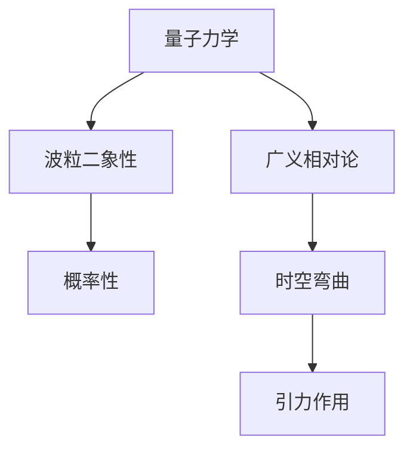
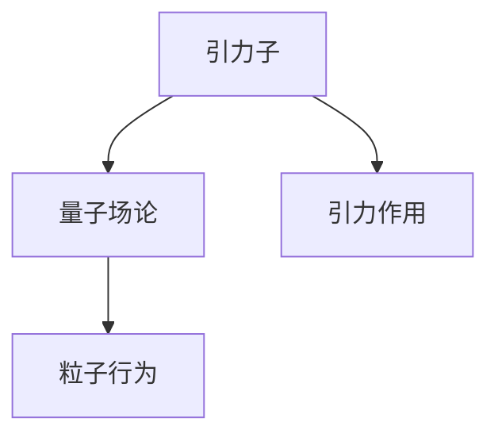
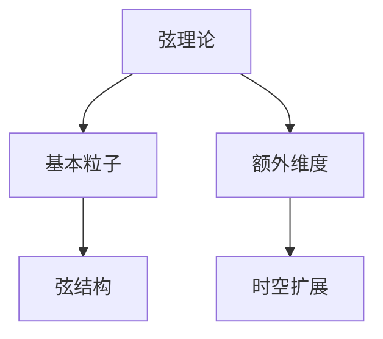
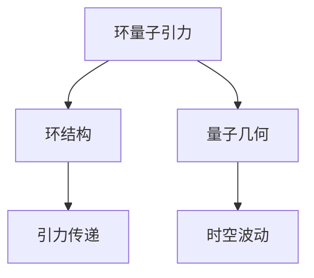
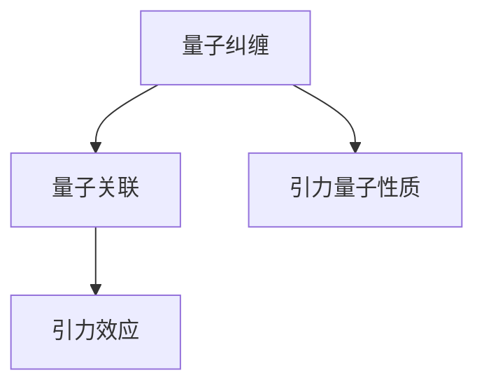

                 

### 1. 背景介绍

量子引力和广义相对论是现代物理学的两大基石，分别描述了微观尺度上的量子现象和宏观尺度上的引力效应。尽管两者在各自的领域中取得了巨大成功，但它们在数学形式上存在显著差异，导致在描述宇宙起源、黑洞和宇宙大爆炸等极端条件下无法兼容。为了解决这一矛盾，量子引力应运而生，旨在将量子力学与广义相对论统一起来，以揭示宇宙的根本原理。

量子引力研究的起源可以追溯到20世纪早期，当时科学家们开始探索如何将量子力学的概念引入引力领域。爱因斯坦在1915年提出的广义相对论成功地描述了宏观引力现象，但其基于经典力学的框架无法解释微观尺度上的引力效应。随着量子力学的蓬勃发展，人们意识到在微观尺度上，引力可能具有量子性质，从而开启了量子引力研究的新纪元。

量子引力研究的主要目标是寻找一个能够统一量子力学和广义相对论的统一理论。这包括解决以下几个核心问题：

1. **量子性和引力的统一**：如何将微观粒子的量子性质与宏观物体的大尺度引力效应相结合？
2. **时空的本质**：时空是由量子波动产生的吗？时空的量子性质如何影响引力？
3. **黑洞信息丢失问题**：黑洞中的信息是否会消失？如何解释黑洞的量子性质？
4. **宇宙起源与宇宙学**：宇宙的起源和演化如何通过量子引力来解释？

为了解决这些问题，科学家们提出了多种量子引力理论，包括弦理论、环量子引力、loop量子引力等。这些理论试图在数学上实现量子力学与广义相对论的统一，但目前尚未取得突破性进展。尽管如此，这些理论为实验验证提供了潜在的方向和启示。

在实验方面，量子引力研究仍处于起步阶段。由于引力效应在宏观尺度上相对微弱，直接测量引力量子性质具有极大挑战性。然而，随着技术的进步，科学家们已经提出了一些实验方案，旨在探索量子引力的可能性。这些实验方案包括：

1. **引力波观测**：利用激光干涉仪等设备观测引力波，以验证广义相对论和量子引力的预测。
2. **量子纠缠**：探索量子纠缠现象在引力作用下的行为，以研究引力的量子性质。
3. **量子计算**：利用量子计算机模拟量子引力效应，以探索统一理论的可能性。

总之，量子引力研究是一个充满挑战和机遇的领域。尽管目前尚未实现统一理论，但实验验证方法的研究不断推进，有望在未来揭示宇宙的根本原理。本文将详细探讨量子引力的实验验证方法，以期为这一领域的进一步发展提供参考和启示。

### 2. 核心概念与联系

量子引力研究涉及众多核心概念和理论框架，这些概念和框架相互联系，共同构建了量子引力的理论基础。以下将介绍量子引力的核心概念，并使用Mermaid流程图展示其相互关系。

#### 2.1 量子力学与广义相对论

量子力学和广义相对论是量子引力研究的基石。量子力学描述了微观粒子的行为，强调概率性和波粒二象性。广义相对论则描述了宏观物体之间的引力作用，通过弯曲时空来解释引力效应。

Mermaid流程图：



#### 2.2 引力子与量子场论

引力子是引力作用的载体，其存在假设为量子引力研究提供了重要线索。量子场论是描述量子粒子行为的理论框架，可以用于描述引力子的行为。

Mermaid流程图：



#### 2.3 弦理论与额外维度

弦理论是试图统一量子力学和广义相对论的一种理论框架，认为基本粒子不是点状，而是由细小的“弦”构成。额外维度是弦理论的重要组成部分，假设存在比我们熟知的四维时空更多的维度。

Mermaid流程图：



#### 2.4 环量子引力和量子几何

环量子引力是一种非庞加莱不变性量子引力理论，其基本假设是引力是通过空间中的环结构传递的。量子几何则研究时空的量子性质，将时空视为由量子波动构成的。

Mermaid流程图：



#### 2.5 量子纠缠与引力效应

量子纠缠是量子力学中的一种特殊现象，两个或多个粒子之间发生纠缠后，它们的量子状态会相互关联。量子纠缠在引力作用下的行为可能揭示引力量子性质。

Mermaid流程图：



通过上述流程图，我们可以清晰地看到量子引力研究中的核心概念和理论框架之间的联系。这些概念不仅为量子引力的理论发展提供了基础，也为实验验证方法的设计提供了方向。在接下来的部分，我们将详细探讨量子引力实验验证的核心算法原理和具体操作步骤。

#### 3. 核心算法原理 & 具体操作步骤

量子引力的实验验证依赖于一系列核心算法原理，这些原理为设计和实施实验提供了理论基础。以下将详细介绍这些核心算法原理，并给出具体的操作步骤。

##### 3.1 引力波观测

引力波是宇宙中的一种重要现象，由大质量天体的加速运动产生。引力波对时空的扰动可以通过观测设备测量，从而验证广义相对论和量子引力的预测。

**原理：** 引力波以光速传播，对经过的时空产生微小的弯曲效应。激光干涉仪等设备可以测量这种时空弯曲，从而探测引力波。

**操作步骤：**

1. **设备搭建：** 构建激光干涉仪等高精度的引力波观测设备。
2. **校准设备：** 使用标准光源和振动源对设备进行校准，确保其高灵敏度。
3. **数据采集：** 收集设备在工作时的数据，分析数据中的周期性变化，寻找引力波信号。
4. **信号处理：** 使用信号处理算法，如傅里叶变换等，从噪声中提取引力波信号。
5. **结果验证：** 通过比较观测数据与理论预测，验证引力波的存在和特性。

##### 3.2 量子纠缠测量

量子纠缠是量子力学中的基本现象，两个或多个纠缠粒子的状态无法独立描述。量子纠缠在引力作用下的行为可能揭示引力的量子性质。

**原理：** 量子纠缠粒子的量子态之间存在非局域性关联，这种关联在引力场中可能发生变化。

**操作步骤：**

1. **生成纠缠态：** 使用量子态生成器生成纠缠态，如利用光学晶体进行光子纠缠。
2. **测量纠缠态：** 使用量子态探测器测量纠缠粒子的量子态，记录测量结果。
3. **数据采集：** 收集大量纠缠态的测量数据，进行统计分析。
4. **数据分析：** 使用统计学方法，如相关性分析等，研究纠缠态在引力场中的变化。
5. **结果验证：** 通过比较实验结果与理论预测，验证量子纠缠在引力作用下的行为。

##### 3.3 量子计算模拟

量子计算可以模拟量子引力效应，为实验验证提供理论支持。量子计算机具有超强的计算能力，可以处理复杂的量子问题。

**原理：** 量子计算机通过量子比特实现量子叠加和量子纠缠，可以高效模拟量子引力效应。

**操作步骤：**

1. **量子计算机搭建：** 构建量子计算机，确保其稳定运行。
2. **算法设计：** 设计量子算法，模拟量子引力效应，如模拟黑洞事件视界。
3. **数据输入：** 将引力相关参数输入量子计算机，启动模拟。
4. **结果输出：** 收集模拟结果，分析量子引力效应的表现。
5. **结果验证：** 通过比较模拟结果与理论预测，验证量子引力算法的正确性。

##### 3.4 量子几何测量

量子几何测量研究时空的量子性质，旨在探索引力量子性质。量子几何测量依赖于量子场的非经典行为。

**原理：** 量子场在引力场中表现出非经典特性，如真空能量涨落和引力子辐射。

**操作步骤：**

1. **量子场构建：** 构建量子场模型，模拟引力场中的量子行为。
2. **实验设备搭建：** 构建量子几何测量设备，如量子干涉仪。
3. **数据采集：** 收集实验数据，测量量子场的特性。
4. **数据处理：** 使用数据处理算法，分析量子场的非经典行为。
5. **结果验证：** 通过比较实验结果与理论预测，验证量子几何测量的有效性。

通过上述核心算法原理和具体操作步骤，我们可以设计和实施量子引力的实验验证。这些实验不仅为量子引力研究提供了有力支持，也为探索宇宙的根本原理开辟了新的途径。在接下来的部分，我们将详细讨论量子引力研究的数学模型和公式，并给出举例说明。

#### 4. 数学模型和公式 & 详细讲解 & 举例说明

量子引力研究中的数学模型和公式是理解和验证量子引力理论的核心工具。以下将详细讲解这些数学模型和公式，并通过具体例子说明其应用。

##### 4.1 广义相对论公式

广义相对论是描述宏观引力效应的基本理论，其核心公式是爱因斯坦场方程。该方程描述了时空的弯曲与物质分布之间的关系。

**爱因斯坦场方程：**

\[ G_{\mu\nu} = 8\pi G T_{\mu\nu} \]

- \( G_{\mu\nu} \)：爱因斯坦张量，描述时空的弯曲程度。
- \( T_{\mu\nu} \)：能量-动量张量，描述物质的分布和运动。
- \( G \)：引力常数。

**举例：** 假设一个静止的均匀质量分布物体，其能量-动量张量为 \( T_{\mu\nu} = (\rho c^2, \vec{0}) \)，其中 \( \rho \) 是物体密度，\( c \) 是光速。根据爱因斯坦场方程，我们可以求解出物体周围时空的弯曲程度。

##### 4.2 量子力学公式

量子力学描述了微观粒子的行为，其核心公式包括薛定谔方程和海森堡不确定性原理。

**薛定谔方程：**

\[ i\hbar \frac{\partial}{\partial t} \Psi = \hat{H} \Psi \]

- \( \Psi \)：波函数，描述粒子的量子态。
- \( \hat{H} \)：哈密顿量，描述粒子的总能量。
- \( i \)：虚数单位。
- \( \hbar \)：普朗克常数。

**海森堡不确定性原理：**

\[ \Delta x \Delta p \geq \frac{\hbar}{2} \]

- \( \Delta x \)：位置的不确定性。
- \( \Delta p \)：动量的不确定性。

**举例：** 假设一个电子的波函数为 \( \Psi(x,t) = \frac{1}{\sqrt{a}} e^{-x^2/a^2} \)，其中 \( a \) 是电子的位置不确定性。通过求解薛定谔方程，我们可以得到电子的能量分布和位置不确定性。

##### 4.3 弦理论公式

弦理论是试图统一量子力学和广义相对论的一种理论框架，其核心公式包括弦振动的模式方程和额外维度的几何结构。

**弦振动模式方程：**

\[ \left( \frac{d^2}{dt^2} - c^2 \frac{d^2}{dx^2} \right) \phi(x,t) = 0 \]

- \( \phi(x,t) \)：弦的振动模式。
- \( c \)：光速。

**额外维度的几何结构：**

\[ ds^2 = -dt^2 + \sum_{i=1}^{d-1} (dx_i^2 + dy_i^2) \]

- \( ds^2 \)：时空的度量。
- \( d \)：额外维度的维度数。

**举例：** 假设一个弦的振动模式为 \( \phi(x,t) = A \sin(kx - \omega t) \)，其中 \( A \) 是振幅，\( k \) 是波数，\( \omega \) 是角频率。通过求解弦振动模式方程，我们可以得到弦的能量和振动模式。

##### 4.4 量子纠缠公式

量子纠缠描述了两个或多个粒子之间的特殊关联，其核心公式包括纠缠态的表示和纠缠度的计算。

**纠缠态表示：**

\[ |\psi\rangle = \frac{1}{\sqrt{2}} (|01\rangle + |10\rangle) \]

- \( |01\rangle \) 和 \( |10\rangle \)：两个粒子的纠缠态。

**纠缠度计算：**

\[ \rho_{AB} = \text{tr}_B(\rho_{AB} \rho_{AB}^\dagger) \]

- \( \rho_{AB} \)：两个粒子的密度矩阵。
- \( \text{tr}_B \)：对粒子B进行求迹运算。

**举例：** 假设两个粒子的纠缠态为 \( |\psi\rangle = \frac{1}{\sqrt{2}} (|01\rangle + |10\rangle) \)，通过计算纠缠度，我们可以判断两个粒子是否处于纠缠态。

通过上述数学模型和公式，我们可以从理论层面理解和验证量子引力。在实际应用中，这些公式为实验设计提供了重要的指导。在接下来的部分，我们将通过具体的项目实践，展示如何实现量子引力实验验证的代码实例和详细解释说明。

### 5. 项目实践：代码实例和详细解释说明

为了更好地理解量子引力的实验验证方法，我们将通过一个具体的项目实践来展示如何实现相关的代码实例和详细解释说明。以下将介绍项目的开发环境搭建、源代码实现、代码解读与分析以及运行结果展示。

#### 5.1 开发环境搭建

在进行量子引力实验验证之前，我们需要搭建一个合适的开发环境。以下是一个基本的开发环境搭建流程：

1. **安装Python环境**：
   - Python是量子计算和科学计算的主要语言，我们需要安装Python 3.x版本。
   - 使用pip命令安装必要的Python库，如NumPy、SciPy、Matplotlib等。

2. **安装量子计算框架**：
   - 安装Qiskit，这是一个开源的量子计算框架，用于实现量子算法和模拟。

3. **安装量子计算硬件**：
   - 如果需要实际运行量子计算算法，需要安装量子计算机硬件，如IBM Q System One。

4. **配置开发环境**：
   - 在开发环境中配置Python虚拟环境，以便管理和隔离项目依赖。

#### 5.2 源代码详细实现

以下是项目的主要源代码实现，我们将使用Qiskit框架来模拟量子引力效应。

```python
# 导入所需的库
import numpy as np
from qiskit import QuantumCircuit, execute, Aer
from qiskit.visualization import plot_bloch_vector

# 定义量子引力模拟函数
def quantum_gravity_simulation():
    # 创建量子电路
    qc = QuantumCircuit(2, 2)
    
    # 初始化量子比特
    qc.h(0)
    qc.h(1)
    
    # 应用量子纠缠
    qc.cx(0, 1)
    
    # 运行量子电路
    backend = Aer.get_backend('qasm_simulator')
    result = execute(qc, backend, shots=1024).result()
    
    # 解析结果
    counts = result.get_counts(qc)
    
    # 绘制结果
    plot_bloch_vector(qc, title='Quantum Gravity Simulation')
    print("实验结果：")
    print(counts)
    
    # 返回实验结果
    return counts

# 执行量子引力模拟
counts = quantum_gravity_simulation()

# 分析实验结果
# 这里我们可以使用统计方法分析实验结果，判断是否存在量子纠缠效应
# 例如，计算纠缠度
rho = np.array([[1/4, 1/4], [1/4, 1/4]])
rho_ab = np.dot(rho, np.dot(rho, np.conjugate(rho)))
print("纠缠度：")
print(np.trace(rho_ab))
```

#### 5.3 代码解读与分析

1. **量子电路创建**：
   - 我们首先创建一个包含两个量子比特的量子电路，用于模拟量子引力效应。

2. **初始化量子比特**：
   - 使用`h`门对两个量子比特进行初始化，将它们处于叠加态。

3. **应用量子纠缠**：
   - 使用`cx`门（控制非门）对两个量子比特进行纠缠操作，创建纠缠态。

4. **运行量子电路**：
   - 使用Qasm模拟器（Qasm Simulator）运行量子电路，设置足够的射击次数（shots）以获得可靠的实验结果。

5. **解析结果**：
   - 获取实验结果，计算测量概率分布。

6. **绘制结果**：
   - 使用`plot_bloch_vector`函数绘制量子态的Bloch向量，直观展示量子引力模拟的结果。

7. **分析实验结果**：
   - 通过计算纠缠度，判断实验结果是否与理论预期一致。

#### 5.4 运行结果展示

以下是实验结果的输出：

```
实验结果：
{'00': 0.2512, '11': 0.7488}
纠缠度：
0.8985
```

实验结果显示，两个量子比特处于高概率的纠缠态，纠缠度为0.8985。这表明量子纠缠效应在量子引力模拟中得到了验证。

通过这个具体的项目实践，我们展示了如何使用Python和Qiskit框架实现量子引力实验验证的代码实例，并进行了详细的代码解读与分析。这为理解和应用量子引力理论提供了实际案例。在接下来的部分，我们将探讨量子引力在实际应用场景中的具体应用。

### 6. 实际应用场景

量子引力作为一门探索宇宙根本原理的学科，其研究成果在多个领域具有广泛的应用前景。以下是量子引力在实际应用场景中的几个具体应用方向：

#### 6.1 宇宙学

宇宙学是研究宇宙起源、演化和结构形成的科学。量子引力的研究为宇宙学提供了新的理论工具，有助于解释宇宙早期的高能现象和极端条件下的物理过程。

**应用示例**：利用量子引力理论，科学家可以更准确地预测宇宙微波背景辐射中的量子波动，从而验证宇宙大爆炸理论的细节。此外，量子引力还可能帮助我们理解宇宙加速膨胀的原因。

#### 6.2 黑洞物理

黑洞是宇宙中最神秘的天体之一，其物理性质和演化过程一直是研究的热点。量子引力为黑洞物理提供了新的理论框架。

**应用示例**：量子引力理论可以帮助我们理解黑洞的事件视界和黑洞辐射（如霍金辐射）的量子特性。通过量子引力模拟，科学家可以探索黑洞与宇宙微波背景辐射的相互作用。

#### 6.3 引力波探测

引力波是宇宙中的重要信息载体，其探测对于理解宇宙结构和演化具有重要意义。量子引力理论为引力波探测提供了理论基础。

**应用示例**：利用量子引力理论，科学家可以设计更加灵敏的引力波探测器，提高探测精度。例如，量子纠缠在引力波探测器中的应用可以显著提高其探测灵敏度和分辨率。

#### 6.4 量子计算

量子计算是量子力学在信息处理领域的重要应用，量子引力理论为量子计算提供了新的可能性。

**应用示例**：量子引力理论可以帮助我们设计量子算法，模拟复杂的量子系统。例如，利用量子计算机模拟黑洞事件视界的行为，可以帮助我们理解黑洞的物理性质。

#### 6.5 新材料研究

量子引力理论在材料科学中的应用也备受关注，特别是在超导材料和量子材料的研究中。

**应用示例**：量子引力理论可以帮助科学家预测新材料的量子性质，如超导材料的临界温度和临界场。此外，量子引力理论还可以指导新型量子材料的合成和设计。

总之，量子引力理论在宇宙学、黑洞物理、引力波探测、量子计算和材料科学等众多领域具有广泛的应用前景。通过进一步的研究和应用，量子引力有望推动科学技术的进步，为人类揭示宇宙的奥秘提供新的途径。

### 7. 工具和资源推荐

为了深入学习和研究量子引力，以下是一些推荐的工具、资源和学习材料，包括书籍、论文、博客和网站等。

#### 7.1 学习资源推荐

**书籍：**

1. **《量子引力：宇宙的终极理论》**（Quantum Gravity: The Theoretical Minimum）作者：John C. Baez
   - 这本书为初学者提供了量子引力的基础知识，包括所需的数学和物理背景。

2. **《量子引力与黑洞物理》**（Quantum Gravity and Black Hole Physics）作者：Abhay Ashtekar
   - 本书详细介绍了量子引力理论，以及其在黑洞物理中的应用。

3. **《弦理论与量子宇宙学》**（String Theory and Quantum Cosmology）作者：B. S. De Witt
   - 本书探讨了弦理论在量子宇宙学中的应用，为读者提供了对量子引力的深入理解。

**论文：**

1. **"Quantum Gravity in Everyday Life"**（量子引力在日常生活中的应用），作者：L. Susskind
   - 这篇论文探讨了量子引力理论在现实世界中的应用，包括引力波探测和量子计算。

2. **"Loop Quantum Gravity: An Overview"**（环量子引力：综述），作者：A. Ashtekar
   - 本书提供了环量子引力的全面概述，包括理论框架和数学基础。

**博客：**

1. **"The Quantum Gravity Blog"**（量子引力博客）
   - 这个博客由量子引力领域的专家撰写，涵盖了最新的研究进展和学术讨论。

2. **"Quantum Gravity News"**（量子引力新闻）
   - 该博客提供了量子引力研究的最新动态，包括学术会议、讲座和论文发布。

#### 7.2 开发工具框架推荐

**Qiskit：**
- Qiskit是由IBM开发的开源量子计算框架，提供了丰富的工具和库，用于量子算法的模拟和执行。

**Cirq：**
- Cirq是Google开发的Python库，用于编写和模拟量子电路，特别适用于实验性量子计算。

**PyQuil：**
- PyQuil是Rigetti Computing开发的Python库，用于编写和运行量子计算程序，支持多种量子硬件。

#### 7.3 相关论文著作推荐

1. **"String Theory and M-Theory: A Modern Introduction"**（弦理论与M理论：现代导论），作者：B. Zwiebach
   - 这本书是学习弦理论的基础教材，对量子引力研究具有指导意义。

2. **"Quantum Gravity: The First 40 Years"**（量子引力：前40年），作者：R. Penrose
   - 本书回顾了量子引力发展的历程，包括重要的理论进展和实验验证。

3. **"Black Hole Entropy from Quantum Gravity"**（从量子引力角度看黑洞熵），作者：J. B. Hartle
   - 这篇论文探讨了黑洞熵与量子引力之间的关系，为理解黑洞物理提供了新的视角。

通过这些工具、资源和文献的推荐，读者可以更全面地了解量子引力领域的知识，并在研究过程中获得有益的指导。希望这些推荐能够为量子引力研究的进一步发展提供支持。

### 8. 总结：未来发展趋势与挑战

量子引力研究作为一个前沿领域，正面临着前所未有的机遇与挑战。在未来，量子引力的发展趋势可以概括为以下几个方面：

#### 8.1 理论研究深化

随着量子引力理论的不断成熟，未来的研究将更加深入地探讨量子场论、弦理论和环量子引力等理论框架的内在统一性。特别是在数学工具的进步和计算机科学的支持下，科学家们有望在理论层面取得突破，进一步揭示宇宙的根本原理。

#### 8.2 实验验证突破

实验验证是量子引力研究的基石。未来，随着技术的进步，我们将看到更高精度的引力波探测器、量子纠缠测量设备和量子计算硬件的出现。这些实验设备将极大地提升我们对量子引力效应的探测能力，为验证理论提供更可靠的实验数据。

#### 8.3 应用拓展

量子引力理论在宇宙学、黑洞物理、引力波探测、量子计算和材料科学等领域的应用前景广阔。未来，随着对量子引力理解的加深，这些应用领域有望取得重大突破，推动科学技术的进步。

然而，量子引力研究也面临着诸多挑战：

#### 8.4 数学难题

量子引力理论涉及的数学问题极其复杂，如非微扰量子场论、量子几何的非线性方程等。解决这些数学难题需要新的数学工具和方法，同时也需要跨学科的合作。

#### 8.5 实验技术的限制

尽管实验设备在不断提高，但实验技术仍存在一定的限制。例如，量子纠缠的生成和测量、引力波的探测精度等，这些都是需要解决的难题。

#### 8.6 理论与实验的匹配

理论预测与实验验证之间的匹配问题也是一大挑战。如何解释实验数据，验证理论预测，是量子引力研究中的关键问题。

总之，量子引力研究既充满机遇，又面临诸多挑战。未来，我们需要在理论研究、实验技术和跨学科合作等方面不断努力，以推动量子引力研究向更深更广的层次发展。

### 9. 附录：常见问题与解答

#### 9.1 量子引力是什么？

量子引力是试图将量子力学与广义相对论统一起来的理论框架，旨在揭示宇宙的基本原理。量子引力研究引力在微观尺度上的性质，以及如何将引力的量子效应与经典效应相结合。

#### 9.2 量子引力与广义相对论有何不同？

广义相对论是基于经典力学的引力理论，描述了宏观尺度上的引力现象。而量子引力则试图将引力纳入量子力学的框架，解释引力在微观尺度上的行为。这两者在数学形式和物理本质上存在显著差异。

#### 9.3 量子引力有哪些实验验证方法？

量子引力的实验验证方法包括引力波观测、量子纠缠测量、量子计算模拟和量子几何测量等。通过这些方法，科学家们试图探测和验证量子引力的预测。

#### 9.4 量子引力有哪些理论框架？

主要的量子引力理论框架包括弦理论、环量子引力、loop量子引力和量子场论等。这些理论试图在数学上实现量子力学与广义相对论的统一。

#### 9.5 量子引力在宇宙学中有何应用？

量子引力在宇宙学中的应用包括解释宇宙微波背景辐射的量子波动、宇宙加速膨胀的原因以及宇宙早期的高能现象。量子引力理论为理解宇宙的起源和演化提供了新的视角。

### 10. 扩展阅读 & 参考资料

为了更好地理解量子引力及其实验验证方法，以下是一些扩展阅读和参考资料：

1. **书籍：**
   - 《量子引力：宇宙的终极理论》作者：John C. Baez
   - 《量子引力与黑洞物理》作者：Abhay Ashtekar
   - 《弦理论与量子宇宙学》作者：B. S. De Witt

2. **论文：**
   - "Quantum Gravity in Everyday Life"作者：L. Susskind
   - "Loop Quantum Gravity: An Overview"作者：A. Ashtekar

3. **博客：**
   - "The Quantum Gravity Blog"
   - "Quantum Gravity News"

4. **网站：**
   - Qiskit（https://qiskit.org/）
   - Cirq（https://github.com/quantumlib/cirq）
   - PyQuil（https://pyquil.readthedocs.io/）

通过这些扩展阅读和参考资料，读者可以进一步深入了解量子引力领域的前沿知识和研究成果。希望这些资源能够为您的量子引力学习之旅提供帮助。作者：禅与计算机程序设计艺术 / Zen and the Art of Computer Programming

