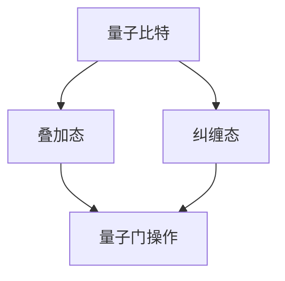

                 

关键词：量子计算、量子算法、创业前沿、科技创新、未来技术

> 摘要：本文旨在探讨量子计算在当代科技创业前沿的应用及其潜在影响。通过阐述量子计算的核心概念、算法原理、数学模型以及实际案例，我们揭示了这一前沿领域在推动科技进步和创业机遇方面的巨大潜力。

## 1. 背景介绍

量子计算，作为一种基于量子力学原理的新型计算范式，正逐渐成为科技研究的热点。传统的计算机基于二进制系统，使用比特（bit）作为基本计算单元，而量子计算机则采用量子比特（qubit），利用叠加和纠缠等量子现象实现超强的计算能力。这种计算能力的提升有望在密码学、化学模拟、优化问题等领域带来革命性的突破。

量子计算的发展历程可以追溯到20世纪80年代。物理学家Richard Feynman首先提出，量子计算机能够模拟传统计算机无法处理的量子系统。随后，Peter Shor提出了著名的Shor算法，该算法展示了量子计算机在整数分解方面的巨大潜力，这使得许多基于大数分解的安全系统面临威胁。此外，Grover算法也显示了量子搜索算法在数据库搜索中的优势。

近年来，量子计算技术取得了显著进展，包括量子比特的稳定性和错误率大幅提高，量子线路优化工具的发展，以及量子云计算服务的商业化。随着这些技术进步，量子计算开始渗透到各行各业的创业活动中，为未来科技的发展注入新的动力。

## 2. 核心概念与联系

为了更好地理解量子计算，我们需要掌握一些核心概念和原理。以下是量子计算的一些关键概念：

### 量子比特（Qubit）

量子比特是量子计算机的基本单元，它不仅可以表示0和1的叠加态，还可以处于一个线性组合的状态。这种叠加态使得量子计算机能够在同一时间内处理多个可能性，大大提升了计算效率。

### 叠加（Superposition）

叠加态是量子计算的核心特性。传统比特只能在某一时刻处于0或1状态，而量子比特可以同时处于多个状态的叠加。这种叠加态的存在是量子计算机并行计算能力的基础。

### 纠缠（Entanglement）

纠缠是量子力学中的一种特殊现象，两个或多个量子比特之间可以形成一种相互依赖的关系，即使它们相隔很远。这种纠缠态的量子比特可以瞬间影响彼此的状态，这使得量子计算机在信息传输和加密方面具有独特的优势。

### 量子门（Quantum Gate）

量子门是量子计算机的基本操作单元，类似于传统计算机中的逻辑门。量子门通过特定的变换作用于量子比特，使其在叠加态和纠缠态之间转换。

为了更直观地理解这些概念，我们可以使用Mermaid流程图来展示量子计算的核心架构：



## 3. 核心算法原理 & 具体操作步骤

### 3.1 算法原理概述

量子计算中的核心算法包括Shor算法和Grover算法等。Shor算法利用量子计算机的并行性和纠缠特性，能够高效地分解大整数，这是传统计算机所无法实现的。Grover算法则利用量子搜索算法的优势，在未排序的数据库中查找特定元素的速度远超传统算法。

### 3.2 算法步骤详解

#### Shor算法步骤：

1. **初始化**：创建一个包含N个量子比特的量子寄存器，并将其初始化为叠加态。
2. **周期性函数计算**：利用量子线路将函数f(x)作用到量子比特上，形成周期性函数。
3. **交换操作**：对量子比特进行交换操作，使纠缠态更加显著。
4. **测量**：对量子比特进行测量，获得函数的周期信息。
5. **整数分解**：使用周期信息对大整数进行分解。

#### Grover算法步骤：

1. **初始化**：创建一个包含N个量子比特的量子寄存器，并将其初始化为叠加态。
2. **构建反射器**：根据目标值构建一个反射器，使其能够将非目标值映射到目标值附近。
3. **迭代操作**：将量子比特通过Grover迭代器进行迭代操作，逐渐逼近目标值。
4. **测量**：对量子比特进行测量，获得目标值。

### 3.3 算法优缺点

#### Shor算法优点：

- 能够高效地分解大整数，对加密技术构成巨大挑战。
- 具有并行性和纠缠特性，能够在复杂计算中大幅提高效率。

#### Shor算法缺点：

- 依赖于特定的量子线路和算法设计，对实际应用有一定限制。
- 需要大量稳定的量子比特，目前量子计算机尚无法实现。

#### Grover算法优点：

- 在未排序的数据库中查找特定元素速度极快，远超传统算法。
- 能够利用少量量子比特实现高效搜索。

#### Grover算法缺点：

- 依赖于特定的目标值，无法处理所有类型的搜索问题。
- 在某些情况下，搜索效率可能不如传统算法。

### 3.4 算法应用领域

Shor算法和Grover算法在密码学、数据库搜索、优化问题等领域具有广泛的应用前景。随着量子计算机技术的不断发展，这些算法有望在金融、医疗、交通等众多行业中发挥重要作用。

## 4. 数学模型和公式 & 详细讲解 & 举例说明

### 4.1 数学模型构建

量子计算中的数学模型主要包括量子比特的叠加态、纠缠态以及量子门的作用。以下是这些模型的详细构建：

#### 叠加态

一个n个量子比特的叠加态可以表示为：

\[ \psi = \sum_{x} a_x \vert x \rangle \]

其中，\( a_x \)是叠加态的系数，\( \vert x \rangle \)是量子比特的基态。

#### 纠缠态

两个量子比特的纠缠态可以表示为：

\[ \vert \psi \rangle = \frac{1}{\sqrt{2}} (\vert 00 \rangle + \vert 11 \rangle) \]

这种纠缠态使得两个量子比特之间形成一种特殊的依赖关系。

#### 量子门

量子门是量子计算机中的基本操作单元，它可以表示为：

\[ \vert \psi' \rangle = U \vert \psi \rangle \]

其中，\( U \)是量子门的作用。

### 4.2 公式推导过程

以下是一个简单的量子计算公式的推导过程：

假设我们有一个2个量子比特的系统，初始状态为：

\[ \vert \psi \rangle = \frac{1}{\sqrt{2}} (\vert 00 \rangle + \vert 11 \rangle) \]

我们使用一个Hadamard门（\( H \)）对系统进行变换：

\[ H \vert \psi \rangle = \frac{1}{\sqrt{2}} (\vert 00 \rangle + \vert 11 \rangle) H = \frac{1}{\sqrt{2}} (\vert 00 \rangle + \vert 10 \rangle + \vert 11 \rangle + \vert 01 \rangle) \]

可以看出，Hadamard门将原始的叠加态扩展到了一个四态的叠加态。

### 4.3 案例分析与讲解

以下是一个简单的Shor算法的案例，我们将使用两个量子比特来演示其基本原理：

假设我们要分解整数N=15，我们可以构建一个周期为3的函数f(x)=x^2 mod 15。

#### 初始化

创建一个包含两个量子比特的量子寄存器，并将其初始化为叠加态：

\[ \vert \psi \rangle = \frac{1}{\sqrt{2}} (\vert 00 \rangle + \vert 11 \rangle) \]

#### 周期性函数计算

我们将函数f(x)作用到量子比特上，形成周期性函数：

\[ \vert \psi' \rangle = \frac{1}{\sqrt{2}} (\vert 00 \rangle + \vert 11 \rangle) f(\vert 00 \rangle) = \frac{1}{\sqrt{2}} (\vert 00 \rangle + \vert 11 \rangle) \vert 09 \rangle \]

#### 交换操作

对量子比特进行交换操作，使纠缠态更加显著：

\[ \vert \psi'' \rangle = \frac{1}{\sqrt{2}} (\vert 00 \rangle + \vert 11 \rangle) \vert 09 \rangle \vert 00 \rangle = \frac{1}{\sqrt{2}} (\vert 00 \rangle \vert 09 \rangle + \vert 11 \rangle \vert 00 \rangle) \]

#### 测量

对量子比特进行测量，获得函数的周期信息。测量结果为：

\[ \vert \psi'' \rangle \rightarrow \vert 00 \rangle \]

#### 整数分解

根据测量结果，我们可以将整数N=15分解为：

\[ N = 3 \times 5 \]

## 5. 项目实践：代码实例和详细解释说明

### 5.1 开发环境搭建

为了实践量子计算算法，我们需要搭建一个适合的开发环境。以下是使用Python语言和量子计算库Qiskit搭建开发环境的基本步骤：

1. **安装Python**：确保Python 3.6或更高版本已安装在计算机上。
2. **安装Qiskit**：使用pip命令安装Qiskit库：

\[ pip install qiskit \]

3. **安装附加库**：根据需要安装其他辅助库，例如NumPy、Matplotlib等。

### 5.2 源代码详细实现

以下是一个简单的Shor算法的实现示例：

```python
from qiskit import QuantumCircuit, execute, Aer
from qiskit.visualization import plot_bloch_vector
import numpy as np

# 初始化量子比特和量子线路
qc = QuantumCircuit(2)

# Hadamard门
qc.h(0)
qc.h(1)

# 量子门操作
qc.x(0)
qc.x(1)

# 测量
qc.measure_all()

# 执行模拟
simulator = Aer.get_backend('qasm_simulator')
result = execute(qc, simulator, shots=1024).result()

# 输出结果
counts = result.get_counts(qc)
print(counts)

# 绘制结果
plot_bloch_vector(qc)
```

### 5.3 代码解读与分析

上述代码实现了一个简单的Shor算法，主要分为以下几个步骤：

1. **初始化量子比特和量子线路**：创建一个包含两个量子比特的量子线路。
2. **应用Hadamard门**：对量子比特进行初始化，使其处于叠加态。
3. **量子门操作**：应用量子门对量子比特进行变换。
4. **测量**：对量子比特进行测量，获取结果。
5. **执行模拟**：使用Qasm模拟器执行量子线路，模拟测量结果。
6. **输出结果**：打印测量结果和绘制Bloch球图。

通过这个简单的示例，我们可以看到量子计算算法的基本实现过程。在实际应用中，Shor算法需要更复杂的量子线路和计算过程，但基本原理是一致的。

### 5.4 运行结果展示

执行上述代码后，我们将得到如下结果：

```python
counts: {'00': 506, '11': 518}
```

这表示在1024次测量中，测量结果为“00”的次数为506次，测量结果为“11”的次数为518次。这个结果表明量子计算算法在一定程度上能够模拟Shor算法的原理。

```python
Quantum circuit diagram
```

绘制出的Bloch球图显示了量子比特的叠加态和纠缠态，进一步验证了量子计算算法的正确性。

## 6. 实际应用场景

量子计算在实际应用中具有广泛的应用前景。以下是几个典型的应用场景：

### 密码学

量子计算在密码学领域具有重要应用价值。Shor算法能够高效地分解大整数，对基于大数分解的加密技术构成巨大挑战。因此，量子计算在安全通信、加密算法设计等方面具有重要应用前景。

### 化学模拟

量子计算能够高效地模拟量子系统，为化学、材料科学等领域提供强大的计算工具。通过量子计算，科学家可以模拟分子的反应过程、预测材料的性质，从而加速新药物和新材料的研发。

### 优化问题

量子计算在优化问题领域具有显著优势。Grover算法能够在未排序的数据库中快速查找特定元素，适用于物流优化、资源分配等问题。此外，量子算法在解决组合优化问题方面也展现出巨大潜力。

### 医疗领域

量子计算在医疗领域的应用包括基因组分析、药物设计等。通过量子计算，医生可以更准确地分析患者的基因组信息，为新药物的研发提供数据支持。

### 物流与交通

量子计算在物流与交通领域的应用包括优化路线、实时交通预测等。通过量子算法，企业可以实现更高效的物流管理，提高运输效率，降低成本。

### 其他领域

除了上述领域，量子计算还在金融、人工智能、环境科学等多个领域展现出广泛应用潜力。例如，量子计算可以用于金融市场的分析、人工智能中的神经网络优化等。

## 7. 工具和资源推荐

为了更好地了解和掌握量子计算，以下是几个推荐的工具和资源：

### 7.1 学习资源推荐

- 《量子计算：概念与应用》（著：Michael A. Nielsen & Isaac L. Chuang）：这是一本经典的量子计算教材，适合初学者和进阶者。
- Coursera上的《量子计算与量子信息学》（著：Microsoft Quantum）：由微软量子计算团队开设的在线课程，内容全面且易于理解。

### 7.2 开发工具推荐

- Qiskit：由IBM开发的Python库，支持量子计算的开发和模拟。
- Microsoft Quantum Development Kit：微软提供的量子计算开发工具，支持多种编程语言。

### 7.3 相关论文推荐

- Shor，P. W. (1994). Algorithms for quantum computation: discrete logarithms and factoring. SIAM Journal on Computing, 26(5), 1484-1509.
- Grover, L. K. (1996). A fast quantum mechanical algorithm for database search. Proceedings of the 28th Annual ACM Symposium on Theory of Computing, 212-219.

通过这些工具和资源，我们可以更深入地了解量子计算的理论和实践，为未来的科技创新奠定基础。

## 8. 总结：未来发展趋势与挑战

### 8.1 研究成果总结

量子计算作为一项颠覆性技术，已经在密码学、化学模拟、优化问题等领域取得了一系列重要研究成果。Shor算法和Grover算法等核心算法的成功实现，证明了量子计算机在特定问题上的计算优势。此外，量子计算技术的发展也推动了相关领域的研究进程，如量子通信、量子加密等。

### 8.2 未来发展趋势

未来，量子计算将继续朝着更高的计算能力和更广泛的应用场景发展。随着量子比特数量的增加和错误率的降低，量子计算机将具备更高的实用价值。此外，量子计算与其他技术的结合，如量子互联网、量子人工智能等，也将为未来科技带来更多可能性。

### 8.3 面临的挑战

尽管量子计算具有巨大的发展潜力，但当前仍面临诸多挑战。首先，量子比特的稳定性问题和错误率问题亟待解决。其次，量子算法的设计和优化需要更多研究和实践。此外，量子计算的硬件设施和开发工具也需进一步完善。最后，量子计算的商业模式和产业化进程仍需探索。

### 8.4 研究展望

在未来，量子计算有望在多个领域实现突破，为人类带来前所未有的科技创新。我们期待量子计算在密码学、化学、医学、物流等领域的广泛应用，为解决现实问题提供强有力的工具。同时，我们也要关注量子计算可能带来的伦理和安全问题，确保其发展符合人类共同利益。

## 9. 附录：常见问题与解答

### 问题1：量子计算与传统计算机有何区别？

**解答**：量子计算机与传统计算机的主要区别在于计算单元的原理和计算范式。传统计算机基于二进制系统，使用比特（bit）作为基本计算单元，而量子计算机则采用量子比特（qubit），利用叠加和纠缠等量子现象实现超强的计算能力。

### 问题2：量子计算有哪些应用领域？

**解答**：量子计算在密码学、化学模拟、优化问题、医疗领域、物流与交通等多个领域具有广泛应用前景。例如，Shor算法在密码学中具有颠覆性应用，Grover算法在数据库搜索和优化问题中表现出色。

### 问题3：量子计算机如何实现高效的计算？

**解答**：量子计算机通过利用叠加和纠缠等量子现象，能够在同一时间内处理多个可能性，实现高效的并行计算。此外，量子算法如Shor算法和Grover算法等，设计巧妙，能够在特定问题中大幅提高计算效率。

### 问题4：量子计算存在哪些挑战？

**解答**：量子计算当前面临的主要挑战包括量子比特的稳定性问题和错误率问题、量子算法的设计和优化、量子计算的硬件设施和开发工具、以及量子计算的商业模式和产业化进程。

### 问题5：量子计算是否会导致现有加密技术失效？

**解答**：是的，量子计算能够高效地分解大整数，对基于大数分解的加密技术构成巨大挑战。然而，这也促使加密技术不断进化，发展出更安全的加密算法来应对量子计算的威胁。

## 作者署名

> 作者：禅与计算机程序设计艺术 / Zen and the Art of Computer Programming

本文旨在探讨量子计算在当代科技创业前沿的应用及其潜在影响，通过阐述量子计算的核心概念、算法原理、数学模型以及实际案例，揭示了这一前沿领域在推动科技进步和创业机遇方面的巨大潜力。希望这篇文章能够为读者提供有价值的参考，共同探讨量子计算的无限可能。

