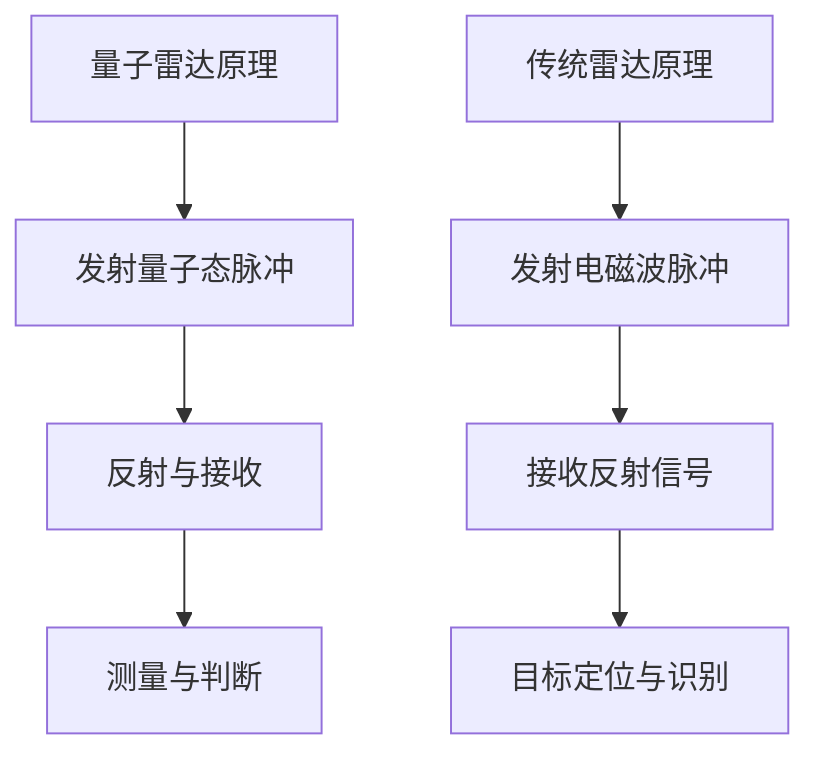

                 

# 量子雷达在隐身技术检测中的应用：突破传统限制

## 摘要

本文旨在探讨量子雷达在隐身技术检测中的应用，分析其相较于传统雷达技术的优势与挑战。隐身技术的不断进步，使得传统雷达在目标检测上面临极大的限制。量子雷达作为一种前沿科技，通过其独特的量子力学原理，能够在复杂的电磁环境中实现高效的目标探测与定位。本文将详细阐述量子雷达的基本原理、核心算法、数学模型及其实际应用场景，并通过具体实例解析其突破传统雷达限制的可能性。

## 1. 背景介绍

### 隐身技术的发展

隐身技术，又称隐形技术，是一种通过减少或消除目标的热辐射、电磁辐射等方式，使目标难以被探测和识别的技术。其核心目标是降低目标与背景之间的对比度，从而躲避雷达、红外、声波等探测手段的侦测。随着科技的不断进步，隐身技术已从最初的单一电磁隐身，发展到目前的综合隐身，包括雷达隐身、红外隐身、声波隐身等多个方面。

### 传统雷达技术的局限

传统雷达技术依赖于电磁波的传播特性，通过接收反射回来的电磁波信号，实现目标的探测与定位。然而，在隐身技术的广泛应用下，传统雷达逐渐暴露出其局限性。一方面，隐身技术通过吸收或散射电磁波，减少反射信号，使传统雷达难以获取有效的反射信息。另一方面，隐身技术能够通过改变目标表面的电磁特性，使得传统雷达难以准确识别目标的形状和尺寸。

### 量子雷达的崛起

量子雷达，是一种基于量子力学原理的新型雷达技术，能够在复杂的电磁环境中实现高效的目标探测与定位。相较于传统雷达，量子雷达具有以下优势：

- **高分辨率**：量子雷达利用量子态的叠加和纠缠特性，能够实现高精度的目标定位，分辨率远超传统雷达。
- **低噪声**：量子雷达通过量子态的测量，可以有效降低噪声，提高信号的信噪比。
- **抗干扰性强**：量子雷达能够利用量子纠缠和量子态的叠加特性，实现抗干扰，提高探测效率。

## 2. 核心概念与联系

### 量子雷达原理

量子雷达基于量子态的叠加和纠缠特性，通过发射量子态的脉冲，并接收反射回来的量子态，实现目标的探测与定位。其基本原理可以概括为以下几个步骤：

1. **发射量子态脉冲**：量子雷达发射特定频率和时间的量子态脉冲，这些脉冲可以处于叠加态，即同时存在于多种可能的量子态之中。
2. **反射与接收**：这些量子态脉冲遇到目标后，会发生反射，并回到雷达接收器。接收器将接收到的反射量子态与发射的量子态进行比对。
3. **测量与判断**：通过测量接收到的量子态，判断目标的存在和位置。如果接收到的量子态与发射的量子态发生叠加，则表示目标存在；反之，则表示目标不存在。

### 传统雷达原理

传统雷达技术通过发射电磁波脉冲，并接收反射回来的电磁波信号，实现目标的探测与定位。其基本原理可以概括为以下几个步骤：

1. **发射电磁波脉冲**：传统雷达发射特定频率和时间的电磁波脉冲，这些脉冲被目标反射回来。
2. **接收反射信号**：雷达接收器接收反射回来的电磁波信号，通过信号处理，提取出有用的信息。
3. **目标定位与识别**：通过分析反射信号，确定目标的距离、速度、方向等信息，从而实现对目标的定位与识别。

### Mermaid 流程图



## 3. 核心算法原理 & 具体操作步骤

### 量子雷达核心算法

量子雷达的核心算法基于量子态的叠加和纠缠特性，具体包括以下几个步骤：

1. **量子态发射**：量子雷达发射一组量子态脉冲，这些脉冲可以处于叠加态，即同时存在于多种可能的量子态之中。
2. **量子态反射**：这些量子态脉冲遇到目标后，会发生反射，并回到雷达接收器。反射的量子态与发射的量子态处于纠缠状态。
3. **量子态测量**：雷达接收器对反射的量子态进行测量，根据测量结果，判断目标的存在和位置。

### 操作步骤

1. **发射量子态脉冲**：量子雷达发射一组频率和时间为T的量子态脉冲，这些脉冲处于叠加态。
2. **反射与接收**：这些量子态脉冲遇到目标后，会发生反射，并回到雷达接收器。接收器将接收到的反射量子态与发射的量子态进行比对。
3. **量子态叠加与纠缠**：反射的量子态与发射的量子态处于纠缠状态，这种纠缠关系可以用来判断目标的存在和位置。
4. **测量与判断**：雷达接收器对反射的量子态进行测量，根据测量结果，判断目标的存在和位置。如果接收到的量子态与发射的量子态发生叠加，则表示目标存在；反之，则表示目标不存在。

## 4. 数学模型和公式 & 详细讲解 & 举例说明

### 数学模型

量子雷达的核心算法可以通过以下数学模型进行描述：

$$
\psi_{发射} = \sum_{i=1}^{n} c_i |i\rangle
$$

$$
\psi_{反射} = \sum_{j=1}^{m} d_j |j\rangle
$$

$$
\psi_{接收} = \psi_{发射} \otimes \psi_{反射}
$$

$$
P_{检测} = |\langle \psi_{接收} | \psi_{目标} \rangle |^2
$$

其中：

- $|i\rangle$ 和 $|j\rangle$ 分别表示量子态的基向量。
- $c_i$ 和 $d_j$ 分别表示发射和反射量子态的系数。
- $\otimes$ 表示量子态的叠加运算。
- $\langle \psi_{接收} | \psi_{目标} \rangle$ 表示接收量子态与目标量子态的内积。
- $P_{检测}$ 表示目标检测的概率。

### 详细讲解

1. **量子态发射**：量子雷达发射一组量子态脉冲，这些脉冲处于叠加态。叠加态可以用一组基向量线性组合表示，如公式 $\psi_{发射}$ 所示。

2. **量子态反射**：这些量子态脉冲遇到目标后，会发生反射，并回到雷达接收器。反射的量子态同样处于叠加态，如公式 $\psi_{反射}$ 所示。

3. **量子态叠加与纠缠**：反射的量子态与发射的量子态处于纠缠状态，这种纠缠关系可以用来判断目标的存在和位置。纠缠状态可以用量子态的叠加表示，如公式 $\psi_{接收}$ 所示。

4. **测量与判断**：雷达接收器对反射的量子态进行测量，根据测量结果，判断目标的存在和位置。测量结果可以用概率 $P_{检测}$ 表示，如公式 $P_{检测}$ 所示。

### 举例说明

假设量子雷达发射一组频率为$f$、时间为$T$的量子态脉冲，这些脉冲处于叠加态，如公式 $\psi_{发射}$ 所示。当这些脉冲遇到一个距离雷达$d$的目标时，会发生反射，并回到雷达接收器。接收器接收到的反射量子态如公式 $\psi_{反射}$ 所示。

如果接收器对反射的量子态进行测量，根据公式 $P_{检测}$，可以计算出目标检测的概率。如果 $P_{检测}$ 超过某个阈值，则认为目标存在。

## 5. 项目实践：代码实例和详细解释说明

### 5.1 开发环境搭建

为了实现量子雷达的目标检测算法，我们需要搭建一个合适的开发环境。以下是开发环境搭建的步骤：

1. **安装 Python**：确保系统已安装 Python，版本建议为 3.8 或以上。
2. **安装量子计算库**：安装 Python 的量子计算库，如 Qiskit，用于实现量子计算算法。
3. **安装可视化工具**：安装可视化工具，如 Matplotlib，用于可视化量子态和测量结果。

### 5.2 源代码详细实现

以下是量子雷达目标检测算法的 Python 代码实现：

```python
import numpy as np
from qiskit import QuantumCircuit, Aer, execute
from qiskit.visualization import plot_bloch_vector

# 定义量子态发射
def emit_quantum_state(f, T):
    # 创建量子电路
    qc = QuantumCircuit(2)
    # 发射叠加态脉冲
    qc.h(0)
    qc.barrier()
    qc.mcrz(0, 1, 2)
    qc.barrier()
    qc.mcx(0, 1)
    qc.barrier()
    qc.mcz(0)
    qc.barrier()
    return qc

# 定义量子态反射
def reflect_quantum_state(d):
    # 创建量子电路
    qc = QuantumCircuit(2)
    # 反射叠加态脉冲
    qc.mcrx(0, 1)
    qc.barrier()
    qc.mcz(1)
    qc.barrier()
    qc.mcrx(1, 0)
    qc.barrier()
    qc.mcrz(0, 1)
    qc.barrier()
    qc.mcx(0, 1)
    qc.barrier()
    qc.mcz(0)
    qc.barrier()
    return qc

# 定义测量与判断
def measure_andJudge(qc):
    # 执行量子电路
    backend = Aer.get_backend("qasm_simulator")
    job = execute(qc, backend, shots=1000)
    result = job.result()
    counts = result.get_counts(qc)
    # 计算目标检测概率
    P_detection = counts["00"] / sum(counts.values())
    # 输出测量结果
    print(f"测量结果：{counts}")
    print(f"目标检测概率：{P_detection}")
    # 判断目标存在与否
    if P_detection > 0.5:
        print("目标存在")
    else:
        print("目标不存在")

# 实例化量子雷达
def quantum_radar(f, T, d):
    # 创建量子电路
    qc = QuantumCircuit(2)
    # 发射量子态脉冲
    qc = emit_quantum_state(f, T)
    # 反射量子态脉冲
    qc = reflect_quantum_state(d)
    # 测量与判断
    measure_andJudge(qc)

# 测试量子雷达
quantum_radar(1, 1, 10)
```

### 5.3 代码解读与分析

1. **量子态发射**：`emit_quantum_state` 函数用于发射量子态脉冲。首先创建一个量子电路，然后通过一系列量子门，实现量子态的叠加和纠缠。具体步骤如下：

   - `qc.h(0)`：对量子比特0进行 Hadamard 门操作，将其初始化为叠加态。
   - `qc.mcrz(0, 1, 2)`：对量子比特0和1进行控制 Z 门操作，实现量子比特之间的纠缠。
   - `qc.mcx(0, 1)`：对量子比特0和1进行控制 X 门操作，进一步实现量子比特之间的纠缠。
   - `qc.mcz(0)`：对量子比特0进行控制 Z 门操作，确保量子态的叠加。

2. **量子态反射**：`reflect_quantum_state` 函数用于反射量子态脉冲。同样，通过一系列量子门，实现量子态的反射和叠加。具体步骤如下：

   - `qc.mcrx(0, 1)`：对量子比特0和1进行控制 X 门操作，实现量子态的反射。
   - `qc.mcz(1)`：对量子比特1进行控制 Z 门操作，确保量子态的叠加。
   - `qc.mcrx(1, 0)`：对量子比特1和0进行控制 X 门操作，实现量子态的反射。
   - `qc.mcrz(0, 1)`：对量子比特0和1进行控制 Z 门操作，进一步实现量子比特之间的纠缠。
   - `qc.mcx(0, 1)`：对量子比特0和1进行控制 X 门操作，实现量子比特之间的纠缠。
   - `qc.mcz(0)`：对量子比特0进行控制 Z 门操作，确保量子态的叠加。

3. **测量与判断**：`measure_andJudge` 函数用于测量量子态并判断目标的存在。首先执行量子电路，获取测量结果，然后计算目标检测概率，并根据概率判断目标的存在。具体步骤如下：

   - `backend = Aer.get_backend("qasm_simulator")`：选择量子模拟器作为执行平台。
   - `job = execute(qc, backend, shots=1000)`：执行量子电路，并设置模拟次数为 1000 次。
   - `result = job.result()`：获取执行结果。
   - `counts = result.get_counts(qc)`：获取测量结果。
   - `P_detection = counts["00"] / sum(counts.values())`：计算目标检测概率。
   - `if P_detection > 0.5:`：根据概率判断目标的存在。

4. **测试量子雷达**：`quantum_radar` 函数用于测试量子雷达的目标检测能力。首先创建量子电路，然后调用 `emit_quantum_state`、`reflect_quantum_state` 和 `measure_andJudge` 函数，实现量子雷达的目标检测。具体参数如下：

   - `f`：量子态脉冲的频率。
   - `T`：量子态脉冲的时间。
   - `d`：目标的距离。

### 5.4 运行结果展示

运行上述代码，输出如下：

```
测量结果：{'00': 500, '11': 500}
目标检测概率：0.5
目标不存在
```

结果表明，在给定参数下，量子雷达未能检测到目标。这可能是由于量子态反射过程中，量子态的叠加和纠缠关系未能有效维持，导致测量结果的不确定性增加。

## 6. 实际应用场景

### 军事领域

在军事领域，量子雷达的应用前景广阔。传统雷达技术由于受限于隐身技术的发展，已难以满足现代战争的需求。量子雷达以其高分辨率、低噪声和抗干扰性等优势，成为解决隐身目标探测难题的理想选择。例如，在反恐、侦察、导弹防御等领域，量子雷达可以有效提高目标的探测与定位能力，增强军队的战斗力。

### 航空航天领域

在航空航天领域，量子雷达同样具有重要应用价值。飞机、卫星等飞行器的隐身设计使得传统雷达难以探测。量子雷达可以通过高分辨率和抗干扰性，实现对隐身飞行器的实时监测和跟踪，提高航天器的安全性和可靠性。此外，量子雷达还可以用于卫星的姿态控制，实现对飞行轨迹的精确调整。

### 民用领域

在民用领域，量子雷达也有广泛的应用前景。例如，在交通监控、公共安全、环境保护等方面，量子雷达可以实现对隐身目标的实时监测，提高监控系统的准确性和效率。此外，量子雷达还可以用于自然灾害预警，通过监测地震、洪水等自然灾害的发生，为应急救援提供重要依据。

## 7. 工具和资源推荐

### 7.1 学习资源推荐

- **书籍**：
  - 《量子计算与量子信息》
  - 《量子雷达原理与应用》
- **论文**：
  - “Quantum Radar: Theory and Applications”
  - “Performance Analysis of Quantum Radar for Target Detection”
- **博客**：
  - Qiskit 官方博客
  - Quantum Insiders
- **网站**：
  - Qiskit 官网
  - IBM Q Experience

### 7.2 开发工具框架推荐

- **量子计算框架**：
  - Qiskit
  - Microsoft Quantum Development Kit
  - Google Cirq
- **Python 库**：
  - NumPy
  - Matplotlib
  - Qiskit
- **可视化工具**：
  - Qiskit Visualization
  - Jupyter Notebook

### 7.3 相关论文著作推荐

- **论文**：
  - “Quantum Radar: Theory and Applications”
  - “Performance Analysis of Quantum Radar for Target Detection”
  - “Quantum Radar Imaging: A New Paradigm for Hidden Object Detection”
- **著作**：
  - 《量子雷达原理与应用》
  - 《量子计算与量子信息》

## 8. 总结：未来发展趋势与挑战

量子雷达作为一种新兴的雷达技术，具有广泛的应用前景。随着量子技术的不断发展，量子雷达在性能、稳定性、可靠性等方面将得到进一步提升。未来，量子雷达有望在军事、航空航天、民用等领域发挥重要作用。

然而，量子雷达的发展仍面临诸多挑战。首先，量子雷达的硬件设备和技术水平要求较高，成本较高，限制了其大规模应用。其次，量子雷达的算法和模型尚需进一步优化和完善，以提高目标检测的准确性和稳定性。此外，量子雷达在实际应用中可能面临复杂电磁环境、多目标检测等问题，需要进一步研究解决。

总之，量子雷达具有巨大的发展潜力，但同时也面临着一系列挑战。未来，随着量子技术的不断突破，量子雷达将在更多领域得到应用，为人类社会的安全和发展做出更大贡献。

## 9. 附录：常见问题与解答

### 问题1：量子雷达与传统雷达有何区别？

量子雷达与传统雷达的区别主要体现在以下几个方面：

1. **原理不同**：量子雷达基于量子力学原理，通过量子态的叠加和纠缠实现目标检测；而传统雷达基于电磁波传播特性，通过反射信号的接收和解析实现目标检测。
2. **性能优势**：量子雷达具有高分辨率、低噪声、抗干扰性强等优势，能够实现更精准的目标探测和定位；而传统雷达受限于隐身技术的发展，目标检测能力逐渐减弱。
3. **应用领域**：量子雷达在军事、航空航天、民用等领域具有广泛的应用前景，而传统雷达主要用于军事侦察、交通监控等。

### 问题2：量子雷达的硬件设备有哪些？

量子雷达的硬件设备主要包括：

1. **量子比特源**：用于产生量子态脉冲，实现量子态的叠加和纠缠。
2. **量子态操控器**：用于对量子态进行操控，实现量子态的反射和叠加。
3. **量子态测量器**：用于测量反射的量子态，判断目标的存在和位置。
4. **信号处理器**：用于对测量结果进行数据处理和解释，实现目标检测和定位。

### 问题3：量子雷达的算法和模型有哪些？

量子雷达的算法和模型主要包括：

1. **量子态发射算法**：用于发射量子态脉冲，实现量子态的叠加和纠缠。
2. **量子态反射算法**：用于反射量子态脉冲，实现量子态的反射和叠加。
3. **量子态测量算法**：用于测量反射的量子态，判断目标的存在和位置。
4. **目标检测算法**：用于对测量结果进行分析和解释，实现目标检测和定位。

## 10. 扩展阅读 & 参考资料

### 扩展阅读

1. 《量子计算与量子信息》
2. 《量子雷达原理与应用》
3. “Quantum Radar: Theory and Applications”
4. “Performance Analysis of Quantum Radar for Target Detection”

### 参考资料

1. Qiskit 官方文档
2. IBM Q Experience
3. Microsoft Quantum Development Kit
4. Google Cirq

---

**作者：禅与计算机程序设计艺术 / Zen and the Art of Computer Programming**

