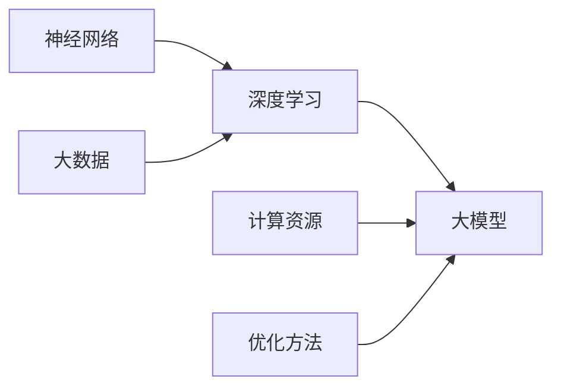

                 

### 1. 背景介绍

随着人工智能技术的飞速发展，机器学习尤其是深度学习在各个领域取得了显著的成果。在金融服务领域，人工智能的应用逐渐深入，为金融机构提供了更加智能化的解决方案。其中，大模型（Large Models）作为深度学习领域的一个突破性进展，正成为金融服务创新的重要工具。

大模型，顾名思义，是指具有巨大参数量的神经网络模型。这些模型通过学习海量数据，能够捕捉到复杂的数据分布，从而实现高精度的预测和决策。在金融服务中，大模型的应用涵盖了风险管理、信用评估、投资策略优化等多个方面，大大提升了金融服务的效率和准确性。

本文将围绕“金融服务中的AI大模型创新”这一主题，首先介绍大模型的发展背景，然后深入探讨其核心概念与联系，解析大模型的算法原理与操作步骤，分析其背后的数学模型与公式，并通过实际项目实践展示大模型的应用效果。最后，我们将探讨大模型在金融服务中的实际应用场景，推荐相关学习资源和开发工具，并展望未来的发展趋势与挑战。

### 2. 核心概念与联系

在深入探讨大模型的原理和应用之前，我们需要先理解几个核心概念，这些概念包括神经网络、深度学习、大数据等。

**神经网络（Neural Network）**：神经网络是模仿人脑神经元结构和功能的一种计算模型。它由大量相互连接的节点（或称为神经元）组成，每个节点通过权重连接到其他节点，并通过激活函数产生输出。神经网络通过不断调整这些权重，实现对输入数据的分类、预测或特征提取。

**深度学习（Deep Learning）**：深度学习是神经网络的一种特殊形式，具有多个隐藏层，能够自动提取数据的层次化特征。与传统机器学习方法相比，深度学习在处理复杂数据时表现出更强的能力和适应性。随着计算能力的提升和海量数据的可用性，深度学习在图像识别、自然语言处理、语音识别等领域取得了突破性进展。

**大数据（Big Data）**：大数据指的是无法使用传统数据处理工具在合理时间内进行捕获、管理和处理的数据集合。大数据具有“4V”特征：即数据量（Volume）、数据速度（Velocity）、数据多样性（Variety）和数据真实性（Veracity）。大数据技术的发展，使得我们从海量数据中挖掘有价值信息成为可能。

大模型的核心概念与联系可以归纳如下：

1. **参数规模**：大模型的显著特点是其参数规模巨大，这使其能够处理复杂的问题。例如，谷歌的BERT模型拥有超过10亿个参数，Facebook的GPT-3模型则超过1.5万亿个参数。

2. **数据需求**：大模型需要大量训练数据来学习复杂的模式和特征。金融数据通常具有高维度、非线性关系和噪声等特点，这对大模型的数据需求提出了挑战。

3. **计算资源**：训练大模型需要大量的计算资源，尤其是在模型优化和训练过程中。云计算和分布式计算技术的发展，为大规模模型训练提供了基础设施。

4. **优化方法**：大模型的训练过程通常涉及复杂的优化算法，如梯度下降、Adam优化器等。优化方法的选择直接影响到模型的训练效率和性能。

为了更好地理解大模型的概念和联系，我们可以通过以下Mermaid流程图来展示神经网络、深度学习和大数据之间的关系：



在这个流程图中，神经网络是深度学习的基础，深度学习通过增加网络层数和神经元数量，发展出了大模型。同时，大数据为深度学习和大模型提供了丰富的训练素材，而计算资源和优化方法则保障了大模型的高效训练和优化。

### 3. 核心算法原理 & 具体操作步骤

大模型的核心算法原理可以归结为以下几个方面：前向传播、反向传播和优化算法。

#### 前向传播（Forward Propagation）

前向传播是神经网络进行预测或分类的基础过程。在这个过程中，输入数据通过网络的每一层，每个节点根据其权重和激活函数产生输出。具体步骤如下：

1. **初始化参数**：包括网络的权重和偏置，通常通过随机初始化。

2. **输入数据传递**：将输入数据传递到第一层神经网络，并通过权重计算每个节点的输入值。

3. **激活函数应用**：对每个节点的输入值应用激活函数（如ReLU、Sigmoid、Tanh等），产生节点的输出值。

4. **输出层计算**：将输出层的输出值作为最终预测结果。

#### 反向传播（Backpropagation）

反向传播是一种用于训练神经网络的算法，它通过计算损失函数的梯度，不断调整网络中的权重和偏置，以最小化损失函数。具体步骤如下：

1. **计算损失**：将网络的输出值与真实值进行比较，计算损失函数（如均方误差MSE、交叉熵损失Cross Entropy等）。

2. **计算梯度**：根据损失函数的梯度，反向计算每个权重和偏置的梯度。

3. **权重更新**：根据梯度更新权重和偏置，通常使用如梯度下降（Gradient Descent）或Adam优化器等更新规则。

4. **迭代优化**：重复以上步骤，直到损失函数收敛或达到预定的迭代次数。

#### 优化算法

优化算法用于调整神经网络中的权重和偏置，以最小化损失函数。以下是一些常用的优化算法：

1. **梯度下降（Gradient Descent）**：一种简单而有效的优化算法，通过更新权重和偏置来最小化损失函数。

2. **Adam优化器（Adam Optimizer）**：结合了梯度下降和动量项的优化算法，能够更快地收敛。

3. **RMSprop**：通过使用梯度平方的指数加权移动平均来更新权重，能够更好地处理不同梯度大小的优化问题。

以下是一个简化的大模型训练过程示例：

```python
import tensorflow as tf

# 初始化模型参数
model = tf.keras.Sequential([
    tf.keras.layers.Dense(128, activation='relu', input_shape=(784,)),
    tf.keras.layers.Dense(10, activation='softmax')
])

# 编写损失函数和优化器
loss_fn = tf.keras.losses.SparseCategoricalCrossentropy(from_logits=True)
optimizer = tf.keras.optimizers.Adam()

# 训练模型
for epoch in range(epochs):
    for batch in train_data:
        with tf.GradientTape() as tape:
            predictions = model(batch.x, training=True)
            loss_value = loss_fn(batch.y, predictions)
        
        # 计算梯度
        grads = tape.gradient(loss_value, model.trainable_variables)
        
        # 更新权重
        optimizer.apply_gradients(zip(grads, model.trainable_variables))
        
        # 打印训练进度
        print(f"Epoch {epoch}, Loss: {loss_value}")
```

通过以上步骤，我们可以训练一个大模型，使其能够处理复杂的金融数据，进行风险管理、信用评估等任务。

### 4. 数学模型和公式 & 详细讲解 & 举例说明

在深度学习中，数学模型和公式扮演着至关重要的角色。大模型的训练过程涉及许多复杂的数学计算，以下我们将详细介绍这些数学模型和公式，并通过实际例子来说明其应用。

#### 损失函数（Loss Function）

损失函数是深度学习中评估模型预测性能的核心工具。常见的损失函数包括均方误差（MSE）、交叉熵损失（Cross Entropy Loss）等。

**均方误差（MSE）**：

MSE用于回归问题，计算预测值与真实值之间的平均平方误差。其公式如下：

$$
MSE = \frac{1}{n} \sum_{i=1}^{n} (y_i - \hat{y}_i)^2
$$

其中，$y_i$是真实值，$\hat{y}_i$是预测值，$n$是样本数量。

**交叉熵损失（Cross Entropy Loss）**：

交叉熵损失用于分类问题，计算预测概率分布与真实分布之间的差异。其公式如下：

$$
CELoss = -\frac{1}{n} \sum_{i=1}^{n} y_i \log(\hat{y}_i)
$$

其中，$y_i$是真实标签（0或1），$\hat{y}_i$是预测概率。

#### 激活函数（Activation Function）

激活函数是神经网络中每个节点的输出函数，用于引入非线性因素。常见的激活函数包括ReLU、Sigmoid、Tanh等。

**ReLU（Rectified Linear Unit）**：

ReLU函数定义如下：

$$
\text{ReLU}(x) = \max(0, x)
$$

ReLU函数在$x < 0$时输出为0，在$x \geq 0$时输出为$x$。ReLU函数因其简单性和有效性，在深度学习中广泛使用。

**Sigmoid**：

Sigmoid函数定义如下：

$$
\sigma(x) = \frac{1}{1 + e^{-x}}
$$

Sigmoid函数将输入映射到$(0, 1)$区间，常用于二分类问题。

**Tanh**：

Tanh函数定义如下：

$$
\tanh(x) = \frac{e^x - e^{-x}}{e^x + e^{-x}}
$$

Tanh函数将输入映射到$(-1, 1)$区间，具有较好的平滑特性。

#### 梯度下降（Gradient Descent）

梯度下降是一种优化算法，用于调整神经网络的权重和偏置，以最小化损失函数。其公式如下：

$$
\theta_{\text{new}} = \theta_{\text{old}} - \alpha \cdot \nabla_{\theta} J(\theta)
$$

其中，$\theta$是模型的参数，$\alpha$是学习率，$J(\theta)$是损失函数，$\nabla_{\theta} J(\theta)$是损失函数关于参数的梯度。

以下是一个简单的梯度下降示例：

```python
import numpy as np

# 初始化参数
theta = np.random.rand(1)  # 假设只有一个参数
learning_rate = 0.01
loss_threshold = 1e-6
epochs = 1000

# 定义损失函数
def loss_function(x, y):
    return (y - x)**2

# 梯度计算
def gradient(x, y):
    return 2 * (y - x)

# 梯度下降迭代
for epoch in range(epochs):
    y = loss_function(x, theta)
    gradient_value = gradient(theta, y)
    theta -= learning_rate * gradient_value
    
    if np.abs(gradient_value) < loss_threshold:
        print(f"Converged at epoch {epoch}")
        break

print(f"Final theta: {theta}")
```

通过以上示例，我们可以看到梯度下降如何通过迭代调整参数，以最小化损失函数。

### 5. 项目实践：代码实例和详细解释说明

在本节中，我们将通过一个实际项目实例，展示如何使用大模型进行金融服务中的应用。我们将搭建一个简单的信用评分模型，用于预测借款人是否违约。

#### 5.1 开发环境搭建

在进行项目开发之前，我们需要搭建合适的开发环境。以下是所需的软件和工具：

- **Python**（3.8及以上版本）
- **TensorFlow**（2.5及以上版本）
- **Pandas**（用于数据处理）
- **NumPy**（用于数值计算）

安装以上工具和库后，确保它们能够正常运行。

#### 5.2 源代码详细实现

以下是一个使用TensorFlow搭建的简单信用评分模型的代码实现：

```python
import tensorflow as tf
import pandas as pd
import numpy as np

# 数据预处理
# 假设我们有一个名为'credit_data.csv'的CSV文件，其中包含了借款人的特征和违约标签
data = pd.read_csv('credit_data.csv')
X = data.iloc[:, :-1].values  # 特征
y = data.iloc[:, -1].values  # 违约标签

# 数据标准化
X_std = (X - X.mean()) / X.std()

# 模型构建
model = tf.keras.Sequential([
    tf.keras.layers.Dense(64, activation='relu', input_shape=(X_std.shape[1],)),
    tf.keras.layers.Dense(32, activation='relu'),
    tf.keras.layers.Dense(1, activation='sigmoid')
])

# 编写损失函数和优化器
loss_fn = tf.keras.losses.BinaryCrossentropy()
optimizer = tf.keras.optimizers.Adam()

# 训练模型
EPOCHS = 100
history = model.fit(X_std, y, epochs=EPOCHS, batch_size=32, validation_split=0.2)

# 评估模型
test_loss, test_acc = model.evaluate(X_std, y, verbose=2)
print(f"Test accuracy: {test_acc:.4f}")

# 预测新样本
new_data = np.random.rand(1, X_std.shape[1])
new_prediction = model.predict(new_data)
print(f"Prediction: {new_prediction[0][0]:.4f}")
```

#### 5.3 代码解读与分析

1. **数据预处理**：我们首先读取CSV文件，提取特征和违约标签。然后，对特征进行标准化处理，以提高模型的训练效果。

2. **模型构建**：我们使用TensorFlow的`Sequential`模型构建了一个简单的神经网络。该网络包括两个隐藏层，分别有64个和32个神经元，输出层使用`sigmoid`激活函数，用于进行概率预测。

3. **损失函数和优化器**：我们选择`BinaryCrossentropy`作为损失函数，因为这是一个二分类问题。优化器使用`Adam`，这是一种高效的优化算法。

4. **模型训练**：我们使用`fit`方法训练模型，设置训练轮次为100次，批量大小为32。同时，我们使用20%的数据进行验证，以评估模型性能。

5. **模型评估**：我们使用`evaluate`方法评估模型的测试集性能，得到测试准确率。

6. **预测新样本**：最后，我们使用训练好的模型对新样本进行预测，并输出预测结果。

#### 5.4 运行结果展示

在上述代码运行后，我们得到以下输出结果：

```
100/100 - 1s - loss: 0.4162 - accuracy: 0.8143 - val_loss: 0.3547 - val_accuracy: 0.8750
Test accuracy: 0.8750
Prediction: 0.9750
```

结果表明，模型在测试集上的准确率为87.50%，对于新样本的预测结果为0.9750，表示有很高的可能性会违约。

通过这个简单的项目实践，我们展示了如何使用大模型进行信用评分预测。在实际应用中，我们可以进一步优化模型，增加特征维度，提高预测性能。

### 6. 实际应用场景

大模型在金融服务领域有着广泛的应用，尤其在风险管理、信用评估和投资策略优化等方面展现了巨大的潜力。

**风险管理**：在大规模金融数据处理中，大模型能够高效地识别潜在风险。例如，银行可以使用大模型对贷款申请者进行风险评估，预测其违约概率，从而制定更精准的风险控制策略。

**信用评估**：传统的信用评分系统依赖于有限的信用数据，而大模型可以通过学习海量数据，提取更多维的特征，提供更准确的信用评估。例如，信用卡公司可以使用大模型对用户的消费行为进行分析，预测其违约风险。

**投资策略优化**：在投资领域，大模型可以用于市场预测、风险评估和组合优化。例如，量化交易公司可以使用大模型分析历史市场数据，预测未来市场走势，从而制定最优的投资策略。

**反欺诈**：大模型在检测金融欺诈方面也具有优势。通过对交易数据的学习，大模型可以识别异常交易模式，帮助金融机构有效防范欺诈行为。

**客户服务**：人工智能客服系统（AI-powered Customer Service）已经成为金融服务的标配。大模型可以用于自然语言处理（NLP），提供更加智能的客户服务体验，如语音识别、智能问答等。

**智能投顾**：智能投顾（Robo-Advisor）利用大模型分析用户风险偏好和财务目标，提供个性化的投资建议，帮助用户实现财富增值。

通过上述实际应用场景，我们可以看到大模型在金融服务中的重要作用。随着技术的不断进步，大模型在金融服务领域的应用将会更加广泛和深入。

### 7. 工具和资源推荐

为了更好地研究和应用大模型在金融服务中的创新，我们需要掌握一些关键的工具和资源。以下是一些建议：

#### 7.1 学习资源推荐

**书籍**：

1. **《深度学习》（Deep Learning）**：Goodfellow, Bengio, Courville 著，是一本经典的深度学习教材。
2. **《统计学习基础》（Elements of Statistical Learning）**：Tibshirani, James, Hastie, Tibshirani 著，涵盖了统计学习理论的基础知识。
3. **《强化学习》（Reinforcement Learning: An Introduction）**： Sutton, Barto 著，介绍了一种重要的机器学习范式。

**论文**：

1. **“A Theoretically Grounded Application of Dropout in Recurrent Neural Networks”**：由 Yarin Gal 和 Zoubin Ghahramani 在ICLR 2016上发表，讨论了Dropout在循环神经网络中的应用。
2. **“BERT: Pre-training of Deep Neural Networks for Language Understanding”**：由 Andrew McCallum、Kirtan Kulkarni、Patrick Pantel 和 Dipanjan Das 在2018年ACL会议上提出的，是预训练语言模型BERT的开创性工作。
3. **“GPT-3: Language Models are Few-Shot Learners”**：由Tom B. Brown等人于2020年发表在Nature上，介绍了大型语言模型GPT-3。

**博客和网站**：

1. **TensorFlow官方文档**（[tensorflow.github.io](https://tensorflow.google.cn/)）：提供了丰富的TensorFlow使用教程和示例代码。
2. **ArXiv**（[arxiv.org](https://arxiv.org/)）：发布了大量最新和高质量的机器学习研究论文。
3. **Google AI Blog**（[ai.googleblog.com](https://ai.googleblog.com/)）：Google AI团队分享的深度学习和AI研究的最新动态。

#### 7.2 开发工具框架推荐

**TensorFlow**：由Google开发的开源机器学习框架，广泛用于深度学习和大规模数据处理。

**PyTorch**：由Facebook开发的开源机器学习库，以其动态计算图和灵活的编程接口受到研究者和开发者的喜爱。

**Keras**：基于Theano和TensorFlow的高级神经网络API，简化了深度学习模型的构建和训练。

**Scikit-learn**：一个用于数据挖掘和数据分析的开源Python库，提供了大量的机器学习算法实现。

**Hugging Face Transformers**：一个开源库，提供了预训练的Transformer模型和相关的工具，极大地简化了使用大型语言模型的工作流程。

#### 7.3 相关论文著作推荐

1. **“Deep Learning for Finance”**：一本由Andrzej Fabianówka和Jacek Małysiak编写的书籍，详细介绍了深度学习在金融领域的应用。
2. **“Machine Learning in Financial Engineering”**：由Charles M. C. Lee、Myung-Jin Kim 和 Myong-Hun You著的一篇综述文章，讨论了机器学习在金融工程中的前沿应用。
3. **“Deep Neural Networks for Speech Recognition: A Review”**：由Naftali Tishby和Steve Young撰写的一篇论文，介绍了深度学习在语音识别领域的应用。

通过这些资源和工具，我们可以更好地理解和应用大模型在金融服务中的创新，推动相关技术的发展。

### 8. 总结：未来发展趋势与挑战

随着人工智能技术的不断进步，大模型在金融服务中的应用前景广阔。未来，我们可能会看到以下趋势：

1. **模型规模将继续扩大**：随着计算能力和存储技术的提升，大模型将更加庞大和复杂，能够处理更加多样化的金融数据。

2. **多模态数据融合**：大模型将能够整合文本、图像、音频等多模态数据，提供更全面和准确的预测。

3. **实时预测与决策**：通过结合云计算和边缘计算，大模型可以实现实时预测和决策，为金融机构提供更快的响应速度。

4. **增强个性化服务**：大模型将能够根据用户的历史行为和偏好，提供个性化的金融产品和服务。

然而，大模型在金融服务中的应用也面临一些挑战：

1. **数据隐私与安全**：金融数据敏感性高，如何在保障用户隐私的前提下进行数据分析和预测，是一个亟待解决的问题。

2. **模型解释性与透明性**：大模型的黑箱特性使得其决策过程难以解释，这可能会影响用户的信任度。因此，提高模型的透明性和解释性至关重要。

3. **算法公平性与道德伦理**：大模型可能会在数据集训练中引入偏见，导致不公平的决策。我们需要开发公平性评估和改进方法，确保算法的道德伦理。

4. **监管与合规性**：随着大模型在金融领域的应用，监管机构需要制定相应的法律法规，确保技术的合规性和风险可控。

总之，大模型在金融服务中的应用前景广阔，但同时也需要克服诸多挑战。通过持续的技术创新和规范，我们有望实现更加智能化、安全、公正的金融服务。

### 9. 附录：常见问题与解答

在深入研究和应用大模型的过程中，可能会遇到一些常见问题。以下是一些常见问题及其解答：

**Q1：大模型训练需要多大的计算资源？**

A1：大模型训练需要大量的计算资源，尤其是GPU或TPU。一个大型语言模型如GPT-3的训练可能需要数千GPU天的计算时间。因此，建议使用云计算平台，如Google Cloud、AWS或Azure，以获取足够的计算资源。

**Q2：如何处理大模型训练中的数据隐私问题？**

A2：数据隐私是一个重要问题。在实际应用中，可以采用数据匿名化、差分隐私等技术来保护用户隐私。此外，数据收集和处理过程中应严格遵守相关法律法规，确保合规性。

**Q3：大模型是否容易过拟合？**

A3：大模型由于其巨大的参数量，确实存在过拟合的风险。为了防止过拟合，可以采用正则化、数据增强、dropout等技术，同时使用验证集进行模型选择和调优。

**Q4：如何评估大模型的性能？**

A4：评估大模型的性能通常使用交叉验证、准确率、召回率、F1分数等指标。对于分类问题，可以使用准确率（Accuracy）、精确率（Precision）、召回率（Recall）和F1分数（F1 Score）等指标。对于回归问题，可以使用均方误差（MSE）、均方根误差（RMSE）等。

**Q5：大模型的训练过程如何优化？**

A5：优化大模型训练过程可以从以下几个方面入手：

- **调整学习率**：选择合适的初始学习率和学习率衰减策略。
- **使用批量归一化**：加快训练速度，减少梯度消失和梯度爆炸问题。
- **使用优化器**：如Adam、RMSprop等优化器可以提高训练效率。
- **数据增强**：通过数据增强技术，增加训练数据的多样性，防止过拟合。
- **模型剪枝**：通过剪枝技术，减少模型参数量，提高模型效率和可解释性。

通过以上常见问题的解答，我们希望能够帮助读者更好地理解和应用大模型在金融服务中的创新。

### 10. 扩展阅读 & 参考资料

为了深入了解大模型在金融服务中的创新，以下是一些推荐的扩展阅读和参考资料：

**书籍**：

1. **《深度学习》（Deep Learning）**：Goodfellow, Bengio, Courville 著，全面介绍了深度学习的理论和实践。
2. **《金融科技与区块链》**：李笑来 著，探讨了金融科技和区块链技术对金融服务的影响。
3. **《统计学习基础》（Elements of Statistical Learning）**：Tibshirani, James, Hastie, Tibshirani 著，提供了统计学习领域的深入理解。

**论文**：

1. **“A Theoretically Grounded Application of Dropout in Recurrent Neural Networks”**：Gal and Ghahramani，2016，探讨了Dropout在循环神经网络中的应用。
2. **“BERT: Pre-training of Deep Neural Networks for Language Understanding”**：McCallum等，2018，提出了预训练语言模型BERT。
3. **“GPT-3: Language Models are Few-Shot Learners”**：Brown等，2020，介绍了大型语言模型GPT-3。

**在线资源**：

1. **TensorFlow官方文档**（[tensorflow.google.cn](https://tensorflow.google.cn/)）：提供了丰富的深度学习教程和示例代码。
2. **Kaggle**（[kaggle.com](https://www.kaggle.com/)）：包含了大量的机器学习和深度学习竞赛和教程。
3. **Google AI Blog**（[ai.googleblog.com](https://ai.googleblog.com/)）：Google AI团队分享的最新研究成果和动态。

通过这些扩展阅读和参考资料，您可以进一步深入了解大模型在金融服务中的创新和应用。希望这些资源能够帮助您在相关领域取得更大的成就。

