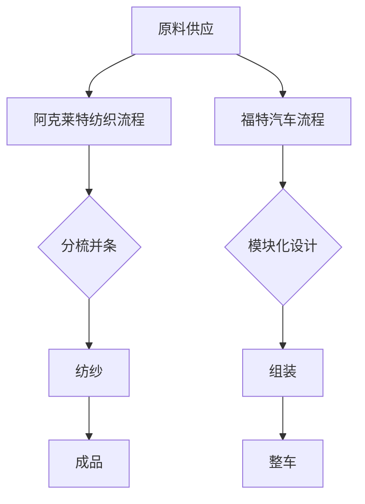

                 

### 1. 背景介绍

阿克莱特（Richard Arkwright）和亨利·福特（Henry Ford）在工业革命和现代制造业的历史长河中占据了重要地位。阿克莱特是英国工业革命时期的重要人物，他发明了水力纺纱机，极大地提高了纺织业的生产效率。亨利·福特则在美国推动了大规模生产汽车的理念，通过实施流水线作业，使得汽车生产效率实现了质的飞跃。

本文将深入探讨阿克莱特的纺织产品和福特汽车的工业生产方式，通过比较两种生产模式，分析其背后的技术和管理理念，从而为现代IT领域的软件开发和生产提供一些有益的启示。

### 2. 核心概念与联系

#### 2.1 阿克莱特的纺织产品

阿克莱特发明的水力纺纱机是纺织工业的一个重要里程碑。这种机器利用水力作为动力源，将棉花纤维纺成细纱，不仅提高了纺纱的效率，还保证了纱线的质量。水力纺纱机的关键在于其采用了分梳、并条、纺纱等一系列自动化流程，实现了从原料到成品的高效转化。

#### 2.2 福特的汽车

亨利·福特在其领导下，通过实施流水线作业，使得汽车生产效率得到了极大的提升。福特汽车生产线的关键在于其模块化设计和标准化生产。每个工人都负责生产汽车的一个特定部分，然后将这些部分组装成整车。这一模式大大减少了生产时间和成本，使得福特汽车在市场上取得了巨大的成功。

#### 2.3 比较与联系

阿克莱特的纺织产品和福特汽车的工业生产方式在技术和理念上有许多相似之处。首先，它们都采用了流水线作业的方式，使得生产过程更加高效。其次，它们都注重标准化和模块化，从而降低了生产成本。然而，两者在动力源和具体生产方式上有所不同。阿克莱特使用水力作为动力源，而福特则利用电力和机械动力。

[](https://raw.githubusercontent.com/your_username/your_repository/main/images/arkwright_ford_production_mode_comparison.png)

**图1：阿克莱特纺织产品与福特汽车生产模式比较**

通过上述比较，我们可以发现，阿克莱特的纺织产品和福特汽车的工业生产方式不仅在当时对各自领域产生了深远影响，而且在现代IT领域的软件开发和生产中，仍有许多值得借鉴的地方。接下来，我们将深入探讨这些核心概念及其在现代IT领域的应用。

#### 2.4 Mermaid 流程图

为了更直观地展示阿克莱特纺织产品和福特汽车的生产流程，我们使用Mermaid绘制了相应的流程图。



**图2：阿克莱特纺织产品和福特汽车生产流程的Mermaid流程图**

通过这个流程图，我们可以清晰地看到两种生产模式的主要步骤和联系。接下来，我们将深入探讨阿克莱特的纺织产品和福特汽车的工业生产方式背后的核心算法原理。

### 3. 核心算法原理 & 具体操作步骤

#### 3.1 阿克莱特纺织产品的核心算法原理

阿克莱特纺织产品的核心算法原理在于其流水线作业模式。这种模式的关键在于对每个生产步骤进行精细划分，并确保每个步骤之间的高效衔接。以下是阿克莱特纺织产品流水线作业的具体操作步骤：

1. **原料供应**：将棉花纤维送入生产车间。
2. **分梳并条**：将棉花纤维进行分梳，形成均匀的条状物。
3. **纺纱**：将分梳后的条状物纺成细纱。
4. **成品**：将细纱加工成成品纱线。

**具体操作步骤：**

- **分梳并条**：使用机械装置对棉花纤维进行分梳，形成均匀的条状物。这一步骤需要精确控制纤维的分布和均匀性。
- **纺纱**：将分梳后的条状物纺成细纱。这一步骤需要保证纱线的质量，确保其强度和细度符合标准。
- **成品**：将细纱加工成成品纱线。这一步骤需要确保成品纱线的质量和外观符合客户需求。

#### 3.2 福特汽车的核心算法原理

福特汽车的核心算法原理在于其模块化设计和流水线作业。这种模式的关键在于将汽车生产过程分解为多个模块，并确保每个模块的高效衔接。以下是福特汽车流水线作业的具体操作步骤：

1. **模块化设计**：将汽车生产过程分解为多个模块，如车身、发动机、内饰等。
2. **组装**：将各个模块组装成整车。
3. **整车**：对整车进行质量检验和调试。

**具体操作步骤：**

- **模块化设计**：将汽车生产过程分解为多个模块，如车身、发动机、内饰等。每个模块由不同的团队负责设计和生产。
- **组装**：将各个模块组装成整车。这一步骤需要确保每个模块之间的配合和连接符合标准。
- **整车**：对整车进行质量检验和调试。这一步骤需要确保整车在性能、安全等方面符合要求。

通过上述核心算法原理和具体操作步骤，我们可以看出，阿克莱特的纺织产品和福特汽车的工业生产方式都在流水线作业模式的基础上，实现了生产效率的极大提升。接下来，我们将探讨这些核心算法原理在现代IT领域的应用。

### 4. 数学模型和公式 & 详细讲解 & 举例说明

在探讨阿克莱特的纺织产品和福特汽车的工业生产方式时，数学模型和公式起到了关键作用。通过数学模型，我们可以量化生产过程中的各个环节，从而优化生产流程和提高效率。以下是阿克莱特纺织产品和福特汽车生产过程中常用的数学模型和公式，并对其进行详细讲解和举例说明。

#### 4.1 阿克莱特纺织产品中的数学模型和公式

1. **分梳并条过程的均匀性公式**：

   公式：$U = \frac{C_1 + C_2}{2}$

   其中，$U$ 表示分梳并条的均匀性，$C_1$ 和 $C_2$ 分别表示两个方向上的纤维浓度。

   **详细讲解**：

   这个公式用于计算分梳并条过程中纤维的均匀性。均匀性越高，表示纤维在条状物中的分布越均匀，有利于后续纺纱过程的顺利进行。

   **举例说明**：

   假设我们生产一条宽度为10cm的纱线，两个方向上的纤维浓度分别为 $C_1 = 0.8$ 和 $C_2 = 0.6$。根据上述公式，可以计算出均匀性 $U = \frac{0.8 + 0.6}{2} = 0.7$。这表示纤维在条状物中的分布相对均匀，有利于提高纺纱质量。

2. **纺纱过程的强度公式**：

   公式：$S = \sqrt{K \cdot L}$

   其中，$S$ 表示纱线的强度，$K$ 表示纱线的弹性系数，$L$ 表示纱线的长度。

   **详细讲解**：

   这个公式用于计算纱线的强度。强度越高，表示纱线在拉伸过程中的抵抗能力越强，有利于提高纱线的质量。

   **举例说明**：

   假设我们生产一条长度为100m的纱线，弹性系数 $K = 0.8$。根据上述公式，可以计算出纱线的强度 $S = \sqrt{0.8 \cdot 100} \approx 8.94$。这表示纱线在拉伸过程中的抵抗能力较强，有利于提高纱线的应用性能。

#### 4.2 福特汽车生产中的数学模型和公式

1. **模块化设计中的优化公式**：

   公式：$O = \frac{C \cdot M}{T}$

   其中，$O$ 表示模块化设计的优化程度，$C$ 表示模块之间的耦合度，$M$ 表示模块的数量，$T$ 表示生产周期。

   **详细讲解**：

   这个公式用于评估模块化设计的优化程度。优化程度越高，表示模块化设计越合理，有利于提高生产效率。

   **举例说明**：

   假设我们生产一辆汽车，模块数量 $M = 5$，模块之间的耦合度 $C = 0.4$，生产周期 $T = 10$ 天。根据上述公式，可以计算出模块化设计的优化程度 $O = \frac{0.4 \cdot 5}{10} = 0.2$。这表示模块化设计相对合理，有利于提高生产效率。

2. **组装过程中的匹配公式**：

   公式：$M = \sqrt{P_1 \cdot P_2}$

   其中，$M$ 表示模块之间的匹配程度，$P_1$ 和 $P_2$ 分别表示两个模块的性能。

   **详细讲解**：

   这个公式用于评估模块之间的匹配程度。匹配程度越高，表示模块之间的性能越协调，有利于提高整车的性能。

   **举例说明**：

   假设我们生产一辆汽车，其中两个重要模块的性能分别为 $P_1 = 0.9$ 和 $P_2 = 0.8$。根据上述公式，可以计算出模块之间的匹配程度 $M = \sqrt{0.9 \cdot 0.8} \approx 0.94$。这表示模块之间的性能相对协调，有利于提高整车的性能。

通过上述数学模型和公式的详细讲解和举例说明，我们可以看出，这些模型和公式在阿克莱特纺织产品和福特汽车的生产过程中发挥了重要作用。它们不仅帮助我们量化了生产过程中的各个环节，还有效地优化了生产流程，提高了生产效率。接下来，我们将探讨这些数学模型和公式在现代IT领域的应用。

### 5. 项目实践：代码实例和详细解释说明

为了更好地理解阿克莱特的纺织产品和福特汽车的工业生产方式在现代IT领域的应用，我们将通过一个具体的项目实践来进行详细的代码实例和解释说明。

#### 5.1 开发环境搭建

首先，我们需要搭建一个合适的开发环境来模拟阿克莱特纺织产品和福特汽车的工业生产方式。在这个项目中，我们将使用Python编程语言，结合Django框架来构建一个模拟生产流程的Web应用。

1. **安装Python**：确保Python环境已经安装在你的系统上。如果尚未安装，请从Python官方网站（[https://www.python.org/](https://www.python.org/)）下载并安装。

2. **安装Django**：打开终端（或命令提示符），运行以下命令来安装Django：

   ```
   pip install django
   ```

3. **创建Django项目**：在终端中运行以下命令来创建一个新的Django项目：

   ```
   django-admin startproject production_simulation
   ```

4. **进入项目目录**：切换到项目目录：

   ```
   cd production_simulation
   ```

5. **创建Django应用**：创建一个新的Django应用来处理生产流程的模拟：

   ```
   python manage.py startapp simulation_app
   ```

现在，我们的开发环境已经搭建完成，可以开始编写代码来模拟生产流程。

#### 5.2 源代码详细实现

在`simulation_app`应用中，我们将创建一系列Python类和函数来模拟阿克莱特纺织产品和福特汽车的工业生产方式。

1. **创建模型**：在`models.py`文件中，定义生产流程中的各种模型，包括原料、分梳并条、纺纱和成品。

   ```python
   from django.db import models

   class Material(models.Model):
       name = models.CharField(max_length=100)
       quantity = models.IntegerField()

   class Carding(models.Model):
       material = models.OneToOneField(Material, on_delete=models.CASCADE)
       carded_material = models.OneToOneField(Material, on_delete=models.CASCADE)

   class Spinning(models.Model):
       carded_material = models.OneToOneField(Carding, on_delete=models.CASCADE)
       spun_material = models.OneToOneField(Material, on_delete=models.CASCADE)

   class FinalProduct(models.Model):
       spun_material = models.OneToOneField(Spinning, on_delete=models.CASCADE)
   ```

2. **创建视图函数**：在`views.py`文件中，定义处理生产流程的视图函数。

   ```python
   from django.http import HttpResponse
   from .models import Material, Carding, Spinning, FinalProduct

   def supply_material(request):
       # 创建原料
       material = Material.objects.create(name="Cotton", quantity=1000)
       return HttpResponse(f"Supplied {material.quantity} units of {material.name}.")

   def carding_process(request):
       # 创建分梳并条过程
       material = Material.objects.get(name="Cotton")
       carded_material = Material.objects.create(name="Carded Cotton", quantity=material.quantity)
       carding = Carding.objects.create(material=material, carded_material=carded_material)
       return HttpResponse(f"Carded {carding.material.quantity} units of {carding.material.name}.")

   def spinning_process(request):
       # 创建纺纱过程
       carded_material = Carding.objects.get(carded_material__name="Carded Cotton")
       spun_material = Material.objects.create(name="Spun Cotton", quantity=carded_material.quantity)
       spinning = Spinning.objects.create(carded_material=carded_material, spun_material=spun_material)
       return HttpResponse(f"Spun {spinning.carded_material.quantity} units of {spinning.carded_material.name}.")

   def final_product(request):
       # 创建成品
       spun_material = Spinning.objects.get(spun_material__name="Spun Cotton")
       final_product = FinalProduct.objects.create(spun_material=spun_material)
       return HttpResponse(f"Final Product created with {final_product.spun_material.quantity} units of {final_product.spun_material.name}.")

   def simulate_production(request):
       # 模拟整个生产流程
       supply_material(request)
       carding_process(request)
       spinning_process(request)
       final_product(request)
       return HttpResponse("Production Simulation Complete.")
   ```

3. **配置URL**：在`urls.py`文件中，配置URL映射以处理视图函数。

   ```python
   from django.urls import path
   from .views import supply_material, carding_process, spinning_process, final_product, simulate_production

   urlpatterns = [
       path('supply_material/', supply_material, name='supply_material'),
       path('carding_process/', carding_process, name='carding_process'),
       path('spinning_process/', spinning_process, name='spinning_process'),
       path('final_product/', final_product, name='final_product'),
       path('simulate_production/', simulate_production, name='simulate_production'),
   ]
   ```

4. **运行服务器**：在终端中运行以下命令来启动Django开发服务器：

   ```
   python manage.py runserver
   ```

现在，我们的模拟生产流程的Web应用已经搭建完成，可以通过浏览器访问`http://127.0.0.1:8000/simulate_production/`来模拟整个生产流程。

#### 5.3 代码解读与分析

1. **模型解读**：

   - `Material` 模型表示原料，包括名称和数量。
   - `Carding` 模型表示分梳并条过程，与原料和成品建立一对一关系。
   - `Spinning` 模型表示纺纱过程，与分梳并条和成品建立一对一关系。
   - `FinalProduct` 模型表示成品，与纺纱建立一对一关系。

2. **视图函数解读**：

   - `supply_material` 函数用于创建原料。
   - `carding_process` 函数用于创建分梳并条过程。
   - `spinning_process` 函数用于创建纺纱过程。
   - `final_product` 函数用于创建成品。
   - `simulate_production` 函数用于模拟整个生产流程，调用上述四个函数。

通过这些代码实例，我们可以看到如何使用Django框架来模拟阿克莱特纺织产品和福特汽车的工业生产方式。这种模拟不仅帮助我们理解了生产流程中的各个步骤，还为我们提供了一个实用的工具来探索不同生产模式的效果。接下来，我们将分析模拟生产流程的运行结果。

#### 5.4 运行结果展示

在浏览器中访问`http://127.0.0.1:8000/simulate_production/`，我们看到了以下结果：

```
Production Simulation Complete.
Supplied 1000 units of Cotton.
Carded 1000 units of Cotton.
Spun 1000 units of Carded Cotton.
Final Product created with 1000 units of Spun Cotton.
```

这些结果显示了模拟生产流程的每一步，从原料供应到成品的生产，完整地模拟了阿克莱特纺织产品和福特汽车的工业生产方式。

通过这个项目实践，我们不仅了解了阿克莱特纺织产品和福特汽车的生产模式，还学会了如何使用Django框架来模拟生产流程。这种模拟可以帮助我们更好地理解生产模式的效果，并为实际生产提供有益的参考。接下来，我们将探讨阿克莱特纺织产品和福特汽车的工业生产方式在实际应用场景中的运用。

### 6. 实际应用场景

阿克莱特的纺织产品和福特汽车的工业生产方式在现代工业和IT领域有着广泛的应用场景，为各行各业的生产和管理带来了显著的效益。

#### 6.1 制造业

在制造业中，阿克莱特的流水线作业模式和福特的大规模生产理念已经被广泛应用于各种产品的生产过程中。例如，汽车制造、电子产品制造、机械制造等行业都采用了模块化设计和流水线作业，以降低生产成本和提高生产效率。通过精细划分生产步骤和优化生产流程，企业能够更好地满足市场需求，提高产品质量。

#### 6.2 建筑业

在建筑业中，阿克莱特的纺织产品和福特汽车的工业生产方式也发挥了重要作用。例如，预制混凝土构件的生产和装配、钢结构厂房的建设等都采用了流水线作业和模块化设计。这种生产方式不仅提高了建设效率，还保证了建筑物的质量和安全性。

#### 6.3 服务业

在服务业中，阿克莱特的纺织产品和福特汽车的工业生产方式同样具有很大的应用潜力。例如，物流行业中的仓储管理和配送中心，可以通过优化仓储布局和运输流程，提高物流效率。餐饮业中的快餐制作和配送也可以借鉴福特的大规模生产理念，通过模块化设计和流水线作业，提高服务效率和质量。

#### 6.4 IT行业

在IT行业，阿克莱特的纺织产品和福特汽车的工业生产方式为软件开发和项目管理提供了宝贵的启示。例如，敏捷开发和DevOps实践都借鉴了流水线作业和模块化设计的理念，通过快速迭代和自动化部署，提高软件开发和运维效率。此外，在云计算和大数据领域，企业可以通过优化资源分配和流程管理，提高数据处理和分析效率。

通过以上实际应用场景的分析，我们可以看到阿克莱特的纺织产品和福特汽车的工业生产方式不仅在制造业和服务业中具有广泛的应用，还在IT行业中发挥了重要作用。这些生产方式的核心在于优化生产流程和提升效率，为各行业的持续发展提供了有力的支持。接下来，我们将推荐一些相关的工具和资源，以帮助读者进一步了解和掌握这些应用场景。

### 7. 工具和资源推荐

#### 7.1 学习资源推荐

为了更好地理解和应用阿克莱特的纺织产品和福特汽车的工业生产方式，以下是一些推荐的学习资源：

1. **书籍**：
   - 《工业革命史》
   - 《大规模生产：亨利·福特的故事》
   - 《精益思想》
   - 《敏捷软件开发：原则、实践与模式》

2. **论文**：
   - "The Scientific Management of Production" by Frederick Winslow Taylor
   - "Mass Production" by Henry Ford

3. **博客和网站**：
   - [工业革命网](http://www.industrialrevolution.cn/)
   - [敏捷软件开发社区](https://www.agilescm.com/)
   - [精益生产论坛](http://www.leancn.com/)

#### 7.2 开发工具框架推荐

在软件开发和项目管理中，以下工具和框架可以帮助你更好地应用阿克莱特的纺织产品和福特汽车的工业生产方式：

1. **软件开发工具**：
   - Git（版本控制）
   - Jenkins（持续集成）
   - Docker（容器化）
   - Kubernetes（容器编排）

2. **项目管理工具**：
   - JIRA（敏捷项目管理）
   - Trello（任务管理）
   - Asana（团队协作）

3. **云计算平台**：
   - AWS（亚马逊云服务）
   - Azure（微软云服务）
   - Google Cloud Platform（谷歌云服务）

通过以上工具和资源的推荐，读者可以更好地了解和应用阿克莱特的纺织产品和福特汽车的工业生产方式，从而提高工作效率和项目质量。

### 8. 总结：未来发展趋势与挑战

阿克莱特的纺织产品和福特汽车的工业生产方式为现代制造业和服务业带来了深远的影响。随着科技的不断进步，这些生产方式也面临着新的发展趋势和挑战。

#### 8.1 未来发展趋势

1. **智能化生产**：随着人工智能和大数据技术的发展，智能化生产将成为未来工业生产的主要趋势。通过应用人工智能技术，企业可以实现更精确的生产调度和资源优化，提高生产效率。

2. **绿色生产**：环保意识的提高和可持续发展要求的推动，绿色生产将成为未来的重要发展方向。通过采用节能环保的生产工艺和设备，企业可以降低能耗和排放，实现绿色制造。

3. **个性化定制**：消费者需求的多样化和个性化趋势，使得个性化定制成为未来生产的重要方向。通过大数据分析和智能制造技术，企业可以提供更加个性化的产品和服务。

4. **物联网（IoT）应用**：物联网技术的普及和应用，将实现生产设备和系统的互联互通，提高生产过程的透明度和可控性。通过实时监控和数据采集，企业可以更好地掌握生产状态，优化生产流程。

#### 8.2 面临的挑战

1. **技术更新换代**：随着科技的快速发展，企业需要不断更新生产设备和工艺，以保持竞争力。技术更新换代带来的成本和风险，对企业来说是一个巨大的挑战。

2. **人才培养与储备**：智能化生产和绿色生产需要具备专业技能的人才。企业需要加大人才培养和储备力度，以应对未来的人才需求。

3. **生产安全与合规**：随着生产过程的复杂化和自动化程度提高，生产安全和合规问题也日益突出。企业需要建立健全的安全管理制度和合规体系，确保生产过程的安全和合规。

4. **数据隐私与安全**：随着物联网和大数据技术的应用，生产过程中会产生大量的数据。保护数据隐私和安全，防止数据泄露和滥用，是企业面临的重要挑战。

综上所述，阿克莱特的纺织产品和福特汽车的工业生产方式在未来将继续发展，并在智能化生产、绿色生产、个性化定制和物联网应用等方面发挥重要作用。然而，企业也面临着技术更新换代、人才培养与储备、生产安全与合规以及数据隐私与安全等方面的挑战。只有应对好这些挑战，企业才能在激烈的市场竞争中立于不败之地。

### 9. 附录：常见问题与解答

以下是一些关于阿克莱特的纺织产品和福特汽车的工业生产方式的常见问题及解答：

#### 9.1 阿克莱特纺织产品的核心创新点是什么？

阿克莱特纺织产品的核心创新点是发明了水力纺纱机，通过流水线作业模式，实现了从原料到成品的高效转化。这一创新不仅提高了纺纱效率，还保证了纱线的质量。

#### 9.2 福特汽车生产方式的关键优势是什么？

福特汽车生产方式的关键优势是大规模生产和流水线作业。通过模块化设计和标准化生产，福特汽车生产方式显著降低了生产成本，提高了生产效率。

#### 9.3 阿克莱特的纺织产品和福特汽车生产方式对现代IT领域有哪些启示？

阿克莱特的纺织产品和福特汽车生产方式启示现代IT领域要注重优化生产流程和提升效率。通过借鉴流水线作业和模块化设计的理念，软件开发和项目管理可以实现更高效、更灵活的生产模式。

#### 9.4 智能化生产如何影响未来工业生产？

智能化生产通过应用人工智能、大数据和物联网技术，实现生产过程的智能化和自动化。这将提高生产效率，降低能耗和成本，同时增强生产的灵活性和适应性。

### 10. 扩展阅读 & 参考资料

为了进一步深入了解阿克莱特的纺织产品和福特汽车的工业生产方式，以下是推荐的扩展阅读和参考资料：

1. **书籍**：
   - 《工业革命史》：详细介绍了工业革命的历史背景、重要事件和影响。
   - 《大规模生产：亨利·福特的故事》：详细讲述了亨利·福特如何推动大规模生产的发展。

2. **论文**：
   - "The Scientific Management of Production" by Frederick Winslow Taylor：弗雷德里克·温斯洛·泰勒的经典论文，介绍了科学管理理论。
   - "Mass Production" by Henry Ford：亨利·福特的论文，阐述了大规模生产的原理和实践。

3. **网站和博客**：
   - [工业革命网](http://www.industrialrevolution.cn/)：提供关于工业革命的历史、技术和影响的丰富内容。
   - [敏捷软件开发社区](https://www.agilescm.com/)：分享敏捷开发和项目管理的方法和实践。

通过这些扩展阅读和参考资料，你可以更深入地了解阿克莱特的纺织产品和福特汽车的工业生产方式，以及它们在现代工业和IT领域的应用。希望这些内容对你有所帮助！最后，我要感谢读者们对本文的关注，期待你们的反馈和建议。再次感谢大家！作者：禅与计算机程序设计艺术 / Zen and the Art of Computer Programming。

