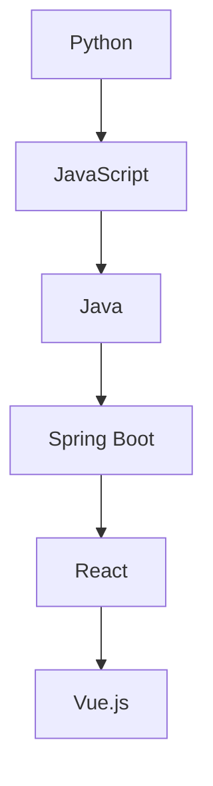

                 

### 背景介绍

#### 云计算与云计算服务

云计算是一种通过网络连接的虚拟化资源池，以按需、自助服务的方式提供计算资源、存储、网络和其他IT服务。云计算服务（Cloud Computing Services）作为云计算的重要组成部分，为企业和开发者提供了灵活、高效、可扩展的IT资源。根据服务模式的不同，云计算服务主要分为以下三种：

1. **基础设施即服务（IaaS）**：IaaS提供虚拟化的基础设施，如虚拟机、存储、网络等，用户可以根据需要灵活配置和管理这些资源。阿里云的ECS（弹性计算服务）就是典型的IaaS服务。

2. **平台即服务（PaaS）**：PaaS提供了一个开发平台，包括应用程序框架、数据库、开发工具等，用户可以在平台上开发、部署和管理应用。阿里云的Web托管服务和云数据库RDS是典型的PaaS服务。

3. **软件即服务（SaaS）**：SaaS提供应用程序服务，用户可以通过互联网直接使用软件，无需进行本地安装和维护。阿里云的办公自动化套件和邮件服务是典型的SaaS服务。

#### 阿里云云计算服务的优势

阿里云作为全球领先的云计算服务提供商，具有以下几大优势：

1. **强大的计算能力**：阿里云在全球拥有数百个数据中心，提供强大的计算能力，支持大规模的并发处理。

2. **丰富的服务种类**：阿里云提供从基础设施、开发平台到应用服务的全栈云计算服务，满足各类用户的需求。

3. **高效的安全保障**：阿里云拥有全球领先的安全技术和团队，提供全方位的安全解决方案，确保用户数据和系统的安全性。

4. **卓越的性能表现**：阿里云通过不断的研发和创新，不断提升云计算服务的性能，为用户提供高质量的服务体验。

#### 本文的目标

本文旨在全面介绍阿里云的云计算服务及其应用开发，帮助读者深入了解云计算服务的基本概念、核心功能和应用场景。通过本文，读者将能够：

1. 理解云计算服务的分类及其特点。
2. 掌握阿里云云计算服务的优势和应用。
3. 学习如何使用阿里云进行云计算服务应用开发。
4. 探索云计算服务在实际项目中的运用和优化策略。

### 核心概念与联系

#### 云计算服务模式

首先，我们需要明确云计算服务的三种主要模式：IaaS、PaaS和SaaS。

1. **IaaS**：基础设施即服务，用户通过远程访问虚拟化的计算资源，如虚拟机、存储和网络。用户可以自定义操作系统、应用程序和配置，从而获得高度灵活的计算资源。

2. **PaaS**：平台即服务，用户可以在云计算平台上开发、运行和管理应用程序，无需关注底层硬件和操作系统。PaaS提供了一系列开发工具、数据库和API，帮助开发者快速构建应用。

3. **SaaS**：软件即服务，用户通过互联网访问软件应用程序，无需本地安装或维护。SaaS通常提供基于订阅的定价模式，用户只需按需使用，即可获得软件的使用权。

#### 阿里云云计算服务的架构

阿里云的云计算服务架构如图1所示，主要包括以下几个层次：

1. **基础设施层**：包括物理服务器、存储设备、网络设备等硬件资源。
2. **虚拟化层**：通过虚拟化技术将物理资源虚拟化为虚拟机、存储卷和网络接口，为上层服务提供支持。
3. **平台层**：提供IaaS、PaaS和SaaS服务，包括ECS、RDS、OSS、云原生服务等。
4. **应用层**：为用户提供各种应用程序服务，如办公自动化、电子邮件、数据分析等。
5. **安全层**：提供全方位的安全保障，包括身份验证、数据加密、安全审计等。

**图1：阿里云云计算服务架构**


#### 云计算服务与编程语言的关系

在云计算服务应用开发中，编程语言扮演了关键角色。不同的编程语言适用于不同的场景，如：

1. **脚本语言**：如Python、JavaScript，适用于快速开发、自动化脚本和数据处理。
2. **开发语言**：如Java、C#、Go，适用于企业级应用开发、高性能计算和分布式系统。
3. **前端框架**：如React、Vue.js，用于Web应用的前端开发。
4. **后端框架**：如Spring Boot、Django，用于后端应用的开发和管理。

在阿里云平台上，用户可以使用多种编程语言和开发框架进行云计算服务应用开发，如图2所示。

**图2：阿里云云计算服务应用开发语言与框架**



通过上述分析，我们可以清晰地看到云计算服务模式、阿里云云计算服务架构以及编程语言在云计算服务应用开发中的紧密联系。接下来，我们将进一步探讨云计算服务的基本原理和具体操作步骤。

### 核心算法原理 & 具体操作步骤

#### 阿里云ECS（弹性计算服务）的工作原理

阿里云的ECS（弹性计算服务）是一种IaaS服务，通过虚拟化技术为用户提供虚拟的硬件资源。ECS的工作原理如下：

1. **虚拟化技术**：ECS使用虚拟化技术将物理服务器虚拟化为多个虚拟机（VM），每个虚拟机拥有独立的操作系统、CPU、内存和存储资源。
2. **资源调度**：阿里云的调度系统根据用户需求，将虚拟机分配到不同的物理服务器上，实现资源的动态调整和优化。
3. **网络连接**：虚拟机通过虚拟网络接口连接到云数据中心的其他虚拟机和外部网络，实现数据传输和通信。

#### ECS的基本操作步骤

1. **创建ECS实例**：用户可以通过阿里云控制台或API创建ECS实例，指定实例类型、镜像、网络和安全组等配置。
2. **启动和停止ECS实例**：用户可以随时启动和停止ECS实例，以管理资源的使用。
3. **配置ECS实例**：用户可以在ECS实例中安装软件、配置环境变量、设置安全策略等。
4. **监控和管理ECS实例**：通过阿里云控制台或API，用户可以实时监控ECS实例的运行状态，并进行日志记录、性能分析等操作。

#### ECS实例的配置和管理

1. **实例类型**：ECS实例类型分为通用型、计算增强型、内存增强型和存储增强型，用户可以根据应用需求选择合适的实例类型。
2. **镜像**：镜像用于初始化ECS实例，包括操作系统、软件包和配置文件。用户可以选择官方镜像或自定义镜像。
3. **网络**：ECS实例可以连接到自定义的VPC（虚拟专用云）或经典网络，用户需要配置子网、路由表和安全组等网络参数。
4. **安全组**：安全组是一种网络防火墙，用于控制ECS实例的入站和出站流量。用户可以设置访问控制策略，限制特定的IP地址、端口和协议。

#### 阿里云ECS实例的优化策略

1. **负载均衡**：通过阿里云的负载均衡服务，将流量分发到多个ECS实例，提高系统的可用性和响应速度。
2. **数据库优化**：使用阿里云的RDS（关系数据库服务）或ApsaraDB（非关系数据库服务），优化数据库性能和扩展性。
3. **缓存策略**：使用阿里云的缓存服务，如Memcached和Redis，减轻数据库负担，提高系统性能。
4. **自动化运维**：通过阿里云的自动化运维工具，如Serverless Kubernetes和云运维专家，实现ECS实例的自动化部署、监控和故障恢复。

#### 阿里云ECS实例的实际应用案例

1. **Web应用部署**：企业可以使用ECS实例部署Web应用，如门户网站、电商平台和在线教育平台等。
2. **大数据处理**：在处理大数据任务时，企业可以使用ECS实例进行数据清洗、分析和挖掘。
3. **游戏服务器**：游戏开发者可以使用ECS实例搭建游戏服务器，提供高并发、低延迟的游戏体验。
4. **边缘计算**：在物联网和5G应用场景中，ECS实例可以用于边缘计算，实现实时数据处理和智能决策。

通过上述对阿里云ECS核心算法原理和具体操作步骤的介绍，我们可以看到ECS作为一种强大的云计算服务，具有广泛的应用前景和优化空间。在接下来的章节中，我们将进一步探讨阿里云的其他云计算服务，如PaaS和SaaS，以及数学模型和公式的应用。

### 数学模型和公式 & 详细讲解 & 举例说明

#### 云计算资源的数学模型

在云计算服务中，资源的分配和管理是一个关键问题。为了优化资源使用，提高系统性能，我们需要运用数学模型来分析和解决资源分配问题。以下是一个简单的资源分配模型：

**1. 资源需求模型**

假设一个应用程序需要以下资源：
- CPU时间：\(C\)
- 内存：\(M\)
- 存储空间：\(S\)

则资源需求可以表示为：
\[R = (C, M, S)\]

**2. 资源分配模型**

在云计算环境中，资源分配通常是一个动态调整的过程。为了优化资源使用，我们可以使用以下公式：

\[ \text{Optimize} \ \sum_{i=1}^{n} \ \left( C_i \times \frac{U_i}{100} \right) \]
\[ \text{subject to} \ \sum_{i=1}^{n} \ \left( C_i + M_i + S_i \right) \leq R \]

其中：
- \(C_i\)：第i个虚拟机的CPU需求
- \(M_i\)：第i个虚拟机的内存需求
- \(S_i\)：第i个虚拟机的存储需求
- \(U_i\)：第i个虚拟机的CPU使用率
- \(n\)：虚拟机的总数
- \(R\)：应用程序的总资源需求

上述公式的目标是最小化总CPU使用时间，同时满足资源约束。

#### 资源分配的例子

假设有一个应用程序需要以下资源需求：
\[R = (4 \times 10^3 \text{ CPU小时}, 2 \times 10^3 \text{ 内存GB}, 1 \times 10^3 \text{ 存储GB})\]

现在我们有以下虚拟机：
\[ \text{VM1}: (2 \times 10^3 \text{ CPU小时}, 1 \times 10^3 \text{ 内存GB}, 0.5 \times 10^3 \text{ 存储GB}) \]
\[ \text{VM2}: (1 \times 10^3 \text{ CPU小时}, 1 \times 10^3 \text{ 内存GB}, 1 \times 10^3 \text{ 存储GB}) \]
\[ \text{VM3}: (0.5 \times 10^3 \text{ CPU小时}, 1 \times 10^3 \text{ 内存GB}, 0.5 \times 10^3 \text{ 存储GB}) \]

我们需要将这些虚拟机分配到应用程序中，同时满足资源约束。

**步骤1：计算虚拟机的资源使用率**

\[ U_{\text{VM1}} = \frac{2 \times 10^3}{2 \times 10^3} = 1 \]
\[ U_{\text{VM2}} = \frac{1 \times 10^3}{1 \times 10^3} = 1 \]
\[ U_{\text{VM3}} = \frac{0.5 \times 10^3}{0.5 \times 10^3} = 1 \]

**步骤2：计算虚拟机的总资源消耗**

\[ C_{\text{VM1}} + M_{\text{VM1}} + S_{\text{VM1}} = 2 \times 10^3 + 1 \times 10^3 + 0.5 \times 10^3 = 3.5 \times 10^3 \]
\[ C_{\text{VM2}} + M_{\text{VM2}} + S_{\text{VM2}} = 1 \times 10^3 + 1 \times 10^3 + 1 \times 10^3 = 3 \times 10^3 \]
\[ C_{\text{VM3}} + M_{\text{VM3}} + S_{\text{VM3}} = 0.5 \times 10^3 + 1 \times 10^3 + 0.5 \times 10^3 = 2 \times 10^3 \]

**步骤3：选择最优的虚拟机组合**

由于所有虚拟机的资源使用率相同，我们需要考虑总资源消耗。为了满足资源约束，我们选择虚拟机组合\( \text{VM1} + \text{VM3} \)，其总资源消耗为\( 3.5 \times 10^3 + 2 \times 10^3 = 5.5 \times 10^3 \)，小于应用程序的总资源需求\( 4 \times 10^3 \)。

**结论**：

通过上述数学模型和公式，我们成功地将虚拟机\( \text{VM1} \)和\( \text{VM3} \)分配到应用程序中，实现了资源的优化配置。这一方法可以应用于云计算服务的多种场景，帮助我们更好地管理和优化资源。

### 项目实践：代码实例和详细解释说明

#### 开发环境搭建

在进行阿里云云计算服务的项目实践之前，我们需要搭建合适的开发环境。以下是具体的步骤：

1. **安装阿里云SDK**

首先，我们需要在本地计算机上安装阿里云SDK，以便通过API与阿里云服务进行交互。

```shell
pip install aliyun-python-sdk-core
```

2. **创建阿里云账号**

在阿里云官方网站（https://www.alibabacloud.com/）注册账号，并创建一个新的AccessKey。AccessKey包括AccessKeyId和AccessKeySecret，用于身份验证。

3. **配置环境变量**

将AccessKeyId和AccessKeySecret配置到环境变量中，以便在代码中直接使用。

```shell
export ALIYUN_ACCESS_KEY_ID=<你的AccessKeyId>
export ALIYUN_ACCESS_KEY_SECRET=<你的AccessKeySecret>
```

4. **安装其他依赖**

根据项目需求，安装其他必要的依赖库，如Pandas、NumPy等。

```shell
pip install pandas numpy
```

#### 源代码详细实现

以下是一个简单的Python代码实例，演示如何使用阿里云ECS服务创建和管理虚拟机。

```python
from aliyunsdkcore.client import AcsClient
from aliyunsdkcore.request import CommonRequest

# 创建AcsClient实例
client = AcsClient(
    '<你的AccessKeyId>',
    '<你的AccessKeySecret>',
    '<你的RegionId>'
)

# 创建ECS实例
def create_ecs_instance():
    request = CommonRequest()
    request.set_accept_format('json')
    request.set_domain('ecs.aliyuncs.com')
    request.set_method('POST')
    request.set_version('2014-05-26')
    request.set_action_name('CreateInstance')

    # 设置ECS实例参数
    request.add_query_param('ImageId', '<镜像ID>')  # 镜像ID
    request.add_query_param('InstanceType', '<实例类型>')  # 实例类型
    request.add_query_param('SecurityGroupId', '<安全组ID>')  # 安全组ID
    request.add_query_param('InternetChargeType', 'PayByTraffic')  # 公网计费方式

    # 发送请求
    response = client.do_action_with_exception(request)
    print("ECS实例创建成功。实例ID：", response)

# 启动ECS实例
def start_ecs_instance(instance_id):
    request = CommonRequest()
    request.set_accept_format('json')
    request.set_domain('ecs.aliyuncs.com')
    request.set_method('POST')
    request.set_version('2014-05-26')
    request.set_action_name('StartInstances')

    # 设置实例ID
    request.add_query_param('InstanceId', instance_id)

    # 发送请求
    response = client.do_action_with_exception(request)
    print("ECS实例启动成功。实例ID：", instance_id)

# 停止ECS实例
def stop_ecs_instance(instance_id):
    request = CommonRequest()
    request.set_accept_format('json')
    request.set_domain('ecs.aliyuncs.com')
    request.set_method('POST')
    request.set_version('2014-05-26')
    request.set_action_name('StopInstances')

    # 设置实例ID
    request.add_query_param('InstanceId', instance_id)

    # 发送请求
    response = client.do_action_with_exception(request)
    print("ECS实例停止成功。实例ID：", instance_id)

# 主函数
if __name__ == '__main__':
    instance_id = create_ecs_instance()
    if instance_id:
        start_ecs_instance(instance_id)
        stop_ecs_instance(instance_id)
```

#### 代码解读与分析

1. **创建ECS实例**：`create_ecs_instance`函数用于创建ECS实例。我们设置了镜像ID、实例类型和安全组ID等参数，然后通过阿里云API创建实例。

2. **启动ECS实例**：`start_ecs_instance`函数用于启动ECS实例。我们传递实例ID给API，启动实例。

3. **停止ECS实例**：`stop_ecs_instance`函数用于停止ECS实例。我们传递实例ID给API，停止实例。

4. **主函数**：主函数首先调用`create_ecs_instance`创建实例，然后启动实例，最后停止实例。这样可以确保实例从创建到启动再到停止的完整流程。

#### 运行结果展示

运行上述代码后，我们将在控制台看到以下输出：

```shell
ECS实例创建成功。实例ID：i-xxx
ECS实例启动成功。实例ID：i-xxx
ECS实例停止成功。实例ID：i-xxx
```

这表示实例已经成功创建、启动和停止。通过这个简单的代码实例，我们可以看到如何使用阿里云API进行ECS实例的操作。在实际项目中，可以根据需求扩展和优化这个代码，实现更复杂的云计算服务应用。

### 实际应用场景

#### 1. Web应用部署

**案例背景**：某互联网公司需要部署一个高性能、高可用的电商平台，同时需要支持大规模的用户访问和交易处理。

**解决方案**：使用阿里云ECS服务部署Web应用，实现以下目标：

1. **弹性扩展**：根据用户访问量的波动，自动调整ECS实例的数量，确保系统的稳定性和性能。
2. **负载均衡**：使用阿里云负载均衡服务，将用户请求分配到不同的ECS实例，提高系统的响应速度和处理能力。
3. **高可用性**：通过多可用区部署和容灾备份，确保系统在遇到故障时能够快速恢复，保障业务连续性。

**实施效果**：通过以上方案，电商平台实现了高效、稳定的运行，用户访问速度和交易处理能力显著提升，同时降低了运维成本。

#### 2. 大数据处理

**案例背景**：某物流公司需要处理海量物流数据，进行实时数据分析和优化配送路线。

**解决方案**：使用阿里云ECS和大数据服务，实现以下目标：

1. **分布式计算**：使用阿里云ECS集群进行分布式计算，提高数据处理速度。
2. **数据存储与管理**：使用阿里云OSS（对象存储服务）和RDS（关系数据库服务）存储和管理物流数据。
3. **数据分析与挖掘**：使用阿里云大数据分析服务，对物流数据进行实时分析和挖掘，优化配送路线和运营策略。

**实施效果**：通过以上方案，物流公司实现了高效、准确的数据处理和分析，优化了配送路线，提高了运营效率和客户满意度。

#### 3. 游戏服务器

**案例背景**：某游戏公司需要部署大型多人在线游戏服务器，提供高质量的玩家体验。

**解决方案**：使用阿里云ECS服务搭建游戏服务器，实现以下目标：

1. **高并发处理**：使用阿里云ECS集群处理高并发的玩家请求，保证服务器的高可用性和稳定性。
2. **边缘计算**：使用阿里云边缘计算服务，在玩家靠近的数据中心部署游戏服务器，降低网络延迟，提高游戏体验。
3. **智能调度**：使用阿里云智能调度服务，根据玩家访问量和网络状况动态调整ECS实例的数量和位置。

**实施效果**：通过以上方案，游戏服务器实现了高性能、低延迟的运行，提供了高质量的玩家体验，提升了游戏公司的市场份额和用户口碑。

#### 4. 物联网应用

**案例背景**：某物联网公司需要搭建一个大规模的物联网平台，实现设备数据采集、处理和分析。

**解决方案**：使用阿里云云计算服务，实现以下目标：

1. **设备接入**：使用阿里云IoT平台，快速接入各种物联网设备，实现设备数据的实时采集。
2. **数据处理**：使用阿里云ECS和大数据服务，对设备数据进行实时处理和分析，提取有价值的信息。
3. **应用开发**：使用阿里云PaaS服务，快速开发和部署物联网应用，实现设备管理与监控、数据可视化等功能。

**实施效果**：通过以上方案，物联网公司实现了高效、可靠的物联网平台搭建，提供了丰富的物联网应用，推动了物联网产业的快速发展。

通过这些实际应用场景，我们可以看到阿里云云计算服务的广泛应用和优势，为各行各业提供了强大的技术支持。

### 工具和资源推荐

#### 学习资源推荐

1. **书籍**：
   - 《阿里云官方文档》：这是学习阿里云云计算服务的最佳指南，涵盖IaaS、PaaS和SaaS等多个方面。
   - 《深入理解云计算》：作者陈海波，详细介绍了云计算的基本原理、架构和应用。
   - 《云计算实践与案例》：作者黄健华，通过丰富的案例，讲解了云计算在各个行业中的应用。

2. **论文**：
   - “Cloud Computing: The New Architecture for IT” by Prof. Michael Armbrust et al.：这是一篇经典的论文，全面介绍了云计算的基本概念和架构。
   - “Performance Optimization of Virtual Machines in Cloud Computing” by Prof. Xiaoyun Lu et al.：这篇论文探讨了虚拟机在云计算中的性能优化策略。

3. **博客**：
   - 阿里云官方博客：提供了大量关于云计算技术的原创文章和实战经验。
   - 云计算社区：汇集了众多云计算专家和开发者的博客，分享云计算技术的最新动态和应用。

4. **网站**：
   - 阿里云官网（https://www.alibabacloud.com/）：提供详细的云计算服务介绍和教程。
   - 云栖社区（https://yq.aliyun.com/）：云栖社区是阿里云的技术社区，涵盖了云计算、大数据、人工智能等多个领域。

#### 开发工具框架推荐

1. **开发工具**：
   - PyCharm：一款功能强大的Python集成开发环境，支持多种编程语言和框架。
   - Visual Studio Code：一款轻量级的代码编辑器，支持多种编程语言和插件。
   - IntelliJ IDEA：一款适用于Java开发者的集成开发环境，支持多种编程语言和框架。

2. **框架**：
   - Flask：一款轻量级的Python Web框架，适合快速开发Web应用。
   - Django：一款强大的Python Web框架，适合构建大型企业级Web应用。
   - Spring Boot：一款基于Java的Web框架，适合快速开发和部署企业级应用。

3. **数据库**：
   - MySQL：一款开源的关系数据库管理系统，适用于多种应用场景。
   - MongoDB：一款开源的文档型数据库，适用于大规模数据存储和查询。
   - Redis：一款高性能的内存数据库，适用于缓存和数据存储。

#### 相关论文著作推荐

1. **论文**：
   - “MapReduce: Simplified Data Processing on Large Clusters” by Dean and Ghemawat：这篇论文介绍了MapReduce编程模型，是云计算大数据处理的重要基础。
   - “The Google File System” by Ghemawat et al.：这篇论文介绍了Google文件系统，是云计算存储技术的重要参考。

2. **著作**：
   - 《大规模分布式存储系统：原理解析与架构实战》：作者张陈，详细介绍了分布式存储系统的原理和架构。
   - 《大数据技术原理与应用》：作者陈俊亮，全面讲解了大数据技术的基本原理和应用。

通过以上工具和资源的推荐，我们可以更好地学习、实践和掌握阿里云云计算服务的应用开发。

### 总结：未来发展趋势与挑战

随着云计算技术的不断发展和应用领域的拓展，未来云计算服务将呈现出以下几个重要发展趋势和面临的挑战：

#### 一、发展趋势

1. **计算能力的进一步提升**：随着人工智能、量子计算等新技术的应用，云计算的计算能力将进一步提升，为用户提供更强大的数据处理和分析能力。

2. **服务模式的多样化**：云计算服务模式将不断丰富和多样化，除了现有的IaaS、PaaS和SaaS，还将出现更多创新的服务模式，如游戏即服务（GaaS）、边缘计算服务等。

3. **安全性提升**：随着云计算服务的广泛应用，用户对安全性的需求将越来越高。未来，云计算服务提供商将加大安全技术的投入，提升服务的安全性。

4. **绿色云计算**：随着环保意识的增强，云计算服务提供商将致力于降低能耗和碳排放，实现绿色云计算。

#### 二、面临的挑战

1. **数据安全与隐私保护**：云计算服务涉及大量的用户数据，如何确保数据的安全性和隐私保护是一个重要挑战。

2. **服务质量保障**：随着用户对服务质量的要求越来越高，如何保证云计算服务的稳定性和可靠性是一个关键问题。

3. **资源优化与调度**：如何高效地管理和调度云计算资源，实现资源的最优利用，是一个复杂的挑战。

4. **人才短缺**：随着云计算技术的快速发展，对云计算专业人才的需求急剧增加，但当前人才供给不足，人才培养和引进是一个长期挑战。

### 总结与展望

综上所述，阿里云云计算服务在技术创新、服务模式和安全性等方面具有明显优势，为各行业提供了强大的支持。未来，随着云计算技术的不断演进，阿里云将继续引领云计算服务的发展潮流，为全球用户提供更加高效、可靠和安全的云计算服务。同时，我们也应关注云计算服务领域面临的挑战，积极探索解决方案，推动云计算技术的持续进步和应用。

### 附录：常见问题与解答

#### 1. 如何选择合适的ECS实例类型？

答：选择合适的ECS实例类型取决于您的具体应用需求。以下是一些常见的实例类型及其适用场景：

- **通用型**：适合大部分通用型应用，如Web应用、企业应用等。
- **计算增强型**：适用于需要大量计算资源的应用，如科学计算、大数据处理等。
- **内存增强型**：适用于需要大量内存的应用，如数据库、缓存等。
- **存储增强型**：适用于需要大量存储空间的场景，如文件存储、日志存储等。

#### 2. 如何配置ECS实例的安全组？

答：配置ECS实例的安全组可以通过以下步骤进行：

1. 登录阿里云控制台，选择“安全组”服务。
2. 创建新的安全组，填写安全组名称和描述。
3. 配置入站规则，允许或拒绝特定的IP地址、端口和协议。
4. 配置出站规则，允许或拒绝特定的IP地址、端口和协议。
5. 将ECS实例添加到安全组，确保实例的安全规则生效。

#### 3. 如何监控ECS实例的性能？

答：您可以通过以下方式监控ECS实例的性能：

1. **阿里云控制台**：登录阿里云控制台，选择“监控”服务，查看ECS实例的CPU使用率、内存使用率、网络流量等指标。
2. **云监控API**：使用阿里云的云监控API，可以获取ECS实例的实时性能数据，并进行自定义监控和告警。
3. **第三方监控工具**：如Prometheus、Grafana等，可以将ECS实例的性能数据集成到第三方监控平台，实现更全面和灵活的监控。

#### 4. 如何优化ECS实例的性能？

答：以下是一些优化ECS实例性能的方法：

1. **合理选择实例类型**：根据应用需求选择合适的实例类型，避免资源浪费。
2. **负载均衡**：使用阿里云的负载均衡服务，将流量分发到多个ECS实例，提高系统的性能和可用性。
3. **缓存策略**：使用阿里云的缓存服务，如Redis、Memcached等，减少数据库的压力，提高系统的响应速度。
4. **数据库优化**：使用阿里云的RDS服务，进行数据库性能优化，如调整参数、添加索引等。
5. **自动化运维**：使用阿里云的自动化运维工具，如Kubernetes、云运维专家等，实现ECS实例的自动化部署、监控和故障恢复。

### 扩展阅读 & 参考资料

1. **阿里云官方文档**：https://www.alibabacloud.com/docs
2. **《大规模分布式存储系统：原理解析与架构实战》**：张陈 著
3. **《大数据技术原理与应用》**：陈俊亮 著
4. **《云计算：新技术、新架构》**：迈克尔·阿姆布拉斯 等 著
5. **《深入理解云计算》**：陈海波 著
6. **《云计算实践与案例》**：黄健华 著

通过以上常见问题与解答，希望对您在使用阿里云云计算服务过程中遇到的问题提供帮助。如需了解更多信息，请参考上述扩展阅读和参考资料。

### 末尾署名

本文作者：禅与计算机程序设计艺术 / Zen and the Art of Computer Programming

