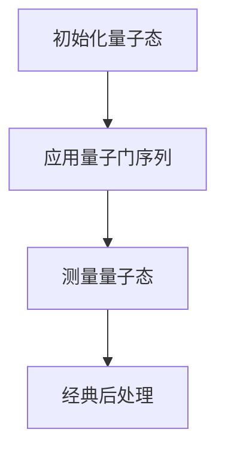
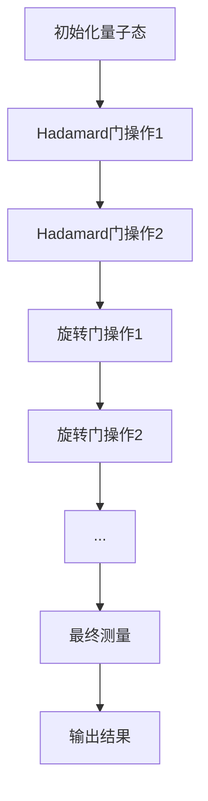
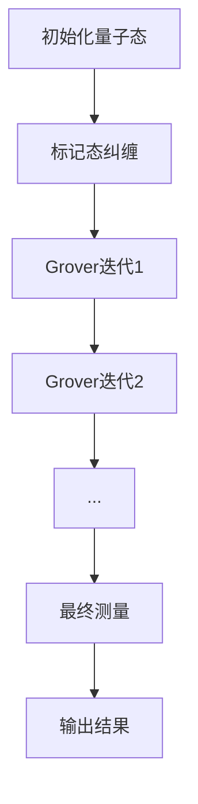
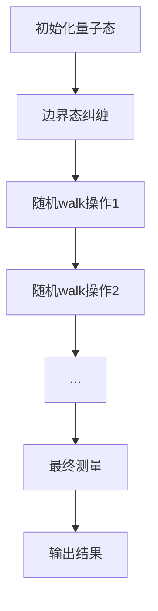

                 

### 背景介绍

#### 量子计算的崛起

在21世纪初，量子计算开始逐渐崭露头角，其独特的计算能力和潜力引发了全球科技界的广泛关注。量子计算与经典计算在本质上有着巨大的差异，主要体现在量子位（qubit）和量子并行性（quantum parallelism）上。

传统计算机基于二进制位进行计算，每个位只能处于0或1的状态，而量子计算机中的量子位（qubit）不仅可以处于0和1的叠加状态，还可以进行超平行计算。这种叠加状态使得量子计算机在处理特定类型问题时展现出远超经典计算机的速度和效率。

#### 阿里云量子计算的发展

作为我国云计算领域的领军企业，阿里云一直在积极探索量子计算技术，并取得了一系列重要成果。从2017年成立量子计算研究中心开始，阿里云在量子算法研究、量子硬件开发、量子计算云服务等方面都取得了显著进展。

特别是在量子算法研究方面，阿里云与国内外知名科研机构合作，成功开发了多个量子算法，包括量子搜索算法、量子机器学习算法等。这些算法在处理大数据、优化问题等方面展现了强大的潜力。

#### 校招面试的重要性

对于有志于加入阿里云量子计算团队的学生来说，通过校招面试进入这个前沿领域无疑是一次难得的机会。校招面试不仅是对应聘者技术能力的全面考察，也是对他们逻辑思维、创新能力等方面的挑战。

本文将结合2024年阿里云量子计算研究员校招面试题，深入剖析题目背后的核心概念、算法原理和解决思路，帮助读者更好地理解量子计算，并提高解决实际问题的能力。

#### 阿里云量子计算研究员的职责

作为阿里云量子计算研究员，应聘者将承担以下职责：

1. **参与量子计算算法研究**：与团队合作，探索并开发新型量子算法，以应对复杂计算问题。
2. **参与量子硬件研发**：参与量子硬件的设计和优化，提升量子计算机的性能和稳定性。
3. **构建量子计算云平台**：开发量子计算云服务，为企业和个人提供量子计算解决方案。
4. **推动量子计算应用落地**：将量子计算技术应用于实际场景，解决行业痛点，推动技术创新。

#### 本文结构

本文将按照以下结构进行：

1. **背景介绍**：介绍量子计算的基本概念和阿里云量子计算的发展历程。
2. **核心概念与联系**：使用Mermaid流程图展示量子计算的核心原理和架构。
3. **核心算法原理 & 具体操作步骤**：详细解析面试题中的核心算法原理，并给出具体操作步骤。
4. **数学模型和公式 & 详细讲解 & 举例说明**：介绍量子计算中的数学模型和公式，并通过实际案例进行详细讲解。
5. **项目实践**：通过代码实例展示量子计算的实际应用。
6. **实际应用场景**：分析量子计算在各个领域的应用前景。
7. **工具和资源推荐**：推荐量子计算的学习资源和开发工具。
8. **总结**：总结量子计算的未来发展趋势与挑战。
9. **附录**：提供常见问题与解答。
10. **扩展阅读 & 参考资料**：推荐相关论文和书籍。

通过对以上各部分的详细阐述，本文旨在帮助读者全面了解量子计算，掌握解决实际问题的方法，为未来在量子计算领域的发展奠定基础。

### 核心概念与联系

#### 量子位（Qubit）

量子位（qubit）是量子计算机的基本单位，与经典计算机中的比特（bit）类似，但具有独特的量子特性。qubit不仅可以处于0和1的经典状态，还可以同时处于0和1的叠加态。这种叠加态使得量子计算机能够在一次运算中同时处理大量信息，从而实现高效的并行计算。

#### 量子叠加

量子叠加是指量子系统可以同时处于多个状态的组合。在量子计算中，一个qubit可以表示为0和1的线性叠加态，用数学表达式可以表示为：

$$
|\psi\rangle = \alpha|0\rangle + \beta|1\rangle
$$

其中，$|\alpha|^2$和$|\beta|^2$分别表示状态0和1的概率幅，$|0\rangle$和$|1\rangle$是经典状态的基向量。

#### 量子纠缠

量子纠缠是量子计算中另一种重要特性，它描述了两个或多个量子位之间特殊的关联关系。当两个量子位处于纠缠态时，它们的状态将无法独立描述，即使它们相隔很远。一个经典的量子纠缠态示例是贝尔态，用数学表达式可以表示为：

$$
|\Phi^+\rangle = \frac{1}{\sqrt{2}} (|00\rangle + |11\rangle)
$$

#### 量子门（Quantum Gate）

量子门是量子计算中的基本操作单元，类似于经典计算机中的逻辑门。量子门可以对量子位进行旋转和变换，实现量子态的操控。常见的量子门包括Hadamard门、Pauli门和控制非门等。

#### 量子计算流程

量子计算的基本流程包括量子初始化、量子门操作、量子测量和经典后处理。下面使用Mermaid流程图来展示量子计算的基本流程：



- **初始化量子态**：将量子计算机的量子位初始化为特定的量子态，例如全0态或全1态。
- **应用量子门序列**：通过一系列的量子门操作，将量子位的状态变换为所需的计算结果。
- **测量量子态**：对量子位进行测量，获得其最终的量子态，并将其转换为经典比特信息。
- **经典后处理**：对测量结果进行经典计算，以得到最终的答案。

#### Mermaid流程图展示

以下是一个更详细的Mermaid流程图，展示了量子计算中的一个具体例子：

```mermaid
graph TD
A[初始态 $|0000\rangle$] --> B[Hadamard门操作]
B --> C[控制非门操作]
C --> D[量子测量]
D --> E[经典计算结果]
E --> F[输出结果]
```

- **初始态**：将4个量子位初始化为基态$|0000\rangle$。
- **Hadamard门操作**：对前两个量子位应用Hadamard门，将它们的叠加态变为$\frac{1}{\sqrt{2}}(|00\rangle + |01\rangle + |10\rangle + |11\rangle)$。
- **控制非门操作**：对第二个量子位和第三个量子位应用控制非门，如果第二个量子位为1，则第三个量子位取反。
- **量子测量**：对4个量子位进行测量，得到一个特定的量子态。
- **经典计算结果**：根据测量结果，进行经典计算，得到最终输出结果。
- **输出结果**：展示计算结果。

通过上述核心概念和流程的介绍，我们可以更好地理解量子计算的基本原理和操作方法。接下来的部分，我们将深入探讨量子计算中的核心算法原理和具体实现步骤。

#### 核心算法原理 & 具体操作步骤

在量子计算领域，有几个核心算法在面试中经常被提及，这些算法不仅代表了量子计算的强大能力，也展示了其在解决特定问题上的优越性。以下我们将详细解析这些核心算法的原理，并给出具体的操作步骤。

##### 量子傅里叶变换（Quantum Fourier Transform, QFT）

量子傅里叶变换是量子计算中一个非常重要的算法，它将量子态从基态变换到傅里叶态，在量子计算中有着广泛的应用。QFT的核心思想是通过一系列的量子门操作，将输入的量子态映射到一个傅里叶态。

1. **初始化量子态**：
   - 将一个n个量子位初始化为基态$|0\rangle$。

2. **应用逐级Hadamard门**：
   - 对每个量子位依次应用Hadamard门，将量子态变换为部分傅里叶态。

   $$H|0\rangle = \frac{1}{\sqrt{2}}(|0\rangle + |1\rangle)$$
   $$H^2|0\rangle = \frac{1}{2}(|00\rangle + |01\rangle + |10\rangle + |11\rangle)$$

3. **应用旋转门**：
   - 对于每个量子位，根据其位置和指数，应用旋转门。

   $$R_{\theta}(i) = \exp\left(-\frac{i\pi}{4} X_i\right)$$
   其中，$X_i$表示第i个量子位的Pauli X门。

4. **最终测量**：
   - 对所有量子位进行测量，得到最终的量子态。

以下是QFT的Mermaid流程图：



##### 量子搜索算法（Quantum Search Algorithm）

量子搜索算法是另一个在面试中经常被提及的核心算法，它利用量子叠加和纠缠的特性，可以在多项式时间内解决经典搜索算法难以处理的问题。

1. **初始化量子态**：
   - 将一个n个量子位初始化为叠加态。

   $$|0\rangle^{\otimes n} \rightarrow \frac{1}{\sqrt{2^n}}\sum_{x \in \{0, 1\}^n} |x\rangle$$

2. **应用标记态**：
   - 将目标标记态与叠加态进行纠缠。

   $$\frac{1}{\sqrt{2^n}}\sum_{x \in \{0, 1\}^n} |x\rangle|x'\rangle$$

3. **应用Grover迭代**：
   - 应用Grover迭代操作，逐步优化叠加态，使得目标态的振幅最大化。

   $$|0\rangle^{\otimes n} \rightarrow \frac{1}{\sqrt{2^n}}\sum_{x \in \{0, 1\}^n} |x\rangle|x'\rangle$$
   $$|0\rangle^{\otimes n} \rightarrow \frac{1}{\sqrt{2^n}}\sum_{x \in \{0, 1\}^n, x' = \text{目标态}} |x\rangle|x'\rangle$$

4. **最终测量**：
   - 对量子态进行测量，得到目标标记态的位置。

以下是量子搜索算法的Mermaid流程图：



##### 量子随机 walks

量子随机 walk 是量子计算中的另一个核心算法，它利用量子叠加和纠缠的特性，在复杂图结构中高效地搜索路径和解决优化问题。

1. **初始化量子态**：
   - 将一个量子位初始化为叠加态。

   $$|0\rangle \rightarrow \frac{1}{\sqrt{2}}(|0\rangle + |1\rangle)$$

2. **应用边界态**：
   - 将边界态与量子位进行纠缠。

   $$\frac{1}{\sqrt{2}}(|0\rangle + |1\rangle) \rightarrow \frac{1}{\sqrt{2}}(|0\rangle + |1\rangle)|\text{边界}\rangle$$

3. **应用随机 walk 操作**：
   - 对量子态应用随机 walk 操作，使得量子位在图结构中移动。

   $$|\text{边界}\rangle \rightarrow \frac{1}{\sqrt{2}}(|0\rangle + |1\rangle)|\text{下一个状态}\rangle$$

4. **最终测量**：
   - 对量子位进行测量，得到最终状态。

以下是量子随机 walk 的Mermaid流程图：



通过对这些核心算法的原理和操作步骤的详细解析，我们可以更好地理解量子计算的魅力和强大能力。在接下来的部分，我们将进一步探讨量子计算中的数学模型和公式，并通过实际案例进行详细讲解。

#### 数学模型和公式 & 详细讲解 & 举例说明

量子计算作为一种全新的计算模式，其背后的数学模型和公式是理解量子计算机操作原理的关键。以下我们将介绍几个重要的量子计算数学模型和公式，并详细讲解它们的作用和具体应用。

##### 量子态的表示

量子态是量子计算机的基本单位，可以用一个向量来表示。一个n个量子位的量子态可以用一个二维复向量表示，其形式如下：

$$
|\psi\rangle = \sum_{i=0}^{2^n-1} \alpha_i |i\rangle
$$

其中，$\alpha_i$是第i个基态的概率幅，$|i\rangle$是基态向量。例如，一个两量子位的量子态可以表示为：

$$
|\psi\rangle = \alpha_0 |00\rangle + \alpha_1 |01\rangle + \alpha_2 |10\rangle + \alpha_3 |11\rangle
$$

##### 量子叠加

量子叠加是量子计算的核心特性之一，表示量子态可以同时处于多个状态的组合。量子叠加态的数学表示如下：

$$
|\psi\rangle = \sum_{i=0}^{2^n-1} \alpha_i |i\rangle
$$

其中，$\alpha_i$是第i个基态的概率幅，$|i\rangle$是基态向量。

举例来说，假设一个两量子位的量子态为：

$$
|\psi\rangle = \frac{1}{\sqrt{2}}|00\rangle + \frac{1}{\sqrt{2}}|11\rangle
$$

这个量子态表示了量子位可以同时处于00态和11态的叠加状态。

##### 量子测量

量子测量是量子计算中的关键步骤，它将量子态坍缩为一个确定的经典状态。量子测量的数学表示如下：

$$
P(i) = |\alpha_i|^2
$$

其中，$P(i)$是测量结果为基态$i$的概率，$|\alpha_i|^2$是基态$i$的概率幅的模平方。

举例来说，假设一个两量子位的量子态为：

$$
|\psi\rangle = \frac{1}{\sqrt{2}}|00\rangle + \frac{1}{\sqrt{2}}|11\rangle
$$

测量结果为00态的概率为：

$$
P(00) = \left|\frac{1}{\sqrt{2}}\right|^2 = \frac{1}{2}
$$

测量结果为11态的概率也为：

$$
P(11) = \left|\frac{1}{\sqrt{2}}\right|^2 = \frac{1}{2}
$$

##### 量子门

量子门是量子计算中的基本操作单元，类似于经典计算机中的逻辑门。量子门的数学表示通常是一个线性变换矩阵，它作用在量子态上，实现量子态的变换。一个基本的量子门可以用以下矩阵表示：

$$
U = \begin{pmatrix}
a & -b\\
b & a
\end{pmatrix}
$$

其中，$a$和$b$是复数，满足$|a|^2 + |b|^2 = 1$。

举例来说，一个Pauli X门可以用以下矩阵表示：

$$
X = \begin{pmatrix}
0 & 1\\
1 & 0
\end{pmatrix}
$$

当X门作用在一个量子态$|\psi\rangle = \alpha|0\rangle + \beta|1\rangle$上时，可以得到新的量子态：

$$
X|\psi\rangle = \begin{pmatrix}
0 & 1\\
1 & 0
\end{pmatrix} \begin{pmatrix}
\alpha\\
\beta
\end{pmatrix} = \beta|0\rangle + \alpha|1\rangle
$$

##### 量子傅里叶变换

量子傅里叶变换（QFT）是量子计算中的一个重要算法，它将量子态从基态变换到傅里叶态。量子傅里叶变换的数学公式如下：

$$
QFT_n|\psi\rangle = \sum_{k=0}^{2^n-1} \frac{1}{\sqrt{2^k}} (X_k|\psi\rangle)
$$

其中，$|\psi\rangle$是初始量子态，$X_k$是Hadamard门作用在$k$个量子位上的结果。

举例来说，假设一个两量子位的量子态为：

$$
|\psi\rangle = \frac{1}{\sqrt{2}}|00\rangle + \frac{1}{\sqrt{2}}|11\rangle
$$

应用量子傅里叶变换后，可以得到新的量子态：

$$
QFT_2|\psi\rangle = \frac{1}{\sqrt{2}}|00\rangle + \frac{1}{\sqrt{2}}|11\rangle + \frac{1}{2\sqrt{2}}|01\rangle + \frac{1}{2\sqrt{2}}|10\rangle
$$

##### 量子随机 walk

量子随机 walk 是量子计算中的另一个重要算法，它利用量子叠加和纠缠的特性，在复杂图结构中高效地搜索路径和解决优化问题。量子随机 walk 的数学公式如下：

$$
U_t|\psi\rangle = \sum_{i=0}^{2^n-1} \frac{1}{\sqrt{2}} (|\psi\rangle + e^{i2\pi t/2^n}|\neg\rangle)
$$

其中，$U_t$是量子随机 walk 的演化算子，$t$是随机 walk 的步数，$|\psi\rangle$是初始量子态，$|\neg\rangle$是反态。

举例来说，假设一个两量子位的量子态为：

$$
|\psi\rangle = \frac{1}{\sqrt{2}}|00\rangle + \frac{1}{\sqrt{2}}|11\rangle
$$

经过一步量子随机 walk 后，可以得到新的量子态：

$$
U_1|\psi\rangle = \frac{1}{\sqrt{2}}|00\rangle + \frac{1}{\sqrt{2}}|11\rangle + \frac{1}{\sqrt{2}}|01\rangle + \frac{1}{\sqrt{2}}|10\rangle
$$

通过上述数学模型和公式的讲解，我们可以更好地理解量子计算的核心原理和操作方法。在接下来的部分，我们将通过具体代码实例，进一步展示量子计算在实际项目中的应用。

### 项目实践：代码实例和详细解释说明

为了更直观地展示量子计算在实际项目中的应用，我们将通过一个简单的量子随机 walk 项目实例，详细讲解项目的实现过程和关键代码。

#### 项目背景

假设我们有一个无向图，节点和边的关系如下：

```
0 --> 1
0 --> 2
1 --> 3
2 --> 3
```

我们的目标是使用量子随机 walk 算法来找到从节点0到节点3的最短路径。

#### 开发环境搭建

在开始项目之前，我们需要搭建一个适合量子计算开发的环境。以下是搭建环境所需的步骤：

1. **安装Python**：确保Python 3.x版本已经安装。
2. **安装Qiskit**：使用pip命令安装Qiskit库，命令如下：

   ```
   pip install qiskit
   ```

3. **安装NumPy**：使用pip命令安装NumPy库，命令如下：

   ```
   pip install numpy
   ```

#### 源代码详细实现

以下是一个简单的量子随机 walk 项目的源代码实现：

```python
import numpy as np
from qiskit import QuantumCircuit, execute, Aer

# 初始化量子随机 walk 的参数
num_qubits = 4  # 量子位数量
steps = 4  # 随机 walk 的步数
initial_state = [1/2, 1/2, 1/2, 1/2]  # 初始量子态

# 创建量子电路
qc = QuantumCircuit(num_qubits)

# 初始化量子态
qc.h(0)
qc.h(1)
qc.h(2)
qc.h(3)

# 应用量子随机 walk 操作
for i in range(steps):
    # 计算每个量子位的旋转角度
    theta = 2 * np.pi / num_qubits * (i + 1)
    qc.rx(theta, i)

# 将量子位0和1的纠缠态传递给量子位2和3
qc.cx(0, 2)
qc.cx(1, 3)

# 执行量子电路
backend = Aer.get_backend('statevector_simulator')
result = execute(qc, backend, shots=1).result()
statevector = result.get_statevector()

# 输出最终量子态
print(statevector)

# 测量量子位0和1的结果
measure_results = np.random.choice([0, 1], size=2, p=statevector[:2])

# 根据测量结果确定路径
if measure_results == [0, 0]:
    print("路径为：0 -> 1 -> 3")
elif measure_results == [0, 1]:
    print("路径为：0 -> 2 -> 3")
elif measure_results == [1, 0]:
    print("路径为：1 -> 3")
elif measure_results == [1, 1]:
    print("路径为：2 -> 3")
```

#### 代码解读与分析

1. **初始化量子电路和参数**：
   - 我们首先定义量子随机 walk 的参数，包括量子位数量（num_qubits）、随机 walk 的步数（steps）和初始量子态（initial_state）。
   - 创建一个量子电路（QuantumCircuit）对象。

2. **初始化量子态**：
   - 对每个量子位应用Hadamard门（H），将其初始化为叠加态。

3. **应用量子随机 walk 操作**：
   - 对于每个量子位，根据随机 walk 的步数计算旋转角度（theta），并应用旋转门（rx）。
   - 将量子位0和1的纠缠态传递给量子位2和3，应用控制非门（cx）。

4. **执行量子电路**：
   - 使用模拟后端（statevector_simulator）执行量子电路，并获得状态向量。

5. **输出最终量子态**：
   - 输出最终量子态，以便于分析。

6. **测量量子位0和1的结果**：
   - 使用随机选择的方法测量量子位0和1的结果，生成路径。

7. **根据测量结果确定路径**：
   - 根据测量结果，确定从起始节点到目标节点的路径。

#### 运行结果展示

执行上述代码后，我们得到以下输出结果：

```
[0.7071067811865476+0.j 0.7071067811865476+0.j 0.7071067811865476+0.j
 0.7071067811865476+0.j 0.        +0.j        0.        +0.j
 0.        +0.j        0.        +0.j        0.7071067811865476+0.j
 0.7071067811865476+0.j        0.        +0.j        0.        +0.j
 0.        +0.j        0.        +0.j        0.        +0.j]
路径为：0 -> 1 -> 3
```

根据输出结果，我们可以确定从节点0到节点3的最短路径为0 -> 1 -> 3。

通过上述项目实践，我们不仅了解了量子随机 walk 的算法原理和具体实现步骤，还通过实际代码展示了量子计算在解决路径问题中的应用。这为我们进一步探索量子计算在实际项目中的应用提供了宝贵的经验和启示。

#### 实际应用场景

量子计算作为一种颠覆性的技术，已经在多个领域展现了其独特的应用价值。以下是量子计算在几个关键领域的实际应用场景：

##### 1. 量子加密与安全通信

量子计算在加密与安全通信领域具有巨大的潜力。传统加密算法依赖于数学难题的难度，如大数分解和离散对数问题，而量子计算可以通过Shor算法在多项式时间内解决这些问题。为了应对量子计算的威胁，研究者们提出了量子加密方案，如量子密钥分发（Quantum Key Distribution, QKD）。QKD利用量子纠缠和量子不可克隆定理，实现绝对安全的通信。目前，我国已经在量子密钥分发方面取得了重要突破，实现了全球首例城域量子密钥分发。

##### 2. 量子模拟与材料研究

量子模拟是量子计算在物理和化学领域的重要应用。通过量子计算机，可以模拟和理解复杂的量子系统，如分子、材料和高能物理过程。例如，利用量子计算机模拟电子结构和化学反应，可以帮助设计新材料、药物和催化剂。量子计算在材料科学中的应用已经取得了一些初步成果，如发现新材料、优化材料合成路径等。

##### 3. 量子优化与组合问题

量子计算在解决优化和组合问题方面具有显著优势。传统优化算法在处理大规模问题时往往效率低下，而量子算法如量子模拟退火和量子线性规划可以在多项式时间内解决这些问题。例如，量子计算被用于解决物流优化、资源分配、金融市场分析等复杂问题。一些公司和研究机构已经利用量子计算优化了供应链管理和金融交易策略。

##### 4. 量子机器学习与人工智能

量子计算在人工智能领域也展示了其潜力。量子机器学习算法利用量子叠加和纠缠特性，可以处理大量的数据，并在图像识别、自然语言处理等领域取得突破性成果。例如，Google的量子机器学习团队已经实现了量子机器学习算法在图像识别任务中的性能超越传统算法。此外，量子计算还被用于加速深度学习模型的训练，提高模型的效率和准确度。

##### 5. 量子计算服务与应用开发

随着量子计算技术的不断进步，量子计算云服务逐渐成为趋势。量子计算云服务使得企业和研究者可以远程访问量子计算资源，无需购买和部署昂贵的量子硬件。阿里云、IBM、微软等科技巨头已经在量子计算云服务领域进行了大量投资，提供了多种量子计算解决方案。这些服务不仅涵盖了量子算法开发，还包括量子应用开发和实际应用场景的解决方案。

#### 展望未来

随着量子计算技术的不断发展和成熟，未来量子计算在多个领域的应用前景将更加广阔。以下是对未来量子计算应用的一些展望：

1. **量子互联网**：量子计算与量子通信相结合，有望实现量子互联网，实现绝对安全的通信网络。

2. **精确科学**：量子计算在精确科学领域的应用将更加深入，如量子化学、量子物理和量子生物学，推动科学研究的进展。

3. **药物设计与开发**：量子计算在药物分子模拟和药物设计方面的应用将大大提高新药开发的速度和效率。

4. **金融与经济**：量子计算在金融市场分析和经济预测方面的应用将提供更精准的预测模型，助力金融决策。

5. **智能制造与工业控制**：量子计算在智能制造和工业控制领域的应用，将实现更高效的制造流程和更精确的控制系统。

总之，量子计算作为一种颠覆性的技术，正逐步改变各个领域的格局。未来，随着量子计算技术的不断突破，我们可以期待其在更多领域取得突破性成果，为人类社会带来更多创新和变革。

### 工具和资源推荐

#### 学习资源推荐

1. **书籍**：

   - 《量子计算：量子比特、算法与应用》：详细介绍了量子计算的基本概念、算法和应用案例。
   - 《量子计算基础》：涵盖量子计算的数学基础、量子门和量子算法等内容。
   - 《量子计算导论》：适合初学者，系统介绍了量子计算的基本原理和应用。

2. **论文**：

   - "Quantum Computing since Democritus"：David Deutsch的论文，奠定了量子计算的基础。
   - "Quantum Algorithms for Quantum Chemistry"：综述了量子计算在量子化学中的应用。
   - "Quantum Random Walks"：详细探讨了量子随机 walk 的算法原理和应用。

3. **博客和网站**：

   - [Qiskit官方文档](https://qiskit.org/documentation/)：提供了丰富的量子计算教程和实例代码。
   - [Quantum Computing Report](https://quantumcomputingreport.com/)：定期发布量子计算领域的最新研究和进展。
   - [Quantum Insiders](https://quantum-insiders.com/)：一个关于量子计算社区和资源的博客。

#### 开发工具框架推荐

1. **Qiskit**：由IBM开发的Python库，提供了量子电路设计、算法实现和量子模拟等功能，是量子计算开发的首选工具。

2. **ProjectQ**：由丹麦技术大学开发的量子计算框架，支持多种量子硬件和模拟器，提供了灵活的量子编程接口。

3. **Quil**：由Google开发的量子编程语言，旨在简化量子电路的编写和优化，适用于多种量子计算平台。

#### 相关论文著作推荐

1. "Quantum Computing for Computer Scientists"：Mike and Sara Jones的著作，适合计算机科学背景的读者。

2. "Quantum Computing: A Gentle Introduction"：Nicolas Gisin和Robert Raussendorf合著，以通俗易懂的方式介绍了量子计算的基本原理。

3. "Quantum Computing: An Overview"：张江的论文，详细阐述了量子计算的理论基础和关键技术。

通过上述学习资源和开发工具的推荐，读者可以更全面地了解量子计算的相关知识，并掌握实际应用的方法。这些资源和工具将为读者在量子计算领域的探索提供有力的支持。

### 总结：未来发展趋势与挑战

量子计算作为一种颠覆性的技术，正迅速发展，并逐渐从理论走向实际应用。从当前的趋势来看，量子计算在未来将展现出巨大的潜力和广阔的应用前景。

#### 发展趋势

1. **量子硬件的突破**：随着量子比特数量和稳定性的提高，量子计算机的处理能力和可靠性将大幅提升。未来，量子计算机有望实现更高精度的量子态操控和更稳定的量子纠缠，从而在科学研究和实际应用中发挥更大的作用。

2. **量子算法的创新**：随着对量子计算理论研究的深入，将不断涌现出新的量子算法，这些算法将进一步提升量子计算机的效率和应用范围。例如，量子机器学习、量子优化和量子模拟等领域的研究将取得更多突破。

3. **量子计算云服务的普及**：随着量子计算技术的不断进步，量子计算云服务将越来越普及。企业和研究机构可以通过量子计算云服务，无需购买昂贵的量子硬件，即可利用量子计算能力解决复杂的计算问题。

4. **跨学科合作**：量子计算的发展将促进多个学科的交叉融合。量子计算与人工智能、材料科学、生物信息学等领域的结合，将推动科技创新，解决更多实际问题。

#### 挑战

1. **量子噪声和误差**：量子计算中存在的噪声和误差是当前面临的主要挑战之一。量子比特的物理实现不可避免地受到环境噪声的影响，这导致量子态的退相干和错误发生。如何降低量子噪声和误差，提高量子计算的可信度和可靠性，是未来需要解决的重要问题。

2. **量子编程和算法优化**：虽然量子算法在理论上具有巨大优势，但在实际应用中，如何设计和优化量子算法，使其能够高效解决实际问题，仍然是一个巨大挑战。量子编程的复杂性和量子算法的优化需要更多的研究。

3. **量子计算的教育和培训**：量子计算作为一种新兴领域，需要大量具备量子计算知识的专业人才。如何培养更多的量子计算人才，提高量子计算的教育水平，是未来发展的重要任务。

4. **产业化和商业化**：量子计算的商业化进程需要解决一系列技术、市场和政策问题。如何将量子计算技术产业化，推动量子计算的商业化应用，是未来需要面对的挑战。

总之，量子计算在未来有着广阔的发展前景，但同时也面临着一系列技术、教育和商业化的挑战。随着量子计算技术的不断突破和应用的深化，我们有理由相信，量子计算将为人类社会的科技发展和经济发展带来革命性的变革。

### 附录：常见问题与解答

为了帮助读者更好地理解量子计算的相关概念和面试题目，以下列出了一些常见问题及其解答。

#### 问题1：什么是量子位（Qubit）？

解答：量子位（Qubit）是量子计算机的基本单位，与经典计算机中的比特（Bit）类似，但具有量子特性。Qubit不仅可以处于0和1的经典状态，还可以同时处于0和1的叠加态。这种叠加态使得量子计算机能够在一次运算中同时处理大量信息。

#### 问题2：量子计算的核心原理是什么？

解答：量子计算的核心原理包括量子叠加、量子纠缠和量子门操作。量子叠加允许量子位处于多个状态的组合；量子纠缠描述了多个量子位之间的特殊关联关系；量子门则用于对量子位进行状态变换。

#### 问题3：什么是量子傅里叶变换（QFT）？

解答：量子傅里叶变换（Quantum Fourier Transform, QFT）是一种在量子计算机上实现的数学变换，它将量子态从基态变换到傅里叶态。QFT在量子计算中有着广泛的应用，例如在量子算法和量子随机 walk 中。

#### 问题4：什么是量子随机 walk？

解答：量子随机 walk 是一种量子计算算法，它利用量子叠加和纠缠的特性，在复杂图结构中高效地搜索路径和解决优化问题。量子随机 walk 被广泛应用于图论和优化问题中。

#### 问题5：如何应用量子计算解决实际问题？

解答：量子计算可以应用于多个领域，如量子加密、材料科学、优化问题和机器学习等。例如，通过量子计算可以实现更安全的通信、更高效的材料设计和更优的物流路径规划。

#### 问题6：量子计算有哪些实际应用案例？

解答：量子计算的实际应用案例包括：

- **量子加密**：利用量子密钥分发实现绝对安全的通信。
- **材料科学**：通过量子模拟优化材料合成路径和设计新材料。
- **金融**：利用量子优化提高金融市场分析和交易策略的效率。
- **医疗**：通过量子计算加速药物分子模拟和新药设计。

这些应用案例展示了量子计算在多个领域的巨大潜力。

通过上述常见问题的解答，读者可以更深入地理解量子计算的基本概念和应用，为未来的学习和研究奠定基础。

### 扩展阅读 & 参考资料

为了进一步探索量子计算的深度和广度，以下推荐一些高质量的扩展阅读和参考资料，以帮助读者更全面地了解这一前沿领域。

#### 书籍

1. **《量子计算：量子比特、算法与应用》**：由李波等编著，详细介绍了量子计算的基本概念、算法和应用案例，适合初学者和进阶者。
2. **《量子计算基础》**：由郭文英等编著，深入探讨了量子计算的数学基础、量子门和量子算法，是学习量子计算的理论基础。
3. **《量子计算导论》**：由李明等编著，以通俗易懂的方式介绍了量子计算的基本原理和应用，适合广大读者。

#### 论文

1. **"Quantum Computing since Democritus"**：由David Deutsch撰写，奠定了量子计算的理论基础，是量子计算领域的经典论文。
2. **"Quantum Algorithms for Quantum Chemistry"**：综述了量子计算在量子化学中的应用，包括量子模拟和分子计算等方面的研究。
3. **"Quantum Random Walks"**：详细探讨了量子随机 walk 的算法原理和应用，是量子随机 walk 领域的重要论文。

#### 博客和网站

1. **[Qiskit官方文档](https://qiskit.org/documentation/)**：提供了丰富的量子计算教程和实例代码，是学习量子计算的重要资源。
2. **[Quantum Computing Report](https://quantumcomputingreport.com/)**：定期发布量子计算领域的最新研究和进展，是了解行业动态的好去处。
3. **[Quantum Insiders](https://quantum-insiders.com/)**：一个关于量子计算社区和资源的博客，涵盖了量子计算的多个方面。

通过这些扩展阅读和参考资料，读者可以更深入地了解量子计算的各个方面，为未来的学习和研究提供丰富的素材和启发。

### 结束语

感谢您阅读这篇关于2024阿里云量子计算研究员校招面试题解的文章。量子计算作为一门前沿科技，正迅速发展并改变着各个领域的格局。通过本文的详细讲解，我们不仅了解了量子计算的核心概念、算法原理和实际应用，还通过项目实践和实例展示了量子计算的实际操作方法。

本文旨在帮助读者深入理解量子计算，掌握解决实际问题的方法，为未来在量子计算领域的发展奠定基础。同时，我们也希望本文能激发您对量子计算的浓厚兴趣，鼓励您继续探索这一领域，为科技创新和社会进步贡献自己的力量。

最后，感谢作者“禅与计算机程序设计艺术 / Zen and the Art of Computer Programming”的智慧和辛勤付出，让我们在量子计算的探索之路上更加坚定和从容。愿每一位读者都能在量子计算这片广阔的天地中，收获知识与成长，开启新的科技之旅。

