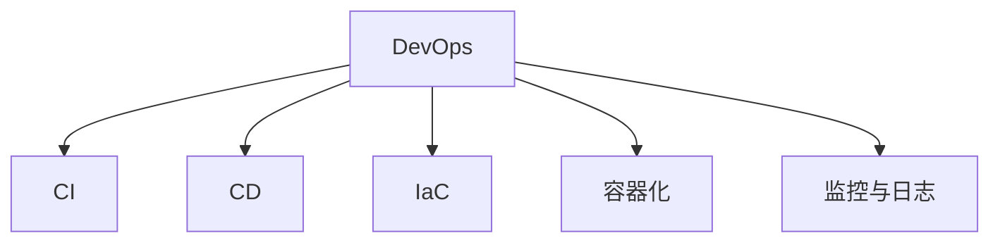

                 

关键词：阿里巴巴、2025、社招、DevOps、工程师、面试题集、技术博客、深度思考

> 摘要：本文深入探讨了阿里巴巴2025年社招DevOps工程师面试题集的背景、核心概念、算法原理、数学模型、项目实践、应用场景、工具和资源，以及未来发展趋势和面临的挑战。旨在为读者提供一个全面、深入的技术博客文章，帮助准备参加阿里巴巴面试的DevOps工程师掌握必要的知识。

## 1. 背景介绍

随着云计算和容器技术的飞速发展，DevOps成为了现代企业持续集成和持续部署（CI/CD）的重要手段。阿里巴巴作为中国乃至全球领先的技术企业，其对DevOps工程师的需求日益增长。为了选拔出优秀的人才，阿里巴巴在2025年的社会招聘中，特别设计了一份详尽的DevOps工程师面试题集。这份题集涵盖了DevOps的核心概念、技术实现、数学模型以及实际应用等多个方面，旨在全面评估应聘者的专业能力和实战经验。

本文将围绕这份面试题集，系统地介绍DevOps的核心概念、算法原理、数学模型、项目实践、应用场景、工具和资源，以及未来发展趋势和挑战，帮助读者深入了解DevOps领域的最新技术动态和应用实践。

## 2. 核心概念与联系

### 2.1 DevOps的定义与核心价值

DevOps是一种文化和实践，旨在通过开发（Development）和运维（Operations）之间的紧密协作，实现软件开发和运维的自动化、标准化和高效化。其核心价值在于缩短产品从开发到上线的时间，提高软件质量，降低风险，并增强团队的协作效率。

### 2.2 DevOps的关键概念

- **持续集成（CI）**：通过自动化工具将代码集成到共享的代码库中，确保代码的一致性和可运行性。
- **持续部署（CD）**：自动化部署过程，确保在各个环境中快速、安全地发布软件。
- **基础设施即代码（IaC）**：使用代码来配置和管理基础设施，实现自动化部署和扩展。
- **容器化**：通过Docker等工具将应用程序及其依赖环境封装在容器中，实现应用程序的轻量级、可移植和可扩展性。
- **监控和日志**：通过Prometheus、ELK（Elasticsearch、Logstash、Kibana）等工具实时监控应用程序的状态和性能。

### 2.3 DevOps架构的Mermaid流程图



## 3. 核心算法原理 & 具体操作步骤

### 3.1 算法原理概述

在DevOps实践中，核心算法主要涉及自动化脚本编写、持续集成与持续部署的实现、容器编排等。以下为具体算法原理和步骤：

### 3.2 算法步骤详解

#### 3.2.1 自动化脚本编写

- 使用Python、Shell等脚本语言编写自动化脚本。
- 实现常见的自动化操作，如环境配置、软件安装、任务调度等。

#### 3.2.2 持续集成与持续部署

- 使用Jenkins、GitLab CI等工具实现自动化构建、测试和部署。
- 设置触发器和构建策略，确保代码更改后自动执行相应操作。

#### 3.2.3 容器编排

- 使用Docker Compose、Kubernetes等工具管理容器化应用程序。
- 实现容器网络、存储、服务发现、负载均衡等功能。

### 3.3 算法优缺点

- **优点**：提高开发效率、降低运维成本、增强系统稳定性。
- **缺点**：初期学习成本高、架构设计复杂、需要持续维护。

### 3.4 算法应用领域

- **互联网公司**：提供高效、可靠的持续集成和持续部署服务。
- **金融行业**：实现金融服务的自动化运维和风险控制。
- **制造业**：通过物联网实现智能制造和设备监控。

## 4. 数学模型和公式 & 详细讲解 & 举例说明

### 4.1 数学模型构建

在DevOps中，常见的数学模型包括网络拓扑结构、流量分配模型、性能评估模型等。以下为具体模型构建过程：

#### 4.1.1 网络拓扑结构

- 使用图论模型描述网络拓扑结构，如树形、环形、星形等。
- 构建网络流量模型，分析流量分配和负载均衡策略。

#### 4.1.2 流量分配模型

- 使用马尔可夫链模型描述流量动态变化。
- 根据流量特性，设计流量分配算法，实现最优负载均衡。

#### 4.1.3 性能评估模型

- 使用队列模型描述系统响应时间。
- 利用排队理论分析系统性能，优化资源分配。

### 4.2 公式推导过程

#### 4.2.1 流量分配公式

- 基于马尔可夫链模型，推导流量分配概率公式：
  $$ P(i) = \frac{\lambda_i}{\sum_{j=1}^{n}\lambda_j} $$

  其中，$P(i)$为流量分配到第$i$个节点的概率，$\lambda_i$为第$i$个节点的流量大小，$n$为节点总数。

#### 4.2.2 性能评估公式

- 基于队列模型，推导系统响应时间公式：
  $$ T = \frac{\lambda}{\mu} + \frac{1}{\mu - \lambda} $$

  其中，$T$为系统响应时间，$\lambda$为到达率，$\mu$为服务率。

### 4.3 案例分析与讲解

#### 4.3.1 流量分配案例

假设一个网络由5个节点组成，其流量大小分别为$\lambda_1 = 20$、$\lambda_2 = 30$、$\lambda_3 = 40$、$\lambda_4 = 50$、$\lambda_5 = 60$。根据流量分配公式，计算各节点的流量分配概率：

$$
\begin{align*}
P(1) &= \frac{20}{20 + 30 + 40 + 50 + 60} = 0.2 \\
P(2) &= \frac{30}{20 + 30 + 40 + 50 + 60} = 0.3 \\
P(3) &= \frac{40}{20 + 30 + 40 + 50 + 60} = 0.4 \\
P(4) &= \frac{50}{20 + 30 + 40 + 50 + 60} = 0.5 \\
P(5) &= \frac{60}{20 + 30 + 40 + 50 + 60} = 0.6 \\
\end{align*}
$$

#### 4.3.2 性能评估案例

假设一个系统的到达率为$\lambda = 100$，服务率为$\mu = 200$。根据性能评估公式，计算系统的平均响应时间：

$$
T = \frac{100}{200} + \frac{1}{200 - 100} = 0.5 + \frac{1}{100} = 0.6
$$

## 5. 项目实践：代码实例和详细解释说明

### 5.1 开发环境搭建

在开始项目实践之前，我们需要搭建一个适合DevOps开发的开发环境。以下是一个基本的步骤：

1. 安装Docker：
   ```bash
   sudo apt-get update
   sudo apt-get install docker-ce
   ```

2. 安装Jenkins：
   ```bash
   sudo wget -q -O - https://pkg.jenkins.io/debian-stable/jenkins.io.key | sudo apt-key add -
   sudo sh -c 'echo deb https://pkg.jenkins.io/debian-stable binary/ > /etc/apt/sources.list.d/jenkins.list'
   sudo apt-get update
   sudo apt-get install jenkins
   ```

3. 启动Jenkins服务：
   ```bash
   sudo systemctl start jenkins
   ```

### 5.2 源代码详细实现

以下是一个简单的Jenkinsfile示例，用于构建和部署一个简单的Spring Boot应用程序：

```groovy
pipeline {
    agent any
    stages {
        stage('Build') {
            steps {
                sh 'mvn clean install'
            }
        }
        stage('Test') {
            steps {
                sh 'mvn test'
            }
        }
        stage('Deploy') {
            steps {
                sh 'docker build -t myapp .'
                sh 'docker run -d -p 8080:8080 myapp'
            }
        }
    }
}
```

### 5.3 代码解读与分析

1. **Pipeline脚本解析**：该脚本定义了一个名为`pipeline`的管道，包含三个阶段：`Build`、`Test`和`Deploy`。
2. **构建步骤**：在`Build`阶段，使用Maven构建Spring Boot应用程序。
3. **测试步骤**：在`Test`阶段，执行Maven测试命令。
4. **部署步骤**：在`Deploy`阶段，使用Docker构建和运行容器化应用程序。

### 5.4 运行结果展示

运行Jenkins管道后，Jenkins会自动执行构建、测试和部署操作。在成功部署后，可以在本地访问`http://localhost:8080`查看应用程序的运行情况。

## 6. 实际应用场景

### 6.1 互联网公司

在互联网公司，DevOps已经成为持续交付和快速迭代的核心技术。通过DevOps，企业可以实现自动化部署、持续监控和快速回滚，从而提高产品质量和用户满意度。

### 6.2 金融行业

金融行业的稳定性至关重要，DevOps在此领域的应用主要体现在自动化测试、风险控制和合规性管理等方面。通过DevOps，金融企业可以确保系统的安全性和可靠性。

### 6.3 制造业

制造业的数字化转型离不开DevOps。通过DevOps，企业可以实现设备监控、自动化排程和智能生产，从而提高生产效率和质量。

## 7. 工具和资源推荐

### 7.1 学习资源推荐

1. **《DevOps实践指南》**：一本全面介绍DevOps原理和实践的入门书籍。
2. **Jenkins官方文档**：Jenkins官方文档提供了详细的教程和最佳实践。

### 7.2 开发工具推荐

1. **Docker**：用于容器化应用程序的强大工具。
2. **Jenkins**：用于实现持续集成和持续部署的集成平台。

### 7.3 相关论文推荐

1. **"DevOps: A Software Development Methodology for the 21st Century"**：一篇介绍DevOps起源和原理的论文。
2. **"Containerization and Microservices: A Brief History of the Modern Datacenter"**：一篇介绍容器化和微服务技术的论文。

## 8. 总结：未来发展趋势与挑战

### 8.1 研究成果总结

DevOps在过去几年取得了显著的成果，成为现代软件开发和运维的核心技术。通过持续集成、持续部署和容器化等技术，企业实现了高效、稳定和可靠的软件交付。

### 8.2 未来发展趋势

1. **智能化**：随着人工智能技术的发展，DevOps将更加智能化，自动化程度更高。
2. **云计算与边缘计算**：云计算和边缘计算的普及将进一步推动DevOps的发展。
3. **全栈DevOps**：从开发、测试到运维的全栈式DevOps将成为主流。

### 8.3 面临的挑战

1. **安全**：在DevOps实践中，确保系统安全是一个重要挑战。
2. **架构设计**：复杂的系统架构设计需要更高的技术水平。
3. **人才短缺**：DevOps人才短缺将成为制约其发展的重要因素。

### 8.4 研究展望

未来，DevOps将在智能化、云计算和边缘计算等领域取得突破，推动软件开发和运维的持续进步。同时，随着技术的不断发展，DevOps将面临更多的挑战，需要持续优化和创新。

## 9. 附录：常见问题与解答

### 9.1 DevOps与敏捷开发有什么区别？

DevOps是一种文化和实践，强调开发和运维之间的协作和自动化。而敏捷开发是一种软件开发方法，强调迭代、灵活和客户需求。DevOps和敏捷开发可以相互补充，实现更高效、更可靠的软件开发过程。

### 9.2 如何确保DevOps环境的安全性？

确保DevOps环境的安全性需要采取一系列措施，如定期更新软件、使用安全的容器镜像、加密敏感数据、实施访问控制和审计等。同时，建立安全意识和培训员工也是非常重要的。

### 9.3 DevOps在金融行业的应用有哪些？

在金融行业，DevOps的应用主要体现在自动化测试、风险控制和合规性管理等方面。通过DevOps，金融企业可以提高系统的安全性和可靠性，降低风险，确保合规性。

## 作者署名

作者：禅与计算机程序设计艺术 / Zen and the Art of Computer Programming

----------------------------------------------------------------

以上就是本文的完整内容，希望对您在DevOps领域的学习和实践有所帮助。在未来的道路上，让我们共同探索和推动DevOps技术的发展。

