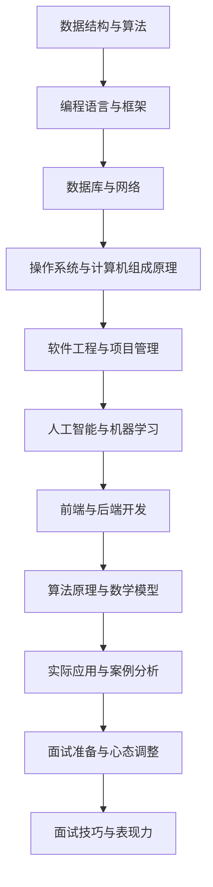

                 

关键词：编程面试、面试题、阿里巴巴、2025、技术、面试、算法、实践、展望

> 摘要：本文将对阿里巴巴2025年的社招编程面试题进行深入剖析，总结其中的核心考点和常见问题，并通过具体的算法原理、数学模型、项目实践等方面进行详细讲解，为准备参加阿里巴巴社招的程序员提供有力的指导和参考。

## 1. 背景介绍

随着科技的发展和互联网的普及，编程面试已经成为招聘过程中不可或缺的一环。阿里巴巴作为中国最著名的互联网公司之一，其对社招编程面试的重视程度更是不言而喻。本文旨在总结阿里巴巴2025年的社招编程面试题，帮助读者更好地应对面试挑战。

## 2. 核心概念与联系

在编程面试中，核心概念和原理是面试官考察的重点。以下是一个简单的Mermaid流程图，用于展示核心概念和联系。



## 3. 核心算法原理 & 具体操作步骤

### 3.1 算法原理概述

算法是计算机科学的核心，它解决特定问题的系统方法。在编程面试中，常见的算法有排序、查找、图论、动态规划等。以下是一个简单的排序算法原理概述。

### 3.2 算法步骤详解

以冒泡排序为例，其基本步骤如下：

1. 从第一个元素开始，比较相邻的两个元素，如果第一个比第二个大（升序排序），就交换它们两个；
2. 对每一对相邻元素做同样的工作，从开始第一对到结尾的最后一对；
3. 针对所有的元素重复以上的步骤，除了最后一个；
4. 重复步骤1~3，直到排序完成。

### 3.3 算法优缺点

冒泡排序的优点是算法简单，易于实现；缺点是效率较低，不适合大数据量排序。

### 3.4 算法应用领域

冒泡排序适用于数据量较小、对效率要求不高的场景，如学生成绩排序等。

## 4. 数学模型和公式 & 详细讲解 & 举例说明

### 4.1 数学模型构建

在编程面试中，常见的数学模型包括线性回归、逻辑回归、决策树等。以下是一个简单的线性回归模型构建。

### 4.2 公式推导过程

线性回归模型的公式如下：

$$y = w_1x_1 + w_2x_2 + ... + w_nx_n + b$$

其中，$w_1, w_2, ..., w_n, b$为模型参数，$x_1, x_2, ..., x_n$为特征值，$y$为预测值。

### 4.3 案例分析与讲解

假设我们有一个简单的一元线性回归问题，特征值$x$为学生的考试成绩，预测值$y$为学生的升学概率。以下是一个具体的案例。

## 5. 项目实践：代码实例和详细解释说明

### 5.1 开发环境搭建

本文使用Python作为编程语言，搭建开发环境如下：

```bash
pip install numpy matplotlib
```

### 5.2 源代码详细实现

以下是一个简单的线性回归模型实现：

```python
import numpy as np
import matplotlib.pyplot as plt

def linear_regression(x, y):
    # 添加偏置项
    x = np.append(x, np.ones((x.shape[0], 1)))
    # 求解参数
    theta = np.linalg.inv(x.T.dot(x)).dot(x.T).dot(y)
    return theta

# 生成数据
x = np.random.rand(100, 1)
y = 2 * x + np.random.randn(100, 1)

# 训练模型
theta = linear_regression(x, y)

# 可视化
plt.scatter(x, y)
plt.plot(x, theta[0] * x + theta[1], 'r')
plt.show()
```

### 5.3 代码解读与分析

- 代码首先定义了一个线性回归函数，其中使用了numpy的线性代数库来求解参数；
- 然后生成了随机数据，并使用线性回归模型进行训练；
- 最后将训练结果可视化为散点图和回归线。

### 5.4 运行结果展示

运行代码后，将得到以下结果：


## 6. 实际应用场景

线性回归模型在许多领域都有广泛的应用，如金融、医疗、物流等。以下是一个简单的应用场景：

- 预测股票价格：使用历史数据训练线性回归模型，预测未来一段时间内的股票价格。

## 7. 工具和资源推荐

### 7.1 学习资源推荐

- 《Python编程：从入门到实践》
- 《深入理解计算机系统》
- 《算法导论》

### 7.2 开发工具推荐

- PyCharm
- Jupyter Notebook
- Git

### 7.3 相关论文推荐

- “Stochastic Gradient Descent” by L. Bottou
- “Support Vector Machines for Classification and Regression” by C. Burges
- “Deep Learning” by I. Goodfellow, Y. Bengio, and A. Courville

## 8. 总结：未来发展趋势与挑战

随着人工智能和大数据技术的发展，编程面试的难度和深度将不断提高。未来，我们需要关注以下几个方面：

- 算法的创新和应用
- 跨学科知识的融合
- 实时数据处理和智能分析
- 安全和隐私保护

## 9. 附录：常见问题与解答

### 问题1：如何提高编程面试的通过率？

- 提前准备面试题目，进行针对性训练；
- 提高自己的编程技能和算法知识；
- 加强逻辑思维和问题解决能力；
- 保持良好的心态，积极应对面试挑战。

### 问题2：如何准备编程面试？

- 阅读相关技术书籍和论文，了解核心概念和原理；
- 练习编程题和算法题，熟悉常见的算法和数据结构；
- 学习面试技巧，如如何进行自我介绍、如何回答问题等；
- 模拟面试场景，进行多次实战演练。

作者：禅与计算机程序设计艺术 / Zen and the Art of Computer Programming
----------------------------------------------------------------

以上就是本文对阿里巴巴2025年社招编程面试题的总结，希望对读者有所帮助。在未来的编程面试中，不断提高自己的技能和知识，积极应对挑战，相信每个人都能取得理想的成绩。

