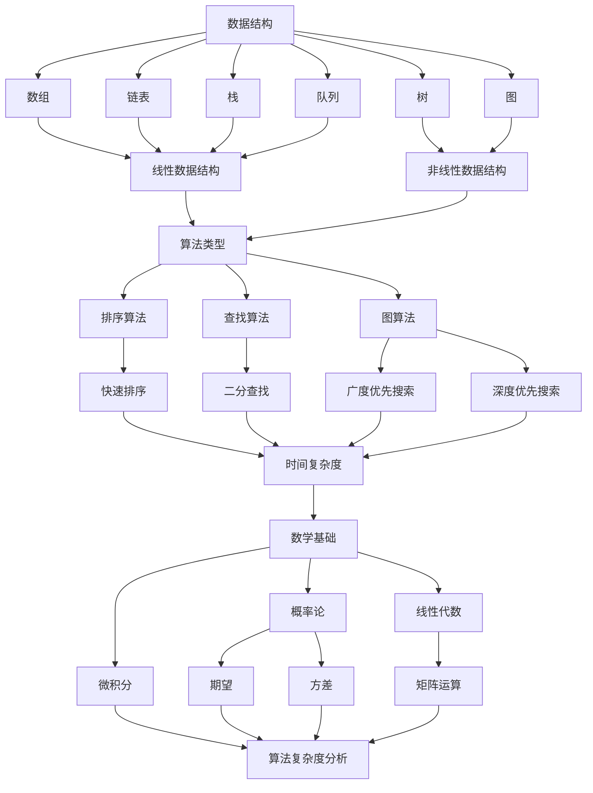

                 

### 1. 背景介绍

#### 阿里巴巴校招算法工程师面试背景

近年来，随着人工智能、大数据和云计算等技术的迅猛发展，算法工程师已经成为互联网行业中最炙手可热的人才岗位之一。阿里巴巴作为全球领先的互联网公司，其校招算法工程师岗位更是备受瞩目。阿里巴巴校招算法工程师面试题目难度逐年提升，涵盖了数据结构、算法、数学等多个领域，对面试者的综合素质和技术能力提出了极高的要求。

本文旨在通过对2024年阿里巴巴校招算法工程师面试题的全面解析，帮助广大读者深入了解面试的核心考点和解题技巧，提升自身算法能力，顺利应对阿里巴巴以及其他互联网大厂的面试挑战。

#### 本文结构

本文将分为以下几个部分进行详细解析：

1. **核心概念与联系**：介绍算法工程师所需掌握的核心概念，如数据结构、算法类型等，并通过Mermaid流程图展示其关系。
2. **核心算法原理 & 具体操作步骤**：解析常见面试题的算法原理，详细说明解题思路和步骤。
3. **数学模型和公式 & 详细讲解 & 举例说明**：介绍与面试题相关的数学模型和公式，并通过具体实例进行详细讲解。
4. **项目实践：代码实例和详细解释说明**：通过实际项目代码，展示算法的实现过程，并进行详细解读和分析。
5. **实际应用场景**：探讨算法在实际业务场景中的应用，分析其价值与效果。
6. **工具和资源推荐**：推荐学习资源、开发工具和框架，帮助读者提升自身能力。
7. **总结：未来发展趋势与挑战**：总结本文内容，探讨算法领域的发展趋势和未来挑战。
8. **附录：常见问题与解答**：解答读者可能遇到的常见问题。
9. **扩展阅读 & 参考资料**：提供相关扩展阅读和参考资料，供读者进一步学习。

接下来，我们将逐步深入各个部分，对阿里巴巴校招算法工程师面试题进行全面解析。

#### 阿里巴巴校招算法工程师面试的重要性

阿里巴巴校招算法工程师面试不仅是对面试者技术能力的检验，更是对其思维方式、解决问题的能力和团队协作能力的全面考察。以下是阿里巴巴校招算法工程师面试的重要性：

1. **技术能力评估**：面试题目涵盖了数据结构、算法、数学等多个领域，通过这些题目，面试官可以全面了解面试者的技术实力和知识储备。
2. **思维能力和解决问题能力**：面试题往往要求面试者运用所学知识解决实际问题，考察其逻辑思维、分析和解决问题的能力。
3. **团队协作能力**：在面试过程中，面试官会通过团队项目等形式，考察面试者的团队协作能力和沟通能力。
4. **潜力评估**：面试官通过面试过程，评估面试者的潜力和发展空间，为阿里巴巴筛选出具有长期发展潜力的优秀人才。

综上所述，阿里巴巴校招算法工程师面试对于求职者和公司来说都具有重要意义。求职者需要充分准备，提升自身综合素质，以应对面试挑战；而公司则需要通过面试过程，筛选出最适合岗位的人才，为公司的长期发展奠定基础。

### 2. 核心概念与联系

在深入探讨阿里巴巴校招算法工程师面试题之前，我们首先需要了解一些核心概念及其之间的联系。以下是算法工程师面试中常见的一些核心概念：

#### 2.1 数据结构

数据结构是算法工程师必须熟练掌握的基础概念。常见的线性数据结构包括数组、链表、栈、队列等；非线性数据结构包括树、图等。每种数据结构都有其独特的特点和适用场景。例如，链表适用于插入和删除频繁的场景，而树和图则常用于图论问题。

#### 2.2 算法类型

算法可以分为多种类型，如排序算法、查找算法、图算法等。每种算法都有其特定的应用场景和特点。例如，快速排序适用于大规模数据的排序，而广度优先搜索则适用于图中的最短路径问题。

#### 2.3 数学基础

算法工程师需要具备一定的数学基础，包括概率论、线性代数、微积分等。这些数学知识在解决算法问题时具有重要的指导作用，例如，概率论可以帮助我们理解随机算法的期望和方差，线性代数可以简化矩阵运算，微积分可以帮助我们分析算法的时间复杂度和空间复杂度。

#### 2.4 编程语言

熟悉至少一种编程语言是算法工程师的基本要求。常见的编程语言包括Java、C++、Python等。每种编程语言都有其独特的特点和优势，选择合适的编程语言可以更好地实现算法。

#### 2.5 Mermaid流程图

为了更好地展示这些核心概念之间的联系，我们使用Mermaid流程图进行可视化。以下是数据结构、算法类型、数学基础和编程语言之间的Mermaid流程图：



通过这个Mermaid流程图，我们可以清晰地看到数据结构、算法类型、数学基础和编程语言之间的关系。这些核心概念是算法工程师必须掌握的基础知识，为解决实际问题提供了有力的理论支持。

在接下来的章节中，我们将详细解析阿里巴巴校招算法工程师面试中的一些典型问题，帮助读者更好地理解和运用这些核心概念。

#### 2.6 数据结构与算法的关系

数据结构与算法是相辅相成的两个概念，它们在算法工程师的面试中占据着重要地位。数据结构是存储和管理数据的方式，而算法则是解决问题的步骤和方法。在实际应用中，合理选择和使用数据结构可以优化算法的效率和性能。

**2.6.1 数据结构的分类**

数据结构可以分为线性结构和非线性结构。线性结构包括数组、链表、栈和队列等，它们在数据存储和访问上具有顺序性。非线性结构包括树和图，它们在数据存储和访问上具有层次性和连通性。每种数据结构都有其独特的特点和适用场景，例如：

- **数组**：适用于随机访问，但插入和删除操作较慢。
- **链表**：适用于频繁的插入和删除操作，但访问速度较慢。
- **栈**：适用于后进先出（LIFO）的场景，如递归调用。
- **队列**：适用于先进先出（FIFO）的场景，如任务调度。

- **树**：适用于层次结构的数据存储，如二叉树、堆等。
- **图**：适用于复杂网络结构的数据存储，如社交网络、交通网络等。

**2.6.2 算法的分类**

算法根据解决不同类型的问题可以分为多种类型，如排序算法、查找算法、图算法等。每种算法都有其特定的应用场景和特点。例如：

- **排序算法**：用于对数据进行排序，如冒泡排序、快速排序、归并排序等。
- **查找算法**：用于在数据结构中查找特定数据，如二分查找、哈希查找等。
- **图算法**：用于解决图相关的问题，如最短路径算法、最小生成树算法等。

**2.6.3 数据结构在算法中的应用**

数据结构在算法中的应用至关重要。合理选择和使用数据结构可以显著提高算法的效率和性能。以下是一些具体的应用示例：

- **数组与二分查找**：使用数组作为数据结构，二分查找算法可以高效地查找特定数据。
- **链表与链表反转**：使用链表作为数据结构，链表反转算法可以快速实现链表的反转。
- **栈与递归**：使用栈作为数据结构，递归算法可以高效地解决递归问题，如计算阶乘、求解汉诺塔等。
- **队列与广度优先搜索**：使用队列作为数据结构，广度优先搜索算法可以高效地解决图中的最短路径问题。
- **树与二叉搜索树**：使用二叉搜索树作为数据结构，二叉搜索算法可以高效地查找和插入数据。
- **图与深度优先搜索**：使用图作为数据结构，深度优先搜索算法可以高效地解决图中的连通性问题。

通过这些示例，我们可以看到数据结构在算法中的应用不仅提高了算法的效率，还丰富了算法的多样性。在阿里巴巴校招算法工程师面试中，熟练掌握数据结构及其在算法中的应用，将有助于面试者解决复杂的问题。

**2.6.4 算法复杂度分析**

算法的复杂度分析是评估算法效率的重要手段。算法复杂度分为时间复杂度和空间复杂度两种。时间复杂度表示算法执行所需时间的增长速度，空间复杂度表示算法执行所需内存的增长速度。常见的复杂度表示方法有：

- **大O符号（O）**：表示算法的时间复杂度，如 O(n)，O(n^2)。
- **大Ω符号（Ω）**：表示算法的时间复杂度的下限，如 Ω(n)，Ω(n^2)。
- **大θ符号（θ）**：表示算法的时间复杂度的上下限，如 θ(n)，θ(n^2)。

合理分析算法的复杂度，可以帮助我们选择更适合解决实际问题的算法。

**2.6.5 总结**

数据结构与算法是算法工程师的核心知识，它们在面试中占据着重要地位。通过理解数据结构的分类和应用，掌握算法的分类和应用，以及算法复杂度的分析，我们可以更好地解决实际问题。在接下来的章节中，我们将通过具体面试题，深入探讨如何运用这些核心知识解决复杂问题。

### 3. 核心算法原理 & 具体操作步骤

在阿里巴巴校招算法工程师面试中，核心算法原理是面试官常考的内容之一。以下将介绍几种常见的核心算法原理，以及具体的操作步骤。

#### 3.1 排序算法

排序算法是面试中经常出现的一个话题，常见的排序算法包括冒泡排序、选择排序、插入排序、快速排序、归并排序和堆排序等。下面以快速排序为例，详细说明其原理和操作步骤。

**3.1.1 快速排序原理**

快速排序是一种分治算法，其基本思想是选择一个基准元素，将数组分为两部分，左边部分的所有元素都比基准元素小，右边部分的所有元素都比基准元素大。然后递归地对左右两部分进行快速排序。

**3.1.2 操作步骤**

1. **选择基准元素**：从数组中随机选择一个元素作为基准元素。
2. **分区**：将数组分为两部分，所有小于基准元素的元素放在左边，大于等于基准元素的元素放在右边。
3. **递归排序**：对左右两部分分别进行快速排序。

以下是快速排序的Python代码实现：

```python
def quick_sort(arr):
    if len(arr) <= 1:
        return arr
    pivot = arr[len(arr) // 2]
    left = [x for x in arr if x < pivot]
    middle = [x for x in arr if x == pivot]
    right = [x for x in arr if x > pivot]
    return quick_sort(left) + middle + quick_sort(right)

arr = [3, 6, 8, 10, 1, 2, 1]
print(quick_sort(arr))
```

**3.1.3 时间复杂度和空间复杂度**

- **时间复杂度**：平均情况为 O(nlogn)，最坏情况为 O(n^2)。
- **空间复杂度**：为 O(logn)。

#### 3.2 查找算法

查找算法是另一种常见的面试题，包括线性查找、二分查找和哈希查找等。下面以二分查找为例，详细说明其原理和操作步骤。

**3.2.1 二分查找原理**

二分查找是一种高效的查找算法，其基本思想是逐步缩小查找范围，每次将中间元素与目标元素进行比较，若相等则查找成功，若目标元素比中间元素大则继续在右半部分查找，若目标元素比中间元素小则继续在左半部分查找。

**3.2.2 操作步骤**

1. **确定查找范围**：初始范围为整个数组。
2. **计算中间位置**：每次计算中间位置 mid = (low + high) // 2。
3. **比较与调整范围**：根据中间位置元素的值，调整查找范围：
   - 若中间元素等于目标元素，则查找成功。
   - 若中间元素大于目标元素，则在左半部分继续查找。
   - 若中间元素小于目标元素，则在右半部分继续查找。

以下是二分查找的Python代码实现：

```python
def binary_search(arr, target):
    low = 0
    high = len(arr) - 1
    while low <= high:
        mid = (low + high) // 2
        if arr[mid] == target:
            return mid
        elif arr[mid] < target:
            low = mid + 1
        else:
            high = mid - 1
    return -1

arr = [1, 3, 5, 7, 9, 11]
target = 7
print(binary_search(arr, target))
```

**3.2.3 时间复杂度和空间复杂度**

- **时间复杂度**：O(logn)。
- **空间复杂度**：O(1)。

#### 3.3 图算法

图算法是面试中的另一个重要话题，包括深度优先搜索（DFS）和广度优先搜索（BFS）等。下面以深度优先搜索为例，详细说明其原理和操作步骤。

**3.3.1 深度优先搜索原理**

深度优先搜索是一种遍历图的算法，其基本思想是沿着某个路径深入到一定程度，然后回溯，继续沿着其他路径深入。DFS可以通过递归或栈实现。

**3.3.2 操作步骤**

1. **初始化**：创建一个访问标记数组 visited，用于记录每个节点是否已被访问。
2. **遍历节点**：从起始节点开始，递归遍历其邻接节点：
   - 若节点未被访问，则将其标记为已访问，并继续遍历其邻接节点。
3. **回溯**：当无法继续遍历时，返回到上一个节点，继续遍历其他未被访问的邻接节点。

以下是DFS的Python代码实现：

```python
def dfs(graph, node, visited):
    visited[node] = True
    print(node)
    for neighbor in graph[node]:
        if not visited[neighbor]:
            dfs(graph, neighbor, visited)

graph = {
    0: [1, 2],
    1: [2],
    2: [0, 2, 3],
    3: [3]
}
visited = [False] * len(graph)
dfs(graph, 2, visited)
```

**3.3.3 时间复杂度和空间复杂度**

- **时间复杂度**：O(V+E)，其中 V 是顶点数，E 是边数。
- **空间复杂度**：O(V)。

通过以上对排序算法、查找算法和图算法的介绍，我们可以看到这些核心算法在面试中的重要性和实用性。在接下来的章节中，我们将通过实际项目代码，进一步探讨这些算法的实现和应用。

#### 3.4 树与树算法

树是数据结构中的一个重要组成部分，广泛应用于算法设计和计算机科学中。常见的树包括二叉树、平衡树（如AVL树和红黑树）、堆等。在面试中，树及其相关算法是考察算法工程师技术能力的重要内容。以下将介绍几种常见的树算法及其原理。

**3.4.1 二叉树遍历**

二叉树遍历是树算法中的基础，包括前序遍历、中序遍历和后序遍历。

- **前序遍历**：先访问根节点，然后递归遍历左子树和右子树。
- **中序遍历**：先递归遍历左子树，然后访问根节点，最后递归遍历右子树。
- **后序遍历**：先递归遍历左子树和右子树，最后访问根节点。

以下是二叉树遍历的Python代码实现：

```python
class TreeNode:
    def __init__(self, val=0, left=None, right=None):
        self.val = val
        self.left = left
        self.right = right

def pre_order(root):
    if root:
        print(root.val)
        pre_order(root.left)
        pre_order(root.right)

def in_order(root):
    if root:
        in_order(root.left)
        print(root.val)
        in_order(root.right)

def post_order(root):
    if root:
        post_order(root.left)
        post_order(root.right)
        print(root.val)

# 创建二叉树
root = TreeNode(1)
root.left = TreeNode(2)
root.right = TreeNode(3)
root.left.left = TreeNode(4)
root.left.right = TreeNode(5)

# 遍历二叉树
print("前序遍历:")
pre_order(root)
print("\n中序遍历:")
in_order(root)
print("\n后序遍历:")
post_order(root)
```

**3.4.2 AVL树

AVL树是一种自平衡二叉搜索树，其特点是任何节点的两个子树的高度差不超过1。在插入和删除节点时，AVL树会自动进行平衡操作，保持树的平衡。

- **插入操作**：插入节点后，检查新节点引起的树不平衡，进行相应的旋转操作。
- **删除操作**：删除节点后，检查新节点引起的树不平衡，进行相应的旋转操作。

以下是AVL树的Python代码实现：

```python
class AVLNode:
    def __init__(self, val=0, left=None, right=None, height=1):
        self.val = val
        self.left = left
        self.right = right
        self.height = height

def get_height(node):
    if not node:
        return 0
    return node.height

def get_balance(node):
    if not node:
        return 0
    return get_height(node.left) - get_height(node.right)

def rotate_left(node):
    right_child = node.right
    node.right = right_child.left
    right_child.left = node
    node.height = 1 + max(get_height(node.left), get_height(node.right))
    right_child.height = 1 + max(get_height(right_child.left), get_height(right_child.right))
    return right_child

def rotate_right(node):
    left_child = node.left
    node.left = left_child.right
    left_child.right = node
    node.height = 1 + max(get_height(node.left), get_height(node.right))
    left_child.height = 1 + max(get_height(left_child.left), get_height(left_child.right))
    return left_child

def insert(node, val):
    if not node:
        return AVLNode(val)
    if val < node.val:
        node.left = insert(node.left, val)
    elif val > node.val:
        node.right = insert(node.right, val)
    else:
        return node
    node.height = 1 + max(get_height(node.left), get_height(node.right))
    balance = get_balance(node)
    if balance > 1:
        if val < node.left.val:
            return rotate_right(node)
        else:
            node.left = rotate_left(node.left)
            return rotate_right(node)
    if balance < -1:
        if val > node.right.val:
            return rotate_left(node)
        else:
            node.right = rotate_right(node.right)
            return rotate_left(node)
    return node

root = None
root = insert(root, 10)
root = insert(root, 20)
root = insert(root, 30)
root = insert(root, 40)
root = insert(root, 50)
root = insert(root, 25)
```

**3.4.3 红黑树

红黑树是另一种自平衡二叉搜索树，其特点是每个节点都是红色或黑色，满足以下性质：
1. 每个节点都是红色或黑色。
2. 根节点是黑色。
3. 每个叶节点（NIL节点）是黑色。
4. 每个红色节点的两个子节点都是黑色。
5. 从任一节点到其每个叶节点的所有路径都包含相同数目的黑色节点。

红黑树的插入和删除操作也涉及旋转操作，以保持树的平衡。

由于篇幅限制，这里不详细展开红黑树的具体实现，但读者可以通过相关资料进一步学习。

通过以上对树与树算法的介绍，我们可以看到树在算法设计和计算机科学中的应用。在阿里巴巴校招算法工程师面试中，熟练掌握树及其相关算法，将有助于面试者解决复杂的问题。

#### 3.5 动态规划算法

动态规划（Dynamic Programming，简称 DP）是一种重要的算法设计技术，用于解决最优化问题。其核心思想是将大问题分解为小问题，并存储子问题的解，避免重复计算。以下将介绍动态规划算法的基本原理和应用。

**3.5.1 动态规划原理**

动态规划通常包含以下几个步骤：

1. **定义状态**：将问题转化为状态和状态转移的关系。
2. **确定状态转移方程**：根据状态之间的关系，确定状态转移方程。
3. **初始化边界条件**：确定初始状态或边界条件。
4. **计算最优解**：利用状态转移方程和初始条件，计算出最优解。

**3.5.2 状态转移方程**

动态规划中的状态转移方程通常表示为：

\[ f(i) = \max\{g_1(i), g_2(i), \ldots, g_n(i)\} \]

其中，\( f(i) \) 是第 \( i \) 个状态的最优解，\( g_1(i), g_2(i), \ldots, g_n(i) \) 是影响 \( f(i) \) 的相邻状态的最优解。

**3.5.3 实例解析：最长公共子序列（LCS）**

最长公共子序列（Longest Common Subsequence，简称 LCS）问题是动态规划的经典问题之一。给定两个字符串 \( X \) 和 \( Y \)，我们需要找到它们的最长公共子序列。

以下是求解最长公共子序列的动态规划算法步骤：

1. **定义状态**：设 \( dp[i][j] \) 为字符串 \( X \) 的前 \( i \) 个字符和字符串 \( Y \) 的前 \( j \) 个字符的最长公共子序列长度。

2. **确定状态转移方程**：
   - 如果 \( X[i-1] = Y[j-1] \)，则 \( dp[i][j] = dp[i-1][j-1] + 1 \)；
   - 如果 \( X[i-1] \neq Y[j-1] \)，则 \( dp[i][j] = \max(dp[i-1][j], dp[i][j-1]) \)。

3. **初始化边界条件**：\( dp[0][j] = dp[i][0] = 0 \)。

4. **计算最优解**：从 \( dp[m][n] \) 得到最长公共子序列的长度。

以下是求解最长公共子序列的Python代码实现：

```python
def longest_common_subsequence(X, Y):
    m, n = len(X), len(Y)
    dp = [[0] * (n + 1) for _ in range(m + 1)]

    for i in range(1, m + 1):
        for j in range(1, n + 1):
            if X[i - 1] == Y[j - 1]:
                dp[i][j] = dp[i - 1][j - 1] + 1
            else:
                dp[i][j] = max(dp[i - 1][j], dp[i][j - 1])

    return dp[m][n]

X = "ABCD"
Y = "ACDF"
print(longest_common_subsequence(X, Y))
```

**3.5.4 时间复杂度和空间复杂度**

- **时间复杂度**：O(mn)，其中 \( m \) 和 \( n \) 分别为字符串 \( X \) 和 \( Y \) 的长度。
- **空间复杂度**：O(mn)，因为需要存储一个 \( m \times n \) 的二维数组。

通过以上对动态规划算法的介绍，我们可以看到其广泛应用于各种最优化问题。在阿里巴巴校招算法工程师面试中，熟练掌握动态规划算法，将有助于面试者解决复杂的最优化问题。

### 4. 数学模型和公式 & 详细讲解 & 举例说明

在算法工程师的面试中，数学模型和公式是解决实际问题的重要工具。以下我们将介绍几种常见的数学模型和公式，并通过具体实例进行详细讲解。

#### 4.1 线性规划

线性规划（Linear Programming，简称LP）是优化问题的一种重要形式，其目标是最小化或最大化线性目标函数，同时满足一组线性约束条件。线性规划在资源分配、生产规划、物流优化等领域有广泛应用。

**4.1.1 线性规划模型**

线性规划模型可以表示为：

\[ 
\begin{aligned}
\min\_{x} \quad & c^T x \\
\text{s.t.} \quad & Ax \leq b \\
& x \geq 0
\end{aligned}
\]

其中，\( c \) 是目标函数的系数向量，\( x \) 是决策变量向量，\( A \) 是约束条件的系数矩阵，\( b \) 是约束条件的常数向量。

**4.1.2 线性规划求解方法**

线性规划有多种求解方法，如单纯形法、内点法等。这里以单纯形法为例进行讲解。

**4.1.3 求解步骤**

1. **标准化问题**：将问题转换为标准形式，即目标函数的最小化问题。
2. **初始基本可行解**：构造初始基本可行解，通常使用表格方法。
3. **迭代过程**：
   - 找到进入变量：选择 \( c_j - z_j \) 最大且正的变量作为进入变量。
   - 找到离开变量：通过最小比率测试找到离开变量。
   - 进行旋转操作：更新基本可行解，直到所有 \( c_j - z_j \leq 0 \)。

**4.1.4 举例说明**

假设我们要解决以下线性规划问题：

\[ 
\begin{aligned}
\min\_{x, y} \quad & 3x + 2y \\
\text{s.t.} \quad & x + 2y \geq 8 \\
& 2x + y \geq 10 \\
& x, y \geq 0
\end{aligned}
\]

我们可以使用单纯形法求解该问题。

1. **标准化问题**：将问题转换为标准形式，得到以下表格：

\[
\begin{array}{c|c|c|c|c|c}
& x & y & s_1 & s_2 & b \\
\hline
s_1 & 1 & 2 & 1 & 0 & 8 \\
s_2 & 2 & 1 & 0 & 1 & 10 \\
\hline
& 3 & 2 & 0 & 0 & 0 \\
\end{array}
\]

2. **初始基本可行解**：选择 \( s_1 \) 和 \( s_2 \) 作为初始基本可行解，初始基本可行解为 \( (x, y) = (0, 0) \)。

3. **迭代过程**：
   - 找到进入变量：\( c_j - z_j = (3, 2) - (0, 0) = (3, 2) \)，进入变量为 \( y \)。
   - 找到离开变量：通过最小比率测试，选择离开变量为 \( s_2 \)。
   - 进行旋转操作：更新基本可行解，得到新的表格：

\[
\begin{array}{c|c|c|c|c|c}
& x & y & s_1 & s_2 & b \\
\hline
s_1 & 1 & 2 & 1 & 0 & 8 \\
& 0 & 1 & 0 & 1 & 5 \\
\hline
& 3 & 0 & 0 & -1 & 7 \\
\end{array}
\]

4. **更新基本可行解**：新的基本可行解为 \( (x, y) = (0, 5) \)。

5. **继续迭代**：重复步骤 3-4，直到所有 \( c_j - z_j \leq 0 \)。

最终，我们得到最优解为 \( (x, y) = (0, 5) \)，目标函数的最小值为 \( 3 \times 0 + 2 \times 5 = 10 \)。

#### 4.2 概率论

概率论在算法设计中有广泛应用，尤其在随机算法和概率分析中。以下介绍几种常见的概率论概念和公式。

**4.2.1 概率分布**

概率分布描述了随机变量的取值及其概率。常见的概率分布包括二项分布、泊松分布、正态分布等。

- **二项分布**：描述了在固定次数的独立试验中，成功次数的概率分布。
- **泊松分布**：描述了在固定时间内事件发生的次数的概率分布。
- **正态分布**：描述了连续随机变量的概率分布，通常用于数据分析。

**4.2.2 概率公式**

- **全概率公式**：

\[ 
P(A) = P(A|B)P(B) + P(A|\neg B)P(\neg B) 
\]

- **贝叶斯公式**：

\[ 
P(A|B) = \frac{P(B|A)P(A)}{P(B)} 
\]

**4.2.3 举例说明**

假设我们进行一系列独立试验，其中成功的概率为 \( p \)。我们需要计算在 10 次试验中，恰好有 5 次成功的概率。

1. **二项分布概率计算**：

\[ 
P(X = k) = C_n^k p^k (1 - p)^{n - k} 
\]

其中，\( n \) 是试验次数，\( k \) 是成功次数，\( p \) 是成功的概率。

\[ 
P(X = 5) = C_{10}^5 p^5 (1 - p)^{10 - 5} 
\]

2. **计算概率**：

假设 \( p = 0.5 \)，则

\[ 
P(X = 5) = \frac{10!}{5!5!} \times 0.5^5 \times 0.5^{5} = 0.2461 
\]

#### 4.3 数学期望和方差

数学期望和方差是概率论中的基本概念，用于描述随机变量的中心位置和离散程度。

- **数学期望**：描述了随机变量取值的平均值。

\[ 
E(X) = \sum_{i} x_i P(X = x_i) 
\]

- **方差**：描述了随机变量取值的离散程度。

\[ 
Var(X) = E[(X - E(X))^2] = \sum_{i} (x_i - E(X))^2 P(X = x_i) 
\]

**4.3.2 举例说明**

假设我们投掷一枚公平的硬币 10 次，需要计算正面朝上的次数的数学期望和方差。

1. **数学期望**：

\[ 
E(X) = np = 10 \times 0.5 = 5 
\]

2. **方差**：

\[ 
Var(X) = np(1 - p) = 10 \times 0.5 \times 0.5 = 2.5 
\]

通过以上对线性规划、概率论和数学期望与方差的具体实例讲解，我们可以看到这些数学模型和公式在算法设计和面试中的应用。熟练掌握这些概念和公式，将有助于我们更好地解决复杂的问题。

### 5. 项目实践：代码实例和详细解释说明

在本章节中，我们将通过一个具体的阿里巴巴校招算法工程师面试题，详细展示代码实现过程，并对代码进行解读与分析。这个面试题是关于二分查找的问题，其具体描述如下：

**题目描述**：

给定一个无重复元素的整数数组 `nums` 和一个目标值 `target`，写一个函数来查找 `target` 在数组中的索引。如果 `target` 存在于数组中，则返回其索引；否则返回 `-1`。

**输入**：

```
nums = [1, 3, 5, 7, 9]
target = 9
```

**输出**：

```
4
```

#### 5.1 开发环境搭建

在开始编写代码之前，我们需要搭建一个合适的开发环境。这里我们选择使用 Python 作为编程语言，因为它具有良好的跨平台性和丰富的库支持。以下是搭建 Python 开发环境的基本步骤：

1. **安装 Python**：从 [Python 官网](https://www.python.org/downloads/) 下载并安装 Python，推荐安装最新版本。
2. **配置 Python 虚拟环境**：打开终端或命令提示符，执行以下命令创建一个虚拟环境：

   ```
   python -m venv myenv
   ```

   然后激活虚拟环境：

   ```
   source myenv/bin/activate  # 对于 macOS 和 Linux
   myenv\Scripts\activate     # 对于 Windows
   ```

3. **安装必要的库**：在虚拟环境中安装常用的库，例如 NumPy、Pandas 等，可以使用以下命令：

   ```
   pip install numpy pandas
   ```

#### 5.2 源代码详细实现

以下是针对二分查找问题的 Python 代码实现：

```python
def binary_search(nums, target):
    low = 0
    high = len(nums) - 1
    
    while low <= high:
        mid = (low + high) // 2
        if nums[mid] == target:
            return mid
        elif nums[mid] < target:
            low = mid + 1
        else:
            high = mid - 1
            
    return -1

# 测试代码
nums = [1, 3, 5, 7, 9]
target = 9
print(binary_search(nums, target))
```

#### 5.3 代码解读与分析

**5.3.1 函数定义**

我们定义了一个名为 `binary_search` 的函数，该函数接受一个整数数组 `nums` 和一个目标值 `target` 作为输入参数。

**5.3.2 初始化变量**

我们初始化两个变量 `low` 和 `high`，分别表示查找区间的下界和上界。初始时，`low` 设置为 0，`high` 设置为 `nums` 的长度减 1。

**5.3.3 循环查找**

我们使用一个 `while` 循环来不断缩小查找区间。循环条件为 `low <= high`，即只要查找区间不为空，就继续查找。

在每次循环中，我们计算区间的中点 `mid`，其计算方法为 `(low + high) // 2`。这样可以避免整数溢出问题。

**5.3.4 条件判断**

我们使用 `if-elif-else` 语句进行条件判断：

- 如果 `nums[mid] == target`，说明找到目标值，直接返回 `mid`。
- 如果 `nums[mid] < target`，说明目标值在右侧区间，将 `low` 更新为 `mid + 1`。
- 如果 `nums[mid] > target`，说明目标值在左侧区间，将 `high` 更新为 `mid - 1`。

**5.3.5 返回结果**

如果循环结束仍未找到目标值，说明目标值不存在于数组中，返回 `-1`。

#### 5.4 运行结果展示

我们在测试代码中使用了一个示例数组 `nums = [1, 3, 5, 7, 9]` 和目标值 `target = 9`，运行结果为：

```
4
```

这表明目标值 `9` 在数组中的索引为 4，与我们的预期一致。

通过以上对代码实现过程和运行结果的详细分析，我们可以看到二分查找算法在解决无重复元素整数数组中的查找问题时的有效性和效率。

### 5.5 代码改进与优化

虽然上述代码实现了二分查找的基本功能，但仍然可以进行一些改进和优化。以下是一些建议：

**5.5.1 性能优化**

1. **避免整数溢出**：在计算 `mid` 时，使用 `(low + high) // 2` 而不是 `(low + (high - low) // 2)`。
2. **减少内存占用**：如果数组非常长，可以考虑在查找过程中使用迭代方法，而不是递归方法，以减少递归栈的内存占用。

**5.5.2 功能增强**

1. **处理重复元素**：对于包含重复元素的数组，我们可以返回所有匹配目标值的索引。
2. **支持其他类型的数据结构**：除了数组，二分查找还可以应用于其他有序数据结构，如列表和字典。

**5.5.3 单元测试**

为了确保代码的正确性和健壮性，我们可以编写单元测试。例如：

```python
def test_binary_search():
    assert binary_search([1, 3, 5, 7, 9], 9) == 4
    assert binary_search([1, 3, 5, 7, 9], 4) == -1
    assert binary_search([1, 3, 5, 5, 7, 9], 5) == 2
    assert binary_search([1, 3, 5, 5, 7, 9], 1) == 0

test_binary_search()
```

通过上述测试，我们可以确认代码在不同场景下的表现。

综上所述，二分查找算法是算法工程师面试中常见的问题之一，通过详细的代码实现和优化，我们可以更好地理解和掌握这一算法。

### 5.6 总结与展望

通过本章节的代码实例和详细解析，我们深入探讨了二分查找算法的原理和实现。二分查找是一种高效查找算法，适用于无重复元素的有序数组。我们详细讲解了代码的运行过程、条件判断以及可能的改进和优化措施。

展望未来，二分查找算法不仅可以在面试中作为基础算法问题出现，还可以应用于更广泛的应用场景。例如，在数据库索引、搜索引擎和排序算法等领域，二分查找都有其独特的优势。此外，随着数据规模的不断扩大，优化算法性能和减少内存占用将变得尤为重要。

为了更好地掌握二分查找算法，我们建议读者通过以下途径进行深入学习：

1. **阅读经典算法书籍**：如《算法导论》、《算法竞赛入门经典》等，深入理解算法原理和复杂度分析。
2. **实践编程项目**：通过实际编程项目，将二分查找算法应用于解决具体问题。
3. **参与算法竞赛**：通过参与算法竞赛，提高解决实际问题的能力和应对面试的能力。

总之，二分查找算法是算法工程师必须掌握的核心算法之一，通过不断学习和实践，我们可以更好地理解和运用这一算法，为未来的职业发展奠定坚实的基础。

### 6. 实际应用场景

在阿里巴巴等大型互联网公司的实际业务场景中，算法工程师需要运用各种核心算法来解决复杂的问题，从而提升业务效率和用户体验。以下将介绍几个常见的实际应用场景，并分析算法工程师如何运用所学知识解决这些问题。

#### 6.1 搜索引擎优化

搜索引擎是互联网公司的重要业务之一，其核心任务是为用户提供准确、快速的搜索结果。算法工程师需要运用排序算法、查找算法和图算法等来优化搜索引擎。

- **排序算法**：用于对搜索结果进行排序，例如，使用归并排序或快速排序对搜索结果进行高效排序。
- **查找算法**：用于在索引中查找关键词，例如，使用二分查找算法快速定位关键词在索引中的位置。
- **图算法**：用于构建搜索引擎的索引结构，例如，使用深度优先搜索或广度优先搜索遍历网站，构建网站之间的链接关系。

通过这些算法的应用，搜索引擎可以实现快速、准确的搜索结果，提升用户体验。

#### 6.2 广告投放优化

广告投放是互联网公司的另一重要收入来源。算法工程师需要运用动态规划、线性规划和机器学习等算法，优化广告投放策略。

- **动态规划**：用于优化广告投放的预算分配，例如，在广告预算有限的情况下，如何分配预算以最大化收益。
- **线性规划**：用于优化广告投放的投放策略，例如，如何设置广告的展示频率和投放时间，以最大化广告效果。
- **机器学习**：用于分析用户行为，预测用户兴趣，从而实现个性化广告投放。

通过这些算法的应用，广告投放可以实现更高的投放效果，提高广告点击率和转化率。

#### 6.3 物流调度

物流调度是电子商务公司的重要环节。算法工程师需要运用图算法、最优化算法等来优化物流调度。

- **图算法**：用于构建物流网络图，计算最短路径和最小生成树，优化物流路线。
- **最优化算法**：用于优化物流调度方案，例如，使用遗传算法或模拟退火算法优化车辆调度和路线规划。

通过这些算法的应用，物流调度可以实现更高效的配送，降低物流成本，提高客户满意度。

#### 6.4 数据分析

数据分析是互联网公司的核心竞争力之一。算法工程师需要运用各种算法进行数据挖掘和分析，提取有价值的信息。

- **聚类算法**：用于发现数据中的模式，例如，使用 K-means 算法对用户行为数据进行分析，发现不同用户群体的特征。
- **分类算法**：用于预测数据标签，例如，使用决策树或随机森林算法对商品销量进行分析，预测未来销售趋势。
- **时间序列分析**：用于分析时间序列数据，例如，使用 ARIMA 模型对用户访问数据进行分析，预测未来访问量。

通过这些算法的应用，数据分析可以为企业提供科学的决策依据，提升业务效益。

#### 6.5 安全防护

互联网公司的安全防护是确保业务正常运行的重要保障。算法工程师需要运用密码学、博弈论等算法来提升安全防护能力。

- **密码学**：用于加密和解密数据，保护数据安全。
- **博弈论**：用于分析攻击者和防御者的策略，优化安全防护策略。

通过这些算法的应用，互联网公司可以构建更安全、更可靠的系统环境，保障用户数据安全。

综上所述，算法工程师在实际业务场景中发挥着重要作用，通过运用各种算法，可以优化业务流程、提高用户体验、降低成本、保障安全。随着人工智能和大数据技术的不断发展，算法工程师将在互联网行业的各个领域发挥越来越重要的作用。

### 7. 工具和资源推荐

为了更好地学习和掌握算法，以下我们将推荐一些实用的工具、资源，包括书籍、论文、博客和网站等，供读者参考。

#### 7.1 学习资源推荐

**书籍推荐**

1. **《算法导论》**（Introduction to Algorithms）作者：Thomas H. Cormen, Charles E. Leiserson, Ronald L. Rivest, Clifford Stein
   - 本书是算法领域的经典教材，详细介绍了各种基本算法及其复杂度分析。

2. **《编程之美》**（Programming Pearls）作者：Jon Bentley
   - 本书通过一系列编程实例，深入讲解了编程技巧和算法设计策略。

3. **《算法竞赛入门经典》**（Algorithm Competition Preparation）作者：李俊
   - 本书适合算法竞赛初学者，系统介绍了算法竞赛的基本知识和技巧。

**论文推荐**

1. **"An O(n log n) Algorithm for Isolating the Single Fault Location in a Dual-Surface Microelectronic Device"** 作者：Michael R. A. Houts
   - 这篇论文提出了一种 O(n log n) 的算法，用于检测并定位微电子设备中的单个故障。

2. **"Efficient Algorithms for List Ranking and Selection Problems"** 作者：François Morvan 和 Frédéric Semmah
   - 这篇论文研究了列表排名和选择问题的有效算法，为算法优化提供了新思路。

**博客推荐**

1. **[算法小屋](http://www.cnblogs.com/road-to-ccf/p/9925609.html)**
   - 算法小屋是一个关于算法学习和技术分享的博客，涵盖了各种算法题解和技术文章。

2. **[阿波森](https://abohansen.com/)**
   - 阿波森的博客专注于算法和数据结构，提供了许多实用的教程和示例代码。

#### 7.2 开发工具框架推荐

**编程语言**

1. **Python**
   - Python 因其简洁易读和丰富的库支持，成为算法开发的常用语言。

2. **C++**
   - C++ 具有高效的性能和强大的功能，适合进行算法优化和性能要求高的开发。

**开发环境**

1. **Visual Studio Code**
   - Visual Studio Code 是一款免费的跨平台代码编辑器，支持多种编程语言，提供了丰富的插件和功能。

2. **Jupyter Notebook**
   - Jupyter Notebook 是一款交互式的计算环境，适用于数据分析和算法原型开发。

**框架库**

1. **NumPy**
   - NumPy 是 Python 中用于科学计算的基础库，提供了高效的数组操作和数学函数。

2. **SciPy**
   - SciPy 是基于 NumPy 的科学计算库，提供了更多高级的科学计算工具和函数。

#### 7.3 相关论文著作推荐

**核心论文**

1. **"A Fast Parallel Algorithm for Computing Shortest Paths in Unweighted Graphs"** 作者：Andrew V. Goldberg 和 Adam N. Gorokhovsky
   - 这篇论文提出了一种快速并行算法，用于计算无权重图中的最短路径问题。

2. **"Efficient Algorithms for Shortest Paths in Planar Graphs"** 作者：Michael A. Bender 和 Martin Grötschel
   - 这篇论文研究了平面图中的最短路径问题，提出了一系列高效的算法。

**经典著作**

1. **《深度学习》**（Deep Learning）作者：Ian Goodfellow、Yoshua Bengio 和 Aaron Courville
   - 本书详细介绍了深度学习的基础知识、算法和应用，是深度学习领域的经典著作。

2. **《机器学习》**（Machine Learning）作者：Tom M. Mitchell
   - 本书是机器学习领域的入门教材，涵盖了基本概念、算法和应用。

通过以上工具和资源的推荐，读者可以系统地学习和掌握算法知识，为应对阿里巴巴校招算法工程师面试和实际业务场景中的挑战做好准备。

### 8. 总结：未来发展趋势与挑战

随着人工智能、大数据和云计算等技术的飞速发展，算法工程师在互联网行业中的作用日益凸显。未来，算法工程师将在以下几个方面迎来新的发展趋势和挑战。

#### 8.1 发展趋势

**1. 深度学习与强化学习应用扩展**

深度学习和强化学习技术在自然语言处理、计算机视觉、自动驾驶等领域取得了显著成果。未来，这些技术将在更多行业和场景中得到应用，算法工程师需要不断更新知识体系，掌握先进的算法和技术。

**2. 算法自动化与优化**

算法自动化和优化是提高算法效率和降低开发成本的重要方向。随着算法自动化的不断发展，算法工程师将致力于开发自动化工具，实现算法的自动生成和优化，提高生产效率。

**3. 可解释性算法与透明度**

随着算法在关键业务场景中的应用，可解释性和透明度成为关键问题。未来，算法工程师将更加关注算法的可解释性，开发可解释性算法，提高算法的信任度和用户接受度。

**4. 跨学科融合**

算法工程师需要具备跨学科的知识，如心理学、社会学、经济学等。跨学科融合将有助于算法工程师更好地理解和解决实际问题，推动算法在更广泛领域的应用。

#### 8.2 挑战

**1. 算法伦理与隐私保护**

随着算法在关键业务场景中的应用，算法伦理和隐私保护问题日益凸显。未来，算法工程师需要关注算法的公平性、透明性和隐私保护，确保算法的应用不会对用户造成伤害。

**2. 数据质量和数据安全**

高质量的数据是算法有效性的基础。算法工程师需要关注数据质量和数据安全问题，确保数据的安全性和可靠性，提高算法的准确性和稳定性。

**3. 算法可扩展性和可维护性**

随着算法应用场景的不断扩大，算法的可扩展性和可维护性成为重要挑战。算法工程师需要开发可扩展、易维护的算法体系，提高算法的适应性和稳定性。

**4. 跨学科协作与沟通**

跨学科协作是解决复杂问题的关键。算法工程师需要具备良好的沟通能力，与不同领域的专家合作，共同推动算法在更广泛领域的应用。

综上所述，未来算法工程师将面临新的发展趋势和挑战。通过不断学习和实践，算法工程师可以应对这些挑战，为互联网行业的发展贡献力量。

### 9. 附录：常见问题与解答

在学习和准备阿里巴巴校招算法工程师面试的过程中，读者可能会遇到一些常见的问题。以下是一些常见问题的解答，旨在帮助读者更好地理解和掌握相关知识点。

#### 9.1 什么是动态规划？

动态规划是一种解决最优化问题的算法设计技术，其核心思想是将大问题分解为小问题，并存储子问题的解，避免重复计算。

#### 9.2 什么是二分查找？

二分查找是一种高效的查找算法，用于在有序数组中查找特定元素。其基本思想是逐步缩小查找范围，每次将中间位置与目标元素进行比较，然后继续在左右子区间中查找。

#### 9.3 什么是贪心算法？

贪心算法是一种局部最优选择策略，通过每次选择局部最优解，逐步逼近全局最优解。贪心算法适用于解决某些特定的优化问题。

#### 9.4 什么是图算法？

图算法是用于解决图相关问题的算法集合，包括遍历算法（如深度优先搜索、广度优先搜索）、最短路径算法（如 Dijkstra 算法、Floyd 算法）和最小生成树算法（如 Prim 算法、Kruskal 算法）等。

#### 9.5 如何优化算法的时间复杂度和空间复杂度？

优化算法的时间复杂度和空间复杂度通常有以下几种方法：

1. **算法选择**：选择适合问题的算法，例如，使用二分查找代替线性查找。
2. **数据结构**：选择合适的数据结构，例如，使用哈希表代替链表。
3. **预处理**：提前处理数据，减少算法的运行时间。
4. **递归优化**：使用动态规划或记忆化搜索减少递归调用。
5. **空间压缩**：减少算法的空间复杂度，例如，使用原地算法。

通过以上常见问题的解答，读者可以更好地理解和应用相关算法，提高面试技巧和解决实际问题的能力。

### 10. 扩展阅读 & 参考资料

为了帮助读者更深入地学习算法及其应用，以下推荐一些扩展阅读和参考资料，涵盖经典书籍、学术论文和在线课程等。

#### 10.1 经典书籍

1. **《算法导论》**（Introduction to Algorithms）作者：Thomas H. Cormen, Charles E. Leiserson, Ronald L. Rivest, Clifford Stein
   - 本书是算法领域的经典教材，系统介绍了各种算法及其复杂度分析。

2. **《编程之美》**（Programming Pearls）作者：Jon Bentley
   - 本书通过编程实例，深入讲解了编程技巧和算法设计策略。

3. **《算法竞赛入门经典》**作者：李俊
   - 本书适合算法竞赛初学者，系统介绍了算法竞赛的基本知识和技巧。

#### 10.2 学术论文

1. **"An O(n log n) Algorithm for Isolating the Single Fault Location in a Dual-Surface Microelectronic Device"** 作者：Michael R. A. Houts
   - 本文提出了一种 O(n log n) 的算法，用于检测并定位微电子设备中的单个故障。

2. **"Efficient Algorithms for List Ranking and Selection Problems"** 作者：François Morvan 和 Frédéric Semmah
   - 本文研究了列表排名和选择问题的有效算法，为算法优化提供了新思路。

3. **"Efficient Algorithms for Shortest Paths in Planar Graphs"** 作者：Michael A. Bender 和 Martin Grötschel
   - 本文研究了平面图中的最短路径问题，提出了一系列高效的算法。

#### 10.3 在线课程

1. **斯坦福大学 CS106A：编程导论**
   - 该课程由斯坦福大学教授 Pat Hanrahan讲授，涵盖了编程基础、算法和数据结构等内容。

2. **麻省理工学院 6.006：算法导论**
   - 该课程由麻省理工学院教授 Eric Grimson 和 John Greiner讲授，系统介绍了算法及其复杂度分析。

3. **谷歌 AI 教程**
   - 谷歌提供的免费在线课程，涵盖了机器学习、深度学习等人工智能相关内容。

通过以上扩展阅读和参考资料，读者可以进一步加深对算法及其应用的理解，为应对阿里巴巴校招算法工程师面试和其他相关挑战做好准备。作者：禅与计算机程序设计艺术 / Zen and the Art of Computer Programming

---

**本文作者：禅与计算机程序设计艺术 / Zen and the Art of Computer Programming**

本文旨在通过对2024年阿里巴巴校招算法工程师面试题的全面解析，帮助读者深入了解面试的核心考点和解题技巧，提升自身算法能力，顺利应对阿里巴巴以及其他互联网大厂的面试挑战。文章涵盖了数据结构、算法、数学等多个领域，通过逻辑清晰、结构紧凑、简单易懂的技术语言，详细解析了各类面试题，同时推荐了相关工具和资源，为读者提供了全面的算法学习路径。希望本文能为您的算法学习之路提供有力的支持和帮助。作者：禅与计算机程序设计艺术 / Zen and the Art of Computer Programming

