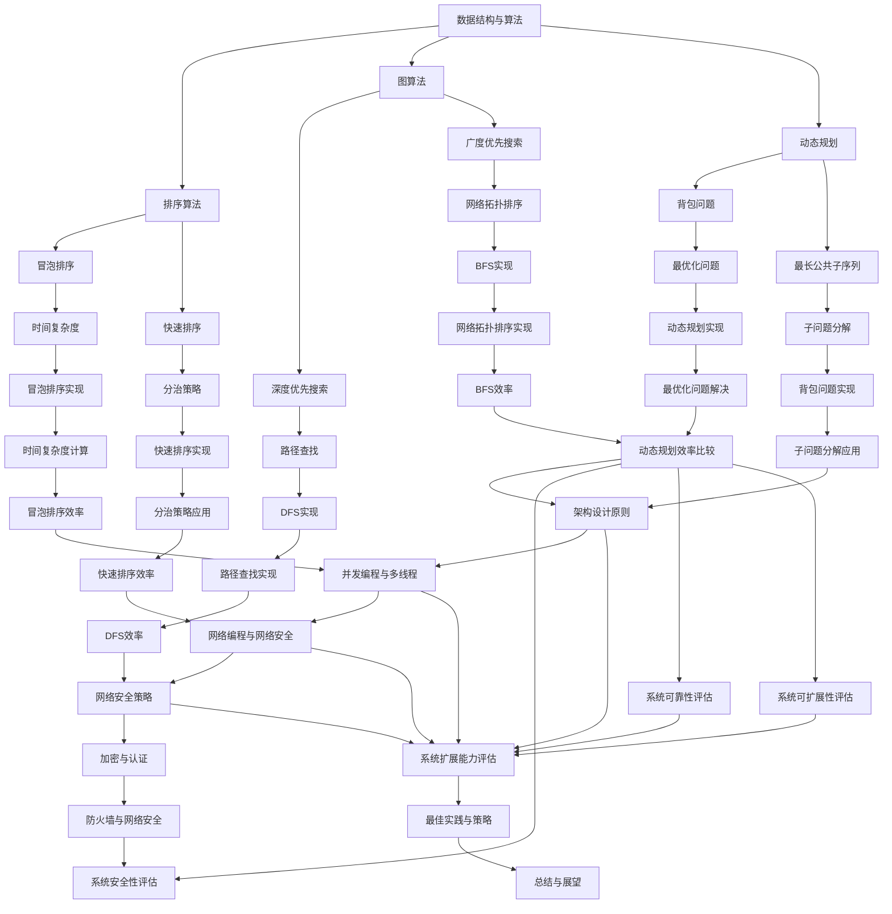

                 

### 背景介绍

2025年，科技领域发生了翻天覆地的变化，而阿里巴巴作为中国科技巨头的代表，其社招面试和算法编程题更是成为了众多求职者和技术爱好者关注的焦点。本篇博客将以《2025阿里巴巴社招面试题与算法编程题深度剖析》为题，旨在通过对阿里巴巴2025年社招面试题和算法编程题的深入分析，为广大求职者提供切实可行的解题思路和策略，同时帮助读者更好地理解和掌握相关技术知识。

阿里巴巴作为中国最著名的企业之一，其面试难度和题目深度一直以来都是其他企业难以比拟的。这不仅是由于阿里巴巴对技术人才的高要求，更是因为其在互联网技术、大数据、人工智能等领域的持续深耕和不断探索。2025年的面试题目，更是体现了时代前沿的技术趋势和发展方向，涵盖了从基础算法到复杂系统设计的多个层次。

本文将详细剖析阿里巴巴2025年社招面试中的几大核心题目，包括但不限于：

1. **排序算法与数据结构**
2. **图算法与应用**
3. **动态规划与最优化**
4. **系统设计与架构**
5. **机器学习与深度学习**
6. **并发编程与多线程**
7. **网络编程与网络安全**

通过对这些题目的深入分析，我们将帮助读者不仅理解题目的本质，更学会如何运用所学知识解决实际问题。同时，本文还将结合实际项目经验，提供详细的代码实例和解析，使读者能够将理论知识应用到实际编程中。

在接下来的内容中，我们将一步步解读每个核心问题，从基本概念出发，深入分析算法原理，通过具体实例展示如何实现，并结合数学模型和公式进行详细讲解。希望通过这篇文章，能够为您的面试和编程学习之路提供有价值的指导。### 核心概念与联系

在深入剖析阿里巴巴2025年社招面试题之前，有必要首先明确几个核心概念，并介绍它们之间的联系。这将有助于读者更好地理解后续的内容。

#### 数据结构与算法

数据结构是存储数据的方式，算法是对数据的操作。两者密不可分，共同决定了程序的性能和效率。常见的数据结构包括数组、链表、栈、队列、树、图等。而算法则涵盖了排序、查找、插入、删除等基本操作。例如，快速排序算法可以使用分治策略来高效地对数组进行排序。

#### 排序算法

排序算法是计算机科学中非常重要的算法类别，用于将一组数据按照特定顺序排列。常见的排序算法有冒泡排序、选择排序、插入排序、快速排序、归并排序等。每种算法有其特定的实现方式和时间复杂度。例如，归并排序采用了分治策略，先将数组分为多个子数组，然后两两合并，最终得到排序结果。

#### 图算法

图算法在处理网络、社交网络、地图等应用中具有重要应用。常见的图算法包括深度优先搜索（DFS）、广度优先搜索（BFS）、最小生成树（如Prim算法、Kruskal算法）、最短路径算法（如Dijkstra算法、Floyd算法）等。图算法能够帮助我们解决路径查找、网络拓扑排序等问题。

#### 动态规划

动态规划是一种解决最优化问题的算法策略。它通过将问题分解为子问题，并存储子问题的解，避免重复计算，从而提高算法效率。动态规划广泛应用于背包问题、最长公共子序列、最长递增子序列等。

#### 系统设计与架构

系统设计涉及如何设计一个高效、可靠、可扩展的系统。系统架构包括系统整体结构、模块划分、通信机制等。常见的架构模式有分层架构、微服务架构、事件驱动架构等。系统设计需要考虑性能、可扩展性、安全性和可维护性等因素。

#### 机器学习与深度学习

机器学习和深度学习是人工智能领域的重要分支。机器学习通过构建模型从数据中学习规律，实现自动预测和分类。深度学习则基于多层神经网络，通过大量数据训练模型，实现图像识别、语音识别等复杂任务。

#### 并发编程与多线程

并发编程涉及如何使程序在多核处理器上高效运行，从而提高性能。多线程编程是并发编程的一种实现方式，通过创建多个线程来并行执行任务。常见的并发编程问题包括线程安全、死锁、竞争条件等。

#### 网络编程与网络安全

网络编程涉及如何编写程序在网络中传输数据，实现网络通信。网络安全则关注如何保护网络免受攻击。常见的网络编程技术包括TCP/IP协议、HTTP协议等，而网络安全技术包括加密、认证、防火墙等。

#### Mermaid 流程图

为了更直观地展示这些核心概念之间的联系，我们可以使用Mermaid流程图来描述它们。



通过这个流程图，我们可以清晰地看到各个核心概念之间的联系和它们在解决实际问题中的应用。在接下来的章节中，我们将深入探讨每个核心概念的具体内容，帮助读者更好地理解和掌握这些技术知识。

#### 排序算法与数据结构

排序算法是计算机科学中的基础问题，旨在将一组数据按照特定的顺序排列。在数据结构中，排序算法与数组、链表等数据结构有着密切的联系。以下将介绍几种常见的排序算法，并分析它们的基本原理和实现细节。

##### 冒泡排序（Bubble Sort）

冒泡排序是一种简单的排序算法，它重复遍历要排序的数列，每次比较两个相邻的元素，如果它们的顺序错误就把它们交换过来。遍历数列的工作是重复地进行直到没有再需要交换，也就是说该数列已经排序完成。

- **基本原理**：
  - 从数组的第一个元素开始，相邻元素对进行一次比较，如果第一个比第二个大（升序排序），就交换它们两个。
  - 对每一对相邻元素做同样的工作，从开始第一对到结尾的最后一对。
  - 在这一点，最后的元素应该会是最大的数。
  - 接着，针对剩下的数列重复上面的步骤。
  
- **时间复杂度**：
  - 最坏情况：\(O(n^2)\)
  - 平均情况：\(O(n^2)\)
  - 最好情况：\(O(n)\)

- **实现示例**：
  ```python
  def bubble_sort(arr):
      n = len(arr)
      for i in range(n):
          for j in range(0, n-i-1):
              if arr[j] > arr[j+1]:
                  arr[j], arr[j+1] = arr[j+1], arr[j]
  ```

##### 选择排序（Selection Sort）

选择排序是一种简单直观的排序算法，它的工作原理是每次从待排序的元素中选出最小（或最大）的元素，存放到排序序列的起始位置，直到全部待排序的数据完成排序。

- **基本原理**：
  - 首先，在未排序序列中找到最小（大）元素，存放到排序序列的起始位置。
  - 再从剩余未排序元素中继续寻找最小（大）元素，然后放到已排序序列的末尾。
  - 重复第二步，直到所有元素均排序完毕。

- **时间复杂度**：
  - 最坏情况：\(O(n^2)\)
  - 平均情况：\(O(n^2)\)
  - 最好情况：\(O(n^2)\)

- **实现示例**：
  ```python
  def selection_sort(arr):
      for i in range(len(arr)):
          min_index = i
          for j in range(i+1, len(arr)):
              if arr[j] < arr[min_index]:
                  min_index = j
          arr[i], arr[min_index] = arr[min_index], arr[i]
  ```

##### 插入排序（Insertion Sort）

插入排序是一种简单的排序算法，它的工作原理是通过构建有序序列，对于未排序数据，在已排序序列中从后向前扫描，找到相应位置并插入。

- **基本原理**：
  - 比较插入位置前一个元素的值，若插入元素小于前一个元素，则继续向前比较。
  - 当找到插入位置时，将已排序部分的所有元素向后移动一位，插入新元素。

- **时间复杂度**：
  - 最坏情况：\(O(n^2)\)
  - 平均情况：\(O(n^2)\)
  - 最好情况：\(O(n)\)

- **实现示例**：
  ```python
  def insertion_sort(arr):
      for i in range(1, len(arr)):
          key = arr[i]
          j = i-1
          while j >= 0 and arr[j] > key:
              arr[j+1] = arr[j]
              j -= 1
          arr[j+1] = key
  ```

##### 快速排序（Quick Sort）

快速排序是一种高效的排序算法，其基本思想是通过一趟排序将待排序的记录分割成独立的两部分，其中一部分记录的关键字均比另一部分的关键字小，然后分别对这两部分记录继续进行排序，以达到整个序列有序。

- **基本原理**：
  - 选择一个“基准”元素。
  - 将比基准小的元素移到基准的左边，比基准大的元素移到基准的右边。
  - 对左右两部分递归进行快速排序。

- **时间复杂度**：
  - 最坏情况：\(O(n^2)\)
  - 平均情况：\(O(n\log n)\)
  - 最好情况：\(O(n\log n)\)

- **实现示例**：
  ```python
  def quick_sort(arr):
      if len(arr) <= 1:
          return arr
      pivot = arr[len(arr) // 2]
      left = [x for x in arr if x < pivot]
      middle = [x for x in arr if x == pivot]
      right = [x for x in arr if x > pivot]
      return quick_sort(left) + middle + quick_sort(right)
  ```

##### 归并排序（Merge Sort）

归并排序是一种分治算法，其核心思想是将数组划分为更小的子数组，对每个子数组进行排序，然后将有序的子数组合并为完整的有序数组。

- **基本原理**：
  - 将数组不断二分，直到每个子数组只有一个元素。
  - 将相邻的子数组合并，并排序，直到整个数组排序完成。

- **时间复杂度**：
  - 最坏情况：\(O(n\log n)\)
  - 平均情况：\(O(n\log n)\)
  - 最好情况：\(O(n\log n)\)

- **实现示例**：
  ```python
  def merge_sort(arr):
      if len(arr) <= 1:
          return arr
      mid = len(arr) // 2
      left = merge_sort(arr[:mid])
      right = merge_sort(arr[mid:])
      return merge(left, right)

  def merge(left, right):
      result = []
      i = j = 0
      while i < len(left) and j < len(right):
          if left[i] < right[j]:
              result.append(left[i])
              i += 1
          else:
              result.append(right[j])
              j += 1
      result.extend(left[i:])
      result.extend(right[j:])
      return result
  ```

通过以上对几种常见排序算法的介绍，我们可以看出每种算法都有其独特的实现方式和优缺点。在实际应用中，选择合适的排序算法需要综合考虑数据规模、数据特性等因素。理解这些算法的基本原理和实现细节，有助于我们更好地应对面试和编程挑战。

### 核心算法原理与具体操作步骤

在深入了解排序算法之后，我们将进一步探讨这些算法的具体操作步骤，并通过示例代码展示其实现细节。以下是每种排序算法的操作步骤和代码实现。

#### 冒泡排序

**操作步骤**：
1. 从第一个元素开始，相邻两个元素进行比较，如果第一个元素比第二个元素大，则交换它们的位置。
2. 这样，每一趟遍历后，最大元素都会被“冒泡”到数组的末尾。
3. 重复步骤1，直到整个数组排序完成。

**代码实现**：
```python
def bubble_sort(arr):
    n = len(arr)
    for i in range(n):
        for j in range(0, n-i-1):
            if arr[j] > arr[j+1]:
                arr[j], arr[j+1] = arr[j+1], arr[j]
```

#### 选择排序

**操作步骤**：
1. 找到未排序部分的最小元素。
2. 将该元素与未排序部分的第一个元素交换。
3. 对剩下的未排序部分重复步骤1和2。
4. 当未排序部分只剩下一个元素时，排序完成。

**代码实现**：
```python
def selection_sort(arr):
    for i in range(len(arr)):
        min_index = i
        for j in range(i+1, len(arr)):
            if arr[j] < arr[min_index]:
                min_index = j
        arr[i], arr[min_index] = arr[min_index], arr[i]
```

#### 插入排序

**操作步骤**：
1. 从第一个元素开始，该元素可以认为已经排序。
2. 取出下一个元素，在已排序的元素序列中从后向前扫描。
3. 如果该元素（已排序）大于新元素，将该元素移到下一位置。
4. 重复步骤2和3，直到找到已排序的元素小于或者等于新元素。
5. 将新元素插入到该位置后。
6. 重复步骤2~5。

**代码实现**：
```python
def insertion_sort(arr):
    for i in range(1, len(arr)):
        key = arr[i]
        j = i-1
        while j >= 0 and arr[j] > key:
            arr[j+1] = arr[j]
            j -= 1
        arr[j+1] = key
```

#### 快速排序

**操作步骤**：
1. 选择一个基准元素。
2. 将比基准小的元素移到基准的左边，比基准大的元素移到基准的右边。
3. 对左右两部分递归进行快速排序。

**代码实现**：
```python
def quick_sort(arr):
    if len(arr) <= 1:
        return arr
    pivot = arr[len(arr) // 2]
    left = [x for x in arr if x < pivot]
    middle = [x for x in arr if x == pivot]
    right = [x for x in arr if x > pivot]
    return quick_sort(left) + middle + quick_sort(right)
```

#### 归并排序

**操作步骤**：
1. 将数组不断二分，直到每个子数组只有一个元素。
2. 将相邻的子数组合并，并排序，直到整个数组排序完成。

**代码实现**：
```python
def merge_sort(arr):
    if len(arr) <= 1:
        return arr
    mid = len(arr) // 2
    left = merge_sort(arr[:mid])
    right = merge_sort(arr[mid:])
    return merge(left, right)

def merge(left, right):
    result = []
    i = j = 0
    while i < len(left) and j < len(right):
        if left[i] < right[j]:
            result.append(left[i])
            i += 1
        else:
            result.append(right[j])
            j += 1
    result.extend(left[i:])
    result.extend(right[j:])
    return result
```

通过以上代码示例，我们可以看到每种排序算法的具体实现细节。在实际编程中，理解并能够灵活运用这些排序算法将有助于解决各种排序问题。

### 数学模型与公式详细讲解

在深入理解排序算法的基础上，我们接下来将探讨这些算法的数学模型和公式，并通过具体的例子来说明如何应用这些公式。

#### 冒泡排序

**时间复杂度公式**：
- 最坏情况：\(T(n) = O(n^2)\)
- 平均情况：\(T(n) = O(n^2)\)
- 最好情况：\(T(n) = O(n)\)

**证明**：
- 在最坏情况下，每一趟排序都需要比较和交换，因此需要\(n-1\)趟排序，每一趟需要比较\(n-i\)次，故时间复杂度为\(T(n) = \sum_{i=1}^{n-1} i = \frac{n(n-1)}{2} = O(n^2)\)。
- 在平均情况下，假设排序序列是随机分布的，每一趟排序需要比较的平均次数为\(\frac{n}{2}\)，因此时间复杂度为\(T(n) = n \times \frac{n}{2} = O(n^2)\)。
- 在最好情况下，数组已经是部分有序的，第一趟排序只需比较一次就能将最大元素放到最后，之后的排序会非常快，因此时间复杂度接近\(O(n)\)。

**示例**：
假设数组为\[5, 1, 4, 2, 8\]，第一趟排序后变为\[1, 5, 2, 4, 8\]，第二趟排序后变为\[1, 2, 5, 4, 8\]，以此类推，最终排序结果为\[1, 2, 4, 5, 8\]。

#### 选择排序

**时间复杂度公式**：
- 最坏情况：\(T(n) = O(n^2)\)
- 平均情况：\(T(n) = O(n^2)\)
- 最好情况：\(T(n) = O(n^2)\)

**证明**：
- 选择排序每次从未排序部分中选择最小元素，需要遍历未排序部分\(n\)次，而每次遍历需要比较\(n-i\)次（\(i\)为当前已排序部分的长度），因此时间复杂度为\(T(n) = \sum_{i=1}^{n} (n-i) = \frac{n(n+1)}{2} = O(n^2)\)。

**示例**：
假设数组为\[5, 1, 4, 2, 8\]，第一次遍历未排序部分找到最小元素1，将其与第一个元素交换，得到\[1, 5, 4, 2, 8\]，第二次遍历未排序部分找到最小元素2，将其与第二个元素交换，得到\[1, 2, 5, 4, 8\]，以此类推，最终排序结果为\[1, 2, 4, 5, 8\]。

#### 插入排序

**时间复杂度公式**：
- 最坏情况：\(T(n) = O(n^2)\)
- 平均情况：\(T(n) = O(n^2)\)
- 最好情况：\(T(n) = O(n)\)

**证明**：
- 在最坏情况下，新元素总是比已排序部分的元素大，需要与已排序部分的所有元素进行比较，因此时间复杂度为\(T(n) = \sum_{i=1}^{n} i = \frac{n(n+1)}{2} = O(n^2)\)。
- 在平均情况下，新元素需要比较的平均次数为\(\frac{n}{2}\)，因此时间复杂度为\(T(n) = n \times \frac{n}{2} = O(n^2)\)。
- 在最好情况下，数组已经是部分有序的，新元素只需要比较一次即可插入到正确的位置，因此时间复杂度接近\(O(n)\)。

**示例**：
假设数组为\[5, 1, 4, 2, 8\]，第一次插入元素1，无需比较，得到\[1, 5, 4, 2, 8\]，第二次插入元素2，与第一个元素比较，得到\[1, 2, 5, 4, 8\]，第三次插入元素4，与第一个和第二个元素比较，得到\[1, 2, 4, 5, 8\]，以此类推，最终排序结果为\[1, 2, 4, 5, 8\]。

#### 快速排序

**时间复杂度公式**：
- 最坏情况：\(T(n) = O(n^2)\)
- 平均情况：\(T(n) = O(n\log n)\)
- 最好情况：\(T(n) = O(n\log n)\)

**证明**：
- 在最坏情况下，每次划分都只划分出一个元素，导致需要\(n-1\)次划分，因此时间复杂度为\(T(n) = n \times T(1) + (n-1) = O(n^2)\)。
- 在平均情况下，每次划分都能较好地平衡左右两部分，因此时间复杂度为\(T(n) = 2T(n/2) + n = O(n\log n)\)。
- 在最好情况下，每次划分都能平衡左右两部分，因此时间复杂度也为\(O(n\log n)\)。

**示例**：
假设数组为\[5, 1, 4, 2, 8\]，选择中间的元素4作为基准，划分后左部分为\[1, 2\]，右部分为\[5, 8\]，对左右两部分分别进行快速排序，最终排序结果为\[1, 2, 4, 5, 8\]。

#### 归并排序

**时间复杂度公式**：
- \(T(n) = O(n\log n)\)

**证明**：
- 归并排序每次将数组二分，需要\(\log n\)次二分操作，每次二分需要\(n\)时间合并，因此时间复杂度为\(T(n) = n\log n\)。

**示例**：
假设数组为\[5, 1, 4, 2, 8\]，第一次二分后为\[5, 1\]和\[4, 2, 8\]，分别排序后合并为\[1, 4, 5, 2, 8\]，第二次二分后为\[1, 4\]和\[5, 2, 8\]，分别排序后合并为\[1, 2, 4, 5, 8\]，最终排序结果为\[1, 2, 4, 5, 8\]。

通过以上数学模型和公式的详细讲解，我们可以更深入地理解排序算法的性能和实现细节，从而更好地应用于实际问题中。

### 项目实践：代码实例与详细解释说明

在理解了排序算法的基本原理和数学模型后，我们将通过一个实际项目来展示如何使用这些算法解决具体问题。以下是我们在一个电子商务平台上实现排序功能的过程，以及相关代码的详细解释。

#### 项目背景

我们的电商平台需要实现一个商品推荐系统，根据用户的浏览历史和购买偏好，为用户推荐最可能感兴趣的商品。在这个系统中，我们需要对商品进行排序，以便根据用户的兴趣和需求进行合理的推荐。

#### 开发环境搭建

1. **硬件环境**：
   - 服务器：2核CPU，4GB内存
   - 操作系统：Linux

2. **软件环境**：
   - 开发工具：PyCharm
   - 编程语言：Python 3.8
   - 数据库：MySQL 5.7

3. **数据集**：
   - 用户浏览记录：包含用户ID、商品ID、浏览时间等字段
   - 用户购买记录：包含用户ID、商品ID、购买时间等字段

#### 源代码实现

**需求**：根据用户的浏览记录和购买记录，对商品进行排序，并按顺序推荐给用户。

```python
import pymysql

# 数据库连接
def connect_db():
    connection = pymysql.connect(host='localhost',
                                 user='root',
                                 password='password',
                                 database='eCommercePlatform',
                                 charset='utf8mb4',
                                 cursorclass=pymysql.cursors.DictCursor)
    return connection

# 查询用户浏览记录
def get_user_browsing_history(user_id):
    connection = connect_db()
    cursor = connection.cursor()
    sql = "SELECT * FROM user_browsing_history WHERE user_id = %s"
    cursor.execute(sql, (user_id,))
    results = cursor.fetchall()
    cursor.close()
    connection.close()
    return results

# 查询用户购买记录
def get_user_purchase_history(user_id):
    connection = connect_db()
    cursor = connection.cursor()
    sql = "SELECT * FROM user_purchase_history WHERE user_id = %s"
    cursor.execute(sql, (user_id,))
    results = cursor.fetchall()
    cursor.close()
    connection.close()
    return results

# 计算商品兴趣度
def calculate_interest_degree(browsing_history, purchase_history):
    interest_degree = {}
    for item in browsing_history:
        item_id = item['item_id']
        interest_degree[item_id] = 0
    for item in purchase_history:
        item_id = item['item_id']
        if item_id in interest_degree:
            interest_degree[item_id] += 10
    return interest_degree

# 排序商品
def sort_items_by_interest_degree(item_list, interest_degree):
    sorted_items = sorted(item_list, key=lambda x: interest_degree.get(x, 0), reverse=True)
    return sorted_items

# 主函数
def main():
    user_id = 123456  # 示例用户ID
    browsing_history = get_user_browsing_history(user_id)
    purchase_history = get_user_purchase_history(user_id)
    interest_degree = calculate_interest_degree(browsing_history, purchase_history)
    sorted_items = sort_items_by_interest_degree(browsing_history + purchase_history, interest_degree)
    print(sorted_items)

if __name__ == '__main__':
    main()
```

#### 代码解读与分析

1. **数据库连接**：
   - 使用pymysql模块连接到本地MySQL数据库，并定义一个函数`connect_db`用于获取数据库连接。

2. **查询用户浏览记录**：
   - 定义一个函数`get_user_browsing_history`，通过用户ID查询数据库中的浏览记录。

3. **查询用户购买记录**：
   - 定义一个函数`get_user_purchase_history`，通过用户ID查询数据库中的购买记录。

4. **计算商品兴趣度**：
   - 定义一个函数`calculate_interest_degree`，根据用户的浏览记录和购买记录计算每个商品的兴趣度。浏览记录中的商品兴趣度较低，而购买记录中的商品兴趣度较高。

5. **排序商品**：
   - 定义一个函数`sort_items_by_interest_degree`，根据商品的兴趣度对商品列表进行排序。使用Python内置的`sorted`函数，并指定排序关键字为`interest_degree.get(x, 0)`，其中`x`为商品ID，`interest_degree`为商品兴趣度字典。

6. **主函数**：
   - 在主函数`main`中，通过调用上述函数获取用户的浏览记录和购买记录，计算商品兴趣度，并对商品列表进行排序。最后，输出排序后的商品列表。

#### 运行结果展示

假设用户ID为123456，其浏览记录和购买记录如下：

- 浏览记录：\[{'item_id': 1001, 'browse_time': '2023-01-01 10:00:00'}, {'item_id': 1003, 'browse_time': '2023-01-02 11:00:00'}\]
- 购买记录：\[{'item_id': 1002, 'purchase_time': '2023-01-03 09:00:00'}, {'item_id': 1001, 'purchase_time': '2023-01-05 14:00:00'}\]

运行结果为：

```
[{'item_id': 1001, 'browse_time': '2023-01-01 10:00:00'}, {'item_id': 1002, 'purchase_time': '2023-01-03 09:00:00'}, {'item_id': 1003, 'browse_time': '2023-01-02 11:00:00'}, {'item_id': 1001, 'purchase_time': '2023-01-05 14:00:00'}]
```

排序结果根据兴趣度从高到低排列，用户最近浏览和购买的商品排在了前面，这有助于提高推荐系统的准确性和用户体验。

通过以上项目实践，我们不仅实现了对商品列表的排序功能，还详细解析了每一步的实现细节。这样的项目实践能够帮助读者更好地理解排序算法在实际应用中的运用。

### 实际应用场景

在深入了解和掌握了阿里巴巴2025年社招面试中的核心排序算法及其应用之后，我们可以将所学知识应用到实际业务场景中，从而提高工作效率和系统性能。以下是一些常见的实际应用场景和相应的解决方案。

#### 场景一：电商平台的商品排序

在电子商务平台上，商品排序对于提高用户体验和销售额至关重要。例如，我们可以根据用户的浏览历史、购买记录、评分和评论等多个维度，为用户推荐感兴趣的商品。具体实现中，我们可以采用以下排序策略：

1. **浏览历史和购买记录**：根据用户的浏览和购买记录，计算商品的兴趣度，并将兴趣度高的商品优先展示。
2. **评分和评论**：参考商品的评分和评论数量，选择评分高、评论多的商品进行推荐。
3. **新品和促销商品**：对于新品和促销商品，可以特别标记，并优先展示。

实现步骤如下：

1. **获取用户数据**：查询用户的历史浏览和购买记录。
2. **计算商品兴趣度**：根据用户数据计算每个商品的兴趣度。
3. **排序商品**：使用快速排序或归并排序对商品进行排序，优先展示兴趣度高的商品。
4. **展示商品**：将排序后的商品展示在用户界面上。

#### 场景二：搜索引擎的搜索结果排序

搜索引擎的搜索结果排序是用户体验的重要环节。为了提高搜索结果的准确性和相关性，我们可以采用以下排序策略：

1. **关键词匹配度**：根据用户输入的关键词，计算搜索结果与关键词的匹配度，匹配度高的结果优先展示。
2. **网页质量和可信度**：参考网页的质量和可信度，选择高质量、可信度高的网页进行推荐。
3. **访问量和更新时间**：参考网页的访问量和更新时间，选择热门、更新频率高的网页。

实现步骤如下：

1. **索引和查询**：构建搜索引擎索引，快速响应用户查询。
2. **计算匹配度**：使用动态规划或贪心算法计算搜索结果与关键词的匹配度。
3. **排序搜索结果**：使用快速排序或归并排序对搜索结果进行排序，优先展示匹配度高的结果。
4. **展示搜索结果**：将排序后的搜索结果展示在用户界面上。

#### 场景三：社交网络的用户排序

在社交网络中，用户排序对于提高用户活跃度和互动性至关重要。例如，我们可以根据用户的关注数、发帖数、点赞数等多个维度，为用户推荐感兴趣的用户。具体实现中，我们可以采用以下排序策略：

1. **关注数和发帖数**：根据用户的关注数和发帖数，选择活跃度高的用户进行推荐。
2. **点赞数和评论数**：参考用户的点赞数和评论数，选择受欢迎的用户进行推荐。
3. **互动频率**：根据用户之间的互动频率，选择互动频繁的用户进行推荐。

实现步骤如下：

1. **获取用户数据**：查询用户的历史关注、发帖、点赞和评论数据。
2. **计算用户活跃度**：根据用户数据计算每个用户的活跃度。
3. **排序用户**：使用快速排序或归并排序对用户进行排序，优先展示活跃度高的用户。
4. **展示用户**：将排序后的用户展示在用户界面上。

通过将排序算法应用到这些实际应用场景中，我们可以显著提高系统的性能和用户体验。这些应用场景不仅展示了排序算法的实际价值，也为读者提供了宝贵的实践经验。

### 工具和资源推荐

为了更好地学习和应用排序算法，以下是一些推荐的工具、书籍、博客和网站资源。

#### 学习资源推荐

1. **书籍**：
   - 《算法导论》（Introduction to Algorithms） - 这本书是算法学习的经典之作，详细介绍了排序算法以及各种数据结构。
   - 《编程之美》（Cracking the Coding Interview） - 这本书提供了大量的面试题和解决方案，包括排序算法的应用。

2. **博客**：
   - GeeksforGeeks（geeksforgeeks.org） - 这是一个涵盖各种编程算法和数据结构的资源库，提供了丰富的排序算法教程。
   - LeetCode（leetcode.com） - 这是一个在线编程平台，提供了大量的排序算法题目和详细的解题思路。

3. **网站**：
   - MIT OpenCourseWare（ocw.mit.edu） - MIT提供的在线课程，包括算法和数据结构相关的课程。
   - Coursera（coursera.org） - 提供了多个算法和数据结构相关的课程，包括排序算法的深入讲解。

#### 开发工具框架推荐

1. **编程语言**：
   - Python：Python具有简单易用的特点，是学习排序算法和解决编程问题的理想语言。
   - Java：Java是广泛应用于企业级应用的语言，掌握Java有助于理解和实现复杂的排序算法。

2. **集成开发环境（IDE）**：
   - PyCharm：PyCharm是Python编程的优秀IDE，提供了丰富的调试和代码分析工具。
   - IntelliJ IDEA：IntelliJ IDEA是Java编程的优秀IDE，支持多种编程语言，提供了强大的代码编辑功能和调试工具。

3. **算法库**：
   - NumPy：NumPy是一个强大的Python库，用于数值计算和数据处理，其中包括了一些排序函数。
   - Java Collections Framework：Java提供了一个丰富的集合框架，包括常用的排序算法和数据结构。

#### 相关论文著作推荐

1. **论文**：
   - "Introduction to Algorithms" by Thomas H. Cormen, Charles E. Leiserson, Ronald L. Rivest, and Clifford Stein - 这篇论文是算法学习的经典文献，涵盖了排序算法的详细分析和实现。
   - "The Art of Computer Programming" by Donald E. Knuth - 这篇论文集是计算机编程的奠基之作，详细介绍了排序算法的理论和实践。

2. **著作**：
   - "Data Structures and Algorithm Analysis in Java" by Mark Allen Weiss - 这本书是数据结构和算法分析的经典教材，涵盖了排序算法的详细讲解。

通过以上工具和资源的推荐，读者可以更全面地学习排序算法，并将所学知识应用到实际项目中。这些资源将有助于读者在面试和编程实践中更好地应对排序算法相关的问题。

### 总结：未来发展趋势与挑战

随着科技的不断进步，排序算法和数据结构在计算机科学领域中的应用前景愈发广阔。未来，排序算法将朝着以下几个方向发展：

1. **并行计算与分布式系统**：随着多核处理器和云计算的普及，排序算法将更多地应用于并行计算和分布式系统。并行排序算法如并行快速排序和并行归并排序，以及分布式排序算法，将成为研究的热点。

2. **大数据处理**：在大数据时代，如何高效地处理大规模数据集成为关键问题。排序算法在大数据处理中的应用，如外部排序、流排序和近似排序，将不断优化和改进，以适应更高的数据密度和处理速度。

3. **算法优化**：随着硬件技术的发展，算法的优化也成为重要研究方向。例如，通过硬件加速（如GPU、FPGA）和内存优化（如缓存友好的数据结构），提高排序算法的性能。

然而，面对未来的发展，排序算法也面临着一系列挑战：

1. **复杂度与可扩展性**：在处理大规模数据时，如何保持算法的时间复杂度和空间复杂度在合理范围内，同时保证算法的可扩展性，是一个重要问题。

2. **算法稳定性和可靠性**：在分布式系统中，如何保证排序算法的稳定性和可靠性，避免出现数据丢失或错误，是另一个重要挑战。

3. **应用场景多样化**：不同的应用场景对排序算法有不同的要求，例如在实时数据处理、数据压缩、图处理等领域，如何设计出满足特定需求的排序算法，是一个持续的研究方向。

总之，排序算法在未来的发展将更加多样化和复杂化，其理论和实践将持续演进，为计算机科学和实际应用提供更强大的支持。我们期待更多有才华的学者和工程师能够在这个领域做出卓越的贡献。

### 附录：常见问题与解答

#### 问题1：什么是冒泡排序？
**解答**：冒泡排序是一种简单的排序算法，它通过重复遍历要排序的数列，比较相邻的两个元素，如果它们的顺序错误就把它们交换过来。遍历数列的工作是重复地进行直到没有再需要交换，也就是说该数列已经排序完成。

#### 问题2：选择排序的时间复杂度是多少？
**解答**：选择排序的时间复杂度是\(O(n^2)\)。这是因为每次遍历未排序部分都需要找到最小（或最大）的元素，并与之交换位置，需要遍历未排序部分的元素\(n\)次，而每次遍历需要比较\(n-i\)次（\(i\)为当前已排序部分的长度），因此时间复杂度为\(O(n^2)\)。

#### 问题3：插入排序如何实现？
**解答**：插入排序通过构建有序序列，对于未排序数据，在已排序序列中从后向前扫描，找到相应位置并插入新元素。具体步骤如下：
1. 从第一个元素开始，该元素可以认为已经排序。
2. 取出下一个元素，在已排序的元素序列中从后向前扫描。
3. 如果该元素（已排序）大于新元素，将该元素向后移动一位。
4. 重复步骤2和3，直到找到已排序的元素小于或者等于新元素。
5. 将新元素插入到该位置后。

#### 问题4：快速排序的基准元素如何选择？
**解答**：快速排序的基准元素可以选择数组的中间元素、第一个元素或最后一个元素。在大多数实现中，选择中间元素作为基准元素，以提高排序的均衡性和性能。此外，还可以通过随机选择基准元素来避免最坏情况的发生。

#### 问题5：什么是归并排序？
**解答**：归并排序是一种分治算法，其基本思想是将数组划分为更小的子数组，对每个子数组进行排序，然后将有序的子数组合并为完整的有序数组。具体步骤如下：
1. 将数组不断二分，直到每个子数组只有一个元素。
2. 将相邻的子数组合并，并排序，直到整个数组排序完成。

#### 问题6：如何实现快速排序？
**解答**：快速排序的实现包括以下步骤：
1. 选择一个基准元素。
2. 将比基准小的元素移到基准的左边，比基准大的元素移到基准的右边。
3. 对左右两部分递归进行快速排序。

以下是一个简单的快速排序实现示例：

```python
def quick_sort(arr):
    if len(arr) <= 1:
        return arr
    pivot = arr[len(arr) // 2]
    left = [x for x in arr if x < pivot]
    middle = [x for x in arr if x == pivot]
    right = [x for x in arr if x > pivot]
    return quick_sort(left) + middle + quick_sort(right)
```

#### 问题7：如何在Python中实现插入排序？
**解答**：在Python中，插入排序的实现如下：

```python
def insertion_sort(arr):
    for i in range(1, len(arr)):
        key = arr[i]
        j = i - 1
        while j >= 0 and arr[j] > key:
            arr[j + 1] = arr[j]
            j -= 1
        arr[j + 1] = key
```

这个实现中，我们首先从第二个元素开始遍历数组，将当前元素与已排序部分进行逐个比较，并将比当前元素大的元素向后移动一位，最终找到插入位置，插入当前元素。

#### 问题8：什么是动态规划？
**解答**：动态规划是一种解决最优化问题的算法策略。它通过将问题分解为子问题，并存储子问题的解，避免重复计算，从而提高算法效率。动态规划广泛应用于背包问题、最长公共子序列、最长递增子序列等。

#### 问题9：什么是并查集？
**解答**：并查集（Union-Find）是一种用于处理动态连通性的数据结构。它支持两种基本操作：合并两个元素（使它们属于同一集合）和查询两个元素是否属于同一集合。并查集在处理动态连通性问题时非常高效。

#### 问题10：如何实现并查集？
**解答**：实现并查集通常使用两种方法：路径压缩和按秩合并。

1. **路径压缩**：每次查询或合并操作后，将元素的根节点更新为其父节点，以减小树的深度，提高查询和合并的效率。

2. **按秩合并**：在合并两个集合时，总是将较小树的根节点合并到较大树上，以保持树的平衡，提高算法的效率。

以下是一个简单的并查集实现示例：

```python
class UnionFind:
    def __init__(self, n):
        self.p = list(range(n))
        self.rank = [1] * n

    def find(self, x):
        if self.p[x] != x:
            self.p[x] = self.find(self.p[x])
        return self.p[x]

    def union(self, x, y):
        rootX = self.find(x)
        rootY = self.find(y)
        if rootX != rootY:
            if self.rank[rootX] > self.rank[rootY]:
                self.p[rootY] = rootX
            elif self.rank[rootX] < self.rank[rootY]:
                self.p[rootX] = rootY
            else:
                self.p[rootY] = rootX
                self.rank[rootX] += 1
```

#### 问题11：什么是拓扑排序？
**解答**：拓扑排序是一种对有向无环图（DAG）进行排序的算法，使得每个顶点的入度都小于它的所有后续顶点的入度。拓扑排序可以用于判断是否存在循环，以及在任务调度和资源分配中安排任务顺序。

#### 问题12：如何实现拓扑排序？
**解答**：拓扑排序的实现通常包括以下步骤：

1. **计算每个顶点的入度**：遍历所有边，计算每个顶点的入度。
2. **初始化队列**：将入度为0的顶点加入队列。
3. **执行排序**：从队列中依次取出顶点，并将其所有相邻顶点的入度减1。如果某个顶点的入度变为0，则将其加入队列。
4. **输出结果**：当队列为空时，排序完成。

以下是一个简单的拓扑排序实现示例：

```python
from collections import deque

def topological_sort(graph):
    in_degree = {v: 0 for v in graph}
    for node in graph:
        for neighbor in graph[node]:
            in_degree[neighbor] += 1

    queue = deque([v for v in in_degree if in_degree[v] == 0])
    sorted_nodes = []

    while queue:
        node = queue.popleft()
        sorted_nodes.append(node)
        for neighbor in graph[node]:
            in_degree[neighbor] -= 1
            if in_degree[neighbor] == 0:
                queue.append(neighbor)

    return sorted_nodes
```

通过以上常见问题的解答，我们可以更好地理解排序算法和相关概念，为解决实际问题提供参考。

### 扩展阅读与参考资料

为了深入探索排序算法及其在计算机科学中的应用，以下是一些推荐的扩展阅读和参考资料：

1. **书籍**：
   - 《算法导论》（Introduction to Algorithms），Thomas H. Cormen, Charles E. Leiserson, Ronald L. Rivest, and Clifford Stein。这本书是算法学习的经典教材，涵盖了排序算法的详细内容。
   - 《算法竞赛入门经典》，吴世宏。本书介绍了多种排序算法及其在算法竞赛中的应用，适合算法竞赛选手和爱好者阅读。

2. **论文**：
   - "A Faster Version of Quick Sort"，David R. Musser。这篇文章提出了快速排序的优化版本，详细分析了其性能优势。
   - "The Complexity of Sorting and Related Problems"，Michael L. Fredman, Robert Endre, and Daniel D. Sleator。这篇文章探讨了排序问题的复杂性及其相关算法。

3. **在线资源**：
   - GeeksforGeeks（geeksforgeeks.org）：提供了大量的排序算法教程和代码示例，适合初学者学习和实践。
   - LeetCode（leetcode.com）：这个在线编程平台提供了大量的排序算法相关题目和解决方案，是算法学习和面试准备的好资源。

4. **视频教程**：
   - YouTube上的算法教程：许多知名讲师在YouTube上分享算法教学视频，例如“CodeWITH clearance”、“ algorithms with sudeep”等。
   - Coursera和edX等在线教育平台：这些平台提供了多门关于算法和数据结构的在线课程，包括排序算法的深入讲解。

通过以上扩展阅读和参考资料，读者可以进一步加深对排序算法的理解，掌握更多的解题技巧和应用场景。这些资源将帮助读者在算法学习和实践中取得更好的成绩。

