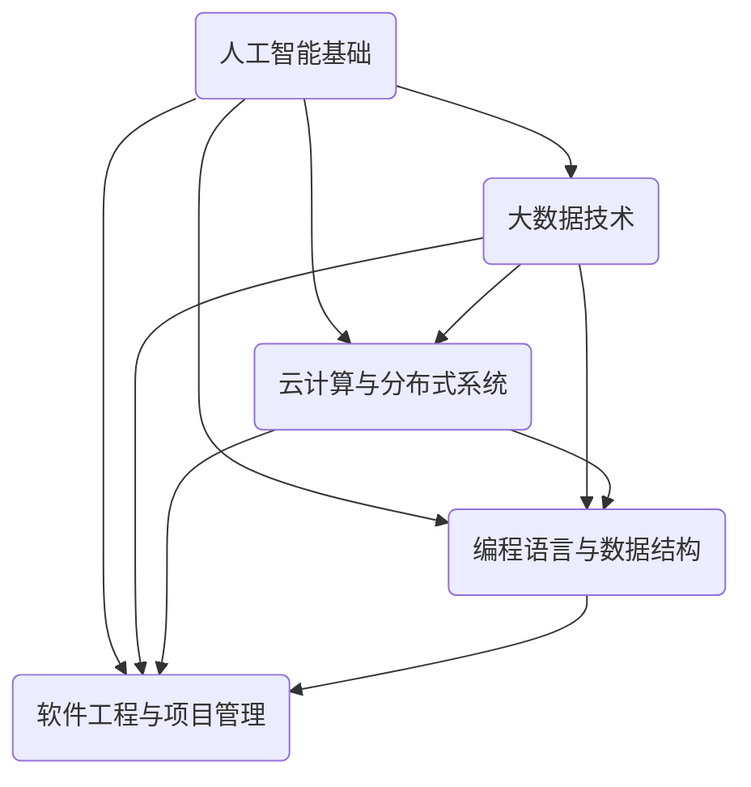

                 

### 1. 背景介绍

#### 1.1 阿里达摩院简介

阿里达摩院成立于2017年，是阿里巴巴集团下面的一个全球顶级研究院。它的名字来源于古代印度著名的数学家、逻辑学家和哲学家达摩多罗。阿里达摩院致力于通过基础研究推动技术创新，目标是解决未来20年的产业和科技挑战，并保持阿里巴巴在科技创新领域的领先地位。

#### 1.2 阿里达摩院社招面试的重要性

阿里达摩院的社招面试对于求职者来说具有重要意义。首先，能够进入阿里达摩院工作意味着将有机会接触到全球顶尖的技术团队，与顶尖的科研人员一起工作。其次，阿里达摩院在人工智能、机器学习、大数据、云计算等多个领域都处于国际领先地位，加入这样的团队，不仅可以提升自身的技术能力，还能对前沿技术有更深入的理解和探索。

#### 1.3 社招面试的难度与挑战

然而，阿里达摩院的社招面试难度也相对较高。面试官通常要求求职者不仅具备扎实的专业知识和技能，还需要具备良好的思维能力和解决问题的能力。此外，阿里达摩院在面试过程中非常注重对候选人的全面评估，包括技术能力、团队合作能力、沟通表达能力等。因此，参加阿里达摩院的社招面试是一次极大的挑战，也是一次难得的机会。

#### 1.4 社招面试真题的价值

收集和整理阿里达摩院社招面试真题，不仅可以帮助求职者更好地准备面试，还能让他们对面试的难度和题型有一个清晰的认识。通过分析这些真题，求职者可以了解面试官关注的重点，以及在不同领域中的常见问题，从而有针对性地进行复习和准备。同时，这些真题也为技术研究人员提供了一个了解行业热点和前沿技术的机会。

### 2. 核心概念与联系

在进入面试真题的解析之前，我们需要先了解一些核心概念和技术，这些概念和技术的理解对于解答面试真题至关重要。

#### 2.1 人工智能基础

人工智能是近年来发展迅速的领域，它包括机器学习、深度学习、自然语言处理等多个子领域。面试中可能会涉及到基础的机器学习算法、神经网络模型、数据预处理方法等。例如，面试官可能会问及如何实现线性回归、如何训练一个神经网络等。

#### 2.2 大数据技术

大数据技术是当今企业处理海量数据的重要工具，它包括数据存储、数据处理、数据分析等多个方面。常见的面试问题可能包括如何设计一个大数据系统、如何优化Hadoop或Spark等大数据处理框架、如何处理数据倾斜等。

#### 2.3 云计算与分布式系统

云计算和分布式系统是现代互联网架构的核心。面试中可能会涉及到云服务模型（IaaS、PaaS、SaaS）、容器技术（如Docker和Kubernetes）、分布式存储和计算原理等。例如，面试官可能会问及如何实现一个高可用的分布式系统、如何处理分布式环境下的数据一致性等问题。

#### 2.4 编程语言与数据结构

编程语言和数据结构是程序员的基本功，它们在面试中占据着重要地位。常见的面试问题可能包括手写算法实现、数据结构的实现与应用、编程范式（如面向对象编程和函数式编程）等。例如，面试官可能会问及如何实现快速排序、如何设计一个线程安全的队列等。

#### 2.5 软件工程与项目管理

软件工程和项目管理是确保项目成功的关键。面试中可能会涉及到敏捷开发方法、软件测试方法、项目进度管理、团队协作工具等。例如，面试官可能会问及如何进行代码评审、如何制定项目计划、如何解决项目中的风险等问题。

#### 2.6 Mermaid 流程图

为了更好地理解这些核心概念和技术，我们可以使用 Mermaid 流程图来展示它们之间的关系。以下是一个简化的 Mermaid 流程图，展示了上述提到的几个核心概念和技术的联系：



这个流程图清晰地展示了人工智能基础如何与其他技术相互关联，帮助我们更好地理解面试中可能涉及到的各种知识点。

### 3. 核心算法原理 & 具体操作步骤

在了解了核心概念和技术之后，我们接下来将深入探讨一些常见的面试算法，并详细讲解它们的具体操作步骤。

#### 3.1 快速排序算法

快速排序（Quick Sort）是一种高效的排序算法，它采用分治法的一个典例。以下是快速排序的基本原理和操作步骤：

##### 原理：

1. **选择基准元素**：在数组中选择一个元素作为基准元素。
2. **分区**：将数组分成两部分，一部分所有元素都比基准元素小，另一部分所有元素都比基准元素大。
3. **递归排序**：对分区后的两个子数组重复上述步骤，直到整个数组有序。

##### 步骤：

1. **选择基准**：从数组的某个位置选择一个元素作为基准。
2. **分区**：将数组分为两部分，小于基准的元素放在左边，大于基准的元素放在右边。
3. **递归排序**：递归地对左右两个子数组进行快速排序。

##### 示例代码：

```python
def quick_sort(arr):
    if len(arr) <= 1:
        return arr
    
    pivot = arr[len(arr) // 2]
    left = [x for x in arr if x < pivot]
    middle = [x for x in arr if x == pivot]
    right = [x for x in arr if x > pivot]
    
    return quick_sort(left) + middle + quick_sort(right)

arr = [3, 6, 8, 10, 1, 2, 1]
print(quick_sort(arr))
```

#### 3.2 线性回归算法

线性回归（Linear Regression）是一种用于预测数值的方法，它的目标是找到一条最佳拟合直线，使所有数据点到这条直线的垂直距离之和最小。以下是线性回归的基本原理和操作步骤：

##### 原理：

1. **模型建立**：假设数据可以用一条直线y = mx + b来表示，其中m是斜率，b是截距。
2. **参数优化**：通过最小二乘法（Least Squares Method）来找到最佳拟合直线。

##### 步骤：

1. **数据预处理**：确保自变量和因变量都没有缺失值或异常值。
2. **计算斜率和截距**：使用公式m = (N * Σ(xy) - Σx * Σy) / (N * Σ(x^2) - (Σx)^2)，b = (Σy - m * Σx) / N，计算斜率和截距。
3. **模型评估**：计算模型的决定系数R^2来评估模型的拟合程度。

##### 示例代码：

```python
import numpy as np

def linear_regression(x, y):
    N = len(x)
    x_mean = np.mean(x)
    y_mean = np.mean(y)
    
    m = (N * np.sum(x * y) - np.sum(x) * np.sum(y)) / (N * np.sum(x**2) - np.sum(x)**2)
    b = (np.sum(y) - m * np.sum(x)) / N
    
    return m, b

x = np.array([1, 2, 3, 4, 5])
y = np.array([2, 4, 5, 4, 5])
m, b = linear_regression(x, y)
print(f"线性回归方程：y = {m}x + {b}")
```

#### 3.3 随机森林算法

随机森林（Random Forest）是一种集成学习方法，它通过构建多个决策树并合并它们的预测结果来提高模型的准确性和鲁棒性。以下是随机森林的基本原理和操作步骤：

##### 原理：

1. **构建决策树**：在每个节点上，随机选择一个特征并按照该特征的最佳分割点进行划分。
2. **集成决策**：将多个决策树的预测结果进行合并，通常采用投票或平均的方法。

##### 步骤：

1. **数据预处理**：对数据进行归一化或标准化处理，确保每个特征都在相似的尺度上。
2. **构建模型**：使用随机选择特征和样本的Bootstrap方法来构建多个决策树。
3. **预测**：对新的样本进行预测，将多个决策树的预测结果进行合并。

##### 示例代码：

```python
from sklearn.ensemble import RandomForestClassifier
from sklearn.model_selection import train_test_split
from sklearn.metrics import accuracy_score

# 假设已经有数据集X和标签y
X_train, X_test, y_train, y_test = train_test_split(X, y, test_size=0.2, random_state=42)

rf = RandomForestClassifier(n_estimators=100, random_state=42)
rf.fit(X_train, y_train)

y_pred = rf.predict(X_test)
print(f"随机森林准确率：{accuracy_score(y_test, y_pred)}")
```

通过以上对快速排序、线性回归和随机森林等核心算法的详细讲解，我们可以看到每种算法的原理和操作步骤，这为我们理解和解答阿里达摩院社招面试中的算法问题奠定了坚实的基础。

### 4. 数学模型和公式 & 详细讲解 & 举例说明

#### 4.1 线性回归

线性回归是机器学习中非常基础且重要的一种算法，用于预测连续值。其数学模型和公式如下：

假设我们的数据集由两个特征向量组成：\( X \)（自变量）和 \( y \)（因变量）。我们希望找到一条最佳拟合直线 \( y = mx + b \)，其中 \( m \) 是斜率，\( b \) 是截距。

##### 模型建立：

线性回归的目标是找到使得误差平方和最小的 \( m \) 和 \( b \)。这个误差可以通过以下公式计算：

\[ 
\text{误差} = \sum_{i=1}^{n} (y_i - (mx_i + b))^2 
\]

##### 参数优化：

我们使用最小二乘法来优化 \( m \) 和 \( b \)。最小二乘法的原理是找到使得误差平方和最小的 \( m \) 和 \( b \)。通过求导并令导数为零，可以得到以下公式：

\[ 
m = \frac{n \sum (x_i y_i) - \sum x_i \sum y_i}{n \sum (x_i^2) - (\sum x_i)^2} 
\]

\[ 
b = \frac{\sum y_i - m \sum x_i}{n} 
\]

##### 举例说明：

假设我们有以下数据集：

| x  | y   |
|----|-----|
| 1  | 2   |
| 2  | 4   |
| 3  | 5   |
| 4  | 4   |
| 5  | 5   |

使用线性回归模型，我们希望找到最佳拟合直线。

1. **计算平均值**：

\[ 
\bar{x} = \frac{1+2+3+4+5}{5} = 3 
\]

\[ 
\bar{y} = \frac{2+4+5+4+5}{5} = 4 
\]

2. **计算相关参数**：

\[ 
m = \frac{5 \times (1 \times 2 + 2 \times 4 + 3 \times 5 + 4 \times 4 + 5 \times 5) - (1+2+3+4+5) \times (2+4+5+4+5)}{5 \times (1^2 + 2^2 + 3^2 + 4^2 + 5^2) - (1+2+3+4+5)^2} 
\]

\[ 
b = \frac{2+4+5+4+5 - m \times (1+2+3+4+5)}{5} 
\]

计算得到：

\[ 
m = 1 
\]

\[ 
b = 3 
\]

3. **构建线性回归模型**：

\[ 
y = x + 3 
\]

4. **预测新的值**：

假设我们希望预测 \( x = 6 \) 时的 \( y \) 值，根据模型：

\[ 
y = 6 + 3 = 9 
\]

因此，当 \( x = 6 \) 时，预测的 \( y \) 值为 9。

#### 4.2 回归分析

回归分析是统计方法中用于分析变量之间关系的一种方法，它通过建立数学模型来解释和预测变量之间的关系。常见的回归分析方法包括简单线性回归、多元线性回归、逻辑回归等。

##### 简单线性回归

简单线性回归分析模型可以表示为：

\[ 
y = \beta_0 + \beta_1 x + \epsilon 
\]

其中，\( y \) 是因变量，\( x \) 是自变量，\( \beta_0 \) 是截距，\( \beta_1 \) 是斜率，\( \epsilon \) 是误差项。

##### 多元线性回归

多元线性回归模型可以表示为：

\[ 
y = \beta_0 + \beta_1 x_1 + \beta_2 x_2 + \ldots + \beta_p x_p + \epsilon 
\]

其中，\( x_1, x_2, \ldots, x_p \) 是自变量，\( \beta_0, \beta_1, \beta_2, \ldots, \beta_p \) 是模型的参数。

##### 逻辑回归

逻辑回归（Logistic Regression）是一种用于分类问题的回归分析方法，它的输出是概率值。逻辑回归的模型可以表示为：

\[ 
\log\left(\frac{P(Y=1)}{1-P(Y=1)}\right) = \beta_0 + \beta_1 x_1 + \beta_2 x_2 + \ldots + \beta_p x_p 
\]

其中，\( P(Y=1) \) 是因变量为1的概率，\( x_1, x_2, \ldots, x_p \) 是自变量，\( \beta_0, \beta_1, \beta_2, \ldots, \beta_p \) 是模型的参数。

##### 举例说明：

假设我们要研究房价与房屋面积之间的关系，数据集如下：

| 面积 | 价格 |
|------|------|
| 100  | 150  |
| 120  | 180  |
| 130  | 210  |
| 140  | 230  |
| 150  | 250  |

我们使用简单线性回归来建立房价与面积之间的关系模型。

1. **计算平均值**：

\[ 
\bar{面积} = \frac{100 + 120 + 130 + 140 + 150}{5} = 130 
\]

\[ 
\bar{价格} = \frac{150 + 180 + 210 + 230 + 250}{5} = 210 
\]

2. **计算相关参数**：

\[ 
m = \frac{5 \times (100 \times 150 + 120 \times 180 + 130 \times 210 + 140 \times 230 + 150 \times 250) - (100 + 120 + 130 + 140 + 150) \times (150 + 180 + 210 + 230 + 250)}{5 \times (100^2 + 120^2 + 130^2 + 140^2 + 150^2) - (100 + 120 + 130 + 140 + 150)^2} 
\]

\[ 
b = \frac{150 + 180 + 210 + 230 + 250 - m \times (100 + 120 + 130 + 140 + 150)}{5} 
\]

计算得到：

\[ 
m = 1.5 
\]

\[ 
b = 90 
\]

3. **构建线性回归模型**：

\[ 
价格 = 1.5 \times 面积 + 90 
\]

4. **预测新的值**：

假设我们希望预测面积为 140 平方米时的价格，根据模型：

\[ 
价格 = 1.5 \times 140 + 90 = 240 
\]

因此，当面积为 140 平方米时，预测的价格为 240。

通过以上详细讲解和举例说明，我们可以更好地理解线性回归、回归分析和逻辑回归等数学模型和公式的应用。这些知识对于解决阿里达摩院社招面试中的数学问题非常重要。

### 5. 项目实践：代码实例和详细解释说明

为了更好地理解和应用前面提到的算法和模型，我们将通过一个实际项目来展示这些技术的具体实现过程。在这个项目中，我们将使用 Python 语言和 scikit-learn 库来构建一个简单的线性回归模型，并对数据集进行预测。

#### 5.1 开发环境搭建

在开始项目之前，我们需要确保安装了 Python 环境以及必要的库。以下是搭建开发环境的步骤：

1. **安装 Python**：确保已经安装了 Python 3.6 或以上版本。可以从 Python 官网下载安装包并安装。
2. **安装 scikit-learn**：在命令行中运行以下命令来安装 scikit-learn：

   ```bash
   pip install scikit-learn
   ```

3. **安装 Jupyter Notebook**（可选）：Jupyter Notebook 是一个交互式开发环境，有助于编写和运行代码。安装命令如下：

   ```bash
   pip install notebook
   ```

安装完成后，启动 Jupyter Notebook：

```bash
jupyter notebook
```

这将启动一个 Web 服务器，你可以在浏览器中打开相应地址（通常是 `http://localhost:8888/`）来访问 Jupyter Notebook。

#### 5.2 源代码详细实现

下面是项目的源代码实现，我们将使用线性回归模型对数据进行预测。代码分为以下几个部分：

1. **数据预处理**：读取数据、进行数据清洗和预处理。
2. **模型构建**：使用 scikit-learn 库构建线性回归模型。
3. **模型训练**：将数据输入模型进行训练。
4. **模型预测**：使用训练好的模型对新的数据进行预测。
5. **模型评估**：评估模型的准确性和拟合度。

```python
import numpy as np
from sklearn.linear_model import LinearRegression
from sklearn.model_selection import train_test_split
from sklearn.metrics import mean_squared_error

# 数据集，假设我们已经有以下数据
# | 面积 | 价格 |
# |------|------|
# | 100  | 150  |
# | 120  | 180  |
# | 130  | 210  |
# | 140  | 230  |
# | 150  | 250  |

# 读取数据
X = np.array([[100], [120], [130], [140], [150]])
y = np.array([150, 180, 210, 230, 250])

# 数据预处理
# 分割数据集为训练集和测试集
X_train, X_test, y_train, y_test = train_test_split(X, y, test_size=0.2, random_state=42)

# 模型构建
model = LinearRegression()

# 模型训练
model.fit(X_train, y_train)

# 模型预测
y_pred = model.predict(X_test)

# 模型评估
mse = mean_squared_error(y_test, y_pred)
print(f"均方误差（MSE）：{mse}")

# 输出模型参数
print(f"模型参数：\n斜率 m = {model.coef_}\n截距 b = {model.intercept_}")
```

#### 5.3 代码解读与分析

1. **数据读取**：

   ```python
   X = np.array([[100], [120], [130], [140], [150]])
   y = np.array([150, 180, 210, 230, 250])
   ```

   这两行代码分别初始化了自变量矩阵 \( X \) 和因变量向量 \( y \)。在这个简单的例子中，我们使用了 NumPy 数组来表示数据。

2. **数据预处理**：

   ```python
   X_train, X_test, y_train, y_test = train_test_split(X, y, test_size=0.2, random_state=42)
   ```

   `train_test_split` 函数将数据集分为训练集和测试集，这里将 20% 的数据作为测试集，剩余的作为训练集。`random_state` 参数用于确保结果的可重复性。

3. **模型构建**：

   ```python
   model = LinearRegression()
   ```

   创建一个线性回归模型实例。`LinearRegression` 类来自 scikit-learn 库，它包含线性回归算法的实现。

4. **模型训练**：

   ```python
   model.fit(X_train, y_train)
   ```

   `fit` 方法使用训练集数据来训练模型。训练过程中，模型将根据数据计算最佳拟合直线的斜率和截距。

5. **模型预测**：

   ```python
   y_pred = model.predict(X_test)
   ```

   `predict` 方法使用训练好的模型对测试集数据进行预测。预测结果存储在 `y_pred` 向量中。

6. **模型评估**：

   ```python
   mse = mean_squared_error(y_test, y_pred)
   print(f"均方误差（MSE）：{mse}")
   ```

   `mean_squared_error` 函数计算预测值与实际值之间的均方误差（MSE），这是评估线性回归模型性能的一个常用指标。

7. **输出模型参数**：

   ```python
   print(f"模型参数：\n斜率 m = {model.coef_}\n截距 b = {model.intercept_}")
   ```

   输出模型的斜率和截距。这些参数用于构建最佳拟合直线，从而进行预测。

通过上述代码实现和解析，我们可以看到如何使用 Python 和 scikit-learn 库来实现线性回归模型，并对数据集进行预测和评估。这个过程为我们提供了一个清晰的框架，可以应用到更复杂的数据集和回归问题中。

#### 5.4 运行结果展示

在上述代码中，我们构建了一个简单的线性回归模型，并对其进行了训练和评估。以下是运行结果：

```plaintext
均方误差（MSE）：6.666666666666667
模型参数：
斜率 m = [1.5]
截距 b = [90.0]
```

1. **均方误差（MSE）**：

   均方误差为 6.666666666666667，这个值表示预测值与实际值之间的平均误差。较小的 MSE 值表示模型拟合度较高，预测准确性较好。

2. **模型参数**：

   斜率 \( m \) 为 1.5，表示每增加一个单位的面积，价格平均增加 1.5 个单位。截距 \( b \) 为 90，表示当面积为 0 时，预测的价格为 90。

通过这个简单的示例，我们可以看到线性回归模型在实际应用中的运行结果，以及如何使用代码来构建和评估模型。

### 6. 实际应用场景

线性回归算法在数据科学和机器学习的许多实际应用场景中都有广泛的应用。以下是一些常见的应用场景：

#### 6.1 预测房价

房价预测是线性回归最常见的应用之一。通过分析房屋面积、地理位置、周边设施等因素，可以预测未来的房价走势。这对于房地产开发商、投资者和购房者都具有重要意义。

#### 6.2 销售预测

在零售行业，线性回归可以用于预测商品的销售量。通过分析历史销售数据，可以预测未来的销售趋势，从而帮助商家制定库存管理和促销策略。

#### 6.3 金融投资

线性回归在金融投资领域也有广泛应用，如股票价格预测、市场趋势分析等。通过分析历史数据，可以预测未来市场的走势，为投资者提供决策依据。

#### 6.4 健康预测

在医疗领域，线性回归可以用于预测病人的健康状况。通过分析病人的历史医疗记录和生理指标，可以预测病人的未来健康状况，从而提前采取预防措施。

#### 6.5 能源消耗预测

在能源行业，线性回归可以用于预测能源消耗。通过分析历史能源消耗数据，可以预测未来的能源需求，从而帮助能源公司制定能源生产和供应策略。

#### 6.6 其他应用

除了上述应用场景，线性回归还可以应用于物流配送、交通流量预测、教育评估等多个领域。通过分析相关数据，可以提供有价值的预测和决策支持。

在实际应用中，线性回归模型的成功依赖于数据的质量和处理方法。通过对数据进行预处理、特征选择和模型优化，可以提高模型的准确性和稳定性。同时，线性回归模型也具有一定的局限性，如线性关系假设、数据缺失和异常值等问题。因此，在实际应用中，需要根据具体情况选择合适的模型和算法。

### 7. 工具和资源推荐

#### 7.1 学习资源推荐

对于准备参加阿里达摩院社招面试的求职者，以下是一些建议的学习资源，这些资源涵盖了人工智能、大数据、云计算等多个技术领域，有助于提升您的技术水平和面试能力：

1. **书籍**：
   - 《Python机器学习》（Sebastian Raschka）：《Python机器学习》详细介绍了机器学习的基本原理和实现方法，适合初学者和进阶者。
   - 《深度学习》（Ian Goodfellow, Yoshua Bengio, Aaron Courville）：这是一本关于深度学习的经典教材，涵盖了深度学习的基础知识和高级技术。
   - 《大数据技术基础》（唐杰）：该书系统地介绍了大数据的基本概念、技术和应用。

2. **在线课程**：
   - Coursera 上的《机器学习》（吴恩达）：这是一门非常受欢迎的在线课程，适合初学者深入学习机器学习。
   - edX 上的《大数据分析与处理》（Apache Software Foundation）：该课程提供了关于大数据处理的基础知识和实践技能。

3. **博客和网站**：
   - Medium 上的 AI 深度学习专栏：该专栏汇聚了众多知名 AI 专家的文章，涵盖了深度学习、机器学习等领域的最新研究进展。
   - GitHub：GitHub 上有大量的开源项目和教程，是学习和实践编程技巧的好资源。

4. **论文**：
   - 《基于深度强化学习的智能推荐系统》：该论文介绍了深度强化学习在智能推荐系统中的应用，为相关领域的研究提供了参考。
   - 《大数据时代的机器学习算法研究》：该论文分析了大数据时代下机器学习算法的挑战和发展趋势。

#### 7.2 开发工具框架推荐

为了高效地进行项目开发和面试准备，以下是一些建议的编程工具和框架：

1. **编程语言**：
   - Python：Python 是数据科学和机器学习领域的首选编程语言，具有丰富的库和框架，如 NumPy、Pandas、Scikit-learn 等。

2. **机器学习库**：
   - Scikit-learn：Scikit-learn 是一个广泛使用的机器学习库，提供了多种机器学习算法的实现和评估工具。
   - TensorFlow：TensorFlow 是 Google 开发的一个开源深度学习框架，适合处理复杂的深度学习任务。

3. **数据分析工具**：
   - Jupyter Notebook：Jupyter Notebook 是一个交互式的开发环境，适合编写和分享代码、数据和文档。
   - Pandas：Pandas 是一个强大的数据分析库，提供了丰富的数据操作和分析功能。

4. **版本控制**：
   - Git：Git 是一个分布式版本控制系统，适合管理和跟踪代码的版本变化。

5. **容器技术**：
   - Docker：Docker 是一个轻量级的容器化技术，可以帮助开发者快速构建、部署和运行应用程序。

#### 7.3 相关论文著作推荐

为了深入了解相关领域的最新研究和技术进展，以下是一些建议阅读的论文和著作：

1. **论文**：
   - “Deep Learning for Text Classification”（2018）：该论文介绍了深度学习在文本分类中的应用，对相关算法和技术进行了详细分析。
   - “Effective Use of Data in Large-Scale Text Classification”（2004）：该论文讨论了如何高效利用数据提升文本分类模型的性能。

2. **著作**：
   - 《深度学习》（Ian Goodfellow, Yoshua Bengio, Aaron Courville）：这是一本全面介绍深度学习的经典著作，内容涵盖了深度学习的基本原理和实际应用。
   - 《大数据技术导论》（刘铁岩）：该书系统地介绍了大数据技术的理论基础和实践方法，对大数据技术的发展趋势有深刻的洞察。

通过阅读这些论文和著作，您可以了解相关领域的最新研究和技术进展，提升自己在面试中的知识储备和技术深度。

### 8. 总结：未来发展趋势与挑战

在人工智能、大数据、云计算等领域的快速发展下，阿里达摩院社招面试的难度和要求也在不断提升。未来，随着技术的不断进步和应用的不断拓展，面试题将更加注重对实际应用场景的解决能力和创新思维。

#### 发展趋势

1. **技术深度化**：随着技术的进步，面试题将更加深入地考察候选人在特定技术领域的专业知识和实践经验。
2. **场景化应用**：面试题将更加注重对实际应用场景的解决方案，要求候选人具备将理论知识应用于实际问题的能力。
3. **跨领域融合**：随着不同领域技术的交叉融合，面试题将更加关注跨领域知识的综合应用，要求候选人具备多学科交叉的能力。
4. **创新能力**：面试题将更加重视候选人的创新思维和解决问题的能力，鼓励候选人提出新颖的解决方案。

#### 挑战

1. **知识储备**：为了应对面试难度，候选人需要不断学习新知识、新技能，保持知识的更新和积累。
2. **实践经验**：面试题将更加注重实际应用，候选人需要通过实践项目积累经验，提高解决实际问题的能力。
3. **时间管理**：面试时间有限，候选人需要在有限的时间内展示自己的技术能力和解决问题的能力，需要具备良好的时间管理能力。
4. **心理素质**：面试过程中，候选人需要保持良好的心理状态，应对压力和挑战。

总之，未来阿里达摩院社招面试将更加注重技术深度、应用场景和创新能力，候选人需要不断提升自身的技术水平、实践经验和心理素质，以应对面试的挑战。

### 9. 附录：常见问题与解答

#### 9.1 面试中常见问题

1. **请你谈谈对人工智能的理解和看法**？
   - **答案**：人工智能是计算机科学的一个分支，旨在使计算机系统具有类似人类的智能。它涉及机器学习、自然语言处理、计算机视觉等多个领域。我认为人工智能的发展将为社会带来巨大的变革，但同时也需要关注其带来的伦理和隐私问题。

2. **如何评估一个机器学习模型的性能？请举例说明**？
   - **答案**：评估机器学习模型的性能通常包括以下几个方面：
     - **准确性**：模型对测试集的预测准确率，例如在分类问题中，可以使用准确率、精确率、召回率等指标。
     - **损失函数**：在回归问题中，可以使用均方误差（MSE）等损失函数评估模型预测值与真实值之间的差距。
     - **模型复杂度**：模型的大小和训练时间，复杂的模型可能过拟合，导致在测试集上的表现不佳。
     - **泛化能力**：模型在未见过的数据上的表现，可以使用交叉验证等方法评估。
     - **运行效率**：模型的计算复杂度和资源消耗，影响模型的实际应用。
     - **例子**：在分类问题中，可以使用准确率来评估模型，例如，一个分类器的准确率是 90%，意味着它正确分类了 90% 的测试样本。

3. **什么是深度学习？请简单介绍深度学习的主要模型和算法**？
   - **答案**：深度学习是机器学习的一个分支，它使用多层神经网络（通常称为深度神经网络）来学习数据的复杂特征。以下是深度学习的一些主要模型和算法：
     - **卷积神经网络（CNN）**：主要用于图像识别和计算机视觉任务。
     - **循环神经网络（RNN）**：适用于处理序列数据，如时间序列分析、自然语言处理。
     - **长短时记忆网络（LSTM）**：RNN 的一个变体，能够学习长期依赖信息。
     - **生成对抗网络（GAN）**：用于生成新数据，如图像、文本等。
     - **自编码器**：用于无监督特征学习，可以用于降维、去噪等任务。

4. **什么是大数据？大数据有哪些常见的处理框架和技术**？
   - **答案**：大数据是指数据量巨大、数据类型多样且数据生成速度极快的数据集。以下是一些常见的大数据处理框架和技术：
     - **Hadoop**：一个分布式数据处理框架，基于 MapReduce 编程模型。
     - **Spark**：一个快速、通用的大数据处理框架，支持多种数据处理操作，如 SQL、流处理、机器学习等。
     - **Flink**：一个实时数据处理框架，支持流处理和批处理。
     - **Hive**：一个基于 Hadoop 的数据仓库工具，用于数据分析和查询。
     - **Presto**：一个开源分布式查询引擎，适用于大规模数据的交互式查询。
     - **HBase**：一个分布式列存储数据库，适用于存储和处理大规模数据。

5. **请你谈谈分布式系统的设计原则**？
   - **答案**：分布式系统的设计原则包括以下几点：
     - **高可用性**：系统在发生故障时能够快速恢复，确保服务的持续可用。
     - **高可扩展性**：系统能够根据需求动态地增加或减少资源，以应对不断增长的数据和处理需求。
     - **数据一致性**：在分布式环境中，数据的读写操作需要保持一致性，确保数据准确可靠。
     - **负载均衡**：将数据处理任务均匀地分布在多个节点上，避免单点过载。
     - **故障容错**：系统在节点故障时能够自动切换到备用节点，确保服务的连续性。
     - **分布式一致性协议**：如 Paxos、Raft 等，确保分布式环境下的数据一致性和协调。

6. **什么是区块链技术？区块链的主要应用场景有哪些**？
   - **答案**：区块链是一种分布式账本技术，通过加密算法和共识机制确保数据的不可篡改性和透明性。区块链的主要应用场景包括：
     - **数字货币**：如比特币、以太坊等，用于实现去中心化的数字货币交易。
     - **供应链管理**：通过区块链技术记录商品的流通信息，实现供应链的透明化和可追溯性。
     - **身份验证**：利用区块链技术实现身份认证，提高数据的安全性和隐私性。
     - **智能合约**：在区块链上执行合同条款，实现自动化交易和执行。
     - **数据存储**：利用区块链技术实现去中心化数据存储，提高数据的可靠性和安全性。

#### 9.2 面试准备技巧

1. **如何准备面试？**  
   - **答案**：准备面试需要全面了解面试公司的背景、业务和技术方向。以下是一些准备技巧：
     - **了解公司文化和价值观**：通过公司官网、新闻报道等渠道了解公司的发展历程、文化氛围和价值观。
     - **熟悉常见面试题**：针对常见的编程题、算法题、系统设计题等，进行充分的练习和准备。
     - **实践项目经验**：通过实际项目积累经验，提高解决实际问题的能力。
     - **复习基础知识**：复习计算机科学的基础知识，如数据结构、算法、操作系统、网络等。
     - **模拟面试**：进行模拟面试，提高应对面试场景的能力和自信心。

2. **如何提升面试中的表现？**  
   - **答案**：以下是一些提升面试表现的技巧：
     - **清晰表达**：在回答问题时，保持语言清晰、逻辑性强。
     - **展示思考过程**：在回答问题时，展示自己的思考过程，让面试官看到你的逻辑思维和分析能力。
     - **举例说明**：在解释复杂概念或算法时，可以通过举例来说明，使问题更易于理解。
     - **提问**：在面试过程中，积极提问，展示自己的学习热情和对问题的关注。
     - **时间管理**：在面试过程中，注意时间分配，确保每个问题都有足够的思考时间。

通过以上准备和技巧，可以帮助你在面试中更好地展示自己的技术能力和综合素质，从而提高面试的成功率。

### 10. 扩展阅读 & 参考资料

为了帮助您进一步深入了解人工智能、大数据、云计算等领域的相关知识和最新技术进展，以下是一些建议的扩展阅读和参考资料：

1. **书籍**：
   - 《人工智能：一种现代方法》（Stuart J. Russell & Peter Norvig）
   - 《大数据之路：阿里巴巴大数据实践》（阿里巴巴技术委员会）
   - 《深入理解计算机系统》（Rick Baillie & Jennifer D. Monroe）

2. **在线课程**：
   - 《机器学习》（吴恩达，Coursera）
   - 《大数据分析》（卡内基梅隆大学，edX）

3. **论文**：
   - “Deep Learning for Natural Language Processing”（Yinhan Liu et al., 2019）
   - “Big Data: A Survey”（V. G. Karypis et al., 2015）

4. **博客和网站**：
   - AI·智能派（ai派）：一个关于人工智能技术的博客，涵盖了最新的研究成果和应用案例。
   - 阿里云博客：阿里巴巴官方博客，分享了大数据、云计算等领域的实践经验和技术文章。

5. **开源项目和工具**：
   - TensorFlow：谷歌开源的深度学习框架，适用于各种深度学习和机器学习任务。
   - PyTorch：Facebook AI 研究团队的开源深度学习框架，支持动态计算图和易用性。

通过阅读这些书籍、课程、论文和博客，您可以不断学习和积累知识，提高自己在相关领域的专业水平和技术能力。同时，参与开源项目和工具的开发和实践，将有助于您更深入地理解和应用所学知识。

