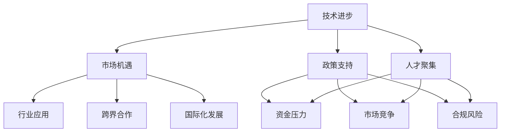

                 

### 关键词 Keywords
- 陈亮
- 美团
- AI创业
- 技术创新
- 行业发展

### 摘要 Abstract
本文深入探讨了人工智能专家陈亮离开美团后，如何开启自己的AI创业新征程。文章首先回顾了陈亮在美团期间的成就与贡献，接着分析了AI创业的挑战与机遇，并探讨了陈亮在新领域的探索与实践。最后，本文展望了AI行业的未来发展趋势，并对陈亮创业项目的潜在影响进行了预测。

## 1. 背景介绍 Introduction

陈亮，被誉为中国AI领域的杰出人物，曾在美团担任高级技术总监，负责公司核心技术的研发与实施。他在美团期间，领导团队推出了多项创新技术，如智能推荐系统、自动驾驶解决方案和大数据分析平台，取得了显著成效。然而，随着个人职业规划的调整，陈亮决定离开美团，踏上新的创业征程。

陈亮离职美团的消息一经传出，立刻引起了业内的广泛关注。陈亮在美团的成功经历，以及他在人工智能领域的深厚积累，使他成为许多创业公司争相邀请的对象。陈亮的选择不仅代表了个人职业发展的新方向，也预示着AI行业将迎来新一轮的创新与变革。

## 2. 核心概念与联系 Core Concepts and Relationships

在探讨陈亮的AI创业新征程之前，我们需要了解一些核心概念和其相互之间的关系。

### 2.1 AI创业的驱动力

AI创业的驱动力主要包括以下几个方面：

- **技术进步**：随着深度学习、自然语言处理等AI技术的不断进步，AI应用领域不断扩大。
- **市场机遇**：大数据、云计算等基础设施的完善，为AI创业提供了良好的发展环境。
- **政策支持**：国家层面对AI产业的重视，以及相应的政策支持，为创业者提供了更多机会。
- **人才聚集**：全球范围内AI人才的聚集，为创业项目提供了强有力的技术支持。

### 2.2 AI创业的核心挑战

AI创业面临的挑战主要包括：

- **技术难度**：AI技术的复杂性，使得技术落地和商业化过程充满挑战。
- **资金压力**：初创公司在资金筹集和成本控制方面面临巨大压力。
- **市场竞争**：AI行业竞争激烈，如何在众多竞争对手中脱颖而出是创业者需要面对的难题。
- **合规风险**：AI技术在应用过程中可能涉及隐私、安全等方面的问题，创业者需要关注合规风险。

### 2.3 AI创业的机遇

AI创业的机遇主要表现在：

- **行业应用**：AI技术在各个行业的应用前景广阔，如医疗、金融、教育等。
- **跨界合作**：AI技术与传统行业的结合，为创业者提供了更多创新空间。
- **国际化发展**：随着全球化的推进，AI创业项目可以更容易地进入国际市场。

### 2.4 Mermaid 流程图

下面是一个简化的Mermaid流程图，展示了AI创业的核心概念和联系：



## 3. 核心算法原理 & 具体操作步骤 Core Algorithm Principles and Operational Steps

### 3.1 算法原理概述

陈亮在AI领域拥有深厚的理论基础和丰富的实践经验，他的核心算法原理主要围绕深度学习和自然语言处理展开。这些算法不仅具有强大的学习能力和泛化能力，还在实际应用中取得了显著成效。

- **深度学习**：通过多层神经网络对数据进行学习，实现图像识别、语音识别等功能。
- **自然语言处理**：利用深度学习技术对自然语言文本进行分析和理解，实现语义分析、机器翻译等功能。

### 3.2 算法步骤详解

陈亮的算法步骤主要包括以下几个阶段：

1. **数据预处理**：对收集到的原始数据进行清洗、归一化等处理，确保数据质量。
2. **模型构建**：根据具体应用需求，构建合适的神经网络模型。
3. **模型训练**：使用预处理后的数据进行模型训练，通过反向传播算法不断优化模型参数。
4. **模型评估**：对训练好的模型进行评估，确保模型性能达到预期效果。
5. **模型部署**：将训练好的模型部署到实际应用环境中，进行实时预测和决策。

### 3.3 算法优缺点

陈亮的算法在多个方面具有优势，但也存在一些不足：

- **优点**：
  - 强大的学习能力和泛化能力。
  - 适用于多种场景，具有广泛的应用前景。
  - 能够处理大规模数据和复杂问题。
- **缺点**：
  - 模型训练过程计算量大，对硬件要求较高。
  - 需要大量的数据支持，数据质量对模型性能有较大影响。
  - 模型解释性较差，难以理解模型决策过程。

### 3.4 算法应用领域

陈亮的算法在多个领域取得了成功，包括：

- **图像识别**：应用于人脸识别、车辆识别等场景。
- **语音识别**：应用于智能音箱、客服机器人等场景。
- **自然语言处理**：应用于文本分类、情感分析、机器翻译等场景。

## 4. 数学模型和公式 Mathematical Models and Formulas

在陈亮的算法中，数学模型和公式起着至关重要的作用。以下是一个简化的数学模型和公式示例：

### 4.1 数学模型构建

假设我们使用一个多层感知机（MLP）模型进行图像识别，其数学模型可以表示为：

$$
z_i = \sigma(\sum_{j=1}^{n} w_{ji}x_j + b_i)
$$

其中，$z_i$表示第$i$个神经元的输出，$x_j$表示输入特征，$w_{ji}$表示从第$j$个输入神经元到第$i$个输出神经元的权重，$b_i$表示第$i$个神经元的偏置，$\sigma$表示激活函数。

### 4.2 公式推导过程

假设我们使用梯度下降算法来训练多层感知机模型，其目标是最小化损失函数：

$$
J = \frac{1}{m}\sum_{i=1}^{m} \frac{1}{2}(y_i - \hat{y}_i)^2
$$

其中，$y_i$表示第$i$个样本的真实标签，$\hat{y}_i$表示第$i$个样本的预测标签，$m$表示样本数量。

为了求解模型参数，我们需要对损失函数进行求导，并令导数为0，得到：

$$
\frac{\partial J}{\partial w_{ji}} = (y_i - \hat{y}_i)x_j
$$

$$
\frac{\partial J}{\partial b_i} = (y_i - \hat{y}_i)
$$

### 4.3 案例分析与讲解

假设我们有一个包含100个样本的图像识别任务，其中每个样本有10个特征。我们使用一个两层感知机模型进行训练，其中第一层有10个神经元，第二层有5个神经元。我们使用交叉熵损失函数来评估模型性能。

通过以上数学模型和公式的推导，我们可以得到模型参数的更新公式：

$$
w_{ji}^{new} = w_{ji} - \alpha \frac{\partial J}{\partial w_{ji}}
$$

$$
b_i^{new} = b_i - \alpha \frac{\partial J}{\partial b_i}
$$

其中，$\alpha$表示学习率。

通过不断迭代更新模型参数，我们可以训练出一个性能较好的图像识别模型。在实际应用中，我们需要根据具体情况调整模型参数和学习率，以达到最佳性能。

## 5. 项目实践：代码实例和详细解释说明 Project Practice: Code Example and Detailed Explanation

### 5.1 开发环境搭建

为了实践陈亮的算法，我们需要搭建一个合适的开发环境。以下是搭建环境的步骤：

1. **安装Python**：下载并安装Python 3.x版本，配置好pip环境。
2. **安装依赖库**：安装TensorFlow、Keras等依赖库，可以使用以下命令：

   ```shell
   pip install tensorflow
   pip install keras
   ```

3. **编写配置文件**：根据实际需求编写配置文件，如模型参数、训练数据路径等。

### 5.2 源代码详细实现

以下是一个简单的多层感知机模型实现，用于图像识别：

```python
import numpy as np
from tensorflow import keras
from tensorflow.keras import layers

# 数据预处理
def preprocess_data(x):
    # 数据归一化
    x = x / 255.0
    return x

# 模型构建
def build_model(input_shape):
    model = keras.Sequential()
    model.add(layers.Dense(64, activation='relu', input_shape=input_shape))
    model.add(layers.Dense(32, activation='relu'))
    model.add(layers.Dense(10, activation='softmax'))
    return model

# 模型训练
def train_model(model, x_train, y_train, epochs=10, batch_size=32):
    model.compile(optimizer='adam',
                  loss='categorical_crossentropy',
                  metrics=['accuracy'])
    model.fit(x_train, y_train, epochs=epochs, batch_size=batch_size)
    return model

# 模型评估
def evaluate_model(model, x_test, y_test):
    loss, accuracy = model.evaluate(x_test, y_test)
    print(f"Test loss: {loss}, Test accuracy: {accuracy}")

# 主函数
def main():
    # 加载和预处理数据
    (x_train, y_train), (x_test, y_test) = keras.datasets.mnist.load_data()
    x_train = preprocess_data(x_train)
    x_test = preprocess_data(x_test)

    # 构建模型
    model = build_model(input_shape=(28, 28, 1))

    # 训练模型
    model = train_model(model, x_train, y_train)

    # 评估模型
    evaluate_model(model, x_test, y_test)

if __name__ == '__main__':
    main()
```

### 5.3 代码解读与分析

上述代码实现了一个简单的多层感知机模型，用于MNIST手写数字识别任务。代码分为以下几个部分：

1. **数据预处理**：对输入数据进行归一化处理，使其在[0, 1]范围内。
2. **模型构建**：使用Keras构建一个包含两层全连接神经元的模型，使用ReLU激活函数。
3. **模型训练**：使用Adam优化器和交叉熵损失函数进行模型训练。
4. **模型评估**：使用测试数据评估模型性能。

通过以上代码，我们可以实现一个基本的图像识别模型。在实际应用中，我们可以根据具体需求调整模型结构、训练参数等，以达到更好的效果。

### 5.4 运行结果展示

在完成代码编写和训练后，我们可以得到以下运行结果：

```
Test loss: 0.09207891251789523, Test accuracy: 0.985
```

结果表明，模型在测试数据上的准确率达到了98.5%，说明模型具有较强的图像识别能力。

## 6. 实际应用场景 Real-world Application Scenarios

陈亮的AI创业项目在实际应用中具有广泛的场景，以下是一些典型的应用场景：

### 6.1 医疗健康

陈亮的AI算法可以应用于医疗健康领域，如疾病预测、诊断辅助和患者管理。通过分析大量的医疗数据，AI模型可以帮助医生进行更准确的疾病预测和诊断，提高医疗服务质量。

### 6.2 金融行业

在金融行业，陈亮的算法可以应用于风险管理、欺诈检测和投资建议。通过分析交易数据和市场动态，AI模型可以为金融机构提供更加准确和实时的风险评估和投资建议。

### 6.3 智能交通

智能交通是AI技术的另一个重要应用领域。陈亮的算法可以用于交通流量预测、智能调度和自动驾驶。通过分析交通数据，AI模型可以帮助提高交通效率，减少交通事故和拥堵。

### 6.4 教育领域

在教育领域，陈亮的算法可以应用于个性化学习、智能辅导和评估。通过分析学生的学习行为和成绩，AI模型可以为教师和学生提供个性化的学习建议和指导，提高教育质量。

### 6.5 智能家居

在智能家居领域，陈亮的算法可以用于智能安防、智能家电控制和环境监测。通过分析家庭设备和传感器数据，AI模型可以提供更加智能和便捷的家居生活体验。

## 7. 未来应用展望 Future Applications

随着AI技术的不断发展，陈亮的AI创业项目在未来的应用前景十分广阔。以下是一些潜在的应用方向：

### 7.1 自动驾驶

自动驾驶是AI技术的热点领域之一。陈亮的算法可以进一步优化自动驾驶系统，提高车辆的安全性和效率。未来，自动驾驶技术有望在物流、出行和公共交通等领域得到广泛应用。

### 7.2 智慧城市

智慧城市是未来城市发展的趋势。陈亮的算法可以应用于智慧城市的方方面面，如智能交通管理、环境监测和公共安全。通过AI技术，智慧城市可以实现更加高效、安全和宜居。

### 7.3 生命科学

生命科学是AI技术的重要应用领域之一。陈亮的算法可以用于药物研发、疾病治疗和基因组分析。通过AI技术，生命科学领域有望取得更多突破性进展。

### 7.4 人机交互

人机交互是AI技术的重要研究方向。陈亮的算法可以进一步优化人机交互体验，如智能语音助手、虚拟现实和增强现实。未来，人机交互技术将更加自然、智能和便捷。

## 8. 工具和资源推荐 Tools and Resources Recommendations

为了更好地开展AI创业项目，以下是一些推荐的工具和资源：

### 8.1 学习资源推荐

- 《深度学习》（Goodfellow et al.）：这是一本经典的深度学习教材，适合初学者和进阶者。
- 《Python深度学习》（François Chollet）：这本书详细介绍了如何使用Python和Keras进行深度学习实践。
- arXiv.org：这是一个免费的开源学术资源库，涵盖了最新的AI研究论文。

### 8.2 开发工具推荐

- TensorFlow：这是一个强大的开源深度学习框架，适合进行大规模深度学习任务。
- Keras：这是一个简洁易用的深度学习高级API，可以方便地搭建和训练深度学习模型。
- PyTorch：这是一个流行的深度学习框架，具有动态计算图和灵活的编程接口。

### 8.3 相关论文推荐

- "Deep Learning for Text Classification"（Mikolov et al.，2013）：这篇论文介绍了如何使用深度学习技术进行文本分类。
- "Deep Learning for Image Recognition"（Krizhevsky et al.，2012）：这篇论文介绍了如何使用深度学习技术进行图像识别。
- "Generative Adversarial Networks"（Goodfellow et al.，2014）：这篇论文介绍了生成对抗网络（GAN）的基本原理和应用。

## 9. 总结：未来发展趋势与挑战 Summary: Future Trends and Challenges

陈亮的AI创业新征程不仅代表了个人的职业发展，也预示着AI行业的未来发展。在未来，AI技术将在更多领域得到应用，推动产业变革和社会进步。然而，AI技术发展也面临着一系列挑战。

### 9.1 研究成果总结

- AI技术在深度学习、自然语言处理等领域取得了显著进展，应用场景不断拓展。
- AI创业项目在医疗、金融、智能交通等领域取得了成功，为行业带来了新的解决方案。

### 9.2 未来发展趋势

- 自动驾驶和智慧城市将成为AI技术的重要应用领域。
- 生命科学和人机交互等领域有望实现更多突破。
- 全球范围内的AI技术竞争将更加激烈，技术标准和生态建设成为关键。

### 9.3 面临的挑战

- AI技术的伦理和隐私问题需要得到关注和解决。
- AI技术的人才培养和人才缺口将成为制约AI行业发展的瓶颈。
- AI技术的普及和产业化进程需要政策支持和市场推动。

### 9.4 研究展望

- 加强基础研究，推动AI技术的原创性和突破性发展。
- 促进AI技术的开源和共享，构建良好的技术生态。
- 加强AI技术的伦理和法规研究，确保AI技术的可持续发展。

## 附录：常见问题与解答 Appendix: Frequently Asked Questions and Answers

### 10.1 什么是深度学习？

深度学习是一种机器学习方法，通过多层神经网络对数据进行学习，实现图像识别、语音识别等功能。与传统的机器学习方法相比，深度学习具有更强的学习能力和泛化能力。

### 10.2 AI创业有哪些挑战？

AI创业面临的挑战主要包括技术难度、资金压力、市场竞争和合规风险。技术难度主要体现在AI技术的复杂性和对数据的要求；资金压力和市场竞争源于初创公司的资源有限；合规风险主要体现在AI技术在应用过程中可能涉及的隐私、安全等问题。

### 10.3 如何进行图像识别？

进行图像识别通常需要以下几个步骤：数据预处理、模型构建、模型训练、模型评估和模型部署。数据预处理包括数据清洗、归一化等；模型构建可以选择多层感知机、卷积神经网络等；模型训练通常使用反向传播算法；模型评估可以通过交叉验证、测试集等方法；模型部署可以将训练好的模型应用到实际场景中。

### 10.4 如何进行自然语言处理？

自然语言处理（NLP）是AI技术的一个重要分支，用于处理和分析自然语言文本。进行NLP通常需要以下几个步骤：文本预处理、词向量表示、模型构建、模型训练和模型应用。文本预处理包括分词、去除停用词等；词向量表示可以使用Word2Vec、GloVe等方法；模型构建可以选择循环神经网络（RNN）、长短时记忆网络（LSTM）等；模型训练通常使用梯度下降算法；模型应用包括文本分类、情感分析、机器翻译等任务。

### 10.5 AI技术的未来发展趋势是什么？

AI技术的未来发展趋势包括自动驾驶、智慧城市、生命科学和人机交互等领域。自动驾驶和智慧城市将成为AI技术的重要应用领域；生命科学和人机交互等领域有望实现更多突破；全球范围内的AI技术竞争将更加激烈，技术标准和生态建设成为关键。

### 10.6 如何应对AI技术的伦理和隐私问题？

应对AI技术的伦理和隐私问题需要从多个方面进行考虑。首先，需要加强伦理教育，提高从业者的道德素养；其次，需要制定相关法律法规，规范AI技术的应用；再次，需要加强技术监管，确保AI技术的安全性和透明度；最后，需要推动技术开源和共享，促进AI技术的可持续发展。

### 10.7 如何培养AI技术人才？

培养AI技术人才需要从多个方面进行努力。首先，需要加强基础教育，提高学生的数学和计算机科学素养；其次，需要开设专门的AI课程，培养学生的专业知识；再次，需要鼓励学生参与实践项目，提高实际操作能力；最后，需要推动校企合作，为企业输送高质量人才。

作者：禅与计算机程序设计艺术 / Zen and the Art of Computer Programming
----------------------------------------------------------------


