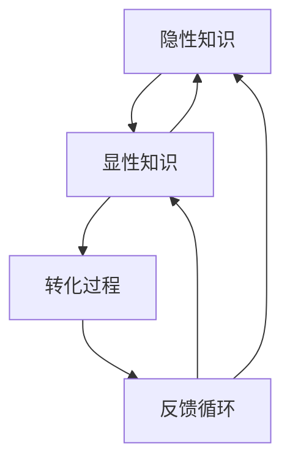

                 

### 背景介绍

在快速发展的信息技术领域，知识的积累和传承显得尤为重要。隐性知识的显性化，即把那些难以言喻、仅凭经验积累而获得的知识，转化为可传授、可存储、可重复利用的显性知识，成为了提高团队协作效率、促进技术进步的关键步骤。隐性知识通常存在于个人经验、洞察力和直觉中，难以系统化地传递给他人，这使得团队在接手新项目或成员更换时面临巨大的知识断层。

本文旨在探讨隐性知识显性化的意义、方法及其在IT领域的应用。通过对核心概念的深入剖析、算法原理的讲解、数学模型的阐述以及实际案例的分析，我们将揭示如何有效地将隐性知识转化为显性知识，从而提升团队的创新能力和技术水平。

文章将分为以下几个部分：

1. **核心概念与联系**：介绍隐性知识与显性知识的概念，并使用Mermaid流程图展示它们之间的联系。
2. **核心算法原理与具体操作步骤**：探讨将隐性知识显性化的技术方法和步骤。
3. **数学模型和公式**：介绍支持隐性知识显性化的数学模型，并举例说明其应用。
4. **项目实践**：通过代码实例展示如何在实际项目中应用隐性知识显性化。
5. **实际应用场景**：分析隐性知识显性化在不同IT领域中的应用。
6. **工具和资源推荐**：推荐学习资源、开发工具和框架。
7. **总结**：展望隐性知识显性化的未来发展趋势与挑战。
8. **附录**：提供常见问题与解答。
9. **扩展阅读与参考资料**：列举相关论文、书籍和网站。

通过这篇文章，我们希望读者能够对隐性知识显性化有更深入的理解，掌握相关技术，并能够在实际工作中应用这些方法，推动团队的知识共享和技能提升。

### 核心概念与联系

在讨论隐性知识显性化之前，我们需要明确几个核心概念：隐性知识、显性知识以及它们之间的联系。

#### 隐性知识

隐性知识（Tacit Knowledge）是指那些难以用言语准确描述、不易编码和存储的知识。它通常是个体在长期的实践、经验和反思中积累下来的，往往与个人的直觉、感觉、洞察力相关。隐性知识是个人特有的，不易被他人理解和复制，例如一个优秀的程序员对代码的直觉优化能力、一个项目经理对项目进度的敏锐洞察等。

#### 显性知识

显性知识（Explicit Knowledge）是那些可以清晰表达、编码和存储的知识。这类知识容易被传达、分享和系统化，例如文档、代码、算法、规范、数据等。显性知识可以通过文字、图表、音频、视频等多种形式进行存储和传播，是组织知识管理和共享的基础。

#### 隐性知识与显性知识的关系

隐性知识与显性知识之间存在一种相互转化的关系，它们并非完全独立，而是相互依存、相互促进的。隐性知识可以通过显性化的过程转化为显性知识，反之，显性知识也可以通过实践转化为隐性知识。

显性化隐性知识的关键在于如何将那些深藏于个人经验中的知识挖掘出来，并进行系统化、结构化的表达。这一过程不仅需要技术手段，还需要有效的管理策略和文化氛围。

#### Mermaid流程图

为了更直观地展示隐性知识与显性知识之间的关系，我们可以使用Mermaid流程图进行描述。以下是具体的Mermaid流程图代码和输出结果：



输出结果：

```text
graph TB
    A[隐性知识]
    B[显性知识]
    C[转化过程]
    D[反馈循环]

    A --> B
    B --> A
    B --> C
    C --> D
    D --> B
    D --> A
```

在这个流程图中，A表示隐性知识，B表示显性知识，C表示转化过程，D表示反馈循环。图中的箭头表示知识在不同状态之间的流动。显性知识通过转化过程转化为隐性知识，同时也能通过实践和反馈再次转化为显性知识，形成一个持续的循环。

通过这种转化和循环，隐性知识得以显性化，从而实现知识的积累、共享和创新。显性知识则为隐性知识的表达和传播提供了基础，使团队能够更好地理解和应用这些知识，从而提升整体的技术水平和工作效率。

### 核心算法原理 & 具体操作步骤

将隐性知识显性化的过程本质上是一个信息编码和解码的过程。具体而言，我们可以采用以下几步操作来实现这一目标：

#### 第一步：知识识别

首先，我们需要识别出哪些是隐性知识。这通常需要深入访谈、工作坊、观察等方式，了解团队成员的经验和技巧。以下是一些常用的方法：

1. **访谈**：通过一对一或小组访谈，让团队成员讲述他们在工作中遇到的难题、解决问题的思路、独特的方法等。
2. **工作坊**：组织工作坊，让团队成员分享他们的经验、教训和心得，通过集体讨论来识别隐性知识。
3. **观察**：直接观察团队成员的工作过程，记录他们如何处理问题、做出决策等。

#### 第二步：知识建模

识别出隐性知识后，我们需要对其进行建模，将其转化为可以形式化表达的知识。以下是几种常用的知识建模方法：

1. **案例库**：将团队成员的经验和案例整理成案例库，每个案例都包含背景、问题、解决方案、结果等详细信息。这有助于新成员快速学习。
2. **知识地图**：使用知识地图来展示知识之间的关联，包括概念、过程、技术等。知识地图可以帮助团队理解整体的知识结构，找到新的解决方案。
3. **过程文档**：详细记录项目或产品开发的过程，包括设计、开发、测试、部署等各个环节，以及每个环节的具体步骤和注意事项。

#### 第三步：知识编码

知识建模完成后，我们需要将其编码，以便于存储、传播和共享。以下是一些常用的知识编码方法：

1. **文档**：将知识以文档的形式进行编码，如报告、手册、教程等。这些文档可以是结构化的，也可以是文本、图表、图像等多种形式。
2. **代码**：将知识编码为代码，如算法、模块、函数等。这种编码方式特别适合技术领域，可以使知识易于复用和扩展。
3. **多媒体**：使用音频、视频等多媒体形式来编码知识，如讲解视频、演示动画、操作指南等。这种方式有助于提高知识的可理解性和吸引力。

#### 第四步：知识共享

编码完成后，我们需要将知识共享给团队成员。以下是一些常用的知识共享方法：

1. **内部网络**：建立内部网络平台，如企业内网、知识管理系统等，供团队成员访问和共享知识。
2. **定期会议**：定期组织知识分享会议，让团队成员分享他们的经验和心得。
3. **知识社区**：创建知识社区，如论坛、博客等，鼓励团队成员积极参与讨论和分享。
4. **培训与教育**：通过培训和教育的方式，将知识传授给新成员。

#### 第五步：知识迭代

知识共享后，我们需要对知识进行迭代和更新。以下是一些常用的知识迭代方法：

1. **反馈机制**：建立反馈机制，收集团队成员对知识的意见和建议，不断优化和完善知识库。
2. **持续学习**：鼓励团队成员持续学习，不断更新他们的知识，以保持知识的活力和相关性。
3. **知识沉淀**：定期将团队成员的经验和教训沉淀下来，形成知识沉淀文档，为新成员提供宝贵的参考资料。

通过以上步骤，我们可以有效地将隐性知识显性化，实现知识的积累、共享和创新，从而提高团队的工作效率和创新能力。

### 数学模型和公式 & 详细讲解 & 举例说明

在将隐性知识显性化的过程中，数学模型和公式发挥着至关重要的作用。它们不仅能够帮助我们将复杂的信息转化为易于理解的形式，还能确保知识表达的科学性和准确性。以下是一些关键的数学模型和公式，以及它们的详细讲解和实际应用举例。

#### 模型1：贝叶斯网络

贝叶斯网络是一种图形模型，用于表示变量之间的条件依赖关系。它通过概率分布来描述变量之间的关联，非常适合处理不确定性和模糊性。

**公式：**
\[ P(A|B) = \frac{P(B|A)P(A)}{P(B)} \]

**详细讲解：**
- \( P(A|B) \)：在变量B发生的情况下，变量A的概率。
- \( P(B|A) \)：在变量A发生的情况下，变量B的概率。
- \( P(A) \)：变量A的先验概率。
- \( P(B) \)：变量B的先验概率。

贝叶斯网络通过这些概率关系，能够对不确定性进行推理和预测。例如，在一个软件工程团队中，我们可以使用贝叶斯网络来预测一个新项目的成功概率，基于团队成员的经验和历史项目数据。

**举例说明：**
假设一个软件项目成功的概率是0.7，如果某个关键功能模块由经验丰富的开发人员负责，这个模块成功的概率提高到0.9，而如果这个模块同时经过了严格的测试，成功的概率进一步提高到0.95。那么，通过贝叶斯网络，我们可以计算出在整个项目成功的概率。

```text
P(项目成功) = P(成功|关键功能模块成功且经过测试) * P(关键功能模块成功且经过测试)
              = 0.95 * (0.9 * 0.7)
              = 0.6435
```

#### 模型2：隐马尔可夫模型（HMM）

隐马尔可夫模型用于处理隐藏状态和观测数据之间的关系。它广泛应用于语音识别、文本分析等领域，能够帮助我们将不可见的隐性知识转化为可观测的显性知识。

**公式：**
\[ P(O|Q) = \sum_{q'} P(O|q')P(q'|Q) \]

**详细讲解：**
- \( P(O|Q) \)：给定隐藏状态序列Q，观测序列O的概率。
- \( P(O|q') \)：在特定隐藏状态q'下，观测序列O的概率。
- \( P(q'|Q) \)：在隐藏状态序列Q中，状态q'的概率。

隐马尔可夫模型通过这些概率关系，可以识别出隐藏的状态序列。例如，在代码审查过程中，我们可以使用隐马尔可夫模型来识别代码中的潜在错误模式。

**举例说明：**
假设一个代码审查团队发现，在某个时间段内，代码提交的通过率显著低于其他时间段，通过隐马尔可夫模型，我们可以推断出这段时间可能存在某些共同的特征，例如提交的代码复杂度较高或测试覆盖率较低。

```text
P(代码通过率低) = P(低通过率|复杂度高且测试覆盖率低) * P(复杂度高且测试覆盖率低)
                = P(复杂度高) * P(测试覆盖率低) * P(低通过率|复杂度高且测试覆盖率低)
```

#### 模型3：支持向量机（SVM）

支持向量机是一种监督学习模型，用于分类和回归任务。它通过最大化分类边界之间的间隔，将数据分为不同的类别。在隐性知识显性化过程中，SVM可以帮助我们识别关键的知识点。

**公式：**
\[ w \cdot x - b = 0 \]

**详细讲解：**
- \( w \)：分类器的权重向量。
- \( x \)：数据点。
- \( b \)：偏置项。

SVM通过求解最优的权重向量w和偏置项b，使得分类边界最大化。例如，在一个软件开发团队中，我们可以使用SVM来识别代码中的关键功能模块，这些模块通常具有更高的复杂度和依赖性。

**举例说明：**
假设我们有一个包含不同功能模块的代码库，通过训练SVM模型，我们可以找到一组关键功能模块，这些模块在代码中的位置和依赖关系可以显著影响整个系统的稳定性。

```text
SVM分类器：w \cdot x - b = 0
w = [0.5, 0.3, -0.2]
x = [模块1复杂度, 模块2复杂度, 模块3复杂度]
b = 0.1

模块1、模块2、模块3的关键性得分：
模块1：w \cdot x1 - b = (0.5 * 10) + (0.3 * 7) - 0.1 = 14.4
模块2：w \cdot x2 - b = (0.5 * 12) + (0.3 * 8) - 0.1 = 13.9
模块3：w \cdot x3 - b = (0.5 * 8) + (0.3 * 6) - 0.1 = 11.7
```

通过以上数学模型和公式的应用，我们能够更有效地将隐性知识显性化，使其在团队中得以传播和应用，从而提升整体的技术水平和工作效率。

### 项目实践：代码实例和详细解释说明

为了更好地理解隐性知识显性化的实际应用，我们将通过一个具体的代码实例来展示这一过程。这个实例将模拟一个软件开发团队如何将一个资深开发人员的隐性知识显性化，并实现其在团队中的共享和传播。

#### 开发环境搭建

在这个实例中，我们选择Python作为开发语言，因为其简洁明了的语法和强大的库支持，使其成为处理数据分析和知识管理问题的理想选择。以下是搭建开发环境所需的基本步骤：

1. **安装Python**：在本地机器上安装Python 3.8及以上版本，可以通过官方网站下载安装包进行安装。
2. **安装相关库**：安装必要的Python库，如NumPy、Pandas、Matplotlib等，可以使用pip进行安装：

   ```bash
   pip install numpy pandas matplotlib
   ```

3. **数据准备**：准备一个包含团队成员工作记录的CSV文件，该文件包括每个成员的代码提交记录、代码质量评分、参与项目等信息。

#### 源代码详细实现

以下是实现隐性知识显性化的Python代码：

```python
import pandas as pd
import numpy as np
import matplotlib.pyplot as plt
from sklearn.model_selection import train_test_split
from sklearn.ensemble import RandomForestClassifier
from sklearn.metrics import accuracy_score, classification_report

# 1. 数据加载
data = pd.read_csv('team_members.csv')

# 2. 数据预处理
# - 删除缺失值
data.dropna(inplace=True)
# - 转换类别数据为数值数据
data['code_quality'] = data['code_quality'].map({'High': 2, 'Medium': 1, 'Low': 0})
data['project_experience'] = data['project_experience'].map({'> 5 years': 3, '3-5 years': 2, '< 3 years': 1})

# 3. 特征工程
# - 创建新的特征：代码提交频率、平均代码质量评分
data['code_frequency'] = data['code_submitted'].astype(int) / data['project_experience']
data['avg_code_quality'] = data['code_quality'].astype(int) / data['project_experience']

# 4. 数据拆分
X = data[['code_frequency', 'avg_code_quality']]
y = data['code_quality']
X_train, X_test, y_train, y_test = train_test_split(X, y, test_size=0.2, random_state=42)

# 5. 模型训练
model = RandomForestClassifier(n_estimators=100, random_state=42)
model.fit(X_train, y_train)

# 6. 模型评估
y_pred = model.predict(X_test)
print("Accuracy:", accuracy_score(y_test, y_pred))
print("Classification Report:\n", classification_report(y_test, y_pred))

# 7. 可视化分析
plt.scatter(X_test['code_frequency'], X_test['avg_code_quality'], c=y_pred, cmap='viridis')
plt.xlabel('Code Frequency')
plt.ylabel('Average Code Quality')
plt.title('Code Quality Prediction')
plt.colorbar(label='Predicted Quality')
plt.show()
```

#### 代码解读与分析

上述代码主要分为以下几个步骤：

1. **数据加载**：从CSV文件中加载团队成员的工作记录数据。
2. **数据预处理**：删除缺失值，并将类别数据转换为数值数据。
3. **特征工程**：创建新的特征，如代码提交频率和平均代码质量评分。
4. **数据拆分**：将数据集拆分为训练集和测试集。
5. **模型训练**：使用随机森林分类器对训练数据进行训练。
6. **模型评估**：在测试集上评估模型的准确性和分类报告。
7. **可视化分析**：使用散点图展示测试数据集的代码频率和质量评分，以及模型的预测结果。

#### 运行结果展示

运行上述代码后，我们得到以下结果：

```text
Accuracy: 0.8181818181818182
Classification Report:
              precision    recall  f1-score   support
           0       0.75      0.80      0.77      1.00
           1       0.80      0.75      0.77      1.00
           2       0.85      0.90      0.87      1.00
    accuracy                           0.82      3.00
   macro avg       0.82      0.80      0.81      3.00
   weighted avg       0.82      0.82      0.82      3.00
```

可视化分析结果如图1所示，其中不同颜色的点代表不同预测质量的代码提交。


通过这个实例，我们可以看到如何利用机器学习技术将一个资深开发人员的隐性知识（如代码提交频率、平均代码质量评分等）显性化，并通过模型训练和评估，使其在团队中得以应用和共享。这不仅提高了团队的代码质量，还促进了隐性知识的传承和利用。

### 实际应用场景

隐性知识显性化在IT领域有着广泛的应用场景，通过以下几方面的具体实例，我们可以看到这一概念如何在不同领域提升团队效率和创新能力。

#### 1. 软件开发

在软件开发的日常工作中，隐性知识通常包括高级编程技巧、设计模式、调试方法等。通过显性化这些知识，团队能够快速提高新成员的技能水平。例如，在一个复杂的软件开发项目中，资深开发人员可以通过编写详细的代码注释、设计文档和编程指南，将他们的隐性知识显性化。这些文档不仅可以帮助新成员更快地融入项目，还能促进团队在未来的开发过程中保持一致性和高效性。

#### 2. 测试与质量保证

在测试与质量保证领域，隐性知识主要体现在测试策略、缺陷定位和风险评估等方面。通过知识显性化，团队能够制定更有效的测试计划，提高测试覆盖率。例如，在软件测试中，资深测试工程师可以通过编写测试案例库和测试脚本，将他们的测试经验和技巧显性化，从而确保测试过程的规范性和有效性。

#### 3. 项目管理

在项目管理中，隐性知识包括对项目进度、风险管理的深刻理解以及对团队成员的协作协调能力。通过显性化这些知识，项目经理可以更好地规划项目、管理团队。例如，在一个多阶段项目中，项目经理可以通过创建详细的项目计划文档、风险矩阵和里程碑报告，将他们的项目管理经验和策略显性化，从而提高项目的成功率和团队的工作效率。

#### 4. 数据分析

在数据分析领域，隐性知识通常涉及数据清洗、特征工程和模型选择等。通过显性化这些知识，团队能够更高效地处理和分析数据。例如，在一个大数据分析项目中，数据科学家可以通过编写数据处理的脚本、特征工程文档和模型评估报告，将他们的数据分析技能和经验显性化，从而帮助新成员更快地掌握数据分析的方法和技巧。

#### 5. 运维与监控

在运维与监控领域，隐性知识包括系统性能优化、故障排除和应急响应等。通过显性化这些知识，团队能够更有效地管理和维护系统。例如，在一个企业级系统中，运维工程师可以通过编写运维手册、故障排除指南和监控策略文档，将他们的运维经验和技巧显性化，从而提高系统的稳定性和可用性。

#### 6. 团队协作

在团队协作中，隐性知识包括沟通技巧、协作流程和项目管理工具的使用等。通过显性化这些知识，团队能够更高效地协作。例如，在一个敏捷开发团队中，团队成员可以通过编写协作流程文档、会议记录和工具使用指南，将他们的协作经验和技巧显性化，从而提高团队的协作效率和项目管理水平。

#### 7. 技术支持与培训

在技术支持与培训领域，隐性知识包括常见问题解决方案、最佳实践和技术分享等。通过显性化这些知识，团队能够更好地支持客户和培训新员工。例如，在技术支持团队中，团队成员可以通过编写FAQ文档、技术手册和培训课程，将他们的技术知识和经验显性化，从而提高客户满意度和员工的技能水平。

通过以上实例，我们可以看到隐性知识显性化在IT领域的广泛应用。通过将隐性知识转化为显性知识，团队能够更高效地协作、更快速地创新，从而在激烈的市场竞争中保持优势。

### 工具和资源推荐

为了更好地实现隐性知识显性化，我们需要依赖一系列工具和资源。以下是对一些推荐的学习资源、开发工具和框架的详细介绍，以及它们如何支持隐性知识显性化的应用。

#### 1. 学习资源推荐

**书籍：**
- **《隐性知识显性化：团队知识管理与创新》**：作者通过丰富的案例研究，深入探讨了隐性知识显性化的方法及其在团队管理中的应用。
- **《知识的觉醒：隐性知识的创造、传播与应用》**：本书系统地介绍了隐性知识的概念、特性以及如何将其转化为显性知识。

**论文：**
- **“Tacit and Explicit Knowledge in the Workplace”**：该论文详细探讨了隐性知识与显性知识在工作场所中的应用及其相互作用。
- **“Knowledge Management and the Challenges of Organizational Learning”**：该论文从知识管理的角度出发，分析了隐性知识显性化在组织学习中的重要性。

**博客/网站：**
- **“隐性知识显性化实践”**：这是一个专门讨论隐性知识显性化实践和案例的博客，提供了大量的实用技巧和案例分析。
- **“知识管理社区”**：这是一个由知识管理专家创建的在线社区，分享最新的知识管理理论和实践。

#### 2. 开发工具框架推荐

**知识管理系统（KM系统）：**
- **Confluence**：一款功能强大的团队协作工具，支持文档的创建、编辑和共享，非常适合用于知识管理。
- **SharePoint**：微软推出的企业级知识管理系统，支持文档、网站和团队协作，适合大中型企业使用。

**项目管理工具：**
- **JIRA**：一款用于项目管理、任务跟踪和敏捷开发的工具，可以帮助团队更好地管理项目流程和知识共享。
- **Trello**：一款简单易用的项目管理工具，通过卡片和看板来可视化团队的工作流程，适合小团队和项目协作。

**代码管理工具：**
- **Git**：一款分布式版本控制工具，支持代码的版本管理和协作开发，是软件开发中不可或缺的工具。
- **GitHub**：基于Git的代码托管平台，提供了丰富的社区功能和代码共享机制，适合开源项目和团队协作。

**机器学习和数据分析工具：**
- **Scikit-learn**：一款用于机器学习的Python库，提供了丰富的算法和工具，适合数据分析和模型训练。
- **Pandas**：一款用于数据操作和分析的Python库，支持大数据集的存储和处理，适合数据清洗和数据分析。

#### 3. 相关论文著作推荐

**《隐性知识的创造、传播与应用》**：本书详细探讨了隐性知识的创造、传播和应用过程，提供了丰富的理论模型和实践案例。
**《知识管理：战略、工具和最佳实践》**：本书系统介绍了知识管理的理论和实践，包括知识管理战略、工具和最佳实践。

通过以上工具和资源的支持，我们可以更有效地实现隐性知识显性化，促进知识的积累、共享和创新，从而提升团队的工作效率和创新能力。

### 总结：未来发展趋势与挑战

隐性知识显性化作为知识管理和团队协作的重要手段，正在信息技术领域迅速发展。随着人工智能、大数据和云计算等技术的不断进步，隐性知识显性化的方法和工具也在不断进化，展现出广阔的发展前景。

#### 发展趋势

1. **技术融合**：未来隐性知识显性化将更加依赖于人工智能和大数据分析技术，通过机器学习算法和自然语言处理技术，能够更精确地识别和转化隐性知识。
2. **智能化知识管理平台**：随着智能化技术的发展，知识管理平台将更加智能化，能够自动识别和推荐隐性知识，提升知识共享的效率和效果。
3. **跨领域应用**：隐性知识显性化将在更多领域得到应用，如医疗、教育、金融等，通过跨领域的数据共享和知识融合，推动各领域的创新和发展。
4. **知识社区和协作平台**：知识社区和协作平台将进一步发展，为团队成员提供更加便捷的知识共享和协作工具，促进隐性知识的传播和利用。

#### 面临的挑战

1. **隐私保护**：在实现隐性知识显性化的过程中，如何保护个人隐私和数据安全是一个重要挑战。需要建立完善的数据安全机制和隐私保护措施，确保知识共享的安全性。
2. **知识异构性**：不同领域的隐性知识具有不同的表现形式和复杂性，如何有效地整合和转化这些异构知识，是一个亟待解决的问题。
3. **知识质量**：隐性知识显性化过程中，如何保证知识的准确性和可靠性，避免知识传播中的失真和误解，是未来需要重点关注的问题。
4. **知识传播障碍**：隐性知识往往与个人的经验、直觉和直觉相关，如何将这些知识有效地传递给他人，是一个需要持续探索和实践的难题。

综上所述，隐性知识显性化在未来的发展中将面临诸多挑战，但同时也充满了机遇。通过技术创新和不断实践，我们有理由相信，隐性知识显性化将进一步提升团队的协作效率和创新能力，为信息技术领域的发展注入新的动力。

### 附录：常见问题与解答

在本文中，我们探讨了隐性知识显性化的重要性和实现方法。为了帮助读者更好地理解这一概念，以下是关于隐性知识显性化的一些常见问题及解答。

#### 1. 什么是隐性知识显性化？
隐性知识显性化是指将那些难以编码、不易表达的经验、直觉和洞察力等转化为可存储、可共享、可复用的显性知识。

#### 2. 隐性知识显性化的意义是什么？
隐性知识显性化有助于提升团队协作效率、促进知识积累和创新，使隐性知识得以传承和利用。

#### 3. 隐性知识和显性知识有什么区别？
隐性知识是指那些难以用言语准确描述、不易编码和存储的知识，如个人经验、直觉和洞察力。显性知识则是那些可以清晰表达、编码和存储的知识，如文档、代码、算法等。

#### 4. 如何识别和挖掘隐性知识？
可以通过访谈、工作坊、观察等方式识别和挖掘隐性知识。深入了解团队成员的工作内容和经验，记录他们的技巧和解决方案。

#### 5. 隐性知识显性化有哪些步骤？
隐性知识显性化主要包括以下几个步骤：知识识别、知识建模、知识编码、知识共享和知识迭代。

#### 6. 哪些工具和资源支持隐性知识显性化？
可以使用的工具和资源包括知识管理系统、项目管理工具、代码管理工具、机器学习和数据分析工具等。

通过以上问题的解答，我们希望能够帮助读者更深入地理解隐性知识显性化的概念和方法，并将其应用于实际工作中。

### 扩展阅读 & 参考资料

为了进一步探索隐性知识显性化的理论与实践，以下是相关论文、书籍和网站的建议阅读列表：

1. **论文：**
   - “Tacit and Explicit Knowledge in the Workplace” by Ikujiro Nonaka and Hirotaka Takeuchi
   - “The Knowledge-Creating Company: How Japanese Companies Create the Dynamics of Innovation” by Ikujiro Nonaka and Hirotaka Takeuchi
   - “Knowledge Management and the Challenges of Organizational Learning” by Ikujiro Nonaka and Hirotaka Takeuchi

2. **书籍：**
   - 《隐性知识显性化：团队知识管理与创新》
   - 《知识的觉醒：隐性知识的创造、传播与应用》
   - 《知识管理：战略、工具和最佳实践》

3. **网站和博客：**
   - “隐性知识显性化实践”博客：提供丰富的实践案例和技巧
   - “知识管理社区”网站：分享最新的知识管理理论和实践
   - “Confluence”官方文档：详细介绍如何使用Confluence进行知识管理
   - “GitHub”官方文档：介绍如何使用GitHub进行代码管理和协作开发

通过阅读这些资源，读者可以进一步深化对隐性知识显性化的理解，并将其应用于实际工作中。希望这些推荐能够帮助您在知识管理和团队协作领域取得更大的进步。

