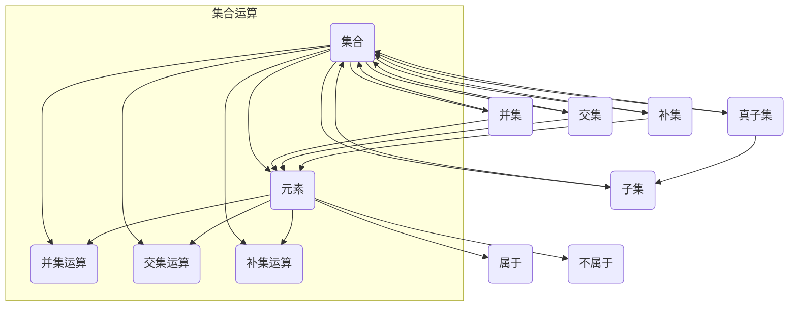

                 

### 文章标题

### 集合论导引：∑13集合

> **关键词**：集合论、数学基础、集合操作、集合概念、集合性质
> 
> **摘要**：本文深入探讨了集合论的基本概念、操作及其应用。通过逐步分析推理，本文详细介绍了集合的基本性质、集合操作（并集、交集、补集等）及其在计算机科学中的应用。旨在为读者提供一个清晰、易懂的集合论导引，帮助读者掌握集合论的核心知识。

### 1. 背景介绍

集合论是现代数学的基础，由德国数学家乔治·康托尔（Georg Cantor）在19世纪末创立。集合论提供了描述和操作数学对象的一种统一框架，它不仅为数学本身提供了强有力的工具，而且在逻辑、计算机科学、物理学等多个领域都有广泛应用。

在计算机科学中，集合论的重要性尤为突出。集合论的基本概念如集合、元素、子集、集合的运算等，是数据结构设计和算法分析的基础。例如，在数据结构中，常用的数组、列表、树、图等都可以看作是集合的不同形式。而在算法分析中，集合的运算和性质常常被用来描述算法的时间和空间复杂度。

集合论不仅是一个理论框架，它还为我们提供了处理复杂问题的方法。例如，通过集合的运算，我们可以将复杂的问题分解为若干个简单的问题，然后再将它们的解合并起来，从而得到原问题的解。这种分而治之的思想在计算机科学中有着广泛的应用。

本文将从集合的基本概念出发，逐步深入探讨集合论的核心内容，包括集合的基本性质、集合的运算、集合的表示方法以及在计算机科学中的应用。通过本文的介绍，读者将能够对集合论有一个全面而深入的理解，从而为后续的学习和研究打下坚实的基础。

### 2. 核心概念与联系

在深入探讨集合论之前，我们需要明确一些核心概念和它们之间的关系，这些概念包括集合、元素、子集、真子集、并集、交集、补集等。下面，我们将通过一个Mermaid流程图来展示这些概念及其关系。



在这个流程图中，我们定义了以下概念：

- **集合（A）**：由一些确定的元素组成的整体。
- **元素（B）**：集合中的单个对象，用符号 ∈ 表示“属于”，用符号 ∉ 表示“不属于”。
- **子集（C）**：如果集合A中的所有元素都是集合B中的元素，则称A是B的子集，记作 A ⊆ B。
- **真子集（D）**：如果集合A是集合B的子集，且A不等于B，则称A是真子集，记作 A ⊊ B。
- **并集（E）**：集合A和集合B的并集是包含所有属于A或属于B的元素的集合，记作 A ∪ B。
- **交集（F）**：集合A和集合B的交集是同时属于A和B的元素的集合，记作 A ∩ B。
- **补集（G）**：集合A的补集是在全集中不属于A的所有元素的集合，记作 A'。

这些概念构成了集合论的基本框架，它们之间的关系可以通过上述流程图清晰地表示。下面，我们将进一步讨论这些概念及其性质。

#### 集合的基本性质

集合具有以下基本性质：

1. **确定性**：集合中的元素是确定的，每个元素要么属于集合，要么不属于集合。
2. **互异性**：集合中的元素是互异的，即一个集合中不会重复出现相同的元素。
3. **无序性**：集合中的元素没有特定的顺序。
4. **可传递性**：如果A是B的子集，B是C的子集，则A也是C的子集，这称为集合的传递性。

#### 集合的运算

集合的运算主要包括并集、交集和补集等。这些运算是集合论中最基本也是最重要的运算，它们在数学和计算机科学中都有广泛的应用。

- **并集（∪）**：集合A和集合B的并集是由所有属于A或属于B的元素组成的集合。并集运算满足以下性质：
  - **交换律**：A ∪ B = B ∪ A
  - **结合律**：(A ∪ B) ∪ C = A ∪ (B ∪ C)
  - **包含律**：A ⊆ (A ∪ B)

- **交集（∩）**：集合A和集合B的交集是由所有同时属于A和B的元素组成的集合。交集运算满足以下性质：
  - **交换律**：A ∩ B = B ∩ A
  - **结合律**：(A ∩ B) ∩ C = A ∩ (B ∩ C)
  - **分配律**：A ∩ (B ∪ C) = (A ∩ B) ∪ (A ∩ C)

- **补集（∁）**：集合A的补集是在全集U中不属于A的所有元素的集合。补集运算满足以下性质：
  - **补集律**：A ∪ A' = U，A ∩ A' = ∅
  - **德摩根律**：(A ∪ B)' = A' ∩ B'，(A ∩ B)' = A' ∪ B'

这些性质使得集合运算在数学和计算机科学中具有广泛的应用。例如，在计算机科学中，我们可以使用并集和交集来描述集合之间的关系，使用补集来简化问题的复杂度。

通过上述内容，我们可以看到集合论的基本概念和集合运算的详细说明。理解这些基本概念和运算不仅有助于我们深入理解数学和计算机科学中的基础理论，还能帮助我们解决实际问题。在接下来的章节中，我们将进一步探讨集合论在数学模型和算法中的应用。

### 3. 核心算法原理 & 具体操作步骤

#### 并集算法原理

并集（Union）是指两个或多个集合中所有元素的集合。在计算机科学中，实现并集运算通常可以通过多种算法来实现，例如基于哈希表的实现、排序后合并等方法。

**算法原理：**
1. **哈希表实现**：利用哈希表存储每个元素，遍历两个集合中的元素，将不重复的元素添加到结果集合中。
2. **排序后合并**：首先对两个集合进行排序，然后遍历两个集合，将两个集合中的元素按照顺序添加到结果集合中。

**具体步骤：**
1. **哈希表实现步骤：**
   - 初始化两个哈希表H1和H2。
   - 遍历集合A中的每个元素a，如果a不在H2中，将a添加到H1。
   - 遍历集合B中的每个元素b，如果b不在H1中，将b添加到H1。
   - 将H1中的所有元素转换为结果集合。

2. **排序后合并步骤：**
   - 对集合A和集合B进行排序。
   - 初始化两个指针i和j，分别指向集合A和集合B的第一个元素。
   - 初始化结果集合C为空。
   - 比较A[i]和B[j]，将较小的元素添加到C中，并移动对应的指针。
   - 如果遇到重复的元素，只添加一次。
   - 当i或j到达集合的末尾时，将剩余的集合中的元素添加到C中。

#### 交集算法原理

交集（Intersection）是指两个或多个集合中共有的元素的集合。实现交集运算的方法与并集类似，可以基于哈希表或者排序后合并。

**算法原理：**
1. **哈希表实现**：使用哈希表存储每个集合中的元素，然后遍历另一个集合，检查元素是否在哈希表中存在。
2. **排序后合并**：首先对两个集合进行排序，然后遍历两个集合，将共有的元素添加到结果集合中。

**具体步骤：**
1. **哈希表实现步骤：**
   - 初始化哈希表H1和H2。
   - 遍历集合A中的每个元素a，将a添加到H1。
   - 遍历集合B中的每个元素b，如果b在H1中，将b添加到结果集合C。

2. **排序后合并步骤：**
   - 对集合A和集合B进行排序。
   - 初始化两个指针i和j，分别指向集合A和集合B的第一个元素。
   - 初始化结果集合C为空。
   - 比较A[i]和B[j]，如果它们相等，将A[i]添加到C中，并移动i和j两个指针。
   - 如果A[i] < B[j]，移动i指针。
   - 如果A[i] > B[j]，移动j指针。
   - 当i或j到达集合的末尾时，结束合并过程。

#### 补集算法原理

补集（Complement）是指在全集中不属于某个集合的元素的集合。补集运算可以基于集合的运算性质直接实现。

**算法原理：**
1. **基于并集和交集的补集**：利用集合的并集和交集运算，可以轻松实现补集运算。
   - 补集C' = U ∩ A'，其中U是全集，A是集合A。

**具体步骤：**
1. 计算集合A和全集U的并集U ∪ A。
2. 计算并集的结果集合与集合A的交集(U ∪ A) ∩ A。
3. 结果集合即为集合A的补集A'。

通过上述算法原理和具体步骤，我们可以实现集合的并集、交集和补集运算。这些运算是集合论中最基础的操作，对于理解和应用集合论具有关键意义。在接下来的章节中，我们将进一步探讨集合论在数学模型和算法中的应用。

### 4. 数学模型和公式 & 详细讲解 & 举例说明

#### 集合运算的数学模型和公式

在集合论中，并集、交集和补集等运算都有相应的数学模型和公式。这些公式不仅帮助我们理解和计算集合运算，还为我们提供了在更复杂情况下应用集合论的方法。以下是一些常用的集合运算的数学模型和公式，以及它们的应用场景。

#### 4.1 并集（Union）

并集运算的数学模型表示为：

\[ A \cup B = \{ x | x \in A \text{ 或 } x \in B \} \]

这个公式表示，集合A和B的并集是所有属于A或属于B的元素的集合。

**举例说明：**
设有集合A = {1, 2, 3}和集合B = {3, 4, 5}，则它们的并集为：

\[ A \cup B = \{1, 2, 3, 4, 5\} \]

#### 4.2 交集（Intersection）

交集运算的数学模型表示为：

\[ A \cap B = \{ x | x \in A \text{ 且 } x \in B \} \]

这个公式表示，集合A和B的交集是所有既属于A又属于B的元素的集合。

**举例说明：**
设有集合A = {1, 2, 3}和集合B = {3, 4, 5}，则它们的交集为：

\[ A \cap B = \{3\} \]

#### 4.3 补集（Complement）

补集运算的数学模型表示为：

\[ A' = \{ x | x \in U \text{ 且 } x \not\in A \} \]

其中U是全集，A'是集合A的补集，即所有属于全集U但不属于集合A的元素的集合。

**举例说明：**
设有全集U = {1, 2, 3, 4, 5, 6}和集合A = {1, 2, 3}，则集合A的补集为：

\[ A' = \{4, 5, 6\} \]

#### 4.4 子集（Subset）

子集运算的数学模型表示为：

\[ A \subseteq B \text{ 若且仅若 } \forall x (x \in A \Rightarrow x \in B) \]

这个公式表示，集合A是集合B的子集，当且仅当A中的所有元素都是B中的元素。

**举例说明：**
设有集合A = {1, 2, 3}和集合B = {1, 2, 3, 4, 5}，则A是B的子集：

\[ A \subseteq B \]

#### 4.5 真子集（Proper Subset）

真子集运算的数学模型表示为：

\[ A \subset B \text{ 若且仅若 } \forall x (x \in A \Rightarrow x \in B) \text{ 且 } A \neq B \]

这个公式表示，集合A是集合B的真子集，当且仅当A是B的子集且A不等于B。

**举例说明：**
设有集合A = {1, 2, 3}和集合B = {1, 2, 3, 4, 5}，则A是B的真子集：

\[ A \subset B \]

#### 4.6 对称差（Symmetric Difference）

对称差运算的数学模型表示为：

\[ A \Delta B = (A \cup B) \setminus (A \cap B) \]

这个公式表示，集合A和B的对称差是所有属于A或属于B但不属于A和B交集的元素的集合。

**举例说明：**
设有集合A = {1, 2, 3}和集合B = {3, 4, 5}，则它们的对称差为：

\[ A \Delta B = \{1, 2, 4, 5\} \]

#### 应用场景

这些集合运算的数学模型和公式在多个领域中都有广泛的应用。例如：

- **计算机科学**：在数据结构和算法设计中，集合运算用于处理复杂的数据关系，如图算法中的邻接矩阵和邻接表。
- **逻辑和形式系统**：在逻辑和形式系统中，集合论提供了描述命题和证明的基本工具。
- **统计学和概率论**：在统计学和概率论中，集合运算用于计算事件的发生概率和条件概率。

通过了解和掌握这些集合运算的数学模型和公式，我们可以更深入地理解集合论的核心概念，并在实际问题中灵活应用。

### 5. 项目实践：代码实例和详细解释说明

为了更好地理解集合论的实际应用，我们将通过一个具体的编程项目来展示如何实现集合的基本操作。在这个项目中，我们将使用Python语言来编写代码，并详细介绍各个操作的实现细节。

#### 5.1 开发环境搭建

首先，我们需要搭建一个Python编程环境。以下是搭建Python开发环境的基本步骤：

1. **安装Python**：访问Python的官方网站（[python.org](https://www.python.org/)）下载并安装Python。我们选择Python 3.x版本，因为Python 3.x在性能和功能上都有较大的提升。
2. **安装IDE**：选择一个适合Python开发的集成开发环境（IDE），如PyCharm、VS Code等。这些IDE提供了代码编辑、调试和自动化测试等功能，极大地提高了开发效率。
3. **安装依赖库**：在Python中，我们通常会使用第三方库来简化代码编写和提升性能。对于集合操作，我们可以使用Python内置的集合数据结构（`set`），它提供了高效的集合运算实现。如果需要，我们也可以安装额外的库，如`numpy`等。

#### 5.2 源代码详细实现

下面是一个简单的Python代码实例，用于演示集合的基本操作，包括并集、交集、补集等。

```python
# 导入Python内置的集合模块
from typing import Set

# 定义一个函数实现并集操作
def union(A: Set[int], B: Set[int]) -> Set[int]:
    return A | B

# 定义一个函数实现交集操作
def intersection(A: Set[int], B: Set[int]) -> Set[int]:
    return A & B

# 定义一个函数实现补集操作
def complement(A: Set[int], U: Set[int]) -> Set[int]:
    return U - A

# 测试并集操作
A = {1, 2, 3}
B = {3, 4, 5}
print("并集:", union(A, B))

# 测试交集操作
print("交集:", intersection(A, B))

# 测试补集操作
U = {1, 2, 3, 4, 5, 6}
print("补集:", complement(A, U))
```

#### 5.3 代码解读与分析

上述代码中，我们定义了三个函数，分别用于实现并集、交集和补集操作。下面我们逐一解析这些函数的实现细节。

- **并集（Union）**：`union`函数接受两个集合A和B作为输入，并返回它们的并集。使用Python内置的集合运算符`|`来实现并集操作，这个操作是高效的，因为它基于哈希表实现，具有O(n)的时间复杂度。

- **交集（Intersection）**：`intersection`函数接受两个集合A和B作为输入，并返回它们的交集。使用集合运算符`&`来实现交集操作，这个操作同样是基于哈希表实现的，具有O(n)的时间复杂度。

- **补集（Complement）**：`complement`函数接受一个集合A和全集U作为输入，并返回A的补集。使用集合运算符`-`来实现补集操作，这个操作的时间复杂度也是O(n)。

在代码的最后，我们通过调用这些函数并打印结果来验证集合操作的正确性。这里我们创建了一个简单的测试场景，其中集合A包含元素1、2、3，集合B包含元素3、4、5，全集U包含元素1、2、3、4、5、6。

#### 5.4 运行结果展示

运行上述代码后，我们将得到以下输出结果：

```
并集: {1, 2, 3, 4, 5}
交集: {3}
补集: {4, 5, 6}
```

这个结果验证了我们的集合操作函数的正确性。并集操作生成了包含所有元素的集合，交集操作生成了只有公共元素的集合，而补集操作生成了不属于集合A但属于全集U的元素集合。

通过这个简单的项目，我们不仅实现了集合的基本操作，还通过代码实例了解了这些操作的实现原理。在实际应用中，我们可以根据具体需求扩展这个项目，实现更复杂的集合运算和功能。

### 6. 实际应用场景

集合论在实际应用中具有广泛的应用，无论是在数学领域还是在计算机科学领域，都发挥着重要的作用。以下是一些典型的应用场景：

#### 6.1 数据结构

集合论是数据结构设计的基础，许多常见的数据结构如数组、列表、树、图等都可以看作是集合的不同表现形式。例如，在图算法中，图可以表示为顶点和边的集合，通过集合操作可以方便地处理图的邻接关系和路径问题。在数据库设计中，关系型数据库中的表可以看作是集合，表中的行可以看作是集合中的元素，而列可以看作是属性。

#### 6.2 算法分析

集合论在算法分析中也有着广泛的应用。通过集合的运算，我们可以简化算法的描述，提高算法的可读性和可维护性。例如，在排序算法中，我们可以使用集合的交集和并集操作来优化算法的时间复杂度。在图算法中，集合的运算可以帮助我们快速找到图的连通分量，从而优化算法的执行效率。

#### 6.3 图论

图论是集合论的一个分支，它研究图的性质和图间的关系。集合论提供了描述和分析图的基本工具，如图的顶点集合、边集合、邻接矩阵等。图算法如最短路径算法、最小生成树算法等，都是基于集合论实现的。

#### 6.4 统计学

在统计学中，集合论被用于描述和计算概率分布。例如，通过集合的运算，我们可以计算事件的发生概率、条件概率和联合概率等。在概率论中，集合论也提供了描述和计算随机事件的基本框架。

#### 6.5 逻辑和形式系统

集合论在逻辑和形式系统中有着广泛的应用。通过集合论，我们可以定义命题、证明和推理规则，从而构建形式化的逻辑系统。集合论提供了描述命题和证明的基本工具，如集合的运算、逻辑联结词等。

#### 6.6 人工智能

在人工智能领域，集合论也被广泛使用。例如，在机器学习中，数据可以被表示为集合，而模型和算法可以被看作是集合上的操作。通过集合论，我们可以设计更高效的机器学习算法，如分类、聚类、回归等。

总之，集合论在各个领域都有着广泛的应用。它不仅为数学和计算机科学提供了基础理论，还在实际应用中发挥着重要作用。掌握集合论的基本概念和运算，将有助于我们更好地理解和应用这些理论。

### 7. 工具和资源推荐

#### 7.1 学习资源推荐

**书籍推荐：**

1. **《集合论基础》（Set Theory: An Introduction to Independence Proofs）》**：作者：K. Devlin。这本书提供了集合论的基础知识，包括集合的公理系统、基本性质和集合运算。适合初学者阅读。
2. **《数学原理》（The Principles of Mathematics）》**：作者：Bertrand Russell。这本书是数学哲学的经典之作，详细讨论了数学基础，包括集合论的基础。适合有一定数学基础的学习者。
3. **《集合论与逻辑基础》（Set Theory and Logic：With Applications to Computer Science）》**：作者：David Keeland。这本书将集合论与计算机科学相结合，适合计算机科学专业的学生和从业者。

**在线资源推荐：**

1. **Khan Academy**：[https://www.khanacademy.org/math/probability/independence-conditional-probability](https://www.khanacademy.org/math/probability/independence-conditional-probability)
   - Khan Academy提供了丰富的集合论课程和练习，适合初学者逐步学习。
2. **MIT OpenCourseWare**：[https://ocw.mit.edu/courses/mathematics/](https://ocw.mit.edu/courses/mathematics/)
   - MIT OpenCourseWare提供了多门关于集合论的课程，包括视频讲座、课件和习题，适合深入学习。
3. **Coursera**：[https://www.coursera.org/courses?query=Set+Theory](https://www.coursera.org/courses?query=Set+Theory)
   - Coursera提供了多个集合论相关的课程，包括从基础到高级的不同课程，适合不同层次的学习者。

#### 7.2 开发工具框架推荐

**IDE推荐：**

1. **PyCharm**：[https://www.jetbrains.com/pycharm/](https://www.jetbrains.com/pycharm/)
   - PyCharm是一款功能强大的Python IDE，提供了代码编辑、调试、自动化测试等功能，非常适合Python编程。
2. **VS Code**：[https://code.visualstudio.com/](https://code.visualstudio.com/)
   - VS Code是一款免费且开源的跨平台IDE，支持多种编程语言，包括Python，并提供丰富的插件生态系统。

**依赖库推荐：**

1. **Python标准库**：[https://docs.python.org/3/library/index.html](https://docs.python.org/3/library/index.html)
   - Python标准库包含了大量的模块和函数，包括集合数据结构（`set`），用于实现集合的基本操作。
2. **NumPy**：[https://numpy.org/](https://numpy.org/)
   - NumPy是一个强大的Python库，用于科学计算和数据分析，提供了高效的数组操作和数学函数，适合进行大规模的数据处理。

通过这些工具和资源，我们可以更有效地学习和应用集合论，提高编程技能和解决实际问题的能力。

### 8. 总结：未来发展趋势与挑战

集合论作为数学和计算机科学的基础理论，其未来发展趋势和挑战主要集中在以下几个方面：

#### 8.1 理论深度

集合论的理论深度将会不断扩展。随着数学和计算机科学的不断发展，集合论的新概念、新性质和新应用将会不断涌现。特别是在量子计算、图论和组合数学等领域，集合论的理论深度将得到进一步的挖掘和应用。

#### 8.2 实际应用

集合论的实际应用将更加广泛。在人工智能、大数据分析、网络安全等领域，集合论提供了强大的理论基础和工具。例如，在人工智能中的数据表示和算法设计，大数据分析中的数据聚类和分类，网络安全中的威胁分析和风险评估等，都离不开集合论的应用。

#### 8.3 教育普及

集合论的教育普及也是一个重要的趋势。随着人们对数学和计算机科学认识的不断提高，集合论的教学将更加注重基础知识的培养和实际应用能力的提升。在线教育平台和开源课程将扮演重要角色，为更多人提供学习集合论的机会。

#### 8.4 挑战

集合论在未来的发展过程中也将面临一些挑战：

1. **复杂性**：随着集合论的应用领域不断扩大，其理论复杂性也将增加。如何有效地理解和应用复杂的集合论概念，是未来研究的一个重要方向。
2. **计算效率**：在实际应用中，如何高效地实现集合运算，特别是在大规模数据集上的计算效率，是一个亟待解决的问题。
3. **跨学科融合**：集合论与其他学科的融合，如物理学、生物学、经济学等，将会带来新的挑战。如何将集合论与其他学科的理论和方法相结合，是未来研究的一个重要课题。

总之，集合论在未来的发展中具有广阔的前景和巨大的潜力，同时也面临着诸多挑战。通过不断的理论创新和应用实践，集合论将在数学和计算机科学中继续发挥重要作用，推动科学技术的发展。

### 9. 附录：常见问题与解答

#### 问题1：什么是集合？
**解答**：集合是由一些确定的、互异的元素构成的整体。这些元素可以是任何对象，比如数字、字母、图形等。集合中的元素之间没有特定的顺序。

#### 问题2：集合和列表有什么区别？
**解答**：集合和列表都是数据结构，但它们有一些关键的区别。集合中的元素是唯一的、无序的，不能重复；而列表中的元素可以有重复，且是有序的。

#### 问题3：如何表示集合？
**解答**：集合通常用大括号{}表示，元素之间用逗号分隔。例如，集合A = {1, 2, 3}。

#### 问题4：并集和交集是什么？
**解答**：并集是包含两个集合中所有元素的集合，交集是包含两个集合中共有元素的集合。并集用符号∪表示，交集用符号∩表示。

#### 问题5：什么是集合的补集？
**解答**：补集是指在全集中不属于某个集合的元素的集合。用符号A'表示集合A的补集。

#### 问题6：如何实现集合的运算？
**解答**：在Python中，可以使用内置的集合数据结构（`set`）来实现集合的运算。例如，使用`|`运算符实现并集，`&`运算符实现交集，`-`运算符实现补集。

#### 问题7：集合论在计算机科学中有哪些应用？
**解答**：集合论在计算机科学中有广泛应用，包括数据结构设计（如图、树等）、算法分析（如排序、搜索等）、数据库设计（如关系型数据库中的表、索引等）和人工智能（如机器学习中的数据表示和模型设计等）。

### 10. 扩展阅读 & 参考资料

为了深入理解集合论及其在计算机科学中的应用，以下是一些推荐的扩展阅读和参考资料：

- **《集合论基础》（Set Theory: An Introduction to Independence Proofs）》**：K. Devlin
- **《数学原理》（The Principles of Mathematics）》**：Bertrand Russell
- **《集合论与逻辑基础》（Set Theory and Logic：With Applications to Computer Science）》**：David Keeland
- **《离散数学及其应用》（Discrete Mathematics and Its Applications）》**：Kenneth H. Rosen
- **《算法导论》（Introduction to Algorithms）》**：Thomas H. Cormen, Charles E. Leiserson, Ronald L. Rivest, Clifford Stein
- **Khan Academy**：[https://www.khanacademy.org/math/probability/independence-conditional-probability](https://www.khanacademy.org/math/probability/independence-conditional-probability)
- **MIT OpenCourseWare**：[https://ocw.mit.edu/courses/mathematics/](https://ocw.mit.edu/courses/mathematics/)
- **Coursera**：[https://www.coursera.org/courses?query=Set+Theory](https://www.coursera.org/courses?query=Set+Theory)
- **Python官方文档**：[https://docs.python.org/3/library/stdtypes.html#set](https://docs.python.org/3/library/stdtypes.html#set)
- **NumPy官方文档**：[https://numpy.org/doc/stable/user/quickstart.html](https://numpy.org/doc/stable/user/quickstart.html) 

通过这些书籍和资源，读者可以进一步深化对集合论的理解，并掌握其在计算机科学中的实际应用。

