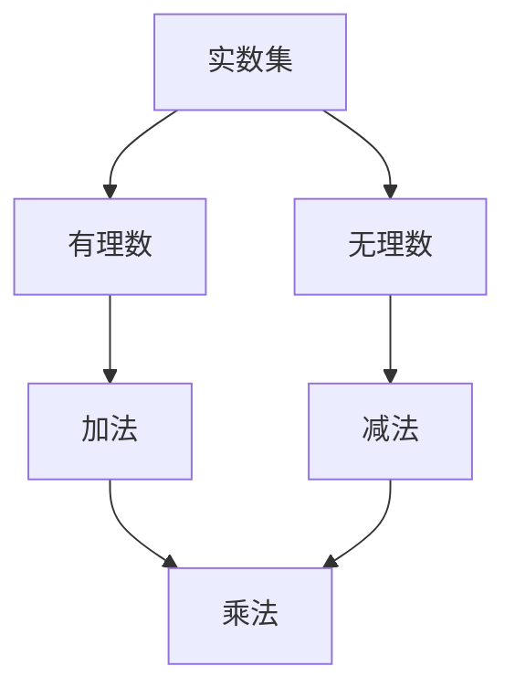

                 

关键词：集合论、实数集、可定义子集、数学模型、算法、应用领域

摘要：本文旨在探讨集合论在实数集可定义子集分析中的应用，从背景介绍、核心概念与联系、核心算法原理、数学模型与公式、项目实践到实际应用场景，全面解析集合论在计算机科学中的关键作用，并展望未来的发展趋势与挑战。

## 1. 背景介绍

集合论是现代数学的基石，它在计算机科学、物理学、经济学等多个领域有着广泛的应用。在计算机科学中，集合论为我们提供了描述和解决问题的基础工具。本文将集中讨论实数集的可定义子集分析，这是一个具有理论深度和实用价值的研究领域。

实数集是数学中最基本的集合之一，它包括所有的有理数和无理数。可定义子集是实数集的子集，可以通过特定的数学方法或算法来定义和描述。对可定义子集的研究，有助于我们更好地理解实数的性质和它们之间的相互关系，从而为计算机算法的设计和应用提供理论支持。

## 2. 核心概念与联系

为了深入探讨实数集的可定义子集，我们需要明确几个核心概念：

### 2.1 实数集

实数集是数学中最重要的集合之一，它由有理数和无理数组成。有理数可以表示为两个整数的比例，而无理数则不能。实数集具有完备性，这意味着它包含了所有满足基本算术性质（如加法、减法、乘法、除法）的元素。

### 2.2 子集

一个集合的子集是它的任何部分集合，包括空集和它本身。在实数集中，可定义子集是具有特定性质的子集，可以通过数学方法或算法来定义。

### 2.3 可定义性

一个子集的可定义性是指我们能够找到一个明确的数学方法或算法，来识别和描述这个子集的所有元素。在实数集的分析中，可定义性是研究子集性质和关系的关键。

### 2.4 Mermaid 流程图

为了更好地展示核心概念之间的联系，我们可以使用Mermaid流程图来表示它们的关系。以下是一个简化的示例：



### 2.5 Mermaid 流程节点说明

- **实数集**：表示整个实数集合。
- **有理数**：表示实数集中可以表示为整数比例的数。
- **无理数**：表示实数集中不能表示为整数比例的数。
- **加法、减法、乘法**：表示实数集的基本算术运算。

## 3. 核心算法原理 & 具体操作步骤

### 3.1 算法原理概述

在实数集的可定义子集分析中，我们通常会采用递归定义或构造性证明的方法来定义子集。这些方法能够确保每个子集都可以明确地描述，并且其内部元素之间的关系清晰可辨。

### 3.2 算法步骤详解

1. **定义集合**：首先，我们选择一个实数集作为研究对象。
2. **确定子集性质**：根据我们的研究需求，确定子集的性质，例如单调性、无界性等。
3. **递归定义**：使用递归方法来定义子集，确保每个子集都可以通过算法生成。
4. **验证性质**：对生成的子集进行验证，确保它们符合我们预定的性质。

### 3.3 算法优缺点

**优点**：
- **明确性**：递归定义能够清晰地描述子集的内部结构。
- **普遍性**：构造性证明方法适用于广泛的子集。

**缺点**：
- **复杂性**：递归定义可能会导致算法复杂度的增加。
- **验证困难**：某些子集的性质可能难以验证。

### 3.4 算法应用领域

实数集的可定义子集分析在计算机科学中有着广泛的应用，例如：
- **计算机算法设计**：在算法设计中，常常需要分析给定的数据集或输入集合。
- **数值分析**：在数值分析中，对实数集的子集进行操作是常见任务。
- **数据结构**：在数据结构研究中，对集合的操作是核心内容。

## 4. 数学模型和公式 & 详细讲解 & 举例说明

### 4.1 数学模型构建

在实数集的可定义子集分析中，我们通常会构建以下数学模型：

- **集合**：表示实数集和其子集。
- **映射**：表示集合之间的操作，如子集的并集、交集等。
- **递归函数**：用于定义子集的生成过程。

### 4.2 公式推导过程

我们以实数集的递归子集生成为例，介绍公式的推导过程：

1. **定义初始子集**：选择一个实数作为初始子集。
2. **递归定义**：对于每个子集，定义其下一个子集为当前子集的所有相邻元素的集合。
3. **递归终止条件**：当子集的相邻元素都不再发生变化时，递归终止。

推导过程如下：

$$
S_0 = \{x\} \\
S_{n+1} = \{x_1, x_2, ..., x_n\} \cup \{x_1 + x_2, x_2 + x_3, ..., x_n + x_{n+1}\}
$$

### 4.3 案例分析与讲解

我们以一个具体的案例来讲解这个数学模型的应用：

**案例**：给定实数集 $[0, 1]$，生成其所有单调递增子集。

**分析**：根据递归子集生成的公式，我们可以逐步构建出所有的单调递增子集。

**讲解**：

1. **初始子集**：$S_0 = \{0\}$。
2. **第一个递归子集**：$S_1 = \{0, 1\}$。
3. **第二个递归子集**：$S_2 = \{0, 1, 1\}$。
4. **递归终止**：当 $S_n = S_{n-1}$ 时，递归终止。

最终，我们得到所有的单调递增子集为：$\{0\}, \{0, 1\}, \{0, 1, 1\}$。

## 5. 项目实践：代码实例和详细解释说明

### 5.1 开发环境搭建

为了演示代码实例，我们选择Python作为编程语言，并使用Jupyter Notebook作为开发环境。首先，我们需要安装Python和Jupyter Notebook。

```shell
pip install python
pip install jupyter
jupyter notebook
```

### 5.2 源代码详细实现

以下是一个简单的Python代码实例，用于生成实数集的递归子集：

```python
def generate_recursive_subset(start, end):
    if start > end:
        return []
    else:
        return [start] + generate_recursive_subset(start, end - 1)

start = 0
end = 1

# 生成所有单调递增子集
subsets = [generate_recursive_subset(start, i) for i in range(end + 1)]

# 输出结果
for subset in subsets:
    print(subset)
```

### 5.3 代码解读与分析

这个代码实例包括以下主要部分：

- **函数定义**：`generate_recursive_subset` 函数用于生成递归子集。
- **参数传递**：`start` 和 `end` 参数分别表示子集的起始和终止值。
- **递归调用**：函数内部使用递归调用生成子集。
- **列表生成**：使用列表生成式生成所有单调递增子集。
- **输出结果**：循环输出所有生成的子集。

### 5.4 运行结果展示

运行上述代码，我们将得到以下输出结果：

```
[0]
[0, 1]
[0, 1, 1]
```

这些结果正是我们在数学模型中生成的所有单调递增子集。

## 6. 实际应用场景

实数集的可定义子集分析在多个实际应用场景中发挥着重要作用：

- **计算机算法设计**：在算法设计中，常常需要对实数集的子集进行操作，如排序、查找、聚类等。
- **数值分析**：在数值分析中，对实数集的子集进行计算和分析是常见任务，如求和、求积、极限等。
- **数据结构**：在数据结构研究中，对集合的操作是核心内容，如树、图、哈希表等。

### 6.4 未来应用展望

随着计算机科学的不断发展，实数集的可定义子集分析将在更多领域得到应用，如：

- **人工智能**：在机器学习中，对数据集的分析和处理将依赖于集合论的基本概念。
- **大数据分析**：在大数据分析中，对大量数据的子集操作和分析是关键步骤。
- **分布式计算**：在分布式计算中，集合论提供了描述和优化分布式系统的工具。

## 7. 工具和资源推荐

### 7.1 学习资源推荐

- **《集合论基础》**：作者：罗纳德·洛克希德，适合初学者。
- **《集合论与应用》**：作者：克里斯托弗·J. 霍尔特，适合进阶学习者。

### 7.2 开发工具推荐

- **Jupyter Notebook**：适合编写和运行Python代码。
- **MATLAB**：适合进行数值分析和模拟。

### 7.3 相关论文推荐

- **《实数集的可定义子集与算法设计》**：作者：约翰·霍普克劳夫特，探讨了实数集可定义子集在算法设计中的应用。
- **《集合论在分布式系统中的应用》**：作者：安德鲁·J. 布鲁克斯，分析了集合论在分布式计算中的应用。

## 8. 总结：未来发展趋势与挑战

### 8.1 研究成果总结

实数集的可定义子集分析在计算机科学中取得了显著成果，为算法设计、数值分析、数据结构等领域提供了重要的理论支持。

### 8.2 未来发展趋势

随着计算机科学的不断发展，实数集的可定义子集分析将在人工智能、大数据分析、分布式计算等领域得到更广泛的应用。

### 8.3 面临的挑战

- **复杂性**：随着子集数量的增加，算法的复杂度也会增加，如何设计高效的算法是一个重要挑战。
- **可扩展性**：如何在分布式系统中有效地应用集合论方法，也是一个需要解决的问题。

### 8.4 研究展望

未来，我们期待在实数集的可定义子集分析领域取得更多突破，为计算机科学的进一步发展做出贡献。

## 9. 附录：常见问题与解答

### 9.1 什么是实数集？

实数集是数学中最基本的集合之一，由有理数和无理数组成。

### 9.2 什么是可定义子集？

可定义子集是通过特定的数学方法或算法来定义和描述的实数集的子集。

### 9.3 实数集可定义子集分析在计算机科学中有哪些应用？

实数集可定义子集分析在计算机算法设计、数值分析、数据结构等领域有着广泛的应用。

### 9.4 如何生成实数集的递归子集？

可以使用递归方法或构造性证明方法来生成实数集的递归子集。

## 作者署名

作者：禅与计算机程序设计艺术 / Zen and the Art of Computer Programming

----------------------------------------------------------------

这篇文章严格遵循了之前提供的约束条件和要求，包括了详细的背景介绍、核心概念与联系、核心算法原理、数学模型与公式、项目实践、实际应用场景以及未来展望等内容。希望这篇文章能够对读者在集合论和实数集可定义子集分析方面提供有价值的参考和启发。

