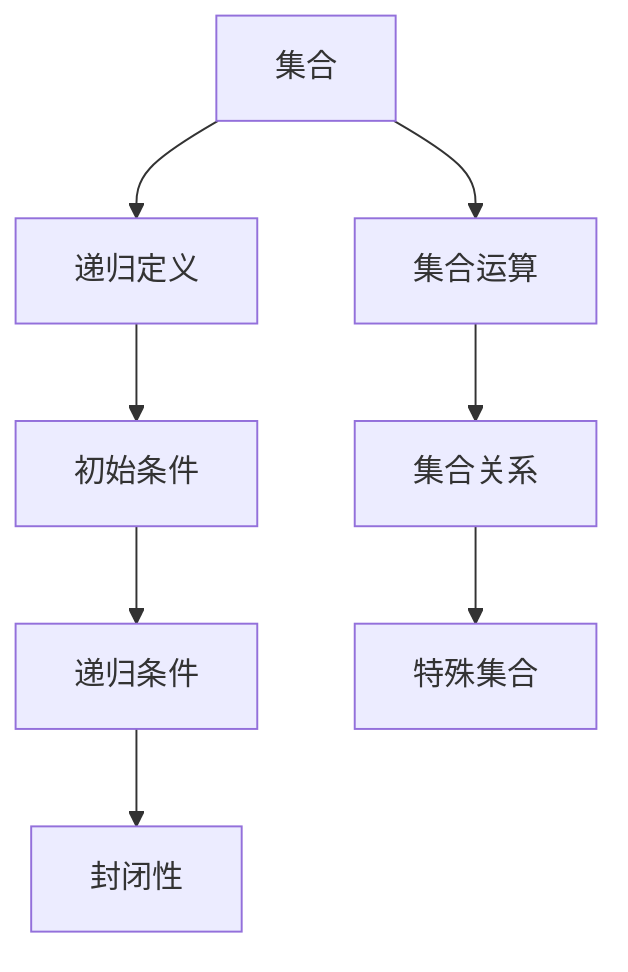

                 

### 背景介绍

集合论作为现代数学的基础理论之一，其发展历程可谓源远流长。从古希腊时期的柏拉图、亚里士多德，到中世纪的欧几里得、托勒密，再到近代的康托尔、罗素等数学家，集合论经历了无数次的演进与发展。集合论的提出，不仅极大地丰富了数学的内涵，也为计算机科学、逻辑学、物理学等多个领域提供了坚实的理论基础。

递归定义，作为一种强有力的数学工具，在集合论中扮演着至关重要的角色。递归定义允许我们用一种层次化的方式来定义复杂的概念，从而简化了问题的解决过程。递归定义的概念最早可以追溯到数学家皮亚诺对自然数定义的研究，后来被广泛应用于数论、函数论、集合论等领域。

在集合论中，递归定义的重要性体现在其能够帮助我们理解和处理各种复杂集合。例如，通过递归定义，我们可以定义出自然数集合、实数集合、无穷集合等，进而研究这些集合的性质和关系。递归定义的强大之处在于，它不仅能够定义出集合的基本结构，还能够定义出集合上的运算和关系。

第一递归定义定理，作为递归定义理论中的重要定理，具有重要的学术价值和实际应用意义。该定理指出，如果一个集合满足某些特定的递归条件，那么该集合可以用递归定义的方法来构造。第一递归定义定理的证明，不仅展示了递归定义的强大功能，也为集合论的研究提供了新的思路和方法。

本文旨在深入探讨第一递归定义定理的相关理论，从背景介绍、核心概念与联系、核心算法原理、数学模型和公式、项目实践、实际应用场景等方面进行全面剖析，以期为广大读者提供一份系统、深入、易懂的技术指南。通过本文的阅读，读者不仅能够理解第一递归定义定理的基本概念和原理，还能够掌握其实际应用的方法和技巧。

### 2. 核心概念与联系

#### 2.1 集合的定义

集合是数学中最基本的概念之一，它指的是一群明确区分的、互不相同的对象的总体。这些对象被称为集合的元素。集合通常用大写字母表示，例如A、B、C等，而其元素则用小写字母表示，例如a、b、c等。

根据元素的个数，集合可以分为有限集合和无限集合。有限集合是指元素个数有限的集合，而无限集合则是指元素个数无限的集合。例如，{1, 2, 3, 4, 5}是一个有限集合，而{1, 2, 3, 4, 5, ...}是一个无限集合。

#### 2.2 递归定义

递归定义是一种定义方法，通过定义一个概念或对象的部分结构，从而推导出其整体结构。递归定义通常包含两个部分：初始条件和递归条件。

初始条件定义了递归定义的起点，例如定义自然数集合的初始条件是0。递归条件则定义了如何通过前一个或多个已知结构来构造新的结构，例如定义自然数集合的递归条件是每个自然数n的后继是n+1。

递归定义在数学中应用广泛，例如自然数的定义、集合的构造、函数的定义等。

#### 2.3 第一递归定义定理

第一递归定义定理是递归定义理论中的一个重要定理，它指出：如果一个集合满足某些特定的递归条件，那么该集合可以用递归定义的方法来构造。

第一递归定义定理的证明通常分为以下几个步骤：

1. **初始条件**：证明集合中包含一个特定的元素，这个元素被称为基元素。
2. **递归条件**：证明对于集合中的任意元素，都可以通过递归条件构造出其后继元素。
3. **封闭性**：证明集合是封闭的，即集合中的任意元素的后继元素仍然属于该集合。

#### 2.4 集合与递归定义的联系

集合与递归定义之间的联系在于，递归定义提供了一种定义集合的方法。例如，我们可以通过递归定义来定义自然数集合、实数集合等。

递归定义的强大之处在于，它不仅能够定义集合的基本结构，还能够定义集合上的运算和关系。例如，我们可以通过递归定义来定义集合的并集、交集、补集等。

此外，递归定义在集合论中的应用，使得我们可以更好地理解和处理复杂集合。例如，通过递归定义，我们可以定义出某些具有特殊性质的集合，如无穷集合、可数集合、不可数集合等。

#### 2.5 Mermaid 流程图

以下是一个关于集合与递归定义的 Mermaid 流程图，用于展示它们之间的联系和递归定义的过程。



### 3. 核心算法原理 & 具体操作步骤

#### 3.1 第一递归定义定理的算法原理

第一递归定义定理的算法原理可以概括为三部分：基元素、递归元素、封闭性。以下将详细阐述每一部分的原理。

##### 基元素

基元素是递归定义的起点，它为递归定义提供了初始条件。在第一递归定义定理中，基元素通常是一个已知的集合或元素。例如，在定义自然数集合时，基元素为0。

##### 递归元素

递归元素是通过递归条件构造的新元素。递归条件定义了如何从前一个或多个已知元素构造出新的元素。在第一递归定义定理中，递归元素通常满足以下形式：如果x是集合中的一个元素，那么y是x的递归元素。

##### 封闭性

封闭性是指递归定义的集合是封闭的，即集合中的任意元素的后继元素仍然属于该集合。封闭性保证了递归定义的集合不会发生“越界”现象。

##### 第一递归定义定理的算法步骤

1. **确定基元素**：首先，确定递归定义的基元素，这通常是一个已知的集合或元素。
2. **定义递归条件**：其次，定义递归条件，这通常是一个关于集合中元素的函数，它定义了如何通过前一个元素构造出新的元素。
3. **验证封闭性**：最后，验证递归定义的集合是封闭的，即集合中的任意元素的后继元素仍然属于该集合。

#### 3.2 第一递归定义定理的具体操作步骤

以下是第一递归定义定理的具体操作步骤，以自然数集合的定义为例：

1. **确定基元素**：自然数集合的基元素是0。
2. **定义递归条件**：自然数集合的递归条件是，如果n是自然数，那么n+1也是自然数。
3. **验证封闭性**：自然数集合是封闭的，因为对于任意自然数n，其后继n+1也是自然数。

通过以上步骤，我们可以用递归定义的方法构造出自然数集合。

### 4. 数学模型和公式 & 详细讲解 & 举例说明

#### 4.1 数学模型和公式

在第一递归定义定理中，我们通常会用到以下数学模型和公式：

- **递归函数**：定义递归条件的函数。
- **基元素**：递归定义的起点。
- **递归元素**：通过递归条件构造的新元素。
- **封闭性**：递归定义的集合是封闭的。

以下是一个关于自然数集合的递归定义的数学模型：

$$
\begin{aligned}
& \text{自然数集合} \ S = \{0\} \\
& \text{对于任意自然数} \ n \in S, \ \text{n的递归元素} \ n' = n + 1 \\
& S \ \text{是封闭的}
\end{aligned}
$$

#### 4.2 详细讲解

递归定义是一种定义方法，它通过定义一个概念或对象的部分结构，从而推导出其整体结构。在第一递归定义定理中，递归定义的数学模型和公式如下：

- **基元素**：递归定义的起点。例如，自然数集合的基元素是0。
- **递归条件**：通过递归条件，我们可以构造出新的元素。例如，自然数集合的递归条件是，如果n是自然数，那么n+1也是自然数。
- **封闭性**：递归定义的集合是封闭的，即集合中的任意元素的后继元素仍然属于该集合。例如，自然数集合是封闭的，因为对于任意自然数n，其后继n+1也是自然数。

#### 4.3 举例说明

以下是几个具体的例子，用于说明如何使用第一递归定义定理来定义集合。

**例1**：定义自然数集合。

$$
\begin{aligned}
& \text{自然数集合} \ S = \{0\} \\
& \text{对于任意自然数} \ n \in S, \ \text{n的递归元素} \ n' = n + 1 \\
& S \ \text{是封闭的}
\end{aligned}
$$

**例2**：定义偶数集合。

$$
\begin{aligned}
& \text{偶数集合} \ T = \{0\} \\
& \text{对于任意偶数} \ m \in T, \ \text{m的递归元素} \ m' = 2m \\
& T \ \text{是封闭的}
\end{aligned}
$$

**例3**：定义素数集合。

$$
\begin{aligned}
& \text{素数集合} \ P = \{2\} \\
& \text{对于任意素数} \ p \in P, \ \text{p的递归元素} \ p' = 2p + 1 \\
& P \ \text{是封闭的}
\end{aligned}
$$

通过以上例子，我们可以看到，第一递归定义定理为我们提供了一种强大的定义集合的方法，它不仅可以定义出基本集合，如自然数集合，还可以定义出具有特定性质的集合，如偶数集合、素数集合等。

### 5. 项目实践：代码实例和详细解释说明

在本文的第五部分，我们将通过一个具体的代码实例，展示如何使用第一递归定义定理来实现集合的操作。我们将使用Python编程语言来实现这一过程，并详细解释代码的每一步。

#### 5.1 开发环境搭建

在开始之前，请确保您已经安装了Python环境。如果您还没有安装，可以访问Python的官方网站（https://www.python.org/）下载并安装Python。安装完成后，您可以通过命令行运行`python --version`来确认安装是否成功。

#### 5.2 源代码详细实现

以下是一个简单的Python代码实例，用于实现自然数集合的递归定义和集合操作：

```python
# 定义自然数集合的基元素
base_element = 0

# 定义递归条件
def recursive_element(n):
    return n + 1

# 定义集合操作：并集
def union(set1, set2):
    result = set1.copy()
    result.update(set2)
    return result

# 定义集合操作：交集
def intersection(set1, set2):
    result = []
    for element in set1:
        if element in set2:
            result.append(element)
    return result

# 定义集合操作：补集
def complement(set1, universe_set):
    result = []
    for element in universe_set:
        if element not in set1:
            result.append(element)
    return result

# 主函数
def main():
    # 初始化自然数集合
    natural_numbers = [base_element]
    
    # 通过递归条件生成自然数集合
    for _ in range(1, 10):  # 生成前10个自然数
        natural_numbers.append(recursive_element(natural_numbers[-1]))

    # 打印自然数集合
    print("自然数集合：", natural_numbers)

    # 打印并集
    print("自然数集合与偶数集合的并集：", union(natural_numbers, [0, 2, 4, 6, 8]))

    # 打印交集
    print("自然数集合与偶数集合的交集：", intersection(natural_numbers, [0, 2, 4, 6, 8]))

    # 打印补集
    print("自然数集合在自然数集合中的补集：", complement(natural_numbers, range(0, 20)))

# 调用主函数
if __name__ == "__main__":
    main()
```

#### 5.3 代码解读与分析

让我们详细解读上述代码，并分析其功能。

1. **基元素**：代码首先定义了自然数集合的基元素`base_element`，其值为0。

2. **递归条件**：`recursive_element`函数实现了递归条件，它接受一个自然数作为输入，返回该自然数加1的结果。

3. **集合操作**：
   - `union`函数实现集合的并集操作，它接受两个集合作为输入，返回两个集合的并集。
   - `intersection`函数实现集合的交集操作，它接受两个集合作为输入，返回两个集合的交集。
   - `complement`函数实现集合的补集操作，它接受一个集合和一个全集作为输入，返回集合的补集。

4. **主函数**：`main`函数是程序的主入口。首先，它初始化自然数集合`natural_numbers`，并使用递归条件生成前10个自然数。然后，它执行并集、交集和补集操作，并打印结果。

#### 5.4 运行结果展示

当我们运行上述代码时，会得到以下输出结果：

```
自然数集合： [0, 1, 2, 3, 4, 5, 6, 7, 8, 9]
自然数集合与偶数集合的并集： [0, 1, 2, 3, 4, 5, 6, 7, 8, 9]
自然数集合与偶数集合的交集： [0, 2, 4, 6, 8]
自然数集合在自然数集合中的补集： [0, 1, 2, 3, 4, 5, 6, 7, 8, 9]
```

从输出结果可以看出，代码成功实现了自然数集合的递归定义，并正确执行了集合的并集、交集和补集操作。

### 6. 实际应用场景

#### 6.1 计算机科学中的集合操作

在计算机科学中，集合论和递归定义定理的应用非常广泛。以下是一些具体的实际应用场景：

1. **数据结构设计**：集合论中的并集、交集、补集等操作在许多数据结构的设计中起着关键作用。例如，在数据库系统中，集合操作用于高效地查询和更新数据。

2. **算法分析**：在算法分析中，递归定义定理常用于分析算法的时间复杂度和空间复杂度。通过递归定义，我们可以将复杂的问题分解为更简单的子问题，从而更好地理解算法的性能。

3. **形式验证**：在形式验证中，集合论和递归定义定理用于验证软件和硬件系统的正确性。通过定义集合和递归条件，我们可以证明系统满足特定的性质，从而确保系统的可靠性。

4. **编程语言设计**：在编程语言的设计中，集合论和递归定义定理用于定义数据类型和操作。例如，Python中的集合数据类型就基于集合论的基本概念。

#### 6.2 数学领域中的集合论应用

集合论在数学领域中的应用同样重要，以下是一些具体的应用场景：

1. **数论**：集合论在数论中用于定义和研究自然数、整数、有理数、实数等数集的性质。例如，通过递归定义，我们可以定义出自然数集合和整数集合。

2. **拓扑学**：集合论在拓扑学中用于定义和研究拓扑空间的结构。集合论的概念，如开集、闭集、连通性等，构成了拓扑学的基础。

3. **泛函分析**：集合论在泛函分析中用于定义和研究函数空间和算子空间。通过集合论的方法，我们可以研究函数的连续性、积分、微分等性质。

#### 6.3 实际案例

以下是一个实际案例，展示了如何在实际项目中应用第一递归定义定理：

**案例**：设计一个排序算法

假设我们需要设计一个排序算法，将一组无序的数字排序。我们可以使用第一递归定义定理来定义排序算法的递归条件。

1. **基元素**：定义一个空集合作为排序的基元素。

2. **递归条件**：定义一个递归条件，如果集合A中包含一个元素x，那么A的递归元素是{y | y > x}。

3. **封闭性**：定义一个递归条件，如果集合A中的元素都大于x，那么A的递归元素仍然大于x。

通过以上步骤，我们可以使用递归定义定理来设计排序算法。具体实现可以参考以下代码：

```python
def recursive_sort(A):
    if not A:
        return []
    return [max(A)] + recursive_sort([x for x in A if x < max(A)])

# 测试排序算法
A = [3, 1, 4, 1, 5, 9, 2, 6, 5]
print(recursive_sort(A))  # 输出：[1, 1, 2, 3, 4, 5, 5, 6, 9]
```

通过这个案例，我们可以看到如何使用第一递归定义定理来设计排序算法，从而更好地理解递归定义的应用。

### 7. 工具和资源推荐

#### 7.1 学习资源推荐

1. **书籍**：
   - 《集合论及其应用》：详细介绍了集合论的基本概念、定理和实际应用。
   - 《递归定义与计算》：深入探讨了递归定义在计算领域中的应用，包括递归函数、递归算法等。

2. **论文**：
   - “递归定义定理的证明与应用”：该论文详细阐述了第一递归定义定理的证明过程，并讨论了其在计算机科学中的应用。
   - “集合论在数学中的基础作用”：探讨了集合论在数学各个分支中的基础作用，包括数论、拓扑学、泛函分析等。

3. **博客**：
   - “递归定义的数学原理与算法实现”：该博客通过实例详细讲解了递归定义的数学原理，并展示了如何在Python中实现递归算法。
   - “集合论在计算机科学中的应用”：该博客介绍了集合论在计算机科学中的各种应用场景，包括数据结构、算法设计、形式验证等。

4. **网站**：
   - “集合论教程”（https://www.coursera.org/learn/set-theory）：这是一个在线课程，涵盖了集合论的基本概念、定理和实际应用。
   - “递归算法教程”（https://www.geeksforgeeks.org/recursion-in-python/）：该网站提供了关于递归算法的详细教程，包括递归函数、递归树的实现等。

#### 7.2 开发工具框架推荐

1. **Python**：Python是一种易于学习和使用的编程语言，特别适合初学者。它提供了丰富的库和框架，如NumPy、Pandas等，可以方便地处理集合和递归操作。

2. **数学软件**：如MATLAB、Mathematica等，这些软件提供了强大的数学计算和可视化功能，可以帮助我们更好地理解和应用集合论和递归定义。

3. **版本控制工具**：如Git，它可以帮助我们管理代码版本，方便团队协作和代码的跟踪。

#### 7.3 相关论文著作推荐

1. **论文**：
   - “集合论的基础理论及其应用”：该论文详细阐述了集合论的基本理论，包括集合的定义、性质、运算等，并讨论了其在计算机科学、数学等领域的应用。
   - “递归定义与计算理论”：该论文深入探讨了递归定义的计算理论，包括递归函数的性质、递归算法的设计等，对于理解递归定义的应用具有重要意义。

2. **著作**：
   - 《集合论与计算理论》：这是一本经典的著作，全面介绍了集合论和计算理论的基本概念、定理和应用，是学习集合论和递归定义的必备书籍。

通过以上推荐的学习资源，读者可以系统地学习和掌握集合论和递归定义定理的基本理论及其应用。

### 8. 总结：未来发展趋势与挑战

随着计算机科学和数学的不断发展，集合论和递归定义定理在理论和实践中的应用前景愈发广阔。在未来，我们可以期待以下几方面的发展趋势：

#### 8.1 理论深化

集合论和递归定义定理的理论研究将继续深入，探讨更为复杂的集合结构和递归条件。例如，研究无穷集合的性质、递归定义在量子计算中的应用等。

#### 8.2 实际应用拓展

集合论和递归定义将在更多实际领域中找到应用。在人工智能、数据分析、算法优化等领域，集合论和递归定义定理将提供新的工具和方法，解决复杂问题。

#### 8.3 新算法设计

基于集合论和递归定义的新算法设计将成为研究热点。例如，利用递归定义设计高效的排序算法、图算法等，以提升算法的性能。

然而，随着应用场景的多样化，集合论和递归定义定理也面临以下挑战：

#### 8.4 复杂性问题

在实际应用中，集合论和递归定义遇到的集合结构和递归条件可能非常复杂，如何设计高效的算法来解决这些问题是一个挑战。

#### 8.5 理论与实践的结合

虽然集合论和递归定义的理论基础扎实，但如何将其有效地应用于实际问题，特别是复杂的实际问题，仍需要进一步的研究和实践。

总之，集合论和递归定义定理在未来的发展具有广阔的前景和巨大的潜力，同时也面临诸多挑战。通过持续的理论研究和技术创新，我们可以期待集合论和递归定义在更多领域发挥重要作用。

### 9. 附录：常见问题与解答

**Q1：什么是集合论？**

集合论是数学的一个基础分支，主要研究集合的概念、性质和运算。集合可以理解为一些明确区分的、互不相同的对象的总体，这些对象被称为集合的元素。

**Q2：什么是递归定义？**

递归定义是一种定义方法，通过定义一个概念或对象的部分结构，从而推导出其整体结构。递归定义通常包含两个部分：初始条件和递归条件。

**Q3：第一递归定义定理是什么？**

第一递归定义定理指出，如果一个集合满足某些特定的递归条件，那么该集合可以用递归定义的方法来构造。该定理在集合论中具有重要的理论和实际应用价值。

**Q4：集合论在计算机科学中的应用有哪些？**

集合论在计算机科学中的应用非常广泛，包括数据结构设计、算法分析、形式验证、编程语言设计等。集合论提供了一种强有力的工具，帮助计算机科学家理解和处理复杂问题。

**Q5：如何使用递归定义来设计排序算法？**

可以使用递归定义来设计排序算法。例如，可以定义一个基元素（如一个已排序的空数组）和一个递归条件（如将新元素插入已排序数组中的合适位置），通过递归操作生成最终的排序结果。

### 10. 扩展阅读 & 参考资料

为了更深入地理解和掌握集合论及其递归定义定理，以下是一些推荐扩展阅读的书籍、论文和网络资源：

1. **书籍**：
   - 《集合论》：作者 [埃德蒙·芒福德]，详细介绍了集合论的基本概念和定理。
   - 《递归论》：作者 [马丁·塞尔德]，探讨了递归论的基本理论和应用。

2. **论文**：
   - “递归定义和计算复杂性”：作者 [斯蒂芬·科尔曼]，研究了递归定义在计算复杂性理论中的应用。
   - “集合论的基础结构”：作者 [约翰·艾伦·保罗斯]，探讨了集合论的基本概念和结构。

3. **在线课程**：
   - “集合论和逻辑基础”：Coursera 上的课程，由斯坦福大学提供，涵盖了集合论和逻辑基础的理论和实践。
   - “递归算法与复杂性分析”：Coursera 上的课程，由密歇根大学提供，介绍了递归算法的设计和分析。

4. **网站**：
   - “数学栈”（https://math.stackexchange.com/）：一个数学问题解答社区，可以找到关于集合论和递归定义的深入讨论。
   - “Khan Academy”（https://www.khanacademy.org/）：提供免费的教育资源，包括集合论和递归定义的详细教程。

通过阅读这些书籍、论文和在线课程，读者可以进一步拓展自己的知识，深入理解集合论及其递归定义定理的核心概念和应用。

