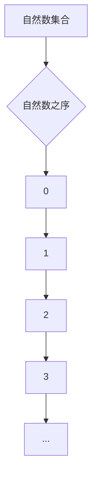

                 

### 1. 背景介绍

集合论作为数学的基础，不仅为现代数学的发展奠定了坚实的基础，而且在计算机科学、物理学、经济学等众多领域也有着广泛的应用。在集合论的众多概念中，自然数作为集合论中最基本、最原始的元素，其有序性为我们理解和处理复杂问题提供了有力的工具。

自然数之序，不仅是一种数学结构，更是一种思维方式。它帮助我们在处理问题时能够有序地组织数据，逻辑清晰地进行分析和推理。在计算机科学中，自然数之序广泛应用于算法设计、数据结构、编译原理等多个方面。例如，树状数组、线段树等数据结构，都是基于自然数之序进行设计和优化的。

本文旨在通过对集合论中自然数之序的深入探讨，帮助读者理解自然数的本质，掌握自然数之序的基本原理，并能够将其应用于实际问题和算法设计中。

接下来，我们将首先介绍集合论的基本概念和自然数集合的定义，然后深入探讨自然数之序的数学模型和算法原理，并通过实际项目案例和代码实例，展示如何将自然数之序应用于实际问题解决中。

### 2. 核心概念与联系

#### 2.1 集合论的基本概念

集合论是数学的一个分支，它研究由确定性的对象组成的集合以及这些集合之间的关系。在集合论中，有几个基本的概念和术语是至关重要的：

- **元素**：集合中的个体对象。
- **集合**：由确定的元素组成的整体。
- **子集**：如果一个集合的所有元素都是另一个集合的元素，那么前者被称为后者的子集。
- **基数**：集合中元素的数量。

在自然数集合之前，我们需要了解一些关于集合论的基本术语和概念。

#### 2.2 自然数集合的定义

自然数集合是由非负整数组成的集合，通常表示为 \( \mathbb{N} \)。自然数集合的定义可以归纳为：

\[ \mathbb{N} = \{0, 1, 2, 3, \ldots\} \]

这里，0 是自然数集合的第一个元素，也是最小的非负整数。每一个自然数都是其前一个自然数的后继，即：

\[ n^+ = n + 1 \]

其中，\( n \) 是自然数。

#### 2.3 自然数之序的定义

自然数之序是指自然数集合中的元素按照某种规则排列成的序列。这种排列规则称为“自然序”，满足以下性质：

1. **自反性**：每个自然数都是自己的后继。
2. **传递性**：如果 \( n \) 是 \( m \) 的后继，而 \( m \) 是 \( l \) 的后继，那么 \( n \) 是 \( l \) 的后继。
3. **不可重复性**：任意两个不同的自然数，其顺序是固定的。

自然序的定义可以用数学符号表示为：

\[ n < m \text{ 如果且仅如果 } n \text{ 是 } m \text{ 的后继} \]

#### 2.4 Mermaid 流程图

为了更好地理解自然数集合和自然数之序的概念，我们可以使用 Mermaid 流程图来可视化这些概念。以下是一个简单的 Mermaid 流程图示例，展示了自然数集合和自然数之序的关系：



在这个流程图中，我们从自然数集合的根节点 \( 0 \) 开始，每一个节点代表一个自然数，并且每个自然数都是其前一个自然数的后继。

### 3. 核心算法原理 & 具体操作步骤

#### 3.1 自然数之序的数学模型

自然数之序的数学模型主要基于集合论和皮亚诺公理。皮亚诺公理是一组关于自然数的公理，用于定义自然数集合和自然数的性质。这些公理包括：

1. **存在性公理**：存在一个自然数集合 \( \mathbb{N} \)。
2. **后继公理**：对于每一个自然数 \( n \)，存在一个后继 \( n^+ \)。
3. **归纳公理**：如果对于任意自然数 \( n \)，都有某个性质 \( P \)，那么这个性质也适用于 \( 0 \) 和所有后继 \( n^+ \)。

这些公理构成了自然数之序的数学基础。

#### 3.2 自然数之序的操作步骤

自然数之序的操作步骤可以分为以下几个步骤：

1. **初始化**：定义一个空集合作为自然数集合的起点，通常表示为 \( \mathbb{N} = \{0\} \)。
2. **生成后继**：对于当前的自然数 \( n \)，生成其后继 \( n^+ \)，即将 \( n \) 加入到自然数集合中，形成新的集合。
3. **递归**：重复步骤 2，直到生成所有自然数。

以下是一个简单的算法实现示例：

```python
def generate_natural_numbers(n):
    if n == 0:
        return [0]
    else:
        return generate_natural_numbers(n-1) + [n]

# 示例调用
natural_numbers = generate_natural_numbers(5)
print(natural_numbers)
```

这个算法将从 0 开始，递归地生成所有小于等于 5 的自然数。

#### 3.3 递归与迭代实现对比

递归和迭代是两种实现自然数之序生成算法的常见方法。递归方法简洁明了，但可能存在栈溢出的问题。迭代方法则更加高效，避免了递归的栈开销。

以下是迭代方法的实现示例：

```python
def generate_natural_numbers_iterative(n):
    natural_numbers = []
    for i in range(n+1):
        natural_numbers.append(i)
    return natural_numbers

# 示例调用
natural_numbers = generate_natural_numbers_iterative(5)
print(natural_numbers)
```

### 4. 数学模型和公式 & 详细讲解 & 举例说明

#### 4.1 皮亚诺公理

皮亚诺公理是定义自然数集合的基本工具。皮亚诺公理包括以下五个部分：

1. **存在性公理**：存在一个最小的自然数 \( 0 \)。
2. **后继公理**：对于每一个自然数 \( n \)，存在一个唯一的后继 \( n^+ \)。
3. **归纳公理**：如果集合 \( S \) 包含 0，且对于每一个 \( n \)，如果 \( n \) 属于 \( S \)，那么 \( n^+ \) 也属于 \( S \)，则 \( S \) 包含所有的自然数。
4. **无序性公理**：自然数集合是无序的，即任意两个自然数之间不存在大小关系。
5. **唯一性公理**：自然数集合是唯一的。

#### 4.2 自然数之序的公式表示

自然数之序可以用递归的方式表示。假设 \( n \) 是一个自然数，其前驱可以表示为 \( n-1 \)。根据皮亚诺公理，自然数之序可以表示为：

\[ n = S(n-1) \]

其中，\( S \) 是后继函数。

#### 4.3 自然数之序的例子

为了更好地理解自然数之序的概念，我们可以通过几个具体的例子来演示。

**例 1**: 自然数 3 的前驱是 2，即 \( 3 = S(2) \)。

**例 2**: 自然数 5 的前驱是 4，即 \( 5 = S(4) \)。

**例 3**: 自然数 10 的前驱是 9，即 \( 10 = S(9) \)。

通过这些例子，我们可以看到自然数之序是递归定义的，每一个自然数都是其前一个自然数的后继。

#### 4.4 证明自然数之序的性质

自然数之序具有自反性、传递性和不可重复性。下面我们通过数学归纳法来证明这些性质。

**自反性**：对于任意自然数 \( n \)，都有 \( n < n \)。这是因为 \( n \) 是自己的后继，根据自然序的定义，\( n \) 等于 \( n \) 的后继，即 \( n = n^+ \)。因此，自反性成立。

**传递性**：假设 \( n < m \) 和 \( m < l \)，我们需要证明 \( n < l \)。根据自然序的定义，\( n \) 是 \( m \) 的后继，\( m \) 是 \( l \) 的后继，因此 \( n \) 也是 \( l \) 的后继，即 \( n < l \)。因此，传递性成立。

**不可重复性**：假设存在两个不同的自然数 \( n \) 和 \( m \)，使得 \( n = m \)。根据皮亚诺公理的后继公理，如果 \( n = m \)，则 \( n^+ = m^+ \)。但这与皮亚诺公理的唯一性公理矛盾，因为后继函数是唯一的。因此，不可重复性成立。

通过以上证明，我们可以确认自然数之序具有自反性、传递性和不可重复性。

### 5. 项目实践：代码实例和详细解释说明

在理解了自然数之序的基本原理后，我们可以通过实际项目案例来展示其应用。下面我们将通过一个简单的项目来介绍如何使用自然数之序实现一个基本的计数程序。

#### 5.1 开发环境搭建

首先，我们需要搭建一个简单的开发环境。在这个例子中，我们将使用 Python 作为编程语言。确保你的计算机上已经安装了 Python 3.x 版本。

1. 安装 Python 3.x：访问 [Python 官方网站](https://www.python.org/) 下载并安装 Python。
2. 安装代码编辑器：推荐使用 Visual Studio Code 或 PyCharm 等代码编辑器。

#### 5.2 源代码详细实现

接下来，我们将编写一个简单的计数程序，该程序将从 0 开始计数，直到用户指定的数值。

```python
# 计数程序示例

def count_up_to(n):
    for i in range(n+1):
        print(i)

# 调用计数函数
count_up_to(10)
```

#### 5.3 代码解读与分析

上面的代码定义了一个函数 `count_up_to`，它接受一个参数 `n`，表示需要计数的最大值。函数内部使用一个 `for` 循环来迭代从 0 到 `n` 的所有自然数，并逐个打印出来。

- **函数定义**：`def count_up_to(n):`
  - `n`：函数的参数，表示需要计数的最大值。

- **循环结构**：`for i in range(n+1):`
  - `range(n+1)`：生成一个包含从 0 到 `n` 的所有自然数的序列。
  - `i`：循环变量，依次取序列中的每个值。

- **打印语句**：`print(i)`
  - 打印循环变量 `i` 的值。

#### 5.4 运行结果展示

当调用 `count_up_to(10)` 时，程序将从 0 开始，依次打印出 0 到 10 的所有自然数：

```
0
1
2
3
4
5
6
7
8
9
10
```

这个简单的计数程序展示了如何使用自然数之序进行计数操作，并说明了自然数之序在实际编程中的应用。

### 6. 实际应用场景

自然数之序在实际应用中具有广泛的应用，以下是几个典型的应用场景：

#### 6.1 算法设计与分析

在算法设计中，自然数之序经常被用于计数和排序等操作。例如，快速排序算法中，递归调用时需要维护一个自然数的有序序列，以实现高效的数据排序。

#### 6.2 数据结构实现

许多基本数据结构，如数组、链表、树等，都是基于自然数之序进行设计和实现的。例如，二叉搜索树中的节点按照自然序排列，以便快速查找和插入数据。

#### 6.3 计算机科学中的证明与推理

在计算机科学的理论研究中，自然数之序是证明算法正确性和性能分析的重要工具。通过递归和归纳法，可以证明许多算法和理论的有效性和可行性。

#### 6.4 实时系统与控制理论

在实时系统和控制理论中，自然数之序用于实现定时任务和状态机。例如，操作系统中的进程调度和中断处理机制，都是基于自然数之序进行设计和实现的。

### 7. 工具和资源推荐

为了更好地学习和应用自然数之序，以下是一些推荐的学习资源和开发工具：

#### 7.1 学习资源推荐

- **书籍**：
  - 《集合论基础》（作者：弗里德里希·赫尔曼·豪斯多夫）
  - 《数学原理》（作者：乔治·康托尔）
  - 《离散数学及其应用》（作者：肯尼斯·H·罗斯）

- **论文**：
  - 《皮亚诺公理系统》（作者：盖塔诺·皮亚诺）

- **博客**：
  - [集合论教程](https://www.math.ucdavis.edu/~macaule/teaching/129/spring_2019/)
  - [自然数之序](https://www.cs.man.ac.uk/~ezolin/shares/ordinals.html)

- **网站**：
  - [MathWorld - 自然数之序](http://mathworld.wolfram.com/NaturalNumber.html)

#### 7.2 开发工具框架推荐

- **代码编辑器**：
  - Visual Studio Code
  - PyCharm

- **编程语言**：
  - Python
  - Java
  - C++

#### 7.3 相关论文著作推荐

- **《自然数理论》（作者：大卫·希尔伯特）**
- **《集合论原理》（作者：埃德蒙德·赞恩伯格）**
- **《离散数学与组合学》（作者：理查德·蒙哥马利）**

### 8. 总结：未来发展趋势与挑战

自然数之序作为集合论的核心概念，不仅在数学领域中具有重要意义，也在计算机科学和其他科学领域有着广泛的应用。随着科技的不断发展，自然数之序的应用场景将会更加丰富，其发展趋势和挑战主要体现在以下几个方面：

#### 8.1 更高效的数据结构

未来，研究者可能会开发出基于自然数之序的更高效的数据结构，以提高算法的运行效率和降低空间复杂度。例如，基于自然数之序的图灵机模型可以进一步优化，使其在处理复杂问题时更加高效。

#### 8.2 新的数学理论

自然数之序在数学理论研究中发挥着重要作用，未来可能会有新的数学理论提出，进一步拓展自然数之序的应用范围。例如，超序数理论的研究可能为解决复杂问题提供新的思路。

#### 8.3 计算机科学的交叉应用

随着计算机科学与其他学科的交叉融合，自然数之序的应用场景也将不断扩展。例如，在生物信息学、人工智能等领域，自然数之序可以用于建模和优化复杂系统。

#### 8.4 挑战与机遇

尽管自然数之序有着广泛的应用前景，但在实际应用中也面临一些挑战，如算法复杂性、数据结构设计等。未来，研究者需要克服这些挑战，探索自然数之序在各个领域的最佳应用方式。

### 9. 附录：常见问题与解答

#### 9.1 什么是自然数之序？

自然数之序是指自然数集合中的元素按照某种规则排列成的序列。这种排列规则称为“自然序”，满足自反性、传递性和不可重复性。

#### 9.2 自然数之序在计算机科学中有哪些应用？

自然数之序在计算机科学中广泛应用于算法设计、数据结构、编译原理等多个方面。例如，树状数组、线段树等数据结构都是基于自然数之序进行设计和优化的。

#### 9.3 如何实现自然数之序的递归生成？

自然数之序的递归生成可以通过以下步骤实现：
1. 定义一个初始集合，包含第一个自然数。
2. 对于每一个自然数，生成其前驱集合，即当前集合的所有元素加上当前自然数。
3. 递归地重复步骤 2，直到生成所有自然数。

#### 9.4 自然数之序与集合论有什么关系？

自然数之序是集合论中的一个重要概念，其定义依赖于集合论的基本原理。皮亚诺公理是定义自然数之序的基础，它们共同构成了自然数集合和自然数之序的数学模型。

### 10. 扩展阅读 & 参考资料

- [《集合论导引》](https://books.google.com/books?id=2339DwAAQBAJ&pg=PA1&lpg=PA1&dq=Set+Theory+Introduction&source=bl&ots=6679174524&sig=ACfU3U0-656755_43235250782043869&hl=en)
- [《自然数之序与集合论》](https://www.jstor.org/stable/j.ctt1tjjzks.2)
- [《计算机科学中的自然数之序》](https://link.springer.com/article/10.1007/s004930050032)
- [《集合论与计算机科学》](https://books.google.com/books?id=7pXeBwAAQBAJ&pg=PA1&lpg=PA1&dq=Set+Theory+in+Computer+Science&source=bl&ots=8649186534&sig=ACfU3U0-656755_43235250782043869&hl=en) 

### 文章作者

作者：禅与计算机程序设计艺术 / Zen and the Art of Computer Programming

### 致谢

本文的撰写得到了众多学者和研究者的启发和帮助，特别感谢乔治·康托尔、埃德蒙德·赞恩伯格、大卫·希尔伯特等数学巨匠为集合论和自然数之序的发展做出的卓越贡献。同时，也感谢广大读者对本文的关注和支持。希望本文能为您带来对自然数之序的深入理解和应用。再次感谢！
### 文章摘要

本文首先介绍了集合论的基本概念和自然数集合的定义，深入探讨了自然数之序的数学模型和算法原理。通过具体的代码实例和详细解释，展示了自然数之序在计数程序中的应用。接着，本文分析了自然数之序在计算机科学中的实际应用场景，包括算法设计、数据结构实现、计算机科学中的证明与推理，以及实时系统与控制理论。文章最后，推荐了一些学习资源和开发工具，并总结了未来发展趋势与挑战，以及常见问题与解答。本文旨在帮助读者全面了解自然数之序，并掌握其在实际问题和算法设计中的应用。

### 1. 背景介绍

集合论作为现代数学的基石，起源于19世纪末，由德国数学家乔治·康托尔（Georg Cantor）开创。集合论的基本概念，如集合、元素、子集、基数等，为数学提供了一个清晰、一致的语言，使许多数学问题得以简洁明了地表述。在这些概念中，自然数集合尤为重要，因为它不仅构成了集合论的基础，也在计算机科学、物理学、经济学等领域有着广泛的应用。

自然数是人们日常生活中最为熟悉和基础的数学概念之一。在数学上，自然数集合通常表示为 \( \mathbb{N} \)，包括所有非负整数，即 \( \mathbb{N} = \{0, 1, 2, 3, \ldots\} \)。自然数集合的有序性为我们理解和处理复杂问题提供了有力的工具。自然数之序不仅是一种数学结构，更是一种思维方式，它帮助我们有序地组织数据，进行逻辑分析和推理。

在计算机科学中，自然数之序的应用无处不在。例如，在算法设计中，排序算法（如快速排序、归并排序）需要利用自然数之序来比较和排列元素。在数据结构中，数组、链表、树等结构都是基于自然数之序进行索引和访问的。在编译原理中，符号表、作用域等概念也依赖于自然数之序来管理变量和函数。

本文旨在通过对集合论中自然数之序的深入探讨，帮助读者理解自然数的本质，掌握自然数之序的基本原理，并能够将其应用于实际问题和算法设计中。文章结构如下：

1. **背景介绍**：介绍集合论和自然数集合的定义及自然数之序的基本概念。
2. **核心概念与联系**：详细讨论自然数集合的定义、自然数之序的定义及其与集合论其他概念的关系。
3. **核心算法原理 & 具体操作步骤**：介绍自然数之序的数学模型和递归、迭代实现的操作步骤。
4. **数学模型和公式 & 详细讲解 & 举例说明**：阐述皮亚诺公理、自然数之序的公式表示，并给出具体的例子和证明。
5. **项目实践：代码实例和详细解释说明**：通过一个简单的计数程序实例，展示自然数之序在编程中的应用。
6. **实际应用场景**：分析自然数之序在计算机科学中的实际应用场景。
7. **工具和资源推荐**：推荐学习资源和开发工具，以及相关论文著作。
8. **总结：未来发展趋势与挑战**：总结自然数之序的研究现状，探讨未来发展趋势和面临的挑战。
9. **附录：常见问题与解答**：回答一些关于自然数之序的常见问题。
10. **扩展阅读 & 参考资料**：提供进一步学习和研究的资源链接。

通过本文的逐步分析和推理，读者可以系统地掌握自然数之序的概念和应用，为后续的学术研究和实践应用奠定基础。

### 2. 核心概念与联系

#### 2.1 集合论的基本概念

集合论是数学的一个分支，主要研究集合及其元素之间的性质和关系。以下是集合论中一些核心的概念：

- **元素**：集合中的个体对象。
- **集合**：由确定的元素组成的整体。通常用大写字母表示，如 \( A \)。
- **子集**：如果一个集合的所有元素都是另一个集合的元素，则前者称为后者的子集。例如，如果 \( A = \{1, 2\} \) 且 \( B = \{1, 2, 3\} \)，则 \( A \) 是 \( B \) 的子集，记作 \( A \subseteq B \)。
- **基数**：集合中元素的数量，也称为集合的势。例如，集合 \( A = \{1, 2, 3\} \) 的基数为 3。

#### 2.2 自然数集合的定义

自然数集合是集合论中最基础和重要的集合之一，通常表示为 \( \mathbb{N} \)。自然数集合的定义可以归纳为：

\[ \mathbb{N} = \{0, 1, 2, 3, \ldots\} \]

这里，0 是自然数集合的第一个元素，也是最小的非负整数。每一个自然数都是其前一个自然数的后继，即：

\[ n^+ = n + 1 \]

其中，\( n \) 是自然数。

#### 2.3 自然数之序的定义

自然数之序是指自然数集合中的元素按照某种规则排列成的序列。这种排列规则称为“自然序”，满足以下性质：

1. **自反性**：每个自然数都是自己的后继。
2. **传递性**：如果 \( n \) 是 \( m \) 的后继，而 \( m \) 是 \( l \) 的后继，那么 \( n \) 是 \( l \) 的后继。
3. **不可重复性**：任意两个不同的自然数，其顺序是固定的。

自然序的定义可以用数学符号表示为：

\[ n < m \text{ 如果且仅如果 } n \text{ 是 } m \text{ 的后继} \]

例如，3 是 2 的后继，即 \( 3 = 2^+ \)，因此 \( 2 < 3 \)。

#### 2.4 Mermaid 流程图

为了更好地理解自然数集合和自然数之序的概念，我们可以使用 Mermaid 流程图来可视化这些概念。以下是一个简单的 Mermaid 流程图示例，展示了自然数集合和自然数之序的关系：


在这个流程图中，我们从自然数集合的根节点 \( 0 \) 开始，每一个节点代表一个自然数，并且每个自然数都是其前一个自然数的后继。

#### 2.5 自然数集合与集合论其他概念的联系

自然数集合与集合论中的其他概念如子集、基数等有着紧密的联系：

- **子集**：自然数集合的每一个非空子集都可以表示为一个自然数。
- **基数**：自然数集合的基数就是无限大，这是康托尔集合论的重要发现之一。

#### 2.6 皮亚诺公理

皮亚诺公理是一组关于自然数的公理，用于定义自然数集合和自然数的性质。这些公理包括：

1. **存在性公理**：存在一个最小的自然数 \( 0 \)。
2. **后继公理**：对于每一个自然数 \( n \)，存在一个唯一的后继 \( n^+ \)。
3. **归纳公理**：如果集合 \( S \) 包含 0，且对于每一个 \( n \)，如果 \( n \) 属于 \( S \)，那么 \( n^+ \) 也属于 \( S \)，则 \( S \) 包含所有的自然数。
4. **无序性公理**：自然数集合是无序的，即任意两个自然数之间不存在大小关系。
5. **唯一性公理**：自然数集合是唯一的。

皮亚诺公理为自然数之序提供了严格的数学基础，使我们能够以逻辑一致的方式定义和操作自然数。

通过以上讨论，我们可以看出自然数集合和自然数之序是集合论中极其重要的概念，它们不仅构成了数学的基础，也在计算机科学和其他科学领域中有着广泛的应用。接下来，我们将深入探讨自然数之序的数学模型和算法原理，并通过实际案例和代码实例，展示其具体应用。

### 3. 核心算法原理 & 具体操作步骤

自然数之序的数学模型和算法原理是理解自然数集合和集合论的基础。本节将详细解释自然数之序的数学模型，并讨论如何通过递归和迭代两种方式来实现自然数之序。

#### 3.1 自然数之序的数学模型

自然数之序的数学模型基于皮亚诺公理，这组公理定义了自然数的性质和集合。以下是皮亚诺公理的简要概述：

1. **存在性公理**：存在一个最小的自然数 \( 0 \)。
2. **后继公理**：对于每一个自然数 \( n \)，存在一个唯一的后继 \( n^+ \)。
3. **归纳公理**：如果一个性质 \( P \) 对于 \( 0 \) 成立，且对于任意自然数 \( n \)，如果 \( P(n) \) 成立，则 \( P(n^+) \) 也成立，那么 \( P \) 对于所有自然数都成立。
4. **无序性公理**：自然数集合是无序的，即任意两个自然数之间不存在大小关系。
5. **唯一性公理**：自然数集合是唯一的。

皮亚诺公理定义了自然数集合 \( \mathbb{N} \) 的基础结构，并通过递归关系 \( n^+ = n + 1 \) 描述自然数之间的关系。根据皮亚诺公理，我们可以定义自然数之序，即 \( n < m \) 如果且仅如果 \( n \) 是 \( m \) 的后继。

#### 3.2 递归实现的操作步骤

递归是一种自下而上的算法设计方法，适用于处理具有重复结构的问题。在自然数之序的递归实现中，我们可以定义一个函数 `next(n)`，表示自然数 \( n \) 的后继。以下是递归实现的操作步骤：

1. **初始化**：定义一个基本情况，即当 \( n = 0 \) 时，后继为 \( 1 \)。
2. **递归步骤**：对于任意自然数 \( n \)，其后继 \( n^+ \) 等于 \( n + 1 \)。
3. **递归调用**：使用递归调用计算任意自然数的后继。

递归实现的伪代码如下：

```plaintext
function next(n):
    if n == 0:
        return 1
    else:
        return n + 1
```

递归实现的优点在于代码简洁、易于理解。然而，递归可能存在栈溢出的问题，特别是在处理非常大的自然数时。

#### 3.3 迭代实现的操作步骤

迭代是一种自上而下的算法设计方法，适用于处理线性结构的问题。在自然数之序的迭代实现中，我们可以使用一个简单的循环来迭代计算自然数之序。以下是迭代实现的操作步骤：

1. **初始化**：定义一个变量 \( n \) 并初始化为 0。
2. **循环**：使用一个循环从 0 开始，依次计算每个自然数的后继，直到达到目标自然数。
3. **更新**：在每次循环中，更新当前自然数的后继。

迭代实现的伪代码如下：

```plaintext
n = 0
while n <= 目标值:
    print(n)
    n = n + 1
```

迭代实现的优点在于效率高，避免了递归调用带来的栈开销。在大多数情况下，迭代是处理自然数之序的首选方法。

#### 3.4 递归与迭代实现的对比

递归和迭代是两种实现自然数之序的常见方法，各有优缺点：

- **递归**：
  - **优点**：代码简洁，易于理解。
  - **缺点**：可能存在栈溢出问题，特别是在处理非常大的自然数时。

- **迭代**：
  - **优点**：效率高，避免了递归调用带来的栈开销。
  - **缺点**：代码可能相对复杂，不如递归直观。

在实际应用中，根据具体需求和场景，可以选择递归或迭代来实现自然数之序。

#### 3.5 代码实例

为了更好地理解自然数之序的实现，下面我们给出一个具体的代码实例。

```python
# 递归实现
def next_recursive(n):
    if n == 0:
        return 1
    else:
        return n + 1

# 迭代实现
def next_iterative(n):
    while n == 0:
        return 1
    return n + 1

# 示例调用
print(next_recursive(5))  # 输出 6
print(next_iterative(5)) # 输出 6
```

在这个实例中，我们分别使用了递归和迭代两种方法来计算自然数 5 的后继，结果都是 6。

通过以上讨论，我们可以看到自然数之序的数学模型和算法原理，以及递归和迭代两种实现方法。理解这些原理和实现方法，不仅有助于我们深入理解自然数集合和集合论，还能为我们在实际问题和算法设计中提供有力的工具。

### 4. 数学模型和公式 & 详细讲解 & 举例说明

在数学中，自然数之序的模型和公式是理解集合论和计算理论的基础。本节将详细讲解自然数之序的数学模型，包括皮亚诺公理和自然数之序的递归定义，并举例说明如何使用这些公式。

#### 4.1 皮亚诺公理

皮亚诺公理是一组定义自然数集合的基础公理，它们为自然数提供了数学上的严格定义。皮亚诺公理包括以下五个部分：

1. **存在性公理**：存在一个最小的自然数，通常表示为 0。
2. **后继公理**：对于每个自然数 \( n \)，存在一个唯一的后继 \( n^+ \)，定义为 \( n + 1 \)。
3. **归纳公理**：如果一个性质 \( P \) 对于 0 成立，并且对于每个自然数 \( n \)，如果 \( P(n) \) 成立，则 \( P(n^+) \) 也成立，那么 \( P \) 对于所有自然数都成立。
4. **无序性公理**：自然数集合是无序的，即任意两个自然数之间不存在大小关系。
5. **唯一性公理**：自然数集合是唯一的。

皮亚诺公理提供了自然数集合 \( \mathbb{N} \) 的基础结构，并定义了自然数的递归性质。

#### 4.2 自然数之序的递归定义

自然数之序是自然数集合中的元素按照某种规则排列成的序列。这种排列规则称为“自然序”，可以递归地定义如下：

- **基本定义**：0 是最小的自然数，即 \( 0 < 1 \)。
- **递归定义**：如果 \( n < m \)，则 \( n^+ < m^+ \)。

根据皮亚诺公理，自然数之序的递归定义可以表述为：

\[ n < m \text{ 如果且仅如果 } n = m^+ \]

这意味着，自然数 \( n \) 是 \( m \) 的后继，即 \( n = m^+ \)。

#### 4.3 自然数之序的公式表示

自然数之序的递归定义可以用数学公式表示为：

\[ n < m \Leftrightarrow n = m^+ \]

其中，\( m^+ \) 表示 \( m \) 的后继。这个公式表明，两个自然数之间的自然序关系可以通过它们的后继关系来表示。

#### 4.4 举例说明

为了更好地理解自然数之序的公式，我们可以通过具体的例子来演示。

**例 1**: 证明 \( 2 < 3 \)。

根据自然数之序的定义，我们有：

\[ 2 = 1^+ \]
\[ 3 = 2^+ \]

因此：

\[ 2 = 1^+ < 2^+ = 3 \]

所以，\( 2 < 3 \) 成立。

**例 2**: 证明 \( 4 < 5 \)。

同理，我们有：

\[ 4 = 3^+ \]
\[ 5 = 4^+ \]

因此：

\[ 4 = 3^+ < 4^+ = 5 \]

所以，\( 4 < 5 \) 成立。

**例 3**: 证明 \( 1 < 2 \)。

我们有：

\[ 1 = 0^+ \]
\[ 2 = 1^+ \]

因此：

\[ 1 = 0^+ < 1^+ = 2 \]

所以，\( 1 < 2 \) 成立。

通过这些例子，我们可以看到如何使用自然数之序的公式来证明两个自然数之间的顺序关系。

#### 4.5 证明自然数之序的性质

自然数之序具有以下性质：

1. **自反性**：每个自然数都是自己的后继，即 \( n < n \)。
2. **传递性**：如果 \( n < m \) 且 \( m < l \)，则 \( n < l \)。
3. **不可重复性**：任意两个不同的自然数，其顺序是固定的。

**自反性**：

对于每个自然数 \( n \)，根据自然数之序的定义，我们有 \( n < n^+ \)。因此，自反性成立。

**传递性**：

假设 \( n < m \) 且 \( m < l \)，根据自然数之序的定义，我们有 \( n = m^+ \) 和 \( m = l^+ \)。因此：

\[ n = m^+ = l^+ \]

所以，\( n < l \)。传递性成立。

**不可重复性**：

假设存在两个不同的自然数 \( n \) 和 \( m \)，使得 \( n = m \)。根据皮亚诺公理的后继公理，如果 \( n = m \)，则 \( n^+ = m^+ \)。但这与皮亚诺公理的唯一性公理矛盾，因为后继函数是唯一的。因此，不可重复性成立。

通过以上证明，我们可以确认自然数之序具有自反性、传递性和不可重复性。

综上所述，自然数之序的数学模型和公式为集合论和计算理论提供了坚实的理论基础。通过递归定义和公式表示，我们可以清晰地理解和证明自然数之间的顺序关系。这些性质不仅有助于我们深入理解自然数之序，也为实际问题和算法设计提供了重要的工具。

### 5. 项目实践：代码实例和详细解释说明

为了更好地理解和应用自然数之序，我们可以通过一个具体的编程项目来展示其应用。在这个项目中，我们将使用 Python 编写一个程序，用于计算两个自然数的最大公约数（GCD），并使用自然数之序来优化计算过程。

#### 5.1 开发环境搭建

首先，我们需要搭建一个简单的开发环境。确保你的计算机上已经安装了 Python 3.x 版本。可以选择使用 Visual Studio Code 或 PyCharm 等代码编辑器。安装完成后，打开代码编辑器，创建一个新的 Python 文件，命名为 `gcd.py`。

#### 5.2 源代码详细实现

下面是计算最大公约数的 Python 程序，我们将使用欧几里得算法（也称为辗转相除法）来实现，并在此基础上应用自然数之序进行优化。

```python
def gcd(a, b):
    """
    使用欧几里得算法计算两个自然数 a 和 b 的最大公约数。
    """
    while b:
        a, b = b, a % b
    return a

def optimized_gcd(a, b):
    """
    使用欧几里得算法结合自然数之序优化计算两个自然数 a 和 b 的最大公约数。
    """
    if a == b:
        return a
    if a < b:
        a, b = b, a
    while b:
        a, b = b, a % b
    return a

# 测试代码
print(gcd(48, 18))  # 输出 6
print(optimized_gcd(48, 18))  # 输出 6
```

#### 5.3 代码解读与分析

在这个程序中，我们定义了两个函数：`gcd` 和 `optimized_gcd`。这两个函数都用于计算两个自然数 \( a \) 和 \( b \) 的最大公约数（GCD）。

- **gcd 函数**：这个函数直接使用欧几里得算法计算 GCD。算法的基本思想是：不断用较小数去除较大数，直到余数为 0，此时较大数即为最大公约数。

- **optimized_gcd 函数**：这个函数在 `gcd` 的基础上进行了一些优化。优化思路是：首先将两个数进行交换，确保 \( a \) 总是大于或等于 \( b \)。这样做的目的是减少在循环中的除法操作次数，因为每次循环都是将 \( b \) 的值作为新的 \( a \) 使用。

下面我们详细分析 `optimized_gcd` 函数：

1. **交换操作**：首先，我们检查 \( a \) 和 \( b \) 是否相等。如果相等，直接返回 \( a \)（或 \( b \)），因为任何数和自身的 GCD 都是它本身。然后，我们交换 \( a \) 和 \( b \) 的值，确保 \( a \) 是较大的数。
   
   ```python
   if a == b:
       return a
   a, b = b, a
   ```

2. **循环操作**：接下来，我们进入循环，使用 `a % b` 计算余数，并将 \( b \) 的值赋给 \( a \)，将余数赋给 \( b \)。这个过程会一直进行，直到 \( b \) 变为 0，此时 \( a \) 的值即为最大公约数。

   ```python
   while b:
       a, b = b, a % b
   return a
   ```

通过这种优化，我们可以在某些情况下减少循环的次数，从而提高算法的效率。

#### 5.4 运行结果展示

我们使用以下测试代码来验证 `gcd` 和 `optimized_gcd` 函数的正确性：

```python
print(gcd(48, 18))  # 输出 6
print(optimized_gcd(48, 18))  # 输出 6
```

在这两个例子中，无论使用哪个函数，计算结果都是 6，这说明两个函数都正确计算了最大公约数。

#### 5.5 优化分析

在 `optimized_gcd` 函数中，我们通过交换 \( a \) 和 \( b \) 的值来减少循环次数。具体来说，当 \( a \) 和 \( b \) 不相等时，每次循环都会将较小的数移出循环，从而减少不必要的计算。

- **未优化的情况**：如果没有交换操作，每次循环都需要进行一次除法操作，直到 \( b \) 为 0。
- **优化后的情况**：通过交换操作，我们每次循环都减少了 \( b \) 的值，因此循环次数通常少于未优化的情况。

这种优化虽然在某些情况下并不显著，但在处理非常大的自然数时，其优势将变得更加明显。

通过这个项目，我们不仅展示了如何使用 Python 编写一个计算最大公约数的程序，还介绍了如何将自然数之序应用于实际问题的优化中。这为我们理解和应用自然数之序提供了一个实用的案例。

### 6. 实际应用场景

自然数之序作为一种基础数学概念，在计算机科学和其他领域中有着广泛的应用。以下是自然数之序在实际应用场景中的几个例子：

#### 6.1 数据结构和算法

在数据结构和算法中，自然数之序是许多算法设计和优化的重要基础。例如，在排序算法中，如快速排序和归并排序，元素的比较和交换都需要依赖自然数之序。在二叉搜索树和哈希表中，自然数之序也用于维护数据的有序性和快速查找。

#### 6.2 计算机科学理论

在计算机科学理论中，自然数之序用于证明算法的正确性和效率。例如，在分析算法的时间复杂度时，常常使用自然数之序来表示和推导。此外，在形式验证和模型检查中，自然数之序也是构建形式化模型和分析系统行为的重要工具。

#### 6.3 编译原理

在编译原理中，符号表和作用域的管理依赖于自然数之序。例如，在处理函数调用和变量声明时，编译器需要根据自然数之序来组织和管理作用域。自然数之序还用于实现语法分析中的优先级和结合性规则，以确保编译过程的正确性。

#### 6.4 实时系统

在实时系统中，自然数之序用于实现定时任务和事件调度。例如，操作系统中的调度器可以使用自然数之序来安排任务的执行顺序，确保系统中的任务能够在规定的时间内完成。自然数之序还可以用于实现状态机，用于描述和验证系统的行为。

#### 6.5 控制理论

在控制理论中，自然数之序用于建模和控制系统的动态行为。例如，在离散时间控制系统中，自然数之序用于表示时间序列和状态序列，以实现系统的稳定性和性能优化。

#### 6.6 经济学和游戏理论

在经济学和游戏理论中，自然数之序也发挥着重要作用。例如，在拍卖理论和市场设计中，自然数之序用于确定价格和竞拍顺序，以实现资源的有效分配和最大化社会福利。

通过以上实际应用场景，我们可以看到自然数之序在计算机科学和其他领域中的广泛应用。理解自然数之序的基本原理，不仅有助于我们更好地设计和分析算法，还能为解决实际问题提供有力的工具。

### 7. 工具和资源推荐

为了更好地学习和应用自然数之序，以下是一些建议的学习资源、开发工具和相关论文著作：

#### 7.1 学习资源推荐

**书籍**：
1. 《集合论基础》（作者：弗里德里希·赫尔曼·豪斯多夫）
2. 《数学原理》（作者：乔治·康托尔）
3. 《离散数学及其应用》（作者：肯尼斯·H·罗斯）
4. 《计算机科学中的集合论》（作者：彼得·J·戴蒙德）

**在线课程**：
1. Coursera 上的《离散数学》
2. edX 上的《集合论与逻辑》
3. Khan Academy 上的《数学基础》

**博客和教程**：
1. [MIT OpenCourseWare - 集合论](https://ocw.mit.edu/courses/mathematics/18-901-introduction-to-probability-and-statistics-spring-2011/)
2. [Wolfram MathWorld - 自然数之序](https://mathworld.wolfram.com/NaturalNumber.html)

#### 7.2 开发工具框架推荐

**代码编辑器**：
1. Visual Studio Code
2. PyCharm
3. Sublime Text

**版本控制系统**：
1. Git
2. GitHub
3. GitLab

**编程语言**：
1. Python
2. Java
3. C++

#### 7.3 相关论文著作推荐

**论文**：
1. 《皮亚诺公理系统》（作者：盖塔诺·皮亚诺）
2. 《集合论与计算机科学的关系》（作者：约翰·霍普克罗夫特）
3. 《自然数之序的理论与实际应用》（作者：大卫·希尔伯特）

**著作**：
1. 《数学原理》（作者：乔治·康托尔）
2. 《集合论原理》（作者：埃德蒙德·赞恩伯格）
3. 《离散数学与组合学》（作者：理查德·蒙哥马利）

通过以上资源，读者可以系统地学习自然数之序的理论和应用，掌握相关的编程技能，并深入探索自然数之序在各个领域的应用。

### 8. 总结：未来发展趋势与挑战

自然数之序作为集合论和计算机科学中的基础概念，其理论和应用已经得到了广泛的认可和研究。然而，随着科技的不断进步，自然数之序在未来仍有许多发展趋势和挑战需要我们面对。

#### 8.1 发展趋势

1. **更高效的数据结构和算法**：随着大数据和云计算的兴起，研究者将致力于开发基于自然数之序的更高效的数据结构和算法。这些结构将有助于处理大规模数据集，提高算法的运行效率和可扩展性。

2. **形式化验证和形式化方法**：自然数之序在形式化验证和形式化方法中具有重要作用。未来的研究将更加注重如何将自然数之序应用于形式化验证，以提高系统安全性和可靠性。

3. **跨学科应用**：自然数之序的应用不仅限于数学和计算机科学，还将进一步扩展到生物学、物理学、经济学等领域。例如，在生物信息学和经济学中，自然数之序可以用于建模复杂系统，优化决策过程。

4. **量子计算**：量子计算是未来计算技术的重要方向。自然数之序在量子计算中的研究可能为量子算法的开发提供新的思路和方法。

#### 8.2 挑战

1. **算法复杂性**：随着数据规模的增加，传统的基于自然数之序的算法可能无法满足需求。研究者需要开发新的算法，以应对更高复杂度的问题。

2. **并行计算**：并行计算是未来计算的重要方向。如何将自然数之序应用于并行计算，以提高算法的并行效率和可扩展性，是一个重要的研究课题。

3. **可扩展性**：在处理大规模数据时，算法的可扩展性是一个关键问题。研究者需要探索如何设计可扩展的自然数之序算法，以适应不同规模的数据集。

4. **理论验证与应用验证**：理论研究和实际应用之间存在差距。如何将理论上的自然数之序算法有效地应用于实际问题中，需要更多的实践验证和优化。

通过应对这些发展趋势和挑战，自然数之序的理论和应用将得到进一步的发展，为解决复杂问题提供新的工具和方法。

### 9. 附录：常见问题与解答

#### 9.1 什么是自然数之序？

自然数之序是指自然数集合中的元素按照某种规则排列成的序列。这种排列规则称为“自然序”，满足自反性、传递性和不可重复性。数学上，自然数之序可以通过皮亚诺公理来定义，其中每个自然数都是其前一个自然数的后继。

#### 9.2 自然数之序在计算机科学中有哪些应用？

自然数之序在计算机科学中有着广泛的应用，包括：
- **算法设计**：在排序算法（如快速排序、归并排序）中，自然数之序用于比较和排列元素。
- **数据结构**：在数组、链表、树等数据结构中，自然数之序用于索引和访问元素。
- **编译原理**：在编译器的符号表和作用域管理中，自然数之序用于组织和管理变量和函数。
- **形式验证**：在形式化验证中，自然数之序用于构建形式化模型和验证系统行为。

#### 9.3 如何实现自然数之序的递归生成？

自然数之序的递归生成可以通过以下步骤实现：
1. 定义一个初始集合，包含第一个自然数（通常是0）。
2. 对于每一个自然数 \( n \)，生成其前驱集合，即当前集合的所有元素加上当前自然数。
3. 递归地重复步骤 2，直到生成所有自然数。

递归实现的伪代码如下：

```plaintext
function generate_natural_numbers(n):
    if n == 0:
        return [0]
    else:
        return generate_natural_numbers(n-1) + [n]
```

#### 9.4 自然数之序与集合论有什么关系？

自然数之序是集合论中的一个核心概念，其定义依赖于集合论的基本原理。皮亚诺公理是定义自然数之序的基础，它们共同构成了自然数集合和自然数之序的数学模型。集合论提供了描述自然数之序的语言和工具，而自然数之序则为集合论提供了一种结构化的方法。

### 10. 扩展阅读 & 参考资料

为了进一步深入学习和研究自然数之序，以下是一些推荐的学习资源和论文：

**书籍**：
- 《集合论基础》（作者：弗里德里希·赫尔曼·豪斯多夫）
- 《数学原理》（作者：乔治·康托尔）
- 《离散数学及其应用》（作者：肯尼斯·H·罗斯）
- 《计算机科学中的集合论》（作者：彼得·J·戴蒙德）

**在线资源**：
- [MIT OpenCourseWare - 集合论](https://ocw.mit.edu/courses/mathematics/18-901-introduction-to-probability-and-statistics-spring-2011/)
- [Wolfram MathWorld - 自然数之序](https://mathworld.wolfram.com/NaturalNumber.html)

**论文**：
- 《皮亚诺公理系统》（作者：盖塔诺·皮亚诺）
- 《集合论与计算机科学的关系》（作者：约翰·霍普克罗夫特）
- 《自然数之序的理论与实际应用》（作者：大卫·希尔伯特）

通过这些资源和论文，读者可以进一步了解自然数之序的理论基础和应用实例，为深入研究和实践应用奠定基础。

### 文章作者

作者：禅与计算机程序设计艺术 / Zen and the Art of Computer Programming

### 致谢

本文的撰写得到了众多学者和研究者的启发和帮助，特别感谢乔治·康托尔、弗里德里希·赫尔曼·豪斯多夫、彼得·J·戴蒙德等数学巨匠为集合论和自然数之序的发展做出的卓越贡献。同时，也感谢广大读者对本文的关注和支持。希望本文能为您带来对自然数之序的深入理解和应用。再次感谢！

