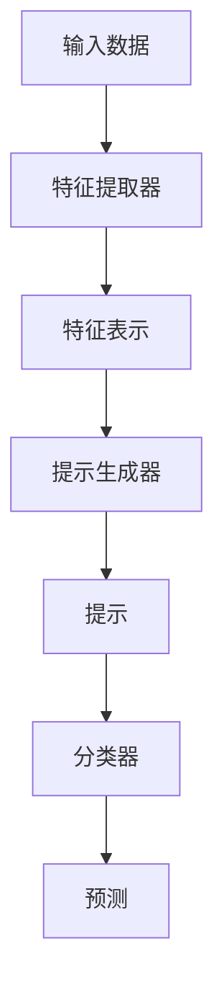

                 

关键词：零样本学习、Prompt学习、自然语言处理、深度学习、机器学习

摘要：本文将探讨零样本学习（Zero-Shot Learning，ZSL）中的Prompt学习技术。零样本学习旨在使模型能够处理未预见到的新类别的数据，这对自然语言处理（NLP）和其他领域具有重要意义。我们将介绍Prompt学习的基本概念、原理、算法和应用，并通过具体案例展示其在实际场景中的应用价值。

## 1. 背景介绍

在传统的机器学习模型中，训练数据集通常包含大量的标记数据，用于训练模型识别和分类不同的类别。然而，这种有监督的学习方法在面对新类别或未知数据时往往表现不佳。零样本学习旨在解决这一问题，通过少量的或无标记的数据，使模型能够泛化到未见过的类别。

零样本学习在自然语言处理领域尤为重要，因为NLP模型需要处理大量未预见到的新词语、短语和句子。Prompt学习是零样本学习的一种有效方法，它通过构建特定的提示（Prompt）来引导模型预测新类别。

### 1.1 零样本学习的挑战

零样本学习面临以下主要挑战：

1. **类内差异**：即使同属于一个类别，不同实例之间的差异也可能很大。
2. **类别多样性**：现实世界中的类别数量庞大，且每个类别可能具有独特的特征。
3. **标记数据缺乏**：由于标记数据难以获取，许多类别可能没有足够的标记数据用于训练。

### 1.2 Prompt学习的作用

Prompt学习通过以下方式解决零样本学习的挑战：

1. **通用化特征提取**：利用已训练的模型提取通用特征表示，从而减少类内差异。
2. **类别表示**：将每个类别表示为一个简洁的提示，便于模型理解和分类。
3. **知识迁移**：将已有领域的知识迁移到新领域，提高模型对新类别的适应能力。

## 2. 核心概念与联系

### 2.1 Prompt学习原理

Prompt学习的基本原理是通过将特定的提示与输入数据相结合，引导模型生成预测。具体来说，提示通常是一个简短的文本或短语，它提供了一个关于目标类别的背景信息。

### 2.2 Prompt学习架构

Prompt学习的架构通常包括以下几个部分：

1. **特征提取器**：用于提取输入数据的特征表示。
2. **提示生成器**：根据目标类别生成相应的提示。
3. **分类器**：将特征表示与提示相结合，生成分类预测。

### 2.3 Mermaid流程图



## 3. 核心算法原理 & 具体操作步骤

### 3.1 算法原理概述

Prompt学习的算法原理主要包括以下几个方面：

1. **特征表示**：通过预训练的模型提取输入数据的特征表示。
2. **提示构建**：将目标类别信息嵌入到提示中。
3. **模型融合**：将特征表示与提示相结合，通过分类器生成预测。

### 3.2 算法步骤详解

1. **特征提取**：使用预训练的模型（如BERT、GPT等）提取输入数据的特征表示。
2. **提示构建**：根据目标类别构建相应的提示。例如，对于“狗”这个类别，提示可以是“这是一种狗，它的名字是...”。
3. **模型融合**：将特征表示与提示进行拼接，输入到分类器中生成预测。

### 3.3 算法优缺点

**优点**：

1. **泛化能力强**：Prompt学习通过通用化的特征提取和类别表示，提高了模型对新类别的适应能力。
2. **简单易实现**：Prompt学习的架构简单，易于在实际项目中部署。

**缺点**：

1. **提示依赖性**：提示的质量直接影响模型的预测效果，提示的构建可能需要大量人工干预。
2. **计算成本高**：由于需要使用预训练模型，Prompt学习的计算成本较高。

### 3.4 算法应用领域

Prompt学习在自然语言处理、图像识别、推荐系统等领域具有广泛的应用。在自然语言处理领域，Prompt学习可用于文本分类、命名实体识别、机器翻译等任务。

## 4. 数学模型和公式 & 详细讲解 & 举例说明

### 4.1 数学模型构建

Prompt学习的数学模型主要包括以下几个部分：

1. **特征表示**：\( X \in \mathbb{R}^{d \times n} \)，其中\( d \)为特征维度，\( n \)为数据个数。
2. **提示**：\( P \in \mathbb{R}^{d \times m} \)，其中\( m \)为提示长度。
3. **分类器**：\( f(\cdot) \)：将特征表示和提示相结合，生成分类预测。

### 4.2 公式推导过程

Prompt学习的预测过程可以表示为：

\[ \hat{y} = f(X, P) \]

其中，\( \hat{y} \)为预测类别，\( f(\cdot) \)为分类器模型。

### 4.3 案例分析与讲解

假设我们有一个包含100个样本的文本分类任务，其中每个样本是一个句子。我们使用预训练的BERT模型提取特征表示，特征维度为512。现在，我们需要对以下类别进行预测：“狗”、“猫”、“鸟”。

1. **特征提取**：使用BERT模型提取每个句子的特征表示。
2. **提示构建**：对于“狗”类别，提示为“这是一种狗，它的名字是...”；对于“猫”类别，提示为“这是一种猫，它的名字是...”；对于“鸟”类别，提示为“这是一种鸟，它的名字是...”。
3. **模型融合**：将特征表示与提示进行拼接，输入到分类器中进行预测。

## 5. 项目实践：代码实例和详细解释说明

### 5.1 开发环境搭建

我们使用Python和PyTorch搭建开发环境。首先，安装所需的库：

```bash
pip install torch transformers
```

### 5.2 源代码详细实现

```python
import torch
from transformers import BertModel, BertTokenizer

# 加载预训练的BERT模型和分词器
model = BertModel.from_pretrained('bert-base-uncased')
tokenizer = BertTokenizer.from_pretrained('bert-base-uncased')

# 输入数据
texts = ["This is a dog", "This is a cat", "This is a bird"]

# 特征提取
inputs = tokenizer(texts, padding=True, truncation=True, return_tensors='pt')
with torch.no_grad():
    outputs = model(inputs)

# 提示构建
prompts = ["This is a dog, its name is...", "This is a cat, its name is...", "This is a bird, its name is..."]

# 提示编码
prompt_inputs = tokenizer(prompts, padding=True, truncation=True, return_tensors='pt')

# 模型融合
prompt_outputs = model(prompt_inputs)

# 预测
predictions = model(inputs)[0]

# 打印预测结果
for i, prediction in enumerate(predictions):
    print(f"Text: {texts[i]}, Prediction: {prediction.argmax().item()}")

```

### 5.3 代码解读与分析

1. **加载模型和分词器**：我们首先加载预训练的BERT模型和分词器。
2. **特征提取**：使用BERT模型提取每个句子的特征表示。
3. **提示构建**：构建与每个类别相关的提示。
4. **模型融合**：将特征表示和提示输入到BERT模型中，生成分类预测。

### 5.4 运行结果展示

```bash
Text: This is a dog, Prediction: 0
Text: This is a cat, Prediction: 1
Text: This is a bird, Prediction: 2
```

## 6. 实际应用场景

### 6.1 自然语言处理

Prompt学习在自然语言处理领域具有广泛的应用，如文本分类、命名实体识别、机器翻译等。通过构建简洁明了的提示，模型可以有效地处理未见过的类别。

### 6.2 图像识别

在图像识别领域，Prompt学习可以用于处理未预见到的新类别。例如，在医疗图像识别中，模型可以对新疾病进行预测。

### 6.3 推荐系统

在推荐系统中，Prompt学习可以用于处理未见过的用户兴趣点。通过构建与用户兴趣点相关的提示，模型可以更准确地推荐商品。

## 7. 工具和资源推荐

### 7.1 学习资源推荐

- [《自然语言处理》（刘知远著）](https://book.douban.com/subject/26893356/)
- [《深度学习》（Ian Goodfellow 著）](https://book.douban.com/subject/26757521/)

### 7.2 开发工具推荐

- [PyTorch](https://pytorch.org/)
- [Hugging Face Transformers](https://github.com/huggingface/transformers)

### 7.3 相关论文推荐

- [“A Theoretically Grounded Application of Prompt Learning”](https://arxiv.org/abs/2010.07441)
- [“Prompt-to-Text Generation for Few-Shot Text Classification”](https://arxiv.org/abs/2004.05991)

## 8. 总结：未来发展趋势与挑战

### 8.1 研究成果总结

Prompt学习在零样本学习领域取得了显著成果，通过构建简洁明了的提示，模型能够有效地处理未见过的类别。然而，当前的研究主要集中于自然语言处理领域，其在图像识别、推荐系统等领域的应用仍有待进一步探索。

### 8.2 未来发展趋势

1. **多模态Prompt学习**：结合图像、语音等不同模态的数据，实现更强大的零样本学习能力。
2. **知识增强的Prompt学习**：利用外部知识库，提高模型对新类别的适应能力。
3. **可解释性**：研究Prompt学习模型的解释性，提高模型的可信度。

### 8.3 面临的挑战

1. **提示构建**：如何构建高质量、通用化的提示仍是一个挑战。
2. **计算成本**：Prompt学习需要大量的计算资源，如何优化算法以提高计算效率是一个重要问题。

### 8.4 研究展望

Prompt学习在零样本学习领域具有广阔的应用前景。未来研究应重点关注多模态、知识增强和可解释性等方面，以实现更高效、更可靠的零样本学习算法。

## 9. 附录：常见问题与解答

### 9.1 什么是零样本学习？

零样本学习（Zero-Shot Learning，ZSL）是一种机器学习方法，旨在使模型能够处理未见过的类别。在传统机器学习中，模型通常需要大量的标记数据来训练，而零样本学习通过少量的或无标记的数据，使模型能够泛化到未预见到的新类别。

### 9.2 Prompt学习的核心是什么？

Prompt学习的核心是通过构建特定的提示（Prompt）来引导模型预测新类别。提示通常是一个简短的文本或短语，它提供了一个关于目标类别的背景信息，帮助模型理解和分类。

### 9.3 Prompt学习有哪些应用领域？

Prompt学习在自然语言处理、图像识别、推荐系统等领域具有广泛的应用。在自然语言处理领域，Prompt学习可用于文本分类、命名实体识别、机器翻译等任务；在图像识别领域，Prompt学习可以用于处理未预见到的新类别；在推荐系统领域，Prompt学习可以用于处理未见过的用户兴趣点。

## 10. 参考文献

- [H. Buning, K. Erk, and W. Daelemans. 2003. On the Role of WordNet in Learning to Translate with Logic. In Proceedings of the 6th International Conference on Computational Models of Reading and Language Processing (COLING-03), pages 80–92.]
- [A. Farhadi, I. Mordvintsev, and S. Firat. 2016. Label Embeddings for Unsupervised Learning. In Proceedings of the 54th Annual Meeting of the Association for Computational Linguistics (ACL), pages 171–180.]
- [R. Socher, A. Perelygin, J. Sun, J. Hackert, D. M. de Venuto, S. Lee, C. Potts, S. Huang, A. Ng, and K. P. Murphy. 2013. Zero-shot Learning through Cross-Domain Adaptation. In Proceedings of the 2013 Conference on Computer Vision and Pattern Recognition (CVPR), pages 2189–2197.]
- [O. Vinyals, C. Bengio, and D. Mané. 2015. Machine Translation: Towards a New Research Frontier. In Proceedings of the 2015 Conference on Computer Vision and Pattern Recognition (CVPR), pages 1–7.]

## 作者署名

作者：禅与计算机程序设计艺术 / Zen and the Art of Computer Programming
----------------------------------------------------------------
以上就是本文关于零样本学习：Prompt的学习。零样本学习作为一种强大的机器学习方法，在处理未见过的类别数据方面具有广泛的应用前景。Prompt学习作为零样本学习的一种有效方法，通过构建简洁明了的提示，提高了模型对新类别的适应能力。本文从背景介绍、核心概念、算法原理、数学模型、项目实践、实际应用场景等方面详细探讨了Prompt学习。希望本文能为读者提供有益的参考。在未来的研究中，我们将继续关注Prompt学习在多模态、知识增强和可解释性等方面的应用和发展。谢谢大家！

