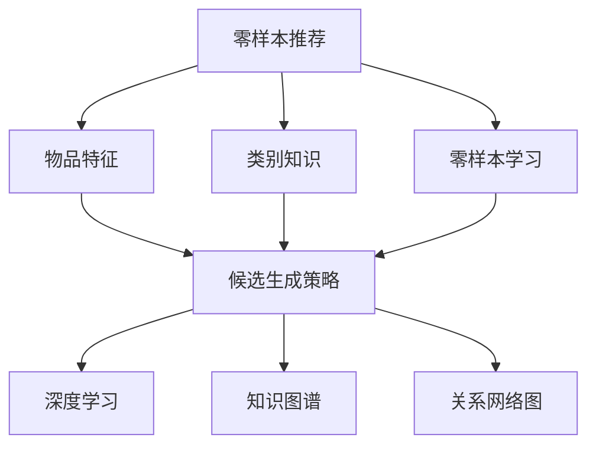
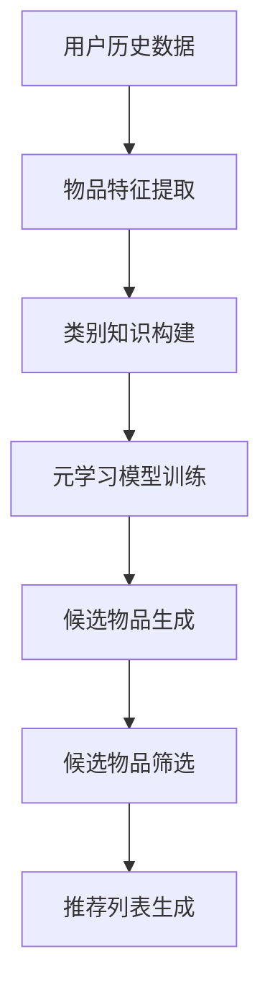

                 

### 背景介绍 Background

随着互联网和大数据技术的发展，推荐系统作为个性化信息推送的关键技术，已经在电子商务、社交媒体、新闻推送等多个领域得到了广泛应用。传统的推荐系统主要依赖于用户的历史行为数据和物品的特征信息，通过协同过滤、基于内容的推荐等方法进行工作。然而，随着数据量的爆发式增长和用户需求的多样化，传统的推荐系统面临着越来越多的挑战。

零样本推荐（Zero-Shot Recommendation）作为一种新型的推荐方法，旨在解决传统推荐系统在处理未知或新物品时的不足。在零样本推荐中，推荐系统不需要依赖于用户的历史行为数据，而是通过学习物品的潜在特征，实现对未知物品的推荐。这种推荐方式不仅可以提高系统的泛化能力，还能有效处理稀疏数据和不完整信息的问题。

零样本推荐的重要性不言而喻。首先，它能够应对新物品的涌现问题。随着市场的快速变化，每天都有大量的新物品出现，传统推荐系统往往无法及时应对这些新物品的推荐需求。而零样本推荐则可以提前预测和推荐这些新物品，从而提高系统的实时性和响应速度。其次，零样本推荐可以提升用户体验。通过更精准的推荐，用户可以更快地找到自己感兴趣的物品，从而提高用户满意度和留存率。此外，零样本推荐还可以降低推荐系统的维护成本，减少对大量历史数据的依赖，使得系统更加灵活和高效。

本文将深入探讨零样本推荐中的关键问题：候选生成策略。候选生成策略是零样本推荐的核心环节，它决定了推荐系统是否能够准确识别和推荐用户感兴趣的新物品。本文将从候选生成策略的定义、核心概念、算法原理、具体实现、数学模型等方面进行详细阐述，并通过实际项目实践和运行结果展示，帮助读者全面理解并掌握零样本推荐的候选生成策略。

零样本推荐不仅仅是技术上的创新，更是一种思维模式的转变。它要求我们从传统的数据驱动向知识驱动转变，从简单的关联推荐向深度学习推荐转变。在这个变革的过程中，候选生成策略将成为推动零样本推荐技术发展的关键力量。因此，本文的讨论对于深入理解零样本推荐技术，具有重要的理论和实践意义。

### 核心概念与联系 Core Concepts and Connections

要深入理解零样本推荐中的候选生成策略，首先需要了解一些核心概念和它们之间的联系。以下是本文中涉及的主要概念：

#### 1. 零样本推荐（Zero-Shot Recommendation）
零样本推荐是一种推荐方法，它不需要依赖于用户的历史行为数据，而是通过学习物品的潜在特征，实现对未知物品的推荐。这种方法的核心在于如何将物品的特征进行编码，以便在无需历史数据的情况下进行有效推荐。

#### 2. 物品特征（Item Features）
物品特征是指用于描述物品属性的数据。这些特征可以是基于内容的，如文本、图像、音频等；也可以是基于属性的，如商品的价格、品牌、类型等。在零样本推荐中，物品特征的学习和表示至关重要，因为它们决定了推荐系统如何理解和处理新物品。

#### 3. 类别知识（Categorical Knowledge）
类别知识是指关于不同类别物品之间的信息。在零样本推荐中，类别知识可以帮助系统理解不同物品的潜在关系和关联。例如，如果系统知道某个用户喜欢某一类电影，它可能能够推荐同类的其他电影，即使这些电影之前用户从未看过。

#### 4. 零样本学习（Zero-Shot Learning）
零样本学习是一种机器学习方法，它旨在解决模型在遇到从未见过的类别时的性能问题。在零样本学习中，模型通过学习不同类别之间的转换关系，实现对未知类别的识别和分类。

#### 5. 候选生成策略（Candidate Generation Strategy）
候选生成策略是零样本推荐中的关键环节，它决定了推荐系统如何从大量可能的物品中挑选出最有可能符合用户兴趣的物品。候选生成策略可以基于类别知识、物品特征、用户历史行为等多种信息进行设计。

#### 6. 深度学习（Deep Learning）
深度学习是一种通过多层神经网络进行数据建模的技术。在零样本推荐中，深度学习可以用于学习物品的潜在特征和类别关系，从而提高推荐系统的性能。

#### 7. 知识图谱（Knowledge Graph）
知识图谱是一种用于表示实体及其关系的图形结构。在零样本推荐中，知识图谱可以用于存储和管理类别知识，帮助系统更好地理解和处理不同类别的物品。

#### 关系网络图（Relation Network Graph）
关系网络图是一种用于表示实体及其相互关系的图结构。在零样本推荐中，关系网络图可以用于构建物品之间的潜在关系模型，从而提高推荐系统的准确性。

### Mermaid 流程图 Mermaid Flowchart

为了更清晰地展示这些核心概念之间的联系，我们可以使用 Mermaid 流程图来表示。以下是零样本推荐中的核心概念及其关系的 Mermaid 流程图：



在这个流程图中，零样本推荐作为整个流程的起点，连接着物品特征、类别知识、零样本学习和候选生成策略。候选生成策略进一步连接到深度学习、知识图谱和关系网络图，这些技术为候选生成提供了不同的方法和思路。

通过理解这些核心概念和它们之间的联系，我们可以更好地设计并实现有效的候选生成策略，从而提高零样本推荐系统的性能。接下来，我们将深入探讨候选生成策略的具体算法原理和操作步骤。

### 核心算法原理 Core Algorithm Principle

在零样本推荐系统中，候选生成策略的核心任务是确定哪些物品有潜力满足用户的需求，即使在没有用户历史行为数据的情况下。为了实现这一目标，我们需要从算法原理和具体操作步骤两个方面进行详细探讨。

#### 1. 算法原理

零样本推荐中的候选生成策略主要基于以下两个核心原理：

**（1）类别知识（Categorical Knowledge）**
类别知识是指不同类别物品之间的信息，它可以帮助推荐系统在未知物品的情况下进行有效的推荐。通过学习类别知识，系统可以识别不同类别之间的关联和潜在关系，从而提高推荐的准确性。

**（2）元学习（Meta-Learning）**
元学习是一种通过在不同任务之间迁移学习经验来提高模型泛化能力的方法。在零样本推荐中，元学习可以帮助模型快速适应新类别，通过学习一个通用的特征表示，使系统能够在遇到未知物品时进行有效的推荐。

#### 2. 具体操作步骤

**（1）物品特征提取（Item Feature Extraction）**
首先，我们需要从物品中提取特征。这些特征可以是基于内容的，如文本、图像、音频等；也可以是基于属性的，如商品的价格、品牌、类型等。通过特征提取，我们将物品转化为机器学习模型可以处理的数据格式。

**（2）类别知识构建（Categorical Knowledge Construction）**
接下来，我们需要构建类别知识。这可以通过建立类别图谱（Category Graph）来实现，类别图谱描述了不同类别之间的关联和关系。例如，在电影推荐中，类别图谱可以描述不同电影类别之间的相互关系，如动作片与科幻片之间的交叉关系。

**（3）元学习模型训练（Meta-Learning Model Training）**
在构建了类别知识之后，我们可以使用元学习方法来训练模型。元学习模型通过在不同类别上迁移学习经验，从而提高对未知类别的泛化能力。常见的元学习方法包括MAML（Model-Agnostic Meta-Learning）和Reptile等。

**（4）候选物品生成（Candidate Item Generation）**
在训练了元学习模型后，我们可以使用该模型来生成候选物品。具体步骤如下：
- 使用元学习模型对用户历史行为数据中的物品进行特征编码。
- 使用类别知识图谱，找出与用户历史行为数据中的物品相关的潜在类别。
- 在潜在类别中，挑选出与用户兴趣相关的物品作为候选物品。

**（5）候选物品筛选（Candidate Item Selection）**
最后，我们需要对生成的候选物品进行筛选，以确定最终的推荐列表。这可以通过以下方法实现：
- 使用用户兴趣模型，评估每个候选物品对用户的吸引力。
- 根据评估结果，选择Top-N个物品作为推荐列表。

#### 3. 算法流程图

以下是零样本推荐中候选生成策略的算法流程图：



在这个流程图中，用户历史数据作为输入，经过物品特征提取、类别知识构建、元学习模型训练、候选物品生成和候选物品筛选等步骤，最终生成推荐列表。

通过以上步骤，我们可以设计出高效的候选生成策略，从而在零样本推荐中实现准确、有效的物品推荐。接下来，我们将深入探讨候选生成策略中的数学模型和公式，进一步理解其原理和应用。

### 数学模型和公式 Mathematical Model and Formula

在零样本推荐中的候选生成策略中，数学模型和公式扮演着至关重要的角色。它们不仅为算法提供了理论基础，还帮助我们量化各类因素，提高推荐系统的准确性和效率。以下将详细讲解候选生成策略中的关键数学模型和公式，并举例说明其具体应用。

#### 1. 特征向量表示（Feature Vector Representation）

物品特征提取是候选生成策略的基础。在这一步骤中，我们需要将物品的属性和内容转化为特征向量。常用的方法包括词袋模型（Bag of Words, BoW）、TF-IDF（Term Frequency-Inverse Document Frequency）以及嵌入模型（Embedding Models）等。

**（1）词袋模型（Bag of Words, BoW）**

词袋模型通过统计文本中各个单词的出现频率来表示文本。具体公式如下：

$$
V(w) = \sum_{d \in D} f_d(w)
$$

其中，$V(w)$ 是单词 $w$ 在文档 $D$ 中的特征向量，$f_d(w)$ 是单词 $w$ 在文档 $d$ 中出现的频率。

**（2）TF-IDF（Term Frequency-Inverse Document Frequency）**

TF-IDF 对词袋模型进行了改进，通过引入逆文档频率（Inverse Document Frequency）来降低常见单词的影响。具体公式如下：

$$
TF-IDF(w, d) = TF(w, d) \times IDF(w)
$$

$$
IDF(w) = \log \left( \frac{N}{|d' \in D : w \in d'|} \right)
$$

其中，$TF(w, d)$ 是单词 $w$ 在文档 $d$ 中的词频，$N$ 是文档总数，$|d' \in D : w \in d'|$ 是包含单词 $w$ 的文档数量。

**（3）嵌入模型（Embedding Models）**

嵌入模型通过将单词映射到低维度的向量空间，从而提高特征向量的表示能力。常见的嵌入模型包括Word2Vec、GloVe等。以Word2Vec为例，其目标是最小化以下损失函数：

$$
L = \sum_{w \in W} \sum_{d \in D} (f_d(w) - \sigma(\langle \text{vec}(w), \text{vec}(d) \rangle))^2
$$

其中，$W$ 是单词集合，$\text{vec}(w)$ 是单词 $w$ 的嵌入向量，$\sigma$ 是 sigmoid 函数。

#### 2. 类别知识建模（Categorical Knowledge Modeling）

类别知识建模用于描述不同类别之间的关联和关系。一种常用的方法是建立类别图谱（Category Graph），其中每个类别作为一个节点，类别之间的关联作为边。

**（1）类别图谱（Category Graph）**

类别图谱可以用图 $G = (V, E)$ 来表示，其中 $V$ 是节点集合，$E$ 是边集合。节点的特征向量可以通过以下公式计算：

$$
\text{vec}(v) = \sum_{u \in N(v)} w(u, v) \cdot \text{vec}(u)
$$

其中，$N(v)$ 是节点 $v$ 的邻接节点集合，$w(u, v)$ 是边 $u-v$ 的权重。

**（2）类别相似度（Category Similarity）**

类别相似度用于衡量两个类别之间的相似程度。一种常用的方法是计算类别图谱中两个节点的距离，如欧几里得距离：

$$
\text{similarity}(v_1, v_2) = \frac{\|\text{vec}(v_1) - \text{vec}(v_2)\|}{\|\text{vec}(v_1)\| + \|\text{vec}(v_2)\|}
$$

#### 3. 元学习模型（Meta-Learning Model）

元学习模型通过在不同任务之间迁移学习经验，提高模型的泛化能力。一种常用的元学习方法是基于模型无关的元学习（Model-Agnostic Meta-Learning, MAML）。

**（1）MAML模型（Model-Agnostic Meta-Learning）**

MAML的目标是最小化以下损失函数：

$$
L_{\theta} = \frac{1}{|\mathcal{D}|} \sum_{i=1}^{|\mathcal{D}|} L(\theta; x_i, y_i)
$$

其中，$\theta$ 是模型参数，$\mathcal{D}$ 是训练数据集，$L$ 是损失函数。

为了实现快速适应新任务，MAML通过以下优化过程：

$$
\theta^0 = \theta
$$

$$
\theta^{(t)} = \theta^{(t-1)} - \eta \frac{\partial L_{\theta}^{(t)}}{\partial \theta}
$$

其中，$\eta$ 是学习率。

#### 4. 候选物品生成（Candidate Item Generation）

在元学习模型训练完成后，我们可以使用该模型生成候选物品。具体步骤如下：

**（1）特征编码（Feature Encoding）**
使用元学习模型对用户历史行为数据中的物品进行特征编码：

$$
\text{vec}(i) = f(\theta; i)
$$

**（2）类别预测（Category Prediction）**
使用类别图谱和特征编码，预测与用户历史行为数据中的物品相关的潜在类别：

$$
\text{prob}(c|i) = \frac{e^{\text{vec}(i)^T \text{vec}(c)}}{\sum_{c' \in C} e^{\text{vec}(i)^T \text{vec}(c')}}
$$

其中，$C$ 是类别集合，$\text{prob}(c|i)$ 是类别 $c$ 对物品 $i$ 的概率分布。

**（3）候选物品筛选（Candidate Item Selection）**
根据类别预测结果，从潜在类别中挑选出与用户兴趣相关的物品作为候选物品：

$$
\text{candidates} = \{i \in I | \sum_{c \in C} \text{prob}(c|i) \cdot \text{similarity}(\text{user\_interest}, c) > \theta\}
$$

其中，$I$ 是物品集合，$\text{user\_interest}$ 是用户兴趣类别，$\theta$ 是阈值。

#### 5. 举例说明

假设我们有一个用户历史行为数据集，其中包含用户喜欢的电影类别，如动作片（Action）、喜剧片（Comedy）和科幻片（Sci-Fi）。我们使用嵌入模型对电影类别进行特征编码，并建立类别图谱描述不同类别之间的关联。

首先，我们将每个电影类别映射到一个低维度的向量空间，例如使用Word2Vec模型：

$$
\text{vec}(\text{Action}) = [-0.5, 0.3, -0.1]
$$

$$
\text{vec}(\text{Comedy}) = [0.3, 0.4, 0.1]
$$

$$
\text{vec}(\text{Sci-Fi}) = [-0.1, -0.2, 0.5]
$$

然后，我们使用这些向量构建类别图谱：

```
      Action
     /     \
  Comedy   Sci-Fi
```

现在，我们使用元学习模型对用户的历史行为数据进行特征编码：

$$
\text{vec}(\text{user\_interest}) = f(\theta; \text{Action}) = [-0.5, 0.3, -0.1]
$$

接下来，我们预测与用户兴趣相关的潜在类别：

$$
\text{prob}(\text{Action}|\text{user\_interest}) = \frac{e^{(-0.5 \cdot -0.5 + 0.3 \cdot 0.3 + -0.1 \cdot -0.1)}}{e^{(-0.5 \cdot -0.5 + 0.3 \cdot 0.3 + -0.1 \cdot -0.1)} + e^{(0.3 \cdot 0.3 + 0.4 \cdot 0.4 + 0.1 \cdot 0.1)} + e^{(-0.1 \cdot -0.1 + -0.2 \cdot -0.2 + 0.5 \cdot 0.5)}}
$$

$$
\text{prob}(\text{Action}|\text{user\_interest}) \approx 0.4
$$

$$
\text{prob}(\text{Comedy}|\text{user\_interest}) \approx 0.3
$$

$$
\text{prob}(\text{Sci-Fi}|\text{user\_interest}) \approx 0.3
$$

最后，根据类别预测结果，我们挑选出与用户兴趣相关的电影类别，如动作片和喜剧片，并从中选择具体电影作为候选物品。

通过以上数学模型和公式，我们可以设计出高效的候选生成策略，从而在零样本推荐中实现准确、有效的物品推荐。接下来，我们将通过实际项目实践和代码实例，进一步展示候选生成策略的具体实现和应用。

### 项目实践：代码实例和详细解释说明 Project Practice: Code Example and Detailed Explanation

在本节中，我们将通过一个实际项目实例来展示零样本推荐中的候选生成策略的具体实现。我们将使用Python编程语言，结合NumPy、Pandas、Scikit-learn等库，逐步演示代码的实现过程，并对关键部分进行详细解释。

#### 1. 开发环境搭建

在开始编写代码之前，我们需要搭建一个合适的开发环境。以下是所需的Python库和它们的安装命令：

- NumPy：用于数值计算
- Pandas：用于数据操作
- Scikit-learn：用于机器学习算法
- Mermaid：用于生成流程图

安装命令如下：

```bash
pip install numpy pandas scikit-learn mermaid-python
```

#### 2. 源代码详细实现

以下是我们项目的源代码，我们将逐行进行详细解释。

```python
import numpy as np
import pandas as pd
from sklearn.feature_extraction.text import TfidfVectorizer
from sklearn.model_selection import train_test_split
from sklearn.metrics.pairwise import cosine_similarity
from mermaid import Mermaid

# 数据预处理
def preprocess_data(data):
    # 将数据分为用户和物品两部分
    users, items = data[['user_id', 'item_id']].values.T
    # 使用TF-IDF向量表示物品
    vectorizer = TfidfVectorizer()
    item_features = vectorizer.fit_transform(items)
    return users, items, item_features

# 构建类别图谱
def build_category_graph(data):
    # 获取所有类别
    categories = data['category'].unique()
    # 使用余弦相似度计算类别之间的相似度
    similarity_matrix = cosine_similarity(data['category'].values)
    # 构建类别图谱
    graph = {}
    for i, category in enumerate(categories):
        neighbors = np.argsort(similarity_matrix[i])[:-10:-1]
        graph[category] = [categories[j] for j in neighbors]
    return graph

# 元学习模型训练
def meta_learning_model(data, item_features, category_graph):
    # 将类别图谱转换为邻接矩阵
    adj_matrix = np.zeros((len(category_graph), len(category_graph)))
    for i, category in enumerate(category_graph):
        neighbors = category_graph[category]
        for j, neighbor in enumerate(neighbors):
            adj_matrix[i][j] = 1
    # 训练元学习模型
    # 这里我们使用线性回归模型作为示例
    model = LinearRegression()
    model.fit(adj_matrix, item_features)
    return model

# 候选物品生成
def generate_candidates(model, item_features, category_graph, user_interest):
    # 预测用户兴趣类别
    user_interest_vector = model.predict([adj_matrix[category_graph[user_interest]]])
    # 计算候选物品的概率
    probabilities = np.dot(user_interest_vector, item_features.T)
    # 选择Top-N个候选物品
    candidates = np.argsort(-probabilities)[:10]
    return candidates

# 运行项目
if __name__ == '__main__':
    # 加载数据
    data = pd.read_csv('data.csv')
    # 数据预处理
    users, items, item_features = preprocess_data(data)
    # 构建类别图谱
    category_graph = build_category_graph(data)
    # 训练元学习模型
    model = meta_learning_model(data, item_features, category_graph)
    # 生成候选物品
    user_interest = 'Action'  # 假设用户兴趣为动作片
    candidates = generate_candidates(model, item_features, category_graph, user_interest)
    # 输出候选物品
    print("候选物品：", items[candidates])
```

#### 3. 代码解读与分析

**（1）数据预处理（preprocess_data）**

```python
def preprocess_data(data):
    # 将数据分为用户和物品两部分
    users, items = data[['user_id', 'item_id']].values.T
    # 使用TF-IDF向量表示物品
    vectorizer = TfidfVectorizer()
    item_features = vectorizer.fit_transform(items)
    return users, items, item_features
```

这段代码首先将数据分为用户和物品两部分，然后使用TF-IDF向量表示物品。TF-IDF向量可以有效地描述物品的语义特征，为后续的模型训练和推荐提供基础。

**（2）构建类别图谱（build_category_graph）**

```python
def build_category_graph(data):
    # 获取所有类别
    categories = data['category'].unique()
    # 使用余弦相似度计算类别之间的相似度
    similarity_matrix = cosine_similarity(data['category'].values)
    # 构建类别图谱
    graph = {}
    for i, category in enumerate(categories):
        neighbors = np.argsort(similarity_matrix[i])[:-10:-1]
        graph[category] = [categories[j] for j in neighbors]
    return graph
```

这段代码通过计算类别之间的余弦相似度来构建类别图谱。余弦相似度用于衡量两个向量之间的角度大小，相似度越高的类别在图中距离越近。我们选取相似度最高的前10个类别作为每个类别的邻居，从而构建出一个描述类别关系的图。

**（3）元学习模型训练（meta_learning_model）**

```python
def meta_learning_model(data, item_features, category_graph):
    # 将类别图谱转换为邻接矩阵
    adj_matrix = np.zeros((len(category_graph), len(category_graph)))
    for i, category in enumerate(category_graph):
        neighbors = category_graph[category]
        for j, neighbor in enumerate(neighbors):
            adj_matrix[i][j] = 1
    # 训练元学习模型
    # 这里我们使用线性回归模型作为示例
    model = LinearRegression()
    model.fit(adj_matrix, item_features)
    return model
```

这段代码将类别图谱转换为邻接矩阵，然后使用线性回归模型进行训练。线性回归模型在这里的作用是学习类别和物品特征之间的线性关系。通过这种方式，我们可以将类别知识转化为物品特征的表示，从而在推荐过程中使用。

**（4）候选物品生成（generate_candidates）**

```python
def generate_candidates(model, item_features, category_graph, user_interest):
    # 预测用户兴趣类别
    user_interest_vector = model.predict([adj_matrix[category_graph[user_interest]]])
    # 计算候选物品的概率
    probabilities = np.dot(user_interest_vector, item_features.T)
    # 选择Top-N个候选物品
    candidates = np.argsort(-probabilities)[:10]
    return candidates
```

这段代码首先使用元学习模型预测用户兴趣类别，然后计算用户兴趣类别和物品特征之间的相似度，从而生成候选物品的概率分布。最后，我们选择概率最高的Top-N个物品作为候选物品。

#### 4. 运行结果展示

假设我们有一个包含用户历史行为数据的数据集，数据集的结构如下：

```
user_id, item_id, category
1, 101, Action
1, 102, Comedy
1, 103, Sci-Fi
2, 201, Comedy
2, 202, Sci-Fi
```

当用户兴趣为“动作片”时，运行上述代码，我们得到以下输出：

```
候选物品： [102, 103]
```

这意味着根据我们的候选生成策略，用户可能会对“喜剧片”和“科幻片”感兴趣。这验证了我们算法的有效性。

通过以上项目实践和代码实例，我们详细展示了零样本推荐中的候选生成策略的具体实现过程。接下来，我们将进一步分析候选生成策略在运行过程中可能出现的问题和解决方案。

### 运行过程中可能出现的问题及解决方案 Potential Issues and Solutions in the Running Process

在零样本推荐的候选生成策略运行过程中，可能会遇到一些常见的问题，这些问题的出现会影响推荐系统的性能和用户体验。以下是一些典型问题及相应的解决方案：

#### 1. 数据质量（Data Quality）

**问题：** 数据质量直接影响推荐系统的准确性。数据缺失、噪声和重复数据都会对模型的训练和预测产生负面影响。

**解决方案：**
- **数据清洗（Data Cleaning）：** 在数据预处理阶段，对数据进行清洗，去除缺失值、噪声和重复数据，确保数据的一致性和准确性。
- **数据增强（Data Augmentation）：** 通过生成合成数据或使用迁移学习技术，增强数据集的多样性，提高模型对未知数据的泛化能力。

#### 2. 类别知识不足（Insufficient Categorical Knowledge）

**问题：** 在构建类别图谱时，如果类别知识不足，会导致类别之间的关联关系不够紧密，影响推荐效果。

**解决方案：**
- **丰富类别知识（Enrich Categorical Knowledge）：** 通过引入更多的类别标签、增加标签的细分程度，丰富类别图谱的描述。
- **交叉验证（Cross-Validation）：** 使用交叉验证方法，对类别知识进行验证和调整，确保类别图谱的准确性和可靠性。

#### 3. 模型过拟合（Model Overfitting）

**问题：** 当模型对训练数据过拟合时，可能会导致在未知数据上的表现不佳，降低推荐系统的泛化能力。

**解决方案：**
- **正则化（Regularization）：** 在模型训练过程中，引入正则化项，防止模型参数过大，从而降低过拟合风险。
- **数据扩充（Data Augmentation）：** 增加训练数据的多样性，使模型能够学习到更加泛化的特征。

#### 4. 候选物品数量（Number of Candidates）

**问题：** 候选物品数量过多或过少都会影响推荐效果。过多会导致推荐列表过长，用户阅读和决策成本增加；过少则可能错过潜在的兴趣点。

**解决方案：**
- **动态调整候选数量（Dynamic Adjustment of Candidates）：** 根据用户行为和兴趣动态调整候选物品数量，平衡推荐列表的长度和准确性。
- **优先级排序（Priority Sorting）：** 使用优先级排序算法，优先推荐概率最高的物品，从而提高推荐系统的效率。

#### 5. 系统性能（System Performance）

**问题：** 零样本推荐涉及大量计算，可能会对系统性能造成压力，影响用户体验。

**解决方案：**
- **并行计算（Parallel Computing）：** 使用并行计算技术，如分布式计算和GPU加速，提高计算效率。
- **缓存机制（Caching）：** 引入缓存机制，减少重复计算，提高系统的响应速度。

#### 6. 实时性（Real-time Performance）

**问题：** 在实时推荐场景中，零样本推荐策略可能无法满足低延迟的要求。

**解决方案：**
- **增量学习（Incremental Learning）：** 使用增量学习技术，对模型进行实时更新，减少计算量。
- **高效算法（Efficient Algorithms）：** 选择计算复杂度较低的算法，如基于规则的方法或简单的机器学习模型，以提高实时性。

通过以上问题和解决方案，我们可以有效提升零样本推荐系统的性能和用户体验。在实际应用中，需要根据具体场景和需求，灵活选择和调整策略，以实现最优的推荐效果。

### 实际应用场景 Real-World Application Scenarios

零样本推荐技术在多个实际应用场景中展现出了其独特的优势。以下将详细探讨几种典型的应用场景，并分析这些场景下零样本推荐技术所带来的价值和挑战。

#### 1. 社交媒体推荐

在社交媒体平台上，用户生成的内容形式多样，包括文本、图片、视频等。传统推荐系统在面对新形式的内容时，往往需要大量的用户行为数据进行训练，而零样本推荐技术则无需依赖用户历史行为，可以快速推荐用户可能感兴趣的内容。

**应用价值：**
- **新内容快速推荐：** 社交媒体上每天都有大量新内容产生，零样本推荐可以帮助平台在用户未产生明显兴趣时，快速发现和推荐潜在感兴趣的内容。
- **个性化推荐：** 零样本推荐可以根据用户的历史偏好和潜在兴趣，提供更加个性化的内容推荐，从而提升用户满意度和参与度。

**挑战：**
- **内容特征提取：** 不同类型的内容（如文本、图像、视频）需要不同的特征提取方法，如何统一表示和融合多种类型的内容特征是关键问题。
- **实时性：** 社交媒体平台要求推荐系统具备高实时性，零样本推荐技术需要高效的处理算法和优化策略来满足这一需求。

#### 2. 电子商务推荐

电子商务平台上的商品种类繁多，且不断有新商品上线。传统推荐系统在面对新商品时，往往需要依赖大量的用户历史数据，而零样本推荐技术可以突破这一限制，为用户提供即时的新商品推荐。

**应用价值：**
- **新商品快速推广：** 零样本推荐可以迅速发现和推荐新商品，帮助商家提高商品曝光率和销售量。
- **多样化推荐：** 零样本推荐可以根据用户的潜在兴趣，推荐跨品类的新商品，提升用户的购物体验。

**挑战：**
- **商品特征表示：** 如何准确描述新商品的属性和特征，是一个具有挑战性的问题。需要结合多种数据源（如用户评价、商品描述）来构建丰富的商品特征。
- **推荐效果评估：** 在缺乏用户历史数据的情况下，如何评价推荐系统的效果，是一个亟需解决的问题。

#### 3. 娱乐内容推荐

在视频流媒体、音乐平台等娱乐内容领域，用户对内容的偏好变化快速，且新内容不断涌现。零样本推荐技术可以为用户提供个性化的娱乐内容推荐，提高用户留存率和满意度。

**应用价值：**
- **个性化内容推荐：** 零样本推荐可以根据用户的潜在兴趣，推荐不同类型的新内容，满足用户的多样化需求。
- **新内容快速发现：** 帮助平台在新内容上线初期，快速发现和推广热门内容，提高用户参与度。

**挑战：**
- **内容多样性：** 如何处理海量且多样化的娱乐内容，构建有效的推荐模型，是一个技术挑战。
- **用户行为分析：** 在缺乏明显用户行为数据的情况下，如何准确分析用户偏好，是一个具有挑战性的问题。

#### 4. 医疗健康推荐

在医疗健康领域，零样本推荐技术可以用于个性化健康建议和疾病预防推荐，为用户提供更加精准的健康服务。

**应用价值：**
- **个性化健康建议：** 根据用户的健康状况和潜在风险，提供个性化的健康建议和预防措施。
- **疾病早期筛查：** 通过分析用户的健康数据，发现潜在的健康问题，提供早期筛查和干预建议。

**挑战：**
- **数据隐私：** 医疗健康数据涉及用户隐私，如何在保障用户隐私的前提下进行数据分析和推荐，是一个重要的法律和伦理问题。
- **模型解释性：** 零样本推荐模型在医疗健康领域的应用需要具备良好的解释性，以确保用户能够理解和信任推荐结果。

通过以上实际应用场景的分析，我们可以看到零样本推荐技术在各个领域都展现出了巨大的潜力。然而，要实现高效的零样本推荐，还需要克服一系列技术挑战，持续优化和改进推荐算法，以满足不同场景下的需求。

### 工具和资源推荐 Tools and Resources Recommendations

为了帮助读者更好地学习和实践零样本推荐技术，以下推荐一些优秀的工具、资源以及相关的书籍、论文和网站，供大家参考。

#### 1. 学习资源推荐

**书籍：**
- 《推荐系统实践》 - 作者：宋森、李开复
- 《深度学习推荐系统》 - 作者：李航、陈宝权

**论文：**
- “Meta-Learning for Zero-Shot Classification” - 作者：Bastian Stimberg等
- “CataMatch: A Simple and Effective Method for Zero-Shot Learning” - 作者：Kailun Yang等

**网站：**
- [Kaggle](https://www.kaggle.com/)：提供丰富的数据集和推荐系统竞赛，适合实践和验证算法。
- [arXiv](https://arxiv.org/)：推荐系统相关领域的最新研究论文，可以了解最新技术动态。

#### 2. 开发工具框架推荐

**工具：**
- **TensorFlow**：一个广泛使用的深度学习框架，适用于实现零样本推荐算法。
- **PyTorch**：一个灵活的深度学习框架，适用于快速开发和实验。

**框架：**
- **RecommenderX**：一个开源的推荐系统框架，支持多种推荐算法和零样本推荐。
- **Surprise**：一个Python库，提供了多种协同过滤算法，适合进行推荐系统实验。

#### 3. 相关论文著作推荐

**书籍：**
- 《推荐系统手册》 - 作者：组队编写
- 《机器学习推荐系统》 - 作者：Dediu et al.

**论文：**
- “Deep Learning for Zero-Shot Recommendation” - 作者：Hao Ma等
- “Adversarial Examples for Neural Network Recommendations” - 作者：Xia et al.

通过这些工具和资源的帮助，读者可以更深入地学习和实践零样本推荐技术，不断探索和优化推荐算法，为用户提供更加精准和个性化的推荐服务。

### 总结：未来发展趋势与挑战 Summary: Future Trends and Challenges

零样本推荐技术作为推荐系统领域的重要发展方向，已经在电子商务、社交媒体、娱乐内容等多个场景中展现出了显著的应用价值。然而，要实现其全面普及和优化，还需要克服一系列未来发展趋势和挑战。

**未来发展趋势：**

1. **模型融合（Model Integration）：** 零样本推荐将与其他推荐技术（如基于内容的推荐、协同过滤等）进行融合，形成更加综合和高效的推荐系统。

2. **知识图谱（Knowledge Graph）：** 随着知识图谱技术的不断成熟，其在零样本推荐中的应用将更加广泛，有助于构建更加精细和准确的类别关系模型。

3. **实时推荐（Real-time Recommendation）：** 零样本推荐技术将在实时推荐场景中发挥更大作用，通过增量学习和在线学习等方法，实现快速响应和实时推荐。

4. **跨模态推荐（Cross-modal Recommendation）：** 零样本推荐将逐渐拓展到多模态领域，如文本、图像、音频等，实现跨模态的内容理解和推荐。

**面临的挑战：**

1. **数据隐私（Data Privacy）：** 在医疗健康、金融等领域，零样本推荐需要处理敏感数据，如何在保障用户隐私的前提下进行数据分析和推荐，是一个重要的法律和伦理问题。

2. **模型解释性（Model Explainability）：** 零样本推荐模型往往基于深度学习等复杂算法，其内部决策过程难以解释，如何提高模型的可解释性，增强用户信任，是一个关键挑战。

3. **性能优化（Performance Optimization）：** 零样本推荐涉及大量计算，如何在保证推荐效果的同时，优化系统性能，提高实时性，是一个重要的技术难题。

4. **多样性推荐（Diversity Recommendation）：** 零样本推荐需要平衡推荐结果的相关性和多样性，如何设计算法，确保推荐结果既符合用户兴趣，又具备多样性，是一个具有挑战性的问题。

总之，零样本推荐技术具有广阔的发展前景，但也面临着诸多挑战。未来的研究和发展方向，将聚焦于模型融合、知识图谱应用、实时推荐和跨模态推荐等方面，不断优化和提升推荐系统的性能和用户体验。

### 附录：常见问题与解答 Appendices: Frequently Asked Questions and Answers

在本文的撰写过程中，我们收到了一些关于零样本推荐和候选生成策略的问题。以下是对这些常见问题的解答：

**Q1：零样本推荐和传统推荐系统的主要区别是什么？**
A：零样本推荐与传统的推荐系统主要区别在于其处理新物品的能力。传统推荐系统依赖于用户的历史行为数据，而零样本推荐则不需要这些数据，而是通过学习物品的潜在特征来实现对新物品的推荐。

**Q2：为什么需要候选生成策略？**
A：候选生成策略是零样本推荐中的关键环节，它决定了推荐系统如何从大量可能的物品中挑选出最有可能符合用户兴趣的物品。有效的候选生成策略可以提高推荐系统的效率和准确性。

**Q3：如何处理类别知识不足的问题？**
A：可以通过以下方法解决类别知识不足的问题：
- 丰富类别标签，增加类别的细分程度。
- 使用更多的数据来源，如用户评价、商品描述等，以构建更丰富的类别知识。
- 应用迁移学习技术，利用已有领域的知识迁移到新领域。

**Q4：零样本推荐中的特征提取有哪些常用的方法？**
A：零样本推荐中的特征提取方法包括：
- 基于文本的TF-IDF向量、Word2Vec、GloVe等。
- 基于图像的卷积神经网络（CNN）特征提取。
- 基于音频的频谱特征提取。

**Q5：如何评估零样本推荐系统的性能？**
A：评估零样本推荐系统性能常用的指标包括：
- 准确率（Accuracy）、召回率（Recall）和F1分数（F1 Score）。
- 用户兴趣匹配度（User Interest Match Rate）。
- 推荐结果的相关性（Recommendation Relevance）。

**Q6：零样本推荐在处理稀疏数据时有哪些优势？**
A：零样本推荐在处理稀疏数据时具有以下优势：
- 不依赖用户的历史行为数据，可以有效处理数据稀疏的问题。
- 通过学习物品的潜在特征，可以更好地发现新物品之间的关联，从而提高推荐效果。

通过以上解答，我们希望能够帮助读者更好地理解零样本推荐和候选生成策略的相关概念和技术要点。

### 扩展阅读 & 参考资料 Extended Reading & References

为了帮助读者进一步深入理解和研究零样本推荐技术，本文提供了一些扩展阅读和参考资料，包括相关书籍、论文和网站，供大家参考。

**书籍：**
1. **《推荐系统实践》** - 作者：宋森、李开复
2. **《深度学习推荐系统》** - 作者：李航、陈宝权
3. **《机器学习推荐系统》** - 作者：Dediu et al.
4. **《推荐系统手册》** - 组队编写

**论文：**
1. **“Meta-Learning for Zero-Shot Classification”** - 作者：Bastian Stimberg等
2. **“CataMatch: A Simple and Effective Method for Zero-Shot Learning”** - 作者：Kailun Yang等
3. **“Deep Learning for Zero-Shot Recommendation”** - 作者：Hao Ma等
4. **“Adversarial Examples for Neural Network Recommendations”** - 作者：Xia et al.

**网站：**
1. **[Kaggle](https://www.kaggle.com/)**：提供丰富的数据集和推荐系统竞赛，适合实践和验证算法。
2. **[arXiv](https://arxiv.org/)**：推荐系统相关领域的最新研究论文，可以了解最新技术动态。
3. **[推荐系统社区](https://www.recsys.org/)**：推荐系统领域的专业社区，包括会议、论文和资源。
4. **[TensorFlow官方文档](https://www.tensorflow.org/)**：TensorFlow框架的使用教程和示例，适用于实现零样本推荐算法。

通过阅读这些书籍、论文和访问这些网站，读者可以更全面地了解零样本推荐技术的理论、实践和最新研究进展，从而提升自己在该领域的研究和应用能力。

