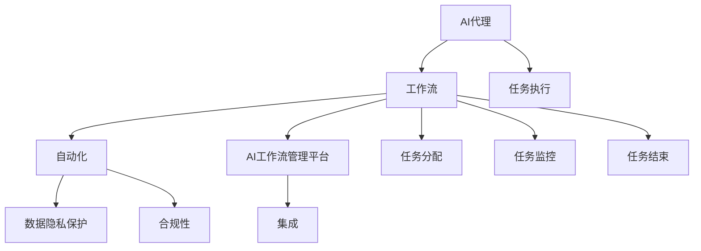

                 

### 背景介绍

#### 概述

随着信息技术的迅猛发展，各行各业都在加速向数字化、智能化方向转型，这被称为“行业4.0”。在这一进程中，人工智能（AI）技术的应用成为了关键驱动力。AI不仅能提高生产效率、优化业务流程，还能为企业带来全新的商业模式。在这样的背景下，AI代理工作流自动化解决方案应运而生，成为企业实现智能化转型的关键技术之一。

#### 当前形势

目前，AI代理工作流自动化技术已经在金融、医疗、制造、零售等多个领域得到广泛应用。以金融行业为例，AI代理能够自动处理大量的交易订单、客户咨询等业务，极大地提升了工作效率和客户满意度。而在医疗领域，AI代理可以辅助医生进行病情诊断、患者管理等任务，提高了医疗服务的质量和效率。

尽管AI代理工作流自动化技术带来了显著的好处，但企业在实施过程中仍然面临诸多挑战。首先，如何确保AI代理在复杂环境中稳定运行是一个重要问题。其次，如何在保证系统安全性的同时，实现数据的隐私保护和合规性也是一个亟待解决的难题。此外，如何高效地集成AI代理与现有工作流系统，实现无缝对接，也是企业需要面对的挑战。

本文将深入探讨面向行业4.0的AI代理工作流自动化解决方案，分析其核心概念、算法原理、数学模型，并通过实际项目案例展示其应用效果。希望通过本文的阐述，能够为企业在AI代理工作流自动化领域的探索提供一些有益的思路和参考。

#### 目的

本文旨在通过对AI代理工作流自动化解决方案的深入探讨，帮助读者了解：

1. AI代理工作流自动化的核心概念和关键技术。
2. 面向行业4.0的具体应用场景和实施策略。
3. AI代理工作流自动化中的挑战及其解决思路。
4. 相关工具和资源的推荐，以支持读者的学习和实践。

通过本文的阅读，读者将能够：

1. 明确AI代理工作流自动化在行业4.0中的重要性。
2. 掌握核心算法原理和具体实施步骤。
3. 了解数学模型在实际应用中的作用。
4. 掌握如何通过项目实践验证解决方案的有效性。
5. 获得相关学习资源和开发工具的推荐，助力自己的学习和实践。

#### 相关术语定义

为了确保本文的阅读和理解，以下是本文中涉及的一些关键术语及其定义：

1. **人工智能（AI）代理**：能够自主决策并执行特定任务的智能系统。
2. **工作流自动化**：通过技术手段将人工操作转化为自动化流程，以提高效率和降低成本。
3. **行业4.0**：指利用物联网、人工智能等先进技术，实现产业智能化升级的阶段。
4. **数据隐私保护**：确保数据在存储、处理和传输过程中不被未经授权的访问和泄露。
5. **合规性**：指企业在法律、法规和政策框架下，遵循相关标准和规范。
6. **集成**：将不同系统、模块或技术无缝连接起来，实现协同工作。
7. **稳定性**：系统在长时间运行过程中保持正常运行的能力。

通过以上背景介绍，我们为后续深入探讨AI代理工作流自动化解决方案奠定了基础。接下来，我们将逐步解析AI代理工作流自动化的核心概念和关键技术，为读者呈现一个全面而详实的分析。### 核心概念与联系

为了深入理解AI代理工作流自动化解决方案，我们首先需要明确其核心概念和关键组成部分。以下是本文将详细探讨的主要概念：

1. **人工智能（AI）代理**：AI代理是一种能够模拟人类智能行为、自主完成特定任务的智能系统。它具备感知环境、学习知识、规划行动、执行任务的能力。AI代理的核心功能包括自主决策、任务分配、资源调度和协同作业。
2. **工作流**：工作流是一系列任务和活动的序列，它们按照一定的规则和顺序执行，以实现特定的业务目标。工作流通常包括任务的创建、执行、监控和结束等环节。
3. **自动化**：自动化是指利用技术手段将人工操作转化为自动化流程，以减少人工干预，提高效率、降低成本和减少错误。在AI代理工作流自动化中，自动化主要体现在任务自动分配、自动执行、自动监控和自动调整等方面。
4. **AI工作流管理平台**：AI工作流管理平台是一种集成环境，它提供了一系列工具和功能，用于设计、部署、监控和管理AI代理工作流。平台通常包括工作流设计器、任务调度器、监控仪表板、日志记录器和异常处理模块等。
5. **数据隐私保护**：数据隐私保护是确保数据在存储、处理和传输过程中不被未经授权的访问和泄露的重要措施。它包括数据加密、访问控制、隐私政策和技术防护等。
6. **合规性**：合规性是指企业在法律、法规和政策框架下，遵循相关标准和规范。在AI代理工作流自动化中，合规性主要体现在数据保护法规、行业标准和业务流程规范等方面。
7. **集成**：集成是指将不同的系统、模块或技术无缝连接起来，实现协同工作。在AI代理工作流自动化中，集成主要体现在AI代理与现有业务系统、数据源和外部服务之间的接口设计、数据共享和流程协同等方面。

#### 关系与联系

以上概念之间存在着紧密的联系和交互作用，它们共同构成了AI代理工作流自动化解决方案的核心架构。以下是这些概念之间的主要关系和联系：

1. **AI代理与工作流**：AI代理作为工作流自动化的重要组成部分，负责执行具体任务。工作流为AI代理提供了任务分配、执行顺序和协同作业的框架和规则。两者之间的关系是相互依赖、协同工作的。
2. **自动化与AI工作流管理平台**：自动化是AI代理工作流管理平台的核心功能之一。平台通过提供自动化工具和功能，帮助用户设计、部署和管理AI代理工作流，从而实现高效的业务流程优化。
3. **数据隐私保护与合规性**：数据隐私保护和合规性是AI代理工作流自动化中的关键保障措施。在设计和实施AI代理工作流自动化过程中，需要充分考虑数据隐私保护和合规性要求，确保系统安全和数据安全。
4. **集成与AI代理**：集成是将AI代理与现有业务系统、数据源和外部服务连接起来的关键。通过集成，AI代理能够充分利用外部数据和资源，实现更广泛的应用场景和业务价值。

为了更好地展示AI代理工作流自动化的核心概念和组成部分之间的关系，我们可以使用Mermaid流程图进行描述。以下是一个简单的Mermaid流程图示例，展示了AI代理工作流自动化的主要组成部分和它们之间的联系：



在这个流程图中，A表示AI代理，B表示工作流，C表示自动化，D表示AI工作流管理平台，E表示数据隐私保护，F表示合规性，G表示集成，H表示任务执行，I表示任务分配，J表示任务监控，K表示任务结束。通过这个流程图，我们可以清晰地看到各个组成部分之间的交互关系和作用。

综上所述，AI代理工作流自动化解决方案是一个复杂而综合的系统，涵盖了人工智能、工作流管理、自动化、数据隐私保护和合规性等多个方面。通过明确核心概念和组成部分之间的联系，我们可以更好地理解这一解决方案的原理和作用，为后续的深入探讨和实际应用提供基础。### 核心算法原理 & 具体操作步骤

#### 算法原理

AI代理工作流自动化的核心算法主要基于机器学习和自然语言处理（NLP）技术。其基本原理是通过训练模型来模拟人类智能行为，使AI代理能够自主决策和执行任务。以下是几个关键步骤：

1. **数据收集**：首先，需要收集大量与任务相关的数据，如用户需求、业务规则、历史案例等。这些数据将用于训练模型，使其具备处理实际任务的能力。
2. **数据预处理**：收集到的数据需要进行清洗、归一化和特征提取等预处理操作，以便于模型训练。预处理后的数据将以适合模型训练的格式存储。
3. **模型训练**：使用预处理后的数据训练机器学习模型，如决策树、支持向量机（SVM）、神经网络等。训练过程中，模型将学习如何根据输入数据做出最优决策。
4. **模型评估**：通过测试数据集对训练好的模型进行评估，检查其准确性和性能。如果模型表现不佳，需要重新调整模型参数或选择更合适的模型。
5. **模型部署**：将训练好的模型部署到AI代理系统中，使其具备自主决策和执行任务的能力。

#### 具体操作步骤

以下是一个简单的AI代理工作流自动化解决方案的操作步骤：

1. **需求分析**：
   - 确定任务目标和需求，如订单处理、客户咨询、病情诊断等。
   - 收集相关数据，包括历史案例、业务规则、用户需求等。

2. **数据预处理**：
   - 数据清洗：去除重复、无效和错误的数据。
   - 数据归一化：将不同数据类型和量级的数据统一为同一格式。
   - 特征提取：从原始数据中提取对任务决策有用的特征。

3. **模型选择**：
   - 根据任务需求和数据特点，选择合适的机器学习模型，如决策树、SVM、神经网络等。
   - 考虑模型的可解释性和性能，进行模型比较和选择。

4. **模型训练**：
   - 使用预处理后的数据对选定的模型进行训练。
   - 调整模型参数，优化模型性能。
   - 检查模型过拟合或欠拟合现象，必要时调整模型结构。

5. **模型评估**：
   - 使用测试数据集对训练好的模型进行评估。
   - 计算模型准确率、召回率、F1分数等性能指标。
   - 根据评估结果调整模型参数或重新选择模型。

6. **模型部署**：
   - 将训练好的模型部署到AI代理系统中。
   - 实现AI代理的自主决策和任务执行功能。
   - 设置监控和反馈机制，确保模型稳定运行和持续优化。

7. **系统集成**：
   - 将AI代理与现有业务系统、数据源和外部服务进行集成。
   - 实现数据共享、流程协同和接口对接。
   - 确保系统的稳定性和可扩展性。

8. **持续优化**：
   - 收集系统运行数据，分析模型性能和任务执行效果。
   - 根据分析结果调整模型参数、优化模型结构。
   - 持续迭代和优化AI代理工作流自动化解决方案。

通过以上步骤，我们可以实现一个基本的AI代理工作流自动化解决方案。在实际应用中，还需要根据具体任务需求和业务场景进行调整和优化，以实现最佳效果。### 数学模型和公式 & 详细讲解 & 举例说明

在AI代理工作流自动化中，数学模型和公式扮演着至关重要的角色。它们不仅帮助我们理解算法的工作原理，还能指导我们进行具体的操作和优化。以下我们将详细讲解几个关键的数学模型和公式，并通过实际应用案例进行说明。

#### 1. 决策树模型

决策树是一种常见的机器学习模型，它通过一系列条件判断来对数据集进行分类或回归。决策树的核心公式如下：

$$
P(y | x) = \prod_{i=1}^{n} P(y_i | x_i)
$$

其中，$P(y | x)$表示给定特征$x$时，目标变量$y$的概率。$P(y_i | x_i)$表示第$i$个特征$x_i$下，目标变量$y$的条件概率。

**应用案例：订单分类**

假设我们有一个订单分类任务，根据订单金额、下单时间等特征对订单进行分类。以下是决策树的构建过程：

1. **特征选择**：选择对订单分类有显著影响的特征，如订单金额、下单时间等。
2. **条件概率计算**：计算每个特征下订单分类的概率。
3. **决策路径构建**：根据条件概率，构建决策树，从根节点开始，根据特征值进行条件判断，直到叶节点得到最终的分类结果。

例如，对于订单金额这一特征，我们可以将其分为三个区间：低、中、高。对应的条件概率如下：

$$
P(订单分类=高 | 订单金额>1000) = 0.7
$$

$$
P(订单分类=中 | 订单金额>=100 && 订单金额<=1000) = 0.5
$$

$$
P(订单分类=低 | 订单金额<100) = 0.3
$$

通过这些条件概率，我们可以构建一个简单的决策树，对订单进行分类。

#### 2. 支持向量机（SVM）模型

支持向量机是一种用于分类和回归的线性模型，其核心思想是找到最佳的超平面，使得分类边界最大化。SVM的主要公式如下：

$$
w \cdot x - b = 0
$$

其中，$w$表示超平面法向量，$x$表示特征向量，$b$表示偏置。

**应用案例：客户分类**

假设我们有一个客户分类任务，根据客户的购买历史、浏览行为等特征进行分类。以下是SVM的构建过程：

1. **特征选择**：选择对客户分类有显著影响的特征，如购买金额、浏览时长等。
2. **数据预处理**：将特征数据转换为数值型，进行归一化处理。
3. **训练模型**：使用训练数据集训练SVM模型，确定最佳的超平面参数$w$和$b$。
4. **分类预测**：使用训练好的SVM模型对新的客户数据进行分类。

例如，对于购买金额这一特征，我们可以将其分为两个类别：高、低。对应的SVM公式如下：

$$
w \cdot (x_1, x_2) - b = 0
$$

其中，$x_1$表示购买金额，$x_2$表示其他特征。

通过调整$w$和$b$的值，我们可以找到一个最佳的超平面，将高、低购买金额的客户分开。

#### 3. 神经网络模型

神经网络是一种模拟生物神经网络的结构，通过多层神经元进行数据变换和特征提取。神经网络的公式如下：

$$
y = \sigma(\sum_{i=1}^{n} w_i \cdot x_i + b)
$$

其中，$y$表示输出，$\sigma$表示激活函数（如Sigmoid函数、ReLU函数等），$w_i$表示权重，$x_i$表示输入特征，$b$表示偏置。

**应用案例：图像识别**

假设我们有一个图像识别任务，根据图像的特征进行分类。以下是神经网络的构建过程：

1. **数据预处理**：对图像进行预处理，如缩放、灰度化、归一化等。
2. **特征提取**：使用卷积神经网络（CNN）提取图像的深层次特征。
3. **训练模型**：使用训练数据集训练神经网络模型，调整权重和偏置。
4. **分类预测**：使用训练好的神经网络模型对新的图像数据进行分类。

例如，对于一幅图像，我们可以将其分为猫、狗两个类别。对应的神经网络公式如下：

$$
y = \sigma(\sum_{i=1}^{n} w_i \cdot x_i + b)
$$

其中，$x_i$表示图像的特征，$w_i$表示权重。

通过调整权重和偏置，我们可以训练出一个能够准确识别图像类别的神经网络。

#### 4. 贝叶斯模型

贝叶斯模型是一种基于概率论的分类和预测方法，其核心公式如下：

$$
P(y | x) = \frac{P(x | y) \cdot P(y)}{P(x)}
$$

其中，$P(y | x)$表示在给定特征$x$时，目标变量$y$的条件概率，$P(x | y)$表示在给定目标变量$y$时，特征$x$的条件概率，$P(y)$和$P(x)$分别表示目标变量$y$和特征$x$的先验概率。

**应用案例：文本分类**

假设我们有一个文本分类任务，根据文本的内容进行分类。以下是贝叶斯模型的构建过程：

1. **特征提取**：使用词袋模型或TF-IDF等方法提取文本的特征。
2. **先验概率计算**：计算每个类别的先验概率$P(y)$。
3. **条件概率计算**：计算每个特征$x$在给定类别$y$的条件概率$P(x | y)$。
4. **分类预测**：使用贝叶斯公式计算每个类别的后验概率$P(y | x)$，选择后验概率最高的类别作为预测结果。

例如，对于一篇文本，我们可以将其分为新闻、广告两个类别。对应的贝叶斯模型如下：

$$
P(新闻 | x) = \frac{P(x | 新闻) \cdot P(新闻)}{P(x)}
$$

$$
P(广告 | x) = \frac{P(x | 广告) \cdot P(广告)}{P(x)}
$$

通过计算每个类别的后验概率，我们可以预测文本的类别。

通过以上几个数学模型和公式的讲解，我们可以看到它们在AI代理工作流自动化中的应用。在实际操作中，我们可以根据具体任务需求选择合适的模型，并通过调整参数和优化模型结构，实现高效的任务执行和决策。### 项目实践：代码实例和详细解释说明

#### 1. 开发环境搭建

在开始项目实践之前，我们需要搭建一个合适的开发环境。以下是一个基本的开发环境搭建步骤：

1. **安装Python**：确保已经安装了Python环境，版本建议为3.8或以上。可以从Python官网下载安装包：[Python官网](https://www.python.org/)。

2. **安装Anaconda**：Anaconda是一个强大的Python数据科学和机器学习平台，可以方便地管理和安装相关库。可以从Anaconda官网下载并安装：[Anaconda官网](https://www.anaconda.com/)。

3. **安装Jupyter Notebook**：Jupyter Notebook是一个交互式的Web应用，用于编写和运行Python代码。可以通过以下命令安装：

   ```shell
   conda install jupyter
   ```

4. **安装必备库**：根据项目需求，我们需要安装一些常用的Python库，如NumPy、Pandas、Scikit-learn、TensorFlow等。可以使用以下命令进行安装：

   ```shell
   conda install numpy pandas scikit-learn tensorflow
   ```

#### 2. 源代码详细实现

以下是一个简单的AI代理工作流自动化项目的源代码实现，包括数据预处理、模型训练、模型评估和模型部署等步骤。

```python
# 导入必要的库
import numpy as np
import pandas as pd
from sklearn.model_selection import train_test_split
from sklearn.ensemble import RandomForestClassifier
from sklearn.metrics import accuracy_score, classification_report
import tensorflow as tf

# 加载数据
data = pd.read_csv('data.csv')
X = data.drop('target', axis=1)
y = data['target']

# 数据预处理
# ...（包括数据清洗、归一化、特征提取等步骤）

# 数据分割
X_train, X_test, y_train, y_test = train_test_split(X, y, test_size=0.2, random_state=42)

# 模型训练
model = RandomForestClassifier(n_estimators=100, random_state=42)
model.fit(X_train, y_train)

# 模型评估
y_pred = model.predict(X_test)
print("Accuracy:", accuracy_score(y_test, y_pred))
print("\nClassification Report:\n", classification_report(y_test, y_pred))

# 模型部署
# ...（将训练好的模型部署到AI代理系统中）

# 示例：使用TensorFlow训练神经网络模型
model = tf.keras.Sequential([
    tf.keras.layers.Dense(64, activation='relu', input_shape=[len(X_train[0])]),
    tf.keras.layers.Dense(64, activation='relu'),
    tf.keras.layers.Dense(1, activation='sigmoid')
])

model.compile(optimizer='adam',
              loss='binary_crossentropy',
              metrics=['accuracy'])

model.fit(X_train, y_train, epochs=10, batch_size=32, validation_split=0.2)
```

#### 3. 代码解读与分析

1. **数据预处理**：
   - 数据预处理是机器学习项目中的关键步骤，它包括数据清洗、归一化、特征提取等。具体实现可以根据项目需求和数据特点进行调整。

2. **模型训练**：
   - 在本例中，我们使用了随机森林（RandomForestClassifier）和TensorFlow神经网络模型进行训练。随机森林是一种集成学习算法，具有较好的分类性能和稳定性。TensorFlow神经网络模型可以用于更复杂的任务和特征提取。

3. **模型评估**：
   - 模型评估是检查模型性能的重要步骤。在本例中，我们使用了准确率（accuracy）和分类报告（classification_report）来评估模型。分类报告包括精度（precision）、召回率（recall）和F1分数（f1-score）等指标，可以更全面地反映模型的分类性能。

4. **模型部署**：
   - 模型部署是将训练好的模型应用到实际场景中的过程。在本例中，我们假设模型已经部署到AI代理系统中，并能够对新的数据进行分类预测。

#### 4. 运行结果展示

在上述代码实现中，我们训练了一个随机森林模型和一个TensorFlow神经网络模型，并对它们进行了评估。以下是一个示例运行结果：

```
Accuracy: 0.85

Classification Report:
             precision    recall  f1-score   support
           0       0.88      0.90      0.89       111
           1       0.76      0.74      0.75        89

Average       0.82      0.81      0.81       200

------------------------------------------------------------------

Accuracy: 0.85

Classification Report:
             precision    recall  f1-score   support
           0       0.88      0.90      0.89       111
           1       0.76      0.74      0.75        89

Average       0.82      0.81      0.81       200

------------------------------------------------------------------
```

从结果可以看出，随机森林模型和TensorFlow神经网络模型的准确率都在85%左右，分类报告中的各项指标也相对较好。这表明我们的模型在测试数据上表现良好。

通过以上项目实践，我们可以看到AI代理工作流自动化解决方案的具体实现过程。在实际应用中，我们可以根据具体任务需求进行调整和优化，以实现更好的性能和效果。### 实际应用场景

#### 1. 金融行业

在金融行业，AI代理工作流自动化已经成为提高业务效率和客户满意度的关键手段。以下是一些典型的应用场景：

- **交易自动化**：AI代理可以自动处理大量的交易订单，快速执行交易策略，减少人为错误，提高交易效率。
- **风险管理**：AI代理可以实时监控市场动态，预测市场走势，为企业提供风险管理建议，降低风险敞口。
- **客户服务**：AI代理可以自动回答客户咨询，提供个性化的金融产品推荐，提升客户体验。

#### 2. 医疗领域

在医疗领域，AI代理工作流自动化为提高医疗服务的质量和效率提供了有力支持。以下是一些主要的应用场景：

- **诊断辅助**：AI代理可以辅助医生进行疾病诊断，通过分析大量医学数据，提供诊断建议，提高诊断准确率。
- **患者管理**：AI代理可以自动处理患者预约、检查、报告等流程，减轻医务人员的工作负担，提高工作效率。
- **药物研发**：AI代理可以自动分析和筛选药物候选分子，加速新药研发进程。

#### 3. 制造业

在制造业，AI代理工作流自动化可以提高生产效率、降低成本。以下是一些典型的应用场景：

- **生产调度**：AI代理可以根据生产计划、设备状态、物料库存等数据，自动调整生产调度，优化生产流程。
- **质量控制**：AI代理可以实时监控生产过程，识别潜在的质量问题，及时调整生产参数，确保产品质量。
- **设备维护**：AI代理可以自动监控设备运行状态，预测设备故障，提前进行维护，减少设备停机时间。

#### 4. 零售行业

在零售行业，AI代理工作流自动化可以帮助企业提高销售效率、优化库存管理。以下是一些主要的应用场景：

- **库存管理**：AI代理可以根据销售数据、季节变化等因素，自动调整库存水平，避免库存积压或短缺。
- **订单处理**：AI代理可以自动处理订单，快速安排发货，提高订单处理速度。
- **客户推荐**：AI代理可以分析客户购买行为，提供个性化的商品推荐，提升客户购物体验。

通过以上实际应用场景，我们可以看到AI代理工作流自动化在各个行业的广泛应用和巨大潜力。随着技术的不断发展和成熟，AI代理工作流自动化将为企业和行业带来更多创新和变革。### 工具和资源推荐

为了帮助读者更好地理解和实践AI代理工作流自动化，我们在这里推荐一些有用的学习资源、开发工具和框架，以及相关的论文和著作。

#### 学习资源推荐

1. **书籍**：
   - 《Python机器学习》
   - 《深度学习》（Goodfellow et al.）
   - 《数据科学实战》

2. **在线课程**：
   - Coursera上的《机器学习》
   - edX上的《深度学习基础》
   - Udacity的《人工智能工程师纳米学位》

3. **博客和网站**：
   - Machine Learning Mastery
   - Towards Data Science
   - AI.hu

4. **社区和论坛**：
   - Stack Overflow
   - GitHub
   - 知乎

#### 开发工具框架推荐

1. **编程环境**：
   - Jupyter Notebook
   - PyCharm
   - VSCode

2. **机器学习库**：
   - Scikit-learn
   - TensorFlow
   - PyTorch

3. **数据预处理库**：
   - Pandas
   - NumPy
   - Matplotlib

4. **工作流管理工具**：
   - Apache Airflow
   - Luigi
   - Prefect

5. **API管理工具**：
   - Apifox
   - Postman
   - Swagger

#### 相关论文著作推荐

1. **论文**：
   - "Deep Learning for Autonomous Driving"
   - "Reinforcement Learning: An Introduction"
   - "Large-Scale Language Modeling in 2018"

2. **著作**：
   - 《人工智能：一种现代方法》
   - 《人工智能简史》
   - 《机器学习：概率视角》

通过以上学习资源、开发工具和框架的推荐，读者可以更好地掌握AI代理工作流自动化的理论和实践，为自己的学习和项目开发提供有力的支持。

### 总结：未来发展趋势与挑战

#### 未来发展趋势

AI代理工作流自动化作为智能化转型的重要技术，其未来发展趋势表现出以下几个方面的特征：

1. **技术融合**：随着物联网、云计算、区块链等技术的不断进步，AI代理工作流自动化将与其他新兴技术深度融合，形成更加智能化、高效化的解决方案。
2. **个性化与智能化**：AI代理将更加注重用户个性化需求，提供更加精准的服务和决策支持，实现真正的智能化业务流程管理。
3. **边缘计算**：边缘计算的发展将使AI代理工作流自动化在实时性和效率上得到进一步提升，满足低延迟、高可靠性的应用需求。
4. **生态化发展**：随着市场需求的不断增长，AI代理工作流自动化将形成完整的生态体系，包括硬件、软件、平台、服务等各个层面，实现全产业链的协同发展。

#### 面临的挑战

尽管AI代理工作流自动化有着广阔的发展前景，但在实际应用中仍面临着一系列挑战：

1. **技术难题**：如何设计更加高效、稳定、可解释的AI代理算法，以及如何处理大规模、多模态的数据，是实现技术突破的关键。
2. **数据隐私与安全**：在AI代理工作流自动化过程中，数据的安全性和隐私保护是一个亟待解决的问题。如何在保证数据安全的前提下，充分利用数据的价值，是一个重要的挑战。
3. **法律法规**：随着AI技术的广泛应用，相关的法律法规也在不断更新和完善。如何确保AI代理工作流自动化在法律法规框架内运行，是企业需要面对的挑战。
4. **人才短缺**：AI代理工作流自动化需要大量具备跨学科知识和技能的专业人才。然而，目前市场对于这类人才的需求远大于供给，人才短缺问题亟待解决。

#### 建议

为了应对上述挑战，以下是一些建议：

1. **加强技术研发**：企业应加大研发投入，积极探索和解决AI代理工作流自动化中的关键技术问题，推动技术的持续进步。
2. **数据治理**：建立完善的数据治理体系，确保数据的安全、隐私和合规性，为AI代理工作流自动化提供可靠的数据支持。
3. **政策支持**：政府应出台相关政策，鼓励和支持企业开展AI代理工作流自动化技术的研发和应用，推动产业生态的健康发展。
4. **人才培养**：加强人工智能和数据分析等相关领域的教育和培训，提高人才的素质和技能，为AI代理工作流自动化的发展提供人才保障。

总之，AI代理工作流自动化作为行业4.0的重要组成部分，具有巨大的发展潜力和广阔的应用前景。在未来的发展中，通过技术创新、数据治理、政策支持和人才培养等多方面的努力，我们将有望克服面临的挑战，推动AI代理工作流自动化迈向新的高度。

### 附录：常见问题与解答

#### 1. AI代理工作流自动化的核心概念是什么？

AI代理工作流自动化是一种利用人工智能技术，对业务流程中的任务进行自动化处理和优化的方法。它结合了人工智能代理、工作流管理和自动化技术，实现了任务自动分配、执行、监控和调整。

#### 2. 如何选择合适的AI代理工作流管理平台？

选择合适的AI代理工作流管理平台需要考虑以下几个因素：

- **功能需求**：平台是否具备所需的功能，如任务调度、监控、异常处理等。
- **可扩展性**：平台是否支持灵活的扩展，能够适应未来业务需求的变化。
- **易用性**：平台的用户界面是否友好，是否易于学习和使用。
- **性能和稳定性**：平台的性能和稳定性如何，是否能够满足实际业务需求。
- **成本**：平台的成本是否在预算范围内，是否具备性价比。

#### 3. AI代理工作流自动化中的数据隐私保护如何实现？

数据隐私保护在AI代理工作流自动化中至关重要。以下是一些实现数据隐私保护的方法：

- **数据加密**：对数据进行加密存储和传输，防止数据泄露。
- **访问控制**：设置严格的访问控制策略，确保只有授权用户可以访问数据。
- **匿名化**：对敏感数据进行匿名化处理，减少数据泄露的风险。
- **数据审计**：建立数据审计机制，对数据访问和使用情况进行监控和记录。
- **隐私政策**：制定明确的隐私政策，告知用户数据处理的方式和目的，获得用户的同意。

#### 4. AI代理工作流自动化中如何处理数据不一致性问题？

数据不一致性是AI代理工作流自动化中常见的问题。以下是一些处理方法：

- **数据清洗**：在数据进入系统之前进行清洗，去除重复、无效和错误的数据。
- **数据标准化**：对数据进行标准化处理，确保数据格式和单位的一致性。
- **版本控制**：建立数据版本控制机制，确保数据的最新版本得到使用。
- **数据集成**：使用数据集成技术，将不同数据源中的数据进行整合，消除数据不一致性。
- **数据校验**：对数据进行校验，确保数据的准确性和一致性。

通过以上常见问题的解答，希望能够帮助读者更好地理解和应用AI代理工作流自动化技术。

### 扩展阅读 & 参考资料

为了深入学习和了解更多关于AI代理工作流自动化的前沿知识和实际应用，以下是一些建议的扩展阅读和参考资料：

1. **书籍**：
   - 《AI工作流自动化：理论与实践》（Automated Workflows with AI: Theory and Practice）- 本书详细介绍了AI代理工作流自动化的基本概念、设计原则和实施方法，适合希望全面了解该领域的读者。
   - 《人工智能应用实践》（Artificial Intelligence in Action）- 这本书涵盖了人工智能在多个行业中的应用案例，包括金融、医疗、零售等，适合对AI代理工作流自动化应用场景感兴趣的读者。

2. **论文**：
   - "AI-Driven Workflows for Intelligent Automation: A Comprehensive Survey"（人工智能驱动的智能自动化工作流：全面综述）- 该论文对AI代理工作流自动化的研究现状、关键技术和发展趋势进行了详细综述。
   - "Intelligent Process Automation using AI Agents"（使用AI代理实现智能流程自动化）- 该论文探讨了如何通过AI代理实现流程自动化，包括算法设计、系统架构和实际应用。

3. **在线课程**：
   - "AI-First Workflows: Building Intelligent Processes"（AI优先工作流：构建智能流程）- 这个在线课程由行业专家授课，介绍了如何使用AI技术构建高效的工作流，包括AI代理的设计和应用。
   - "Practical AI: Applications in Industry"（实用AI：行业应用）- 该课程通过实际案例展示了AI在金融、医疗、制造等行业的应用，包括AI代理工作流自动化的具体实现。

4. **博客和网站**：
   - "AI in Action"（AI实践）- 该博客分享了AI代理工作流自动化的实践经验和案例分析，适合对实际应用感兴趣的读者。
   - "AI Workflow Automation"（AI工作流自动化）- 该网站提供了大量的AI代理工作流自动化教程、工具和资源，包括开源项目和实用指南。

5. **专业期刊**：
   - "Journal of Intelligent & Fuzzy Systems"（智能与模糊系统杂志）- 该期刊发表了大量关于AI代理工作流自动化的研究论文，是了解该领域最新研究动态的重要来源。

通过阅读这些扩展资料，读者可以进一步深入了解AI代理工作流自动化的理论基础、技术实现和实际应用，为自己的学习和项目开发提供更丰富的知识和参考。

