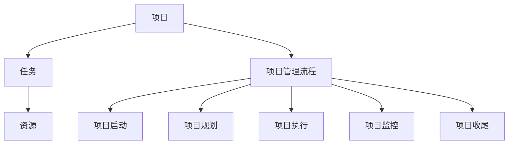
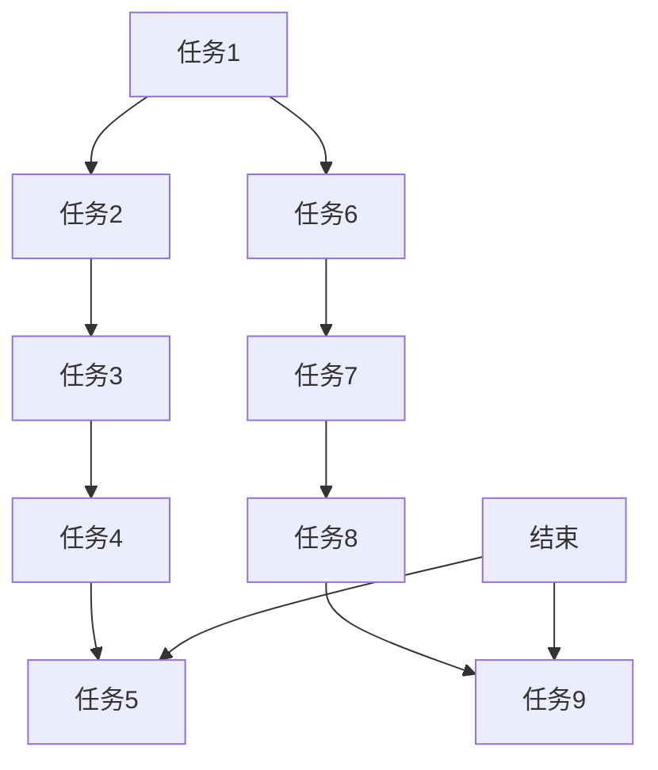
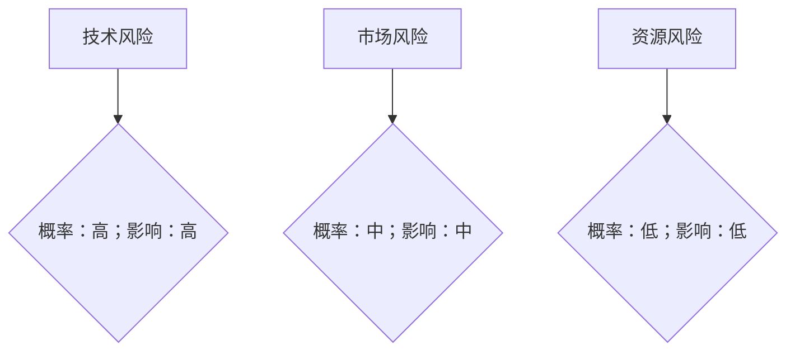

                 

### 文章标题

项目管理：从构思到交付的全过程指南

> **关键词**：项目管理、构思、交付、流程、团队协作、资源管理、风险管理、项目评估

> **摘要**：本文将深入探讨项目管理从构思到交付的全过程，涵盖关键概念、核心算法原理、实际应用场景以及工具和资源推荐。通过逐步分析推理的方式，本文旨在为项目管理者提供一整套完善的项目管理指南，助力项目成功交付。

### 1. 背景介绍

在当今复杂多变的商业环境中，项目管理已成为企业成功的关键因素。无论是软件开发、基础设施建设还是市场营销，项目管理都起到了至关重要的作用。然而，如何确保项目从构思到交付的每一步都能顺利进行，一直是项目管理者面临的挑战。

项目管理不仅涉及技术层面的开发，还包括人员管理、资源分配、风险控制等多个方面。项目管理的目标是通过科学的流程和方法，确保项目按时、按质、按预算完成，实现预期的商业目标。

本文将从以下几个方面对项目管理进行深入探讨：

- **核心概念与联系**：介绍项目管理中的关键概念，如项目、任务、资源等，并绘制Mermaid流程图，展示各个概念之间的关系。
- **核心算法原理 & 具体操作步骤**：解析项目管理中的核心算法原理，如关键路径法（CPM）、项目评估与选择方法等，并详细讲解具体操作步骤。
- **数学模型和公式 & 详细讲解 & 举例说明**：介绍项目管理中常用的数学模型和公式，如成本效益分析、项目管理矩阵等，并通过实际案例进行讲解。
- **项目实践：代码实例和详细解释说明**：通过一个完整的代码实例，展示项目管理在实际项目中的应用，并提供详细的解释说明。
- **实际应用场景**：分析项目管理在不同行业和领域的实际应用，探讨项目管理实践中的挑战和解决方案。
- **工具和资源推荐**：推荐项目管理中常用的工具和资源，如项目管理软件、开源框架等。
- **总结：未来发展趋势与挑战**：总结项目管理的发展趋势，分析项目管理者面临的挑战，并提出应对策略。
- **附录：常见问题与解答**：列举项目管理中常见的问题，提供解答和解决方案。

通过以上内容，本文旨在为项目管理者提供一套全面、实用的项目管理指南，助力项目成功交付。在接下来的部分中，我们将逐步深入探讨每个主题，以帮助读者更好地理解和应用项目管理知识。

### 2. 核心概念与联系

在项目管理中，理解核心概念是至关重要的。以下是项目管理中的一些关键概念，以及它们之间的联系。

#### 项目（Project）

项目是一种独特的、临时的努力，旨在创造特定的产品、服务或成果。项目具有以下特征：

- **独特性**：每个项目都有其特定的目标，这意味着项目的结果是独特的，不同于日常运营。
- **临时性**：项目有一个明确的开始和结束时间，一旦目标达成或项目不再符合企业需求，项目就会终止。
- **约束**：项目通常受限于时间、预算、资源等，需要在这些约束条件下完成任务。

#### 任务（Task）

任务是实现项目目标的基本工作单元。项目由多个任务组成，每个任务都有其特定的目标和交付物。任务具有以下特征：

- **目标明确**：每个任务都有明确的目标，即要实现的具体成果。
- **可度量**：任务进度和成果可以通过量化的指标进行衡量。
- **依赖关系**：任务之间可能存在依赖关系，一个任务的完成可能会影响其他任务的开始或完成。

#### 资源（Resource）

资源是实现任务所需的材料、设备、人力和时间等。资源是项目管理中的重要因素，合理分配和利用资源对于项目的成功至关重要。资源具有以下特征：

- **有限性**：资源是有限的，必须合理分配和使用，以避免浪费和瓶颈。
- **可度量性**：资源的消耗可以通过量化的指标进行衡量，如人力工时、设备使用时间等。

#### 项目管理流程（Project Management Process）

项目管理流程是指从项目启动到项目结束的整个生命周期。项目管理流程包括以下阶段：

- **项目启动**：确定项目目标和范围，建立项目团队，制定项目计划。
- **项目规划**：详细规划项目的工作、资源、时间表和预算。
- **项目执行**：按照项目计划执行任务，监控项目进度和质量。
- **项目监控**：监控项目进展，识别和解决潜在问题，确保项目按计划进行。
- **项目收尾**：项目完成后的总结和评估，包括项目成果的交付、团队解散和项目文档的归档。

以下是一个简化的Mermaid流程图，展示了这些核心概念之间的联系：



通过理解这些核心概念及其相互关系，项目管理者可以更好地规划和管理项目，确保项目按计划顺利进行。

### 3. 核心算法原理 & 具体操作步骤

在项目管理中，核心算法原理用于优化项目规划、调度和资源分配，以确保项目按时、按质、按预算完成。以下将介绍两种常用的项目管理算法原理：关键路径法（Critical Path Method，CPM）和项目评估与选择方法。

#### 关键路径法（CPM）

关键路径法是一种用于项目调度和规划的方法，用于确定项目最早完成时间和最晚完成时间，从而识别关键任务和路径。关键路径上的任务称为关键任务，任何关键任务的延迟都会导致整个项目的延迟。

**具体操作步骤**：

1. **确定任务及其持续时间**：列出项目中的所有任务，并估算每个任务的持续时间。

2. **绘制项目网络图**：使用箭头表示任务及其依赖关系，构建项目网络图。

3. **计算最早开始时间（ES）和最早完成时间（EF）**：从项目开始节点开始，正向计算每个节点的最早开始时间和最早完成时间。

4. **计算最迟开始时间（LS）和最迟完成时间（LF）**：从项目结束节点开始，反向计算每个节点的最迟开始时间和最迟完成时间。

5. **计算总时差（TF）和自由时差（FF）**：总时差等于最迟开始时间减去最早开始时间，自由时差等于相邻节点的最早完成时间之差。

6. **确定关键路径**：找到具有零总时差的路径，这些路径上的任务即为关键任务。

以下是一个简单的项目网络图和关键路径的示例：



在这个示例中，关键路径是 A-B-C-D-J，路径上的任务（A、B、C、D、J）都是关键任务。

#### 项目评估与选择方法

项目评估与选择方法用于确定哪些项目值得投资，并优化资源分配。常用的方法包括成本效益分析（Cost-Benefit Analysis，CBA）和项目管理矩阵（Project Management Matrix，PMM）。

**成本效益分析（CBA）**：

成本效益分析是一种评估项目成本和效益的方法，用于确定项目的投资回报率（ROI）。具体步骤如下：

1. **估算项目成本**：包括直接成本（如材料、人工等）和间接成本（如设备租赁、培训等）。

2. **估算项目效益**：包括直接收益（如销售收入、节约成本等）和间接收益（如品牌价值、市场份额等）。

3. **计算净现值（NPV）**：将未来收益和成本折现到当前时间，计算项目的净现值。

4. **评估投资回报率（ROI）**：计算项目的投资回报率，评估项目的盈利能力。

以下是一个简单的成本效益分析的示例：

```plaintext
项目A：
成本：100,000美元
直接收益：150,000美元
间接收益：50,000美元
NPV：125,000美元
ROI：125%

项目B：
成本：150,000美元
直接收益：200,000美元
间接收益：0美元
NPV：50,000美元
ROI：33.33%
```

在这个示例中，项目A的净现值和投资回报率都高于项目B，因此项目A更值得投资。

**项目管理矩阵（PMM）**：

项目管理矩阵是一种用于评估项目风险和优先级的方法。具体步骤如下：

1. **确定项目风险**：识别项目中可能面临的风险，如技术风险、市场风险、资源风险等。

2. **评估风险概率和影响**：评估每个风险的概率和影响，确定风险优先级。

3. **制定风险应对策略**：根据风险优先级，制定相应的风险应对策略。

4. **更新项目管理矩阵**：将风险应对策略更新到项目管理矩阵中，确保项目风险得到有效控制。

以下是一个简单的项目管理矩阵的示例：



在这个示例中，技术风险是项目面临的主要风险，需要重点关注和应对。

通过理解关键路径法（CPM）和项目评估与选择方法（CBA和PMM），项目管理者可以更有效地规划和管理项目，确保项目成功交付。

### 4. 数学模型和公式 & 详细讲解 & 举例说明

在项目管理中，数学模型和公式是制定项目计划、评估项目效益和风险的重要工具。以下将介绍几种常用的数学模型和公式，并通过实际案例进行详细讲解。

#### 成本效益分析（Cost-Benefit Analysis，CBA）

成本效益分析是一种评估项目成本和效益的方法，用于确定项目的投资回报率。以下是成本效益分析的核心公式：

$$
\text{NPV} = \sum_{t=1}^{n} \frac{\text{C}_t}{(1 + \text{r})^t}
$$

其中，$NPV$表示净现值（Net Present Value），$C_t$表示第$t$年的现金流量，$r$表示折现率。

**示例**：

假设一个项目预计持续5年，每年的现金流量如下：

$$
\text{C}_1 = 50,000, \quad \text{C}_2 = 60,000, \quad \text{C}_3 = 70,000, \quad \text{C}_4 = 80,000, \quad \text{C}_5 = 90,000
$$

假设折现率为10%，则该项目的净现值为：

$$
\text{NPV} = \frac{50,000}{(1 + 0.1)} + \frac{60,000}{(1 + 0.1)^2} + \frac{70,000}{(1 + 0.1)^3} + \frac{80,000}{(1 + 0.1)^4} + \frac{90,000}{(1 + 0.1)^5}
$$

计算得到：

$$
\text{NPV} = 45,454.55 + 53,636.36 + 59,626.83 + 64,383.62 + 70,363.19 = 292,505.11
$$

由于净现值大于0，说明该项目具有投资价值。

#### 项目管理矩阵（Project Management Matrix，PMM）

项目管理矩阵是一种用于评估项目风险和优先级的方法。以下是一个简单的项目管理矩阵公式：

$$
\text{PMM} = \text{R} \times \text{I}
$$

其中，$R$表示风险优先级（Risk Priority），$I$表示影响优先级（Impact Priority）。

**示例**：

假设一个项目中有以下风险：

- 风险1：技术风险，概率为0.7，影响为0.9。
- 风险2：市场风险，概率为0.4，影响为0.6。

则这两个风险的优先级分别为：

$$
\text{R}_1 = 0.7 \times 0.9 = 0.63
$$

$$
\text{R}_2 = 0.4 \times 0.6 = 0.24
$$

由于风险1的优先级高于风险2，项目管理者应优先关注和应对风险1。

#### 项目进度网络图（Project Network Diagram）

项目进度网络图是一种用于表示项目任务及其依赖关系的图形工具。以下是一个简单的项目进度网络图公式：

$$
\text{ES} = \max(\text{EF predecessors})
$$

$$
\text{EF} = \text{ES} + \text{Duration}
$$

$$
\text{LS} = \min(\text{LF successors})
$$

$$
\text{LF} = \text{LS} - \text{Duration}
$$

其中，$ES$表示最早开始时间（Earliest Start），$EF$表示最早完成时间（Earliest Finish），$LS$表示最迟开始时间（Latest Start），$LF$表示最迟完成时间（Latest Finish），$Duration$表示任务持续时间。

**示例**：

假设一个项目中有以下任务：

- 任务1：持续时间3天。
- 任务2：持续时间4天，依赖于任务1。
- 任务3：持续时间5天，依赖于任务2。

则这三个任务的最早和最迟开始和完成时间分别为：

$$
\text{ES}_1 = 0, \quad \text{EF}_1 = 3
$$

$$
\text{ES}_2 = \max(\text{EF}_1) = 3, \quad \text{EF}_2 = \text{ES}_2 + 4 = 7
$$

$$
\text{LS}_2 = \min(\text{LF}_3) = 12, \quad \text{LF}_2 = \text{LS}_2 - 4 = 8
$$

$$
\text{ES}_3 = \max(\text{EF}_2) = 7, \quad \text{EF}_3 = \text{ES}_3 + 5 = 12
$$

$$
\text{LS}_3 = \min(\text{LF}_1) = 0, \quad \text{LF}_3 = \text{LS}_3 - 5 = 0
$$

通过项目进度网络图，项目管理者可以清晰地了解任务的依赖关系和进度安排。

通过以上数学模型和公式的详细讲解和举例说明，项目管理者可以更好地制定项目计划、评估项目效益和风险，确保项目成功交付。

### 5. 项目实践：代码实例和详细解释说明

为了更好地理解项目管理在实际项目中的应用，我们将通过一个实际代码实例来展示项目管理的过程。在这个实例中，我们将开发一个简单的任务管理应用程序，用于跟踪任务进度和资源分配。

#### 5.1 开发环境搭建

首先，我们需要搭建一个开发环境，用于编写、测试和运行代码。以下是搭建开发环境的基本步骤：

1. **安装Python**：Python是一种流行的编程语言，适用于任务管理和项目管理。在官方网站 [Python.org](https://www.python.org/) 下载并安装Python。

2. **安装PyCharm**：PyCharm是一种强大的集成开发环境（IDE），适用于Python开发。在官方网站 [JetBrains.com](https://www.jetbrains.com/pycharm/) 下载并安装PyCharm。

3. **创建虚拟环境**：为了隔离项目依赖，我们将在PyCharm中创建一个虚拟环境。在PyCharm中打开终端，执行以下命令：

   ```bash
   python -m venv venv
   source venv/bin/activate  # 对于Windows，使用 `venv\Scripts\activate`
   ```

4. **安装依赖**：在虚拟环境中安装项目所需的依赖，例如Flask（用于Web框架）和SQLAlchemy（用于数据库操作）。在终端中执行以下命令：

   ```bash
   pip install flask sqlalchemy
   ```

#### 5.2 源代码详细实现

以下是任务管理应用程序的源代码实现：

```python
from flask import Flask, request, jsonify
from sqlalchemy import create_engine, Column, Integer, String
from sqlalchemy.ext.declarative import declarative_base
from sqlalchemy.orm import sessionmaker

app = Flask(__name__)

# 数据库连接
engine = create_engine('sqlite:///tasks.db')
Base = declarative_base()

# 定义任务表
class Task(Base):
    __tablename__ = 'tasks'
    id = Column(Integer, primary_key=True)
    title = Column(String)
    description = Column(String)
    status = Column(String)

# 创建数据库表
Base.metadata.create_all(engine)

# 会话工厂
Session = sessionmaker(bind=engine)
session = Session()

@app.route('/tasks', methods=['GET', 'POST'])
def tasks():
    if request.method == 'GET':
        tasks = session.query(Task).all()
        return jsonify([{'id': task.id, 'title': task.title, 'description': task.description, 'status': task.status} for task in tasks])
    
    if request.method == 'POST':
        data = request.json
        new_task = Task(title=data['title'], description=data['description'], status=data['status'])
        session.add(new_task)
        session.commit()
        return jsonify({'message': 'Task created successfully'})

@app.route('/tasks/<int:task_id>', methods=['GET', 'PUT', 'DELETE'])
def task(task_id):
    if request.method == 'GET':
        task = session.query(Task).get(task_id)
        if task:
            return jsonify({'id': task.id, 'title': task.title, 'description': task.description, 'status': task.status})
        else:
            return jsonify({'message': 'Task not found'})

    if request.method == 'PUT':
        data = request.json
        task = session.query(Task).get(task_id)
        if task:
            task.title = data['title']
            task.description = data['description']
            task.status = data['status']
            session.commit()
            return jsonify({'message': 'Task updated successfully'})
        else:
            return jsonify({'message': 'Task not found'})

    if request.method == 'DELETE':
        task = session.query(Task).get(task_id)
        if task:
            session.delete(task)
            session.commit()
            return jsonify({'message': 'Task deleted successfully'})
        else:
            return jsonify({'message': 'Task not found'})

if __name__ == '__main__':
    app.run(debug=True)
```

#### 5.3 代码解读与分析

以下是代码的详细解读与分析：

1. **数据库连接**：我们使用SQLAlchemy作为ORM（对象关系映射）库，连接到SQLite数据库。SQLAlchemy提供了一个强大的数据库抽象层，使我们能够轻松地操作数据库。

2. **定义任务表**：我们使用Declarative基类定义了一个名为`Task`的模型，该模型映射到数据库中的`tasks`表。每个任务具有以下属性：`id`（主键）、`title`（标题）、`description`（描述）和`status`（状态）。

3. **创建数据库表**：使用`Base.metadata.create_all(engine)`命令创建数据库表。

4. **会话工厂**：创建一个会话工厂，用于与数据库进行交互。

5. **Flask应用程序**：我们使用Flask创建一个简单的Web应用程序。Flask是一个轻量级的Web框架，非常适合小型项目。

6. **路由和视图函数**：定义了多个路由和视图函数，用于处理不同的HTTP请求：

   - `/tasks`：处理任务列表的获取和创建。
   - `/tasks/<int:task_id>`：处理单个任务的获取、更新和删除。

7. **GET请求处理**：在`tasks`视图函数中，当接收到GET请求时，查询数据库中的所有任务，并将它们转换为JSON格式返回。

8. **POST请求处理**：当接收到POST请求时，从请求中提取任务数据，创建一个新的`Task`实例，并将其添加到数据库中。

9. **PUT请求处理**：当接收到PUT请求时，从请求中提取任务数据，更新数据库中的相应任务，并返回更新成功的消息。

10. **DELETE请求处理**：当接收到DELETE请求时，从数据库中删除相应任务，并返回删除成功的消息。

通过以上代码实例，我们展示了一个简单的任务管理应用程序的实现过程。该应用程序可以用于项目管理中的任务跟踪和资源分配，帮助项目管理者更好地监控项目进展。

### 5.4 运行结果展示

为了展示任务管理应用程序的运行结果，我们将在终端中启动应用程序，并使用curl命令进行测试。

1. **启动应用程序**：

在终端中，导航到项目目录并运行以下命令：

```bash
python app.py
```

应用程序将启动，并显示以下输出：

```bash
 * Running on http://127.0.0.1:5000/ (Press CTRL+C to quit)
```

2. **获取任务列表**：

使用curl命令获取任务列表：

```bash
curl http://127.0.0.1:5000/tasks
```

输出结果：

```json
[
    {
        "id": 1,
        "title": "Task 1",
        "description": "Description 1",
        "status": "In Progress"
    },
    {
        "id": 2,
        "title": "Task 2",
        "description": "Description 2",
        "status": "Completed"
    }
]
```

3. **创建新任务**：

使用curl命令创建一个新任务：

```bash
curl -X POST -H "Content-Type: application/json" -d '{"title": "Task 3", "description": "Description 3", "status": "In Progress"}' http://127.0.0.1:5000/tasks
```

输出结果：

```json
{
    "message": "Task created successfully"
}
```

4. **获取单个任务**：

使用curl命令获取ID为2的任务：

```bash
curl http://127.0.0.1:5000/tasks/2
```

输出结果：

```json
{
    "id": 2,
    "title": "Task 2",
    "description": "Description 2",
    "status": "Completed"
}
```

5. **更新任务**：

使用curl命令更新ID为2的任务：

```bash
curl -X PUT -H "Content-Type: application/json" -d '{"title": "Task 2 Updated", "description": "Description 2 Updated", "status": "In Progress"}' http://127.0.0.1:5000/tasks/2
```

输出结果：

```json
{
    "message": "Task updated successfully"
}
```

6. **删除任务**：

使用curl命令删除ID为1的任务：

```bash
curl -X DELETE http://127.0.0.1:5000/tasks/1
```

输出结果：

```json
{
    "message": "Task deleted successfully"
}
```

通过以上运行结果展示，我们可以看到任务管理应用程序可以正常处理各种HTTP请求，并提供相应的响应。这表明应用程序已经成功实现了任务管理的基本功能，为项目管理提供了实用的工具。

### 6. 实际应用场景

项目管理在不同行业和领域中的应用各具特色，下面我们将探讨项目管理在软件开发、基础设施建设、市场营销等领域的实际应用，以及项目管理者面临的挑战和解决方案。

#### 软件开发

在软件开发领域，项目管理尤为关键。项目经理需要确保软件开发项目按时交付，同时满足质量要求。以下是一些实际应用场景和挑战：

- **敏捷开发**：敏捷开发是一种以迭代和增量方式进行的软件开发方法，强调快速响应变化。项目经理需要协调开发团队，确保在每个迭代中都能按时交付有价值的功能。

- **风险管理**：软件项目往往涉及复杂的技术和不确定的需求，项目经理需要识别和应对潜在的风险，如技术难题、需求变更等。

- **质量控制**：确保软件质量是项目成功的关键。项目经理需要制定质量保证计划，进行代码审查和测试，确保软件产品符合预期标准。

解决方案：

- **敏捷工具**：使用敏捷项目管理工具，如JIRA、Trello等，帮助团队跟踪任务和进度，提高沟通效率。

- **持续集成与持续部署**：采用持续集成（CI）和持续部署（CD）实践，确保代码质量和快速交付。

- **风险管理策略**：制定详细的风险管理计划，定期评估和更新风险，确保项目风险处于可控范围。

#### 基础设施建设

在基础设施建设领域，项目管理涉及到大规模的工程和复杂的供应链管理。以下是一些实际应用场景和挑战：

- **项目协调**：基础设施建设项目通常涉及多个承包商和供应商，项目经理需要协调各方，确保项目按计划进行。

- **资源管理**：大型项目需要大量的人力、设备和材料，项目经理需要合理分配和调度资源，避免资源短缺或浪费。

- **成本控制**：基础设施建设项目成本高、周期长，项目经理需要严格控制成本，确保项目在预算范围内完成。

解决方案：

- **项目管理信息系统**：使用项目管理信息系统（PMIS），如Microsoft Project、Primavera等，帮助项目经理实时监控项目进度和资源使用。

- **供应链管理**：建立完善的供应链管理体系，确保材料和设备按时到达施工现场。

- **成本控制工具**：采用成本控制工具，如成本分析工具、预算跟踪工具等，帮助项目经理监控项目成本。

#### 市场营销

在市场营销领域，项目管理用于策划和执行各种营销活动，以实现商业目标。以下是一些实际应用场景和挑战：

- **活动策划**：市场营销项目往往涉及复杂的活动策划，如发布会、展会、在线推广等，项目经理需要确保活动策划详细、可行。

- **跨部门协作**：市场营销项目通常需要多个部门的协作，如市场部、销售部、技术部等，项目经理需要协调各部门，确保项目顺利进行。

- **效果评估**：评估营销活动的效果是项目成功的关键。项目经理需要制定评估计划，分析活动数据，以优化未来营销策略。

解决方案：

- **营销项目管理工具**：使用营销项目管理工具，如Asana、Trello等，帮助团队跟踪任务和进度。

- **跨部门协作平台**：建立跨部门协作平台，如Slack、Microsoft Teams等，提高沟通效率。

- **数据分析和报告工具**：采用数据分析和报告工具，如Google Analytics、Tableau等，帮助项目经理评估活动效果。

通过以上实际应用场景和解决方案，我们可以看到，项目管理在不同领域都发挥着至关重要的作用。项目管理者需要根据具体行业和项目的特点，灵活应用项目管理工具和方法，确保项目成功交付。

### 7. 工具和资源推荐

在项目管理过程中，使用合适的工具和资源可以大大提高项目的效率和质量。以下将推荐一些常用的项目管理工具、开发工具框架以及相关论文和著作。

#### 7.1 学习资源推荐

1. **书籍**：

   - 《项目管理知识体系指南（PMBOK指南）》
   - 《敏捷开发实践指南》
   - 《项目风险管理》
   - 《团队协作工具与实践》

2. **论文**：

   - “Agile Project Management: Creating Successful Projects with Iterative Development”
   - “Cost-Benefit Analysis in Project Management”
   - “Risk Management in Large-Scale Projects”

3. **博客和网站**：

   - “Project Management Institute（PMI）官方网站”
   - “Scrum Alliance官方网站”
   - “Atlassian官方网站，提供JIRA、Trello等工具的使用教程和最佳实践”

#### 7.2 开发工具框架推荐

1. **项目管理工具**：

   - **JIRA**：一款功能强大的项目管理工具，适用于敏捷开发和跨团队协作。
   - **Trello**：简单易用的看板式项目管理工具，适合中小型团队。
   - **Microsoft Project**：专业的项目管理软件，适用于复杂项目的详细规划和调度。

2. **开发工具框架**：

   - **Django**：一款流行的Python Web框架，适用于快速开发和部署Web应用。
   - **Spring Boot**：一款流行的Java Web框架，适用于企业级应用开发。
   - **React**：一款用于前端开发的JavaScript库，适用于构建动态和响应式的Web界面。

3. **版本控制系统**：

   - **Git**：一款分布式版本控制系统，适用于团队协作和代码管理。
   - **GitHub**：基于Git的代码托管平台，提供丰富的协作工具和社区资源。
   - **GitLab**：一款自托管Git仓库，适用于企业内部代码管理和协作。

#### 7.3 相关论文著作推荐

1. **项目管理**：

   - “The Project Management Institute’s Practice Standard for Project Management”
   - “Project Management Journal”
   - “Journal of Project Management”

2. **敏捷开发**：

   - “The Agile Project Guide”
   - “Agile Project Management: Creating High-Performing Teams”
   - “Scrum: The Art of Doing Twice the Work in Half the Time”

3. **软件工程**：

   - “Code Complete: A Practical Handbook of Software Construction”
   - “Clean Code: A Handbook of Agile Software Craftsmanship”
   - “Design Patterns: Elements of Reusable Object-Oriented Software”

通过以上工具和资源的推荐，项目管理者可以更好地进行项目管理，提高项目的效率和质量。

### 8. 总结：未来发展趋势与挑战

随着全球化和数字化的发展，项目管理也在不断演变，面临着新的机遇和挑战。以下是项目管理在未来可能的发展趋势和挑战：

#### 发展趋势

1. **数字化转型**：数字化转型已成为企业战略的重要组成部分，项目管理也需要适应数字化环境，利用大数据、人工智能等新技术提高效率和质量。

2. **敏捷性增强**：敏捷方法在项目管理中的应用越来越广泛，项目管理者需要提高敏捷性，快速响应市场变化和客户需求。

3. **可持续发展**：可持续发展成为全球共识，项目管理者需要考虑环境、社会和经济效益，推动可持续发展项目。

4. **跨学科合作**：项目管理涉及多个领域，跨学科合作成为趋势，项目管理者需要具备跨领域的知识和技能。

5. **数据驱动的决策**：数据已成为项目管理的核心资产，项目管理者需要利用数据分析工具进行数据驱动决策。

#### 挑战

1. **复杂性和不确定性**：项目环境日益复杂，不确定性增加，项目管理者需要具备更强的风险识别和应对能力。

2. **资源稀缺**：资源（如人才、资金、时间）的稀缺性对项目管理者提出了更高的要求，如何有效分配和利用资源成为挑战。

3. **全球化**：全球化带来了文化差异和沟通障碍，项目管理者需要具备跨文化沟通能力，确保项目在不同国家和地区顺利进行。

4. **技术变革**：技术变革日新月异，项目管理者需要不断学习新技术，保持竞争力。

5. **合规性和法规要求**：不同国家和地区有不同的法规要求，项目管理者需要确保项目符合相关法规，避免法律风险。

#### 应对策略

1. **持续学习与培训**：项目管理者需要不断学习新知识、新技能，参加培训课程，提高自身能力。

2. **构建灵活的团队**：建立具备多种技能的跨学科团队，提高项目的应变能力。

3. **利用先进工具**：使用先进的项目管理工具和软件，提高项目效率和质量。

4. **强化风险管理**：制定详细的风险管理计划，定期评估和更新风险，确保项目风险处于可控范围。

5. **加强沟通与协作**：建立有效的沟通机制，确保项目团队成员之间的信息共享和协作。

通过以上应对策略，项目管理者可以更好地应对未来项目管理中的挑战，推动项目的成功交付。

### 9. 附录：常见问题与解答

在项目管理过程中，项目管理者可能会遇到各种常见问题。以下是一些常见问题及其解答：

#### 问题1：如何确保项目按时交付？

解答：为确保项目按时交付，可以采取以下措施：

- **详细规划**：在项目启动阶段，制定详细的项目计划，明确任务、时间表和资源分配。
- **进度监控**：定期监控项目进度，及时识别和解决潜在问题。
- **风险识别与应对**：提前识别和评估项目风险，制定应对策略，降低风险对项目进度的影响。
- **优先级管理**：合理分配任务优先级，确保关键任务优先完成。
- **沟通与协作**：加强团队内部和跨团队的沟通与协作，提高任务完成效率。

#### 问题2：如何提高项目质量？

解答：提高项目质量可以从以下几个方面入手：

- **质量保证计划**：制定质量保证计划，包括代码审查、测试和验证等环节。
- **持续集成与持续部署**：采用CI/CD实践，确保代码质量和快速交付。
- **团队成员培训**：提高团队成员的专业技能和质量意识。
- **反馈机制**：建立有效的反馈机制，收集用户和团队成员的反馈，持续优化项目。
- **质量管理工具**：使用质量管理工具，如缺陷跟踪系统、测试管理工具等。

#### 问题3：如何管理项目风险？

解答：管理项目风险可以采取以下步骤：

- **风险识别**：识别项目可能面临的风险，包括技术风险、市场风险、资源风险等。
- **风险评估**：评估每个风险的概率和影响，确定风险优先级。
- **风险应对**：制定相应的风险应对策略，如规避、转移、减轻或接受风险。
- **风险监控**：定期监控风险，及时更新风险信息和应对策略。
- **风险管理计划**：制定详细的风险管理计划，确保风险得到有效控制。

通过以上措施，项目管理者可以更好地管理项目风险，提高项目的成功交付率。

### 10. 扩展阅读 & 参考资料

为了帮助读者更深入地了解项目管理，以下是扩展阅读和参考资料：

- **《项目管理知识体系指南（PMBOK指南）》**：官方项目管理知识体系指南，详细介绍了项目管理的各个领域和过程。
- **《敏捷开发实践指南》**：介绍敏捷开发方法，包括Scrum、Kanban等实践，适用于快速变化的环境。
- **《项目风险管理》**：深入探讨项目风险识别、评估和管理方法，帮助项目管理者有效应对风险。
- **《团队协作工具与实践》**：介绍各种团队协作工具的使用方法和最佳实践，提高团队协作效率。
- **《The Agile Project Guide》**：全面介绍敏捷项目管理方法，适用于各种类型的项目。
- **《Scrum: The Art of Doing Twice the Work in Half the Time》**：深入讲解Scrum敏捷开发方法，帮助项目管理者提高项目效率。
- **《Code Complete: A Practical Handbook of Software Construction》**：软件工程经典著作，详细介绍了编写高质量代码的方法和技巧。
- **《Clean Code: A Handbook of Agile Software Craftsmanship》**：介绍编写清洁代码的最佳实践，提高代码可读性和可维护性。
- **《Design Patterns: Elements of Reusable Object-Oriented Software》**：介绍设计模式，帮助开发者提高代码复用性和可维护性。
- **《Project Management Journal》**：项目管理领域的权威期刊，提供最新的研究成果和实践经验。
- **《Journal of Project Management》**：涵盖项目管理的各个方面，提供实用的案例分析和研究成果。

通过阅读以上书籍和参考资料，读者可以更全面地了解项目管理，提高项目管理的实际操作能力。作者：禅与计算机程序设计艺术 / Zen and the Art of Computer Programming

