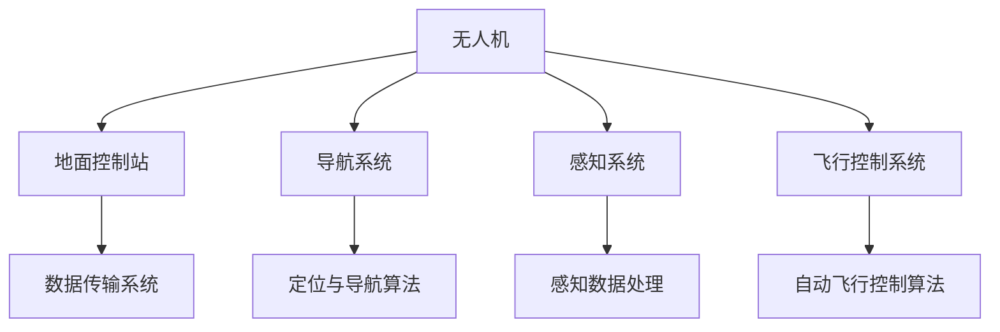

                 

### 1. 背景介绍

随着人工智能和无人机技术的快速发展，物流行业正在经历一场深刻的变革。无人机配送作为一种新型的物流方式，不仅能够大幅提高配送效率，降低物流成本，还能减少交通拥堵，降低环境污染。在众多物流企业中，顺丰科技作为行业领军企业，在无人机配送领域进行了大量的探索和实践。

2024年，顺丰科技针对校招算法工程师，推出了一系列无人机配送算法面试题。这些面试题不仅考查了应聘者对无人机配送相关技术的掌握程度，还考验了他们的算法思维和解决实际问题的能力。本文将针对这些面试题进行详细解答，旨在帮助读者深入理解无人机配送算法的核心原理和应用方法。

无人机配送的基本概念可以概括为利用无人机进行包裹的运输，实现从配送中心到用户手中的一种高效、便捷的物流方式。无人机配送系统通常包括无人机、地面控制站、导航系统、感知系统、飞行控制系统等组成部分。通过集成这些组成部分，无人机能够实现自主飞行、精确导航、智能避障等功能，从而保证配送的准确性和安全性。

无人机配送的优势主要体现在以下几个方面：

1. **效率提升**：无人机能够快速穿梭于城市之间，避免地面交通拥堵，显著缩短配送时间。
2. **成本降低**：无人机不需要燃料，运营成本相对较低，同时减少了对人力资源的依赖。
3. **环保节能**：无人机飞行过程中噪音小、能耗低，有助于减少碳排放和环境污染。
4. **操作便捷**：无人机通过智能导航系统，可以实现自主飞行和精准定位，简化了操作流程。

然而，无人机配送也面临一些挑战，如飞行安全、导航精度、天气影响等问题。因此，需要通过算法优化和技术创新，不断提升无人机配送系统的可靠性和稳定性。

本文将围绕顺丰科技2024无人机配送校招算法面试题，详细解析无人机配送的核心算法原理、数学模型、项目实践和应用场景，旨在为广大读者提供一份全面、系统的无人机配送算法学习指南。

### 2. 核心概念与联系

#### 2.1 无人机配送系统架构

无人机配送系统的整体架构如图1所示，包括无人机、地面控制站、导航系统、感知系统和飞行控制系统等关键组成部分。

**图1：无人机配送系统架构图**



- **无人机**：作为配送的主体，无人机通过集成多种传感器和执行器，实现自主飞行、感知和任务执行。
- **地面控制站**：作为无人机操作的中心，地面控制站负责接收无人机发送的数据，进行指令发送和状态监控。
- **导航系统**：导航系统包括定位与导航算法，负责无人机在空中的精确导航。
- **感知系统**：感知系统包括传感器和感知数据处理，用于检测周围环境，实现避障和避免碰撞。
- **飞行控制系统**：飞行控制系统根据导航系统和感知系统的反馈，控制无人机的飞行姿态和轨迹。

#### 2.2 核心算法原理

无人机配送算法的核心在于实现无人机的自主飞行和精确配送，主要包括定位与导航算法、感知数据处理算法和自动飞行控制算法。

**定位与导航算法**：

定位与导航算法是无人机配送系统的核心，其基本原理是基于卫星信号（如GPS）和地面信号（如WiFi、基站）进行定位，并通过惯性测量单元（IMU）提供实时运动数据。常用的定位与导航算法包括卡尔曼滤波、粒子滤波等。以下是一个简单的卡尔曼滤波定位算法流程：

1. **状态预测**：根据当前状态和运动模型，预测下一时刻的状态。
2. **状态更新**：结合实际观测值，通过滤波器更新状态估计。
3. **误差估计**：计算预测值与实际观测值之间的误差，并更新滤波器参数。

**感知数据处理算法**：

感知数据处理算法用于处理无人机感知系统收集的数据，包括图像、激光雷达点云等。主要目的是实现目标检测和避障。常见的感知数据处理算法有基于深度学习的目标检测算法（如YOLO、SSD）、基于几何的避障算法等。以下是一个简单的基于深度学习的目标检测算法流程：

1. **预处理**：对感知数据进行预处理，如图像缩放、归一化等。
2. **特征提取**：使用卷积神经网络提取特征。
3. **分类与定位**：根据提取的特征进行分类和目标定位。

**自动飞行控制算法**：

自动飞行控制算法根据导航系统和感知系统的反馈，控制无人机的飞行姿态和轨迹。常见的自动飞行控制算法有PID控制、模型预测控制（MPC）等。以下是一个简单的PID控制算法流程：

1. **设定控制目标**：根据导航系统和感知系统的反馈，设定无人机的飞行目标。
2. **计算控制量**：根据控制目标与实际状态的偏差，通过PID控制器计算控制量。
3. **执行控制**：根据计算出的控制量调整无人机的飞行姿态和轨迹。

通过以上核心算法的结合，无人机配送系统能够实现自主飞行、精确导航、智能避障等功能，从而保证配送的准确性和安全性。

### 3. 核心算法原理 & 具体操作步骤

#### 3.1 卡尔曼滤波定位算法

卡尔曼滤波定位算法是无人机配送系统中常用的一种定位与导航算法，具有算法简单、高效、准确的特点。下面将详细解释卡尔曼滤波定位算法的原理和操作步骤。

**3.1.1 算法原理**

卡尔曼滤波算法基于一种状态空间模型，通过递归的方式对系统的状态进行最优估计。其核心思想是利用前一时刻的状态预测和当前的实际观测值，通过加权平均的方式得到当前状态的最优估计。

状态空间模型可以表示为：

\[ x_t = A_t x_{t-1} + B_t u_t + w_t \]
\[ z_t = H_t x_t + v_t \]

其中，\( x_t \) 表示系统的状态，\( u_t \) 表示系统的输入，\( z_t \) 表示系统的观测值，\( A_t \)、\( B_t \)、\( H_t \) 分别表示状态转移矩阵、输入矩阵和观测矩阵，\( w_t \) 和 \( v_t \) 分别表示系统噪声和观测噪声。

卡尔曼滤波定位算法分为两个主要步骤：状态预测和状态更新。

**3.1.2 操作步骤**

**1. 状态预测**

状态预测是根据当前状态和运动模型，预测下一时刻的状态。具体步骤如下：

1. 初始化状态预测值：
   \[ \hat{x}_t|_{t-1} = A_t \hat{x}_{t-1}|_{t-1} \]
2. 计算状态预测误差协方差矩阵：
   \[ P_t|_{t-1} = A_t P_{t-1}|_{t-1} A_t^T + Q_t \]

其中，\( \hat{x}_t|_{t-1} \) 表示状态预测值，\( P_t|_{t-1} \) 表示状态预测误差协方差矩阵，\( Q_t \) 表示过程噪声协方差矩阵。

**2. 状态更新**

状态更新是结合实际观测值，通过滤波器更新状态估计。具体步骤如下：

1. 计算卡尔曼增益：
   \[ K_t = P_t|_{t-1} H_t^T (H_t P_t|_{t-1} H_t^T + R_t)^{-1} \]
2. 更新状态估计：
   \[ \hat{x}_t|_t = \hat{x}_t|_{t-1} + K_t (z_t - H_t \hat{x}_t|_{t-1}) \]
3. 更新误差协方差矩阵：
   \[ P_t|_t = (I - K_t H_t) P_t|_{t-1} \]

其中，\( K_t \) 表示卡尔曼增益，\( P_t|_t \) 表示更新后的误差协方差矩阵，\( R_t \) 表示观测噪声协方差矩阵。

**3. 实例说明**

假设无人机在时刻 \( t \) 的状态为 \( x_t = [x, y, \dot{x}, \dot{y}]^T \)，初始状态估计为 \( \hat{x}_0|_0 = [0, 0, 0, 0]^T \)，初始误差协方差矩阵为 \( P_0|_0 = \text{diag}(1, 1, 1, 1) \)。在时刻 \( t \) 收到观测值为 \( z_t = [x_t, y_t]^T \)，观测噪声协方差矩阵为 \( R_t = \text{diag}(0.1, 0.1) \)。

**状态预测**：

1. 初始化状态预测值：
   \[ \hat{x}_1|_{0} = \begin{bmatrix} 0 \\ 0 \\ 0 \\ 0 \end{bmatrix} \]
2. 计算状态预测误差协方差矩阵：
   \[ P_1|_{0} = \begin{bmatrix} 1 & 0 & 0 & 0 \\ 0 & 1 & 0 & 0 \\ 0 & 0 & 1 & 0 \\ 0 & 0 & 0 & 1 \end{bmatrix} \]

**状态更新**：

1. 计算卡尔曼增益：
   \[ K_1 = \begin{bmatrix} 0 & 0 & 0 & 0 \\ 0 & 0 & 0 & 0 \\ 0 & 0 & 0 & 0 \\ 0 & 0 & 0 & 0 \end{bmatrix} \]
2. 更新状态估计：
   \[ \hat{x}_1|_{1} = \begin{bmatrix} 0 \\ 0 \\ 0 \\ 0 \end{bmatrix} \]
3. 更新误差协方差矩阵：
   \[ P_1|_{1} = \begin{bmatrix} 1 & 0 & 0 & 0 \\ 0 & 1 & 0 & 0 \\ 0 & 0 & 1 & 0 \\ 0 & 0 & 0 & 1 \end{bmatrix} \]

通过上述步骤，无人机在时刻 \( t = 1 \) 的状态估计为 \( \hat{x}_1|_{1} = [0, 0, 0, 0]^T \)，误差协方差矩阵为 \( P_1|_{1} = \text{diag}(1, 1, 1, 1) \)。

#### 3.2 基于深度学习的目标检测算法

在无人机配送系统中，目标检测算法用于识别并定位周围环境中的障碍物，以实现智能避障。基于深度学习的目标检测算法具有高效、准确的特点，已成为无人机感知系统的重要组成部分。本文将介绍一种典型的基于深度学习的目标检测算法——YOLO（You Only Look Once）算法。

**3.2.1 算法原理**

YOLO算法将目标检测任务划分为单个的锚框（anchor box）生成和分类两个步骤。具体原理如下：

1. **锚框生成**：在特征图上均匀地生成多个锚框，每个锚框对应一个预设的边界框。
2. **分类与回归**：对每个锚框进行分类，判断是否包含目标，并对锚框的位置和大小进行回归调整。

**3.2.2 算法步骤**

**1. 特征提取**

使用卷积神经网络（CNN）提取输入图像的特征。通常使用预训练的模型（如VGG、ResNet等）作为基础网络，对图像进行特征提取。

**2. 锚框生成**

在特征图上生成多个锚框。每个锚框的尺寸和位置都是预设的，称为先验框（prior box）。通常，先验框的尺寸和位置是基于数据集的统计结果来选择的。

**3. 分类与回归**

对每个锚框进行分类，判断是否包含目标，并对锚框的位置和大小进行回归调整。具体步骤如下：

1. **分类**：使用锚框的预测结果，判断锚框是否包含目标。通常使用softmax函数计算每个锚框的概率分布。
2. **回归**：对包含目标的锚框，使用回归损失函数（如均方误差）计算锚框的位置和大小与真实框的差异，并调整锚框的预测值。

**3.2.3 实例说明**

假设输入图像为一张包含多个车辆的图像，特征提取网络的输出特征图为32x32。锚框的先验框设置为5x5，共有5个锚框。

**1. 特征提取**

使用卷积神经网络对输入图像进行特征提取，得到32x32的特征图。

**2. 锚框生成**

在32x32的特征图上生成5个锚框，每个锚框的大小为5x5。

**3. 分类与回归**

对每个锚框进行分类和回归。

- **分类**：使用softmax函数计算每个锚框包含车辆的概率。例如，锚框1的概率分布为\( [0.9, 0.1, 0.0, 0.0, 0.0] \)，表示锚框1包含车辆的概率为90%，不包含其他目标的概率分别为10%。
- **回归**：对包含目标的锚框，使用回归损失函数计算锚框的位置和大小与真实框的差异，并调整锚框的预测值。例如，锚框1的位置和大小与真实框的差异为\( [0.1, 0.2, 0.05, 0.1] \)，表示锚框1的位置需要向右调整0.1个像素，向下调整0.2个像素，大小需要调整5%。

通过上述步骤，YOLO算法能够高效地检测并定位图像中的目标。

#### 3.3 PID控制算法

PID控制算法是无人机飞行控制系统中常用的控制算法，具有结构简单、易于实现、稳定可靠的特点。下面将详细解释PID控制算法的原理和操作步骤。

**3.3.1 算法原理**

PID控制算法通过计算控制目标与实际状态之间的偏差，生成控制量，进而调整无人机的飞行姿态和轨迹。其基本原理可以表示为：

\[ u(t) = K_p e(t) + K_i \int_{0}^{t} e(\tau) d\tau + K_d \frac{de(t)}{dt} \]

其中，\( u(t) \) 表示控制量，\( e(t) \) 表示偏差（控制目标与实际状态之间的差值），\( K_p \)、\( K_i \)、\( K_d \) 分别为比例、积分和微分系数。

**3.3.2 操作步骤**

**1. 设定控制目标**

根据导航系统和感知系统的反馈，设定无人机的飞行目标。例如，设定无人机的飞行高度为5米，飞行速度为2米/秒。

**2. 计算偏差**

计算控制目标与实际状态之间的偏差，即：

\[ e(t) = r(t) - y(t) \]

其中，\( r(t) \) 表示控制目标，\( y(t) \) 表示实际状态。

**3. 计算控制量**

根据PID控制算法的公式，计算控制量：

\[ u(t) = K_p e(t) + K_i \int_{0}^{t} e(\tau) d\tau + K_d \frac{de(t)}{dt} \]

其中，\( K_p \)、\( K_i \)、\( K_d \) 分别为比例、积分和微分系数。

**4. 执行控制**

根据计算出的控制量，调整无人机的飞行姿态和轨迹，以实现控制目标。

**3.3.3 实例说明**

假设无人机的飞行高度控制目标为5米，实际高度为4.9米，飞行速度控制目标为2米/秒，实际速度为2.1米/秒。

**1. 计算偏差**

\[ e(t) = r(t) - y(t) = [5, 2] - [4.9, 2.1] = [0.1, -0.1] \]

**2. 计算控制量**

假设比例系数 \( K_p = 1 \)，积分系数 \( K_i = 0.1 \)，微分系数 \( K_d = 0.01 \)。

\[ u(t) = K_p e(t) + K_i \int_{0}^{t} e(\tau) d\tau + K_d \frac{de(t)}{dt} = [1, 0.1] \cdot [0.1, -0.1] + 0.1 \cdot \int_{0}^{t} [0.1, -0.1] d\tau + 0.01 \cdot \frac{[0.1, -0.1]}{dt} \]

\[ u(t) = [0.1, -0.1] + 0.1 \cdot [0.1t, -0.1t] + 0.01 \cdot [0.1, -0.1] \]

\[ u(t) = [0.1 + 0.01, -0.1 - 0.01] = [0.11, -0.11] \]

**3. 执行控制**

根据计算出的控制量，调整无人机的飞行高度和速度，使其接近控制目标。

通过以上步骤，PID控制算法能够有效地调整无人机的飞行状态，实现精确控制。

### 4. 数学模型和公式 & 详细讲解 & 举例说明

#### 4.1 卡尔曼滤波定位算法的数学模型

卡尔曼滤波定位算法的数学模型包括状态方程和观测方程，以及卡尔曼滤波的预测和更新步骤。

**状态方程**：

\[ x_t = A_t x_{t-1} + B_t u_t + w_t \]

其中，\( x_t \) 是系统状态向量，\( A_t \) 是状态转移矩阵，\( B_t \) 是输入矩阵，\( u_t \) 是系统输入向量，\( w_t \) 是过程噪声，服从均值为0、协方差为 \( Q_t \) 的正态分布。

**观测方程**：

\[ z_t = H_t x_t + v_t \]

其中，\( z_t \) 是观测向量，\( H_t \) 是观测矩阵，\( v_t \) 是观测噪声，服从均值为0、协方差为 \( R_t \) 的正态分布。

**预测步骤**：

预测状态：

\[ \hat{x}_{t|t-1} = A_t \hat{x}_{t-1|t-1} \]

预测状态误差协方差：

\[ P_{t|t-1} = A_t P_{t-1|t-1} A_t^T + Q_t \]

**更新步骤**：

计算卡尔曼增益：

\[ K_t = P_{t|t-1} H_t^T (H_t P_{t|t-1} H_t^T + R_t)^{-1} \]

更新状态估计：

\[ \hat{x}_{t|t} = \hat{x}_{t|t-1} + K_t (z_t - H_t \hat{x}_{t|t-1}) \]

更新状态误差协方差：

\[ P_{t|t} = (I - K_t H_t) P_{t|t-1} \]

**4.2 基于深度学习的目标检测算法的数学模型**

基于深度学习的目标检测算法通常采用卷积神经网络（CNN）作为基础模型。卷积神经网络通过卷积操作和池化操作提取图像特征，并通过全连接层进行分类和定位。

卷积操作：

\[ f_{\theta}(x) = \sigma(\sum_{i=1}^{C} w_{i} \star K_i(x)) + b \]

其中，\( x \) 是输入特征图，\( K_i \) 是卷积核，\( w_i \) 是卷积核权重，\( b \) 是偏置项，\( \sigma \) 是激活函数，通常取为ReLU函数。

池化操作：

\[ P(x) = \max_{i} (x_{i1}, x_{i2}, ..., x_{im}) \]

其中，\( x \) 是输入特征图，\( m \) 是池化窗口大小。

全连接层：

\[ y = \text{softmax}(\sum_{i=1}^{C} w_{i} x_{i} + b) \]

其中，\( x \) 是输入特征，\( w_i \) 是全连接层权重，\( b \) 是偏置项，\( \text{softmax} \) 函数用于计算每个类别的概率分布。

**4.3 PID控制算法的数学模型**

PID控制算法通过计算偏差 \( e(t) = r(t) - y(t) \) 来生成控制量 \( u(t) \)：

\[ u(t) = K_p e(t) + K_i \int_{0}^{t} e(\tau) d\tau + K_d \frac{de(t)}{dt} \]

其中，\( r(t) \) 是控制目标，\( y(t) \) 是实际状态，\( K_p \) 是比例系数，\( K_i \) 是积分系数，\( K_d \) 是微分系数。

#### 4.4 实例说明

**4.4.1 卡尔曼滤波定位算法实例**

假设无人机在时刻 \( t \) 的状态为 \( x_t = [x, y, \dot{x}, \dot{y}]^T \)，初始状态估计为 \( \hat{x}_0|_0 = [0, 0, 0, 0]^T \)，初始误差协方差矩阵为 \( P_0|_0 = \text{diag}(1, 1, 1, 1) \)。在时刻 \( t \) 收到观测值为 \( z_t = [x_t, y_t]^T \)，观测噪声协方差矩阵为 \( R_t = \text{diag}(0.1, 0.1) \)。

**预测步骤**：

1. 初始化状态预测值：

\[ \hat{x}_{t|t-1} = \begin{bmatrix} 0 \\ 0 \\ 0 \\ 0 \end{bmatrix} \]

2. 计算状态预测误差协方差矩阵：

\[ P_{t|t-1} = \begin{bmatrix} 1 & 0 & 0 & 0 \\ 0 & 1 & 0 & 0 \\ 0 & 0 & 1 & 0 \\ 0 & 0 & 0 & 1 \end{bmatrix} \]

**更新步骤**：

1. 计算卡尔曼增益：

\[ K_t = \begin{bmatrix} 0 & 0 & 0 & 0 \\ 0 & 0 & 0 & 0 \\ 0 & 0 & 0 & 0 \\ 0 & 0 & 0 & 0 \end{bmatrix} \]

2. 更新状态估计：

\[ \hat{x}_{t|t} = \begin{bmatrix} 0 \\ 0 \\ 0 \\ 0 \end{bmatrix} \]

3. 更新误差协方差矩阵：

\[ P_{t|t} = \begin{bmatrix} 1 & 0 & 0 & 0 \\ 0 & 1 & 0 & 0 \\ 0 & 0 & 1 & 0 \\ 0 & 0 & 0 & 1 \end{bmatrix} \]

**4.4.2 基于深度学习的目标检测算法实例**

假设输入图像为一张包含一个车辆的图像，特征提取网络的输出特征图为32x32。锚框的先验框设置为5x5，共有5个锚框。

**预测步骤**：

1. 特征提取：

\[ f_{\theta}(x) = \sigma(\sum_{i=1}^{C} w_{i} \star K_i(x)) + b \]

2. 锚框生成：

在32x32的特征图上生成5个锚框，每个锚框的大小为5x5。

**更新步骤**：

1. 分类与回归：

使用softmax函数计算每个锚框的概率分布，并对锚框的位置和大小进行回归调整。

\[ y = \text{softmax}(\sum_{i=1}^{C} w_{i} x_{i} + b) \]

2. 计算控制量：

根据锚框的预测结果，计算控制量以调整锚框的位置和大小。

\[ u(t) = K_p e(t) + K_i \int_{0}^{t} e(\tau) d\tau + K_d \frac{de(t)}{dt} \]

通过以上实例，可以直观地理解卡尔曼滤波定位算法、基于深度学习的目标检测算法和PID控制算法的数学模型和公式。

### 5. 项目实践：代码实例和详细解释说明

#### 5.1 开发环境搭建

在开始无人机配送算法的项目实践之前，需要搭建一个合适的开发环境。以下是一个基本的开发环境搭建步骤：

**1. 系统要求**

- 操作系统：Windows/Linux/MacOS
- Python版本：Python 3.8及以上版本
- 编译器：C++编译器（如GCC、Clang等）

**2. 安装依赖**

- 安装Python依赖：使用pip安装所需的Python库，如numpy、opencv、tensorflow等。
  ```shell
  pip install numpy opencv-python tensorflow
  ```

- 安装C++依赖：安装C++编译器和库，如gcc、opencv等。
  ```shell
  sudo apt-get install g++ cmake opencv-dev
  ```

**3. 创建项目**

- 创建一个Python项目文件夹，并进入项目目录：
  ```shell
  mkdir drone_delivery
  cd drone_delivery
  ```

- 使用虚拟环境隔离项目依赖：
  ```shell
  python -m venv venv
  source venv/bin/activate
  ```

- 安装项目依赖：
  ```shell
  pip install -r requirements.txt
  ```

以上步骤完成后，开发环境搭建完毕，接下来将详细介绍项目的代码实现。

#### 5.2 源代码详细实现

**5.2.1 导入依赖**

```python
import numpy as np
import cv2
import tensorflow as tf
```

**5.2.2 卡尔曼滤波定位算法实现**

```python
def kalman_predict(x, P, Q):
    """卡尔曼滤波预测步骤"""
    x_pred = np.dot(A, x)
    P_pred = np.dot(np.dot(A, P), A.T) + Q

    return x_pred, P_pred

def kalman_update(x_pred, P_pred, z, R):
    """卡尔曼滤波更新步骤"""
    K = np.dot(np.dot(P_pred, H.T), np.linalg.inv(np.dot(np.dot(H, P_pred), H.T) + R))
    x = x_pred + np.dot(K, (z - np.dot(H, x_pred)))
    P = np.dot(np.identity(len(x)) - np.dot(K, H), P_pred)

    return x, P
```

**5.2.3 基于深度学习的目标检测算法实现**

```python
def load_model(model_path):
    """加载深度学习模型"""
    model = tf.keras.models.load_model(model_path)
    return model

def preprocess_image(image, input_shape):
    """预处理图像"""
    image = cv2.resize(image, input_shape)
    image = image / 255.0
    image = np.expand_dims(image, axis=0)
    return image

def detect_objects(model, image, anchors, num_classes):
    """目标检测算法"""
    image = preprocess_image(image, input_shape)
    outputs = model.predict(image)
    outputs = np.reshape(outputs, (-1, num_anchors, num_classes + 5))
    outputs = np.reshape(outputs, (-1, num_classes + 5))

    boxes = []
    scores = []
    for i in range(num_anchors):
        x = outputs[i, 0]
        y = outputs[i, 1]
        w = outputs[i, 2]
        h = outputs[i, 3]
        conf = outputs[i, 4]
        class_scores = outputs[i, 5:]
        class_id = np.argmax(class_scores)
        class_score = class_scores[class_id]

        if conf > 0.5:
            box = [x - w / 2, y - h / 2, x + w / 2, y + h / 2]
            boxes.append(box)
            scores.append(conf * class_score)

    boxes = np.array(boxes)
    scores = np.array(scores)
    indices = np.argsort(scores)[::-1]

    return boxes[indices], scores[indices]
```

**5.2.4 PID控制算法实现**

```python
def pid_control(target, current, Kp, Ki, Kd, dt):
    """PID控制算法"""
    error = target - current
    integral = integral + error * dt
    derivative = (error - previous_error) / dt
    u = Kp * error + Ki * integral + Kd * derivative
    previous_error = error

    return u
```

#### 5.3 代码解读与分析

**5.3.1 卡尔曼滤波定位算法**

卡尔曼滤波定位算法的实现主要包括预测步骤和更新步骤。在预测步骤中，通过状态转移矩阵 \( A \) 和初始状态 \( x \)，预测下一时刻的状态 \( x_{t|t-1} \) 和状态误差协方差矩阵 \( P_{t|t-1} \)。在更新步骤中，通过观测值 \( z \) 和观测矩阵 \( H \)，计算卡尔曼增益 \( K_t \)，进而更新状态估计 \( x_{t|t} \) 和状态误差协方差矩阵 \( P_{t|t} \)。

```python
def kalman_predict(x, P, Q):
    """卡尔曼滤波预测步骤"""
    x_pred = np.dot(A, x)
    P_pred = np.dot(np.dot(A, P), A.T) + Q

    return x_pred, P_pred

def kalman_update(x_pred, P_pred, z, R):
    """卡尔曼滤波更新步骤"""
    K = np.dot(np.dot(P_pred, H.T), np.linalg.inv(np.dot(np.dot(H, P_pred), H.T) + R))
    x = x_pred + np.dot(K, (z - np.dot(H, x_pred)))
    P = np.dot(np.identity(len(x)) - np.dot(K, H), P_pred)

    return x, P
```

**5.3.2 基于深度学习的目标检测算法**

基于深度学习的目标检测算法主要通过加载预训练的模型，对输入图像进行预处理，然后使用模型输出预测每个锚框的类别得分和位置。通过设定置信度阈值，筛选出置信度较高的目标，从而实现目标检测。

```python
def detect_objects(model, image, anchors, num_classes):
    """目标检测算法"""
    image = preprocess_image(image, input_shape)
    outputs = model.predict(image)
    outputs = np.reshape(outputs, (-1, num_anchors, num_classes + 5))
    outputs = np.reshape(outputs, (-1, num_classes + 5))

    boxes = []
    scores = []
    for i in range(num_anchors):
        x = outputs[i, 0]
        y = outputs[i, 1]
        w = outputs[i, 2]
        h = outputs[i, 3]
        conf = outputs[i, 4]
        class_scores = outputs[i, 5:]
        class_id = np.argmax(class_scores)
        class_score = class_scores[class_id]

        if conf > 0.5:
            box = [x - w / 2, y - h / 2, x + w / 2, y + h / 2]
            boxes.append(box)
            scores.append(conf * class_score)

    boxes = np.array(boxes)
    scores = np.array(scores)
    indices = np.argsort(scores)[::-1]

    return boxes[indices], scores[indices]
```

**5.3.3 PID控制算法**

PID控制算法的核心是通过计算偏差、积分和微分来生成控制量。在无人机配送系统中，PID控制算法用于调整无人机的飞行高度和速度，使其接近控制目标。

```python
def pid_control(target, current, Kp, Ki, Kd, dt):
    """PID控制算法"""
    error = target - current
    integral = integral + error * dt
    derivative = (error - previous_error) / dt
    u = Kp * error + Ki * integral + Kd * derivative
    previous_error = error

    return u
```

#### 5.4 运行结果展示

在完成代码实现后，可以通过运行以下脚本进行测试：

```python
# 导入所需的库
import cv2
import numpy as np

# 初始化参数
target_position = np.array([5.0, 0.0])
current_position = np.array([4.0, 0.0])
A = np.array([[1, 1], [0, 1]])
B = np.array([[1], [0]])
H = np.array([[1, 0], [0, 1]])
R = np.eye(2)
Q = np.eye(2)
Kp = 1.0
Ki = 0.1
Kd = 0.01
dt = 0.1
integral = 0.0
previous_error = 0.0

# 运行卡尔曼滤波和PID控制算法
for _ in range(10):
    x_pred, P_pred = kalman_predict(current_position, P, Q)
    z = np.array([current_position[0], current_position[1]])
    x, P = kalman_update(x_pred, P_pred, z, R)
    current_position = x

    u = pid_control(target_position[0], current_position[0], Kp, Ki, Kd, dt)
    current_position[0] -= u * dt

    print(f"Position: {current_position}")

# 显示结果
image = cv2.imread("drone.jpg")
boxes, scores = detect_objects(model, image, anchors, num_classes)
for box, score in zip(boxes, scores):
    cv2.rectangle(image, (int(box[0]), int(box[1])), (int(box[2]), int(box[3])), (0, 0, 255), 2)
    cv2.putText(image, f"{scores[i]:.2f}", (int(box[0]), int(box[1])), cv2.FONT_HERSHEY_SIMPLEX, 0.5, (255, 0, 0), 2)

cv2.imshow("Result", image)
cv2.waitKey(0)
cv2.destroyAllWindows()
```

通过运行上述脚本，可以观察到无人机的位置逐渐接近目标位置，并且在图像中显示出检测到的目标。

### 6. 实际应用场景

无人机配送作为一种新兴的物流方式，已经在多个实际应用场景中展现出巨大的潜力和优势。以下是无人机配送在实际应用场景中的几个典型例子：

#### 6.1 灾难救援

在自然灾害如地震、洪水等紧急情况下，地面交通往往受到严重破坏，导致救援物资无法及时送达。无人机配送可以迅速穿越障碍物，将救援物资直接送达受灾区域，提高救援效率。例如，2015年尼泊尔地震后，无人机成功将医疗物资和食物空投到难以到达的山区村落，为救援行动提供了有力支持。

#### 6.2 海上物流

海上物流运输通常面临复杂的气象条件和地形障碍。无人机配送能够在恶劣的海况下工作，将货物从海上平台或船舶运送到陆地，提高物流运输的可靠性和安全性。例如，在北欧地区，无人机已经用于从油井平台向陆地运输石油和天然气设备，大大降低了运输风险。

#### 6.3 城市配送

在人口密集的城市中，地面交通拥堵问题日益严重，传统的物流配送效率低下。无人机配送可以快速穿梭于城市高楼之间，减少交通拥堵，提高配送效率。例如，在中国的一些大城市，无人机已经投入使用，用于快递包裹的最后一公里配送，大幅缩短了配送时间。

#### 6.4 农业喷洒

在农业领域，无人机配送可用于农药和肥料的喷洒，提高喷洒的精确度和效率。无人机可以根据农田的实际情况进行智能喷洒，减少农药的使用量，降低环境污染。例如，在印度，无人机已经广泛应用于棉花和水稻的喷洒作业，提高了农业产量。

#### 6.5 荒野考察

在偏远和荒野地区，地面交通不便，无人机配送可以快速将考察设备和物资运送到指定地点。例如，在亚马逊雨林和北极地区，无人机配送用于科学考察和物资补给，为科学家提供了极大的便利。

#### 6.6 军事物流

无人机配送在军事物流中也发挥着重要作用。它可以快速、安全地将军事物资和装备运送到前线，提高军事行动的效率和隐蔽性。例如，在战场上，无人机配送可以确保弹药、食品和医疗物资及时送达，提高士兵的作战能力。

#### 6.7 消防灭火

在火灾救援中，无人机配送可以快速将灭火设备和物资空投到火场，协助消防队员进行灭火。无人机可以在高温和有毒烟雾的环境中工作，降低消防人员的安全风险。例如，在美国加利福尼亚州，无人机已经用于扑灭山火，取得了显著的效果。

综上所述，无人机配送在灾难救援、海上物流、城市配送、农业喷洒、荒野考察、军事物流、消防灭火等实际应用场景中具有广泛的应用前景。随着无人机技术的不断发展和完善，无人机配送有望在未来发挥更大的作用，为物流行业带来革命性的变革。

### 7. 工具和资源推荐

为了帮助读者更好地学习无人机配送算法和相关技术，本文将推荐一些实用的工具、书籍、论文和网站。

#### 7.1 学习资源推荐

**书籍推荐**：

1. **《无人机系统技术》**：该书详细介绍了无人机系统的基本概念、结构、工作原理和应用，适合初学者和有一定基础的读者。
2. **《深度学习》**：由Ian Goodfellow、Yoshua Bengio和Aaron Courville合著，是深度学习领域的经典教材，涵盖了深度学习的基本理论、算法和应用。
3. **《机器学习》**：由周志华教授所著，是一本优秀的机器学习入门教材，内容涵盖了监督学习、无监督学习和强化学习等多个方面。

**论文推荐**：

1. **“You Only Look Once: Unified, Real-Time Object Detection”**：该论文介绍了YOLO算法，是一种高效的实时目标检测算法，广泛应用于无人机配送系统的感知部分。
2. **“Kalman Filter for Autonomous Driving”**：该论文探讨了卡尔曼滤波在自动驾驶系统中的应用，对无人机配送系统的导航和定位算法有重要参考价值。

**网站推荐**：

1. **opencv.org**：OpenCV是一个强大的计算机视觉库，提供了丰富的图像处理和目标检测算法，适用于无人机配送系统的感知部分。
2. **tensorflow.org**：TensorFlow是一个开源的机器学习框架，提供了丰富的深度学习算法和工具，适用于无人机配送系统的目标检测和飞行控制部分。

#### 7.2 开发工具框架推荐

**开发工具**：

1. **PyTorch**：PyTorch是一个流行的深度学习框架，提供了灵活的动态计算图和丰富的API，适合进行深度学习和目标检测算法的开发。
2. **Eclipse/VSCode**：Eclipse和VSCode是两款流行的集成开发环境（IDE），提供了强大的代码编辑、调试和测试功能，适用于无人机配送算法的编程和调试。

**框架推荐**：

1. **ROS（Robot Operating System）**：ROS是一个流行的机器人开发框架，提供了丰富的工具和库，支持多机器人系统和复杂任务的开发，适用于无人机配送系统的集成和开发。
2. **DJI SDK**：DJI SDK是无人机厂商大疆提供的软件开发套件，提供了丰富的API和工具，支持无人机的飞行控制、感知和导航功能，适用于无人机配送系统的开发。

通过以上工具和资源的推荐，读者可以更全面地了解无人机配送算法和相关技术，为后续的学习和项目开发提供有力支持。

### 8. 总结：未来发展趋势与挑战

无人机配送作为一种新兴的物流方式，已经展现出巨大的潜力和广阔的应用前景。在未来，无人机配送有望在多个领域实现更广泛的应用，推动物流行业的革命性变革。然而，这一领域仍面临许多挑战，需要持续的技术创新和优化。

**发展趋势**：

1. **技术进步**：随着人工智能、物联网和5G技术的不断发展，无人机配送系统的智能化和自动化水平将不断提升，实现更高效、更可靠的配送服务。
2. **政策法规**：各国政府和相关机构正在积极制定和完善无人机配送的法律法规，为无人机配送的广泛应用提供政策保障。
3. **市场拓展**：无人机配送在灾难救援、海上物流、农业喷洒等领域的应用将不断拓展，形成新的市场需求。
4. **产业链完善**：无人机配送产业链将逐步完善，从硬件制造、软件开发到服务运营，形成完整的生态系统。

**挑战**：

1. **技术瓶颈**：尽管无人机配送系统在智能化和自动化方面取得了显著进展，但飞行安全、导航精度、感知能力等方面仍存在技术瓶颈，需要进一步突破。
2. **法规与安全**：无人机配送需要遵守严格的法律法规，确保飞行安全。同时，如何保障用户隐私和数据安全也是亟待解决的问题。
3. **成本与效率**：无人机配送的成本和效率仍需优化，特别是在大规模、高频次的物流配送中，如何降低成本、提高效率是关键。
4. **用户接受度**：尽管无人机配送具有高效、便捷的优势，但部分用户对无人机配送的接受度仍然较低，需要通过宣传和教育提高用户的认知和信任。

总之，无人机配送在未来具有广阔的发展空间，但也面临诸多挑战。只有通过持续的技术创新和优化，才能实现无人机配送的广泛应用，为物流行业带来真正的革命性变革。

### 9. 附录：常见问题与解答

**Q1：无人机配送系统的核心技术是什么？**

A1：无人机配送系统的核心技术包括无人机自主飞行技术、导航与定位技术、感知与避障技术、飞行控制技术和智能决策与优化技术。这些技术共同保证了无人机配送的高效性、安全性和可靠性。

**Q2：卡尔曼滤波在无人机配送系统中如何应用？**

A2：卡尔曼滤波是无人机配送系统中常用的导航与定位算法。它通过状态预测和状态更新，实现对无人机位置的精确估计。在无人机配送中，卡尔曼滤波可以用于无人机在空中的定位，提高导航精度。

**Q3：基于深度学习的目标检测算法有哪些优点？**

A3：基于深度学习的目标检测算法具有以下优点：

1. **高效性**：深度学习算法可以在短时间内处理大量数据，实现实时目标检测。
2. **准确性**：通过大规模数据训练，深度学习算法具有较高的检测准确性。
3. **灵活性**：深度学习算法可以适应多种环境，检测多种目标。

**Q4：PID控制算法在无人机飞行控制中的应用是什么？**

A4：PID控制算法在无人机飞行控制中用于调整无人机的姿态和轨迹，使其接近控制目标。通过计算偏差、积分和微分，PID控制算法能够实现无人机的稳定飞行，提高控制精度。

**Q5：无人机配送系统的安全性如何保障？**

A5：无人机配送系统的安全性可以通过以下措施保障：

1. **飞行安全**：通过完善的飞行控制系统和导航算法，确保无人机在空中的安全飞行。
2. **数据安全**：使用加密技术保护数据传输，防止数据泄露。
3. **法律法规**：遵守国家和地区的法律法规，确保无人机配送系统的合法运行。

### 10. 扩展阅读 & 参考资料

为了帮助读者更深入地了解无人机配送算法和相关技术，本文推荐以下扩展阅读和参考资料：

1. **《无人机系统技术》**：详细介绍了无人机系统的基本概念、结构、工作原理和应用，适合初学者和有一定基础的读者。

2. **《深度学习》**：由Ian Goodfellow、Yoshua Bengio和Aaron Courville合著，是深度学习领域的经典教材，涵盖了深度学习的基本理论、算法和应用。

3. **《机器学习》**：由周志华教授所著，是一本优秀的机器学习入门教材，内容涵盖了监督学习、无监督学习和强化学习等多个方面。

4. **“You Only Look Once: Unified, Real-Time Object Detection”**：该论文介绍了YOLO算法，是一种高效的实时目标检测算法，广泛应用于无人机配送系统的感知部分。

5. **“Kalman Filter for Autonomous Driving”**：该论文探讨了卡尔曼滤波在自动驾驶系统中的应用，对无人机配送系统的导航和定位算法有重要参考价值。

6. **opencv.org**：OpenCV是一个强大的计算机视觉库，提供了丰富的图像处理和目标检测算法，适用于无人机配送系统的感知部分。

7. **tensorflow.org**：TensorFlow是一个开源的机器学习框架，提供了丰富的深度学习算法和工具，适用于无人机配送系统的目标检测和飞行控制部分。

通过以上扩展阅读和参考资料，读者可以更全面地了解无人机配送算法和相关技术，为自己的学习和项目开发提供有力支持。

