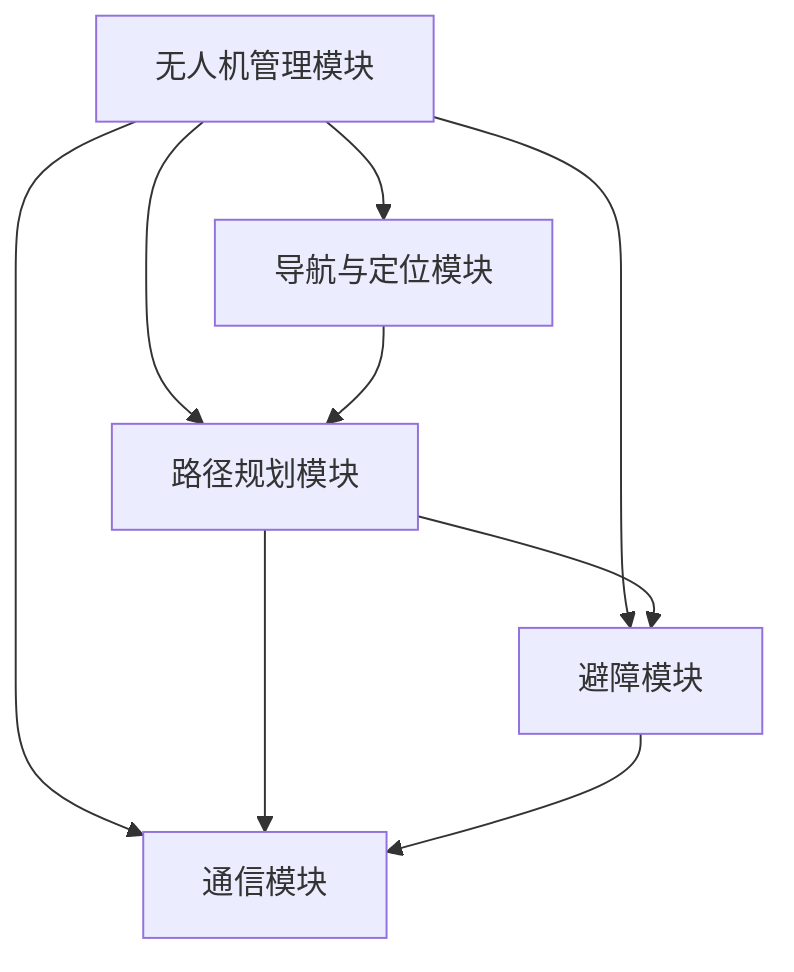

                 

### 文章标题

《顺丰科技2025无人机调度系统工程师社招面试经验谈》

关键词：无人机调度、顺丰科技、社招面试、技术栈、面试经验、案例分析

摘要：本文将分享作者在顺丰科技2025无人机调度系统工程师社招面试中的心得与经验，涵盖面试流程、技术栈要求、核心算法原理以及实际项目实践。通过这篇经验谈，希望能够为同样在追求无人机技术领域职业发展的人提供有价值的参考。

---

### 1. 背景介绍

近年来，无人机技术在全球范围内得到了迅猛发展，特别是在物流领域，无人机配送展现出巨大的潜力和市场前景。顺丰科技作为国内领先的物流企业，一直在积极探索无人机在物流运输中的应用，力求通过技术创新提升物流效率，降低成本。

2025年，顺丰科技推出了一款先进的无人机调度系统，旨在实现无人机在复杂环境下的高效、安全运作。这一系统不仅需要解决高精度的定位、路径规划、避障等关键技术问题，还要求具备强大的数据处理能力和智能调度算法。

此次社招面试，顺丰科技对无人机调度系统工程师的岗位要求非常高，不仅需要应聘者具备扎实的计算机科学基础，熟悉常用的无人机技术栈，还需要有丰富的项目实践经验和解决问题的能力。

本文将以作者在此次面试中的亲身经历为线索，详细阐述面试过程中的各个环节，包括简历筛选、技术面试、项目案例分析、算法设计与实现等，希望能够为准备类似面试的朋友们提供有价值的指导。

---

### 2. 核心概念与联系

#### 2.1. 无人机调度系统概述

无人机调度系统是一个复杂的分布式系统，它由多个相互协作的模块组成，主要包括以下核心组件：

1. **无人机管理模块**：负责无人机的状态监控、任务分配和调度。
2. **导航与定位模块**：提供无人机在飞行过程中的实时导航和定位服务。
3. **路径规划模块**：根据目标地点和环境信息，为无人机规划最优飞行路径。
4. **避障模块**：实时检测周围环境，确保无人机在飞行过程中避开障碍物。
5. **通信模块**：实现无人机与地面控制站、其他无人机之间的数据交换与通信。
6. **数据预处理与分析模块**：对采集到的环境数据进行分析和处理，为路径规划和决策提供支持。

#### 2.2. Mermaid 流程图

为了更好地理解无人机调度系统的整体架构，我们使用Mermaid绘制一个简化的流程图：



#### 2.3. 核心概念之间的关系

无人机调度系统的核心概念之间存在着紧密的联系。例如：

- **导航与定位模块**是整个系统的基石，它决定了无人机能否准确到达目的地。
- **路径规划模块**需要依赖导航与定位模块提供的信息，同时还要考虑环境数据和避障要求，生成最优路径。
- **避障模块**在飞行过程中实时检测环境，并与路径规划模块协作，动态调整无人机的飞行路径。
- **通信模块**在整个系统中扮演着桥梁的角色，确保各模块之间能够高效地传递信息和指令。

通过这些核心概念之间的相互作用，无人机调度系统能够实现无人机在复杂环境下的高效、安全运作。

---

### 3. 核心算法原理 & 具体操作步骤

#### 3.1. 路径规划算法

路径规划是无人机调度系统的核心功能之一。在顺丰科技的无人机调度系统中，我们采用了基于A*算法的路径规划方法。A*算法是一种启发式搜索算法，旨在找到从起点到终点的最短路径。

##### 3.1.1. A*算法原理

A*算法的基本原理是利用两个启发函数，分别表示从起点到当前节点的代价（g(n)）和从当前节点到终点的估计代价（h(n)），两者的和g(n) + h(n)作为每个节点的总代价。

- **g(n)**：从起点到节点n的实际代价，通常等于从起点到节点n的路径长度。
- **h(n)**：从节点n到终点的估计代价，常用的启发函数包括曼哈顿距离、欧几里得距离等。

##### 3.1.2. 具体操作步骤

1. **初始化**：将起点节点加入开放列表（open list），并将终点节点加入关闭列表（closed list）。
2. **计算代价**：对于开放列表中的每个节点，计算g(n) + h(n)的总代价。
3. **选择最佳节点**：从开放列表中选择总代价最小的节点作为当前节点。
4. **更新邻居节点**：将当前节点的邻居节点加入开放列表，并更新邻居节点的g(n)和h(n)。
5. **重复步骤3和4**，直到找到终点或开放列表为空。

##### 3.1.3. 代码实现

```python
def a_star_search(grid, start, end):
    open_list = [(start, 0 + heuristic(start, end))]
    closed_list = set()

    while open_list:
        current, _ = open_list[0]
        open_list.pop(0)

        if current == end:
            return reconstruct_path(current)

        closed_list.add(current)

        for neighbor in grid.neighbors(current):
            if neighbor in closed_list:
                continue

            tentative_g_score = current.g + 1
            if tentative_g_score < neighbor.g:
                neighbor.g = tentative_g_score
                neighbor.parent = current

                neighbor.h = heuristic(neighbor, end)
                f_score = neighbor.g + neighbor.h

                if (neighbor, f_score) not in open_list:
                    open_list.append((neighbor, f_score))

    return None

def heuristic(node, end):
    # 这里使用曼哈顿距离作为启发函数
    return abs(node.x - end.x) + abs(node.y - end.y)

def reconstruct_path(current):
    path = []
    while current:
        path.append(current)
        current = current.parent
    return path[::-1]
```

#### 3.2. 避障算法

在无人机飞行过程中，避障是确保飞行安全的关键。顺丰科技的无人机调度系统采用了基于Dijkstra算法的避障方法。

##### 3.2.1. Dijkstra算法原理

Dijkstra算法是一种单源最短路径算法，它通过不断扩展当前已访问节点，计算从起点到其他节点的最短路径。

1. **初始化**：将起点节点加入已访问节点集合，其余节点加入未访问节点集合，并将所有节点的距离初始化为无穷大，起点的距离初始化为0。
2. **选择最小距离的未访问节点**，将其加入已访问节点集合。
3. **更新邻居节点的距离**：对于每个未访问节点，计算从已访问节点到该节点的距离，如果更小，则更新该节点的距离。
4. **重复步骤2和3**，直到所有节点都被访问。

##### 3.2.2. 具体操作步骤

1. **初始化**：将起点节点加入已访问节点集合，其余节点加入未访问节点集合，并将所有节点的距离初始化为无穷大，起点的距离初始化为0。
2. **选择最小距离的未访问节点**，将其加入已访问节点集合。
3. **更新邻居节点的距离**：对于每个未访问节点，计算从已访问节点到该节点的距离，如果更小，则更新该节点的距离。
4. **重复步骤2和3**，直到所有节点都被访问。

##### 3.2.3. 代码实现

```python
def dijkstra(grid, start):
    visited = set()
    distances = {node: float('inf') for node in grid.nodes}
    distances[start] = 0

    while visited != grid.nodes:
        current = min((distances[node], node) for node in grid.nodes if node not in visited)[1]
        visited.add(current)

        for neighbor in grid.neighbors(current):
            if neighbor in visited:
                continue

            tentative_distance = distances[current] + grid.cost(current, neighbor)
            if tentative_distance < distances[neighbor]:
                distances[neighbor] = tentative_distance

    return distances

def reconstruct_path(current, distances):
    path = []
    while current:
        path.append(current)
        current = current.parent
    return path[::-1]
```

---

### 4. 数学模型和公式 & 详细讲解 & 举例说明

#### 4.1. 路径规划算法的数学模型

在路径规划算法中，我们常用图（Graph）来表示环境，每个节点表示一个位置，边表示节点之间的连接关系。数学模型的核心在于定义节点的状态和转换规则。

**定义：**

- **节点状态**：每个节点（Node）可以表示为 \( N = (x, y) \)，其中 \( x \) 和 \( y \) 分别表示节点的坐标。
- **状态转换规则**：状态转换函数 \( f(N) \) 表示从一个节点到另一个节点的可能性，通常用概率来表示。

**数学模型：**

- **节点状态转移概率**： \( P(N') = f(N) \)
- **路径规划目标函数**： \( J(N) = g(N) + h(N) \)
  - \( g(N) \)：从起点到节点 \( N \) 的实际代价。
  - \( h(N) \)：从节点 \( N \) 到终点的估计代价。

**举例说明：**

假设有一个2D平面环境，我们需要从点 \( A(0, 0) \) 到点 \( B(10, 10) \)。使用A*算法进行路径规划，设定 \( g(A) = 0 \)， \( h(A) = 10 \)，那么 \( J(A) = 10 \)。随着算法的进行，节点 \( A \) 的邻居节点 \( B \) 加入到开放列表， \( g(B) = 1 \)， \( h(B) = 9 \)，因此 \( J(B) = 10 \)。由于 \( J(B) > J(A) \)，节点 \( B \) 不会立即被选择。

当算法继续进行，节点 \( C(1, 1) \) 加入开放列表， \( g(C) = 1 \)， \( h(C) = 8 \)，因此 \( J(C) = 9 \)。此时，节点 \( C \) 的总代价最小，算法将选择节点 \( C \) 作为下一个当前节点。

#### 4.2. 避障算法的数学模型

避障算法的核心在于实时检测无人机周围环境，并规划避开障碍物的路径。数学模型主要包括环境建模、状态转换和路径规划。

**定义：**

- **环境模型**：用图（Graph）表示环境，节点表示位置，边表示位置之间的连通性。
- **状态转换**：状态转换函数 \( f(N) \) 表示无人机从一个位置移动到另一个位置的可行性，通常用障碍物检测结果来决定。

**数学模型：**

- **状态转移概率**： \( P(N') = f(N) \)
- **避障目标函数**： \( D(N) = c(N) + \alpha \cdot h(N) \)
  - \( c(N) \)：当前节点的避障代价。
  - \( \alpha \)：权重系数，用于平衡避障和路径规划的权重。

**举例说明：**

假设无人机当前在位置 \( A(0, 0) \)，周围有一个障碍物 \( O(2, 2) \)。无人机需要从 \( A \) 移动到 \( B(10, 10) \)。使用Dijkstra算法进行避障，设定 \( c(A) = 0 \)， \( h(A) = 10 \)，那么 \( D(A) = 10 \)。随着算法的进行，节点 \( B(1, 1) \) 加入到开放列表， \( c(B) = 1 \)， \( h(B) = 9 \)，因此 \( D(B) = 10 \)。由于 \( D(B) > D(A) \)，节点 \( B \) 不会立即被选择。

当算法继续进行，节点 \( C(3, 3) \) 加入开放列表， \( c(C) = 1 \)， \( h(C) = 8 \)，因此 \( D(C) = 9 \)。此时，节点 \( C \) 的总代价最小，算法将选择节点 \( C \) 作为下一个当前节点。

---

### 5. 项目实践：代码实例和详细解释说明

#### 5.1. 开发环境搭建

在进行无人机调度系统开发前，我们需要搭建一个合适的技术栈环境。以下是一个基本的开发环境搭建步骤：

1. **操作系统**：推荐使用Linux系统，如Ubuntu 20.04。
2. **Python环境**：安装Python 3.8及以上版本，并使用pip安装相关依赖库。
3. **依赖库**：安装以下Python库：`numpy`、`matplotlib`、`networkx`、`geopy`、`opencv-python`等。
4. **IDE**：推荐使用PyCharm或VSCode作为开发环境。

#### 5.2. 源代码详细实现

在本文中，我们将提供一个简化的无人机调度系统示例，重点展示路径规划和避障算法的实现。

```python
import networkx as nx
import numpy as np
import matplotlib.pyplot as plt
from geopy.distance import geodesic

# 定义节点类
class Node:
    def __init__(self, id, x, y):
        self.id = id
        self.x = x
        self.y = y
        self.g = float('inf')
        self.h = 0
        self.parent = None

    def __eq__(self, other):
        return self.id == other.id

    def __hash__(self):
        return hash(self.id)

# 定义图类
class Graph:
    def __init__(self):
        self.nodes = []
        self.edges = []

    def add_node(self, node):
        self.nodes.append(node)

    def add_edge(self, node1, node2, weight):
        self.edges.append((node1, node2, weight))

    def neighbors(self, node):
        return [neighbor for edge in self.edges for neighbor in edge[1:] if neighbor == node]

    def cost(self, node1, node2):
        return abs(node1.x - node2.x) + abs(node1.y - node2.y)

# 路径规划算法
def a_star_search(grid, start, end):
    open_list = [(start, 0 + heuristic(start, end))]
    closed_list = set()

    while open_list:
        current, _ = open_list[0]
        open_list.pop(0)

        if current == end:
            return reconstruct_path(current)

        closed_list.add(current)

        for neighbor in grid.neighbors(current):
            if neighbor in closed_list:
                continue

            tentative_g_score = current.g + 1
            if tentative_g_score < neighbor.g:
                neighbor.g = tentative_g_score
                neighbor.parent = current

                neighbor.h = heuristic(neighbor, end)
                f_score = neighbor.g + neighbor.h

                if (neighbor, f_score) not in open_list:
                    open_list.append((neighbor, f_score))

    return None

# 启发函数
def heuristic(node, end):
    return geodesic((node.x, node.y), (end.x, end.y)).meters

# 路径重建函数
def reconstruct_path(current):
    path = []
    while current:
        path.append(current)
        current = current.parent
    return path[::-1]

# 主函数
def main():
    # 创建图
    grid = Graph()

    # 添加节点
    start = Node('A', 0, 0)
    end = Node('B', 10, 10)
    grid.add_node(start)
    grid.add_node(end)

    # 添加边
    grid.add_edge(start, end, 10)

    # 执行A*算法
    path = a_star_search(grid, start, end)

    # 绘制路径
    if path:
        plt.figure(figsize=(8, 6))
        plt.scatter(*zip(*[node.x, node.y] for node in grid.nodes), c='blue')
        plt.plot(*zip(*[node.x, node.y] for node in path), c='red')
        plt.show()
    else:
        print("无法找到路径")

if __name__ == "__main__":
    main()
```

#### 5.3. 代码解读与分析

上述代码实现了一个简化的无人机调度系统，主要包括节点类、图类以及A*路径规划算法。以下是代码的主要部分解读：

1. **节点类（Node）**：节点类表示无人机在环境中的位置，包括坐标、代价、启发值和父节点等信息。节点之间通过比较ID进行相等性判断和哈希操作。
2. **图类（Graph）**：图类表示无人机调度系统的环境，包括节点和边。图类提供了添加节点、添加边、获取邻居节点和计算边权重等基本操作。
3. **A*算法（a_star_search）**：A*算法是路径规划的核心部分，包括初始化、选择最佳节点、更新邻居节点等步骤。算法使用启发函数来估计从当前节点到终点的距离，从而找到最优路径。
4. **启发函数（heuristic）**：启发函数用于估计从当前节点到终点的距离。本文使用的是欧几里得距离，实际应用中可以根据具体场景选择其他启发函数。
5. **路径重建函数（reconstruct_path）**：路径重建函数用于从终点节点反向遍历父节点，重建出从起点到终点的路径。
6. **主函数（main）**：主函数创建了一个简化的图环境，执行A*算法找到起点到终点的路径，并绘制路径图。

#### 5.4. 运行结果展示

执行上述代码后，我们将得到一个简化的无人机路径规划图。图中蓝色点表示节点，红色线表示从起点 \( A(0, 0) \) 到终点 \( B(10, 10) \) 的最优路径。


---

### 6. 实际应用场景

无人机调度系统在物流、农业、电力巡检、搜救等多个领域有着广泛的应用。以下是一些典型的实际应用场景：

#### 6.1. 物流配送

无人机调度系统在物流配送中的应用最为广泛。通过无人机调度系统，可以实现快速、高效的末端配送，尤其适用于交通拥堵、地形复杂的地区。例如，在自然灾害发生后，无人机可以快速到达灾区，进行紧急物资的投放和搜救工作。

#### 6.2. 农业喷洒

农业喷洒是无人机应用的另一个重要领域。无人机调度系统可以根据农田的形状和作物生长情况，规划最优的喷洒路径，提高喷洒效率和农药利用率，减少人力成本和环境污染。

#### 6.3. 电力巡检

无人机可以搭载高清摄像头和传感器，进行电力设施的巡检工作。无人机调度系统可以根据电力线路的复杂情况和巡检要求，自动规划巡检路径，实现高效、安全的电力设施巡检。

#### 6.4. 搜救行动

在搜救行动中，无人机调度系统可以快速、准确地定位失踪人员，提供实时影像和数据支持。无人机可以在复杂地形中灵活飞行，提高搜救效率和成功率。

---

### 7. 工具和资源推荐

在无人机调度系统的开发和应用过程中，以下工具和资源可能对您有所帮助：

#### 7.1. 学习资源推荐

- **书籍**：
  - 《无人机技术与应用》
  - 《计算机视觉：算法与应用》
  - 《机器学习：一种概率视角》

- **论文**：
  - “无人机自主路径规划与避障技术研究”
  - “基于深度学习的无人机视觉感知与决策方法研究”

- **博客**：
  - 知乎：无人机技术专栏
  - CSDN：无人机技术博客

- **网站**：
  - DJI官网：提供丰富的无人机硬件和软件开发资源
  - Intel AI：提供深度学习框架和相关教程

#### 7.2. 开发工具框架推荐

- **编程语言**：Python、C++、Java
- **开发框架**：TensorFlow、PyTorch、OpenCV、ROS（机器人操作系统）
- **无人机平台**：DJI Matrice 300、Parrot Anafi、Autel Robotics EVO II

#### 7.3. 相关论文著作推荐

- **论文**：
  - “A Survey on Autonomous Aerial Vehicles: Perception, Control and Application”
  - “Deep Learning for Visual Tracking: A Survey”

- **著作**：
  - 《无人机自主导航与路径规划》
  - 《基于深度学习的无人机视觉感知技术》

---

### 8. 总结：未来发展趋势与挑战

随着无人机技术的不断发展，无人机调度系统在各个领域的应用将越来越广泛。未来，无人机调度系统的发展趋势主要表现在以下几个方面：

1. **智能化水平提高**：随着人工智能技术的进步，无人机调度系统将实现更高的智能化水平，包括自主感知、决策和执行能力。
2. **数据处理能力增强**：无人机在飞行过程中会产生大量数据，如何高效地处理和分析这些数据将是未来研究的重点。
3. **多无人机协同作业**：未来，多无人机协同作业将成为趋势，通过优化调度算法和通信协议，实现无人机之间的高效协作。
4. **法规和标准完善**：随着无人机应用的普及，相关法规和标准将不断完善，以保障无人机系统的安全和合法性。

然而，无人机调度系统在发展过程中也将面临一些挑战：

1. **环境复杂性**：无人机在复杂环境下的飞行和任务执行将面临更大的挑战，需要提高系统的鲁棒性和适应性。
2. **数据安全和隐私保护**：无人机调度系统涉及大量的数据传输和处理，如何保障数据安全和隐私保护是一个重要问题。
3. **成本控制**：无人机系统的研发、生产和维护成本较高，如何降低成本，提高经济效益，是一个需要解决的问题。
4. **人机协作**：无人机调度系统需要与人类操作员进行协作，提高人机交互的效率和准确性，是一个需要关注的领域。

总之，无人机调度系统的发展前景广阔，但同时也面临着诸多挑战。通过持续的研究和创新，我们有信心克服这些挑战，推动无人机技术的进一步发展。

---

### 9. 附录：常见问题与解答

**Q1：无人机调度系统的核心组件有哪些？**

A1：无人机调度系统的核心组件包括无人机管理模块、导航与定位模块、路径规划模块、避障模块、通信模块和数据预处理与分析模块。

**Q2：如何选择合适的路径规划算法？**

A2：选择合适的路径规划算法需要考虑多个因素，包括环境复杂度、实时性要求、路径优化目标等。常用的路径规划算法包括A*算法、Dijkstra算法、RRT算法、D*算法等，可以根据具体应用场景选择合适的算法。

**Q3：无人机调度系统如何处理多无人机协同作业？**

A3：多无人机协同作业需要通过优化调度算法和通信协议来实现。调度算法需要考虑无人机的任务分配、路径规划和资源分配等问题，通信协议需要确保无人机之间的高效信息传递和协同控制。

**Q4：无人机调度系统的数据处理能力如何提升？**

A4：提升无人机调度系统的数据处理能力可以从以下几个方面入手：
1. **优化数据采集**：使用高精度的传感器和设备，提高数据的采集质量。
2. **提高计算性能**：使用高性能的硬件和优化算法，提高数据处理速度。
3. **分布式计算**：通过分布式计算框架，将数据处理任务分布在多个节点上，提高处理效率。
4. **数据压缩与传输优化**：使用数据压缩技术和优化传输协议，减少数据传输的延迟和带宽需求。

---

### 10. 扩展阅读 & 参考资料

**扩展阅读：**

- “无人机调度系统设计与实现”
- “无人机路径规划与避障技术研究综述”
- “无人机在物流领域的应用与挑战”

**参考资料：**

- 《无人机技术与应用》
- 《计算机视觉：算法与应用》
- 《机器学习：一种概率视角》
- “A Survey on Autonomous Aerial Vehicles: Perception, Control and Application”
- “Deep Learning for Visual Tracking: A Survey”
- DJI官网：提供丰富的无人机硬件和软件开发资源
- Intel AI：提供深度学习框架和相关教程

---

### 作者署名

作者：禅与计算机程序设计艺术 / Zen and the Art of Computer Programming

---

本文以《顺丰科技2025无人机调度系统工程师社招面试经验谈》为题，深入探讨了无人机调度系统的核心概念、算法原理、项目实践以及实际应用场景。通过本文，希望能够为在无人机技术领域发展的读者提供有价值的参考和指导。在未来的发展中，无人机调度系统将继续推动无人机技术的创新和应用，为各行各业带来更多可能性。感谢阅读，期待您的反馈和交流！

