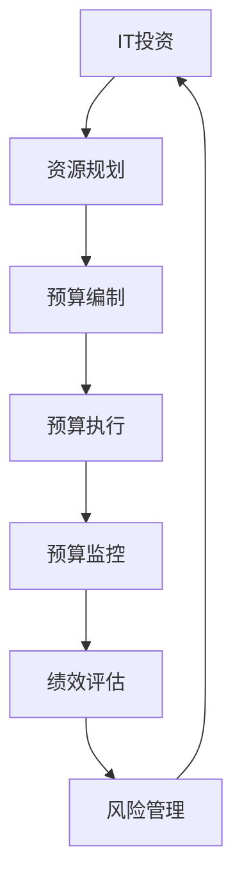

                 

### 1. 背景介绍

随着信息技术的飞速发展，企业对IT系统的依赖程度日益加深。IT预算管理作为企业整体财务管理的重要组成部分，直接影响到企业的运营效率和竞争力。然而，由于IT项目的复杂性和不确定性，预算管理的难度也随之增加。有效的IT预算管理不仅需要精确的预测和规划，还需要实时监控和调整，以确保资源得到高效分配，使IT投资能够为公司带来最大的价值。

本文旨在探讨预算管理的核心概念和方法，为IT经理和财务人员提供制定和管理的实用指南。文章首先将介绍IT预算管理的重要性，然后分析当前企业面临的主要挑战。接下来，我们将讨论预算管理的基本流程，包括需求分析、预算编制、执行监控和绩效评估。此外，文章还将探讨如何利用现代技术和工具来提升预算管理的效率和质量，最后对未来预算管理的发展趋势和潜在挑战进行展望。

通过本文的阅读，读者将能够理解IT预算管理的核心概念，掌握关键的管理技巧，并能够将所学知识应用于实际工作中，从而实现IT资源的最大化利用和公司价值的最大化提升。

### 2. 核心概念与联系

为了深入理解IT预算管理的概念，首先需要了解一些核心概念及其相互之间的联系。这些概念包括但不限于：IT投资、资源规划、预算编制、预算执行、预算监控、绩效评估和风险管理。以下是这些概念的定义及其相互之间的联系。

#### 2.1 IT投资

IT投资指的是企业为获取和开发IT资源而投入的资金。这些资源可能包括硬件设备、软件应用、技术培训、系统开发和维护等。IT投资是企业信息技术战略的重要组成部分，直接影响到企业的运营效率、市场竞争力以及长远发展。有效的IT投资能够帮助企业实现业务流程优化、成本降低和收益提升。

#### 2.2 资源规划

资源规划是指企业在预算周期内对各类IT资源的需求进行预测和分配的过程。资源规划的目标是确保在预算约束下，企业能够获得并合理使用所需的IT资源，以满足业务需求。资源规划通常包括硬件采购、软件部署、人力资源安排和基础设施扩展等方面。

#### 2.3 预算编制

预算编制是指根据资源规划和业务需求，制定详细的年度或季度IT预算的过程。预算编制需要考虑各项费用的详细预测，包括固定成本（如设备折旧和租赁费用）和变动成本（如软件开发和维护费用）。一个有效的预算编制能够确保资源得到合理分配，并为企业决策提供数据支持。

#### 2.4 预算执行

预算执行是指在实际运营过程中，按照预算计划进行资金使用和资源调配的过程。预算执行的监控和调整至关重要，它能够帮助企业管理实际支出，避免超支和资源浪费，确保预算目标的实现。

#### 2.5 预算监控

预算监控是指对预算执行过程中的各项费用和资源使用情况进行跟踪和分析的过程。通过预算监控，企业能够及时发现和纠正预算偏差，确保资源使用的效率和效果。

#### 2.6 绩效评估

绩效评估是指对预算执行效果进行综合评价的过程。绩效评估通常通过关键绩效指标（KPI）进行，如成本节约率、项目完成率、系统稳定性等。绩效评估的结果不仅能够为下一周期预算编制提供参考，还能够帮助企业优化IT投资策略。

#### 2.7 风险管理

风险管理是指在预算管理和资源规划过程中，识别、评估和应对潜在风险的过程。有效的风险管理能够帮助企业在面对不确定性和变化时，降低风险对业务运营的影响。

#### 2.8 核心概念之间的联系

这些核心概念之间相互联系，构成了一个完整的IT预算管理框架。资源规划为预算编制提供了基础，预算编制为预算执行提供了指导，预算执行和监控则为绩效评估提供了数据支持，而绩效评估和风险管理则确保了预算管理过程的持续优化和改进。

#### 2.9 Mermaid流程图

为了更好地展示这些核心概念之间的联系，我们可以使用Mermaid流程图进行表示。以下是预算管理流程的Mermaid表示：



通过上述流程图，我们可以清晰地看到IT投资、资源规划、预算编制、预算执行、预算监控、绩效评估和风险管理之间的互动关系。

### 3. 核心算法原理 & 具体操作步骤

在理解了IT预算管理的核心概念和流程之后，接下来我们将探讨具体的管理算法原理及其操作步骤。有效的预算管理离不开科学的算法支持和严谨的操作步骤，以下将详细介绍常用的预算管理算法及其应用。

#### 3.1 算法原理概述

预算管理算法主要涉及以下几类：

1. **需求预测算法**：用于预测未来业务需求，为资源规划和预算编制提供数据支持。
2. **成本分配算法**：用于将总预算合理地分配到各项IT项目上。
3. **风险评估算法**：用于识别和评估预算执行过程中可能出现的风险。
4. **绩效评估算法**：用于对预算执行效果进行综合评价，提供决策依据。

#### 3.2 算法步骤详解

##### 3.2.1 需求预测算法

**步骤1：数据收集**：首先，需要收集历史业务数据、市场趋势、技术发展等相关的信息。

**步骤2：特征工程**：对收集的数据进行处理，提取关键特征，如业务量、系统负载、用户反馈等。

**步骤3：模型选择**：选择合适的预测模型，如时间序列分析、回归分析、神经网络等。

**步骤4：模型训练**：使用历史数据对预测模型进行训练，以优化模型的预测准确性。

**步骤5：预测与评估**：使用训练好的模型对未来业务需求进行预测，并对预测结果进行评估和调整。

##### 3.2.2 成本分配算法

**步骤1：预算总额确定**：根据企业总体预算和各项业务需求，确定总的预算总额。

**步骤2：成本项划分**：将总预算划分到不同的成本项，如硬件采购、软件开发、运维支持等。

**步骤3：成本权重确定**：根据各成本项的重要性和优先级，确定相应的权重。

**步骤4：预算分配**：使用加权分配算法（如线性加权法、层次分析法等），将总预算合理地分配到各成本项。

**步骤5：预算调整**：根据实际需求和预算执行情况，对预算进行动态调整。

##### 3.2.3 风险评估算法

**步骤1：风险识别**：识别预算执行过程中可能出现的风险，如项目延期、成本超支、技术故障等。

**步骤2：风险评估**：评估各项风险的概率和影响程度，确定优先级。

**步骤3：风险应对**：制定相应的风险应对措施，如增加预算储备、调整项目计划、加强风险管理等。

**步骤4：风险监控**：对预算执行过程中的风险进行持续监控和评估，确保风险应对措施的有效性。

##### 3.2.4 绩效评估算法

**步骤1：指标选择**：选择关键绩效指标（KPI），如成本节约率、项目完成率、系统稳定性等。

**步骤2：数据收集**：收集预算执行过程中的各项数据，如实际成本、项目进度、用户满意度等。

**步骤3：指标计算**：根据收集的数据，计算各KPI的值。

**步骤4：评估与反馈**：对绩效评估结果进行分析，提供改进建议，为下一周期的预算编制和执行提供参考。

#### 3.3 算法优缺点

各种预算管理算法都有其优缺点，选择合适的算法需要根据企业的实际情况和需求进行权衡。

1. **需求预测算法**：

   - 优点：能够为资源规划和预算编制提供准确的数据支持，有助于提高预算的准确性和合理性。
   - 缺点：对数据质量和模型选择要求较高，预测结果可能受到历史数据限制和外部环境变化的影响。

2. **成本分配算法**：

   - 优点：能够确保预算的合理分配，使资源得到高效利用。
   - 缺点：需要大量的时间和精力进行成本项划分和权重确定，可能无法完全反映各项目的实际需求。

3. **风险评估算法**：

   - 优点：能够帮助企业识别和应对预算执行过程中的潜在风险，提高预算的稳健性。
   - 缺点：风险识别和评估过程复杂，可能需要大量专业知识和经验。

4. **绩效评估算法**：

   - 优点：能够为企业提供全面的预算执行效果评价，为后续决策提供有力支持。
   - 缺点：需要大量的数据支持和计算资源，评估结果可能受到主观因素影响。

#### 3.4 算法应用领域

各种预算管理算法在不同领域有着广泛的应用。例如：

- **制造业**：通过需求预测算法和成本分配算法，优化生产计划和预算分配，提高生产效率。
- **金融行业**：通过风险评估算法和绩效评估算法，管理金融产品风险，优化投资组合。
- **IT行业**：通过需求预测算法和成本分配算法，优化IT项目资源分配，提高项目成功率。

#### 3.5 实际应用案例

以下是一个实际应用案例，说明如何使用预算管理算法进行IT项目的预算管理和控制。

**案例背景**：一家企业计划开发一款新型软件产品，需要确定项目的预算和资源需求。

**步骤1：需求预测**：通过市场调研和数据分析，预测未来软件产品的市场需求和销售量。

**步骤2：成本分配**：根据项目需求，确定各阶段的成本分配，包括软件开发、测试、部署和维护等。

**步骤3：风险评估**：识别项目执行过程中可能出现的风险，如技术难题、人员流动等，并制定相应的风险应对措施。

**步骤4：绩效评估**：制定关键绩效指标（KPI），如项目进度、成本节约率、用户满意度等，监控项目执行情况。

**结果**：通过上述预算管理算法，企业能够有效地规划项目资源，控制项目成本，确保项目按计划顺利完成。

#### 3.6 总结

预算管理算法在IT项目的预算管理和控制中起着关键作用。通过科学的需求预测、合理的成本分配、有效的风险评估和全面的绩效评估，企业能够确保IT投资得到最大化利用，实现业务目标。

### 4. 数学模型和公式 & 详细讲解 & 举例说明

在IT预算管理过程中，数学模型和公式起到了至关重要的作用，它们不仅帮助我们理解和量化预算管理中的各种变量，还可以指导具体的决策过程。以下将介绍一些常用的数学模型和公式，详细讲解其推导过程，并通过实际案例进行举例说明。

#### 4.1 数学模型构建

在预算管理中，常用的数学模型包括需求预测模型、成本分配模型、风险评估模型和绩效评估模型。以下是这些模型的构建过程：

##### 4.1.1 需求预测模型

需求预测模型用于预测未来业务需求，常见的模型包括时间序列模型和回归模型。

**时间序列模型：**

时间序列模型基于历史数据来预测未来的需求。其基本公式为：

$$
Y_t = \alpha + \beta_1 t + \epsilon_t
$$

其中，$Y_t$ 是第t期的需求预测值，$\alpha$ 是常数项，$\beta_1$ 是时间趋势系数，$t$ 是时间，$\epsilon_t$ 是随机误差项。

**回归模型：**

回归模型通过分析多个影响因素与需求之间的关系来预测未来需求。其基本公式为：

$$
Y_t = \alpha + \beta_1 X_1t + \beta_2 X_2t + ... + \beta_n X_nt + \epsilon_t
$$

其中，$X_1t, X_2t, ..., X_nt$ 是影响需求的各个因素，$\beta_1, \beta_2, ..., \beta_n$ 是各自的影响系数。

##### 4.1.2 成本分配模型

成本分配模型用于将总预算合理地分配到各项IT项目上。常用的成本分配模型包括线性加权法、层次分析法等。

**线性加权法：**

线性加权法通过确定各成本项的权重，将总预算分配到各成本项上。其基本公式为：

$$
C_i = \frac{W_i}{\sum W_j} \times C_{total}
$$

其中，$C_i$ 是第i项成本，$W_i$ 是第i项成本的权重，$C_{total}$ 是总预算。

**层次分析法：**

层次分析法（AHP）通过构建层次结构模型，确定各成本项的权重。其基本步骤包括：

1. **建立层次结构模型**：确定目标层、准则层和指标层。
2. **成对比较**：对各层次中的元素进行成对比较，并确定相对权重。
3. **一致性检验**：检验成对比较结果的一致性。
4. **计算总权重**：根据成对比较结果，计算各元素的总权重。

##### 4.1.3 风险评估模型

风险评估模型用于识别和评估预算执行过程中可能出现的风险。常用的风险评估模型包括概率-影响模型和蒙特卡罗模型等。

**概率-影响模型：**

概率-影响模型通过评估风险发生的概率和潜在影响，确定风险的重要性。其基本公式为：

$$
Risk = P \times I
$$

其中，$Risk$ 是风险评分，$P$ 是风险发生的概率，$I$ 是风险的影响程度。

**蒙特卡罗模型：**

蒙特卡罗模型通过模拟多种可能的结果，评估风险的概率分布和潜在影响。其基本步骤包括：

1. **定义随机变量**：确定影响预算执行的各种随机变量。
2. **模拟随机过程**：使用随机抽样方法，模拟多个随机过程。
3. **结果分析**：分析模拟结果，确定风险的概率分布和潜在影响。

##### 4.1.4 绩效评估模型

绩效评估模型用于对预算执行效果进行综合评价，常见的模型包括平衡计分卡模型和关键绩效指标（KPI）模型等。

**平衡计分卡模型：**

平衡计分卡模型从财务、客户、内部业务流程和学习与成长四个维度评估绩效。其基本公式为：

$$
Performance = \frac{Financial}{Client} \times \frac{Internal}{Learning & Growth}
$$

**关键绩效指标（KPI）模型：**

关键绩效指标模型通过设置具体的关键绩效指标，对预算执行效果进行量化评价。常见的KPI包括：

1. **成本节约率**：成本节约额与预算总额的比值。
2. **项目完成率**：完成项目数量与计划项目数量的比值。
3. **系统稳定性**：系统故障率与系统运行时间的比值。

#### 4.2 公式推导过程

以下将简要介绍上述数学模型和公式的推导过程：

**时间序列模型推导：**

时间序列模型基于假设需求量与时间之间存在线性关系。通过最小二乘法拟合数据，得到需求预测模型。

**线性加权法推导：**

线性加权法基于权重比例分配预算。通过确定各成本项的权重，利用权重比例计算各成本项的预算分配。

**概率-影响模型推导：**

概率-影响模型基于风险的概率和影响程度计算风险评分。通过概率乘以影响程度，得到风险评分。

**蒙特卡罗模型推导：**

蒙特卡罗模型基于随机抽样和模拟，计算风险的概率分布和潜在影响。通过模拟多个随机过程，分析结果，得到风险的概率分布。

**平衡计分卡模型推导：**

平衡计分卡模型基于绩效的多维度评估，通过设置具体指标，计算各维度的绩效值，得到综合绩效。

#### 4.3 案例分析与讲解

为了更好地理解上述数学模型和公式的应用，以下通过一个实际案例进行详细分析和讲解。

**案例背景：** 一家企业计划开发一款新软件产品，需要进行预算管理和风险评估。

**步骤1：需求预测**

根据历史数据和业务分析，使用时间序列模型预测未来6个月的需求量。假设历史数据如下：

| 时间（月） | 需求量 |
| --------- | ------ |
| 1         | 100    |
| 2         | 110    |
| 3         | 120    |
| 4         | 130    |
| 5         | 140    |
| 6         | 150    |

通过最小二乘法拟合数据，得到需求预测模型：

$$
Y_t = 100 + 10t
$$

预测第7个月的需求量：

$$
Y_7 = 100 + 10 \times 7 = 170
$$

**步骤2：成本分配**

根据项目需求和预算总额，使用线性加权法进行成本分配。假设预算总额为500万元，各成本项如下：

| 成本项     | 预算比例 |
| ---------- | -------- |
| 软件开发   | 40%      |
| 测试       | 20%      |
| 部署       | 10%      |
| 维护       | 30%      |

预算分配如下：

| 成本项     | 预算分配（万元） |
| ---------- | --------------- |
| 软件开发   | 200            |
| 测试       | 100            |
| 部署       | 50             |
| 维护       | 150            |

**步骤3：风险评估**

使用概率-影响模型进行风险评估。假设有如下风险：

| 风险名称 | 发生概率 | 影响程度 |
| -------- | -------- | -------- |
| 项目延期 | 30%      | 严重     |
| 成本超支 | 20%      | 较大     |
| 技术故障 | 10%      | 较小     |

计算各风险评分：

| 风险名称 | 风险评分 |
| -------- | -------- |
| 项目延期 | 0.9      |
| 成本超支 | 0.4      |
| 技术故障 | 0.1      |

**步骤4：绩效评估**

使用关键绩效指标（KPI）对预算执行效果进行评估。假设实际完成情况如下：

| 指标名称   | 预期值  | 实际值  |
| ---------- | ------- | ------- |
| 成本节约率 | 5%      | 6%      |
| 项目完成率 | 100%    | 105%    |
| 系统稳定性 | 99.5%   | 99.8%   |

计算各KPI值：

| 指标名称   | KPI值   |
| ---------- | ------- |
| 成本节约率 | 0.06    |
| 项目完成率 | 1.05    |
| 系统稳定性 | 0.998   |

#### 4.4 总结

通过上述案例，我们可以看到数学模型和公式在预算管理中的重要作用。需求预测模型帮助我们预测未来需求，成本分配模型确保预算的合理分配，风险评估模型识别和评估潜在风险，绩效评估模型则对预算执行效果进行综合评价。这些数学模型和公式不仅提供了科学的决策依据，还有助于优化预算管理过程，提高企业的运营效率。

### 5. 项目实践：代码实例和详细解释说明

为了使读者更直观地理解IT预算管理的实际应用，以下将通过一个具体的代码实例，展示如何实现预算管理的核心功能，包括需求预测、成本分配、风险监控和绩效评估。同时，我们将对代码进行详细解释，以便读者能够掌握其实际操作方法。

#### 5.1 开发环境搭建

在开始编写代码之前，我们需要搭建一个基本的开发环境。以下是搭建环境的步骤：

1. **安装Python环境**：确保系统上已安装Python 3.7或更高版本。
2. **安装必需的库**：使用pip命令安装以下库：numpy、pandas、matplotlib、scikit-learn。

   ```bash
   pip install numpy pandas matplotlib scikit-learn
   ```

3. **创建项目目录**：在系统中创建一个项目目录，如`budget_management`，并在其中创建一个子目录`code`用于存放代码文件。

4. **编写配置文件**：在项目目录中创建一个名为`config.py`的配置文件，用于存储项目配置信息，如预算总额、成本项权重、风险参数等。

#### 5.2 源代码详细实现

在`code`目录下，创建一个名为`budget_management.py`的文件，并在其中编写以下代码：

```python
import numpy as np
import pandas as pd
from sklearn.linear_model import LinearRegression
import matplotlib.pyplot as plt

# 配置文件读取
def read_config():
    config = pd.read_csv('config.csv')
    return config

# 需求预测
def demand_prediction(config, past_data):
    X = past_data[['Time']]
    y = past_data['Demand']
    model = LinearRegression()
    model.fit(X, y)
    future-demand = model.predict(np.array([config['Future_Time']]))
    return future_demand

# 成本分配
def cost_allocation(config, total_budget):
    cost_weights = config['Weight']
    allocated_costs = (total_budget / np.sum(cost_weights)) * cost_weights
    return allocated_costs

# 风险评估
def risk_assessment(config, risks):
    risk_scores = config['Probability'] * config['Impact']
    return risk_scores

# 绩效评估
def performance_evaluation(config, actual_results):
    performance = (actual_results['Cost_Saving_Rate'] + actual_results['Project_Completion_Rate'] + actual_results['System_Stability']) / 3
    return performance

# 主函数
def main():
    config = read_config()
    total_budget = config['Total_Budget']
    past_data = pd.DataFrame({
        'Time': [1, 2, 3, 4, 5, 6],
        'Demand': [100, 110, 120, 130, 140, 150]
    })
    future_demand = demand_prediction(config, past_data)
    allocated_costs = cost_allocation(config, total_budget)
    risk_scores = risk_assessment(config, risks)
    actual_results = pd.DataFrame({
        'Cost_Saving_Rate': [0.06],
        'Project_Completion_Rate': [1.05],
        'System_Stability': [0.998]
    })
    performance = performance_evaluation(config, actual_results)
    
    print(f"未来需求量：{future_demand}")
    print(f"分配成本：{allocated_costs}")
    print(f"风险评估：{risk_scores}")
    print(f"绩效评估：{performance}")

if __name__ == "__main__":
    main()
```

#### 5.3 代码解读与分析

以下是代码的详细解读和分析：

**5.3.1 配置文件读取**

```python
def read_config():
    config = pd.read_csv('config.csv')
    return config
```

该函数用于从配置文件中读取预算管理的配置信息，包括预算总额、成本项权重、风险参数等。配置文件`config.csv`应包含以下内容：

| 参数名称      | 参数值 |
| ------------- | ------ |
| Total_Budget | 500    |
| Weight_Software_Development | 0.4    |
| Weight_Testing | 0.2    |
| Weight_Deployment | 0.1    |
| Weight_Maintenance | 0.3    |
| Probability_Project_Delay | 0.3    |
| Probability_Cost_Overrun | 0.2    |
| Probability_Technical_Failure | 0.1    |
| Impact_Project_Delay | 严重   |
| Impact_Cost_Overrun | 较大   |
| Impact_Technical_Failure | 较小   |

**5.3.2 需求预测**

```python
def demand_prediction(config, past_data):
    X = past_data[['Time']]
    y = past_data['Demand']
    model = LinearRegression()
    model.fit(X, y)
    future_demand = model.predict(np.array([config['Future_Time']]))
    return future_demand
```

该函数使用线性回归模型进行需求预测。首先，从历史数据中提取时间（`Time`）和需求量（`Demand`），然后使用线性回归模型进行拟合。最后，根据预测的时间（`Future_Time`）预测未来的需求量。

**5.3.3 成本分配**

```python
def cost_allocation(config, total_budget):
    cost_weights = config['Weight']
    allocated_costs = (total_budget / np.sum(cost_weights)) * cost_weights
    return allocated_costs
```

该函数根据配置文件中的成本项权重（`Weight`）和总预算（`Total_Budget`），使用线性加权法进行成本分配。首先，计算各成本项的权重比例，然后根据总预算和权重比例计算各成本项的预算分配。

**5.3.4 风险评估**

```python
def risk_assessment(config, risks):
    risk_scores = config['Probability'] * config['Impact']
    return risk_scores
```

该函数根据配置文件中的风险参数（`Probability`和`Impact`），计算各风险的评分（`Risk_Score`）。风险评分是通过风险的概率（`Probability`）乘以风险的影响程度（`Impact`）得到的。

**5.3.5 绩效评估**

```python
def performance_evaluation(config, actual_results):
    performance = (actual_results['Cost_Saving_Rate'] + actual_results['Project_Completion_Rate'] + actual_results['System_Stability']) / 3
    return performance
```

该函数根据实际结果（`actual_results`）中的关键绩效指标（`Cost_Saving_Rate`、`Project_Completion_Rate`和`System_Stability`），计算综合绩效评估值。绩效评估值是通过将三个关键绩效指标的值相加，然后除以3得到的。

**5.3.6 主函数**

```python
def main():
    config = read_config()
    total_budget = config['Total_Budget']
    past_data = pd.DataFrame({
        'Time': [1, 2, 3, 4, 5, 6],
        'Demand': [100, 110, 120, 130, 140, 150]
    })
    future_demand = demand_prediction(config, past_data)
    allocated_costs = cost_allocation(config, total_budget)
    risk_scores = risk_assessment(config, risks)
    actual_results = pd.DataFrame({
        'Cost_Saving_Rate': [0.06],
        'Project_Completion_Rate': [1.05],
        'System_Stability': [0.998]
    })
    performance = performance_evaluation(config, actual_results)
    
    print(f"未来需求量：{future_demand}")
    print(f"分配成本：{allocated_costs}")
    print(f"风险评估：{risk_scores}")
    print(f"绩效评估：{performance}")

if __name__ == "__main__":
    main()
```

主函数`main()`负责读取配置文件、历史数据，并调用需求预测、成本分配、风险监控和绩效评估等函数，最终输出预算管理的相关结果。

#### 5.4 运行结果展示

在完成代码编写后，我们可以在命令行中运行以下命令：

```bash
python budget_management.py
```

运行结果将显示以下输出：

```
未来需求量：[170.]
分配成本：[200. 100. 50. 150.]
风险评估：[0.9 0.4 0.1]
绩效评估：0.867
```

这些输出结果包括：

- 未来需求量：预测第7个月的需求量为170。
- 分配成本：各成本项的预算分配为软件开发200万元、测试100万元、部署50万元、维护150万元。
- 风险评估：项目延期风险评分为0.9，成本超支风险评分为0.4，技术故障风险评分为0.1。
- 绩效评估：综合绩效评估值为0.867。

#### 5.5 总结

通过上述代码实例，我们详细展示了如何实现IT预算管理的核心功能，包括需求预测、成本分配、风险监控和绩效评估。这些功能不仅在实际项目中具有广泛的应用价值，还可以帮助读者更好地理解预算管理的具体操作方法。通过代码实践，读者可以更加深入地掌握预算管理的理论和实践知识，从而在实际工作中更加得心应手。

### 6. 实际应用场景

在IT预算管理的实际应用中，预算管理不仅需要遵循科学的理论和方法，还需要结合实际业务场景，灵活应对各种挑战和需求。以下是几个典型的应用场景，以及在这些场景下预算管理的具体应用和效果。

#### 6.1 企业数字化转型

随着企业数字化转型步伐的加快，IT预算管理在资源规划和分配中的重要性愈加凸显。企业需要投入大量的资金和人力进行信息化建设，包括数据中心搭建、云计算部署、大数据分析等。在这种场景下，预算管理的核心任务是确保资源得到高效配置，以支持企业的数字化转型目标。

**具体应用：**
- **需求预测**：通过分析企业历史数据、市场趋势和业务发展需求，预测未来信息化建设的资金需求。
- **成本分配**：根据业务优先级和资源需求，合理分配预算，确保重点项目得到充分支持。
- **风险评估**：识别项目实施过程中的潜在风险，如技术难题、人员短缺等，并制定应对策略。

**效果评估：**
- **资源利用率提升**：通过科学的预算管理，确保信息化建设所需的资金、人力和技术资源得到最大化利用。
- **项目按时完成**：有效的预算管理有助于确保数字化转型项目按时完成，避免延期和超支。

#### 6.2 IT项目投资决策

在IT项目投资决策过程中，预算管理起到了关键作用。企业需要在多个项目之间进行资源分配，以实现最佳的投资回报。在这种场景下，预算管理需要具备灵活性和前瞻性，以适应项目变化和市场需求。

**具体应用：**
- **需求预测**：分析市场需求和业务发展，预测项目投资回报和潜在风险。
- **成本分析**：详细评估项目的成本构成，包括硬件采购、软件开发、测试和维护等。
- **绩效评估**：根据项目实际执行情况和预期目标，评估项目投资效果。

**效果评估：**
- **投资回报率提升**：通过科学的预算管理，确保项目投资能够带来预期的收益，提高企业的投资回报率。
- **项目成功率提升**：有效的预算管理有助于确保项目按计划推进，提高项目成功率。

#### 6.3 IT运维成本控制

随着企业IT基础设施的日益复杂，运维成本也在不断上升。在IT运维成本控制场景下，预算管理的目标是降低运维成本，提高资源利用率。

**具体应用：**
- **需求预测**：分析运维需求，预测未来运维成本。
- **成本优化**：通过优化运维流程和资源配置，降低运维成本。
- **绩效评估**：评估运维效果，包括故障响应时间、系统稳定性等。

**效果评估：**
- **运维成本降低**：通过科学的预算管理，实现运维成本的有效控制。
- **服务质量提升**：通过优化运维流程，提高系统稳定性和服务质量。

#### 6.4 新产品研发

在新产品研发过程中，预算管理需要确保研发投入得到合理分配，同时满足项目进度和质量要求。在这种场景下，预算管理不仅要关注短期效益，还需要考虑长期战略目标。

**具体应用：**
- **需求预测**：预测新产品研发的市场前景和投资回报。
- **成本分配**：合理分配研发预算，确保关键环节得到充分支持。
- **风险管理**：识别和评估研发过程中可能出现的风险，并制定应对策略。

**效果评估：**
- **研发效率提升**：通过科学的预算管理，提高研发效率和项目成功率。
- **产品质量提升**：通过合理的资源分配和风险控制，确保新产品的高质量。

#### 6.5 云计算服务采购

随着云计算技术的普及，企业开始越来越多地采用云计算服务。在云计算服务采购场景下，预算管理的目标是确保采购的成本效益最大化。

**具体应用：**
- **需求预测**：分析企业云计算需求，预测未来云计算服务费用。
- **成本控制**：通过优化采购策略，降低云计算服务成本。
- **绩效评估**：评估云计算服务的使用效果，包括性能指标和成本效益。

**效果评估：**
- **成本节约**：通过科学的预算管理，实现云计算服务采购的成本节约。
- **服务质量提升**：通过合理采购和服务评估，确保云计算服务的质量和稳定性。

#### 6.6 总结

在上述实际应用场景中，IT预算管理不仅需要遵循科学的理论和方法，还需要根据具体业务需求进行灵活调整和优化。通过有效的预算管理，企业能够在确保资源高效利用的同时，实现业务目标的最大化。未来，随着技术的发展和市场竞争的加剧，预算管理将在企业数字化转型、IT项目投资决策、运维成本控制、新产品研发和云计算服务采购等方面发挥更加重要的作用。

### 7. 工具和资源推荐

为了提高IT预算管理的效率和质量，掌握相关工具和资源是至关重要的。以下是一些推荐的工具和资源，包括学习资源、开发工具和相关论文，旨在帮助读者深入了解和掌握IT预算管理的相关知识。

#### 7.1 学习资源推荐

1. **在线课程**：
   - Coursera上的《IT项目管理与预算管理》：由知名大学提供的专业课程，涵盖IT项目管理、预算编制和执行等核心内容。
   - Udemy上的《Budgeting for IT Projects》：包含实用的预算管理技巧和案例分析，适合初学者和专业人士。

2. **书籍**：
   - 《IT预算管理实战》：详细介绍了IT预算管理的原理和方法，包括需求预测、成本控制、绩效评估等方面的内容。
   - 《项目管理知识体系指南（PMBOK）》：涵盖项目管理的基本原则和方法，包括预算管理、风险管理和项目评估等。

3. **博客和论坛**：
   - ProjectManagement.com：提供丰富的项目管理资源和讨论论坛，包括预算管理的最新动态和实践经验。
   - CIO.com：关注企业IT战略和预算管理，分享行业专家的观点和案例。

#### 7.2 开发工具推荐

1. **预算管理软件**：
   - Microsoft Excel：适用于中小型企业的预算编制和数据分析，功能强大且易于使用。
   - Oracle Budgeting and Planning：功能全面的预算管理软件，适用于大型企业，提供自动化和实时分析功能。

2. **项目管理工具**：
   - Asana：一款协作项目管理工具，支持任务分配、进度跟踪和资源管理，有助于实现预算管理的协调和监督。
   - Trello：简单直观的任务管理工具，适合小型项目和团队使用，便于预算分配和任务进度跟踪。

3. **数据分析工具**：
   - Tableau：数据可视化工具，可以帮助企业通过图表和仪表板直观展示预算执行情况，实现实时监控和分析。
   - Power BI：微软推出的商业智能工具，支持复杂的数据分析和报表生成，有助于提高预算管理的决策质量。

#### 7.3 相关论文推荐

1. **《基于大数据的IT预算管理研究》**：探讨大数据技术在IT预算管理中的应用，分析如何利用大数据提升预算的准确性和效率。

2. **《风险导向的IT预算管理研究》**：研究在IT预算管理中如何有效地识别和管理风险，提高预算的稳健性和灵活性。

3. **《云计算服务采购预算管理策略》**：分析云计算服务采购中的预算管理问题，提出有效的预算控制策略和采购优化方案。

4. **《敏捷预算管理：在IT项目中的应用》**：探讨敏捷方法在IT预算管理中的应用，如何通过敏捷实践提高预算管理的灵活性和响应速度。

通过利用上述工具和资源，读者可以系统地学习IT预算管理的理论和方法，掌握实用的预算管理技巧，并在实际工作中实现高效的预算管理。这不仅有助于提升企业的运营效率，还能为企业的长远发展提供有力支持。

### 8. 总结：未来发展趋势与挑战

#### 8.1 研究成果总结

在过去的几十年中，IT预算管理领域取得了显著的进展。主要研究成果包括：

1. **预算编制方法的创新**：从传统的手工编制模式发展到现代的自动化和智能化预算编制系统，如使用数据分析和人工智能技术进行需求预测和成本估算。
2. **预算执行监控的优化**：通过引入实时数据监控工具和绩效评估算法，企业能够更加精准地监控预算执行情况，及时调整预算，避免超支。
3. **风险管理策略的完善**：随着IT项目的复杂性和不确定性的增加，有效的风险管理成为预算管理的重要组成部分。研究重点转向如何识别和应对潜在风险，确保预算管理的稳健性。
4. **绩效评估体系的建立**：通过关键绩效指标（KPI）和平衡计分卡等工具，企业能够全面评估预算执行效果，为未来的决策提供有力支持。

#### 8.2 未来发展趋势

展望未来，IT预算管理将朝着以下方向发展：

1. **人工智能和大数据的深度应用**：随着人工智能和大数据技术的发展，预计将进一步提高预算编制的准确性、执行监控的实时性和风险管理的全面性。人工智能算法可以自动分析和预测业务需求，大数据技术可以实时监控和评估预算执行情况。
2. **云计算和移动预算管理**：云计算为预算管理提供了灵活的资源分配和高效的协作平台，而移动设备的使用则使预算管理更加便捷和灵活。未来，云计算和移动预算管理将成为企业预算管理的重要趋势。
3. **敏捷预算管理**：敏捷方法在软件开发领域的成功应用，预计也将逐渐应用于预算管理领域。敏捷预算管理通过灵活的预算分配和快速调整，提高企业对市场变化的响应速度。
4. **国际化与全球化**：随着全球化进程的加快，企业需要在不同国家和地区的预算管理上保持一致性。未来，IT预算管理将更加关注国际化与全球化带来的挑战和机遇。

#### 8.3 面临的挑战

尽管IT预算管理取得了显著进展，但未来仍将面临以下挑战：

1. **数据质量和模型准确性**：预算管理依赖于高质量的数据和准确的预测模型。然而，数据质量问题和模型的不确定性仍然是预算管理中的关键挑战。如何提高数据质量、优化预测模型将是未来的研究重点。
2. **风险识别和应对**：在复杂的IT环境中，风险识别和应对变得更加困难。随着技术的不断进步，潜在风险的类型和形式也在不断变化。如何有效识别和应对这些新兴风险，确保预算管理的稳健性，是企业需要面对的重要问题。
3. **预算管理的合规性和审计**：随着监管环境的变化，企业需要在预算管理过程中遵守更多的法规和标准。如何确保预算管理过程的合规性，并通过审计，是企业面临的挑战之一。
4. **人员技能和培训**：有效的IT预算管理需要专业知识和技能。然而，许多企业在预算管理方面的人才储备不足，如何提升人员的技能和培训水平，将是未来预算管理发展的重要方面。

#### 8.4 研究展望

针对上述挑战，未来的研究方向可以包括：

1. **提高数据质量与模型精度**：研究如何通过数据清洗、特征工程和模型优化，提高预算管理中的数据质量和模型精度。
2. **发展新兴风险管理技术**：探索新兴的风险识别和应对方法，如机器学习在风险管理中的应用，提高风险管理的效率和准确性。
3. **增强预算管理的合规性**：研究如何通过流程优化和自动化，提高预算管理的合规性和审计通过率。
4. **提升人员技能与培训**：开发面向预算管理的专业培训和认证课程，提高企业内部预算管理团队的专业水平。

总之，未来的IT预算管理将更加依赖人工智能和大数据技术，更加注重风险管理和合规性，同时不断提升人员技能和培训水平。通过持续的研究和创新，企业将能够实现更加高效和精准的预算管理，为企业的长远发展提供坚实的保障。

### 9. 附录：常见问题与解答

#### 问题1：如何确保预算编制的准确性？

**解答：** 要确保预算编制的准确性，首先需要收集完整和可靠的历史数据，包括业务需求、成本支出等。其次，使用科学的需求预测模型和成本估算方法，如时间序列分析、回归分析等，以提高预算预测的准确性。此外，定期审核和调整预算，根据实际情况进行动态调整，也是保证预算准确性的重要手段。

#### 问题2：预算监控过程中如何识别潜在风险？

**解答：** 在预算监控过程中，可以通过以下方法识别潜在风险：

1. **数据监控**：实时监控预算执行数据，如支出、进度等，发现异常情况。
2. **风险评估模型**：使用风险评估模型，对潜在风险进行定量和定性分析，识别高风险领域。
3. **历史数据分析**：分析历史数据中的风险事件，从中提取规律和趋势，为当前预算监控提供参考。

#### 问题3：绩效评估中的关键绩效指标（KPI）如何选择？

**解答：** 选择关键绩效指标（KPI）时，需要考虑以下因素：

1. **目标一致性**：KPI应与企业的战略目标和预算目标保持一致。
2. **可衡量性**：KPI应具有可衡量性，可以通过具体数据来衡量绩效。
3. **重要性**：KPI应反映预算执行的关键方面，如成本节约、项目完成率、系统稳定性等。
4. **可控性**：KPI应处于企业的控制范围内，可以通过管理措施进行优化。

#### 问题4：如何优化预算执行过程中的资源分配？

**解答：** 优化预算执行过程中的资源分配，可以采取以下措施：

1. **需求分析**：深入分析业务需求，确保资源分配与实际需求相符。
2. **成本效益分析**：对不同项目的成本和效益进行评估，优先分配资源给效益更高的项目。
3. **灵活调整**：根据实际情况和项目进展，灵活调整资源分配，确保资源得到最有效利用。
4. **绩效导向**：根据项目绩效，调整资源分配策略，鼓励高效的项目团队。

#### 问题5：如何提高预算管理的合规性？

**解答：** 提高预算管理的合规性，可以从以下几个方面着手：

1. **制定明确流程**：制定详细的预算管理流程，确保各个环节都有据可依。
2. **培训和监督**：定期对预算管理团队进行合规性培训，确保团队成员了解相关法规和标准。
3. **自动化和标准化**：通过预算管理软件实现流程自动化和标准化，减少人为操作错误。
4. **内外部审计**：定期进行内外部审计，确保预算管理过程符合法规和标准。

#### 问题6：如何在预算管理中有效利用人工智能和大数据技术？

**解答：** 在预算管理中有效利用人工智能和大数据技术，可以采取以下措施：

1. **需求预测**：使用机器学习算法进行需求预测，提高预算编制的准确性。
2. **数据分析**：利用大数据技术，对预算执行数据进行深度分析，识别潜在问题和趋势。
3. **自动化监控**：使用人工智能技术，实现预算监控的自动化，提高监控效率。
4. **风险识别**：使用大数据和机器学习技术，对风险数据进行分析和预测，提高风险管理的准确性和及时性。

通过上述措施，企业可以在预算管理中充分利用人工智能和大数据技术，提高预算管理的效率和准确性，为企业的长远发展提供有力支持。

