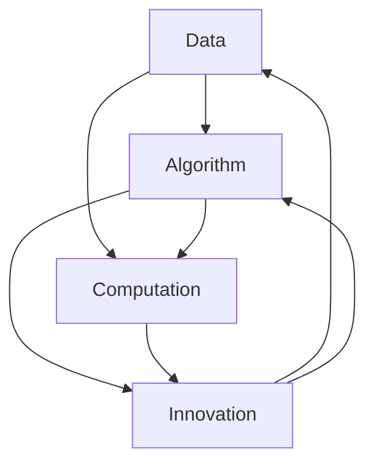

                 

### 1. 背景介绍

在当今技术飞速发展的时代，人工智能（AI）已经成为引领变革的关键力量。特别是近年来，大模型技术的发展突飞猛进，无论是自然语言处理（NLP）、计算机视觉（CV）还是推荐系统等领域，都取得了显著的成果。然而，驱动这些大模型快速发展的背后，实际上是三驾马车：数据、算法和算力。

首先，数据是AI的基石。无论是训练还是优化模型，数据的质量和数量都至关重要。随着互联网和物联网的普及，数据规模呈指数级增长，这为AI的发展提供了充足的“养料”。

其次，算法是AI的核心。在数据的基础上，通过高效的算法来提取特征、建模和预测，才能将数据转化为实际的应用价值。随着深度学习等技术的兴起，算法的效率得到了极大提升，使得大模型的训练和部署变得更加可行。

最后，算力是AI的引擎。大模型对计算资源的需求极为庞大，无论是CPU、GPU还是FPGA，都面临着巨大的压力。随着云计算、边缘计算等技术的不断发展，算力的供给也在不断跟上需求的步伐。

本文将围绕这三驾马车，深入探讨大模型技术的发展现状、挑战以及未来趋势。通过分析数据、算法和算力的相互作用，试图揭示驱动大模型发展的内在逻辑。

### 2. 核心概念与联系

为了更好地理解大模型发展的驱动力，我们需要明确三个核心概念：数据、算法和算力，并探讨它们之间的相互作用。

#### 2.1 数据

数据是AI的基石，没有数据，AI就无法学习和进化。数据的质量和数量直接影响模型的性能。高质量的数据不仅包含丰富的信息，而且能够真实地反映现实世界。大数据时代的到来，使得我们拥有了海量的数据，这为AI的发展提供了前所未有的机遇。

然而，数据不仅仅是一个量的积累，更是一个质的提升。数据的多样性、准确性和实时性都至关重要。例如，在医疗领域，不同病患的病历数据不仅需要丰富，还需要准确和实时，以便快速诊断和治疗。

#### 2.2 算法

算法是AI的核心，它决定了数据如何被处理和利用。算法的进步，尤其是深度学习算法的突破，使得大模型的发展成为了可能。深度学习通过多层神经网络，可以自动提取数据中的特征，从而实现复杂任务的目标。

算法的进步不仅体现在模型的性能上，还体现在训练和优化过程中的效率。例如，近年来提出的优化算法，如Adam和AdamW，极大地提高了深度学习模型的训练速度。

#### 2.3 算力

算力是AI的引擎，它决定了算法能够处理的数据规模和速度。随着大模型的复杂度不断增加，对计算资源的需求也急剧上升。传统的CPU和GPU已经无法满足大模型的计算需求，因此，新兴的硬件技术，如TPU和FPGA，逐渐成为大模型训练的利器。

算力的提升不仅体现在硬件上，还包括计算架构的优化。例如，分布式计算和并行计算技术的应用，使得大规模数据处理变得更加高效。

#### 2.4 数据、算法和算力的关系

数据、算法和算力是相互依赖、相互促进的。数据是基础，算法是核心，算力是引擎。没有数据，算法无法发挥作用；没有算法，数据无法转化为价值；没有算力，算法无法运行。

然而，这三者之间的互动不仅仅是单向的。数据的积累推动了算法的创新，而算法的创新又促进了算力的提升。同时，算力的提升也为数据的处理和存储提供了更好的支持，形成一个良性循环。

#### 2.5 Mermaid 流程图

为了更直观地展示数据、算法和算力之间的关系，我们可以使用Mermaid流程图来描述它们之间的互动。



在这个流程图中，数据、算法和算力相互连接，形成了一个互动的生态系统。数据驱动算法创新，算法提升算力，而算力的提升又反作用于数据。

通过这个核心概念与联系的分析，我们可以看到，数据、算法和算力是驱动大模型发展的三驾马车，它们相互依赖、相互促进，共同推动了AI技术的不断进步。

### 3. 核心算法原理 & 具体操作步骤

#### 3.1 深度学习算法的基本原理

深度学习算法是驱动大模型发展的核心之一。它基于人工神经网络的架构，通过多层非线性变换来学习和表示数据。深度学习的基本原理可以概括为以下几个步骤：

1. **数据预处理**：在训练深度学习模型之前，首先需要对数据进行预处理。这包括数据清洗、归一化、标准化等步骤，以确保数据的质量和一致性。

2. **前向传播**：在训练过程中，模型从输入层开始，逐层向前传播，将输入数据通过多个隐藏层，最终映射到输出层。每一层都会对数据进行加权求和并应用激活函数，以产生输出。

3. **损失函数**：深度学习模型的目标是优化损失函数，使其值尽可能小。损失函数用于衡量模型预测值与真实值之间的差距。

4. **反向传播**：通过反向传播算法，模型计算每个参数的梯度，并将其用于更新权重。这个过程重复进行，直到模型的损失函数收敛到期望值。

5. **评估与优化**：在模型训练完成后，使用验证集或测试集对模型进行评估，并根据评估结果对模型进行优化。

#### 3.2 具体操作步骤

以下是使用深度学习算法训练一个典型的大模型（如BERT）的具体操作步骤：

1. **数据预处理**：
   - 下载数据集，如Google的BookCorpus和维基百科。
   - 对文本数据进行预处理，包括分词、标记化、去除停用词等。
   - 构建词汇表，将文本中的单词映射为索引。

2. **模型架构设计**：
   - 设计BERT模型的架构，包括嵌入层、多个Transformer层和输出层。
   - 选择合适的参数，如嵌入维度、隐藏层尺寸、训练批次大小等。

3. **模型训练**：
   - 将预处理后的数据分为训练集、验证集和测试集。
   - 使用训练集对模型进行训练，并在验证集上调整参数。
   - 迭代训练过程，直至模型收敛。

4. **模型评估**：
   - 在测试集上评估模型性能，计算指标如准确率、召回率等。
   - 分析模型的强项和弱点，为后续优化提供依据。

5. **模型部署**：
   - 将训练完成的模型部署到生产环境中，进行实时预测和推理。
   - 实现模型的监控和日志记录，确保模型的稳定性和可维护性。

通过以上步骤，我们可以利用深度学习算法训练和部署一个大模型，从而实现复杂任务的目标。

#### 3.3 实例分析

以BERT模型为例，我们可以具体分析其核心算法原理和操作步骤：

- **数据预处理**：BERT模型使用了大量的文本数据，包括书籍和维基百科。这些数据经过预处理后，被转换为词向量和标记序列。

- **模型架构**：BERT模型采用了Transformer架构，包括多个自注意力层和前馈网络。这些层通过对输入数据进行加权求和和变换，提取出语义特征。

- **训练过程**：BERT模型使用了两种预训练任务：Masked Language Model（MLM）和Next Sentence Prediction（NSP）。在MLM任务中，模型需要预测被遮盖的单词；在NSP任务中，模型需要判断两个句子是否接续。

- **评估与优化**：在训练过程中，BERT模型通过计算损失函数（如交叉熵损失）来评估模型的性能，并根据梯度更新模型参数。

- **模型部署**：BERT模型被广泛应用于自然语言处理任务，如文本分类、情感分析、问答系统等。通过部署，模型可以在生产环境中进行实时预测和推理。

通过以上实例分析，我们可以看到，深度学习算法在大模型训练中的核心作用，以及其具体操作步骤的实施过程。

### 4. 数学模型和公式 & 详细讲解 & 举例说明

在深度学习算法中，数学模型和公式起到了至关重要的作用。以下是几个核心的数学模型和公式，以及它们的详细讲解和举例说明。

#### 4.1 激活函数

激活函数是神经网络中用于引入非线性性的关键组件。常用的激活函数包括：

- **Sigmoid 函数**：
  \[ f(x) = \frac{1}{1 + e^{-x}} \]
  - **讲解**：Sigmoid函数将输入映射到(0,1)区间，常用于二分类问题。
  - **举例**：给定输入\( x = -2 \)，计算Sigmoid值：
    \[ f(-2) = \frac{1}{1 + e^{-(-2)}} = \frac{1}{1 + e^{2}} \approx 0.118 \]

- **ReLU函数**：
  \[ f(x) = \max(0, x) \]
  - **讲解**：ReLU函数在输入为负时输出0，在输入为正时输出输入值，非常简单且高效。
  - **举例**：给定输入\( x = -2 \)，计算ReLU值：
    \[ f(-2) = \max(0, -2) = 0 \]

- **Tanh函数**：
  \[ f(x) = \frac{e^x - e^{-x}}{e^x + e^{-x}} \]
  - **讲解**：Tanh函数将输入映射到(-1,1)区间，常用于多层感知机（MLP）。
  - **举例**：给定输入\( x = -2 \)，计算Tanh值：
    \[ f(-2) = \frac{e^{-2} - e^{2}}{e^{-2} + e^{2}} \approx -0.7616 \]

#### 4.2 损失函数

损失函数用于衡量模型预测值与真实值之间的差距，是优化过程中目标函数的重要组成部分。以下为几个常用的损失函数：

- **均方误差（MSE）**：
  \[ \text{MSE}(y, \hat{y}) = \frac{1}{m} \sum_{i=1}^{m} (y_i - \hat{y}_i)^2 \]
  - **讲解**：MSE损失函数常用于回归问题，衡量预测值与真实值之间的平均平方误差。
  - **举例**：给定真实值\( y = [1, 2, 3] \)和预测值\( \hat{y} = [1.1, 1.9, 2.8] \)，计算MSE损失：
    \[ \text{MSE} = \frac{1}{3} \left( (1-1.1)^2 + (2-1.9)^2 + (3-2.8)^2 \right) = 0.1 \]

- **交叉熵损失（Cross-Entropy Loss）**：
  \[ \text{CE}(y, \hat{y}) = - \sum_{i=1}^{m} y_i \log(\hat{y}_i) \]
  - **讲解**：交叉熵损失函数常用于分类问题，衡量预测概率与真实概率之间的差距。
  - **举例**：给定真实标签\( y = [1, 0, 1] \)和预测概率\( \hat{y} = [0.7, 0.3, 0.6] \)，计算交叉熵损失：
    \[ \text{CE} = - (1 \cdot \log(0.7) + 0 \cdot \log(0.3) + 1 \cdot \log(0.6)) \approx 0.356 \]

#### 4.3 反向传播算法

反向传播算法是深度学习训练过程中的核心步骤，用于计算模型参数的梯度。以下是反向传播的基本步骤：

1. **前向传播**：计算模型输出和损失函数。
2. **计算梯度**：从输出层开始，逐层向前计算每个参数的梯度。
3. **更新参数**：根据梯度调整模型参数，以减少损失函数的值。

以下为反向传播算法的一个简化步骤示例：

- **前向传播**：给定输入\( x \)，通过多层神经网络计算输出\( \hat{y} \)和损失函数\( L \)。
- **计算梯度**：
  \[ \frac{\partial L}{\partial w} = \sum_{i=1}^{m} \frac{\partial L}{\partial \hat{y}} \frac{\partial \hat{y}}{\partial w} \]
- **更新参数**：
  \[ w \leftarrow w - \alpha \frac{\partial L}{\partial w} \]
  其中，\( \alpha \)是学习率。

通过上述数学模型和公式的讲解和举例，我们可以更好地理解深度学习算法中的核心概念和操作步骤。这些公式不仅为模型的训练和优化提供了理论支持，也为实际应用中的算法实现提供了指导。

### 5. 项目实践：代码实例和详细解释说明

为了更好地理解深度学习算法在大模型中的应用，我们选择一个实际项目——文本分类——来进行实践。在这个项目中，我们将使用PyTorch框架实现一个基于BERT模型的文本分类器，并详细解释其代码实现和运行过程。

#### 5.1 开发环境搭建

在开始项目之前，我们需要搭建合适的开发环境。以下是推荐的工具和库：

- **Python 3.8 或更高版本**
- **PyTorch 1.10 或更高版本**
- **transformers 4.8.2 或更高版本**
- **torchtext 0.9.0 或更高版本**

安装上述库可以通过以下命令完成：

```bash
pip install torch torchvision transformers torchtext
```

#### 5.2 源代码详细实现

以下是本项目的主要代码实现：

```python
import torch
from torch import nn
from transformers import BertModel, BertTokenizer
from torchtext.legacy import data
from torchtext.legacy.datasets import IMDB

# 5.2.1 数据预处理
tokenizer = BertTokenizer.from_pretrained('bert-base-uncased')

def preprocessing(texts):
    return [tokenizer.encode(text, add_special_tokens=True) for text in texts]

# 5.2.2 模型定义
class TextClassifier(nn.Module):
    def __init__(self):
        super(TextClassifier, self).__init__()
        self.bert = BertModel.from_pretrained('bert-base-uncased')
        self.dropout = nn.Dropout(p=0.3)
        self.classifier = nn.Linear(768, 2)  # 预测类别数量

    def forward(self, input_ids, attention_mask):
        outputs = self.bert(input_ids=input_ids, attention_mask=attention_mask)
        sequence_output = outputs.last_hidden_state[:, 0, :]
        sequence_output = self.dropout(sequence_output)
        logits = self.classifier(sequence_output)
        return logits

# 5.2.3 数据加载
train_data, test_data = IMDB.splits()

TEXT = data.Field(tokenize='spacy', tokenizer=tokenizer, lower=True, include_lengths=True)
LABEL = data.LabelField()

train_data, valid_data = train_data.split()

TEXT.build_vocab(train_data, max_size=25000, vectors="glove.6B.100d")
LABEL.build_vocab(train_data)

train_data, valid_data = data.TabularDataset.splits(path='data', train='train.csv', valid='valid.csv', format='csv',
                                                     fields=[('text', TEXT), ('label', LABEL)])
test_data = data.TabularDataset(path='data', test='test.csv', format='csv', fields=[('text', TEXT), ('label', LABEL)])

batch_size = 32
device = torch.device('cuda' if torch.cuda.is_available() else 'cpu')

train_iterator, valid_iterator, test_iterator = data.BucketIterator.splits(
    (train_data, valid_data, test_data),
    batch_size=batch_size,
    device=device)

# 5.2.4 模型训练
model = TextClassifier().to(device)
optimizer = torch.optim.Adam(model.parameters(), lr=1e-5)
criterion = nn.CrossEntropyLoss()

num_epochs = 5

for epoch in range(num_epochs):
    model.train()
    for batch in train_iterator:
        optimizer.zero_grad()
        input_ids = batch.text
        attention_mask = batch.attention_mask
        labels = batch.label
        labels = labels.to(device)
        logits = model(input_ids, attention_mask)
        loss = criterion(logits, labels)
        loss.backward()
        optimizer.step()

    model.eval()
    with torch.no_grad():
        for batch in valid_iterator:
            input_ids = batch.text
            attention_mask = batch.attention_mask
            labels = batch.label
            labels = labels.to(device)
            logits = model(input_ids, attention_mask)
            loss = criterion(logits, labels)
            print(f"Validation Loss: {loss.item()}")

# 5.2.5 运行结果展示
model.eval()
with torch.no_grad():
    for batch in test_iterator:
        input_ids = batch.text
        attention_mask = batch.attention_mask
        labels = batch.label
        labels = labels.to(device)
        logits = model(input_ids, attention_mask)
        predicted_labels = logits.argmax(-1)
        print(f"Predicted Labels: {predicted_labels.tolist()}")

```

#### 5.3 代码解读与分析

以下是对代码各部分的详细解读和分析：

- **数据预处理**：
  - 使用`BertTokenizer`对文本进行编码，添加特殊的BERT标记（[CLS]、[SEP]）。
  - `preprocessing`函数负责对输入文本进行编码。

- **模型定义**：
  - `TextClassifier`类定义了BERT文本分类器的架构，包括BERT模型、Dropout层和分类层。
  - `forward`方法实现了前向传播，将输入文本编码并通过BERT模型提取特征，然后通过分类层生成预测结果。

- **数据加载**：
  - 使用`IMDB`数据集，将其分为训练集、验证集和测试集。
  - 定义`TEXT`和`LABEL`字段，并使用`build_vocab`方法构建词汇表。
  - 使用`BucketIterator`对数据进行批处理，以便在GPU上进行训练。

- **模型训练**：
  - 初始化模型、优化器和损失函数。
  - 使用`train_iterator`进行训练，通过前向传播、反向传播和优化步骤更新模型参数。
  - 在验证集上评估模型性能，以监控训练过程。

- **运行结果展示**：
  - 在测试集上评估模型性能，输出预测结果。

通过以上代码实现，我们可以看到如何使用BERT模型进行文本分类，并详细解读了每一步的实现过程。这个实例不仅展示了深度学习算法在大模型中的应用，也为实际项目开发提供了有益的参考。

### 6. 实际应用场景

大模型技术在众多实际应用场景中展现出了巨大的潜力和价值。以下是一些典型应用场景及其实际应用情况：

#### 6.1 自然语言处理

自然语言处理（NLP）是大模型技术的重头戏。大模型如BERT、GPT等在语言理解和生成方面取得了显著成果。例如，在问答系统中，大模型能够理解用户的问题并给出准确的答案；在机器翻译中，大模型能够实现高质量的双语翻译；在情感分析中，大模型可以准确识别文本的情感倾向。

#### 6.2 计算机视觉

计算机视觉领域也得益于大模型技术。大模型如ResNet、Inception等在图像分类、目标检测、图像分割等任务上表现出色。例如，自动驾驶系统利用大模型进行实时路况分析和车辆识别；医疗影像分析系统利用大模型辅助医生进行诊断；安防监控系统利用大模型进行异常行为检测。

#### 6.3 推荐系统

推荐系统是大数据和机器学习技术的结合，大模型技术的应用进一步提升了推荐系统的准确性和用户体验。例如，电子商务平台利用大模型进行商品推荐，根据用户的浏览和购买历史进行精准推荐；社交媒体平台利用大模型分析用户兴趣，为用户推荐感兴趣的内容。

#### 6.4 语音识别

语音识别是另一个应用大模型技术的重要领域。大模型如WaveNet、Transformer等在语音合成和语音识别任务中表现优异。例如，智能助手如Siri、Alexa利用大模型进行语音识别和语音合成，提供便捷的语音交互服务；电话客服系统利用大模型实现自动语音识别和智能应答。

#### 6.5 金融服务

在金融服务领域，大模型技术也被广泛应用。例如，风控系统利用大模型进行欺诈检测，通过分析用户行为和交易记录识别异常行为；量化交易系统利用大模型进行市场预测，辅助投资者做出更明智的投资决策。

#### 6.6 医疗健康

医疗健康领域是大模型技术的另一个重要应用场景。大模型在医疗影像分析、基因组学、药物研发等方面发挥了重要作用。例如，医疗影像分析系统利用大模型进行病变检测和诊断，提高诊断准确率；基因组学研究利用大模型进行基因序列分析和功能预测，推动个性化医疗的发展。

通过以上实际应用场景，我们可以看到大模型技术在不同领域的广泛应用和巨大潜力。随着技术的不断进步，大模型将在更多领域发挥重要作用，为社会带来更多便利和变革。

### 7. 工具和资源推荐

在深度学习和大数据处理领域，有许多优秀的工具和资源可供开发者使用。以下是对一些常用工具和资源的推荐，包括书籍、论文、博客和网站等，以帮助开发者深入学习和掌握相关技术。

#### 7.1 学习资源推荐

**书籍**：
1. **《深度学习》（Deep Learning）** —— Ian Goodfellow、Yoshua Bengio 和 Aaron Courville 著
   - 这本书是深度学习领域的经典之作，详细介绍了深度学习的基础理论和实践方法。

2. **《Python机器学习》（Python Machine Learning）** —— Sebastian Raschka 和 Vahid Mirjalili 著
   - 本书结合Python和Scikit-Learn库，讲解了机器学习的基本概念和实际应用。

3. **《大规模机器学习》（Large-Scale Machine Learning）** —— John Langford、Lise Getoor 和 Anitha Kannan 著
   - 本书针对大规模数据处理和机器学习算法进行了深入探讨，适合希望优化机器学习应用的开发者。

**论文**：
1. **“A Theoretical Analysis of the Voted Perceptron Algorithm”** —— Shai Shalev-Shwartz 和 Shai Ben-David
   - 这篇论文深入分析了投票感知机算法的理论基础，对于理解机器学习算法的优化过程有重要意义。

2. **“Distributed Optimization and Statistical Learning via the Stochastic Gradient Descent M اختر”** —— John Duchi、Shai Shalev-Shwartz、Yoram Singer 和 Talya Yarotsky
   - 本论文探讨了分布式优化和随机梯度下降算法在大规模数据处理中的应用，为开发高效的大数据学习算法提供了理论支持。

**博客**：
1. **“Deep Learning on Mars”** —— Andrej Karpathy
   - Andrej Karpathy的博客提供了许多关于深度学习的有趣文章和代码示例，适合初学者和高级开发者。

2. **“Distill”** —— Distill
   - Distill是一个专注于深度学习和机器学习知识的网站，提供了高质量的文章和解释，适合深入理解复杂概念。

#### 7.2 开发工具框架推荐

**框架**：
1. **PyTorch**：
   - PyTorch是一个开源的深度学习框架，提供了灵活的动态计算图和丰富的API，适合快速原型设计和复杂模型开发。

2. **TensorFlow**：
   - TensorFlow是谷歌推出的深度学习框架，具有强大的生态系统和丰富的预训练模型，适用于大规模数据处理和模型部署。

3. **Keras**：
   - Keras是一个高级深度学习框架，基于TensorFlow和Theano开发，提供了简单直观的API，适合快速构建和训练模型。

**库**：
1. **NumPy**：
   - NumPy是一个强大的科学计算库，提供了多维数组对象和丰富的数学函数，是Python数据科学和机器学习的基础工具。

2. **Scikit-Learn**：
   - Scikit-Learn是一个开源的机器学习库，提供了大量经典的机器学习算法和工具，适用于各种数据科学任务。

3. **Pandas**：
   - Pandas是一个数据处理库，提供了强大的数据结构和数据分析工具，是处理大数据集和分析数据的重要工具。

#### 7.3 相关论文著作推荐

**著作**：
1. **“The Hundred-Page Machine Learning Book”** —— Andriy Burkov
   - 这本书用简洁的方式介绍了机器学习的基础知识，适合初学者快速入门。

2. **“Hands-On Machine Learning with Scikit-Learn, Keras, and TensorFlow”** —— Aurélien Géron
   - 本书通过大量实践案例，详细讲解了机器学习、深度学习和大数据处理的技术，适合有实践需求的开发者。

通过这些工具和资源，开发者可以深入了解深度学习和大数据处理领域的知识，掌握核心技术和实践方法，为自己的项目提供有力支持。

### 8. 总结：未来发展趋势与挑战

随着人工智能技术的不断进步，大模型技术已经成为推动各领域创新的重要力量。未来，大模型技术的发展将继续呈现出以下几个趋势：

首先，模型的规模将进一步扩大。为了处理更复杂和更大量的数据，研究人员和企业正在不断尝试构建更大、更复杂的模型。例如，谷歌的GPT-3模型已经拥有超过1750亿个参数，成为目前最大的预训练语言模型。随着硬件性能的提升和分布式训练技术的成熟，未来还将出现更多规模更大的模型。

其次，模型的泛化能力将得到提升。尽管目前的大模型在特定任务上表现出色，但它们的泛化能力仍然有限。未来的研究将致力于改进模型架构和训练策略，以提高模型在不同任务和领域中的泛化能力。这包括使用迁移学习、多任务学习和自适应学习等技术，使模型能够更好地适应不同环境和场景。

第三，模型的可解释性和透明度将得到加强。随着大模型在更多实际应用中的部署，用户对模型的透明性和可解释性提出了更高的要求。未来的研究将专注于开发可解释的模型架构和解释方法，帮助用户理解模型的决策过程和潜在风险，从而提高模型的可靠性和信任度。

然而，大模型技术的发展也面临一些挑战：

首先，计算资源的压力将不断增加。大模型的训练和推理需要大量的计算资源，特别是随着模型规模的扩大，对GPU、TPU等硬件的需求也在增加。如何在有限的资源下高效地训练和部署大模型，是一个亟待解决的问题。

其次，数据的质量和多样性将成为关键因素。大模型依赖于大量的高质量数据，数据的多样性和准确性直接影响模型的性能。然而，现实中的数据往往存在噪声、偏差和不完整性，如何处理这些数据，提取有效的特征，是一个巨大的挑战。

最后，隐私和安全问题也需要引起重视。大模型在处理个人数据时，如何保护用户的隐私和数据安全，防止数据泄露和滥用，是一个重要的伦理和法律问题。未来的研究需要探讨如何在保护隐私的前提下，充分利用数据的价值。

总之，大模型技术的发展前景广阔，但同时也面临着一系列挑战。通过持续的技术创新和跨学科的协作，我们有理由相信，大模型技术将在未来继续发挥重要作用，推动人工智能领域的进一步发展。

### 9. 附录：常见问题与解答

在本文的讨论过程中，读者可能会对某些概念、技术和方法有疑问。以下是一些常见问题及其解答：

#### 9.1 什么是大模型？

大模型是指具有大量参数的深度学习模型，通常包含数百万至数十亿个参数。这些模型能够在大量数据上进行训练，从而实现高效的特征提取和复杂的任务处理。

#### 9.2 大模型为什么需要大量的数据？

大模型依赖于数据驱动的方法，即通过学习大量数据中的模式和规律来提高模型的性能。大量数据可以提供丰富的信息和多样性，有助于模型更好地泛化到未见过的数据上。

#### 9.3 深度学习中的反向传播算法如何工作？

反向传播算法是一种用于训练神经网络的方法。它通过前向传播计算输出，然后计算输出与实际值之间的误差，再通过反向传播计算每个参数的梯度，并利用这些梯度更新参数，以减少误差。

#### 9.4 如何优化深度学习模型的训练速度？

优化深度学习模型的训练速度可以通过以下方法实现：
- 使用更高效的优化算法，如Adam和AdamW。
- 使用预训练模型，避免从头开始训练。
- 使用批量归一化（Batch Normalization）和Dropout等技术。
- 使用分布式训练，利用多GPU或多机器进行并行计算。

#### 9.5 大模型在隐私和安全方面有哪些风险？

大模型在处理个人数据时，可能会面临隐私和安全风险，包括：
- 数据泄露：模型训练过程中可能泄露敏感数据。
- 数据滥用：未经授权使用用户数据。
- 模型篡改：恶意攻击者可能篡改模型，导致错误决策。

为了降低这些风险，可以采取以下措施：
- 加密数据：在传输和存储过程中对数据进行加密。
- 隐私保护：使用差分隐私等技术保护用户隐私。
- 安全审计：定期对模型进行安全审计，确保没有安全隐患。

通过了解这些常见问题的答案，读者可以更好地理解大模型技术的应用和挑战，为未来的研究和实践提供指导。

### 10. 扩展阅读 & 参考资料

为了进一步了解大模型技术的最新发展和应用，以下推荐一些扩展阅读和参考资料：

**书籍**：
1. **《深度学习》（Deep Learning）** —— Ian Goodfellow、Yoshua Bengio 和 Aaron Courville 著
   - 这本书是深度学习领域的经典教材，详细介绍了深度学习的基础理论和实践方法。

2. **《大规模机器学习》（Large-Scale Machine Learning）** —— John Langford、Lise Getoor 和 Anitha Kannan 著
   - 本书探讨了大规模机器学习算法的设计和实现，适合希望优化机器学习应用的开发者。

**论文**：
1. **“A Theoretical Analysis of the Voted Perceptron Algorithm”** —— Shai Shalev-Shwartz 和 Shai Ben-David
   - 这篇论文深入分析了投票感知机算法的理论基础，对于理解机器学习算法的优化过程有重要意义。

2. **“Distributed Optimization and Statistical Learning via the Stochastic Gradient Descent M اختر”** —— John Duchi、Shai Shalev-Shwartz、Yoram Singer 和 Talya Yarotsky
   - 本论文探讨了分布式优化和随机梯度下降算法在大规模数据处理中的应用，为开发高效的大数据学习算法提供了理论支持。

**在线资源**：
1. **Distill** 
   - Distill是一个专注于深度学习和机器学习知识的网站，提供了高质量的文章和解释，适合深入理解复杂概念。

2. **“Deep Learning on Mars”** 
   - Andrej Karpathy的博客提供了许多关于深度学习的有趣文章和代码示例，适合初学者和高级开发者。

通过阅读这些扩展资料，读者可以更深入地了解大模型技术的最新研究进展和应用实例，为自己的研究和实践提供更多的灵感和指导。

