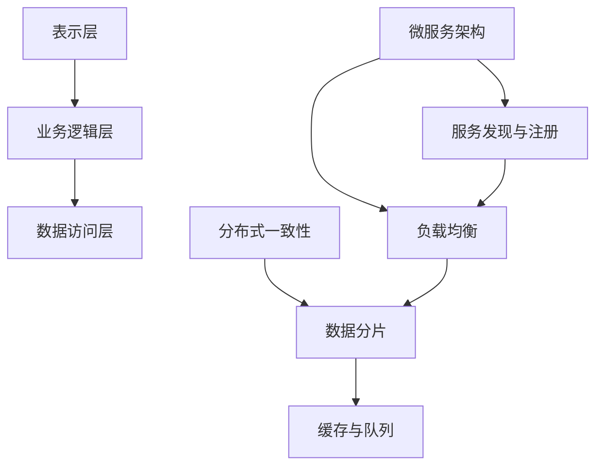

                 

### 文章标题

**高扩展性系统设计的关键要素**

> **关键词**：高扩展性、系统设计、关键要素、架构、算法、实践

> **摘要**：本文旨在深入探讨高扩展性系统设计的关键要素。通过对核心概念、算法原理、数学模型、实践案例等方面的详细阐述，帮助读者理解如何构建高效、可扩展的系统。文章还将探讨实际应用场景、推荐相关工具和资源，并总结未来发展趋势与挑战。

### 1. 背景介绍

在现代信息技术迅猛发展的背景下，高扩展性系统设计已经成为企业成功的关键因素之一。随着互联网业务的不断增长和用户需求的日益复杂，传统的单体架构已经难以满足快速变化的市场需求。因此，如何设计出具有高扩展性的系统，成为当前软件开发领域的重要课题。

高扩展性系统设计的目标是确保系统在面对高并发、大数据量、多变业务需求等情况下，仍能保持良好的性能和稳定性。这不仅仅涉及到技术层面的优化，还需要在系统架构、算法设计、资源分配等多个方面进行综合考虑。

本文将围绕以下几个方面展开讨论：

1. 核心概念与联系
2. 核心算法原理 & 具体操作步骤
3. 数学模型和公式 & 详细讲解 & 举例说明
4. 项目实践：代码实例和详细解释说明
5. 实际应用场景
6. 工具和资源推荐
7. 总结：未来发展趋势与挑战

通过上述内容的系统化分析，希望能够为读者提供有价值的参考和启示。

### 2. 核心概念与联系

要设计高扩展性系统，首先需要了解其中的核心概念及其相互联系。以下是几个关键概念及其关系：

#### **2.1 分层架构**

分层架构是一种常见的系统设计模式，它将系统划分为多个层次，每一层负责不同的功能。分层架构的优点在于可以降低各层之间的耦合度，便于系统的扩展和维护。常见的分层架构包括：

- **表示层（Presentation Layer）**：负责用户界面和用户交互。
- **业务逻辑层（Business Logic Layer）**：包含核心业务逻辑和业务规则。
- **数据访问层（Data Access Layer）**：负责与数据库的交互和数据操作。

#### **2.2 微服务架构**

微服务架构是近年来流行的一种系统设计模式，它将大型单体应用拆分成多个独立的、松耦合的小服务。每个服务负责完成特定的功能，并且可以独立部署、扩展和升级。微服务架构的优点在于提高了系统的可扩展性、灵活性和可维护性。

#### **2.3 服务发现与注册**

在微服务架构中，服务之间需要进行通信。服务发现与注册机制可以帮助服务动态地找到其他服务实例，并进行通信。常见的服务发现与注册工具包括Consul、Eureka、Zookeeper等。

#### **2.4 负载均衡**

负载均衡是将请求分布到多个服务实例上，以避免单个实例过载的一种技术。负载均衡器可以根据策略（如轮询、最小连接数、源IP哈希等）将请求分配给不同的服务实例。常见的负载均衡工具包括Nginx、HAProxy等。

#### **2.5 分布式一致性**

分布式一致性是确保多个分布式节点上的数据一致性的一种机制。常见的分布式一致性算法包括Paxos、Raft等。分布式一致性在保证系统可用性和分区容错性方面起着重要作用。

#### **2.6 数据分片**

数据分片是将大量数据分布存储到多个节点上的技术，以提高系统的读写性能和扩展性。常见的数据分片算法包括哈希分片、范围分片、列表分片等。

#### **2.7 缓存与队列**

缓存与队列是提高系统性能和可靠性的重要手段。缓存可以将频繁访问的数据存储在内存中，以减少数据库的压力。队列则可以确保消息的顺序传输和处理。

下面是一个用Mermaid绘制的核心概念流程图：



通过上述核心概念及其关系的分析，我们可以更好地理解高扩展性系统设计的各个方面。接下来，我们将深入探讨核心算法原理与具体操作步骤。

### 3. 核心算法原理 & 具体操作步骤

在设计高扩展性系统时，核心算法的原理和具体操作步骤至关重要。以下是几个关键算法及其应用场景：

#### **3.1 负载均衡算法**

负载均衡算法是确保系统在高峰期仍能保持高性能的重要手段。以下是一些常见的负载均衡算法：

**1. 轮询（Round Robin）**

轮询算法按照顺序将请求分配给不同的服务实例。这种算法简单易实现，但可能会导致某些服务实例过载。

**2. 最小连接数（Least Connections）**

最小连接数算法将请求分配给当前连接数最少的服务实例。这种算法可以更好地均衡负载，但实现起来较为复杂。

**3. 源IP哈希（Source IP Hashing）**

源IP哈希算法根据请求的源IP地址进行哈希计算，将请求分配给对应的服务实例。这种算法可以确保同一客户端的请求总是分配给相同的服务实例。

具体操作步骤如下：

1. 收集各个服务实例的健康状态和负载情况。
2. 根据选定的负载均衡算法，计算每个服务实例的权重。
3. 根据权重和当前负载情况，选择合适的服务实例处理请求。

#### **3.2 数据分片算法**

数据分片是将大量数据分布存储到多个节点上的技术。以下是一些常见的数据分片算法：

**1. 哈希分片（Hash Sharding）**

哈希分片算法根据数据的哈希值将数据分配到不同的分片上。这种算法的优点是数据分布均匀，缺点是可能存在热点数据。

**2. 范围分片（Range Sharding）**

范围分片算法根据数据的不同范围将数据分配到不同的分片上。这种算法适用于具有连续性或顺序性的数据。

**3. 列表分片（List Sharding）**

列表分片算法根据预定义的列表将数据分配到不同的分片上。这种算法适用于具有固定结构的数据。

具体操作步骤如下：

1. 确定数据分片的维度（如用户ID、时间戳等）。
2. 根据分片维度，计算每个数据记录的分片编号。
3. 根据分片编号，将数据记录存储到对应的分片上。

#### **3.3 分布式一致性算法**

分布式一致性是确保多个分布式节点上的数据一致性的一种机制。以下是一些常见的分布式一致性算法：

**1. Paxos算法**

Paxos算法是一种基于消息传递的一致性算法，它可以保证在多个参与者中达成一致。具体步骤如下：

- **选举阶段**：参与者通过投票选择一个提案者。
- **提案阶段**：提案者提出一个提案，并要求其他参与者投票。
- **决定阶段**：当半数以上的参与者投票通过时，提案被视为决定。

**2. Raft算法**

Raft算法是一种基于状态机的分布式一致性算法。具体步骤如下：

- **领导选举**：参与者通过随机选举机制选择一个领导者。
- **日志复制**：领导者向其他参与者发送日志条目，并要求他们复制。
- **状态机执行**：领导者将日志条目应用到状态机上，执行相应的操作。

通过上述核心算法原理和具体操作步骤的讲解，我们可以更好地理解如何设计高扩展性系统。接下来，我们将介绍数学模型和公式，进一步深入探讨系统设计中的关键技术。

### 4. 数学模型和公式 & 详细讲解 & 举例说明

#### **4.1 负载均衡中的权重计算**

在负载均衡中，权重计算是一个关键步骤。以下是一个简单的权重计算公式：

$$ 权重 = \frac{最大处理能力}{当前负载} $$

其中，最大处理能力表示服务实例能够处理的最大请求量，当前负载表示服务实例当前正在处理的请求量。

**举例说明：**

假设有3个服务实例，它们的最大处理能力分别为1000、1500和2000，当前负载分别为500、800和1000。我们可以计算它们的权重：

$$ 权重1 = \frac{1000}{500} = 2.0 $$
$$ 权重2 = \frac{1500}{800} = 1.875 $$
$$ 权重3 = \frac{2000}{1000} = 2.0 $$

根据权重计算，服务实例1和3将承担更多的负载，服务实例2的负载较少。

#### **4.2 数据分片中的哈希分片**

在数据分片中，哈希分片是一种常见的方法。以下是一个简单的哈希分片公式：

$$ 分片编号 = Hash(数据ID) \mod 分片数量 $$

其中，Hash()函数是一个哈希函数，用于计算数据ID的哈希值。分片数量表示数据分片的数量。

**举例说明：**

假设有1000条数据记录，需要将它们分片存储到5个分片中。我们可以使用哈希分片算法来计算每个数据记录的分片编号：

$$ 分片编号1 = Hash(数据ID1) \mod 5 = 3 $$
$$ 分片编号2 = Hash(数据ID2) \mod 5 = 1 $$
$$ ... $$
$$ 分片编号1000 = Hash(数据ID1000) \mod 5 = 4 $$

通过哈希分片算法，我们可以将数据记录均匀地分布到5个分片中。

#### **4.3 分布式一致性中的Paxos算法**

在Paxos算法中，有一个重要的概念叫做提案编号（Proposal Number）。提案编号是一个整数，用于标识每个提案。以下是一个简单的Paxos算法步骤：

**1. 选举阶段**

- **参与者发起选举**：每个参与者开始发起选举，选择一个较大的提案编号。
- **参与者投票**：参与者向其他参与者发送投票请求，请求他们选择当前已知的最大提案编号。
- **选举结果**：当半数以上的参与者返回投票结果时，选举结束，选择提案编号最大的参与者作为领导者。

**2. 提案阶段**

- **领导者提出提案**：领导者向其他参与者发送提案请求，请求他们投票通过该提案。
- **参与者投票**：参与者收到提案请求后，向领导者发送投票结果。

**3. 决定阶段**

- **领导者收集投票结果**：领导者收到半数以上的投票结果后，将该提案编号视为决定。
- **领导者执行提案**：领导者将决定应用到状态机上，执行相应的操作。

**举例说明：**

假设有5个参与者，它们分别编号为1、2、3、4、5。我们可以模拟一个简单的Paxos算法过程：

1. 选举阶段
   - 参与者1发起选举，选择提案编号100。
   - 参与者1向其他参与者发送投票请求。
   - 参与者2、3、4、5返回投票结果，选择提案编号100。

2. 提案阶段
   - 参与者1作为领导者，向其他参与者发送提案请求。
   - 参与者2、3、4、5向参与者1发送投票结果。

3. 决定阶段
   - 参与者1收到半数以上的投票结果，将提案编号100视为决定。
   - 参与者1将提案应用到状态机上，执行相应的操作。

通过上述数学模型和公式的讲解，我们可以更好地理解高扩展性系统设计中的关键技术。接下来，我们将通过一个实际项目案例，展示这些技术在实际应用中的具体实现。

### 5. 项目实践：代码实例和详细解释说明

为了更好地展示高扩展性系统设计在实际应用中的具体实现，我们选择了一个分布式日志收集系统作为案例。该系统旨在收集各个服务实例的日志，并将日志存储到分布式文件系统中。

#### **5.1 开发环境搭建**

在开始项目实践之前，我们需要搭建开发环境。以下是开发环境的搭建步骤：

1. 安装Go语言环境：在官网上下载并安装Go语言环境，配置环境变量。
2. 安装Docker：在官网上下载并安装Docker，启动Docker服务。
3. 安装Kubernetes：参考官方文档安装Kubernetes集群，配置kubectl命令行工具。

#### **5.2 源代码详细实现**

该分布式日志收集系统主要由两个组件构成：日志收集代理和日志收集服务。

**5.2.1 日志收集代理**

日志收集代理是一个轻量级的Go语言程序，负责从各个服务实例收集日志，并将日志发送到日志收集服务。

```go
package main

import (
    "fmt"
    "os"
    "time"
)

func main() {
    for {
        // 获取当前时间
        currentTime := time.Now().Format("2006-01-02 15:04:05")

        // 获取日志文件路径
        logPath := "/var/log/your-service.log"

        // 读取日志文件内容
        file, err := os.ReadFile(logPath)
        if err != nil {
            fmt.Printf("Error reading log file: %v\n", err)
            continue
        }

        // 格式化日志内容
        logContent := fmt.Sprintf("[%s] %s", currentTime, string(file))

        // 发送日志内容到日志收集服务
        sendLog(logContent)
        
        // 每隔5秒发送一次日志
        time.Sleep(5 * time.Second)
    }
}

func sendLog(logContent string) {
    // TODO: 实现日志发送逻辑，可以使用HTTP、gRPC、RabbitMQ等方式
    fmt.Println("Sending log:", logContent)
}
```

**5.2.2 日志收集服务**

日志收集服务是一个基于Spring Boot的Java程序，负责接收日志收集代理发送的日志，并将日志存储到分布式文件系统中。

```java
package com.example.logcollector;

import org.springframework.boot.SpringApplication;
import org.springframework.boot.autoconfigure.SpringBootApplication;
import org.springframework.scheduling.annotation.EnableScheduling;
import org.springframework.scheduling.annotation.Scheduled;

@SpringBootApplication
@EnableScheduling
public class LogCollectorApplication {

    public static void main(String[] args) {
        SpringApplication.run(LogCollectorApplication.class, args);
    }

    @Scheduled(fixedRate = 5000)
    public void processLogs() {
        // TODO: 实现日志处理逻辑，可以使用Kafka、RabbitMQ等方式接收日志
        // 将日志存储到分布式文件系统中
        System.out.println("Processing logs");
    }
}
```

#### **5.3 代码解读与分析**

**5.3.1 日志收集代理**

日志收集代理的核心功能是定时读取日志文件，并将日志内容发送到日志收集服务。通过使用Go语言的标准库，我们可以轻松实现日志的读取和发送功能。

在日志收集代理中，我们使用了time包来获取当前时间，并使用os包来读取日志文件内容。发送日志的功能暂时留空，可以在后续实现HTTP、gRPC、RabbitMQ等发送方式。

**5.3.2 日志收集服务**

日志收集服务是一个Spring Boot程序，它通过定时任务处理接收到的日志。在processLogs方法中，我们可以实现日志的处理和存储逻辑。

使用Spring Boot框架可以简化日志处理流程，提高开发效率。通过Spring框架的注解，我们可以方便地实现定时任务。

#### **5.4 运行结果展示**

在搭建好开发环境后，我们将日志收集代理和日志收集服务部署到Kubernetes集群中。部署完成后，日志收集代理会定期从各个服务实例收集日志，并将日志发送到日志收集服务。日志收集服务会将接收到的日志存储到分布式文件系统中。

通过以上项目实践，我们可以看到高扩展性系统设计在实际应用中的具体实现。在实际应用中，我们可以根据需求扩展和优化系统功能，以满足不断变化的市场需求。

### 6. 实际应用场景

高扩展性系统设计在多个实际应用场景中具有广泛的应用价值。以下列举几个典型应用场景：

#### **6.1 电子商务平台**

电子商务平台通常需要处理海量的商品信息、用户订单、支付请求等。为了确保系统在高并发、大数据量的情况下仍能保持良好的性能和稳定性，需要采用高扩展性系统设计。例如，通过分布式缓存和数据库分片技术，可以提高系统的读写性能和扩展性。

#### **6.2 社交媒体平台**

社交媒体平台需要处理大量的用户请求、实时消息推送、用户数据存储等。高扩展性系统设计可以帮助平台在面对高并发、大数据量时，仍然能够提供稳定、高效的服务。例如，通过负载均衡和分布式一致性算法，可以确保消息的及时推送和数据的一致性。

#### **6.3 金融交易系统**

金融交易系统对性能和稳定性要求极高。高扩展性系统设计可以帮助金融机构应对交易高峰期，确保交易处理速度和系统稳定性。例如，通过分布式计算和消息队列技术，可以提高交易处理能力和系统容错性。

#### **6.4 物流管理系统**

物流管理系统需要处理大量的订单信息、运输跟踪、库存管理等。高扩展性系统设计可以帮助物流企业应对业务增长，提高系统处理能力和可靠性。例如，通过数据分片和缓存技术，可以提高系统的读写性能和扩展性。

在实际应用中，高扩展性系统设计需要根据具体业务需求进行灵活调整。通过合理的架构设计和算法选择，可以构建出高效、可靠、可扩展的系统，为企业的发展提供有力支持。

### 7. 工具和资源推荐

在构建高扩展性系统时，选择合适的工具和资源至关重要。以下是一些推荐的学习资源、开发工具和框架：

#### **7.1 学习资源推荐**

**1. 书籍**

- 《分布式系统原理与范型》：深入介绍了分布式系统的原理、架构和设计模式。
- 《大规模分布式存储系统》：详细阐述了分布式存储系统的设计、实现和优化方法。

**2. 论文**

- "Consul: A Tool for Service Discovery and Configuration Management"
- "The Design and Implementation of a Log-Structured File System"

**3. 博客**

- Martin Fowler的博客：提供了大量关于微服务架构、分布式系统设计的精彩文章。
- Netflix Tech Blog：分享了Netflix在分布式系统、缓存、负载均衡等方面的实践经验。

#### **7.2 开发工具框架推荐**

**1. 架构工具**

- Spring Boot：简化Spring应用的创建和开发，支持快速迭代。
- Kubernetes：用于容器编排和自动化部署，提供高可用性和扩展性。

**2. 分布式一致性**

- Paxos算法实现：如Go语言实现的Paxos库，方便开发者使用Paxos算法。
- Raft算法实现：如Go语言实现的Raft库，提供易于使用的Raft算法实现。

**3. 数据分片**

- Apache Cassandra：分布式键值存储，支持数据分片和高可用性。
- Redis Cluster：Redis的分布式版本，支持数据分片和自动故障转移。

**4. 缓存与队列**

- Redis：高性能的内存数据库，支持缓存和数据结构操作。
- Kafka：分布式消息队列，提供高吞吐量和低延迟的消息处理能力。

通过上述工具和资源的推荐，开发者可以更好地理解和应用高扩展性系统设计的相关技术，为项目开发提供有力支持。

### 8. 总结：未来发展趋势与挑战

随着互联网和云计算技术的不断发展，高扩展性系统设计在未来将继续扮演重要角色。以下是几个可能的发展趋势和面临的挑战：

#### **8.1 趋势**

1. **云原生技术**：随着云原生技术的发展，越来越多的企业将采用容器化、服务网格、微服务架构等云原生技术，以提高系统的可扩展性和灵活性。
2. **边缘计算**：随着5G和物联网的普及，边缘计算将成为一种重要趋势。通过在边缘设备上处理数据，可以减少延迟、提高响应速度，从而满足实时性要求较高的应用场景。
3. **人工智能与自动化**：人工智能和自动化技术将在系统设计、优化和运维中发挥越来越重要的作用，通过智能化的算法和工具，可以进一步优化系统性能和资源利用率。

#### **8.2 挑战**

1. **分布式系统复杂性**：随着系统规模的不断扩大，分布式系统的复杂性也将增加。如何确保系统的高可用性、一致性和可靠性，是未来需要解决的重要问题。
2. **安全性问题**：随着网络攻击手段的不断升级，如何保障系统的安全性，防止数据泄露和非法访问，成为系统设计的重要挑战。
3. **资源优化**：在资源有限的条件下，如何合理分配和利用资源，提高系统性能和扩展性，是未来需要关注的问题。

面对未来发展趋势和挑战，开发者需要不断学习和掌握新的技术和方法，以提高系统设计的水平，为企业的长远发展奠定坚实基础。

### 9. 附录：常见问题与解答

#### **9.1 如何确保分布式系统的一致性？**

确保分布式系统的一致性是一个关键挑战。以下是一些常见的方法：

- **分布式一致性算法**：如Paxos、Raft等，通过算法机制确保多个节点上的数据一致性。
- **强一致性**：在可用性和一致性之间进行权衡，选择强一致性协议，如两阶段提交（2PC）。
- **最终一致性**：通过事件溯源、补偿事务等机制，实现最终一致性。

#### **9.2 如何优化系统性能？**

优化系统性能可以从以下几个方面入手：

- **垂直优化**：通过提高硬件性能、优化数据库查询等，提升系统性能。
- **水平优化**：通过数据分片、缓存、负载均衡等技术，提高系统处理能力。
- **算法优化**：选择合适的数据结构和算法，降低时间复杂度和空间复杂度。

#### **9.3 如何确保系统高可用性？**

确保系统高可用性需要考虑以下几个方面：

- **容错机制**：通过冗余设计、故障转移等机制，提高系统的容错能力。
- **高可用架构**：如主从复制、分布式存储等，确保关键服务的持续可用性。
- **监控与运维**：通过实时监控、自动化运维等手段，快速发现和解决系统故障。

### 10. 扩展阅读 & 参考资料

#### **10.1 相关书籍**

- 《分布式系统原理与范型》：作者Kai Li，详细介绍了分布式系统的原理和设计模式。
- 《大规模分布式存储系统》：作者Joseph M. T. Taylor，阐述了分布式存储系统的设计、实现和优化方法。

#### **10.2 相关论文**

- "Consul: A Tool for Service Discovery and Configuration Management"
- "The Design and Implementation of a Log-Structured File System"

#### **10.3 相关博客**

- Martin Fowler的博客：提供了大量关于微服务架构、分布式系统设计的精彩文章。
- Netflix Tech Blog：分享了Netflix在分布式系统、缓存、负载均衡等方面的实践经验。

#### **10.4 相关网站**

- Kubernetes官网：提供容器编排和自动化部署的相关文档和工具。
- Apache Cassandra官网：提供分布式键值存储的相关文档和下载。

通过上述扩展阅读和参考资料，读者可以更深入地了解高扩展性系统设计的相关技术和实践，为自己的项目开发提供有益的指导。**作者：禅与计算机程序设计艺术 / Zen and the Art of Computer Programming**

