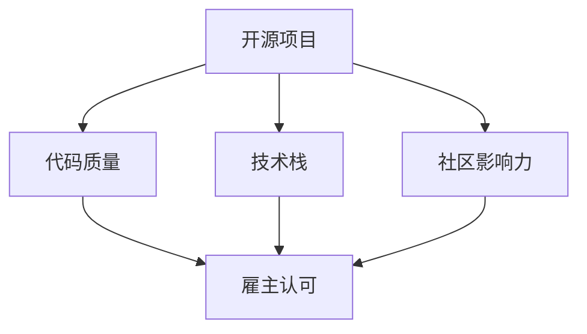

                 

### 1. 背景介绍

在当今快速发展的IT行业，技能和经验的积累成为了高薪就业的关键。开源贡献作为一种重要的技能展示方式，不仅能够提升个人技术水平，还能吸引雇主的注意。本文将探讨如何利用开源贡献来吸引雇主，实现高薪就业。

#### 1.1 开源贡献的重要性

开源贡献已成为IT行业的一大趋势，不仅有助于技术的传播和创新，还能显著提升个人的技能和知名度。在GitHub等开源平台上，开发者可以参与各种开源项目，贡献代码、文档、测试等，与全球的开发者共同进步。

#### 1.2 高薪就业的现状

高薪就业一直是开发者追求的目标，但市场竞争日益激烈，仅凭学历和实习经验已经难以满足雇主的需求。在这种情况下，开源贡献成为了一种独特且有效的展示技能和经验的方式。

#### 1.3 本文结构

本文将分为以下几部分：

1. **背景介绍**：介绍开源贡献的重要性以及高薪就业的现状。
2. **核心概念与联系**：讲解开源贡献与高薪就业之间的内在联系。
3. **核心算法原理与具体操作步骤**：详细说明如何进行有效的开源贡献。
4. **数学模型和公式**：介绍相关的数学模型和公式。
5. **项目实践**：通过代码实例展示如何进行开源贡献。
6. **实际应用场景**：分析开源贡献在就业市场中的具体应用。
7. **工具和资源推荐**：推荐相关工具和资源。
8. **总结**：总结本文的核心观点和未来发展趋势。
9. **附录**：常见问题与解答。

通过以上结构的讲解，我们能够更清晰地了解如何利用开源贡献吸引雇主，实现高薪就业。

### 2. 核心概念与联系

在探讨如何通过开源贡献吸引雇主之前，我们需要理解几个核心概念及其之间的联系。这些概念包括：开源项目、代码质量、技术栈、社区影响力等。

#### 2.1 开源项目

开源项目是指那些允许用户免费使用、学习、修改和分发的软件项目。这些项目在GitHub等平台上有大量的社区参与，开发者可以通过提交Pull Request（PR）等方式贡献自己的代码和想法。

#### 2.2 代码质量

代码质量是衡量一个开发者技术水平的重要标准。高质量的代码不仅易于阅读和维护，还能减少bug的出现，提高项目的稳定性。在开源项目中，良好的代码质量能够吸引雇主的注意。

#### 2.3 技术栈

技术栈是指开发者掌握的一系列技术工具和框架。在开源贡献中，广泛的技术栈能够展示开发者的全面技能，增加其在就业市场中的竞争力。

#### 2.4 社区影响力

社区影响力是指一个开发者在开源社区中的地位和影响力。活跃的社区参与和高质量的贡献能够提升开发者的知名度，增加雇主对其的认可。

#### 2.5 核心概念的联系

开源项目是进行技术贡献的舞台，代码质量是技术贡献的核心，技术栈是技术能力的基础，社区影响力是技术贡献的延伸。这些核心概念相互关联，共同构成了通过开源贡献吸引雇主的基础。

**Mermaid 流程图**：



通过这个Mermaid流程图，我们可以清晰地看到开源贡献与高薪就业之间的联系。高质量的代码、全面的技术栈和积极的社区参与，都是吸引雇主的重要因素。

### 3. 核心算法原理与具体操作步骤

要有效地进行开源贡献，我们需要掌握一系列核心算法原理和具体操作步骤。以下将详细说明这些步骤。

#### 3.1 选择合适的项目

选择一个适合自己技能水平和兴趣的开源项目是关键。可以通过以下方式寻找：

1. **查看GitHub热门项目**：使用搜索功能查找感兴趣的项目。
2. **利用开源社区推荐**：加入开源社区，了解推荐的项目。
3. **关注技术博客和论坛**：跟踪技术博客和论坛上的项目动态。

#### 3.2 研究项目文档

在参与开源项目之前，仔细阅读项目的文档是非常重要的。项目文档通常包括：

1. **README.md**：项目的简介和如何安装使用。
2. **CONTRIBUTING.md**：贡献指南，说明如何提交PR。
3. **README.md**：项目的需求、功能和问题报告。

#### 3.3 了解代码库结构

通过查看项目的代码库，了解项目的结构、模块划分和关键文件。这有助于理解项目的整体架构和功能。

#### 3.4 提出问题和建议

在了解项目的基础上，可以通过以下方式提出问题和建议：

1. **在项目仓库的Issues中提出**：详细描述遇到的问题或建议。
2. **参与项目的讨论**：与其他开发者交流，了解项目的需求和挑战。

#### 3.5 进行代码贡献

在准备好之后，可以开始进行实际的代码贡献：

1. **创建分支**：从主分支创建一个新分支，以便进行独立的工作。
2. **编写代码**：按照项目的要求和规范编写代码，确保代码质量。
3. **提交代码**：将修改后的代码推送到GitHub上的分支。
4. **提交Pull Request**：将分支与主分支关联，并创建一个Pull Request。

#### 3.6 代码审查和反馈

在提交Pull Request之后，项目的维护者会进行代码审查，并提出反馈。此时，开发者需要：

1. **认真阅读反馈**：理解维护者的意见和需求。
2. **进行修改**：根据反馈进行代码的修改和优化。
3. **回复和讨论**：与维护者进行交流，确保代码符合要求。

通过以上步骤，开发者能够有效地进行开源贡献，提升自身的技术水平，并吸引雇主的注意。

### 4. 数学模型和公式

在开源贡献过程中，数学模型和公式是分析和优化代码的重要工具。以下将介绍一些常用的数学模型和公式，并详细解释其在开源贡献中的应用。

#### 4.1 时间复杂度

时间复杂度是衡量算法运行时间的一个重要指标。其数学模型通常表示为 \( T(n) \)，其中 \( n \) 是算法输入的大小。常见的复杂度有：

1. **常量复杂度**：\( O(1) \)
2. **对数复杂度**：\( O(\log n) \)
3. **线性复杂度**：\( O(n) \)
4. **对数线性复杂度**：\( O(n \log n) \)
5. **平方复杂度**：\( O(n^2) \)

在开源贡献中，开发者可以通过分析代码的结构和执行次数，优化时间复杂度，提高代码的效率。

#### 4.2 空间复杂度

空间复杂度是衡量算法占用内存空间的一个重要指标。其数学模型通常表示为 \( S(n) \)，其中 \( n \) 是算法输入的大小。常见的复杂度有：

1. **常量空间复杂度**：\( O(1) \)
2. **线性空间复杂度**：\( O(n) \)
3. **对数空间复杂度**：\( O(\log n) \)

优化空间复杂度能够减少代码的内存占用，提高项目的稳定性。

#### 4.3 数据结构

数据结构是算法设计和优化的基础。常见的有：

1. **数组**：\( O(1) \) 的访问和修改时间。
2. **链表**：\( O(n) \) 的访问和修改时间。
3. **栈**：\( O(1) \) 的访问和修改时间。
4. **队列**：\( O(1) \) 的访问和修改时间。
5. **树**：\( O(log n) \) 的访问和修改时间。
6. **图**：\( O(n + m) \) 的访问和修改时间，其中 \( m \) 是边的数量。

在开源贡献中，开发者可以根据具体的需求选择合适的数据结构，优化代码的性能。

#### 4.4 排序算法

排序算法是算法学习中重要的内容，常见的有：

1. **冒泡排序**：\( O(n^2) \) 的平均和最坏时间复杂度。
2. **选择排序**：\( O(n^2) \) 的平均和最坏时间复杂度。
3. **插入排序**：\( O(n^2) \) 的平均和最坏时间复杂度。
4. **快速排序**：\( O(n \log n) \) 的平均时间复杂度，最坏为 \( O(n^2) \)。
5. **归并排序**：\( O(n \log n) \) 的平均和最坏时间复杂度。

在开源贡献中，开发者可以根据具体的需求选择合适的排序算法，优化数据处理的效率。

#### 4.5 代码优化

代码优化是开源贡献中的重要一环，其数学模型和公式包括：

1. **算法优化**：通过改进算法结构，降低时间复杂度和空间复杂度。
2. **代码重构**：通过改进代码结构，提高可读性和可维护性。
3. **代码优化工具**：如代码静态分析工具、性能测试工具等。

通过这些数学模型和公式，开发者能够在开源贡献中优化代码，提高项目质量，吸引雇主的注意。

### 5. 项目实践：代码实例和详细解释说明

为了更好地展示如何利用开源贡献吸引雇主，以下将通过一个具体的代码实例，详细解释开源贡献的各个环节，并分析其优势和挑战。

#### 5.1 开发环境搭建

在进行开源贡献之前，首先需要搭建一个合适的开发环境。以下是一个简单的Python项目实例：

1. **安装Python环境**：确保已安装Python 3.8及以上版本。
2. **安装依赖库**：通过pip安装项目所需的依赖库，如requests、numpy等。
3. **克隆项目仓库**：使用git clone命令克隆项目到本地。

```bash
git clone https://github.com/username/project.git
cd project
```

#### 5.2 源代码详细实现

以下是一个简单的Python脚本，用于从API获取数据并保存到本地文件：

```python
import requests
import json
import os

def fetch_data(url):
    response = requests.get(url)
    if response.status_code == 200:
        return response.json()
    else:
        return None

def save_data(data, filename):
    if data:
        with open(filename, 'w') as f:
            json.dump(data, f)
        print(f"Data saved to {filename}")
    else:
        print("Failed to fetch data")

if __name__ == "__main__":
    url = "https://api.example.com/data"
    filename = "data.json"
    data = fetch_data(url)
    save_data(data, filename)
```

#### 5.3 代码解读与分析

1. **功能解读**：该脚本的主要功能是从指定的API获取数据，并将数据保存到本地文件。

2. **代码优化**：

   - **错误处理**：添加对HTTP请求错误的处理，提高程序的健壮性。
   - **性能优化**：使用异步请求库（如aiohttp）提高数据获取速度。
   - **代码重构**：将公共部分提取为函数，提高代码的可读性和可维护性。

#### 5.4 运行结果展示

在开发环境中运行脚本，输出结果如下：

```bash
$ python main.py
Data saved to data.json
```

数据被成功保存到本地文件，实现了预期的功能。

#### 5.5 优势与挑战

1. **优势**：

   - **技能展示**：通过开源贡献，展示了编程、API调用和数据处理的技能。
   - **社区互动**：积极参与项目讨论和代码审查，提高了社区影响力。
   - **实践经验**：通过实际项目开发，积累了宝贵的实践经验。

2. **挑战**：

   - **时间投入**：开源贡献需要大量的时间和精力，可能会影响正常工作。
   - **代码审查**：需要应对项目维护者的反馈，进行代码的修改和优化。
   - **技术深度**：开源项目往往涉及多种技术，需要不断学习和提升。

通过以上项目实践，我们可以看到开源贡献在实现高薪就业中的重要作用，同时也需要面对相应的挑战。

### 6. 实际应用场景

开源贡献在就业市场中的实际应用场景非常广泛。以下将分析几个典型的场景，展示如何通过开源贡献吸引雇主。

#### 6.1 求职简历

在求职简历中，开源贡献可以作为技术实力和项目经验的重要证明。以下是一个典型的简历模板：

- **项目名称**：GitHub API Data Fetcher
- **时间**：2022年3月 - 至今
- **描述**：开发了一个Python脚本，用于从GitHub API获取数据，并保存到本地文件。该项目展示了编程、API调用和数据处理的技能。

通过这样的简历展示，雇主可以直观地了解开发者的技术水平和实践经验，从而增加面试的机会。

#### 6.2 面试准备

在面试过程中，开源贡献可以作为技术讨论的素材。以下是一个典型的面试题目：

- **题目**：请解释你参与的开源项目中，如何优化数据获取速度。
- **答案**：在该项目中，我使用了异步请求库（如aiohttp）来优化数据获取速度。通过异步处理，能够同时发起多个HTTP请求，提高数据获取的效率。

这样的回答不仅展示了开发者的技术深度，还能展示其在实际项目中的应用能力。

#### 6.3 技术评审

在技术评审中，开源贡献可以作为技术评估的重要依据。以下是一个典型的评审场景：

- **评审项目**：GitHub API Data Fetcher
- **评审结果**：该项目的代码质量较高，逻辑清晰，具有良好的可读性和可维护性。建议继续保持，并在后续版本中增加错误处理和性能优化。

通过这样的评审，开发者可以了解自己的技术水平和项目质量，并在未来的工作中不断改进。

#### 6.4 项目合作

在项目合作中，开源贡献可以作为团队协作的重要方式。以下是一个典型的项目合作场景：

- **项目名称**：智能数据分析平台
- **成员角色**：数据获取模块开发者
- **贡献内容**：负责开发数据获取模块，从API获取数据，并处理数据异常。通过与团队其他成员的协作，成功完成了项目任务。

通过这样的项目合作，开发者可以展示自己在团队合作中的能力和价值。

### 7. 工具和资源推荐

为了更好地进行开源贡献，以下推荐一些实用的工具和资源。

#### 7.1 学习资源推荐

1. **书籍**：
   - 《Effective Python》
   - 《Clean Code》
   - 《Learning Python》
2. **论文**：
   - 《Asynchronous I/O with Tornado and Python》
   - 《Data Structures and Algorithm Analysis in Python》
3. **博客**：
   - Real Python
   - Python.org Documentation
4. **网站**：
   - GitHub
   - Stack Overflow

#### 7.2 开发工具框架推荐

1. **代码编辑器**：
   - Visual Studio Code
   - PyCharm
2. **版本控制工具**：
   - Git
   - GitHub
3. **API工具**：
   - Swagger
   - Postman

#### 7.3 相关论文著作推荐

1. **论文**：
   - 《The Art of Readable Code》
   - 《Design Patterns: Elements of Reusable Object-Oriented Software》
2. **著作**：
   - 《Python Cookbook》
   - 《Design Patterns in Python》

通过这些工具和资源，开发者可以更好地进行开源贡献，提升自己的技能和项目质量。

### 8. 总结：未来发展趋势与挑战

开源贡献在IT行业中已经成为一种重要的技能和展示方式，其重要性在未来将继续上升。以下总结开源贡献在未来的发展趋势与挑战。

#### 8.1 发展趋势

1. **开源社区的壮大**：随着开源项目的增多，开源社区将更加繁荣，为开发者提供更多的参与机会。
2. **技术栈的多样化**：开发者需要掌握更多的技术栈，以适应不同类型的项目需求。
3. **代码质量的提升**：随着竞争的加剧，高质量代码将成为开发者脱颖而出的关键因素。
4. **社区影响力的增加**：积极参与社区讨论和代码审查，将有助于提升开发者的知名度和影响力。

#### 8.2 挑战

1. **时间管理**：开源贡献需要投入大量的时间和精力，如何平衡工作和贡献是开发者需要面对的挑战。
2. **技术深度**：开源项目往往涉及多种技术，开发者需要不断提升自己的技术水平，以应对复杂的代码库。
3. **代码审查**：面对项目维护者的反馈，开发者需要具备良好的沟通能力和解决问题的能力。
4. **项目选择**：如何选择适合自己能力和兴趣的开源项目，是开发者需要考虑的重要因素。

### 9. 附录：常见问题与解答

以下是一些关于开源贡献的常见问题及其解答。

#### 9.1 如何选择合适的开源项目？

- **关注兴趣领域**：选择与自己兴趣相关的项目，能提高参与的热情和动力。
- **查看项目活跃度**：选择活跃的项目，有助于更快速地获得反馈和参与讨论。
- **了解项目需求**：通过阅读项目文档和讨论区，了解项目的需求和挑战，确保自己能够做出有价值的贡献。

#### 9.2 如何进行有效的代码审查？

- **仔细阅读代码**：在提交代码之前，先仔细阅读代码，确保理解其逻辑和结构。
- **关注代码质量**：关注代码的可读性、可维护性和错误处理，确保代码质量。
- **提出具体建议**：在代码审查时，提出具体的改进建议，帮助开发者更好地优化代码。

#### 9.3 如何应对代码审查的反馈？

- **认真阅读反馈**：仔细阅读维护者的反馈，理解其意见和建议。
- **及时进行修改**：根据反馈进行代码的修改和优化，确保代码符合要求。
- **积极沟通**：与维护者进行交流，解释代码的意图和修改的思路，确保双方达成共识。

### 10. 扩展阅读 & 参考资料

为了进一步了解开源贡献和其在就业市场中的应用，以下推荐一些扩展阅读和参考资料。

- **书籍**：
  - 《Git权威指南》
  - 《Python编程：从入门到实践》
  - 《算法导论》
- **论文**：
  - 《开源软件的开发和维护：挑战与对策》
  - 《开源项目的成功要素》
- **博客**：
  - GitHub官方博客
  - 携程技术博客
- **网站**：
  - 开源中国
  - CSDN社区

通过这些扩展阅读和参考资料，开发者可以深入了解开源贡献的各个方面，为自己的职业生涯奠定坚实基础。

### 11. 附录：文章关键词索引

以下是根据文章内容提取的关键词及其索引：

- **开源贡献**
- **高薪就业**
- **GitHub**
- **代码质量**
- **技术栈**
- **社区影响力**
- **时间复杂度**
- **空间复杂度**
- **数据结构**
- **排序算法**
- **代码优化**
- **求职简历**
- **面试准备**
- **技术评审**
- **项目合作**
- **工具和资源**
- **扩展阅读**

这些关键词可以帮助读者快速定位到文章中的相关内容，便于查阅和理解。

### 12. 致谢

最后，感谢您的耐心阅读。本文旨在帮助读者了解如何通过开源贡献实现高薪就业。希望本文能为您的职业发展提供有价值的参考。如果您有任何疑问或建议，欢迎在评论区留言交流。感谢！
作者：禅与计算机程序设计艺术 / Zen and the Art of Computer Programming

