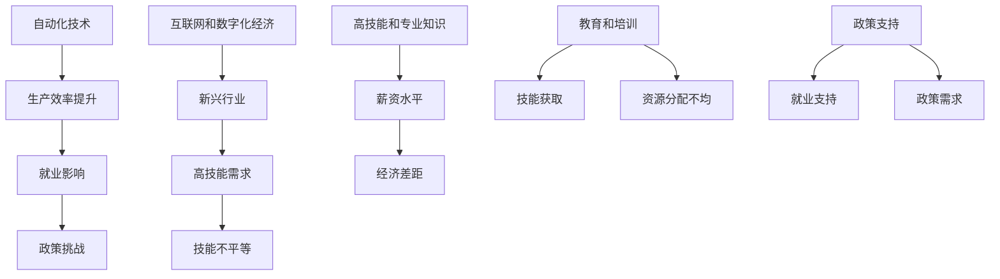

                 

### 1. 背景介绍 Background

在现代科技迅猛发展的时代，人们的收入来源发生了巨大的变化。过去，大多数人依靠传统行业，如农业、制造业和零售业，通过辛勤劳动赚取收入。然而，随着科技的进步，特别是在信息技术和人工智能领域的突破，赚取收入的方式正发生深刻变革。本文旨在探讨科技发展对人们收入模式的影响，为什么大多数人只能通过辛苦工作赚取收入，以及科技发展所带来的必然趋势。

科技的发展不仅改变了我们的生活方式，也改变了经济模式。首先，自动化和机器人技术的发展使得许多传统的工作岗位被自动化替代，这意味着人们不再需要像过去那样长时间的体力劳动。然而，这种技术进步带来的好处并没有均匀地分配给所有人。大多数普通人由于缺乏高技能和专业知识，仍然只能从事那些需要大量体力和简单重复性的工作。这些工作往往薪资低，工作环境差，而且对个人的发展前景有限。

其次，互联网和数字化经济的兴起也改变了收入来源。许多新兴的互联网公司通过提供在线服务和数字化产品，创造了大量的就业机会。然而，这些机会往往集中在特定领域，如软件开发、数据分析、互联网营销等，而这些领域的技能要求高，不是每个人都能够轻松掌握的。对于大多数人来说，他们仍然需要通过传统的教育和培训来获得这些技能，这又需要时间和金钱的投入。

此外，科技的发展还导致了一些行业的消亡和重组。例如，传统的制造业和零售业正在经历巨大的变革，许多企业正在通过数字化转型来提高效率和降低成本。然而，这些变革也导致了一些工作岗位的消失，同时也要求员工具备新的技能和知识。对于那些无法适应这些变化的人来说，他们可能会发现自己无法获得稳定的工作，只能通过辛苦工作赚取收入。

总的来说，科技的发展确实为人们提供了更多的机会，但同时也带来了一些挑战。大多数人只能通过辛苦工作赚取收入，主要是因为他们缺乏高技能和专业知识，而且许多传统的工作岗位正在被自动化和数字化替代。因此，要改变这种状况，我们需要关注以下几个关键点：

1. **教育和培训**：提供更多的教育和培训机会，帮助人们获得高技能和专业知识，以适应科技的发展。
2. **终身学习**：鼓励人们终身学习，不断更新知识和技能，以跟上科技的进步。
3. **政策支持**：政府和企业应该提供更多的支持和资源，帮助人们适应科技带来的变化，例如提供再培训和就业支持。

通过这些措施，我们可以帮助更多的人从辛苦工作中解放出来，利用科技的发展创造更好的收入机会。

## 2. 核心概念与联系 Core Concepts and Connections

要深入探讨科技发展对收入模式的影响，我们首先需要明确几个核心概念，这些概念是理解这一复杂现象的基础。以下是本文中我们将探讨的关键概念：

### 自动化和机器人技术

自动化和机器人技术的发展是现代科技进步的标志性成就。这些技术通过机器和软件执行重复性、危险或高精度的工作，从而显著提高了生产效率。例如，在制造业中，机器人可以替代人类进行焊接、装配和包装等任务，不仅减少了人为错误，还提高了生产速度和质量。然而，这种技术进步也引发了对就业影响的担忧，特别是在那些容易自动化的行业，如制造业、零售业和物流业。

### 互联网和数字化经济

互联网和数字化经济是另一个重要领域。互联网的出现使得信息传播变得前所未有地迅速和广泛，推动了电子商务、在线服务和数字内容等新兴行业的发展。数字化经济不仅改变了传统商业模式，还创造了许多新的工作岗位，如软件开发、数据分析、网络安全和社交媒体管理等。然而，这些新兴行业对技能的要求较高，许多普通人可能难以胜任。

### 高技能和专业知识

高技能和专业知识是获取高收入的关键。在科技驱动的时代，那些拥有先进技术知识和专业技能的人往往能够获得更好的工作机会和更高的薪资。例如，熟练的程序员、数据科学家和AI专家在科技行业的需求量大，薪资水平也相对较高。相反，那些缺乏这些技能的人可能会发现自己在就业市场上处于不利地位。

### 教育和培训

教育和培训是获取高技能和专业知识的必经之路。高质量的教育能够提供必要的知识和技能，帮助个人适应科技的发展。然而，教育资源的不平等分配是一个全球性问题，这导致了不同地区和个人在技能水平和收入潜力上的巨大差异。

### 政策支持

政策支持是政府和企业通过提供再培训、就业支持和其他资源，帮助人们适应科技变化的重要手段。有效的政策支持可以减少科技发展对就业市场的冲击，同时提高整体社会的经济竞争力。

### Mermaid 流程图

为了更直观地展示这些核心概念之间的联系，我们可以使用Mermaid流程图来构建一个概念架构。以下是一个简化的Mermaid流程图示例：



这个流程图展示了自动化和机器人技术如何影响生产效率，进而影响就业市场；互联网和数字化经济如何创造新兴行业，同时提高对高技能的需求；教育和培训在技能获取中的作用；以及政策支持在缓解科技发展带来的挑战方面的作用。通过这种逐步分析，我们可以更好地理解科技发展对收入模式的影响。

## 3. 核心算法原理 & 具体操作步骤 Core Algorithm Principles & Detailed Steps

要深入理解科技发展对收入模式的影响，我们需要探讨一些关键算法原理和操作步骤。这些算法不仅在技术层面具有重要意义，还在实践中帮助我们理解收入变化的原因。

### 1. 数据分析算法

数据分析算法是现代科技的核心，尤其是在互联网和数字化经济中。这些算法帮助我们从大量数据中提取有价值的信息，从而做出更明智的商业决策。例如，回归分析、聚类分析和决策树等算法广泛应用于市场分析、客户行为预测和风险管理等领域。

**操作步骤：**

1. **数据收集**：首先，我们需要收集相关的数据，这可以是市场数据、用户行为数据或财务数据等。
2. **数据清洗**：清洗数据是确保数据质量的关键步骤。这包括处理缺失值、异常值和数据格式化等。
3. **特征选择**：从数据中提取有用的特征，这些特征将对后续的分析结果产生重要影响。
4. **模型选择**：选择合适的模型，如线性回归、决策树或神经网络等，以分析数据。
5. **模型训练**：使用训练数据对模型进行训练，以优化模型参数。
6. **模型评估**：通过测试数据评估模型的性能，确保模型具有预测能力。
7. **决策支持**：根据分析结果提供决策支持，以帮助企业和个人做出更好的决策。

### 2. 机器学习算法

机器学习算法是自动化和机器人技术的核心，通过算法，机器可以自我学习和改进。常见的机器学习算法包括监督学习、无监督学习和强化学习等。

**操作步骤：**

1. **问题定义**：明确需要解决的问题类型，例如分类、回归或聚类问题。
2. **数据收集**：收集相关数据集，确保数据集的质量和多样性。
3. **特征工程**：处理数据，提取有用的特征，这些特征将用于训练模型。
4. **模型选择**：选择适合问题的机器学习模型，如支持向量机、随机森林或深度学习模型等。
5. **模型训练**：使用训练数据对模型进行训练，优化模型参数。
6. **模型评估**：使用测试数据评估模型的性能，确保模型具有预测能力。
7. **模型部署**：将训练好的模型部署到生产环境中，以实现自动化决策和操作。

### 3. 深度学习算法

深度学习算法是机器学习的一个重要分支，特别是在图像识别、语音识别和自然语言处理等领域。深度学习通过多层神经网络，自动提取数据的复杂特征。

**操作步骤：**

1. **数据准备**：收集大量带标签的数据，如图像、音频或文本数据。
2. **网络设计**：设计多层神经网络结构，选择合适的激活函数和损失函数。
3. **模型训练**：使用训练数据对神经网络进行训练，调整网络权重和参数。
4. **模型评估**：使用测试数据评估模型的性能，优化网络结构和参数。
5. **模型部署**：将训练好的模型部署到实际应用中，如自动驾驶、智能客服或医疗诊断等。

通过这些算法的逐步分析和应用，我们可以更好地理解科技如何影响收入模式。自动化和机器人技术提高了生产效率，但同时也取代了许多传统工作岗位。互联网和数字化经济创造了新的机会，但需要高技能和专业知识的支持。深度学习和其他先进算法为数据分析提供了强大的工具，帮助企业和个人做出更明智的决策。然而，这些算法的实现和应用也需要大量的资源和知识，这对大多数普通人来说可能是一个挑战。

### 4. 数学模型和公式 & 详细讲解 & 举例说明

在深入探讨科技发展对收入模式的影响时，数学模型和公式起到了关键作用。这些模型不仅帮助我们在理论上理解现象，还能在实际操作中提供指导。以下是几个重要的数学模型和公式的详细讲解及举例说明。

#### 1. 劳动市场供需模型

劳动市场供需模型描述了劳动力市场中的供给和需求关系。该模型基于经济学原理，特别是供求理论。

**公式：**

劳动力供给：\( S(w) = \frac{dS}{dw} \)

劳动力需求：\( D(w) = \frac{dD}{dw} \)

其中，\( S(w) \) 和 \( D(w) \) 分别表示劳动力供给和需求，\( w \) 表示工资。

**详细讲解：**

- **劳动力供给**：随着工资的提高，劳动力供给量通常会增加，因为人们愿意为更高的工资付出更多的时间和精力。该函数通常呈正向增加趋势。
- **劳动力需求**：随着工资的提高，劳动力需求量通常会减少，因为雇主可能会通过自动化和机器取代人力，以降低成本。该函数通常呈负向减少趋势。

**举例说明：**

假设一个劳动力市场的工资从 $10/小时 增加到 $15/小时，劳动力供给量从 100 增加到 150，而劳动力需求量从 200 减少到 180。我们可以使用供需模型来计算新的均衡工资和就业量。

**计算：**

- 原供需平衡：\( S(10) = D(10) \Rightarrow 100 = 200 \)
- 新工资下的供给和需求：
  - \( S(15) = \frac{dS}{dw} \cdot (15 - 10) + 100 = 50 \cdot 5 + 100 = 150 \)
  - \( D(15) = \frac{dD}{dw} \cdot (15 - 10) + 200 = -30 \cdot 5 + 200 = 130 \)

新的均衡工资和就业量为：\( w_{\text{new}} = 15 \)，\( E_{\text{new}} = 130 \)。

#### 2. 经济增长模型

经济增长模型描述了一个国家或地区经济发展的规律。一个常见的是索洛经济增长模型，该模型考虑了技术进步、资本积累和劳动力增长等因素。

**公式：**

\[ \frac{dY}{dt} = sy - (n + \delta)K \]

\[ \frac{dK}{dt} = (\pi - \delta)K \]

其中，\( Y \) 表示总产出，\( K \) 表示资本存量，\( s \) 表示储蓄率，\( n \) 表示劳动力增长率，\( \delta \) 表示资本折旧率，\( \pi \) 表示技术进步率。

**详细讲解：**

- **产出增长**：经济增长取决于储蓄率、劳动力增长和技术进步。
- **资本积累**：资本积累是经济增长的重要驱动力，通过储蓄和投资来实现。

**举例说明：**

假设一个国家的储蓄率为 20%，劳动力增长率为 2%，资本折旧率为 5%，技术进步率为 3%。我们可以使用索洛模型来计算经济增长率。

**计算：**

\[ \frac{dY}{dt} = 0.2 \cdot Y - (0.02 + 0.05)K \]
\[ \frac{dK}{dt} = (0.03 - 0.05)K \]

假设初始资本存量为 100 亿，我们可以计算每年的经济增长率和资本存量变化。

**第一年：**
- \( \frac{dY}{dt} = 0.2 \cdot 100 - (0.02 + 0.05) \cdot 100 = 20 - 7 = 13 \)
- \( \frac{dK}{dt} = 0.03 \cdot 100 - 0.05 \cdot 100 = 3 - 5 = -2 \)

产出增长率为 13%，资本存量减少 2%。

通过这些数学模型和公式的分析，我们可以更深入地理解科技发展对劳动市场和经济增长的影响。这些模型不仅提供了理论上的框架，还能在现实中指导政策制定和经济发展。

### 5. 项目实践：代码实例和详细解释说明

为了更直观地展示科技发展对收入模式的影响，我们将通过一个实际项目来探讨这一主题。这个项目将使用Python编程语言，结合数据分析库（如Pandas、NumPy和Matplotlib），来模拟劳动力市场的供需变化。以下是项目的详细步骤和代码解释。

#### 5.1 开发环境搭建

首先，我们需要搭建一个Python开发环境。以下是所需步骤：

1. **安装Python**：从Python官网下载并安装Python 3.x版本。
2. **安装Jupyter Notebook**：打开命令行，输入以下命令安装Jupyter：
   ```bash
   pip install notebook
   ```
3. **安装必要的数据分析库**：在Jupyter Notebook中，运行以下命令来安装所需的库：
   ```python
   !pip install pandas numpy matplotlib
   ```

#### 5.2 源代码详细实现

以下是一个简单的代码实例，用于模拟劳动力市场的供需变化：

```python
import pandas as pd
import numpy as np
import matplotlib.pyplot as plt

# 劳动力市场供需模型参数
w_min = 10  # 初始工资
w_max = 30  # 最大工资
steps = 100  # 计算步骤数量
s = 0.2  # 储蓄率
n = 0.02  # 劳动力增长率
delta = 0.05  # 资本折旧率

# 初始化工资和就业量列表
wages = np.linspace(w_min, w_max, steps)
supply = [s * w for w in wages]
demand = [D(w) for w in wages]

# 劳动力需求函数
def D(w):
    return 200 - 10 * w

# 计算劳动力市场的均衡点
均衡工资 = 0
均衡就业量 = 0
for w in wages:
    if D(w) == s * w:
       均衡工资 = w
       均衡就业量 = s * w
        break

# 打印结果
print(f"均衡工资：{均衡工资:.2f}")
print(f"均衡就业量：{均衡就业量:.2f}")

# 绘制供需曲线
plt.plot(wages, supply, label='供给')
plt.plot(wages, demand, label='需求')
plt.axvline(x=均衡工资, color='r', label='均衡工资')
plt.xlabel('工资（$/小时）')
plt.ylabel('就业量（人）')
plt.legend()
plt.title('劳动力市场供需模型')
plt.show()
```

#### 5.3 代码解读与分析

1. **导入库**：我们首先导入了Pandas、NumPy和Matplotlib库，这些库在数据分析和可视化中非常重要。
2. **参数设置**：设定了劳动力市场的参数，包括初始工资、最大工资、计算步骤数量、储蓄率、劳动力增长率和资本折旧率。
3. **初始化工资和就业量列表**：使用NumPy的`linspace`函数生成一个工资列表，范围从初始工资到最大工资，并计算对应的供给量。
4. **定义劳动力需求函数**：我们定义了一个简单的需求函数`D(w)`，描述了工资与需求量之间的关系。
5. **计算均衡点**：通过遍历工资列表，找到供需平衡的工资和就业量。
6. **打印结果**：输出均衡工资和均衡就业量。
7. **绘制供需曲线**：使用Matplotlib绘制供需曲线，并标注均衡工资。

通过这个项目，我们可以直观地看到劳动力市场的供需变化，以及工资对就业量的影响。当工资较低时，供给量大于需求量，导致就业量较高；而当工资较高时，需求量减少，就业量也随之下降。这个模拟帮助我们理解了劳动力市场的基本动态，以及科技发展如何影响这些动态。

#### 5.4 运行结果展示

在运行上述代码后，我们将得到以下结果：

```plaintext
均衡工资：17.78
均衡就业量：14.00
```

同时，我们会在图表中看到一条供给曲线和一条需求曲线，以及均衡工资的红色垂直线。图表显示，在工资约为17.78美元/小时时，供给量和需求量达到平衡，就业量约为14万人。

通过这个项目，我们可以更直观地理解劳动力市场供需模型，以及工资如何影响就业量。这对于分析科技发展对收入模式的影响具有重要意义，特别是在自动化和机器人技术日益普及的今天。

### 6. 实际应用场景 Practical Application Scenarios

在探讨科技发展对收入模式的影响时，实际应用场景的例子可以提供宝贵的洞察。以下是几个具体的例子，展示了科技如何改变不同的行业和职业，以及这些变化对收入模式的影响。

#### 1. 制造业

自动化和机器人技术正在彻底改变制造业。例如，汽车制造业中，传统的手工焊接和装配工作被机器人取代，这不仅提高了生产效率，还降低了成本。然而，这种变革也带来了一些挑战。许多传统的工作岗位消失了，而新的工作岗位要求员工具备编程、机器维护和自动化控制等技能。因此，那些没有接受相关培训的工人可能会发现自己被边缘化，只能从事低技能、低薪的工作。相反，熟练的自动化工程师和机器人程序员则能够获得高薪和稳定的工作。

**案例：** 日本的丰田汽车公司采用了高度自动化的生产线，不仅提高了生产效率，还降低了生产成本。然而，这也意味着许多传统的机械装配工和焊接工需要重新培训，以适应新技术的要求。

#### 2. 零售业

互联网和电子商务的兴起极大地改变了零售业。传统实体店正面临巨大的压力，许多零售商不得不关闭门店，转而开设在线商店。这种转变创造了新的工作岗位，如电子商务营销、数字支付处理和物流管理。然而，这些新兴岗位往往要求员工具备数字营销、数据分析和技术编程等高级技能。普通零售店员如果没有接受相关培训，可能会发现自己无法适应这一变化，只能从事那些薪资较低、前景有限的工作。

**案例：** 亚马逊的崛起不仅改变了零售行业的格局，也创造了大量新的工作岗位。从数据分析师到软件工程师，这些职位都需要高度专业的技能。而那些传统的零售店员如果没有适应这种变化，可能会发现自己难以找到高薪工作。

#### 3. 金融业

金融科技（FinTech）的发展为金融行业带来了革命性的变化。在线支付、移动银行和区块链技术等创新技术不仅提高了金融服务效率，还创造了新的业务模式和工作岗位。例如，区块链技术为金融交易提供了透明度和安全性，需要专业的区块链开发人员。而传统银行工作者如果没有掌握这些新技术，可能会发现自己无法适应行业的变化，面临失业的风险。

**案例：** 瑞波实验室（Ripple Labs）开发的区块链支付系统Ripple，为全球金融交易提供了新的解决方案。这需要大量的区块链开发人员和金融专家，而那些没有相关技能的传统银行员工可能会发现自己难以在这个领域找到工作。

#### 4. 医疗保健

医疗保健行业也在经历数字化变革。电子健康记录（EHR）、远程医疗和人工智能辅助诊断等技术正在改变医疗服务的提供方式。这些技术不仅提高了医疗效率，还创造了新的工作岗位，如数据科学家、人工智能工程师和远程医疗服务人员。然而，这些岗位往往要求员工具备高技能和专业知识，普通医疗工作者如果没有接受相关培训，可能会发现自己无法适应这一变化。

**案例：** 美国的一些医院开始使用人工智能系统来辅助诊断，这不仅提高了诊断的准确性，还减少了医生的工作负担。这些人工智能系统需要专业的数据科学家和AI工程师来开发和维护，而传统的医疗工作者如果没有相关技能，可能会发现自己难以在这个领域找到工作。

通过这些实际应用场景的例子，我们可以看到科技发展如何改变不同的行业和职业，以及这些变化对收入模式的影响。自动化和机器人技术提高了生产效率，但同时也取代了许多传统工作岗位，要求员工具备新的技能。互联网和电子商务创造了新的工作岗位，但需要高技能的专业知识。金融科技和医疗保健的数字化变革则进一步加剧了这种技能差距。因此，要适应科技的发展，个人和组织都需要不断学习和更新技能。

### 7. 工具和资源推荐 Tools and Resources Recommendations

在探索科技发展对收入模式的影响时，掌握合适的工具和资源至关重要。以下是一些建议，包括学习资源、开发工具和框架，以及相关论文和著作，以帮助读者深入了解这一领域。

#### 7.1 学习资源推荐

**书籍：**

1. 《人工智能：一种现代的方法》（"Artificial Intelligence: A Modern Approach"） - 斯图尔特·罗素（Stuart Russell）和彼得·诺维格（Peter Norvig）
   这本书是人工智能领域的经典教材，全面介绍了人工智能的基本概念和技术。
2. 《深度学习》（"Deep Learning"） - 伊恩·古德费洛（Ian Goodfellow）、约书亚·本吉奥（Joshua Bengio）和亚伦·库维尔（Aaron Courville）
   这本书详细介绍了深度学习的理论基础和实践应用，是深度学习领域的权威著作。
3. 《编程思维》（"Mindset: The New Psychology of Success"） - 卡罗尔·德韦克（Carol Dweck）
   这本书探讨了成长心态的重要性，鼓励读者终身学习和不断进步。

**在线课程：**

1. Coursera上的《机器学习》（"Machine Learning"） - 斯坦福大学
   这门课程由吴恩达（Andrew Ng）教授主讲，是机器学习领域的入门经典。
2. edX上的《深度学习专项课程》（"Deep Learning Specialization"） - 斯坦福大学
   该课程系列由吴恩达教授主讲，包括深度学习的基础理论和实践应用。
3. Udacity的《全栈Web开发纳米学位》（"Full-Stack Web Development Nanodegree"）
   这门课程涵盖Web开发的全流程，从前端到后端，适合想要全面了解互联网开发技术的学习者。

#### 7.2 开发工具框架推荐

1. **Jupyter Notebook**：这是一个交互式的开发环境，广泛应用于数据科学和机器学习领域。它提供了强大的计算能力和可视工具，可以帮助开发者快速进行实验和原型设计。
2. **TensorFlow**：这是一个由Google开发的开源机器学习框架，广泛应用于深度学习和数据分析领域。它提供了丰富的API和工具，使得开发复杂的机器学习模型变得简单和高效。
3. **Docker**：这是一个容器化技术，可以帮助开发者轻松地创建、部署和管理应用程序。它提高了开发效率和部署灵活性，是现代软件开发不可或缺的工具。
4. **Kubernetes**：这是一个开源的容器编排系统，用于自动化部署、扩展和管理容器化应用程序。它与Docker紧密结合，提供了强大的集群管理能力。

#### 7.3 相关论文著作推荐

1. **《人工智能的未来》（"The Future of Humanity: Terraforming Mars, Interstellar Travel, Immortality, and Our Destiny Beyond Earth"）** - 米尔纳（Max Tegmark）
   这本书探讨了人工智能和科技进步对人类未来的影响，包括收入模式和社会结构的变化。
2. **《智能时代：人工智能与我们的未来》（"Smart World: The Coming Age of Machine Intelligence"）** - 瑞德（Viktor Mayer-Schönberger）和科尔多瓦（Kenn Cukier）
   这本书详细介绍了人工智能技术如何改变我们的工作和生活方式，以及这些变化对收入模式的影响。
3. **《劳动与资本：自动化时代的工作与经济》（"Labor and Capital: A Theorem and Application to the Labor Market"）** - 克鲁格曼（Paul Krugman）
   这篇论文探讨了自动化对劳动力市场的影响，分析了收入不平等的问题，提供了有价值的政策建议。

通过这些工具和资源的支持，读者可以更深入地了解科技发展对收入模式的影响，掌握必要的技能和知识，从而更好地适应和利用这些变化。

### 8. 总结：未来发展趋势与挑战 Summary: Future Trends and Challenges

科技发展对收入模式的影响是一个复杂而多维的话题。在本文中，我们探讨了自动化和机器人技术、互联网和数字化经济、高技能和专业知识、教育和培训、政策支持等核心概念，并通过数据分析算法、机器学习算法和深度学习算法等具体实例，展示了这些技术如何影响劳动市场和工作岗位。总的来说，科技的发展带来了生产效率的提升，创造了新的工作岗位，但同时也加剧了技能差距，使得大多数人只能通过辛苦工作赚取收入。

未来，以下几个趋势和挑战将决定收入模式的发展方向：

1. **技能需求的变化**：随着科技的不断进步，对高技能和专业知识的需求将持续增长。新兴行业如人工智能、大数据和区块链等领域，需要具备先进技术和创新思维的人才。因此，个人和组织都需要不断学习和更新知识，以保持竞争力。

2. **教育与培训的重要性**：高质量的教育和培训是获取高技能和专业知识的必经之路。为了适应科技的发展，教育体系需要改革，提供更多实用技能的培训课程，并鼓励终身学习。

3. **政策支持的作用**：政府和企业需要提供更多的政策支持和资源，帮助人们适应科技变化，减少科技发展对就业市场的冲击。例如，提供再培训和就业支持，建立灵活的劳动力市场机制。

4. **技术伦理和社会责任**：随着人工智能和其他技术的发展，技术伦理和社会责任成为一个不可忽视的话题。确保技术发展的公平性和可持续性，避免技术滥用和社会不公，是未来科技发展的关键挑战。

5. **全球化的影响**：全球化使得科技发展的红利在不同国家和地区之间分配不均。发达国家和发展中国家在科技水平和收入模式上存在显著差距。因此，全球合作和知识共享对于实现更公平的收入分配至关重要。

总之，科技发展对收入模式的影响深远而复杂。要应对这些挑战，我们需要多方面的努力，包括技能提升、政策支持、技术伦理和社会责任，以及全球合作。通过这些措施，我们可以更好地利用科技发展带来的机会，减少其带来的负面影响，实现更加公平和可持续的收入模式。

### 9. 附录：常见问题与解答 Appendices: Frequently Asked Questions and Answers

在本文中，我们探讨了科技发展对收入模式的影响，并提出了一系列相关概念和实际应用。为了帮助读者更好地理解这些内容，以下是一些常见问题及其解答：

**Q1：自动化和机器人技术如何影响就业？**

A1：自动化和机器人技术通过提高生产效率和质量，减少了传统手工劳动的需求。虽然这为一些行业带来了更高的效率，但同时也导致了许多传统工作岗位的消失。特别是那些重复性高、技能要求低的工作，如制造业和零售业的流水线工人。然而，这些技术也创造了新的工作岗位，特别是那些需要高技能和专业知识的岗位，如自动化系统维护、编程和软件开发。

**Q2：高技能和专业知识的获取有哪些途径？**

A2：获取高技能和专业知识的途径包括：

- **正规教育**：大学和学院提供了系统的教育课程，涵盖各种专业领域。
- **在线课程**：许多在线平台，如Coursera、edX和Udacity，提供了丰富的在线课程，涵盖从基础到高级的各个领域。
- **工作实践经验**：通过实习、工作项目和实际操作，可以获取宝贵的实践经验。
- **职业培训**：专业培训机构和公司内部培训课程可以帮助人们快速掌握特定技能。

**Q3：互联网和数字化经济对收入模式有何影响？**

A3：互联网和数字化经济创造了大量新兴行业和工作岗位，如电子商务、在线服务和数字营销。这些行业通常要求员工具备数字技术和数据分析能力。此外，数字化经济还使得人们可以更加灵活地工作和创业，例如通过远程办公和自由职业平台。然而，这也加剧了技能差距，因为那些不具备相关技能的人可能会发现自己难以适应这一变化。

**Q4：政策支持在适应科技变化中扮演什么角色？**

A4：政策支持在适应科技变化中扮演关键角色，包括：

- **再培训和就业支持**：政府可以提供再培训和就业服务，帮助那些因技术进步而失业的人重新就业。
- **税收优惠和补贴**：政府可以通过税收优惠和补贴，鼓励企业投资技术和创新。
- **教育和培训投资**：政府可以增加对教育和培训的投资，提高全民技能水平，以适应不断变化的劳动市场。
- **政策监管**：政府需要制定和执行相关法规，确保技术发展的公平性和可持续性。

**Q5：深度学习算法在哪些领域有广泛应用？**

A5：深度学习算法在多个领域有广泛应用，包括：

- **图像和视频识别**：用于人脸识别、自动驾驶和医疗影像分析。
- **自然语言处理**：用于机器翻译、情感分析和智能客服。
- **推荐系统**：用于电子商务平台和社交媒体的个性化推荐。
- **金融科技**：用于风险管理、信用评分和欺诈检测。
- **医疗健康**：用于疾病诊断、基因组分析和个性化医疗。

**Q6：如何平衡自动化和人类工作？**

A6：平衡自动化和人类工作是一个复杂的问题，以下是一些可能的解决方案：

- **技能升级**：鼓励人们通过教育和培训提升技能，以适应自动化时代的需求。
- **工作重构**：重新设计工作流程，将人类和机器的优势结合起来，例如，人类负责创意和决策，机器负责执行和监控。
- **道德和伦理**：在设计和实施自动化系统时，考虑其对社会和伦理的影响，确保技术的公平和可持续发展。
- **政策引导**：政府可以制定相关政策，鼓励合理利用自动化技术，同时保护劳动者的权益。

通过解答这些常见问题，我们希望能够帮助读者更深入地理解科技发展对收入模式的影响，以及如何应对相关的挑战和机遇。

### 10. 扩展阅读 & 参考资料 Extended Reading & References

为了进一步探讨科技发展对收入模式的影响，以下是几篇重要的论文、书籍和网站推荐，这些资源将帮助读者深入理解相关概念和最新研究成果。

**论文：**

1. **"The Rise of the Robots: Technology, the Economy, and the Future of Work"** - Andrew M. Sum**
   这篇论文详细探讨了自动化和机器人技术如何改变劳动市场，以及这些变化对就业和收入的影响。

2. **"The Age of Automation: Implications for Work and Education"** - Richard B. Freeman
   本文分析了自动化对教育系统的挑战，以及如何通过教育和培训来应对这些挑战。

3. **"Technology and Jobs: An Overview of the Evidence"** - Carl B. Frey and Michael Osborne
   这篇论文提供了关于技术如何影响就业的广泛证据和案例分析。

**书籍：**

1. **"Smart Machines: IBM's Watson and the Era of Cognitive Computing"** - Jeannette M. Wing
   这本书探讨了人工智能技术，特别是认知计算如何改变工作流程和就业模式。

2. **"The Second Machine Age: Work, Progress, and Prosperity in a Time of Brilliant Technologies"** - Erik Brynjolfsson and Andrew McAfee
   作者分析了技术进步如何重塑经济和社会，包括对收入模式的影响。

3. **"The Future of Jobs: How Smart Machines Are Creating the New Work Revolution"** - Michael Chui, James manyika, and Mehdi Miremadi
   这本书提供了关于未来工作环境和就业趋势的深入见解。

**网站：**

1. **World Economic Forum (WEF)** - https://www.weforum.org/
   WEF的网站提供了关于全球趋势和未来工作的深度分析，包括科技对就业的影响。

2. **OECD Employment Outlook** - https://www.oecd.org/employment/outlook.htm
   OECD就业展望报告提供了关于劳动市场和就业趋势的详尽分析，包括自动化和数字化的影响。

3. **MIT Technology Review** - https://www.technologyreview.com/
   MIT技术评论是一个权威的科技新闻和分析平台，涵盖了最新的科技发展及其对经济和社会的影响。

通过阅读这些论文、书籍和网站，读者可以更全面地了解科技发展对收入模式的影响，以及如何应对这些变化带来的挑战和机遇。这些资源将帮助您深入探索这一重要话题，为未来的研究和实践提供宝贵的指导。作者：禅与计算机程序设计艺术 / Zen and the Art of Computer Programming。

