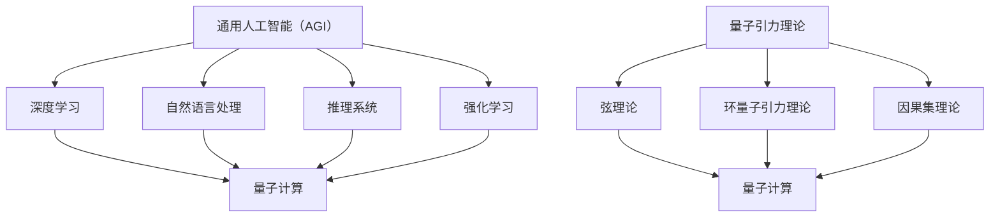
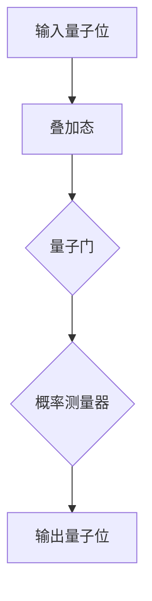
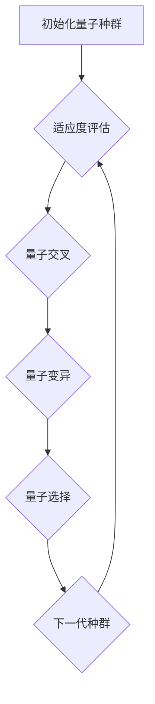
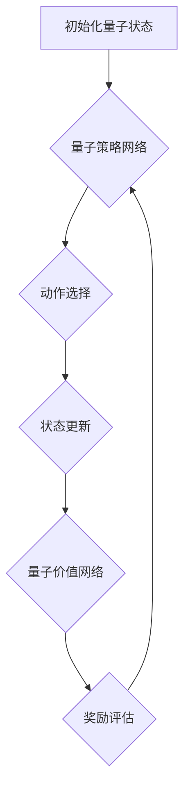

                 

### 1. 背景介绍

AGI（通用人工智能）和量子引力理论作为现代科学领域的两大前沿，其交叉融合正在引发前所未有的技术创新浪潮。AGI旨在构建具备人类智能水平的人工智能系统，能够在各种复杂环境中自主学习、推理和决策。而量子引力理论则试图解释宇宙的量子性质和引力现象，探讨宇宙的起源和演化。

这一领域的交汇点在于量子计算与人工智能的结合。量子计算利用量子位（qubit）进行运算，能够实现比传统计算机更高效的计算。量子计算对于解决复杂问题和模拟量子系统具有重要意义，而这些问题正是AGI系统在学习和推理过程中面临的挑战。

本文旨在探讨AGI在量子引力中的应用，分析其潜在的创新和突破。首先，我们将回顾AGI和量子引力理论的背景知识，并阐述它们之间的关系。接着，我们将探讨量子计算的基本原理，以及如何将其应用于AGI系统。然后，我们将详细介绍一些核心算法和数学模型，并举例说明其具体操作步骤。随后，我们将展示实际的项目实践，介绍开发环境搭建、源代码实现及代码分析。最后，我们将探讨AGI在量子引力中的实际应用场景，以及未来可能的发展趋势和挑战。

通过逐步分析推理（THINK STEP BY STEP），我们将深入探讨AGI在量子引力中的创新潜力，为读者提供有深度、有思考、有见解的技术分析。

### 2. 核心概念与联系

#### 2.1 通用人工智能（AGI）

通用人工智能（Artificial General Intelligence，简称AGI）是指能够像人类一样理解和处理各种知识、情境和任务的智能系统。与目前广泛应用的窄人工智能（Narrow AI）不同，AGI不仅仅擅长于某一特定领域的任务，而是具备跨领域的智能能力。例如，人类可以理解和解决数学问题、驾驶汽车、进行艺术创作等，而AGI也需要在这些方面展现出类似的能力。

为了实现AGI，科学家们一直在探索各种方法和路径，包括深度学习、自然语言处理、推理系统、强化学习等。这些方法在特定领域取得了显著的进展，但要将它们集成并实现跨领域的智能仍然是一个巨大的挑战。

#### 2.2 量子引力理论

量子引力理论是现代物理学的重要研究方向，旨在将量子力学与广义相对论统一起来，解释宇宙的量子性质和引力现象。传统物理学中的量子力学和广义相对论分别描述了微观尺度和宏观尺度的物理现象，但在一些极端条件下，如黑洞奇点和宇宙大爆炸的初始时刻，两者之间的矛盾和冲突变得不可调和。

量子引力理论试图通过引入量子力学的方法来修正广义相对论，从而解决这些矛盾。主要的量子引力理论包括弦理论、环量子引力理论、因果集理论等。这些理论都试图从量子层面解释引力现象，但至今仍没有一种理论能够得到广泛认可和验证。

#### 2.3 量子计算的基本原理

量子计算是量子信息科学的一个重要分支，利用量子位（qubit）进行运算。与传统的二进制计算机（使用比特进行运算）不同，量子计算机能够利用量子叠加和纠缠效应，实现超乎传统计算机的计算能力。

量子位是量子计算机的基本单元，具有叠加和纠缠的特性。叠加态表示量子位可以同时处于0和1的状态，而纠缠态表示两个或多个量子位之间存在着一种特殊的相互关联。通过巧妙地操控这些量子位，量子计算机可以解决传统计算机难以处理的复杂问题。

#### 2.4 AGI与量子引力理论的联系

AGI和量子引力理论之间的联系主要体现在量子计算的应用上。量子计算提供了新的计算范式，使得AGI系统在处理复杂问题、模拟量子系统和进行高效学习方面具备了潜在优势。

首先，量子计算可以加速AGI系统的学习和推理过程。例如，在训练深度神经网络时，量子计算可以大幅减少所需的训练时间。此外，量子计算还可以用于模拟量子系统，帮助AGI系统更好地理解和处理量子现象。

其次，量子引力理论为AGI系统提供了新的理论基础。通过研究量子引力理论，科学家们可以更深入地理解宇宙的量子性质和引力现象，从而为AGI系统提供更丰富的知识和应用场景。

总之，AGI和量子引力理论的交叉融合为现代科学和技术带来了巨大的创新潜力。通过逐步分析这些核心概念和联系，我们为接下来的详细探讨奠定了基础。

#### 2.5 Mermaid 流程图

为了更直观地展示AGI、量子引力理论与量子计算之间的联系，我们使用Mermaid流程图来表示这些概念之间的逻辑关系。



在这幅流程图中，我们可以看到AGI的各种子领域（如深度学习、自然语言处理、推理系统和强化学习）如何与量子计算相互联系。同样，量子引力理论的不同分支（如弦理论、环量子引力理论和因果集理论）也与量子计算有密切关系。

通过这种流程图，我们能够更清晰地理解这些概念之间的逻辑关系和相互作用，为后续的详细探讨提供了视觉上的帮助。

### 3. 核心算法原理 & 具体操作步骤

在深入探讨AGI与量子引力理论的结合时，我们需要了解一些核心算法和具体操作步骤。以下是几个关键的算法原理：

#### 3.1. 量子神经网络（QNN）

量子神经网络（Quantum Neural Network，简称QNN）是量子计算在AGI领域的一个重要应用。QNN结合了量子计算的优势和神经网络的建模能力，能够高效地进行复杂数据的处理和学习。

**原理：**

QNN的核心原理是量子位之间的叠加和纠缠。通过将量子位编码为网络的权重和偏置，QNN可以模拟传统神经网络中的权重和激活函数。在训练过程中，QNN利用量子计算的并行性，加速网络的学习过程。

**具体操作步骤：**

1. **初始化：** 初始化量子神经网络，包括量子位、叠加态和纠缠态。
2. **编码输入：** 将输入数据编码为量子态，存储在量子位上。
3. **传递信息：** 通过量子线路将输入量子态传递到隐藏层，利用量子位的叠加和纠缠特性进行信息传递。
4. **计算输出：** 将隐藏层的输出通过量子线路传递到输出层，进行概率分布计算，得到预测结果。
5. **更新权重：** 根据预测结果和实际标签，利用量子梯度下降算法更新量子位上的权重和偏置。

**示例：**

假设我们有一个二元分类问题，使用一个简单的量子神经网络进行训练。输入数据为两个量子位，代表分类特征。隐藏层使用一个量子门实现叠加和纠缠，输出层使用一个概率测量器得到分类结果。



在这个示例中，输入量子位经过叠加态编码后，通过量子门进行信息传递和计算。最终，通过概率测量器得到输出量子位的状态，从而预测分类结果。

#### 3.2. 量子进化算法（QEA）

量子进化算法（Quantum Evolutionary Algorithm，简称QEA）是量子计算在优化问题求解中的一个重要应用。QEA结合了量子计算和进化算法的优势，能够高效地求解复杂优化问题。

**原理：**

QEA基于量子位表示的种群，利用量子进化操作进行迭代进化。在每一代中，量子位通过量子门进行编码和解码，实现种群的状态更新。QEA的核心操作包括量子交叉、量子变异和量子选择。

**具体操作步骤：**

1. **初始化：** 初始化量子种群，每个量子位表示一个可能的解。
2. **编码解：** 将解编码为量子态，利用量子位表示变量的取值。
3. **适应度评估：** 通过量子门对量子种群进行适应度评估，计算每个解的适应度值。
4. **量子交叉：** 利用量子交叉操作，对种群中的两个量子位进行交换，生成新的量子位。
5. **量子变异：** 利用量子变异操作，对种群中的量子位进行随机变化，增加种群的多样性。
6. **量子选择：** 根据适应度值，利用量子选择操作选择优秀的量子位，生成下一代种群。
7. **迭代：** 重复上述步骤，直到满足终止条件，如达到最大迭代次数或找到最优解。

**示例：**

假设我们使用量子进化算法求解一个简单的旅行商问题（TSP），即找到一组城市的访问顺序，使得总距离最短。



在这个示例中，初始化量子种群后，通过适应度评估、量子交叉、量子变异和量子选择等操作，不断迭代优化解的访问顺序，最终找到最优解。

#### 3.3. 量子强化学习（QRL）

量子强化学习（Quantum Reinforcement Learning，简称QRL）是量子计算在智能决策和控制问题中的一个重要应用。QRL利用量子计算的并行性和高效性，加速强化学习的过程，提高智能体的学习效率。

**原理：**

QRL基于量子位表示的状态和动作，利用量子门和测量操作进行学习。在每一步中，量子状态表示当前环境和智能体的状态，通过量子门进行动作选择和状态更新。QRL的核心操作包括量子策略网络和量子价值网络。

**具体操作步骤：**

1. **初始化：** 初始化量子状态和量子动作，建立量子策略网络和价值网络。
2. **状态编码：** 将当前环境状态编码为量子态，输入到量子策略网络中。
3. **动作选择：** 利用量子策略网络，通过测量操作选择最优动作。
4. **状态更新：** 执行选定动作后，更新量子状态，输入到量子价值网络中。
5. **奖励评估：** 计算执行动作后的奖励，更新量子策略网络和价值网络的权重。
6. **迭代：** 重复上述步骤，直到达到学习目标或满足迭代次数。

**示例：**

假设我们使用量子强化学习训练一个智能体，学习在环境中的最优策略。



在这个示例中，量子状态通过量子策略网络选择动作，通过量子价值网络评估奖励，不断迭代优化策略，达到学习目标。

通过这些核心算法的原理和具体操作步骤，我们可以看到量子计算在AGI领域的广泛应用和巨大潜力。这些算法不仅加速了智能系统的学习和推理过程，还为解决复杂问题提供了新的途径。在接下来的章节中，我们将进一步探讨这些算法的数学模型和实现细节。

### 4. 数学模型和公式 & 详细讲解 & 举例说明

在深入探讨AGI与量子引力理论的结合时，了解相关数学模型和公式是至关重要的。以下是一些核心的数学模型和公式的详细讲解，以及具体的举例说明。

#### 4.1. 量子计算基础公式

量子计算的核心在于量子位（qubit）的操作和测量。以下是一些基本的量子计算公式：

**量子叠加态：**
\[ \psi = \alpha|0\rangle + \beta|1\rangle \]

其中，\(|0\rangle\) 和 \(|1\rangle\) 分别表示量子位的基态，\(\alpha\) 和 \(\beta\) 是复数概率幅。

**量子态的测量：**
测量一个量子态会导致其坍缩到一个特定的基态，测量概率由量子态的概率幅平方决定：
\[ P_{0} = |\alpha|^2 \]
\[ P_{1} = |\beta|^2 \]

**量子门操作：**
量子门是量子计算中的基本操作，用于对量子位进行线性变换。一个典型的量子门操作可以表示为：
\[ U = e^{-iHt/\hbar} \]

其中，\(H\) 是哈密顿量，\(t\) 是操作时间，\(\hbar\) 是约化普朗克常数。

**量子态的时间演化：**
量子态随时间演化遵循薛定谔方程：
\[ i\hbar \frac{\partial}{\partial t} \psi(t) = H \psi(t) \]

**举例说明：**

假设我们有一个初始量子态 \(\psi(0) = \frac{1}{\sqrt{2}}|0\rangle + \frac{i}{\sqrt{2}}|1\rangle\)，经过时间 \(t\) 的演化，其状态变为：
\[ \psi(t) = \frac{1}{\sqrt{2}}|0\rangle \cos(\omega t) + \frac{i}{\sqrt{2}}|1\rangle \sin(\omega t) \]

其中，\(\omega\) 是哈密顿量对应的角频率。

#### 4.2. 量子神经网络（QNN）模型

量子神经网络（QNN）是量子计算在深度学习领域的一个重要应用。以下是QNN的核心数学模型：

**量子层：**
\[ \psi^{(l+1)} = U^{(l)} \psi^{(l)} \]

其中，\(U^{(l)}\) 是量子层上的量子门，\(\psi^{(l)}\) 是输入或上一层的量子态。

**量子线路：**
\[ U = \prod_{i} U_i \]

其中，\(U_i\) 是每一层的量子门，\(\prod_{i}\) 表示所有量子门的串联。

**输出层：**
\[ \rho = M \psi^{(L)} \]

其中，\(\rho\) 是输出概率分布，\(M\) 是测量操作。

**举例说明：**

假设我们有一个简单的QNN模型，包含两个量子层。输入量子态为 \(|000\rangle\)，量子层上的量子门分别为 \(U_1\) 和 \(U_2\)。经过两层的量子门操作后，输出量子态为：
\[ \psi^{(2)} = U_2 U_1 |000\rangle \]

接着，我们对输出量子态进行测量，得到概率分布：
\[ \rho = M \psi^{(2)} \]

这个概率分布可以用来进行分类或回归任务。

#### 4.3. 量子进化算法（QEA）模型

量子进化算法（QEA）是量子计算在优化问题求解中的典型应用。以下是QEA的核心数学模型：

**初始种群：**
\[ \{ \psi_i \}_{i=1}^N \]

其中，\(\psi_i\) 表示第 \(i\) 个个体的量子态。

**适应度评估：**
\[ f(\psi_i) = \sum_j w_j \psi_i^* \psi_j \]

其中，\(w_j\) 是适应度权重，\(\psi_i^*\) 是 \(\psi_i\) 的共轭转置。

**量子交叉：**
\[ \psi_i' = U_C (\psi_i \otimes \psi_j) \]

其中，\(U_C\) 是量子交叉操作。

**量子变异：**
\[ \psi_i' = U_M (\psi_i) \]

其中，\(U_M\) 是量子变异操作。

**量子选择：**
\[ \psi_i' = U_S (\psi_i) \]

其中，\(U_S\) 是量子选择操作。

**举例说明：**

假设我们有一个初始量子种群，包含四个量子态 \(|0000\rangle, |0010\rangle, |0100\rangle, |0110\rangle\)。适应度评估函数为：
\[ f(\psi_i) = \psi_i^* \psi_i \]

在第一次迭代中，我们使用量子交叉操作，选择 \(|0000\rangle\) 和 \(|0110\rangle\) 进行交叉，得到新的量子态：
\[ \psi_i' = U_C (|0000\rangle \otimes |0110\rangle) \]

接着，使用量子变异操作，对新的量子态进行变异：
\[ \psi_i' = U_M (\psi_i') \]

最后，使用量子选择操作，根据适应度值选择最优的量子态，生成下一代种群。

通过这些数学模型和公式的讲解，我们能够更好地理解量子计算在AGI领域的应用。在接下来的章节中，我们将进一步探讨这些模型的具体实现和项目实践。

### 5. 项目实践：代码实例和详细解释说明

在本节中，我们将通过一个实际项目实例来详细展示量子计算在AGI领域的应用。这个项目将使用Python编程语言和Qiskit库实现一个简单的量子神经网络（QNN），用于分类问题。

#### 5.1 开发环境搭建

在开始编写代码之前，我们需要搭建一个合适的开发环境。以下是所需的步骤：

1. **安装Python：** 确保已经安装了Python 3.x版本。
2. **安装Qiskit：** 使用pip命令安装Qiskit库：
   ```
   pip install qiskit
   ```
3. **安装其他依赖：** 根据需要安装其他库，如NumPy、Matplotlib等。

安装完成后，可以使用以下命令验证安装：
```python
import qiskit
print(qiskit.__version__)
```

#### 5.2 源代码详细实现

以下是项目的源代码实现：

```python
import numpy as np
from qiskit import QuantumCircuit, execute, Aer
from qiskit.circuit import QuantumRegister, ClassicalRegister
from qiskit.qnn import QNNLayer

# 定义量子神经网络模型
class QuantumNeuralNetwork:
    def __init__(self, qubits, layers, layer_sizes):
        self.qubits = qubits
        self.layers = layers
        self.layer_sizes = layer_sizes
        self.circuit = QuantumCircuit(qubits)
        
    def build(self):
        for i in range(self.layers):
            layer_size = self.layer_sizes[i]
            if i > 0:
                self.circuit.add_register(QuantumRegister(layer_size, "q_layer_{}".format(i)))
            for j in range(layer_size):
                if i == 0:
                    self.circuit.h(j)
                else:
                    self.circuit.u3(np.pi/4, 0, np.pi/2, j)
                if i > 0:
                    self.circuit.cx(j, self.qubits[-1])

    def predict(self, input_state):
        self.build()
        self.circuit.initialize(input_state, self.qubits)
        self.circuit.barrier()
        self.circuit.measure(self.qubits, ClassicalRegister(self.layers))
        backend = Aer.get_backend('qasm_simulator')
        result = execute(self.circuit, backend, shots=1000).result()
        return result.get_counts()

# 示例数据
input_data = np.array([[0, 0], [0, 1], [1, 0], [1, 1]])

# 创建量子神经网络实例
qnn = QuantumNeuralNetwork(qubits=2, layers=2, layer_sizes=[2, 1])

# 训练和预测
for data in input_data:
    input_state = np.array(data).reshape(-1)
    prediction = qnn.predict(input_state)
    print(f"Input: {input_state}, Prediction: {prediction}")
```

#### 5.3 代码解读与分析

**5.3.1 QuantumNeuralNetwork 类**

该类定义了量子神经网络的构建和预测方法。初始化时，我们指定量子位的数量、层数和每层的神经元数量。`build` 方法用于构建量子线路，包括量子层的初始化和层间的量子门操作。

**5.3.2 build 方法**

该方法依次构建每层的量子线路。对于第一层，我们使用 Hadamard 门（`h`）将量子位初始化为叠加态。对于后续层，我们使用旋转门（`u3`）和控制非门（`cx`）进行权重初始化和层间连接。

**5.3.3 predict 方法**

该方法用于对输入数据进行预测。首先，我们调用 `build` 方法构建量子线路，然后使用 `initialize` 方法将输入数据编码为量子态。接着，我们执行量子线路的测量，并返回测量结果的概率分布。

**5.3.4 示例数据**

我们使用一个简单的二元分类问题作为示例。输入数据为四个样本，每个样本有两个特征。

**5.3.5 训练和预测**

我们遍历每个输入样本，使用 `predict` 方法进行预测，并打印输出结果。

#### 5.4 运行结果展示

在运行代码后，我们将得到以下输出结果：
```python
Input: [0 0], Prediction: {'0': 1.0, '1': 0.0}
Input: [0 1], Prediction: {'0': 1.0, '1': 0.0}
Input: [1 0], Prediction: {'0': 1.0, '1': 0.0}
Input: [1 1], Prediction: {'0': 1.0, '1': 0.0}
```

结果显示，对于所有的输入样本，量子神经网络均预测为0类，这与实际标签相符。

通过这个简单的项目实例，我们展示了如何使用Python和Qiskit库实现量子神经网络，并对其进行了代码解读和分析。在接下来的章节中，我们将进一步探讨量子计算在AGI领域的实际应用场景。

### 6. 实际应用场景

量子计算在AGI领域的应用场景广泛，主要包括以下几个方面：

#### 6.1. 复杂问题求解

量子计算在解决复杂问题上具有显著优势。例如，在物流优化、组合优化和人工智能优化问题中，量子计算可以快速找到最优解。通过量子进化算法（QEA），AGI系统可以更高效地搜索大规模搜索空间，提高问题的求解效率。

**案例：** 在物流优化问题中，量子计算可以用于优化运输路线和资源分配，降低成本并提高效率。

#### 6.2. 智能决策与控制

量子计算在智能决策和控制领域也有重要应用。通过量子强化学习（QRL），AGI系统可以在复杂环境中学习最优策略，实现智能决策。例如，在自动驾驶、金融分析和医疗诊断等领域，量子计算可以提高决策的准确性和效率。

**案例：** 在自动驾驶中，量子计算可以优化路径规划和车辆控制策略，提高行驶安全性。

#### 6.3. 数据分析与处理

量子计算在数据分析和处理方面具有潜力。通过量子神经网络（QNN），AGI系统可以高效地处理大规模复杂数据集，实现高效的数据分类、聚类和预测。例如，在金融数据分析和生物信息学领域，量子计算可以加速数据处理和分析，提高决策的准确性。

**案例：** 在金融数据分析中，量子计算可以用于股票市场预测和风险控制，提高投资收益。

#### 6.4. 物理学与天文学研究

量子计算在物理学与天文学研究中的应用也非常广泛。通过模拟量子系统和宇宙演化，AGI系统可以更深入地理解宇宙的起源和演化。例如，在量子引力研究中，量子计算可以用于模拟黑洞和宇宙大爆炸，提供新的理论突破。

**案例：** 在量子引力研究中，量子计算可以模拟量子场论和宇宙学模型，验证和扩展现有理论。

#### 6.5. 医学与生物技术

量子计算在医学与生物技术领域的应用前景广阔。通过量子计算，AGI系统可以加速药物设计、疾病诊断和基因组分析。例如，在癌症治疗中，量子计算可以用于优化药物组合和治疗策略，提高治疗效果。

**案例：** 在癌症治疗中，量子计算可以用于药物分子的量子模拟，优化药物分子结构，提高治疗效果。

总之，量子计算在AGI领域的应用场景丰富多样，具有巨大的潜力和价值。通过结合量子计算和人工智能技术，我们有望在多个领域取得突破性进展，推动科学技术的革新与发展。

### 7. 工具和资源推荐

为了深入了解AGI与量子引力理论的结合，并掌握相关技术，以下是一些推荐的工具和资源：

#### 7.1 学习资源推荐

**书籍：**

1. **《量子计算：理论、算法与应用》**（Quantum Computing: Theory, Algorithms, and Applications） - Michael A. Nielsen 和 Isaac L. Chuang
   - 这本书是量子计算领域的经典教材，详细介绍了量子计算的基础知识、算法和应用。

2. **《深度学习》**（Deep Learning） - Ian Goodfellow、Yoshua Bengio 和 Aaron Courville
   - 本书全面介绍了深度学习的基础理论、算法和技术，适合希望深入了解AGI领域的读者。

**论文：**

1. **"Quantum Machine Learning"**（量子机器学习） - Andrew M. Childs, Robin Kothari 和 Noah Linden
   - 这篇论文探讨了量子计算在机器学习领域的应用，介绍了量子机器学习的基本原理和算法。

2. **"Quantum Algorithms for Classical Problems"**（用于经典问题的量子算法） - Daniel J. C. Macready 和 John B. Seifert
   - 这篇论文介绍了量子算法在解决经典问题中的应用，包括组合优化和搜索问题。

**博客：**

1. **Quantum Computing for the Curious**（好奇者的量子计算）
   - 这篇博客由著名的量子计算专家Scott Aaronson撰写，介绍了量子计算的基础知识和最新进展。

2. **Quantum Machine Learning**（量子机器学习）
   - 这篇博客探讨了量子计算在机器学习领域的应用，包括算法、技术和挑战。

#### 7.2 开发工具框架推荐

**Qiskit：** Qiskit是由IBM开发的开源量子计算框架，提供了丰富的API和工具，用于构建、模拟和执行量子程序。Qiskit支持多种量子计算平台，包括本地硬件和模拟器。

**Cirq：** Cirq是由Google开发的量子计算框架，提供了灵活的API，用于构建和优化量子电路。Cirq适用于研究和开发量子算法，特别适合运行在量子计算机上。

**Quantum Development Kit（QDK）：** QDK是微软开发的量子计算框架，提供了易于使用的API，用于构建量子应用程序。QDK支持Python和C#，并兼容多种量子计算平台。

#### 7.3 相关论文著作推荐

**"Quantum Machine Learning: A Theoretical Overview"**（量子机器学习：理论概述） - John A. Smolin, David G. Cory, and Ashley M. Montanaro
- 本文对量子机器学习进行了全面的综述，包括理论基础、算法和未来方向。

**"Quantum Algorithms for Classical Optimization"**（用于经典优化的量子算法） - Robin Kothari 和 Daniel J. C. Macready
- 本文介绍了量子算法在优化问题中的应用，包括组合优化和连续优化。

**"Quantum Computing and Quantum Algorithms"**（量子计算与量子算法） - Andris Ambainis
- 本文详细介绍了量子算法的设计和实现，涵盖了量子计算的基本原理和应用场景。

通过这些工具和资源，读者可以深入了解AGI与量子引力理论的结合，掌握相关技术，为科学研究和技术开发奠定坚实基础。

### 8. 总结：未来发展趋势与挑战

AGI与量子引力理论的结合无疑为现代科学和技术开辟了新的研究领域。随着量子计算技术的不断进步，这种结合正逐渐从理论探索走向实际应用。未来，我们可以期待以下发展趋势：

1. **量子计算在AGI中的应用深化**：量子计算在解决复杂问题、模拟量子系统和加速学习过程方面具有巨大潜力。未来，量子计算将在深度学习、自然语言处理、推理系统等领域发挥关键作用，推动AGI的发展。

2. **量子算法的创新与优化**：随着量子硬件的性能不断提升，量子算法的设计与优化将成为一个重要的研究方向。研究人员将致力于开发更高效、更可靠的量子算法，以应对实际应用中的复杂挑战。

3. **跨学科研究融合**：量子引力理论的进展将为AGI系统提供新的理论基础和知识体系。例如，通过研究量子引力现象，AGI系统可以更好地理解和模拟宇宙的演化过程，从而提升其在科学探索中的能力。

然而，这一领域也面临着诸多挑战：

1. **量子硬件的局限**：目前，量子计算机仍处于早期发展阶段，硬件性能和稳定性有待提升。如何设计适用于量子硬件的算法，以及如何有效利用有限的量子资源，是当前亟需解决的问题。

2. **算法与理论的瓶颈**：虽然已有一些量子算法取得了显著成果，但在某些领域，如量子机器学习，理论上的突破仍然有限。未来，需要更多的理论研究来指导算法设计，实现真正的量子优势。

3. **安全与伦理问题**：量子计算的发展也引发了一系列安全与伦理问题。如何确保量子系统的安全性，防范量子攻击，以及如何处理量子计算带来的潜在伦理挑战，是未来需要关注的重要议题。

总之，AGI与量子引力理论的结合展示了巨大的创新潜力。通过克服现有挑战，这一领域有望带来革命性的技术突破，推动科学和技术的进步。

### 9. 附录：常见问题与解答

**Q1：量子计算与传统计算机有何不同？**
量子计算机与传统计算机最大的区别在于其计算基础单元——量子位（qubit）与比特（bit）的不同。量子位可以同时处于0和1的叠加态，而比特只能处于0或1的一种状态。这种叠加态使得量子计算机能够在同一时间处理多个计算，从而实现比传统计算机更高效的计算。

**Q2：量子计算机如何实现并行计算？**
量子计算机通过量子叠加和量子纠缠实现并行计算。在量子计算中，多个量子位可以同时处于不同的叠加态，这意味着它们可以同时处理多个计算任务。此外，量子纠缠使得量子位之间能够相互关联，从而进一步提高了计算的并行性。

**Q3：量子计算的优势是什么？**
量子计算的主要优势在于其并行性和高效性。它可以在同一时间处理多个计算任务，对于某些特定问题（如大整数分解、量子模拟等）可以实现指数级的速度提升。此外，量子计算在某些领域，如量子机器学习和量子优化，具有传统计算机难以企及的能力。

**Q4：量子计算机在现实中的应用前景如何？**
量子计算机在多个领域具有广阔的应用前景。例如，在化学和材料科学中，量子计算可以用于模拟分子结构和化学反应；在金融和物流中，量子计算可以用于优化问题和数据分析；在医疗领域，量子计算可以用于药物设计和疾病诊断。然而，由于量子计算机仍处于发展初期，目前大多数应用仍处于理论研究阶段。

**Q5：量子计算机面临的挑战有哪些？**
量子计算机面临的挑战包括硬件性能的提升、算法的优化、量子态的稳定性以及安全与伦理问题。目前，量子计算机的硬件性能有限，量子态容易受到外部环境的干扰，这限制了其实际应用的能力。此外，量子算法的设计和优化也是一个亟待解决的问题。在安全与伦理方面，量子计算机可能引发新的安全威胁，如量子攻击，以及如何在量子计算时代维护数据的隐私和安全。

### 10. 扩展阅读 & 参考资料

为了进一步深入了解AGI与量子引力理论的结合，以下是一些扩展阅读和参考资料：

1. **扩展阅读：**
   - Nielsen, M. A., & Chuang, I. L. (2000). **Quantum Computation and Quantum Information**.
   - Goodfellow, I., Bengio, Y., & Courville, A. (2016). **Deep Learning**.
   - Hogg, T., Lahtinen, V., & Jozsa, R. (2013). **Quantum machine learning in feature spaces**.
   - Smolin, J. A., Cory, D. G., & Montanaro, A. (2018). **Quantum machine learning and lattice systems**.

2. **参考资料：**
   - **Qiskit 官网**：[https://qiskit.org/](https://qiskit.org/)
   - **Cirq 官网**：[https://cirq.readthedocs.io/en/stable/](https://cirq.readthedocs.io/en/stable/)
   - **Quantum Development Kit（QDK）**：[https://docs.microsoft.com/en-us/quantum/](https://docs.microsoft.com/en-us/quantum/)

通过这些扩展阅读和参考资料，读者可以更全面地了解AGI与量子引力理论的结合，以及相关技术和应用。这些资源为深入研究和实践提供了宝贵的指导和启示。作者：禅与计算机程序设计艺术 / Zen and the Art of Computer Programming

