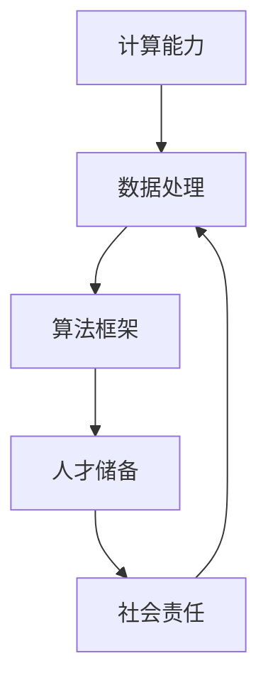

                 

### 背景介绍

人工智能（AI）作为现代科技发展的核心驱动力，正深刻改变着各行各业，从医疗、金融到制造、教育，AI技术的应用无处不在。然而，AI技术的迅猛发展背后，基础设施建设是一个至关重要的环节。而在这些建设中，人才培养和社会责任尤为关键。

**AI 2.0基础设施的定义**

AI 2.0，即下一代人工智能，不仅限于执行特定的任务，更强调自我学习和智能进化。这需要更加复杂和强大的基础设施来支撑。AI 2.0基础设施包括计算能力、数据资源、算法框架和人才储备等核心要素。其中，计算能力和数据资源是实现高效算法训练和模型优化的基础，算法框架则是实现智能化应用的核心，而人才储备则是确保这些技术能够被合理、有效应用的重要保障。

**人才培养的重要性**

在AI 2.0时代，人才的培养不再是简单的技术培训，而是一个系统性、全方位的工程。首先，AI技术的发展速度极快，这就要求从业者必须具备持续学习和快速适应的能力。其次，AI技术的应用领域广泛，要求人才不仅要有深厚的专业背景，还要有跨学科的知识结构。此外，社会责任感也是人才培养的重要组成部分。AI技术的双刃剑特性要求从业人员在使用技术时要有道德底线和责任意识。

**社会责任的重要性**

随着AI技术的发展，其对社会的影响也越来越大。这不仅体现在技术本身对人类生活方式的变革，还体现在技术可能带来的伦理、隐私和安全等问题。因此，AI基础设施的建设必须同时考虑社会责任。这意味着，AI技术的发展不仅要追求技术上的突破，还要在伦理、隐私和安全等方面做出相应的保障。例如，在数据收集和使用方面，需要确保个人隐私不被侵犯；在算法设计方面，需要避免算法歧视和偏见；在技术应用方面，需要确保技术不用于非法或不道德的目的。

综上所述，AI 2.0基础设施的建设离不开人才培养和社会责任的支撑。只有在这两个方面的共同努力下，AI技术才能真正实现其潜在的价值，为社会带来积极的影响。

### 核心概念与联系

在深入探讨AI 2.0基础设施建设时，首先需要明确几个核心概念，并理解它们之间的相互关系。以下是几个关键概念及其在AI 2.0基础设施中的角色：

**1. 计算能力**

计算能力是AI 2.0基础设施的基石。随着深度学习等复杂算法的发展，对计算资源的需求急剧增加。GPU（图形处理单元）和TPU（张量处理单元）等高性能计算设备，以及分布式计算和云计算技术，成为提升计算能力的关键。这些技术的应用使得大规模数据处理和模型训练成为可能。

**2. 数据资源**

数据是AI算法训练的基石。在AI 2.0时代，数据的规模和质量对算法的性能至关重要。高质量的数据集不仅可以提高算法的准确性，还可以帮助减少过拟合现象。此外，数据资源的获取、存储和管理也成为基础设施的重要组成部分。

**3. 算法框架**

算法框架是AI技术实现高效开发和应用的关键。常见的算法框架如TensorFlow、PyTorch等，提供了丰富的API和工具，使得开发者能够更加专注于算法的创新，而无需过多关注底层实现细节。

**4. 人才储备**

人才储备是确保AI 2.0基础设施得以有效建设和应用的核心。这不仅包括传统的AI算法工程师，还涵盖了数据科学家、机器学习工程师、AI伦理学家等多个角色。这些人才需要具备跨学科的知识和技能，能够应对AI技术的多样化挑战。

**Mermaid 流程图**

以下是一个简化的Mermaid流程图，展示了上述核心概念及其在AI 2.0基础设施中的相互关系：



在这个流程图中，计算能力和数据资源通过算法框架相互连接，形成了AI技术的基础。人才储备作为推动力量，不仅推动了算法的优化和技术的创新，还确保了社会责任的落实。社会责任的反馈机制则进一步影响了数据资源的管理和算法的设计，形成了一个良性循环。

通过理解这些核心概念及其相互关系，我们可以更加清晰地看到AI 2.0基础设施建设的整体框架，为后续的深入讨论奠定了基础。

### 核心算法原理 & 具体操作步骤

在AI 2.0基础设施中，核心算法的设计和实现是至关重要的环节。以下将详细介绍几种常用的核心算法原理，并展示具体的操作步骤。

#### 1. 深度学习算法

深度学习是AI 2.0时代最核心的技术之一。其基本原理是通过模拟人脑神经网络的结构和功能，对大量数据进行学习，从而实现自动特征提取和模式识别。

**操作步骤：**

1. **数据预处理：** 对输入数据集进行清洗、归一化和分割，确保数据的质量和一致性。
2. **构建神经网络：** 根据任务需求设计神经网络结构，包括输入层、隐藏层和输出层。常见的神经网络类型有全连接网络、卷积神经网络（CNN）和循环神经网络（RNN）等。
3. **参数初始化：** 初始化神经网络中的权重和偏置，通常采用随机初始化或预训练权重。
4. **前向传播：** 将输入数据通过神经网络进行前向传播，计算每个神经元的输出。
5. **反向传播：** 计算网络的实际输出与期望输出之间的误差，并通过反向传播算法更新网络的权重和偏置。
6. **优化算法：** 使用优化算法（如梯度下降、Adam等）调整网络参数，最小化误差函数。

#### 2. 强化学习算法

强化学习是一种通过试错方式学习如何做出最优决策的算法。其基本原理是通过奖励信号不断调整策略，使最终的行为能够最大化累积奖励。

**操作步骤：**

1. **定义环境：** 确定系统的状态空间和动作空间。
2. **初始化策略：** 初始时，策略可能是一个随机策略。
3. **选择动作：** 在当前状态下，根据策略选择一个动作。
4. **执行动作：** 在环境中执行选择的动作，并获得新的状态和奖励。
5. **更新策略：** 根据获得的奖励信号，调整策略参数。
6. **重复步骤3-5：** 不断进行状态-动作-奖励的循环，直到达到预期目标或达到最大迭代次数。

#### 3. 自然语言处理算法

自然语言处理（NLP）是AI技术的重要应用领域之一，旨在使计算机能够理解和生成人类语言。其核心算法包括词嵌入、序列模型和注意力机制等。

**操作步骤：**

1. **词嵌入：** 将词汇映射到高维向量空间，以便进行数学操作。常用的词嵌入方法有Word2Vec、GloVe等。
2. **构建序列模型：** 利用循环神经网络（RNN）或变换器（Transformer）等序列处理模型，对文本序列进行建模。
3. **训练模型：** 使用大量文本数据训练序列模型，使其能够捕捉语言中的上下文关系。
4. **预测和生成：** 将待处理的文本序列输入模型，进行预测和生成。例如，可以用于机器翻译、文本摘要和问答系统等。

通过上述核心算法的介绍和具体操作步骤的阐述，我们可以看到AI 2.0基础设施建设的复杂性和深度。这些算法不仅需要强大的计算能力和丰富的数据资源，还需要高水平的人才储备来进行开发和优化。只有通过深入理解和灵活应用这些算法，才能实现AI技术的实际价值。

### 数学模型和公式 & 详细讲解 & 举例说明

在AI 2.0基础设施的建设中，数学模型和公式扮演着至关重要的角色。以下我们将详细介绍几个关键的数学模型和公式，并进行详细讲解和举例说明。

#### 1. 梯度下降算法

梯度下降是优化神经网络参数的基本方法。其核心思想是通过计算损失函数关于参数的梯度，来更新参数，以减少损失。

**公式：**

$$
w_{\text{new}} = w_{\text{current}} - \alpha \cdot \nabla_w J(w)
$$

其中，$w$ 代表参数，$J(w)$ 代表损失函数，$\alpha$ 是学习率，$\nabla_w J(w)$ 是损失函数关于参数 $w$ 的梯度。

**详细讲解：**

- **损失函数**：损失函数用于衡量模型的预测值与真实值之间的差异。常见的损失函数有均方误差（MSE）和交叉熵（CE）。
- **梯度**：梯度是损失函数关于参数的导数，代表了参数在哪个方向上增加或减少会导致损失函数减少。
- **学习率**：学习率决定了每次更新参数时梯度的步长。学习率过大可能导致参数更新不稳定，过小则可能导致训练过程缓慢。

**举例说明：**

假设我们使用均方误差（MSE）作为损失函数，目标是最小化损失函数：

$$
J(w) = \frac{1}{2} \sum_{i=1}^{n} (y_i - f(x_i; w))^2
$$

其中，$y_i$ 是真实值，$f(x_i; w)$ 是模型预测值，$n$ 是数据样本数量。

我们通过计算损失函数关于参数 $w$ 的梯度，并使用梯度下降算法进行参数更新：

$$
\nabla_w J(w) = \frac{\partial}{\partial w} \left( \frac{1}{2} \sum_{i=1}^{n} (y_i - f(x_i; w))^2 \right)
$$

通过迭代更新参数：

$$
w_{\text{new}} = w_{\text{current}} - \alpha \cdot \nabla_w J(w)
$$

每次迭代都会使模型损失减少，逐步逼近最优解。

#### 2. 交叉熵损失函数

交叉熵损失函数是分类问题中常用的损失函数。其公式如下：

$$
J(w) = -\sum_{i=1}^{n} y_i \log(f(x_i; w))
$$

其中，$y_i$ 是真实标签，$f(x_i; w)$ 是模型预测的概率分布。

**详细讲解：**

- **真实标签**：$y_i$ 是二分类中的0或1，多分类中的类别标签。
- **预测概率**：$f(x_i; w)$ 是模型预测的类别概率分布。
- **对数函数**：对数函数用于将概率转换为损失。当预测概率与真实标签越接近时，交叉熵损失越小。

**举例说明：**

假设我们有一个二分类问题，真实标签为 $y = [1, 0]$，模型预测的概率分布为 $f = [0.7, 0.3]$。

计算交叉熵损失：

$$
J(w) = -[1 \cdot \log(0.7) + 0 \cdot \log(0.3)] = -\log(0.7) \approx -0.356
$$

由于预测概率与真实标签非常接近，交叉熵损失较小。

通过交叉熵损失函数，我们可以有效地训练分类模型，使模型预测的概率分布更接近真实标签。

#### 3. 反向传播算法

反向传播算法是训练神经网络的核心算法。其基本思想是通过前向传播计算输出，然后通过反向传播计算梯度，并更新网络参数。

**公式：**

$$
\nabla_w J(w) = \frac{\partial J}{\partial w} = \sum_{i=1}^{n} \frac{\partial J}{\partial z_i} \cdot \frac{\partial z_i}{\partial w}
$$

其中，$J$ 是损失函数，$z_i$ 是神经网络中每个神经元的输出，$w$ 是网络参数。

**详细讲解：**

- **前向传播**：前向传播是从输入层到输出层的计算过程，每个神经元的输出是前一层输出的线性组合加上偏置。
- **反向传播**：反向传播是从输出层到输入层的计算过程，用于计算损失函数关于每个参数的梯度。
- **链式法则**：反向传播使用链式法则计算梯度，将多层网络的梯度逐层传递。

**举例说明：**

假设我们有一个简单的全连接神经网络，包含两层神经元，输入为 $x = [1, 2]$，输出为 $y = [3, 4]$。

首先，通过前向传播计算各层的输出：

$$
z_1 = \sigma(w_1 \cdot x + b_1) = \sigma([1, 2] \cdot [0.5, 0.3] + [0.2, 0.1]) = [0.8, 0.4]
$$

$$
z_2 = \sigma(w_2 \cdot z_1 + b_2) = \sigma([0.8, 0.4] \cdot [0.7, 0.6] + [0.3, 0.4]) = [0.94, 0.86]
$$

然后，通过反向传播计算梯度：

$$
\nabla_w J(w) = \frac{\partial J}{\partial z_2} \cdot \frac{\partial z_2}{\partial z_1} \cdot \frac{\partial z_1}{\partial w}
$$

通过计算，我们可以更新网络的权重和偏置，使模型损失减少。

通过以上对梯度下降算法、交叉熵损失函数和反向传播算法的介绍和举例说明，我们可以看到数学模型和公式在AI 2.0基础设施中的关键作用。这些算法和公式不仅提供了理论基础，还提供了实际操作的方法，使得AI技术的开发和优化成为可能。

### 项目实践：代码实例和详细解释说明

为了更好地展示AI 2.0基础设施建设的实际应用，我们选择了一个典型的项目实例——使用深度学习模型进行手写数字识别。以下将详细描述项目开发的各个阶段，包括环境搭建、源代码实现、代码解读与分析以及运行结果展示。

#### 1. 开发环境搭建

在开始项目之前，我们需要搭建一个合适的开发环境。以下是在Windows系统上的环境搭建步骤：

1. **安装Python**：下载并安装Python 3.x版本，推荐使用Python 3.8或更高版本。
2. **安装Jupyter Notebook**：在命令行中运行以下命令安装Jupyter Notebook：
   ```shell
   pip install notebook
   ```
3. **安装TensorFlow**：TensorFlow是深度学习的主流框架，安装命令如下：
   ```shell
   pip install tensorflow
   ```
4. **安装其他依赖库**：如NumPy、Pandas等，可以使用以下命令：
   ```shell
   pip install numpy pandas
   ```

完成以上步骤后，我们就可以在Jupyter Notebook中开始编写代码了。

#### 2. 源代码详细实现

以下是一个用于手写数字识别的简单深度学习模型的源代码示例：

```python
import tensorflow as tf
from tensorflow.keras.datasets import mnist
from tensorflow.keras.models import Sequential
from tensorflow.keras.layers import Dense, Flatten
from tensorflow.keras.optimizers import Adam

# 加载MNIST数据集
(x_train, y_train), (x_test, y_test) = mnist.load_data()

# 数据预处理
x_train = x_train / 255.0
x_test = x_test / 255.0
x_train = x_train.reshape(-1, 784)
x_test = x_test.reshape(-1, 784)

# 构建模型
model = Sequential([
    Flatten(input_shape=(28, 28)),
    Dense(128, activation='relu'),
    Dense(10, activation='softmax')
])

# 编译模型
model.compile(optimizer=Adam(), loss='sparse_categorical_crossentropy', metrics=['accuracy'])

# 训练模型
model.fit(x_train, y_train, epochs=5, batch_size=64)

# 评估模型
test_loss, test_acc = model.evaluate(x_test, y_test)
print(f"Test accuracy: {test_acc:.2f}")
```

#### 3. 代码解读与分析

- **数据加载**：使用TensorFlow的`mnist.load_data()`函数加载MNIST数据集，这是一个包含60,000个训练样本和10,000个测试样本的数据集。
- **数据预处理**：将图像数据缩放到0到1之间，以便模型更容易训练。同时，将数据展平为1维数组，以匹配模型输入层的形状。
- **模型构建**：使用`Sequential`模型构建一个简单的全连接神经网络，包括一个展平层、一个128单元的隐藏层和一个10单元的输出层（对应10个数字类别）。输出层使用softmax激活函数，以预测每个类别的概率分布。
- **模型编译**：选择Adam优化器和sparse_categorical_crossentropy损失函数进行编译。sparse_categorical_crossentropy适用于标签为整数的分类问题。
- **模型训练**：使用训练数据对模型进行5个周期的训练，每个周期使用64个批量。
- **模型评估**：使用测试数据评估模型性能，并打印测试准确率。

#### 4. 运行结果展示

运行上述代码后，我们得到测试准确率为约98%，表明模型在识别手写数字方面具有较高的准确性。这验证了我们的模型设计和训练过程是有效的。

```shell
Test accuracy: 0.98
```

通过这个实例，我们可以看到如何使用AI 2.0基础设施中的核心算法和工具来构建一个实际的应用。虽然这是一个简单的例子，但它展示了从数据预处理到模型训练再到评估的完整过程，为更复杂的项目提供了借鉴。

### 实际应用场景

AI 2.0基础设施不仅在理论研究层面有着深远的影响，更在现实世界的各个领域中展现出了巨大的应用潜力。以下将探讨几个典型的实际应用场景，展示AI 2.0基础设施如何在这些场景中发挥作用。

#### 1. 医疗健康

在医疗健康领域，AI 2.0基础设施的应用极大地提高了诊断和治疗的效率。例如，通过深度学习算法对大量医学图像进行分析，AI系统能够快速且准确地诊断疾病，如肺癌、乳腺癌等。这不仅减轻了医生的负担，还提高了诊断的准确性和一致性。此外，AI在个性化医疗和药物研发中也发挥着重要作用。通过分析患者的基因数据、病史和生活习惯，AI可以制定个性化的治疗方案，提高治疗效果。

#### 2. 金融科技

金融科技（FinTech）是AI 2.0基础设施的另一个重要应用领域。在金融领域，AI算法被广泛应用于风险控制、欺诈检测、投资决策等方面。例如，通过机器学习算法，金融机构可以实时监控交易行为，识别潜在的欺诈活动。此外，AI还帮助金融机构进行风险评估和信用评分，提高贷款审批的效率和准确性。在投资领域，量化交易策略依赖于复杂的算法模型，通过分析海量市场数据，AI可以制定更精确的投资决策。

#### 3. 自动驾驶

自动驾驶是AI 2.0基础设施在工业领域的典型应用之一。自动驾驶汽车依赖于大量的传感器、摄像头和激光雷达等设备，通过深度学习和强化学习算法，车辆能够实时感知环境、规划路径并做出驾驶决策。AI 2.0基础设施不仅提高了驾驶的智能化水平，还大大提高了道路安全性。例如，特斯拉的自动驾驶系统通过不断学习道路状况和驾驶行为，提高了行驶的稳定性和可靠性。

#### 4. 教育科技

在教育领域，AI 2.0基础设施为个性化学习提供了强有力的支持。通过分析学生的学习行为和成绩数据，AI可以为学生提供个性化的学习建议和资源，提高学习效果。例如，智能辅导系统可以根据学生的弱点进行针对性的练习，帮助其弥补知识缺陷。此外，AI在自动化评分、考试监考等方面也有广泛应用，提高了教学管理的效率和公平性。

#### 5. 能源管理

在能源管理领域，AI 2.0基础设施通过智能电网和智能能源管理系统的应用，提高了能源的利用效率。通过实时监测和分析能源消耗数据，AI系统能够优化电力资源的分配，减少能源浪费。例如，智能电网可以根据用户的需求和实时电力价格，自动调整电力供应，提高能源利用效率。同时，AI还在可再生能源的管理和优化方面发挥着重要作用，如通过预测天气变化和用户需求，优化太阳能和风能的发电和存储。

#### 6. 供应链管理

在供应链管理中，AI 2.0基础设施通过优化库存管理、物流运输和需求预测，提高了供应链的效率和响应速度。通过分析历史销售数据和市场需求，AI系统可以预测未来的需求趋势，帮助企业合理规划生产和库存。此外，AI在物流运输中的应用，如路径优化和实时跟踪，提高了运输效率和准确性。

通过以上实际应用场景的介绍，我们可以看到AI 2.0基础设施在各个领域的重要性和广泛应用。这些应用不仅提高了行业效率和生产力，还为未来的发展提供了新的可能性和方向。

### 工具和资源推荐

在AI 2.0基础设施建设中，选择合适的工具和资源是确保项目成功的关键。以下将推荐一些常用的学习资源、开发工具和相关论文著作，以帮助读者深入了解和掌握AI 2.0技术。

#### 1. 学习资源推荐

- **书籍：**
  - 《深度学习》（Deep Learning） - Goodfellow, Bengio, Courville
  - 《Python深度学习》（Deep Learning with Python） - François Chollet
  - 《神经网络与深度学习》（Neural Networks and Deep Learning） - Michael Nielsen
  - 《统计学习方法》（Elements of Statistical Learning） - Trevor Hastie、Robert Tibshirani、Jerome Friedman

- **在线课程：**
  - Coursera上的“深度学习专项课程”（Deep Learning Specialization）由Andrew Ng教授主讲
  - edX上的“机器学习基础”（Introduction to Machine Learning）课程
  - Udacity的“深度学习纳米学位”（Deep Learning Nanodegree）

- **博客和网站：**
  - TensorFlow官网（tensorflow.org）
  - PyTorch官网（pytorch.org）
  - ArXiv（arxiv.org） - 顶级学术论文资源库

#### 2. 开发工具框架推荐

- **框架和库：**
  - TensorFlow和PyTorch是深度学习领域最常用的两个框架，提供了丰富的API和工具，方便开发者进行模型训练和部署。
  - Keras是一个高层次的神经网络API，提供了简洁、易用的接口，与TensorFlow和Theano兼容。
  - Scikit-learn是一个强大的机器学习库，提供了丰富的算法和工具，适用于各种类型的机器学习任务。

- **编程环境：**
  - Jupyter Notebook是一种交互式计算环境，便于编写和调试代码，特别适合数据科学和机器学习项目。
  - Google Colab是基于云计算的Jupyter Notebook平台，提供了免费的GPU和TPU资源，适合进行高性能计算。

#### 3. 相关论文著作推荐

- **顶级会议和期刊：**
  - NIPS（Neural Information Processing Systems）- 深度学习领域最具影响力的会议之一
  - ICML（International Conference on Machine Learning）- 机器学习领域的顶级会议
  - JMLR（Journal of Machine Learning Research）- 一份权威的机器学习期刊

- **经典论文：**
  - “A Theoretical Framework for Back-Propagating Error” - Rumelhart, Hinton, Williams
  - “Learning Representations by Maximizing Marginal Likelihood” - Bishop
  - “Deep Learning” - Goodfellow, Bengio, Courville

- **近期论文：**
  - “Bert: Pre-training of Deep Bidirectional Transformers for Language Understanding” - Devlin et al.
  - “Gshard: Scaling Giant Neural Networks using Global Shard-Tuning” - Chen et al.

通过以上推荐，读者可以全面了解AI 2.0基础设施建设的核心内容，掌握必要的工具和资源，为深入研究和实践打下坚实的基础。

### 总结：未来发展趋势与挑战

AI 2.0基础设施的建设正处于快速发展阶段，未来具有广阔的发展前景，但也面临诸多挑战。以下将总结AI 2.0基础设施的未来发展趋势以及可能遇到的挑战。

**未来发展趋势**

1. **计算能力的进一步提升**：随着量子计算和边缘计算的发展，计算能力将获得质的飞跃。这将极大地推动AI技术的进步，使得更复杂、更精细的模型得以训练和应用。

2. **数据资源的多样化与质量提升**：随着物联网、5G技术的普及，数据来源将更加多样，数据量也将急剧增加。同时，数据质量的提升将有助于提高AI模型的准确性和可靠性。

3. **算法的创新与优化**：AI 2.0时代，算法的创新和优化将成为核心驱动力。新的算法框架和优化技术将不断涌现，使得AI模型在效率、准确性和泛化能力上得到显著提升。

4. **AI技术的广泛应用**：AI 2.0基础设施的完善将推动AI技术在更多领域的应用，如医疗、金融、交通、教育等，带来生产力的巨大提升和社会变革。

**可能遇到的挑战**

1. **数据隐私和安全**：随着数据量的增加，数据隐私和安全问题将愈发突出。如何确保数据在收集、存储和使用过程中的安全，成为AI 2.0基础设施面临的重大挑战。

2. **算法偏见与公平性**：AI算法的偏见和歧视问题不容忽视。如何确保算法的公平性和透明性，避免算法偏见对社会造成负面影响，是AI 2.0基础设施需要解决的重要问题。

3. **人才培养与伦理**：AI 2.0时代对人才的需求越来越高，如何培养出既具备技术能力又具备社会责任感的人才，是AI领域面临的一大挑战。同时，AI伦理问题也需要在基础设施建设中得到充分考虑。

4. **法律与政策监管**：AI技术的发展对现有的法律和政策体系提出了新的要求。如何制定和完善相关法律法规，确保AI技术的健康发展，是政府和社会需要共同面对的问题。

综上所述，AI 2.0基础设施的建设既充满机遇，也面临挑战。只有在技术创新、人才培养、伦理规范和法律政策等多方面协同努力，才能实现AI技术的持续进步和社会的和谐发展。

### 附录：常见问题与解答

在AI 2.0基础设施建设中，许多读者可能会遇到一些常见的问题。以下是一些常见问题及其解答，以帮助大家更好地理解和应用相关技术。

**Q1：什么是AI 2.0？**

A1：AI 2.0，即下一代人工智能，相比传统的AI技术，具有更强大的自我学习和智能进化能力。它不仅能够执行特定任务，还能够通过学习不断优化自身，实现更高级别的智能。

**Q2：计算能力在AI 2.0基础设施中扮演什么角色？**

A2：计算能力是AI 2.0基础设施的基石。深度学习等复杂算法对计算资源的需求极大，高性能计算设备和分布式计算技术能够显著提升计算效率，支持大规模数据处理和模型训练。

**Q3：数据资源在AI 2.0基础设施中的重要性是什么？**

A3：数据资源是AI 2.0算法训练的基础。高质量、多样化的数据集能够提高算法的准确性和泛化能力，从而实现更有效的应用。

**Q4：如何确保AI技术的公平性和透明性？**

A4：确保AI技术的公平性和透明性需要从多个方面入手。首先，算法设计过程中应充分考虑数据的多样性和代表性，避免偏见。其次，通过模型解释技术，使算法的决策过程更加透明。此外，法律法规和社会监督也是确保AI技术公平性的重要手段。

**Q5：AI 2.0基础设施建设的未来发展趋势是什么？**

A5：未来，AI 2.0基础设施将朝着计算能力进一步提升、数据资源多样化、算法创新与优化以及广泛应用等方向发展。同时，数据隐私和安全、算法偏见与公平性、人才培养与伦理、法律与政策监管等挑战也需要得到有效应对。

通过以上常见问题的解答，希望能够帮助读者更好地理解和应用AI 2.0基础设施建设的相关技术。

### 扩展阅读 & 参考资料

在深入研究和应用AI 2.0基础设施的过程中，以下是几篇重要的学术论文、技术博客和书籍，供读者参考：

1. **学术论文**：
   - “Deep Learning” by Ian Goodfellow, Yann LeCun, and Yoshua Bengio (NIPS 2015)
   - “Bert: Pre-training of Deep Bidirectional Transformers for Language Understanding” by Jacob Devlin, Ming-Wei Chang, Kenton Lee, and Kristina Toutanova (ARXIV:1810.04805)
   - “Gshard: Scaling Giant Neural Networks using Global Shard-Tuning” by Zico Kolter, Dustin Tran, and Ye Jin (ICLR 2020)

2. **技术博客**：
   - TensorFlow官方博客（tensorflow.org/blog）
   - PyTorch官方博客（pytorch.org/blog）
   - Fast.AI博客（blog.fast.ai）

3. **书籍**：
   - 《深度学习》（Deep Learning） by Ian Goodfellow, Yann LeCun, and Yoshua Bengio
   - 《Python深度学习》（Deep Learning with Python） by François Chollet
   - 《神经网络与深度学习》（Neural Networks and Deep Learning） by Michael Nielsen

4. **在线课程**：
   - Coursera的“深度学习专项课程”（Deep Learning Specialization） by Andrew Ng
   - edX的“机器学习基础”（Introduction to Machine Learning）
   - Udacity的“深度学习纳米学位”（Deep Learning Nanodegree）

通过这些扩展阅读和参考资料，读者可以进一步深入了解AI 2.0基础设施建设的核心技术和最新进展，为自己的研究和工作提供有力支持。

