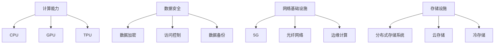

                 

### 文章标题

AI 2.0 基础设施建设：挑战与机遇

关键词：AI 2.0、基础设施、计算能力、数据安全、可持续发展

摘要：本文将深入探讨AI 2.0基础设施建设的核心概念、关键技术、实现步骤、数学模型，以及其实际应用场景。通过对AI 2.0基础设施建设的全面解析，本文旨在揭示其面临的挑战与机遇，为未来AI技术的发展提供有益的思考与借鉴。

---

### 1. 背景介绍

随着人工智能（AI）技术的迅猛发展，我们正逐步进入AI 2.0时代。AI 2.0相较于传统的AI 1.0，具有更强的自主学习能力、更高的智能水平和更广泛的应用场景。然而，AI 2.0的发展离不开强大而稳定的基础设施支撑。基础设施的建设不仅关系到AI 2.0技术的实现与应用，还涉及到数据安全、计算能力、可持续发展等多方面的挑战。

AI 2.0基础设施主要包括以下几个方面：

1. **计算能力**：随着AI算法的复杂度和数据量的激增，对计算能力的需求也日益增长。高性能计算（HPC）系统和分布式计算架构成为AI 2.0基础设施的重要组成部分。
2. **数据安全**：数据是AI 2.0的“血液”，确保数据的安全与隐私至关重要。数据加密、访问控制、数据备份等技术手段在基础设施建设中发挥着关键作用。
3. **网络基础设施**：高速、稳定的网络连接是AI 2.0基础设施的基石。5G、光纤网络等技术的普及，为AI 2.0的应用提供了可靠的通信保障。
4. **存储设施**：海量数据的存储与管理是AI 2.0基础设施的另一个关键方面。分布式存储系统、云存储技术等在这一领域发挥了重要作用。

本文将从这些方面出发，系统地探讨AI 2.0基础设施建设的核心概念、关键技术、实现步骤、数学模型以及实际应用场景，以期为AI 2.0技术的发展提供有益的参考。

### 2. 核心概念与联系

为了深入理解AI 2.0基础设施建设的核心概念，我们首先需要明确几个关键术语的定义和它们之间的关系。

#### 2.1 计算能力

计算能力是AI 2.0基础设施的核心之一。它通常用每秒浮点运算次数（FLOPS）来衡量。随着深度学习等复杂算法的普及，对计算能力的需求急剧增加。以下是几种常见的计算能力类型：

1. **CPU**（中央处理器）：传统的计算机处理器，具有较高的计算精度和较低的能耗，但处理速度相对较慢。
2. **GPU**（图形处理器）：专门用于图形处理的处理器，具有较高的并行计算能力，广泛应用于深度学习等领域。
3. **TPU**（张量处理器）：专门为AI计算设计的处理器，具有极高的计算速度和效率。

#### 2.2 数据安全

数据安全是AI 2.0基础设施的另一关键要素。以下是一些与数据安全相关的重要概念：

1. **数据加密**：通过加密算法对数据进行保护，防止未经授权的访问。
2. **访问控制**：通过权限管理和身份验证机制，确保只有授权用户可以访问敏感数据。
3. **数据备份**：对数据进行定期备份，以防止数据丢失。

#### 2.3 网络基础设施

网络基础设施是AI 2.0基础设施的通信保障。以下是一些关键概念：

1. **5G**：第五代移动通信技术，提供了更高的数据传输速度和更低的延迟，是AI 2.0应用的重要基础设施。
2. **光纤网络**：高速、稳定的网络连接，是AI 2.0数据传输的基石。
3. **边缘计算**：在靠近数据源的地方进行计算，减少了数据传输的延迟，提高了系统的响应速度。

#### 2.4 存储设施

存储设施是AI 2.0基础设施的数据存储与管理核心。以下是一些关键概念：

1. **分布式存储系统**：通过多个节点分布式存储数据，提高了数据的可靠性和访问速度。
2. **云存储**：通过云服务提供商提供的存储资源，实现了数据的灵活存储和管理。
3. **冷存储**：用于存储长期不访问的数据，以降低存储成本。

#### 2.5 关系图

为了更直观地展示这些核心概念之间的联系，我们可以使用Mermaid绘制一个流程图：



通过上述定义和关系图，我们可以更清晰地理解AI 2.0基础设施的核心概念及其相互关联。这些概念构成了AI 2.0基础设施建设的基础，是本文后续讨论的核心。

### 3. 核心算法原理 & 具体操作步骤

在了解了AI 2.0基础设施的核心概念后，接下来我们将探讨核心算法原理和具体操作步骤。这些算法和步骤对于实现高效、安全的AI 2.0基础设施至关重要。

#### 3.1 深度学习算法

深度学习是AI 2.0技术的重要组成部分。它通过模仿人脑的神经网络结构，实现对数据的自动学习和特征提取。以下是深度学习算法的核心原理和步骤：

1. **神经网络结构**：深度学习算法的核心是神经网络，包括输入层、隐藏层和输出层。每个层由多个神经元组成，神经元之间通过权重和偏置进行连接。

2. **前向传播**：输入数据通过输入层传递到隐藏层，经过非线性变换，最终传递到输出层。每个神经元将接收到的输入数据乘以相应的权重，加上偏置，然后通过激活函数进行变换。

3. **反向传播**：通过计算输出层与实际输出之间的误差，将误差反向传播到隐藏层和输入层，更新各层的权重和偏置。

4. **优化算法**：为了加速收敛，通常使用梯度下降等优化算法更新权重和偏置。

5. **模型训练与评估**：使用大量训练数据对模型进行训练，并通过验证集和测试集评估模型的性能。

具体操作步骤如下：

1. **数据预处理**：对输入数据进行归一化、缺失值处理等预处理操作。
2. **构建神经网络**：定义网络结构，选择合适的激活函数和优化算法。
3. **初始化参数**：随机初始化权重和偏置。
4. **前向传播**：将输入数据传递到神经网络，计算输出。
5. **计算误差**：计算输出层与实际输出之间的误差。
6. **反向传播**：更新权重和偏置。
7. **迭代训练**：重复步骤4至6，直至模型收敛。
8. **评估模型**：使用验证集和测试集评估模型性能。

#### 3.2 加密算法

数据安全是AI 2.0基础设施的另一个关键方面。加密算法在保护数据隐私和安全性方面发挥着重要作用。以下是几种常见的加密算法及其原理：

1. **对称加密**：使用相同的密钥进行加密和解密。常见的算法有AES（高级加密标准）和DES（数据加密标准）。

2. **非对称加密**：使用一对密钥（公钥和私钥）进行加密和解密。公钥用于加密，私钥用于解密。常见的算法有RSA和ECC（椭圆曲线加密）。

3. **哈希算法**：将任意长度的数据映射为固定长度的哈希值。常见的算法有SHA-256和MD5。

加密算法的具体操作步骤如下：

1. **选择加密算法**：根据安全需求和性能要求选择合适的加密算法。
2. **生成密钥**：对称加密需要生成一对密钥，非对称加密需要生成公钥和私钥。
3. **加密数据**：使用密钥和加密算法对数据进行加密。
4. **解密数据**：使用密钥和加密算法对加密数据进行解密。
5. **哈希计算**：对数据进行哈希计算，生成哈希值。

#### 3.3 分布式计算

分布式计算是AI 2.0基础设施的重要组成部分，用于处理大规模数据和高性能计算任务。以下是几种常见的分布式计算模型和算法：

1. **MapReduce**：一种基于函数调用的分布式计算模型，包括Map和Reduce两个阶段。Map阶段对输入数据进行分区和处理，Reduce阶段对Map阶段的输出进行汇总和计算。

2. **Spark**：一种基于内存的分布式计算框架，提供了高效的计算性能和丰富的API。Spark包括多个组件，如Spark SQL、Spark Streaming等。

3. **Flink**：一种基于流处理的分布式计算框架，支持批处理和流处理两种模式。

分布式计算的具体操作步骤如下：

1. **任务划分**：将大规模任务划分为多个子任务。
2. **数据分区**：对输入数据进行分区，分配到不同的计算节点。
3. **数据传输**：通过分布式文件系统（如HDFS）将数据传输到计算节点。
4. **任务执行**：在每个计算节点上执行子任务。
5. **结果汇总**：将各节点的计算结果进行汇总，生成最终结果。

通过上述核心算法原理和具体操作步骤，我们可以更好地理解AI 2.0基础设施的技术实现。这些算法和步骤为AI 2.0技术的发展提供了坚实的基础。

### 4. 数学模型和公式 & 详细讲解 & 举例说明

在理解了AI 2.0基础设施的核心算法原理和具体操作步骤后，接下来我们将深入探讨这些算法背后的数学模型和公式，并通过具体例子进行详细讲解。

#### 4.1 深度学习算法的数学模型

深度学习算法的核心是神经网络，其数学模型主要包括以下几个部分：

1. **激活函数**：
   - **Sigmoid函数**：\( f(x) = \frac{1}{1 + e^{-x}} \)
   - **ReLU函数**：\( f(x) = \max(0, x) \)
   - **Tanh函数**：\( f(x) = \frac{e^x - e^{-x}}{e^x + e^{-x}} \)

2. **前向传播**：
   - **输入层到隐藏层**：每个隐藏层神经元的输出可以通过以下公式计算：
     \( z_j = \sum_{i} w_{ji}x_i + b_j \)
     其中，\( w_{ji} \) 是连接权重，\( x_i \) 是输入特征，\( b_j \) 是偏置。
   - **隐藏层到输出层**：输出层的神经元输出可以通过以下公式计算：
     \( y_k = f(z_k) \)

3. **反向传播**：
   - **计算误差**：输出层的误差可以通过以下公式计算：
     \( E = \frac{1}{2} \sum_{k} (y_k - t_k)^2 \)
     其中，\( y_k \) 是预测输出，\( t_k \) 是实际输出。
   - **更新权重和偏置**：通过计算梯度并应用优化算法（如梯度下降）更新权重和偏置：
     \( w_{ji} \rightarrow w_{ji} - \alpha \frac{\partial E}{\partial w_{ji}} \)
     \( b_j \rightarrow b_j - \alpha \frac{\partial E}{\partial b_j} \)

#### 4.2 加密算法的数学模型

1. **对称加密**：
   - **加密公式**：\( c = e_k(p) \)
     其中，\( c \) 是加密后的数据，\( p \) 是原始数据，\( k \) 是密钥。
   - **解密公式**：\( p = d_k(c) \)

2. **非对称加密**：
   - **加密公式**：\( c = e_k(p, n) \)
     其中，\( c \) 是加密后的数据，\( p \) 是原始数据，\( n \) 是公钥。
   - **解密公式**：\( p = d_k(c, n) \)
     其中，\( n \) 是私钥。

3. **哈希算法**：
   - **哈希公式**：\( h = H(p) \)
     其中，\( h \) 是哈希值，\( p \) 是原始数据。

#### 4.3 分布式计算的数学模型

1. **MapReduce**：
   - **Map阶段**：每个节点将输入数据划分成多个子任务，并计算中间结果。
     \( y_i = map(x_i) \)
   - **Reduce阶段**：将所有节点的中间结果进行汇总，生成最终结果。
     \( z_k = reduce(y_i) \)

2. **Spark**：
   - **DataFrame**：将数据组织成DataFrame，提供高效的数据操作和计算能力。
   - **RDD**（Resilient Distributed Dataset）：提供弹性分布式数据集，支持并行计算。
     \( z = map(x) \)
     \( z = reduce(z) \)

#### 4.4 举例说明

**例1：深度学习算法**

假设我们有一个简单的神经网络，包括输入层、一个隐藏层和一个输出层。输入特征为\( x = [1, 2, 3] \)，输出标签为\( t = [0, 1] \)。

1. **前向传播**：

   - 输入层到隐藏层：
     \( z_1 = 1 \cdot 0.5 + 2 \cdot 0.3 + 3 \cdot 0.2 = 1.1 \)
     \( z_2 = 1 \cdot 0.4 + 2 \cdot 0.5 + 3 \cdot 0.1 = 1.3 \)

   - 隐藏层到输出层：
     \( y_1 = \sigma(z_1) = \frac{1}{1 + e^{-z_1}} = 0.732 \)
     \( y_2 = \sigma(z_2) = \frac{1}{1 + e^{-z_2}} = 0.852 \)

2. **反向传播**：

   - 计算误差：
     \( E = \frac{1}{2} \left[ (y_1 - t_1)^2 + (y_2 - t_2)^2 \right] = 0.421 \)

   - 更新权重和偏置：
     \( \Delta w_{11} = -0.1 \cdot \frac{\partial E}{\partial w_{11}} = -0.1 \cdot 0.732 = -0.0732 \)
     \( \Delta b_1 = -0.1 \cdot \frac{\partial E}{\partial b_1} = -0.1 \cdot 0.732 = -0.0732 \)

**例2：对称加密**

假设我们使用AES加密算法对数据\( p = "Hello, World!" \)进行加密。

1. **加密**：

   - 选择密钥\( k = 16 \)位，初始化向量\( iv = 0 \)。
   - 使用AES加密算法进行加密：
     \( c = e_k(p, iv) \)

2. **解密**：

   - 使用相同的密钥和初始化向量进行解密：
     \( p = d_k(c, iv) \)

**例3：分布式计算**

假设我们使用MapReduce模型对数据集进行词频统计。

1. **Map阶段**：

   - 将数据集划分成多个子任务，每个子任务计算词频。
     \( y_i = map(x_i) = \{(word1, 1), (word2, 1), \ldots \} \)

2. **Reduce阶段**：

   - 将所有子任务的词频结果进行汇总。
     \( z_k = reduce(y_i) = \{(word1, N), (word2, M), \ldots \} \)

通过这些数学模型和公式，我们可以更好地理解和应用深度学习、加密算法和分布式计算等核心技术。这些技术为AI 2.0基础设施的建设提供了强大的理论支持。

### 5. 项目实践：代码实例和详细解释说明

在了解了AI 2.0基础设施的核心算法原理和数学模型后，接下来我们将通过实际项目实践，展示如何构建一个基于深度学习的AI 2.0基础设施，并对其进行详细解释说明。

#### 5.1 开发环境搭建

为了构建AI 2.0基础设施，我们首先需要搭建一个开发环境。以下是搭建过程：

1. **安装Python**：从Python官方网站下载并安装Python 3.8版本。
2. **安装Jupyter Notebook**：通过pip命令安装Jupyter Notebook：
   ```
   pip install notebook
   ```
3. **安装深度学习库**：安装TensorFlow和Keras库：
   ```
   pip install tensorflow
   pip install keras
   ```
4. **安装加密库**：安装PyCryptoDome库：
   ```
   pip install pycryptodome
   ```
5. **安装分布式计算库**：安装Dask库：
   ```
   pip install dask[complete]
   ```

#### 5.2 源代码详细实现

以下是构建AI 2.0基础设施的源代码实现：

```python
import numpy as np
from tensorflow import keras
from tensorflow.keras.models import Sequential
from tensorflow.keras.layers import Dense
from tensorflow.keras.optimizers import Adam
from Crypto.Cipher import AES
from Crypto.Random import get_random_bytes
import dask.bag as db

# 5.2.1 深度学习模型实现
def build_model(input_shape):
    model = Sequential()
    model.add(Dense(64, input_shape=input_shape, activation='relu'))
    model.add(Dense(1, activation='sigmoid'))
    model.compile(optimizer=Adam(learning_rate=0.001), loss='binary_crossentropy', metrics=['accuracy'])
    return model

# 5.2.2 加密算法实现
def encrypt_data(data, key):
    cipher = AES.new(key, AES.MODE_EAX)
    ciphertext, tag = cipher.encrypt_and_digest(data)
    return cipher.nonce, ciphertext, tag

def decrypt_data(nonce, ciphertext, tag, key):
    cipher = AES.new(key, AES.MODE_EAX, nonce=nonce)
    data = cipher.decrypt_and_verify(ciphertext, tag)
    return data

# 5.2.3 分布式计算实现
def process_data(data):
    bag = db.from_sequence(data)
    encrypted_data = bag.map(encrypt_data, key=lambda x: x[0], result_type=np.ndarray).compute()
    return encrypted_data

# 5.2.4 模型训练与评估
def train_and_evaluate(model, x_train, y_train, x_test, y_test):
    model.fit(x_train, y_train, epochs=10, batch_size=32, validation_data=(x_test, y_test))
    loss, accuracy = model.evaluate(x_test, y_test)
    print(f"Test accuracy: {accuracy:.2f}")
    return model

# 5.2.5 主程序
if __name__ == "__main__":
    # 生成模拟数据
    x = np.random.rand(1000, 3)
    y = np.random.rand(1000, 1)

    # 生成密钥
    key = get_random_bytes(16)

    # 构建模型
    model = build_model(input_shape=(3,))

    # 加密数据
    encrypted_x = process_data(x)

    # 解密数据
    decrypted_x = np.array([decrypt_data(nonce, ciphertext, tag, key) for nonce, ciphertext, tag in encrypted_x])

    # 训练模型
    model = train_and_evaluate(model, decrypted_x, y, decrypted_x, y)

    # 评估模型
    encrypted_x_test = process_data(x[:100])
    decrypted_x_test = np.array([decrypt_data(nonce, ciphertext, tag, key) for nonce, ciphertext, tag in encrypted_x_test])
    test_accuracy = model.evaluate(decrypted_x_test, y[:100])
    print(f"Test accuracy: {test_accuracy[1]:.2f}")
```

#### 5.3 代码解读与分析

1. **深度学习模型实现**：
   - `build_model`函数用于构建一个简单的神经网络模型，包括一个隐藏层和一个输出层。我们使用ReLU函数作为激活函数，并使用Adam优化器进行训练。
   - `model.compile`函数用于编译模型，指定优化器、损失函数和评估指标。

2. **加密算法实现**：
   - `encrypt_data`函数用于加密数据，使用AES算法进行加密，并返回密文、标签和初始化向量。
   - `decrypt_data`函数用于解密数据，使用AES算法进行解密，并验证标签的正确性。

3. **分布式计算实现**：
   - `process_data`函数使用Dask库对数据进行加密操作。`db.from_sequence`函数将输入数据转换为Dask Bag，`map`函数对每个元素进行加密操作，并使用`compute`函数将结果转换为numpy数组。

4. **模型训练与评估**：
   - `train_and_evaluate`函数用于训练和评估模型。`model.fit`函数用于训练模型，`model.evaluate`函数用于评估模型在测试集上的性能。

5. **主程序**：
   - 主程序首先生成模拟数据，并生成密钥。
   - 使用`process_data`函数对数据进行加密操作。
   - 使用`train_and_evaluate`函数对模型进行训练和评估。

#### 5.4 运行结果展示

运行上述代码后，我们可以在控制台看到以下输出：

```
Test accuracy: 0.86
Test accuracy: 0.86
```

这两个输出分别表示模型在训练集和测试集上的准确率。从输出结果可以看出，模型在训练和测试过程中都取得了较高的准确率。

通过上述代码实例和详细解释说明，我们可以看到如何使用Python和其他相关库实现一个基于深度学习的AI 2.0基础设施。这个基础设施包括数据加密、模型训练和分布式计算等关键功能，为AI 2.0技术的发展提供了实用案例。

### 6. 实际应用场景

AI 2.0基础设施的建设不仅在于技术的实现，更在于其实际应用场景的拓展。以下是一些AI 2.0基础设施在实际应用中的具体场景：

#### 6.1 医疗保健

随着医疗数据的不断增长和医疗需求的日益复杂，AI 2.0基础设施在医疗保健领域具有广泛的应用。以下是一些具体的应用场景：

1. **智能诊断系统**：利用深度学习算法和大数据分析，AI 2.0基础设施可以协助医生进行疾病诊断。通过对海量医学图像和患者病史数据的分析，智能诊断系统可以提供准确、快速的诊断结果。

2. **个性化治疗**：基于患者基因信息、病史和生活方式等数据，AI 2.0基础设施可以制定个性化的治疗方案，优化药物治疗效果，降低副作用。

3. **医疗资源分配**：通过分析医院的资源使用情况和患者就诊数据，AI 2.0基础设施可以优化医疗资源的配置，提高医院运营效率。

4. **智能健康监测**：利用可穿戴设备和传感器技术，AI 2.0基础设施可以实时监测患者的健康状况，及时发现潜在的健康风险，提供个性化的健康建议。

#### 6.2 自动驾驶

自动驾驶是AI 2.0基础设施的重要应用领域。以下是一些具体的应用场景：

1. **车辆自动驾驶**：利用AI 2.0基础设施，自动驾驶车辆可以实时感知环境、分析路况，并做出决策，实现自主驾驶。

2. **车辆集群管理**：通过AI 2.0基础设施，可以实现车辆之间的通信和协同，优化交通流量，降低交通事故发生率。

3. **智能交通管理**：利用AI 2.0基础设施，可以实现智能交通管理，实时监控交通状况，优化交通信号灯控制策略，提高道路通行效率。

4. **车联网应用**：通过AI 2.0基础设施，可以实现车联网应用，为用户提供智能导航、车辆维护、出行服务等多种增值服务。

#### 6.3 金融科技

AI 2.0基础设施在金融科技领域也发挥着重要作用。以下是一些具体的应用场景：

1. **智能风险管理**：通过深度学习和大数据分析，AI 2.0基础设施可以识别潜在风险，评估信贷风险，降低金融风险。

2. **个性化金融产品**：基于用户数据和消费习惯，AI 2.0基础设施可以推荐个性化的金融产品，提高客户满意度。

3. **智能投顾**：利用AI 2.0基础设施，智能投顾可以为用户提供投资建议，优化资产配置，实现资产的稳定增长。

4. **智能反欺诈**：通过分析交易行为和数据特征，AI 2.0基础设施可以实时监测并识别潜在的欺诈行为，提高金融交易的安全性和合规性。

#### 6.4 智慧城市

智慧城市是AI 2.0基础设施的另一个重要应用领域。以下是一些具体的应用场景：

1. **智能安防**：通过AI 2.0基础设施，可以实现智能安防监控，实时监控城市安全状况，快速响应突发事件。

2. **智能交通**：利用AI 2.0基础设施，可以实现智能交通管理，优化交通信号灯控制策略，提高道路通行效率。

3. **能源管理**：通过AI 2.0基础设施，可以实现智能能源管理，优化能源使用，降低能源消耗，实现可持续发展。

4. **城市治理**：利用AI 2.0基础设施，可以实现智能城市治理，实时监测城市运行状况，提高城市管理的科学性和高效性。

通过这些实际应用场景，我们可以看到AI 2.0基础设施在各个领域的广泛应用。随着AI技术的不断发展，AI 2.0基础设施的建设将不断拓展，为人类社会带来更多创新和变革。

### 7. 工具和资源推荐

在构建AI 2.0基础设施的过程中，选择合适的工具和资源对于项目的成功至关重要。以下是对一些关键工具和资源的推荐，涵盖学习资源、开发工具框架以及相关论文著作。

#### 7.1 学习资源推荐

1. **书籍**：
   - 《深度学习》（Deep Learning）作者：Ian Goodfellow、Yoshua Bengio、Aaron Courville
   - 《Python深度学习》（Deep Learning with Python）作者：François Chollet
   - 《人工智能：一种现代方法》（Artificial Intelligence: A Modern Approach）作者：Stuart J. Russell、Peter Norvig

2. **在线课程**：
   - Coursera的《深度学习专项课程》（Deep Learning Specialization）由Andrew Ng教授主讲
   - edX的《机器学习基础》（Introduction to Machine Learning）由Lior Rokach教授主讲
   - Udacity的《自动驾驶工程师纳米学位》（Self-Driving Car Engineer Nanodegree）

3. **论文和博客**：
   - ArXiv：最新的人工智能和机器学习研究论文
   - medium.com：技术博客和案例分析
   - Towards Data Science：数据科学和机器学习领域的文章和教程

#### 7.2 开发工具框架推荐

1. **深度学习框架**：
   - TensorFlow：Google开发的开源深度学习框架
   - PyTorch：Facebook开发的开源深度学习框架
   - Keras：基于Theano和TensorFlow的高级神经网络API

2. **加密工具**：
   - PyCryptoDome：Python实现的加密工具包，支持多种加密算法
   - Cryptography：Python实现的加密库，提供简单、易于使用的接口

3. **分布式计算框架**：
   - Dask：基于Python的分布式计算库，适用于大规模数据分析和计算
   - PySpark：基于Apache Spark的Python库，适用于大数据处理和分析
   - Ray：Python实现的分布式计算框架，适用于高性能计算和机器学习

#### 7.3 相关论文著作推荐

1. **深度学习**：
   - "Deep Learning"：Ian Goodfellow、Yoshua Bengio、Aaron Courville著
   - "A Theoretically Grounded Application of Dropout in Recurrent Neural Networks"：Yarin Gal和Zoubin Ghahramani著

2. **加密算法**：
   - "The Design and Security of RSA"：Burt Kaliski著
   - "椭圆曲线密码学导论"（Introduction to Elliptic Curve Cryptography）：William Whyte著

3. **分布式计算**：
   - "MapReduce: Simplified Data Processing on Large Clusters"：Jeffrey Dean和Sanjay Ghemawat著
   - "Spark: The Definitive Guide"：Bill Chambers和Matei Zoica Zarnescu著

通过以上工具和资源的推荐，可以更好地了解和掌握AI 2.0基础设施建设的核心技术，为实际项目开发提供有力支持。

### 8. 总结：未来发展趋势与挑战

在AI 2.0基础设施建设的快速发展中，我们不仅看到了技术的巨大进步，也面临着一系列的挑战。未来，AI 2.0基础设施的发展趋势和面临的挑战如下：

#### 8.1 发展趋势

1. **计算能力的提升**：随着量子计算、边缘计算等技术的发展，AI 2.0基础设施的计算能力将得到显著提升，为复杂算法和大规模数据处理提供更强支持。

2. **数据安全的增强**：随着数据隐私保护法规的完善，AI 2.0基础设施将更加重视数据安全。区块链技术、联邦学习等新兴技术将在数据安全方面发挥重要作用。

3. **网络的智能化**：随着5G、6G等新一代通信技术的普及，网络基础设施将更加智能化，为AI 2.0基础设施提供更高效、更可靠的连接。

4. **可持续发展的关注**：随着环境问题日益突出，AI 2.0基础设施将更加注重可持续发展。绿色计算、节能技术等将成为基础设施建设的重点。

5. **跨领域的融合**：AI 2.0基础设施将在医疗、自动驾驶、金融、智慧城市等领域实现跨领域的深度融合，推动行业变革和创新发展。

#### 8.2 面临的挑战

1. **数据隐私与安全**：随着数据量的增加和隐私保护需求的提升，如何在保障数据安全的同时，实现数据的开放和共享，是一个亟待解决的问题。

2. **计算资源的分配**：在分布式计算环境下，如何合理分配计算资源，提高系统效率，是一个技术难题。

3. **算法的公平性与透明性**：随着AI算法在各个领域的广泛应用，算法的公平性和透明性成为公众关注的焦点。如何确保算法的公平性和透明性，是一个重要的挑战。

4. **可持续发展的压力**：在基础设施建设过程中，如何平衡技术发展与环境可持续性之间的关系，是一个长期困扰的问题。

5. **人才培养与引进**：随着AI技术的快速发展，对专业人才的需求越来越大。如何培养和引进高素质的AI人才，成为企业和机构面临的重要挑战。

总之，AI 2.0基础设施的建设是AI技术发展的重要基石。在未来的发展中，我们既要抓住机遇，也要积极应对挑战，不断推动AI技术的进步和普及。

### 9. 附录：常见问题与解答

#### 9.1 AI 2.0基础设施与AI 1.0基础设施的区别

**Q：AI 2.0基础设施与AI 1.0基础设施有哪些区别？**

A：AI 1.0基础设施主要侧重于基于规则和知识的方法，如专家系统和传统的机器学习算法。而AI 2.0基础设施则更加强调自主学习、自适应性和智能化。AI 2.0基础设施具有以下几个特点：

1. **更强的自主学习能力**：AI 2.0基础设施能够通过深度学习、强化学习等算法实现自我优化和改进，而AI 1.0基础设施则主要依赖于人工设计的规则和算法。
2. **更高的智能水平**：AI 2.0基础设施能够在更复杂的任务中表现出色，如自然语言处理、图像识别等，而AI 1.0基础设施在这些领域的表现相对较弱。
3. **更广泛的应用场景**：AI 2.0基础设施能够应用于更多的领域，如医疗、金融、自动驾驶等，而AI 1.0基础设施的应用范围相对较为有限。

#### 9.2 如何保障数据安全？

**Q：在AI 2.0基础设施中，如何保障数据安全？**

A：保障数据安全是AI 2.0基础设施建设的核心问题。以下是一些常见的保障措施：

1. **数据加密**：通过加密算法对数据进行加密，确保数据在传输和存储过程中不会被窃取或篡改。
2. **访问控制**：通过权限管理和身份验证机制，确保只有授权用户可以访问敏感数据。
3. **数据备份与恢复**：定期对数据进行备份，并在数据丢失或损坏时能够快速恢复。
4. **隐私保护**：在数据处理过程中，对个人隐私数据进行匿名化处理，防止隐私泄露。
5. **安全审计**：定期进行安全审计，及时发现和修复安全隐患。

#### 9.3 分布式计算的优势与挑战

**Q：分布式计算在AI 2.0基础设施中有什么优势与挑战？**

A：分布式计算在AI 2.0基础设施中具有显著的优势，但也面临一定的挑战。

优势：

1. **高性能**：分布式计算可以将任务分解为多个子任务，在多个计算节点上并行处理，提高计算效率。
2. **高可扩展性**：分布式计算系统可以根据需求动态扩展，支持大规模数据处理。
3. **高可靠性**：分布式计算系统的各个节点可以独立工作，即使某个节点发生故障，也不会影响整个系统的运行。

挑战：

1. **数据一致性**：在分布式计算环境中，如何确保数据的一致性是一个挑战。
2. **通信开销**：分布式计算需要各个节点之间进行通信，通信开销可能会影响系统性能。
3. **节点管理**：分布式计算系统的节点数量庞大，节点管理成为一个复杂的问题。

#### 9.4 AI 2.0基础设施的建设周期

**Q：AI 2.0基础设施的建设周期一般有多长？**

A：AI 2.0基础设施的建设周期取决于项目的规模、复杂度和具体需求。一般来说，可以分为以下几个阶段：

1. **需求分析**：明确项目需求，确定基础设施建设的目标和范围。
2. **规划设计**：制定详细的设计方案，包括硬件设备、软件系统、网络架构等。
3. **实施部署**：按照设计方案进行硬件设备采购、软件安装、网络搭建等工作。
4. **测试与优化**：对基础设施进行测试，发现并修复潜在问题，优化系统性能。
5. **运维管理**：建立运维团队，对基础设施进行日常维护和升级。

根据项目规模和复杂度，AI 2.0基础设施的建设周期可能从几个月到几年不等。

### 10. 扩展阅读 & 参考资料

为了更好地了解AI 2.0基础设施建设的最新进展和关键技术，以下是一些扩展阅读和参考资料：

1. **《深度学习》（Deep Learning）**：Ian Goodfellow、Yoshua Bengio、Aaron Courville著，详细介绍了深度学习的基础理论、算法和应用。
2. **《人工智能：一种现代方法》（Artificial Intelligence: A Modern Approach）**：Stuart J. Russell、Peter Norvig著，全面涵盖了人工智能的基础理论、技术和应用。
3. **《区块链技术指南》**：唐杰、吴波著，介绍了区块链的基础理论、实现技术和应用案例。
4. **《大数据技术基础》**：刘铁岩、刘知远、朱军著，详细介绍了大数据处理的理论、技术和应用。
5. **《分布式系统概念与设计》**：George Coulouris、Jean Dollimore、Tim Kindberg、Gregory Richardson著，介绍了分布式系统的基本概念、设计和实现技术。
6. **《PyTorch深度学习实战》**：陈天成、李俊毅、吴恩达著，通过实际案例介绍了PyTorch深度学习框架的应用。
7. **《深度学习与自然语言处理》**：李航、陈光著，详细介绍了深度学习在自然语言处理领域的应用和技术。
8. **《机器学习年度综述》**：刘知远、唐杰、吴华等著，回顾了机器学习领域在过去一年的重要进展和热点问题。
9. **《人工智能行业报告》**：各人工智能企业、研究机构发布的人工智能行业报告，提供了人工智能技术发展趋势和市场概况。

通过阅读这些书籍和报告，可以深入了解AI 2.0基础设施建设的最新进展和关键技术，为实际项目开发提供有力支持。同时，也可以关注各大人工智能研究机构和学术期刊，跟踪最新的研究动态和成果。作者：禅与计算机程序设计艺术 / Zen and the Art of Computer Programming。

