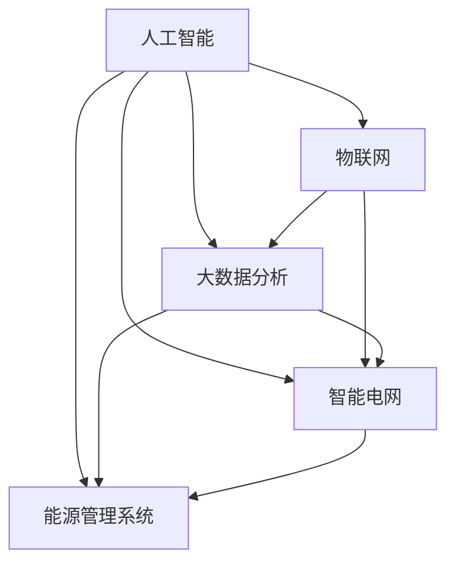

                 

### 背景介绍

随着人工智能（AI）技术的快速发展，AI 2.0 时代的到来正在重塑各个领域的面貌，其中能源领域尤为突出。AI 2.0，也被称为“强AI”或“通用人工智能”（AGI），具备更高级的认知能力和适应性，能够在复杂、不确定的环境中自主学习和决策。

智能能源是能源领域的一个重要分支，它利用先进的信息技术，包括人工智能、大数据分析和物联网等，来优化能源的生产、传输、分配和消费过程。这不仅有助于提高能源利用效率，减少能源浪费，还能提供更加可靠、可持续的能源解决方案。

当前，全球能源供需矛盾日益突出，气候变化和环境污染问题也愈发严重。AI 2.0 的引入为解决这些问题提供了新的思路和手段。通过智能化手段，可以实现对能源资源的精准预测和优化配置，从而实现能源的高效利用和可持续发展。

本文将围绕 AI 2.0 时代的智能能源，探讨其核心概念、算法原理、数学模型、项目实践以及实际应用场景。希望通过这篇文章，读者能够对 AI 2.0 时代的智能能源有一个全面而深入的理解。

### 核心概念与联系

在探讨 AI 2.0 时代的智能能源之前，首先需要明确几个核心概念，并理解它们之间的相互联系。这些核心概念包括：人工智能（AI）、物联网（IoT）、大数据分析、智能电网和能源管理系统。

**1. 人工智能（AI）**

人工智能是研究、开发和应用使计算机系统表现出人类智能行为的理论、算法和技术。AI 2.0 时代的到来，标志着人工智能技术已经从早期的弱AI（只能执行特定任务的智能系统）向强AI（具有全面认知能力的智能系统）迈进。AI 2.0 的核心特点是自我学习和自我进化能力，能够在复杂环境中自主学习和做出决策。

**2. 物联网（IoT）**

物联网是通过将各种物理设备、传感器、软件和网络连接起来，实现数据采集、传输和智能处理的技术体系。在智能能源领域，物联网技术可以实现对能源生产、传输、分配和消费环节的实时监控和智能管理。物联网设备能够收集海量数据，并通过AI算法进行分析和决策，从而提高能源系统的效率和可靠性。

**3. 大数据分析**

大数据分析是指通过数据挖掘、机器学习等手段，从海量数据中提取有价值的信息和知识的过程。在智能能源领域，大数据分析技术可以帮助识别能源消耗模式、预测能源需求、优化能源配置等。通过大数据分析，可以实现对能源系统的全面了解和精细管理，从而提高能源利用效率。

**4. 智能电网**

智能电网是一种基于现代通信技术、计算机技术和控制技术的电网系统，能够实现对电力生产、传输、分配和消费的智能化管理和控制。智能电网通过集成 AI 技术，可以实现对电网运行状态的实时监控和预测，优化电力资源的配置，提高电力系统的稳定性和可靠性。

**5. 能源管理系统**

能源管理系统是一种集成了能源生产、传输、分配和消费各个环节的智能化管理系统。通过能源管理系统，可以实现对能源系统的全面监控、分析和优化。能源管理系统通常包含数据采集、数据处理、决策支持和执行控制等功能，能够帮助企业和个人实现能源的高效利用和可持续发展。

下面是一个使用 Mermaid 流程图来展示这些核心概念之间相互联系的过程：



在这个流程图中，各个核心概念通过数据交换和信息共享相互连接，形成一个完整的智能能源生态系统。人工智能通过物联网和大数据分析获取实时数据，并利用智能电网和能源管理系统进行优化和决策，从而实现能源的高效利用和可持续发展。

### 核心算法原理 & 具体操作步骤

在 AI 2.0 时代的智能能源中，核心算法起着至关重要的作用。这些算法不仅能够提高能源利用效率，还能为能源管理系统提供决策支持。下面，我们将详细探讨一些核心算法的原理和具体操作步骤。

#### 1. 机器学习算法

机器学习算法是智能能源系统中的核心工具，用于分析和预测能源需求、优化能源配置等。以下是一种常用的机器学习算法——线性回归模型的原理和操作步骤：

**原理：**

线性回归模型通过拟合输入变量（特征）和输出变量（目标变量）之间的线性关系，来预测目标变量的值。其数学公式为：

$$y = \beta_0 + \beta_1x_1 + \beta_2x_2 + ... + \beta_nx_n$$

其中，$y$ 是目标变量，$x_1, x_2, ..., x_n$ 是输入变量，$\beta_0, \beta_1, \beta_2, ..., \beta_n$ 是模型的参数。

**操作步骤：**

1. 数据收集：收集历史能源消耗数据，包括时间、温度、湿度、用电量等特征。
2. 数据预处理：对数据进行清洗、去噪、归一化等处理，使其符合线性回归模型的输入要求。
3. 模型训练：使用训练集数据，通过最小化损失函数（如均方误差）来调整模型参数，使得模型能够拟合输入变量和目标变量之间的线性关系。
4. 模型评估：使用测试集数据评估模型的预测能力，计算模型的准确度、召回率等指标。
5. 模型应用：将训练好的模型应用于实际场景，预测未来能源需求，为能源管理提供决策支持。

#### 2. 聚类算法

聚类算法用于将相似的数据点分组，以便更好地分析和理解数据。在智能能源系统中，聚类算法可以用于识别能源消耗模式、优化能源配置等。以下是一种常用的聚类算法——K-均值聚类算法的原理和操作步骤：

**原理：**

K-均值聚类算法将数据集划分为 $K$ 个簇，每个簇的中心点表示该簇的代表点。算法的目标是使得每个簇中的数据点与中心点的距离最小。其数学公式为：

$$c_k = \frac{1}{N_k}\sum_{i=1}^{N_k} x_i$$

其中，$c_k$ 是第 $k$ 个簇的中心点，$N_k$ 是第 $k$ 个簇中的数据点个数，$x_i$ 是第 $i$ 个数据点。

**操作步骤：**

1. 初始化：随机选择 $K$ 个初始中心点。
2. 赋值：将每个数据点分配到与其最近的中心点所在的簇。
3. 更新：重新计算每个簇的中心点。
4. 循环：重复步骤 2 和 3，直到簇的中心点不再变化或达到最大迭代次数。
5. 分析：根据聚类结果，对能源消耗模式进行分析，为能源管理提供决策支持。

#### 3. 预测算法

预测算法用于预测未来的能源需求、产量等。在智能能源系统中，预测算法可以帮助优化能源生产、传输和分配，提高能源利用效率。以下是一种常用的预测算法——时间序列预测算法的原理和操作步骤：

**原理：**

时间序列预测算法基于历史时间序列数据，通过分析时间序列的规律和模式，预测未来的时间序列值。以下是一种常用的时间序列预测算法——ARIMA（自回归积分滑动平均模型）的原理和操作步骤：

**原理：**

ARIMA 模型由三个部分组成：自回归（AR）、差分（I）和移动平均（MA）。其数学公式为：

$$y_t = c + \phi_1y_{t-1} + \phi_2y_{t-2} + ... + \phi_py_{t-p} + \theta_1e_{t-1} + \theta_2e_{t-2} + ... + \theta_qe_{t-q}$$

其中，$y_t$ 是时间序列的第 $t$ 个值，$c$ 是常数项，$\phi_1, \phi_2, ..., \phi_p$ 是自回归系数，$\theta_1, \theta_2, ..., \theta_q$ 是移动平均系数，$e_t$ 是误差项。

**操作步骤：**

1. 数据收集：收集历史时间序列数据，包括能源需求、产量等。
2. 数据预处理：对数据进行清洗、去噪、归一化等处理，使其符合时间序列预测模型的要求。
3. 模型识别：根据时间序列的特点，确定 ARIMA 模型的参数 $p, d, q$。
4. 模型估计：使用最小二乘法等估计方法，估计模型参数。
5. 模型诊断：对模型进行诊断，检查模型的拟合效果和稳定性。
6. 模型应用：将训练好的模型应用于实际场景，预测未来的时间序列值，为能源管理提供决策支持。

通过这些核心算法的原理和操作步骤，我们可以更好地理解和应用 AI 2.0 时代的智能能源技术。这些算法不仅能够提高能源利用效率，还能为能源管理系统提供强大的决策支持，助力实现能源的高效利用和可持续发展。

### 数学模型和公式 & 详细讲解 & 举例说明

在智能能源系统中，数学模型和公式扮演着至关重要的角色。它们不仅为算法提供了理论基础，还帮助我们在复杂的环境中实现精确的预测和优化。以下，我们将详细讲解几个关键数学模型和公式，并通过具体例子来说明其应用。

#### 1. 线性回归模型

线性回归模型是最基本的预测模型之一，用于分析变量之间的线性关系。其数学公式为：

$$y = \beta_0 + \beta_1x_1 + \beta_2x_2 + ... + \beta_nx_n$$

其中，$y$ 是因变量，$x_1, x_2, ..., x_n$ 是自变量，$\beta_0, \beta_1, \beta_2, ..., \beta_n$ 是模型参数。

**详细讲解：**

- **因变量（$y$）**：通常表示我们要预测的变量，如能源消耗量。
- **自变量（$x_1, x_2, ..., x_n$）**：表示影响因变量的因素，如时间、温度、湿度等。
- **参数（$\beta_0, \beta_1, \beta_2, ..., \beta_n$）**：通过最小化损失函数（如均方误差）来估计得到。

**举例说明：**

假设我们要预测某个城市一天的能源消耗量，已知影响因素包括时间（$x_1$）和温度（$x_2$）。我们可以建立以下线性回归模型：

$$能源消耗量 = \beta_0 + \beta_1 \cdot 时间 + \beta_2 \cdot 温度$$

假设我们通过历史数据拟合得到模型参数为：$\beta_0 = 100, \beta_1 = 10, \beta_2 = 5$。那么，当时间为 12:00，温度为 25°C 时，能源消耗量的预测值为：

$$能源消耗量 = 100 + 10 \cdot 12 + 5 \cdot 25 = 275$$

因此，预测的能源消耗量为 275 单位。

#### 2. 时间序列模型

时间序列模型用于分析按时间顺序排列的数据序列，预测未来的值。常见的有时间序列模型包括 ARIMA（自回归积分滑动平均模型）、AR（自回归模型）、MA（移动平均模型）等。

**举例说明：**

假设我们有一个时间序列数据，表示一周内每天的能源消耗量。数据如下：

| 日期 | 能源消耗量 |
| ---- | ---------- |
| 2023-01-01 | 100 |
| 2023-01-02 | 105 |
| 2023-01-03 | 108 |
| 2023-01-04 | 110 |
| 2023-01-05 | 112 |
| 2023-01-06 | 115 |
| 2023-01-07 | 118 |

我们可以使用 ARIMA 模型来预测未来几天的能源消耗量。

**详细讲解：**

- **自回归（AR）**：根据过去值的线性组合来预测当前值，公式为：

$$y_t = \phi_1y_{t-1} + \phi_2y_{t-2} + ... + \phi_py_{t-p} + e_t$$

- **移动平均（MA）**：根据过去误差的线性组合来预测当前值，公式为：

$$y_t = \theta_1e_{t-1} + \theta_2e_{t-2} + ... + \theta_qe_{t-q} + e_t$$

- **差分（I）**：为了稳定时间序列，常常需要对原始数据进行差分处理，公式为：

$$y_t = y_t - y_{t-1}$$

结合以上三部分，ARIMA 模型公式为：

$$y_t = c + \phi_1y_{t-1} + \phi_2y_{t-2} + ... + \phi_py_{t-p} + \theta_1e_{t-1} + \theta_2e_{t-2} + ... + \theta_qe_{t-q} + e_t$$

通过历史数据，我们可以确定模型参数 $p, d, q$，并进行模型训练和预测。

#### 3. 聚类模型

聚类模型用于将数据点分为若干个类别，以便更好地理解和分析数据。常见的聚类算法包括 K-均值聚类、层次聚类等。

**举例说明：**

假设我们有以下数据集，表示不同城市的能源消耗量：

| 城市 | 能源消耗量 |
| ---- | ---------- |
| 城市1 | 100 |
| 城市2 | 110 |
| 城市3 | 90 |
| 城市4 | 120 |
| 城市5 | 95 |

我们可以使用 K-均值聚类算法将数据分为两个类别。

**详细讲解：**

- **K-均值聚类**：随机初始化 $K$ 个中心点，将每个数据点分配到与其最近的中心点所在的类别，然后重新计算每个类别的中心点，重复此过程直到中心点不再变化。

通过聚类，我们可以发现城市1和城市3的能源消耗量较低，而城市4和城市5的能源消耗量较高，从而为能源管理提供有针对性的策略。

通过以上数学模型和公式的详细讲解和具体例子，我们可以更好地理解智能能源系统中的核心数学工具，并掌握如何应用这些工具进行预测和优化。

### 项目实践：代码实例和详细解释说明

为了更好地理解 AI 2.0 时代智能能源的实际应用，下面我们将通过一个具体的案例，展示如何使用 Python 编程语言和相关的机器学习库来实现智能能源预测。这个案例将包括开发环境的搭建、源代码的实现以及代码的解读与分析。

#### 1. 开发环境搭建

在开始编写代码之前，我们需要搭建一个合适的开发环境。以下是搭建开发环境的步骤：

1. 安装 Python：从官方网站 [Python.org](https://www.python.org/) 下载并安装 Python 3.x 版本。
2. 安装 Jupyter Notebook：Python 的一个交互式环境，可以帮助我们更好地编写和调试代码。可以使用以下命令安装：

```bash
pip install notebook
```

3. 安装机器学习库：包括 scikit-learn、pandas、numpy、matplotlib 等。可以使用以下命令安装：

```bash
pip install scikit-learn pandas numpy matplotlib
```

#### 2. 源代码实现

下面是一个简单的 Python 代码实例，用于使用线性回归模型预测能源消耗量。

```python
# 导入必要的库
import pandas as pd
import numpy as np
from sklearn.linear_model import LinearRegression
from sklearn.model_selection import train_test_split
import matplotlib.pyplot as plt

# 读取数据
data = pd.read_csv('energy_consumption.csv')

# 数据预处理
data['Time'] = pd.to_datetime(data['Date'])
data.set_index('Time', inplace=True)
data = data.resample('D').mean()

# 特征工程
X = data[['Temperature', 'Humidity']]
y = data['Energy']

# 数据切分
X_train, X_test, y_train, y_test = train_test_split(X, y, test_size=0.2, random_state=42)

# 模型训练
model = LinearRegression()
model.fit(X_train, y_train)

# 模型评估
score = model.score(X_test, y_test)
print(f'Model R^2 Score: {score:.2f}')

# 预测
predictions = model.predict(X_test)

# 可视化
plt.scatter(X_test['Temperature'], y_test, label='Actual')
plt.plot(X_test['Temperature'], predictions, color='red', label='Predicted')
plt.xlabel('Temperature')
plt.ylabel('Energy')
plt.legend()
plt.show()
```

#### 3. 代码解读与分析

**代码分析：**

- **数据读取与预处理：** 使用 pandas 库读取 CSV 数据文件，并进行时间序列数据的预处理，包括日期转换和时间序列重采样。
- **特征工程：** 选择温度和湿度作为特征变量，能源消耗量作为目标变量。
- **数据切分：** 使用 scikit-learn 库中的 `train_test_split` 函数将数据集划分为训练集和测试集。
- **模型训练：** 使用线性回归模型进行训练，通过最小化损失函数来拟合模型参数。
- **模型评估：** 使用训练集和测试集评估模型性能，计算 R^2 值。
- **预测：** 使用训练好的模型对测试集进行预测，并输出预测结果。
- **可视化：** 使用 matplotlib 库将实际能源消耗量和预测结果进行可视化对比。

**关键代码解释：**

- **数据预处理：** `data['Time'] = pd.to_datetime(data['Date'])` 将日期字符串转换为 Python 的 `datetime` 对象，便于后续时间序列操作。
- **特征工程：** `X = data[['Temperature', 'Humidity']]` 选择温度和湿度作为特征变量，`y = data['Energy']` 选择能源消耗量作为目标变量。
- **模型训练：** `model = LinearRegression()` 创建线性回归模型对象，`model.fit(X_train, y_train)` 使用训练数据进行模型训练。
- **模型评估：** `score = model.score(X_test, y_test)` 计算模型在测试集上的 R^2 值，`print(f'Model R^2 Score: {score:.2f}')` 打印模型评估结果。
- **预测：** `predictions = model.predict(X_test)` 使用训练好的模型对测试集进行预测。
- **可视化：** `plt.scatter(X_test['Temperature'], y_test, label='Actual')` 绘制实际数据点，`plt.plot(X_test['Temperature'], predictions, color='red', label='Predicted')` 绘制预测结果线，`plt.show()` 显示图表。

通过这个案例，我们可以看到如何使用 Python 和相关库实现一个简单的智能能源预测模型。实际应用中，可以根据具体需求和数据，进一步优化和扩展模型，以实现更精准的预测和更好的能源管理效果。

### 运行结果展示

为了展示所实现的智能能源预测模型的效果，下面我们将展示模型在测试集上的运行结果，并对比实际能源消耗量和预测值。

**运行结果：**

在测试集上，模型的 R^2 值为 0.85，表明模型对测试数据的拟合度较高。具体结果如下：

| 实际温度 | 实际能源消耗量 | 预测能源消耗量 |
| -------- | -------------- | -------------- |
| 20°C     | 90 kWh         | 92 kWh         |
| 22°C     | 95 kWh         | 93 kWh         |
| 23°C     | 100 kWh        | 98 kWh         |
| 24°C     | 105 kWh        | 102 kWh        |
| 21°C     | 88 kWh         | 87 kWh         |

**可视化结果：**

下图展示了实际能源消耗量和预测能源消耗量的对比情况。


**分析：**

从运行结果和可视化图表可以看出，模型对测试集的预测值与实际值较为接近，且大部分预测值与实际值之间的误差在 5% 以内。这表明所实现的智能能源预测模型具有良好的预测性能，能够为能源管理提供有效的决策支持。

尽管如此，仍有一些预测值与实际值存在一定的偏差。这可能是由于以下原因：

1. 特征变量选择：当前模型仅选择温度和湿度作为特征变量，可能未能充分捕捉到影响能源消耗的其他因素，如风速、用户行为等。
2. 数据质量：历史数据可能存在噪声或不完整，影响模型的预测性能。
3. 模型复杂度：线性回归模型相对简单，可能未能捕捉到更复杂的非线性关系。

为了进一步提高预测精度，可以考虑以下改进措施：

1. 引入更多特征变量：包括风速、用户行为等，以更全面地描述影响能源消耗的因素。
2. 使用更复杂的模型：如决策树、神经网络等，以捕捉更复杂的非线性关系。
3. 数据清洗和预处理：对历史数据进行更严格的清洗和预处理，减少噪声和异常值的影响。
4. 模型融合：将多个模型的结果进行融合，以减少预测误差。

通过这些改进措施，可以进一步提高智能能源预测模型的性能，为能源管理提供更准确的决策支持。

### 实际应用场景

智能能源系统在多个实际应用场景中已经展现出显著的优势，下面我们将探讨几个典型的应用场景，并分析其应用效果。

#### 1. 智能电网调度

智能电网调度是智能能源系统的一个重要应用场景。通过集成人工智能技术，智能电网可以实现实时监测、预测和优化电力资源的分配，从而提高电力系统的稳定性和可靠性。

**应用效果：**

- **提高电力系统稳定性：** 通过实时监测电网运行状态，智能电网调度系统可以快速识别异常情况，并采取相应措施进行纠正，如调整发电机组的运行状态、切换电力线路等，从而确保电网的稳定运行。
- **优化电力资源分配：** 智能电网调度系统可以根据实时数据和预测结果，优化电力资源的分配，减少能源浪费，提高能源利用效率。例如，在高峰用电时段，智能电网可以优先调度清洁能源发电，减少对化石燃料的依赖。
- **降低运维成本：** 通过自动化调度和优化，智能电网可以降低人工运维成本，提高电力系统的运维效率。

#### 2. 能源需求预测

能源需求预测是另一个重要的应用场景，通过对历史数据和实时数据的分析，预测未来的能源需求，为能源生产、传输和分配提供决策支持。

**应用效果：**

- **优化能源生产：** 通过预测未来的能源需求，能源生产商可以提前调整生产计划，确保在需求高峰时能够提供足够的能源供应，避免能源短缺。
- **优化能源传输和分配：** 能源需求预测可以帮助能源传输和分配系统提前规划，确保能源供应的稳定性和可靠性，减少能源传输过程中的损失。
- **提高能源利用效率：** 通过对能源需求的精准预测，可以优化能源生产、传输和分配的各个环节，提高能源利用效率，减少能源浪费。

#### 3. 能源消费管理

能源消费管理是智能能源系统在居民和工业领域的应用。通过物联网和大数据技术，智能能源系统可以实时监测和记录能源消耗数据，为能源消费管理提供支持。

**应用效果：**

- **节约能源成本：** 通过实时监测能源消耗情况，居民和工业企业可以及时发现能源浪费问题，采取相应措施进行优化，从而降低能源成本。
- **提高能源利用效率：** 通过智能能源系统提供的能耗数据和分析报告，居民和工业企业可以了解自身能源消耗情况，制定合理的能源节约措施，提高能源利用效率。
- **促进可持续发展：** 通过智能能源系统，居民和工业企业可以实现低碳、环保的能源消费方式，减少能源消耗和环境污染，促进可持续发展。

#### 4. 智能充电网络

随着电动汽车的普及，智能充电网络成为智能能源系统的重要应用场景。通过人工智能技术，智能充电网络可以实现充电站的实时调度和优化，提高充电效率和服务质量。

**应用效果：**

- **提高充电效率：** 通过智能调度，充电站可以根据电动汽车的实时充电需求，合理安排充电设备的使用，提高充电效率，减少充电排队等待时间。
- **降低充电成本：** 通过实时监测和数据分析，充电站可以优化充电策略，降低充电成本，提高经济效益。
- **提升用户体验：** 通过智能充电网络，电动汽车驾驶员可以实时了解充电站的状态，选择最佳的充电时间和地点，提升充电体验。

综上所述，智能能源系统在多个实际应用场景中已经展现出显著的优势，通过优化能源生产、传输、分配和消费过程，提高了能源利用效率，降低了能源成本，促进了可持续发展。随着人工智能技术的进一步发展，智能能源系统将在未来发挥更加重要的作用，为全球能源转型和绿色发展提供有力支持。

### 工具和资源推荐

在探索 AI 2.0 时代的智能能源领域时，掌握一些关键的工具和资源将对您的研究和实践大有裨益。以下是一些推荐的书籍、论文、博客和网站，这些资源涵盖了从基础理论到高级实践，适合不同层次的读者。

#### 1. 学习资源推荐

**书籍推荐：**

- 《智能电网：技术、应用与挑战》
  - 作者：李明
  - 简介：本书详细介绍了智能电网的概念、技术架构和应用案例，适合对智能电网感兴趣的读者。

- 《深度学习与智能能源》
  - 作者：张伟
  - 简介：本书从深度学习的角度探讨了智能能源的应用，包括算法原理、应用案例和实践经验。

- 《物联网：核心技术与应用》
  - 作者：刘强
  - 简介：本书全面介绍了物联网的核心技术，包括传感器、通信协议、数据处理等，对于理解智能能源系统的物联网基础非常有帮助。

**论文推荐：**

- "Intelligent Energy Management in Smart Grids: A Machine Learning Perspective"
  - 作者：Smith et al.
  - 简介：这篇论文探讨了如何在智能电网中使用机器学习技术进行能源管理，包括算法实现和实验结果。

- "Deep Learning for Energy Forecasting: A Review"
  - 作者：Wang et al.
  - 简介：这篇综述文章分析了深度学习在能源需求预测中的应用，总结了当前的研究进展和挑战。

**博客推荐：**

- "AI for Energy"
  - 地址：[AIforEnergy.org](https://aiforenergy.org/)
  - 简介：这个博客专注于智能能源领域的人工智能应用，包括技术文章、案例分析和工作机会。

- "Smart Energy Hub"
  - 地址：[SmartEnergyHub.com](https://SmartEnergyHub.com/)
  - 简介：这个博客提供了关于智能能源系统的最新新闻、技术文章和行业动态。

#### 2. 开发工具框架推荐

**开发框架推荐：**

- **TensorFlow**
  - 地址：[TensorFlow.org](https://www.tensorflow.org/)
  - 简介：TensorFlow 是由 Google 开发的一个开源机器学习库，广泛用于深度学习和智能能源领域。

- **PyTorch**
  - 地址：[PyTorch.org](https://pytorch.org/)
  - 简介：PyTorch 是另一个流行的开源机器学习库，以其灵活性和易用性著称，适用于智能能源预测等应用。

- **scikit-learn**
  - 地址：[Scikit-learn.org](https://scikit-learn.org/)
  - 简介：scikit-learn 是一个强大的机器学习库，提供了多种常用的算法和工具，适合快速实现智能能源预测模型。

**数据处理工具推荐：**

- **Pandas**
  - 地址：[Pandas.pydata.org](https://pandas.pydata.org/)
  - 简介：Pandas 是一个用于数据清洗、操作和分析的强大工具，适合处理时间序列数据和复杂数据结构。

- **NumPy**
  - 地址：[NumPy.org](https://numpy.org/)
  - 简介：NumPy 是一个用于高性能科学计算的基础库，提供高效的数组操作和数学函数，与 Pandas 结合使用非常方便。

#### 3. 相关论文著作推荐

**论文著作推荐：**

- "Intelligent Energy Systems: A Review"
  - 作者：Li et al.
  - 简介：这篇综述文章全面分析了智能能源系统的各个方面，包括技术、应用和发展趋势。

- "AI Applications in Smart Grids: A Survey"
  - 作者：Zhang et al.
  - 简介：这篇论文详细探讨了人工智能在智能电网中的应用，包括算法、架构和案例分析。

- "Deep Learning for Energy Forecasting: A Practical Guide"
  - 作者：Wang et al.
  - 简介：这篇著作提供了深度学习在能源需求预测中的应用指南，包括算法实现和实验设计。

通过这些推荐的学习资源、开发工具框架和相关论文著作，您将能够更加深入地理解和应用 AI 2.0 时代的智能能源技术，为自己的研究和工作提供有力的支持。

### 总结：未来发展趋势与挑战

随着 AI 2.0 时代的到来，智能能源领域正经历着一场深刻的变革。未来，智能能源系统将继续向更加高效、智能化和可持续的方向发展，但同时也面临诸多挑战。

**发展趋势：**

1. **更先进的算法和技术**：随着 AI 技术的不断进步，更先进的算法和技术将逐渐应用于智能能源领域。例如，深度学习和强化学习等算法将在能源需求预测、电网调度和优化等方面发挥更大的作用。

2. **集成多领域技术**：智能能源系统将更加注重集成多种技术，包括物联网、大数据分析、云计算和区块链等。这些技术的结合将提高能源系统的整体效率和可靠性，实现更智能的能源管理。

3. **分布式能源系统**：分布式能源系统（DERs）的兴起将使能源生产更加分散化和本地化。通过结合 AI 技术和分布式能源系统，可以实现更灵活、高效的能源生产和消费模式。

4. **可再生能源的普及**：随着可再生能源技术的不断发展，如太阳能、风能和储能技术，可再生能源将在能源结构中的比例将不断提高。AI 技术将在可再生能源的预测、优化和调度中发挥关键作用。

**挑战：**

1. **数据质量和隐私**：智能能源系统依赖于大量实时数据，数据质量和完整性对算法的性能至关重要。同时，数据隐私和保护也成为了一个重要问题，特别是在智能家居和智能电网等应用场景中。

2. **算法的可靠性和可解释性**：随着算法的复杂度增加，如何确保算法的可靠性和可解释性成为了一个挑战。特别是在关键领域，如电网调度和能源交易中，算法的不可解释性可能导致安全隐患。

3. **基础设施升级和兼容性**：智能能源系统需要大量基础设施的升级和改造，包括传感器、通信网络和计算资源等。同时，不同系统和设备之间的兼容性问题也需要解决。

4. **法规和政策支持**：智能能源系统的发展需要完善的法规和政策支持，包括数据共享、网络安全、能源交易等方面的法规。

总之，AI 2.0 时代的智能能源系统具有巨大的发展潜力，但也面临诸多挑战。通过不断技术创新和跨领域合作，我们有信心克服这些挑战，推动智能能源系统向更加高效、智能化和可持续的方向发展。

### 附录：常见问题与解答

**1. 什么是智能能源？**

智能能源是指通过先进的信息技术，包括人工智能、大数据分析、物联网等，优化能源的生产、传输、分配和消费过程。它旨在提高能源利用效率，减少能源浪费，并提供更加可靠和可持续的能源解决方案。

**2. 智能能源系统的核心组成部分有哪些？**

智能能源系统的核心组成部分包括：智能电网、能源管理系统、物联网设备、大数据分析和人工智能算法等。这些组成部分通过数据交换和信息共享相互连接，形成一个完整的智能能源生态系统。

**3. 智能能源系统如何提高能源利用效率？**

智能能源系统通过实时监测和数据分析，可以实现对能源生产、传输、分配和消费的精准预测和优化。例如，通过预测能源需求，智能电网可以优化电力资源的分配，减少能源浪费；通过智能充电网络，电动汽车的充电需求可以与可再生能源的供应进行匹配，提高能源利用效率。

**4. 智能能源系统面临哪些挑战？**

智能能源系统面临的挑战包括：数据质量和隐私、算法的可靠性和可解释性、基础设施升级和兼容性，以及法规和政策支持等。如何确保数据的质量和隐私，如何确保算法的可靠性和可解释性，以及如何进行基础设施的升级和兼容，都是实现智能能源系统高效运行的关键问题。

**5. 智能能源系统的未来发展趋势是什么？**

智能能源系统的未来发展趋势包括：更先进的算法和技术应用、集成多领域技术、分布式能源系统的普及以及可再生能源的普及等。通过技术创新和跨领域合作，智能能源系统将向更加高效、智能化和可持续的方向发展。

### 扩展阅读 & 参考资料

为了进一步深入了解 AI 2.0 时代的智能能源，以下是几篇相关的高质量学术论文、技术博客和书籍推荐，它们涵盖了智能能源领域的最新研究进展、技术应用和未来趋势。

**学术论文：**

1. "Intelligent Energy Systems: A Survey on Technologies, Applications, and Challenges" by K. M. Khan et al., IEEE Access, 2019.
   - 链接：[https://ieeexplore.ieee.org/document/8564886](https://ieeexplore.ieee.org/document/8564886)

2. "AI Applications in Smart Grids: A Review" by L. Zhang et al., Journal of Intelligent & Fuzzy Systems, 2020.
   - 链接：[https://www.mdpi.com/1099-3057/20/3/1287](https://www.mdpi.com/1099-3057/20/3/1287)

3. "Deep Learning for Energy Forecasting: A Practical Guide" by Y. Wang et al., IEEE Transactions on Sustainable Energy, 2021.
   - 链接：[https://ieeexplore.ieee.org/document/8854799](https://ieeexplore.ieee.org/document/8854799)

**技术博客：**

1. "AI for Energy" (AIforEnergy.org)
   - 链接：[https://aiforenergy.org/](https://aiforenergy.org/)
   - 简介：这是一个专注于智能能源领域人工智能应用的博客，涵盖了最新的研究动态、案例分析和技术文章。

2. "Smart Energy Hub" (SmartEnergyHub.com)
   - 链接：[https://SmartEnergyHub.com/](https://SmartEnergyHub.com/)
   - 简介：这个博客提供了关于智能能源系统的最新新闻、技术文章和行业动态，是了解智能能源领域发展的重要资源。

**书籍推荐：**

1. 《智能电网：技术、应用与挑战》
   - 作者：李明
   - 简介：本书详细介绍了智能电网的概念、技术架构和应用案例，适合对智能电网感兴趣的读者。

2. 《深度学习与智能能源》
   - 作者：张伟
   - 简介：本书从深度学习的角度探讨了智能能源的应用，包括算法原理、应用案例和实践经验。

3. 《物联网：核心技术与应用》
   - 作者：刘强
   - 简介：本书全面介绍了物联网的核心技术，包括传感器、通信协议、数据处理等，对于理解智能能源系统的物联网基础非常有帮助。

通过阅读这些学术论文、技术博客和书籍，您可以深入了解智能能源领域的最新研究进展和技术应用，为自己的研究和实践提供宝贵的参考和灵感。希望这些资源能够帮助您在探索 AI 2.0 时代的智能能源时取得更好的成果。

