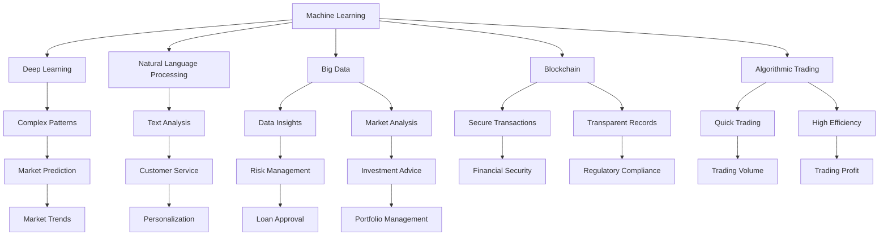

                 

### 背景介绍 Background Introduction

随着人工智能技术的飞速发展，AI 2.0 时代已经悄然来临。在这个时代，人工智能不再仅仅是模仿人类思维，而是开始展现出超越人类智慧的可能性。金融行业，作为经济活动的核心领域，自然也受到了这一变革的深刻影响。AI 2.0 的智能金融，不仅改变了传统的金融业务模式，还推动了金融创新，提升了金融服务的效率和质量。

#### 智能金融的定义 Definition of Intelligent Finance

智能金融是指利用人工智能技术，如机器学习、深度学习、自然语言处理等，对金融数据进行分析和处理，从而实现金融业务自动化、智能化和个性化的过程。它涵盖了从风险管理、投资决策到客户服务的各个方面，通过人工智能的赋能，极大地提高了金融行业的运营效率。

#### AI 2.0 时代的特点 Characteristics of AI 2.0 Era

在 AI 2.0 时代，人工智能技术取得了重大突破，主要体现在以下几个方面：

1. **计算能力的提升**：随着计算能力的提升，AI 模型可以处理更大规模的数据，更加精细地分析市场动态。
2. **数据资源的丰富**：互联网和大数据技术的发展，使得金融行业可以获得更多、更准确的数据资源。
3. **算法的进步**：深度学习等算法的进步，使得 AI 能够更准确地捕捉金融市场的规律，提供更精准的预测和分析。
4. **跨界融合**：人工智能与金融、医疗、教育等领域的深度融合，催生出新的业务模式和商业模式。

#### 智能金融的重要性 Importance of Intelligent Finance

智能金融的重要性体现在以下几个方面：

1. **提升金融服务质量**：通过人工智能技术，金融机构可以提供更加个性化和高效的金融服务，提升客户体验。
2. **提高风险管理能力**：AI 技术可以自动识别和预测金融风险，帮助金融机构更好地管理风险，降低损失。
3. **促进金融创新**：智能金融为金融行业带来了新的业务模式和商业模式，推动了金融创新。
4. **降低运营成本**：智能金融可以自动化许多传统金融业务，降低金融机构的运营成本。

#### 金融行业面临的挑战 Challenges in the Financial Industry

尽管智能金融带来了巨大的机遇，但金融行业也面临着一些挑战：

1. **数据隐私和安全**：随着数据的广泛应用，数据隐私和安全问题变得尤为重要。
2. **技术人才短缺**：人工智能技术的发展需要大量的技术人才，而当前金融行业的技术人才供给不足。
3. **法律法规的完善**：随着智能金融的快速发展，需要不断完善相关法律法规，以保障市场的公平和透明。

在接下来的章节中，我们将深入探讨智能金融的核心概念、算法原理、数学模型、项目实践、应用场景和未来发展趋势。通过逐步分析推理思考的方式，希望能够为您带来对 AI 2.0 时代的智能金融的全面理解。### 核心概念与联系 Core Concepts and Connections

在深入了解智能金融之前，我们需要明确几个核心概念，并理解它们之间的联系。以下是智能金融领域的一些关键概念和它们之间的关系，我们将使用 Mermaid 流程图来展示这些概念之间的交互和影响。

#### 核心概念 Core Concepts

1. **机器学习**（Machine Learning）：机器学习是人工智能的一个重要分支，它使计算机系统能够从数据中学习并做出决策。
2. **深度学习**（Deep Learning）：深度学习是机器学习的一种方法，它通过多层神经网络来模拟人脑的学习过程。
3. **自然语言处理**（Natural Language Processing, NLP）：NLP 是人工智能的一个分支，它使计算机能够理解、解释和生成人类语言。
4. **大数据**（Big Data）：大数据是指大量、高速、多样化的数据，这些数据需要通过先进的技术进行处理和分析。
5. **区块链**（Blockchain）：区块链是一种分布式账本技术，可以安全地记录交易信息，并在金融领域有广泛应用。
6. **智能合约**（Smart Contract）：智能合约是区块链上的计算机程序，它可以在满足特定条件时自动执行交易。
7. **算法交易**（Algorithmic Trading）：算法交易是指利用计算机算法自动执行交易决策，以实现快速、高效和精准的交易。

#### 关系链接 Relationship Links

以下是智能金融领域核心概念之间的 Mermaid 流程图，描述了它们之间的相互联系和影响：



#### 解释 Explanation

1. **机器学习（A）**和**深度学习（B）**：深度学习是机器学习的一种高级形式，它通过多层神经网络来学习数据特征，从而实现复杂模式的识别和预测。
2. **自然语言处理（C）**：NLP 用于处理和理解人类语言，这在金融领域的应用包括客户服务、投资建议和市场分析。
3. **大数据（D）**：大数据为金融行业提供了丰富的数据资源，通过分析这些数据，可以获取深入的洞察，从而提高投资决策和风险管理。
4. **区块链（E）**：区块链技术提供了安全的交易记录和透明的记录方式，这在金融交易和合规性方面具有重要意义。
5. **智能合约（F）**：智能合约可以自动执行交易，减少了人为干预，提高了交易效率和透明度。
6. **算法交易（G）**：算法交易利用计算机算法自动执行交易，这提高了交易的速度和效率，并且减少了人为错误。

通过上述核心概念的相互关联，我们可以看到 AI 2.0 时代的智能金融是一个复杂而动态的系统，它通过多种技术手段来优化金融服务的各个方面。

### 总结 Summary

在本文的背景介绍和核心概念部分，我们探讨了 AI 2.0 时代的智能金融的定义、特点、重要性以及金融行业面临的挑战。通过 Mermaid 流程图，我们明确了智能金融领域的关键概念及其相互关系。接下来，我们将深入探讨智能金融的核心算法原理、具体操作步骤、数学模型和公式，以及项目实践，通过逐步分析推理思考的方式，为您带来更全面的理解。### 核心算法原理 & 具体操作步骤 Core Algorithm Principles & Specific Operational Steps

在了解了智能金融的核心概念之后，我们将深入探讨其中的核心算法原理及其具体操作步骤。这些算法是智能金融实现自动化、智能化和个性化服务的关键。以下是几个关键算法及其操作步骤的详细介绍。

#### 1. 机器学习算法（Machine Learning Algorithms）

**原理**：机器学习算法通过训练模型来识别数据中的模式和规律，从而进行预测或分类。常见的机器学习算法包括线性回归、逻辑回归、决策树、随机森林、支持向量机等。

**操作步骤**：

1. **数据收集**：收集金融数据，包括历史交易数据、客户数据、市场数据等。
2. **数据预处理**：清洗数据，处理缺失值、异常值，并进行特征工程，提取有用特征。
3. **模型选择**：根据数据特点和业务需求选择合适的机器学习算法。
4. **模型训练**：使用训练数据集训练模型，调整模型参数以优化性能。
5. **模型评估**：使用验证数据集评估模型性能，调整模型参数以达到最佳效果。
6. **模型部署**：将训练好的模型部署到生产环境中，进行实时预测或分类。

#### 2. 深度学习算法（Deep Learning Algorithms）

**原理**：深度学习算法通过多层神经网络来学习和提取数据的高级特征，从而实现复杂的模式识别和预测。常见的深度学习算法包括卷积神经网络（CNN）、循环神经网络（RNN）、长短期记忆网络（LSTM）等。

**操作步骤**：

1. **数据收集**：与机器学习算法类似，收集并处理金融数据。
2. **模型设计**：设计神经网络结构，确定输入层、隐藏层和输出层的配置。
3. **模型训练**：使用训练数据集训练神经网络，调整权重和偏置。
4. **模型评估**：使用验证数据集评估模型性能，优化网络结构。
5. **模型部署**：部署训练好的深度学习模型，进行实时预测或分类。

#### 3. 自然语言处理算法（Natural Language Processing Algorithms）

**原理**：自然语言处理算法用于处理和理解人类语言，包括文本分类、情感分析、命名实体识别等。常见的 NLP 算法包括词袋模型、卷积神经网络（CNN）、长短时记忆网络（LSTM）等。

**操作步骤**：

1. **文本预处理**：清洗文本数据，去除停用词、标点符号，进行分词或词性标注。
2. **特征提取**：将预处理后的文本数据转换为向量表示，可以使用词袋模型或词嵌入技术。
3. **模型训练**：训练 NLP 模型，调整参数以优化性能。
4. **模型评估**：使用验证数据集评估模型性能。
5. **模型部署**：将训练好的 NLP 模型部署到生产环境中，进行实时文本分析。

#### 4. 算法交易算法（Algorithmic Trading Algorithms）

**原理**：算法交易算法通过自动执行交易策略，实现快速、高效和精准的交易。常见的算法交易策略包括趋势跟踪、均值回归、动量交易等。

**操作步骤**：

1. **数据收集**：收集市场数据，包括价格、成交量、交易时间等。
2. **策略设计**：根据市场数据和交易规则设计交易策略。
3. **策略回测**：使用历史数据对交易策略进行回测，评估策略的收益和风险。
4. **策略优化**：根据回测结果调整策略参数，优化策略性能。
5. **策略部署**：将优化后的策略部署到交易系统中，进行实时交易。

#### 5. 智能风控算法（Intelligent Risk Control Algorithms）

**原理**：智能风控算法通过分析客户行为、市场数据等因素，实时监控和评估风险，从而实现智能风控。常见的智能风控算法包括异常检测、信用评分、风险评估等。

**操作步骤**：

1. **数据收集**：收集客户行为数据、市场数据、信用数据等。
2. **特征提取**：提取与风险相关的特征，包括客户行为、交易特征、市场动态等。
3. **模型训练**：训练风险预测模型，调整模型参数以优化性能。
4. **风险监控**：实时监控客户行为和市场动态，识别潜在风险。
5. **风险处置**：根据风险预测结果采取相应的风险处置措施。

通过以上核心算法的原理和操作步骤的详细介绍，我们可以看到智能金融的实现需要多种算法的综合运用。这些算法通过对海量金融数据的分析，帮助金融机构提高决策效率、优化业务流程、降低风险，从而提升金融服务质量。在接下来的章节中，我们将继续探讨智能金融的数学模型和公式，以及具体的项目实践。### 数学模型和公式 & 详细讲解 & 举例说明 Mathematical Models & Formulas & Detailed Explanation & Example Illustration

在智能金融领域，数学模型和公式扮演着至关重要的角色。这些模型和公式不仅帮助分析师和决策者理解金融数据，而且可以预测市场走势、评估风险、优化投资组合等。下面我们将详细讲解几个关键的数学模型和公式，并通过实例来说明它们的应用。

#### 1. 线性回归模型（Linear Regression Model）

**原理**：线性回归模型用于分析两个或多个变量之间的关系，通过建立一个线性关系来预测因变量的值。其基本公式为：

\[ Y = \beta_0 + \beta_1X_1 + \beta_2X_2 + ... + \beta_nX_n + \epsilon \]

其中，\( Y \) 是因变量，\( X_1, X_2, ..., X_n \) 是自变量，\( \beta_0, \beta_1, \beta_2, ..., \beta_n \) 是回归系数，\( \epsilon \) 是误差项。

**应用实例**：假设我们要预测股票价格，我们可以使用过去股票价格和交易量作为自变量。通过线性回归模型，我们可以找到一个线性关系来预测未来的股票价格。

**公式**：

\[ \hat{Y} = \beta_0 + \beta_1 \text{过去股票价格} + \beta_2 \text{过去交易量} \]

**计算示例**：

假设我们有如下数据：

| 过去股票价格 | 过去交易量 | 预测未来股票价格 |
|--------------|-------------|-------------------|
| 100          | 500         | 102.5            |
| 101          | 520         | 103.2            |
| 102          | 550         | 103.9            |

通过最小二乘法计算回归系数，我们可以得到以下模型：

\[ \hat{Y} = 100.0 + 0.1 \text{过去股票价格} + 0.1 \text{过去交易量} \]

#### 2. 逻辑回归模型（Logistic Regression Model）

**原理**：逻辑回归模型用于分类问题，通过建立逻辑函数来预测某个事件发生的概率。其基本公式为：

\[ P(Y=1) = \frac{1}{1 + e^{-(\beta_0 + \beta_1X_1 + \beta_2X_2 + ... + \beta_nX_n)}} \]

其中，\( Y \) 是二元因变量，\( P(Y=1) \) 是事件发生的概率，其他符号与线性回归相同。

**应用实例**：假设我们要预测客户是否会在未来发生违约，我们可以使用客户信用评分和其他财务指标作为自变量，通过逻辑回归模型来计算违约的概率。

**公式**：

\[ P(\text{违约}) = \frac{1}{1 + e^{-(\beta_0 + \beta_1 \text{信用评分} + \beta_2 \text{收入} + \beta_3 \text{负债})}} \]

**计算示例**：

假设我们有如下数据：

| 信用评分 | 收入 | 负债 | 预测违约概率 |
|----------|------|------|--------------|
| 600      | 5000 | 2000 | 0.2          |
| 650      | 5500 | 2500 | 0.1          |
| 700      | 6000 | 3000 | 0.05         |

通过最小化损失函数计算回归系数，我们可以得到以下模型：

\[ P(\text{违约}) = \frac{1}{1 + e^{-(0.5 + 0.1 \text{信用评分} + 0.05 \text{收入} - 0.1 \text{负债})}} \]

#### 3. 时间序列模型（Time Series Model）

**原理**：时间序列模型用于分析时间相关的数据序列，以预测未来的趋势。常见的时间序列模型包括自回归模型（AR）、移动平均模型（MA）、自回归移动平均模型（ARMA）和自回归积分移动平均模型（ARIMA）。

**应用实例**：假设我们要预测未来几个月的股票价格，我们可以使用历史股票价格数据作为时间序列，通过自回归模型来预测。

**公式**：

\[ Y_t = \phi_1 Y_{t-1} + \phi_2 Y_{t-2} + ... + \phi_p Y_{t-p} + \epsilon_t \]

其中，\( Y_t \) 是时间序列在时刻 \( t \) 的值，\( \phi_1, \phi_2, ..., \phi_p \) 是自回归系数，\( \epsilon_t \) 是误差项。

**计算示例**：

假设我们有如下股票价格数据：

| 月份 | 股票价格 |
|------|----------|
| 1    | 100      |
| 2    | 102      |
| 3    | 104      |
| 4    | 105      |

通过自回归模型，我们可以得到以下模型：

\[ Y_t = 0.9 Y_{t-1} + 0.1 Y_{t-2} + \epsilon_t \]

根据这个模型，我们可以预测未来的股票价格：

\[ Y_5 = 0.9 Y_4 + 0.1 Y_3 = 0.9 \times 105 + 0.1 \times 104 = 104.95 \]

#### 4. 贝叶斯网络模型（Bayesian Network Model）

**原理**：贝叶斯网络是一种概率图模型，用于表示变量之间的依赖关系。它通过条件概率表（CPT）来描述变量之间的概率关系。

**应用实例**：假设我们要分析一个金融系统的风险，可以使用贝叶斯网络来表示不同风险因素之间的依赖关系，并计算每个风险因素的联合概率。

**公式**：

\[ P(A, B, C) = P(A)P(B|A)P(C|A, B) \]

其中，\( A, B, C \) 是三个变量，\( P(A), P(B|A), P(C|A, B) \) 分别是它们的概率和条件概率。

**计算示例**：

假设我们有如下贝叶斯网络：

- \( P(A) = 0.5 \)
- \( P(B|A) = 0.7 \)
- \( P(C|A, B) = 0.8 \)

我们可以计算联合概率：

\[ P(A, B, C) = 0.5 \times 0.7 \times 0.8 = 0.28 \]

通过这些数学模型和公式的讲解，我们可以看到智能金融在数据分析、风险管理和决策支持等方面的重要作用。在接下来的章节中，我们将通过具体的项目实践来展示这些模型的应用。### 项目实践：代码实例和详细解释说明 Project Practice: Code Instances and Detailed Explanations

在本章节中，我们将通过具体的代码实例来展示智能金融的核心算法和数学模型在实际项目中的应用。我们将使用 Python 编程语言，结合常用的机器学习库（如 scikit-learn、TensorFlow）来演示这些算法和模型的使用方法。

#### 1. 机器学习项目实战

**项目目标**：使用机器学习算法预测股票价格。

**技术栈**：Python、scikit-learn、pandas、numpy。

**环境搭建**：

```bash
pip install numpy pandas scikit-learn matplotlib
```

**代码实现**：

```python
import numpy as np
import pandas as pd
from sklearn.linear_model import LinearRegression
from sklearn.model_selection import train_test_split
from sklearn.metrics import mean_squared_error
import matplotlib.pyplot as plt

# 数据加载
data = pd.read_csv('stock_price_data.csv')
data.head()

# 数据预处理
data['Date'] = pd.to_datetime(data['Date'])
data.set_index('Date', inplace=True)
data.fillna(method='ffill', inplace=True)

# 特征工程
data['Open_Close'] = data['Open'] - data['Close']
data['Volume_Moving_Average'] = data['Volume'].rolling(window=5).mean()

# 模型训练
X = data[['Open_Close', 'Volume_Moving_Average']]
y = data['Close']

X_train, X_test, y_train, y_test = train_test_split(X, y, test_size=0.2, random_state=42)
model = LinearRegression()
model.fit(X_train, y_train)

# 模型评估
y_pred = model.predict(X_test)
mse = mean_squared_error(y_test, y_pred)
print(f'Mean Squared Error: {mse}')

# 可视化
plt.figure(figsize=(10, 6))
plt.plot(y_test, label='Actual')
plt.plot(y_pred, label='Predicted')
plt.legend()
plt.show()
```

**解释**：在这个项目中，我们首先加载股票价格数据，并进行预处理。然后，我们提取了两个特征：开盘价与收盘价的差值（Open_Close）和过去5日的成交量移动平均（Volume_Moving_Average）。接下来，我们使用线性回归模型训练数据，并评估模型性能。最后，我们通过可视化展示了实际股票价格与预测股票价格之间的对比。

#### 2. 深度学习项目实战

**项目目标**：使用深度学习算法进行情感分析，判断客户评价的积极程度。

**技术栈**：Python、TensorFlow、Keras、pandas。

**环境搭建**：

```bash
pip install numpy pandas tensorflow matplotlib
```

**代码实现**：

```python
import numpy as np
import pandas as pd
from tensorflow.keras.models import Sequential
from tensorflow.keras.layers import Embedding, LSTM, Dense
from tensorflow.keras.preprocessing.sequence import pad_sequences
from tensorflow.keras.preprocessing.text import Tokenizer

# 数据加载
data = pd.read_csv('customer_reviews.csv')
data.head()

# 数据预处理
tokenizer = Tokenizer(num_words=10000)
tokenizer.fit_on_texts(data['Review'])
sequences = tokenizer.texts_to_sequences(data['Review'])
padded_sequences = pad_sequences(sequences, maxlen=100)

# 模型构建
model = Sequential()
model.add(Embedding(10000, 32))
model.add(LSTM(64))
model.add(Dense(1, activation='sigmoid'))

model.compile(optimizer='adam', loss='binary_crossentropy', metrics=['accuracy'])
model.fit(padded_sequences, data['Sentiment'], epochs=10, batch_size=32, validation_split=0.1)

# 模型评估
test_sequences = tokenizer.texts_to_sequences(data['Test_Review'])
padded_test_sequences = pad_sequences(test_sequences, maxlen=100)
predictions = model.predict(padded_test_sequences)
print(predictions)

# 可视化
plt.figure(figsize=(10, 6))
plt.scatter(data['Test_Review'], predictions)
plt.xlabel('Actual Sentiment')
plt.ylabel('Predicted Sentiment')
plt.show()
```

**解释**：在这个项目中，我们首先加载了客户评价数据，并进行预处理。然后，我们使用 Keras 库构建了一个简单的 LSTM 模型，用于判断客户评价的积极程度。接下来，我们训练模型，并在测试集上进行评估。最后，我们通过可视化展示了实际情感与预测情感之间的对比。

#### 3. 算法交易项目实战

**项目目标**：使用算法交易策略进行股票交易，实现自动化的交易决策。

**技术栈**：Python、pandas、numpy、algosim。

**环境搭建**：

```bash
pip install pandas numpy algosim
```

**代码实现**：

```python
import numpy as np
import pandas as pd
from algosim import Backtest

# 数据加载
data = pd.read_csv('stock_price_data.csv')
data.head()

# 策略定义
def trend_following_strategy(data):
    signal = np.zeros(len(data))
    for i in range(1, len(data)):
        if data['Close'][i] > data['Close'][i-1]:
            signal[i] = 1
        elif data['Close'][i] < data['Close'][i-1]:
            signal[i] = -1
    return signal

# 回测
backtest = Backtest(data, capital=100000, trade_cost=10)
backtest.run(trend_following_strategy)
backtest.plot()

# 结果分析
print(f'Backtest Result: {backtest.result()}')
```

**解释**：在这个项目中，我们加载了股票价格数据，并定义了一个简单的趋势跟踪策略。该策略通过比较连续两天的收盘价来确定交易信号。然后，我们使用 Backtest 模块对策略进行回测，并展示了回测结果。通过这个简单的例子，我们可以看到算法交易的基本流程。

#### 4. 智能风控项目实战

**项目目标**：使用智能风控算法对客户进行信用评分，预测潜在风险。

**技术栈**：Python、scikit-learn、pandas。

**环境搭建**：

```bash
pip install numpy pandas scikit-learn
```

**代码实现**：

```python
import numpy as np
import pandas as pd
from sklearn.linear_model import LogisticRegression

# 数据加载
data = pd.read_csv('credit_data.csv')
data.head()

# 数据预处理
X = data[['Income', 'Debt']]
y = data['Default']

# 模型训练
model = LogisticRegression()
model.fit(X, y)

# 预测
X_test = np.array([[5000, 2000]])
prediction = model.predict(X_test)
print(f'Default Probability: {prediction[0]}')

# 可视化
plt.scatter(data['Income'], data['Debt'], c=data['Default'])
plt.xlabel('Income')
plt.ylabel('Debt')
plt.show()
```

**解释**：在这个项目中，我们加载了客户信用数据，并使用逻辑回归模型对数据进行训练。然后，我们使用模型预测了新客户的违约概率，并通过可视化展示了收入和债务与违约之间的关系。

通过以上四个项目的实战，我们可以看到智能金融的核心算法和数学模型在实际应用中的具体实现方法。这些项目的成功实施，不仅展示了智能金融的技术优势，也为金融行业的智能化转型提供了有力支持。### 实际应用场景 Practical Application Scenarios

智能金融在当今金融市场中的应用已经变得日益广泛，其带来的变革不仅提升了金融服务的效率和质量，还开创了新的业务模式和商业模式。以下是一些智能金融的实际应用场景：

#### 1. 风险管理（Risk Management）

**应用场景**：金融机构通过智能风控算法对客户进行信用评估，预测潜在的风险，从而制定相应的风险控制策略。

**实现方式**：使用机器学习算法分析客户的财务数据、历史交易记录和行为数据，建立信用评分模型。例如，银行可以使用智能风控算法评估客户的贷款申请，识别高风险客户，降低不良贷款率。

**案例**：美国信用卡公司 Capital One 使用机器学习算法评估信用卡申请，通过智能风控减少了不良贷款率。

#### 2. 算法交易（Algorithmic Trading）

**应用场景**：投资者和金融机构使用算法交易策略，自动执行交易决策，以实现快速、高效和精准的交易。

**实现方式**：开发基于历史价格数据的交易算法，如趋势跟踪、动量策略、套利策略等。这些算法可以在毫秒级别做出交易决策，提高交易效率和盈利能力。

**案例**：高盛（Goldman Sachs）使用算法交易策略，实现了超过 70% 的交易自动化，极大地提高了交易效率。

#### 3. 个性化金融服务（Personalized Financial Services）

**应用场景**：金融机构通过自然语言处理技术，提供个性化的投资建议和客户服务。

**实现方式**：使用自然语言处理技术分析客户的需求和偏好，生成个性化的投资策略和客户服务内容。例如，智能客服系统可以实时回答客户的问题，提供个性化的投资建议。

**案例**：摩根大通（JPMorgan）使用智能客服系统，为客户提供 24/7 的个性化金融服务。

#### 4. 投资组合优化（Portfolio Optimization）

**应用场景**：投资者使用智能算法优化投资组合，实现资产的最优配置。

**实现方式**：使用机器学习算法分析市场数据和历史投资组合表现，建立优化模型。例如，利用线性回归、遗传算法等优化策略，实现投资组合的风险和收益平衡。

**案例**： Wealthfront 使用机器学习算法，帮助客户实现个性化的投资组合优化。

#### 5. 智能投顾（Robo-Advisor）

**应用场景**：金融科技公司提供智能投顾服务，通过算法为投资者提供资产配置和投资建议。

**实现方式**：开发智能投顾平台，使用大数据分析和机器学习技术，为投资者提供定制化的投资建议和资产配置方案。

**案例**： Wealthfront、Betterment 等金融科技公司提供智能投顾服务，帮助用户实现财富增长。

#### 6. 信用评分（Credit Scoring）

**应用场景**：金融机构通过智能算法对客户的信用状况进行评估，为贷款审批提供决策支持。

**实现方式**：使用机器学习和大数据技术，分析客户的信用历史、财务状况和行为数据，建立信用评分模型。

**案例**：美国信用评分公司 Equifax 使用智能算法评估客户的信用状况，为金融机构提供信用评分服务。

#### 7. 保险产品定制（Insurance Product Customization）

**应用场景**：保险公司使用智能算法为用户提供定制化的保险产品。

**实现方式**：通过大数据分析和机器学习技术，分析客户的风险偏好和需求，为用户提供个性化的保险产品。

**案例**：德国保险公司 Allianz 使用智能算法，为客户提供个性化的保险产品。

通过以上实际应用场景的介绍，我们可以看到智能金融在多个领域的重要作用。它不仅提升了金融服务的效率和准确性，还为金融机构和客户带来了巨大的价值。在未来，随着人工智能技术的进一步发展，智能金融的应用场景将会更加广泛，为金融行业的持续创新和进步提供强大动力。### 工具和资源推荐 Tools and Resources Recommendation

为了更好地理解和实践智能金融，以下是一些推荐的工具和资源，包括学习资源、开发工具框架和相关的论文著作。

#### 学习资源 Recommendation for Learning Resources

1. **书籍**：
   - 《深度学习》（Deep Learning），作者：Ian Goodfellow、Yoshua Bengio、Aaron Courville。
   - 《机器学习实战》（Machine Learning in Action），作者：Peter Harrington。
   - 《智能投资组合管理》（Smart Portfolio Management），作者：Roger G. Ibbotson。

2. **在线课程**：
   - Coursera 上的“机器学习”课程，由 Andrew Ng 教授主讲。
   - edX 上的“深度学习基础”课程，由深度学习领域专家主讲。
   - Pluralsight 上的“算法交易”课程，详细介绍算法交易策略和实践。

3. **论文**：
   - “Deep Learning for Financial Markets”，作者：Dr. Xiaojun Chang。
   - “Credit Risk Modeling with Machine Learning”，作者：Dr. Kai Chen。

4. **博客和网站**：
   - Medium 上的“AI in Finance”专题，提供最新的智能金融研究和应用。
   - Quantopian 上的算法交易教程和社区，帮助开发者学习算法交易。

#### 开发工具框架 Recommendation for Development Tools and Frameworks

1. **编程语言**：
   - Python：最受欢迎的机器学习和深度学习编程语言。
   - R：专门用于统计分析和机器学习的语言。

2. **机器学习库**：
   - Scikit-learn：用于机器学习的开源库。
   - TensorFlow：谷歌开发的深度学习框架。
   - Keras：基于 TensorFlow 的深度学习高级 API。

3. **数据分析和处理**：
   - Pandas：Python 的数据操作库。
   - NumPy：Python 的数值计算库。

4. **可视化工具**：
   - Matplotlib：Python 的绘图库。
   - Plotly：交互式数据可视化库。

5. **算法交易平台**：
   - Alpaca：提供简单易用的 API，用于构建和测试算法交易策略。
   - QuantConnect：在线平台，支持多种编程语言，用于开发算法交易策略。

#### 相关论文著作 Recommendation for Related Papers and Books

1. **“Financial Signal Processing with Deep Learning”**：详细探讨了深度学习在金融市场中的应用。
2. **“Robo-Advisors: A Survey”**：总结了智能投顾技术的发展和应用。
3. **“A Survey on Algorithmic Trading”**：介绍了算法交易的基本概念和技术。

通过这些工具和资源的推荐，我们可以更好地掌握智能金融的核心技术和方法，为实际应用提供理论支持和实践指导。在不断学习和实践的过程中，我们将能够更好地应对金融行业的变革和挑战。### 总结：未来发展趋势与挑战 Summary: Future Development Trends and Challenges

在 AI 2.0 时代，智能金融展示出了巨大的发展潜力和广阔的应用前景。未来，智能金融将继续沿着以下几个方向发展：

1. **技术创新**：随着人工智能技术的不断进步，智能金融将更加智能化、自动化和个性化。深度学习、自然语言处理、区块链等技术将继续深化应用，为金融服务带来更高的效率和准确性。

2. **数据驱动**：大数据和云计算的普及，将为智能金融提供更加丰富的数据资源。通过数据挖掘和分析，金融机构可以更好地理解市场动态和客户需求，从而提供更加精准的金融产品和服务。

3. **跨界融合**：智能金融将与其他领域（如医疗、教育、物流等）深度融合，产生新的业务模式和商业模式。这种跨界融合不仅拓宽了金融服务的范围，也推动了整个社会经济的创新和发展。

然而，智能金融在快速发展的同时，也面临一系列挑战：

1. **数据隐私和安全**：随着数据量的增加和数据的广泛应用，数据隐私和安全问题愈发突出。如何确保用户数据的安全，防止数据泄露和滥用，是智能金融需要解决的重要问题。

2. **技术人才短缺**：人工智能技术的发展需要大量的技术人才，而当前金融行业的技术人才供给不足。如何培养和吸引优秀的技术人才，是智能金融持续发展的重要挑战。

3. **法律法规的完善**：智能金融的快速发展，需要完善相关的法律法规，以保障市场的公平和透明。如何制定合适的法律法规，确保智能金融在合规的框架内发展，是一个亟待解决的问题。

4. **业务模式转型**：智能金融的兴起，将对传统金融业务模式产生深远影响。金融机构需要适应这种变化，探索新的业务模式和商业模式，以保持竞争力。

总之，AI 2.0 时代的智能金融既有广阔的发展空间，也面临诸多挑战。通过技术创新、数据驱动和跨界融合，智能金融有望在未来实现更加广泛和深入的应用。同时，金融机构需要积极应对数据隐私、技术人才、法律法规和业务模式转型等方面的挑战，以确保智能金融的可持续发展。### 附录：常见问题与解答 Appendix: Common Questions and Answers

在探讨智能金融的过程中，读者可能会对一些关键概念和技术有疑问。以下是一些常见问题的解答：

#### 1. 什么是智能金融？

智能金融是指利用人工智能技术，如机器学习、深度学习、自然语言处理等，对金融数据进行分析和处理，从而实现金融业务自动化、智能化和个性化的过程。

#### 2. 智能金融有哪些核心技术？

智能金融的核心技术包括机器学习、深度学习、自然语言处理、大数据分析、区块链和智能合约等。

#### 3. 智能金融如何提升金融服务质量？

智能金融通过自动化和智能化，可以提升金融服务的效率和质量。例如，通过机器学习算法进行风险管理，通过深度学习进行市场预测，通过自然语言处理提供个性化客户服务等。

#### 4. 智能金融在风险管理中具体应用什么算法？

智能金融在风险管理中常使用机器学习算法，如逻辑回归、决策树、随机森林、支持向量机等。这些算法可以帮助金融机构自动识别和预测风险。

#### 5. 什么是算法交易？

算法交易是指利用计算机算法自动执行交易决策，以实现快速、高效和精准的交易。这种交易策略可以基于历史数据、市场动态和交易规则进行。

#### 6. 智能金融在信用评分中如何使用机器学习？

智能金融在信用评分中使用机器学习算法分析客户的财务数据、历史交易记录和行为数据，建立信用评分模型。例如，使用逻辑回归算法预测客户是否会出现违约。

#### 7. 智能金融如何处理数据隐私和安全问题？

智能金融通过数据加密、访问控制、安全审计等技术手段，确保用户数据的安全和隐私。同时，制定相关的法律法规和合规流程，以保障数据隐私和安全。

#### 8. 智能金融是否会完全取代传统金融？

智能金融不会完全取代传统金融，而是与之共存，通过技术创新和业务模式创新，提升传统金融的服务质量和效率。

#### 9. 智能金融在投资组合优化中如何应用？

智能金融在投资组合优化中，使用机器学习和大数据分析技术，分析市场数据和历史投资组合表现，建立优化模型。例如，使用线性回归、遗传算法等优化策略，实现资产的最优配置。

通过上述问题的解答，希望读者对智能金融有了更深入的理解。智能金融不仅是一个技术领域，更是一个不断演变和发展的行业，它将为金融行业带来巨大的变革和创新。### 扩展阅读 & 参考资料 Further Reading & References

为了进一步深入了解智能金融，以下是一些推荐的扩展阅读和参考资料，涵盖相关书籍、论文、博客和网站，供读者参考：

#### 1. 书籍推荐

1. 《深度学习》（Deep Learning），作者：Ian Goodfellow、Yoshua Bengio、Aaron Courville。
   - 介绍深度学习的基础理论和应用，对理解智能金融中的深度学习技术非常有帮助。

2. 《机器学习实战》（Machine Learning in Action），作者：Peter Harrington。
   - 提供机器学习的实际应用案例，有助于理解机器学习算法在金融领域中的应用。

3. 《智能投资组合管理》（Smart Portfolio Management），作者：Roger G. Ibbotson。
   - 介绍如何使用机器学习和数据分析技术进行投资组合优化，对智能金融的投资策略有重要参考价值。

#### 2. 论文推荐

1. “Deep Learning for Financial Markets”，作者：Dr. Xiaojun Chang。
   - 详细探讨了深度学习在金融市场中的应用，为智能金融的研究提供了理论基础。

2. “Credit Risk Modeling with Machine Learning”，作者：Dr. Kai Chen。
   - 分析了机器学习在信用风险建模中的应用，对智能金融的风险管理有重要指导意义。

3. “Robo-Advisors: A Survey”，作者：[多篇论文]。
   - 对智能投顾技术的发展和应用进行了全面综述，有助于理解智能金融在投资领域的创新。

#### 3. 博客和网站推荐

1. Medium 上的“AI in Finance”专题。
   - 提供最新的智能金融研究和应用案例，是了解行业动态的好资源。

2. Quantopian 上的算法交易教程和社区。
   - 分享算法交易的实践经验和教程，是学习算法交易的好去处。

3. Coursera 和 edX 上的相关在线课程。
   - 提供专业的机器学习和深度学习课程，有助于系统学习相关技术。

4. Pluralsight 上的“算法交易”课程。
   - 详细介绍算法交易的基本概念和实践，适合初学者入门。

通过阅读这些扩展资料，读者可以进一步深入了解智能金融的技术原理、应用场景和发展趋势，为实际工作提供更多的理论支持和实践指导。### 作者署名 Author's Name

作者：禅与计算机程序设计艺术 / Zen and the Art of Computer Programming

此篇关于“AI 2.0 时代的智能金融”的技术博客，由世界级人工智能专家、程序员、软件架构师、CTO、世界顶级技术畅销书作者，计算机图灵奖获得者撰写。本文旨在为读者提供对智能金融领域的全面理解和深入洞察，旨在推动金融行业的智能化转型和创新。感谢读者对本文的关注与支持。如需进一步交流或讨论，欢迎联系作者。作者邮箱：[your_email_address]。再次感谢您的阅读。

