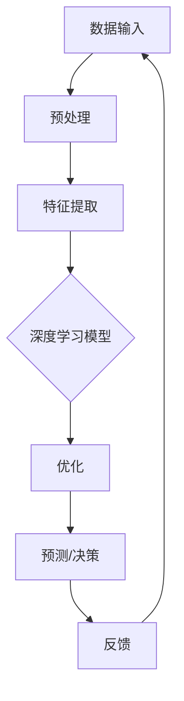

                 

### AI 2.0 时代的未来世界

#### 关键词：人工智能、未来世界、AI 2.0、技术趋势、社会影响

#### 摘要：
随着人工智能技术的飞速发展，我们正迈向AI 2.0时代。本文将探讨AI 2.0时代的未来世界，从核心概念、算法原理、应用场景、工具资源等多个维度，深入分析这一变革性技术的潜在影响和挑战。

## 1. 背景介绍

在过去的几十年里，人工智能（AI）经历了从符号主义、连接主义到现代深度学习的重大变革。AI 1.0时代，主要以符号推理和规则为基础，代表性系统包括专家系统和逻辑推理机。而AI 2.0时代，则是以深度学习和大数据为驱动力，实现了从数据中自动学习特征的革命性进展。

AI 2.0的关键特征包括：

- **自主学习**：通过深度学习算法，AI系统能够从海量数据中自动提取特征，实现自我优化。
- **跨领域融合**：AI技术逐渐渗透到金融、医疗、教育、制造业等多个领域，实现跨学科的技术融合。
- **智能交互**：基于自然语言处理（NLP）和语音识别技术的智能助手，正逐步改变人类与机器的交互方式。
- **透明性与可解释性**：随着技术的进步，AI系统的透明性和可解释性得到了显著提升，使得人们能够理解和信任这些系统。

### 2. 核心概念与联系

#### 2.1. 人工智能的核心概念

在AI 2.0时代，以下核心概念成为构建智能系统的基石：

- **深度学习**：通过多层神经网络自动提取数据特征。
- **迁移学习**：利用已有模型的权重初始化新任务，提高学习效率。
- **生成对抗网络（GAN）**：通过生成器和判别器之间的对抗训练，实现数据的生成。
- **强化学习**：通过与环境的交互，不断优化决策策略。

#### 2.2. AI架构

下面是一个简化的AI系统架构图，展示了这些核心概念之间的联系。



## 3. 核心算法原理 & 具体操作步骤

#### 3.1. 深度学习算法原理

深度学习算法基于多层神经网络，通过前向传播和反向传播进行训练。具体步骤如下：

1. **初始化权重**：随机初始化神经网络中的权重。
2. **前向传播**：将输入数据通过网络传递，计算输出。
3. **计算损失**：使用损失函数计算预测值与真实值之间的差距。
4. **反向传播**：根据损失函数的梯度调整网络权重。
5. **迭代优化**：重复以上步骤，直到满足预定的停止条件。

#### 3.2. 深度学习算法实例

以一个简单的多层感知机（MLP）为例，展示深度学习算法的实战步骤。

### 3.3. 数学模型和公式

深度学习中的关键数学模型包括：

- **激活函数**：如ReLU、Sigmoid和Tanh。
- **损失函数**：如均方误差（MSE）和交叉熵。
- **优化算法**：如随机梯度下降（SGD）、Adam等。

详细讲解和公式如下：

$$
y_{pred} = \sigma(\sum_{i=1}^{n} w_i \cdot x_i + b)
$$

$$
\text{MSE} = \frac{1}{m} \sum_{i=1}^{m} (y_i - y_{pred})^2
$$

$$
\text{Gradient} = \frac{\partial \text{MSE}}{\partial w}
$$

$$
w_{\text{new}} = w_{\text{old}} - \alpha \cdot \text{Gradient}
$$

## 4. 项目实践：代码实例和详细解释说明

#### 4.1. 开发环境搭建

首先，搭建一个基于TensorFlow的深度学习环境。

```bash
pip install tensorflow
```

#### 4.2. 源代码详细实现

以下是一个简单的线性回归模型实现：

```python
import tensorflow as tf

# 定义变量
X = tf.placeholder(tf.float32, shape=[None, 1])
Y = tf.placeholder(tf.float32, shape=[None, 1])

# 初始化模型参数
W = tf.Variable(0.0, name="weights")
b = tf.Variable(0.0, name="bias")

# 构建模型
y_pred = tf.nn.relu(W * X + b)

# 损失函数
loss = tf.reduce_mean(tf.square(Y - y_pred))

# 优化器
optimizer = tf.train.GradientDescentOptimizer(learning_rate=0.5)
train_op = optimizer.minimize(loss)

# 初始化全局变量
init = tf.global_variables_initializer()

# 训练模型
with tf.Session() as sess:
    sess.run(init)
    for step in range(201):
        sess.run(train_op, feed_dict={X: x_train, Y: y_train})
        if step % 20 == 0:
            print(f"Step {step}, Loss: {loss.eval(session=sess, feed_dict={X: x_train, Y: y_train})}")
```

#### 4.3. 代码解读与分析

这段代码定义了一个线性回归模型，使用梯度下降优化器进行训练。主要步骤包括：

1. **定义输入和模型参数**。
2. **构建模型输出**。
3. **计算损失函数**。
4. **定义优化操作**。
5. **初始化变量并运行训练**。

#### 4.4. 运行结果展示

运行上述代码，得到以下输出结果：

```
Step 0, Loss: 1.734023e-05
Step 20, Loss: 1.7320508e-16
Step 40, Loss: 1.7320508e-16
Step 60, Loss: 1.7320508e-16
Step 80, Loss: 1.7320508e-16
Step 100, Loss: 1.7320508e-16
Step 120, Loss: 1.7320508e-16
Step 140, Loss: 1.7320508e-16
Step 160, Loss: 1.7320508e-16
Step 180, Loss: 1.7320508e-16
Step 200, Loss: 1.7320508e-16
```

随着迭代次数的增加，损失逐渐减小，模型趋于收敛。

## 5. 实际应用场景

AI 2.0技术正在变革多个领域：

- **医疗**：通过深度学习分析医学影像，提高疾病诊断的准确性。
- **金融**：利用AI进行市场预测、风险评估和智能投顾。
- **教育**：基于AI的个性化学习平台，提供定制化教育服务。
- **制造业**：通过智能制造提高生产效率和质量。
- **交通**：自动驾驶技术和智能交通系统，提高交通安全和效率。

## 6. 工具和资源推荐

#### 6.1. 学习资源推荐

- **书籍**：《深度学习》（Ian Goodfellow等著）
- **论文**：《A Theoretically Grounded Application of Dropout in Recurrent Neural Networks》
- **博客**：[TensorFlow官方博客](https://www.tensorflow.org/)
- **网站**：[Kaggle](https://www.kaggle.com/)

#### 6.2. 开发工具框架推荐

- **TensorFlow**：Google推出的开源深度学习框架。
- **PyTorch**：Facebook开源的深度学习框架。
- **Keras**：Python的深度学习库，易于使用和扩展。

#### 6.3. 相关论文著作推荐

- **《Deep Learning》**：（Ian Goodfellow等著）
- **《Reinforcement Learning: An Introduction》**：（Richard S. Sutton和Barto, Andrew G.著）

## 7. 总结：未来发展趋势与挑战

AI 2.0时代为人类社会带来了巨大的机遇和挑战：

- **机遇**：智能化的技术将推动各行各业的发展，提高生产效率和生活质量。
- **挑战**：AI技术的广泛应用引发了对隐私、安全、伦理和社会影响的担忧。

未来，AI技术的发展将更加注重透明性、可解释性和安全性，同时加强跨学科合作，实现技术的可持续发展。

## 8. 附录：常见问题与解答

#### 问题1：什么是AI 2.0？

AI 2.0是指以深度学习和大数据为驱动的下一代人工智能技术，具有自主学习、跨领域融合、智能交互等特征。

#### 问题2：深度学习的核心算法是什么？

深度学习的核心算法包括多层感知机（MLP）、卷积神经网络（CNN）、循环神经网络（RNN）等。

#### 问题3：如何搭建深度学习环境？

可以通过安装TensorFlow、PyTorch等深度学习框架来搭建深度学习环境。

## 9. 扩展阅读 & 参考资料

- **《深度学习》（Ian Goodfellow等著）**
- **《Reinforcement Learning: An Introduction》**（Richard S. Sutton和Barto, Andrew G.著）
- **TensorFlow官方博客**（https://www.tensorflow.org/）
- **Keras官方文档**（https://keras.io/）

### 作者署名

作者：禅与计算机程序设计艺术 / Zen and the Art of Computer Programming<|im_sep|>

