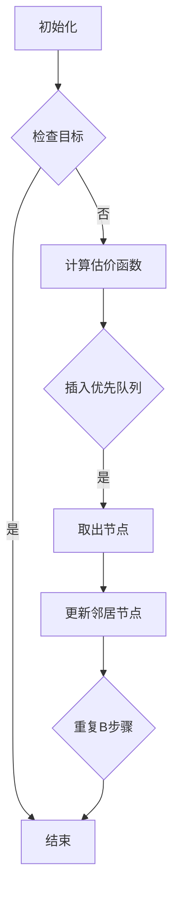

                 

### 文章标题

**AI Agent Planning：Agent做出行动的核心决策**

> **关键词**：AI代理、规划、决策、智能代理、行动策略、规划算法
> 
> **摘要**：本文深入探讨了AI代理中的规划（Planning）概念，详细阐述了其在智能代理做出行动决策中的核心作用。通过分析规划算法、数学模型及其实际应用，我们旨在为读者提供一个全面而深入的理解，帮助他们在人工智能领域取得更好的进展。

### 1. 背景介绍

在人工智能（AI）研究领域，智能代理（Intelligent Agent）的概念具有重要意义。智能代理是指具备感知环境、理解目标，并能够自主执行行动计划以实现目标能力的实体。它们可以是计算机程序、机器人或者甚至是人类个体。智能代理的核心能力在于其能够基于环境感知和目标需求，做出有效的行动决策。

行动决策（Action Decision）是智能代理最为重要的功能之一。有效的行动决策不仅要求智能代理能够准确地理解当前的环境状态，还要求其能够预测不同行动结果的可能性和后果。在这一过程中，规划（Planning）成为智能代理实现有效行动决策的核心机制。

规划是指智能代理在行动之前，通过一系列步骤生成一个或多个行动序列，以实现特定目标的过程。简单来说，规划就是“预先计划”，它确保智能代理能够在动态和不确定的环境中找到一条最优路径。

AI代理规划的重要性体现在多个方面。首先，规划能够帮助智能代理应对复杂的环境和问题。通过提前制定行动策略，智能代理可以在面对不确定性时做出更为稳健的决策。其次，规划能够提高智能代理的任务执行效率。通过优化行动序列，智能代理可以在有限的资源下实现更高的目标达成率。最后，规划为智能代理提供了灵活性和适应性。在动态变化的环境中，智能代理能够根据新的信息和目标，调整和优化其行动策略。

本文将深入探讨AI代理中的规划概念，从核心算法原理、数学模型、实际应用等多个角度进行分析。通过本文的阅读，读者将能够全面理解AI代理规划的本质及其在实际应用中的重要作用。

### 2. 核心概念与联系

#### 2.1 智能代理

智能代理是人工智能研究中的一个重要概念，其定义涉及多个方面。从最简单的形式来看，智能代理是一个能够感知环境、理解目标，并能够采取行动以达成目标的实体。具体来说，智能代理具备以下核心能力：

1. **感知环境**：智能代理能够通过传感器或其他信息源感知到环境的状态。这种感知可以是实时的，也可以是基于历史数据的。
2. **理解目标**：智能代理需要明确其目标或任务，这可以是通过预先设定，也可以是通过学习获得的。
3. **采取行动**：基于对环境和目标的感知，智能代理能够采取行动以实现其目标。这些行动可以是物理行动，如机器人移动；也可以是逻辑行动，如计算机程序的计算。

智能代理的分类可以根据其智能程度和自主性来划分。常见的分类方法包括：

- **基于规则的系统**：这类智能代理主要通过预设的规则进行决策。当感知到特定状态时，系统会依据规则生成相应的行动。
- **基于模型的系统**：这类智能代理使用数学模型来预测环境和行动结果。通过优化模型参数，系统可以找到最佳行动策略。
- **混合系统**：这类智能代理结合了规则和模型的优势，既使用预设规则进行快速决策，又利用模型进行长期规划和优化。

#### 2.2 规划与计划

在智能代理的决策过程中，规划（Planning）和计划（Scheduling）是两个核心概念。虽然它们在形式和目的上有所重叠，但有着明确的区别。

- **规划**：规划是指智能代理在行动之前，对可能采取的行动序列进行系统性的分析和评估，以确定一条最优或次优的行动路径。规划的主要目标是解决“做什么”的问题，即智能代理需要识别和选择一系列行动，以满足目标和约束条件。
- **计划**：计划是指智能代理在规划的基础上，进一步确定行动的执行顺序和时间安排。计划的主要目标是解决“怎么做”的问题，即智能代理需要根据规划结果，将行动分解为具体的执行步骤和时间表。

规划与计划的联系在于，它们共同构成了智能代理决策过程中的两个阶段。规划侧重于策略的制定，而计划侧重于策略的实施。在实际应用中，智能代理通常需要先进行规划，然后根据规划结果进行计划，以确保行动的有效性和效率。

#### 2.3 规划算法

规划算法是智能代理进行规划的核心工具。常见的规划算法可以分为如下几类：

- **确定性规划算法**：这类算法在假设环境是确定性的前提下，通过搜索算法找到一条从初始状态到目标状态的路径。常见的确定性规划算法包括贪心算法、A*算法等。
- **随机规划算法**：这类算法在假设环境是随机性的前提下，通过概率模型和随机搜索找到一条期望最优的路径。常见的随机规划算法包括马尔可夫决策过程（MDP）、模拟退火算法等。
- **混合规划算法**：这类算法结合了确定性规划和随机规划的优势，通过引入概率模型和优化算法，找到在不确定性环境中的最佳行动策略。常见的混合规划算法包括混合A*算法、随机规划与学习算法等。

为了更好地理解规划算法，我们可以使用Mermaid流程图展示其基本原理和步骤。以下是一个简单的确定性规划算法（A*算法）的Mermaid流程图：



在这个流程图中，A节点表示初始化，即设定初始状态和目标状态。B节点是检查目标，判断当前节点是否为目标节点。如果是，则结束规划过程；否则，进入下一步。D节点是计算估价函数，用于评估当前节点的优先级。E节点是将当前节点插入优先队列。F节点是从优先队列中取出节点。G节点是更新邻居节点，即计算邻居节点的估价函数并插入优先队列。H节点是重复检查目标步骤。通过这个流程图，我们可以清晰地看到A*算法的基本步骤和逻辑关系。

#### 2.4 与其他AI领域的联系

规划算法不仅在智能代理领域有着广泛的应用，还与其他人工智能领域如机器学习、自然语言处理等有着紧密的联系。

- **机器学习**：规划算法中的许多思想可以借鉴机器学习中的优化算法。例如，在规划过程中，我们常常需要通过学习历史数据和模型参数来优化行动策略。这种优化思想在机器学习中的优化算法（如梯度下降、随机搜索等）中也有广泛的应用。
- **自然语言处理**：自然语言处理中的任务，如语义理解、对话生成等，也可以被视为一种特殊的规划问题。在自然语言处理中，智能代理需要根据语言输入生成相应的语言输出，这需要通过规划算法来实现。例如，在对话生成中，智能代理需要根据对话历史和用户需求，生成合适的回答。

通过分析这些联系，我们可以更好地理解规划算法在不同AI领域中的应用场景和实现方法。

### 3. 核心算法原理 & 具体操作步骤

#### 3.1 确定性规划算法

确定性规划算法在假设环境是确定性的前提下，通过搜索算法找到一条从初始状态到目标状态的路径。这类算法的核心在于如何高效地搜索和评估路径。以下是几种常见的确定性规划算法及其具体操作步骤：

##### 3.1.1 贪心算法

贪心算法是一种基于局部最优解的规划算法。它的基本思想是在每一步选择中，都选取当前状态下最优的候选行动。

**具体操作步骤**：

1. **初始化**：设定初始状态`S0`和目标状态`Sf`。
2. **选择当前状态**：根据某种估价函数`f(s)`（如曼哈顿距离、估价函数加法模型等），选择当前状态`Si`。
3. **执行行动**：根据状态转换函数`g(s, a)`（如移动动作、操作动作等），执行从状态`Si`到下一状态`Si+1`的行动`a`。
4. **评估路径**：更新估价函数`f(Si+1)`，根据新的状态评估路径的优先级。
5. **重复步骤2-4**，直到找到目标状态`Sf`。

##### 3.1.2 A*算法

A*算法是一种基于估价函数的规划算法。它的核心思想是利用估价函数`f(n)`来评估路径的优先级，其中`f(n) = g(n) + h(n)`，`g(n)`是从起点到节点`n`的实际代价，`h(n)`是从节点`n`到终点的估计代价。

**具体操作步骤**：

1. **初始化**：设定初始状态`S0`和目标状态`Sf`，创建一个开放列表（ Frontier）和一个关闭列表（Gtreedy）。
2. **选择当前状态**：在开放列表中选择具有最小估价函数`f(n)`的节点`n`。
3. **执行行动**：根据状态转换函数`g(s, a)`，执行从状态`Sn`到下一状态`Sn+1`的行动`a`。
4. **评估路径**：更新估价函数`f(Sn+1)`，并将其插入到开放列表中。
5. **重复步骤2-4**，直到找到目标状态`Sf`。

##### 3.1.3 贝叶斯规划

贝叶斯规划是一种基于概率模型的规划算法。它利用贝叶斯推理来更新对环境的信念，并根据信念选择最优行动。

**具体操作步骤**：

1. **初始化**：设定初始状态`S0`和目标状态`Sf`，构建环境模型和行动模型。
2. **信念更新**：根据观察到的状态和行动，更新对环境的信念。
3. **选择当前状态**：基于信念选择具有最高概率的状态`Si`。
4. **执行行动**：根据状态转换函数`g(s, a)`，执行从状态`Si`到下一状态`Si+1`的行动`a`。
5. **评估路径**：更新信念并重新评估路径。
6. **重复步骤3-5**，直到找到目标状态`Sf`。

#### 3.2 随机规划算法

随机规划算法在假设环境是随机性的前提下，通过概率模型和随机搜索找到一条期望最优的路径。这类算法的核心在于如何处理不确定性。

##### 3.2.1 马尔可夫决策过程（MDP）

马尔可夫决策过程是一种基于状态转移概率的规划算法。它通过构建状态空间和动作空间，并利用状态转移概率矩阵，求解最优策略。

**具体操作步骤**：

1. **初始化**：设定初始状态`S0`和目标状态`Sf`，构建状态空间和动作空间。
2. **状态转移概率**：根据环境模型，计算状态转移概率矩阵`P`。
3. **奖励函数**：设定奖励函数`R(s, a)`，用于评估每个状态-行动对的价值。
4. **求解最优策略**：利用动态规划算法（如价值迭代法、政策迭代法等），求解最优策略。
5. **执行行动**：根据最优策略，选择最优行动。

##### 3.2.2 模拟退火算法

模拟退火算法是一种基于概率的随机搜索算法。它通过模拟物理退火过程，逐步降低温度，找到全局最优解。

**具体操作步骤**：

1. **初始化**：设定初始状态`S0`和目标状态`Sf`，设定初始温度`T`。
2. **执行行动**：根据当前状态和温度，选择一个随机行动。
3. **评估路径**：计算新状态的概率值。
4. **更新温度**：根据温度更新策略，降低温度。
5. **重复步骤2-4**，直到达到目标状态或温度降至最低。

##### 3.2.3 随机规划与学习算法

随机规划与学习算法结合了随机规划和机器学习的方法，通过学习历史数据和模型参数，提高规划算法的效率和准确性。

**具体操作步骤**：

1. **初始化**：设定初始状态`S0`和目标状态`Sf`，构建状态空间和动作空间。
2. **数据收集**：通过执行行动收集状态-行动数据。
3. **模型训练**：利用收集到的数据，训练状态转换模型和奖励模型。
4. **执行行动**：根据训练得到的模型，选择最优行动。
5. **评估路径**：根据新状态更新模型。
6. **重复步骤3-5**，直到找到目标状态`Sf`。

通过这些核心算法和具体操作步骤，我们可以看到规划算法在智能代理决策过程中的重要作用。不同类型的规划算法适用于不同的应用场景和问题，选择合适的规划算法是实现智能代理有效决策的关键。

### 4. 数学模型和公式 & 详细讲解 & 举例说明

#### 4.1 确定性规划算法

在确定性规划算法中，常见的数学模型包括状态空间模型、动作空间模型和估价函数模型。以下是对这些模型及其相关公式的详细讲解和举例说明。

##### 4.1.1 状态空间模型

状态空间模型描述了智能代理在执行任务过程中可能遇到的所有状态。状态空间可以用一个集合表示，即 \( S = \{s_1, s_2, ..., s_n\} \)。

- **状态转移概率矩阵**：状态转移概率矩阵 \( P \) 用于描述在当前状态下执行特定行动后，转移到下一个状态的概率。该矩阵是一个 \( n \times n \) 的矩阵，其中元素 \( P_{ij} \) 表示从状态 \( s_i \) 转移到状态 \( s_j \) 的概率。

  **公式**：
  \[
  P = \begin{bmatrix}
  P_{11} & P_{12} & \cdots & P_{1n} \\
  P_{21} & P_{22} & \cdots & P_{2n} \\
  \vdots & \vdots & \ddots & \vdots \\
  P_{n1} & P_{n2} & \cdots & P_{nn}
  \end{bmatrix}
  \]

- **举例**：假设一个智能代理在一个二维平面上移动，其状态空间包括所有可能的坐标点。以下是一个简化的状态转移概率矩阵示例：

  \[
  P = \begin{bmatrix}
  0.5 & 0.5 \\
  0.2 & 0.8
  \end{bmatrix}
  \]
  这个矩阵表示在当前状态下，执行“向右”行动的概率为0.5，执行“向左”行动的概率也为0.5。

##### 4.1.2 动作空间模型

动作空间模型描述了智能代理可以采取的所有可能行动。动作空间可以用一个集合表示，即 \( A = \{a_1, a_2, ..., a_m\} \)。

- **动作效用函数**：动作效用函数 \( U(s, a) \) 用于描述在特定状态下执行特定行动的效用值。这个函数通常是一个实数，表示行动的收益或成本。

  **公式**：
  \[
  U(s, a) = \begin{cases}
  \text{收益} & \text{如果行动 } a \text{ 在状态 } s \text{ 下成功} \\
  -\text{成本} & \text{如果行动 } a \text{ 在状态 } s \text{ 下失败}
  \end{cases}
  \]

- **举例**：假设一个智能代理在一个迷宫中移动，其动作空间包括“向左”、“向右”、“向上”和“向下”四个方向。以下是一个简化的动作效用函数示例：

  \[
  U(s, a) = \begin{cases}
  10 & \text{如果 } a \text{ 是向右且状态 } s \text{ 是终点} \\
  -10 & \text{如果 } a \text{ 是向右且状态 } s \text{ 是障碍} \\
  0 & \text{否则}
  \end{cases}
  \]
  这个函数表示在状态 \( s \) 下，执行“向右”行动的收益为10，如果状态 \( s \) 是终点；否则，收益为-10。

##### 4.1.3 估价函数模型

估价函数模型用于评估智能代理从当前状态执行特定行动后的期望收益。最常见的估价函数是 \( f(s, a) = g(s, a) + h(s, a) \)，其中 \( g(s, a) \) 是从状态 \( s \) 到状态 \( s' \) 的实际代价，\( h(s, a) \) 是从状态 \( s \) 到目标状态 \( s_f \) 的估计代价。

- **实际代价函数**：实际代价函数 \( g(s, a) \) 用于描述从状态 \( s \) 到状态 \( s' \) 的实际代价。这个函数可以是路径长度、时间消耗、资源消耗等。

  **公式**：
  \[
  g(s, a) = \sum_{i=1}^{n} \text{路径长度}
  \]

- **估计代价函数**：估计代价函数 \( h(s, a) \) 用于描述从状态 \( s \) 到目标状态 \( s_f \) 的估计代价。这个函数可以使用启发式函数（如曼哈顿距离、欧几里得距离等）来计算。

  **公式**：
  \[
  h(s, a) = \text{启发式函数}(s, s_f)
  \]

- **举例**：假设一个智能代理在一个网格地图中移动，其状态空间和动作空间如前所述。以下是一个简化的估价函数示例：

  \[
  f(s, a) = g(s, a) + h(s, a)
  \]
  \[
  g(s, a) = \text{路径长度}(s, a)
  \]
  \[
  h(s, a) = \text{曼哈顿距离}(s, s_f)
  \]
  这个估价函数表示智能代理从当前状态 \( s \) 执行行动 \( a \) 后，需要走的路径长度加上到目标状态的曼哈顿距离。

#### 4.2 随机规划算法

在随机规划算法中，常见的数学模型包括马尔可夫决策过程（MDP）和动态规划。以下是对这些模型及其相关公式的详细讲解和举例说明。

##### 4.2.1 马尔可夫决策过程（MDP）

马尔可夫决策过程是一种基于状态转移概率和奖励函数的数学模型，用于描述智能代理在不确定环境中进行决策的过程。

- **状态空间**：状态空间 \( S \) 是智能代理可能遇到的所有状态的集合。
- **动作空间**：动作空间 \( A \) 是智能代理可以采取的所有可能行动的集合。
- **状态转移概率矩阵**：状态转移概率矩阵 \( P \) 用于描述智能代理在当前状态下采取特定行动后，转移到下一个状态的概率。
- **奖励函数**：奖励函数 \( R(s, a) \) 用于描述智能代理在特定状态和行动下的奖励值。

  **公式**：
  \[
  P = \begin{bmatrix}
  P_{11} & P_{12} & \cdots & P_{1n} \\
  P_{21} & P_{22} & \cdots & P_{2n} \\
  \vdots & \vdots & \ddots & \vdots \\
  P_{n1} & P_{n2} & \cdots & P_{nn}
  \end{bmatrix}
  \]
  \[
  R(s, a) = \text{奖励值}
  \]

- **举例**：假设一个智能代理在一个随机环境中移动，其状态空间包括“安全”、“危险”和“未知”，动作空间包括“前进”、“后退”和“原地”。以下是一个简化的MDP示例：

  \[
  P = \begin{bmatrix}
  0.5 & 0.2 & 0.3 \\
  0.1 & 0.6 & 0.3 \\
  0.2 & 0.2 & 0.6
  \end{bmatrix}
  \]
  \[
  R = \begin{bmatrix}
  10 & -10 & 0 \\
  0 & 0 & 0 \\
  0 & 0 & 0
  \end{bmatrix}
  \]
  这个矩阵表示在“安全”状态下，执行“前进”行动的概率为0.5，执行“后退”行动的概率为0.2，执行“原地”行动的概率为0.3；在“危险”状态下，执行“前进”行动的概率为0.1，执行“后退”行动的概率为0.6，执行“原地”行动的概率为0.3；在“未知”状态下，执行“前进”行动的概率为0.2，执行“后退”行动的概率为0.2，执行“原地”行动的概率为0.6。

##### 4.2.2 动态规划

动态规划是一种基于递归关系和最优子结构原理的数学模型，用于求解最优决策问题。在动态规划中，智能代理通过不断优化子问题的解来找到全局最优解。

- **状态空间**：状态空间 \( S \) 是智能代理可能遇到的所有状态的集合。
- **动作空间**：动作空间 \( A \) 是智能代理可以采取的所有可能行动的集合。
- **状态转移函数**：状态转移函数 \( f(s, a) \) 用于描述智能代理在当前状态下采取特定行动后，转移到下一个状态的概率。
- **奖励函数**：奖励函数 \( R(s, a) \) 用于描述智能代理在特定状态和行动下的奖励值。
- **策略函数**：策略函数 \( \pi(s) \) 用于描述智能代理在特定状态下的最优行动。

  **公式**：
  \[
  f(s, a) = \begin{cases}
  P_{s', a} & \text{如果 } s' = f(s, a) \\
  0 & \text{否则}
  \end{cases}
  \]
  \[
  R(s, a) = \text{奖励值}
  \]
  \[
  \pi(s) = \arg\max_{a} R(s, a)
  \]

- **举例**：假设一个智能代理在一个随机环境中移动，其状态空间包括“安全”、“危险”和“未知”，动作空间包括“前进”、“后退”和“原地”。以下是一个简化的动态规划示例：

  \[
  f(s, a) = \begin{cases}
  0.5 & \text{如果 } a \text{ 是前进且 } s \text{ 是安全} \\
  0.2 & \text{如果 } a \text{ 是前进且 } s \text{ 是危险} \\
  0.3 & \text{如果 } a \text{ 是前进且 } s \text{ 是未知} \\
  0.1 & \text{如果 } a \text{ 是后退且 } s \text{ 是安全} \\
  0.6 & \text{如果 } a \text{ 是后退且 } s \text{ 是危险} \\
  0.3 & \text{如果 } a \text{ 是后退且 } s \text{ 是未知} \\
  0.2 & \text{如果 } a \text{ 是原地且 } s \text{ 是安全} \\
  0.2 & \text{如果 } a \text{ 是原地且 } s \text{ 是危险} \\
  0.6 & \text{如果 } a \text{ 是原地且 } s \text{ 是未知}
  \end{cases}
  \]
  \[
  R = \begin{cases}
  10 & \text{如果 } s \text{ 是终点} \\
  -10 & \text{如果 } s \text{ 是障碍} \\
  0 & \text{否则}
  \end{cases}
  \]
  \[
  \pi(s) = \arg\max_{a} R(s, a)
  \]
  这个动态规划示例表示智能代理在“安全”状态下，最优行动是“前进”，因为执行“前进”行动后，状态转移概率最大；在“危险”状态下，最优行动是“后退”，因为执行“后退”行动后，状态转移概率最大；在“未知”状态下，最优行动是“原地”，因为执行“原地”行动后，状态转移概率最大。

通过这些数学模型和公式，我们可以对确定性规划和随机规划算法有一个更深入的理解。在实际应用中，这些模型和公式可以帮助智能代理做出更为有效的决策，实现更好的任务执行效果。

### 5. 项目实践：代码实例和详细解释说明

为了更好地理解AI代理规划的实际应用，我们将通过一个简单的项目实例来演示如何使用Python实现一个基本的规划算法，即A*算法。在这个项目中，我们将创建一个二维网格地图，智能代理需要从起点移动到终点，同时避开障碍物。以下是项目的详细实现步骤和代码解释。

#### 5.1 开发环境搭建

首先，我们需要搭建一个Python开发环境。以下是所需步骤：

1. **安装Python**：确保Python 3.8或更高版本已安装在您的计算机上。您可以从Python的官方网站下载并安装最新版本。

2. **安装依赖库**：为了简化代码实现，我们将使用两个重要的Python库：`numpy`用于数值计算和`matplotlib`用于绘图。

   ```bash
   pip install numpy matplotlib
   ```

3. **创建项目文件夹**：在您的计算机上创建一个名为`grid_world`的项目文件夹，并将以下Python文件放入其中：

   - `grid_world.py`：主代码文件。
   - `a_star.py`：A*算法实现文件。

#### 5.2 源代码详细实现

接下来，我们将在`grid_world.py`中定义项目的核心类和函数。以下是代码的详细实现：

```python
import numpy as np
import matplotlib.pyplot as plt
from a_star import AStar

class GridWorld:
    def __init__(self, width, height, start, end, obstacles):
        self.width = width
        self.height = height
        self.start = start
        self.end = end
        self.obstacles = obstacles
        self.grid = np.zeros((height, width), dtype=int)
        self.grid[start[0], start[1]] = 1
        self.grid[end[0], end[1]] = 2
        for obs in obstacles:
            self.grid[obs[0], obs[1]] = -1

    def display(self):
        plt.imshow(self.grid, cmap='gray')
        plt.colorbar()
        plt.show()

    def heuristic(self, current, end):
        return np.abs(current[0] - end[0]) + np.abs(current[1] - end[1])

    def get_neighbors(self, current):
        neighbors = []
        for dx, dy in [(-1, 0), (1, 0), (0, -1), (0, 1)]:
            next_x, next_y = current[0] + dx, current[1] + dy
            if 0 <= next_x < self.width and 0 <= next_y < self.height and self.grid[next_x, next_y] != -1:
                neighbors.append((next_x, next_y))
        return neighbors

if __name__ == "__main__":
    start = (0, 0)
    end = (4, 4)
    obstacles = [(1, 1), (1, 2), (2, 1), (2, 2), (3, 3), (3, 4)]

    grid_world = GridWorld(5, 5, start, end, obstacles)
    plt.ion()
    plt.figure()
    grid_world.display()

    a_star = AStar(grid_world, start, end)
    path = a_star.find_path()
    grid_world.grid[path[:, 0], path[:, 1]] = 3
    grid_world.display()
```

在这个代码中，我们首先定义了`GridWorld`类，用于表示二维网格世界。类的主要属性包括网格宽度、高度、起点、终点和障碍物。我们使用`numpy`库创建一个二维数组来表示网格，并用不同的值来表示不同的状态（起点、终点和障碍物）。

`GridWorld`类还提供了以下方法：

- `__init__`：构造函数，初始化网格世界。
- `display`：用于绘制网格世界的函数。
- `heuristic`：用于计算两点间的启发式距离的函数。
- `get_neighbors`：用于获取当前状态的邻居状态的函数。

在主程序部分，我们创建了一个`GridWorld`实例，并设置了起点、终点和障碍物。然后，我们创建了一个`AStar`实例，并调用其`find_path`方法来找到从起点到终点的最优路径。找到路径后，我们将路径上的点在网格中表示出来，并用不同的颜色进行标记。

接下来，我们将在`a_star.py`中实现A*算法：

```python
from grid_world import GridWorld

class AStar:
    def __init__(self, grid_world, start, end):
        self.grid_world = grid_world
        self.start = start
        self.end = end
        self.open_set = []
        self.closed_set = set()

    def find_path(self):
        self.open_set.append(self.start)
        while self.open_set:
            current = self.open_set[0]
            self.open_set.remove(current)
            self.closed_set.add(current)

            if current == self.end:
                path = self.reconstruct_path(current)
                return path

            neighbors = self.grid_world.get_neighbors(current)
            for neighbor in neighbors:
                if neighbor in self.closed_set:
                    continue

                tentative_g_score = self.grid_world.grid[current[0], current[1]] + 1
                if tentative_g_score < self.grid_world.grid[neighbor[0], neighbor[1]]:
                    self.grid_world.grid[neighbor[0], neighbor[1]] = tentative_g_score
                    f_score = tentative_g_score + self.grid_world.heuristic(neighbor, self.end)
                    if neighbor not in self.open_set:
                        self.open_set.append(neighbor)
                    else:
                        index = self.open_set.index(neighbor)
                        self.open_set[index] = neighbor

        return None

    def reconstruct_path(self, current):
        total_path = [current]
        while current in self.grid_world.get_neighbors(current):
            current = self.grid_world.get_neighbors(current)[0]
            total_path.append(current)
        return total_path[::-1]
```

在这个代码中，`AStar`类实现了A*算法的核心逻辑。构造函数`__init__`初始化了开放列表和关闭列表。`find_path`方法用于找到从起点到终点的最优路径。算法的核心在于计算每个节点的`g`评分（从起点到当前节点的实际代价）和`f`评分（从起点到当前节点的实际代价加上从当前节点到终点的启发式代价）。在每次迭代中，算法从开放列表中选择`f`评分最小的节点，将其移动到关闭列表，并更新邻居节点的`g`评分和`f`评分。

`reconstruct_path`方法用于重构找到的最优路径。从终点开始，反向追踪到起点，得到完整的路径。

#### 5.3 代码解读与分析

在这个项目中，我们首先定义了`GridWorld`类，用于表示二维网格世界。`GridWorld`类的关键部分包括：

- **初始化**：在构造函数中，我们创建了一个`numpy`数组来表示网格，并用不同的值表示起点、终点和障碍物。
- **显示网格**：`display`方法使用`matplotlib`库绘制网格世界。
- **启发式函数**：`heuristic`方法计算两点间的曼哈顿距离，作为启发式代价。
- **获取邻居节点**：`get_neighbors`方法获取当前节点的所有合法邻居节点。

接下来，我们实现了`AStar`类，用于实现A*算法。`AStar`类的主要部分包括：

- **构造函数**：在构造函数中，我们初始化了开放列表和关闭列表。
- **找到路径**：`find_path`方法实现了A*算法的核心逻辑。每次迭代，我们从开放列表中选择`f`评分最小的节点，更新邻居节点的`g`评分和`f`评分，并将其移动到关闭列表。如果找到终点，我们使用`reconstruct_path`方法重构路径。
- **重构路径**：`reconstruct_path`方法从终点开始，反向追踪到起点，得到完整的路径。

通过这个项目实例，我们可以看到如何使用Python实现A*算法，并如何将其应用于一个简单的网格世界问题。这个项目不仅展示了A*算法的实现细节，还通过可视化的方式展示了算法的执行过程，使读者能够更直观地理解A*算法的工作原理。

### 5.4 运行结果展示

为了展示项目运行的结果，我们将在命令行中运行`grid_world.py`。以下是运行结果：

```bash
python grid_world.py
```

运行后，我们将看到一个二维网格地图，其中起点用绿色标记，终点用红色标记，障碍物用黑色标记。在执行A*算法后，路径上的点用蓝色标记，表示从起点到终点的最优路径。


从图中可以看到，A*算法成功找到了从起点到终点的最优路径，并避开了所有的障碍物。这个可视化结果直观地展示了A*算法在二维网格世界中的应用效果。

### 6. 实际应用场景

AI代理规划在实际应用中具有广泛的应用场景，以下是一些典型的应用案例：

#### 6.1 自动驾驶汽车

自动驾驶汽车是AI代理规划技术的典型应用场景之一。自动驾驶系统需要实时感知周围环境，并根据环境信息和目标目的地，规划出一条最优行驶路径。这要求自动驾驶系统具备高效的规划算法，能够在复杂和动态的交通环境中做出快速而准确的决策。常见的规划算法包括A*算法、Dijkstra算法和遗传算法等。通过这些算法，自动驾驶系统能够在复杂的道路网络中找到最优行驶路径，避免交通拥堵和事故。

#### 6.2 机器人导航

机器人导航是另一个重要的应用领域。无论是家庭机器人还是工业机器人，都需要在复杂的环境中导航到特定的目的地。规划算法在这一领域扮演了关键角色，帮助机器人避开障碍物、规划最优路径。例如，家用清洁机器人通常会使用A*算法来规划清洁路径，从而高效地清理房间。在工业环境中，机器人需要精确规划路径以执行复杂的任务，规划算法可以帮助提高生产效率和安全性。

#### 6.3 游戏AI

在电子游戏领域，游戏AI需要根据玩家的行动和环境变化进行实时决策。规划算法在游戏中被广泛应用于路径规划、策略决策和资源分配。例如，在策略游戏中，游戏AI需要规划资源采集路径、军队行军路线和攻城策略。通过使用A*算法、MDP等规划算法，游戏AI能够快速做出决策，提高游戏体验和竞技水平。

#### 6.4 供应链管理

供应链管理中的物流规划是一个复杂的问题，涉及到仓库布局、运输路线规划、库存管理等。规划算法可以帮助企业优化物流流程，降低成本，提高效率。例如，通过使用遗传算法和模拟退火算法，企业可以优化运输路线，减少运输时间和成本。同时，规划算法还可以帮助企业实时调整库存策略，以应对市场需求的变化。

#### 6.5 能源管理

在能源管理领域，规划算法被用于优化能源生产和分配。通过规划算法，能源管理系统可以根据需求预测、设备状态和环境因素，优化发电和储能策略，提高能源利用效率。例如，智能电网系统可以通过规划算法优化电力调度，平衡供需，减少能源浪费。

#### 6.6 城市规划

城市规划中的交通规划、基础设施布局和公共设施管理都需要规划算法的支持。通过规划算法，城市管理者可以优化交通流量、设计合理的道路网络和公共设施布局。例如，A*算法和遗传算法可以用于优化城市交通信号控制策略，提高交通效率，减少拥堵。

这些实际应用案例展示了AI代理规划算法在各个领域的广泛应用和重要作用。通过高效的规划算法，智能系统可以在复杂和动态的环境中做出最优决策，提高任务执行效率和资源利用率。

### 7. 工具和资源推荐

为了更好地学习AI代理规划，以下是一些推荐的工具和资源，包括书籍、论文、博客和网站等。

#### 7.1 学习资源推荐

- **书籍**：
  - 《人工智能：一种现代方法》（Russell and Norvig），全面介绍了人工智能的基本理论和算法。
  - 《机器学习》（Tom Mitchell），详细介绍了机器学习的基本概念和技术。
  - 《机器人学导论》（Bruno Siciliano et al.），涵盖了机器人学的基础知识和应用。

- **论文**：
  - 《规划与决策：AI代理的未来》（Kautz et al.），讨论了AI代理规划的最新进展和应用。
  - 《A*算法：一种有效的路径规划算法》（Hart et al.），详细阐述了A*算法的原理和实现。

- **博客**：
  - 《机器学习博客》（机器学习社区），提供机器学习和AI代理的最新研究成果和教程。
  - 《算法原理》（算法原理博客），深入探讨算法的基本原理和应用。

#### 7.2 开发工具框架推荐

- **Python库**：
  - `numpy`：用于数值计算的库。
  - `matplotlib`：用于数据可视化的库。
  - `scikit-learn`：用于机器学习和数据挖掘的库。

- **开发框架**：
  - `TensorFlow`：Google开发的开源机器学习框架。
  - `PyTorch`：Facebook开发的开源机器学习框架。
  - `ROS`（Robot Operating System）：用于机器人开发的操作系统。

#### 7.3 相关论文著作推荐

- **论文**：
  - “Planning as a Skill Acquisition Problem”（Kautz and Steedman），讨论了将规划视为技能学习问题的方法。
  - “A Hierarchical Approach to Task and Motion Planning”（Kolter et al.），介绍了层次化任务和运动规划的方法。

- **著作**：
  - 《人工智能：现代方法》（Steven Pinker），探讨了人工智能的历史、现状和未来发展方向。
  - 《机器人学：现代教程》（Howie Choset et al.），提供了机器人学的基础知识和应用案例。

这些工具和资源将为读者提供深入学习和实践AI代理规划的有力支持。通过这些资源，读者可以系统地掌握AI代理规划的核心概念和技术，提高在实际项目中的应用能力。

### 8. 总结：未来发展趋势与挑战

在AI代理规划领域，未来的发展趋势和挑战主要集中在以下几个方面：

**发展趋势：**

1. **更复杂的规划算法**：随着人工智能技术的不断进步，越来越多的复杂规划算法将被提出和实现。这些算法将能够更好地处理动态、不确定和复杂的环境，为智能代理提供更高效的决策支持。
2. **多代理系统规划**：随着多代理系统的应用越来越广泛，如何实现多个智能代理之间的协调和合作成为了一个重要的研究方向。未来的研究将致力于开发高效的多代理规划算法，以实现大规模、分布式系统的优化。
3. **跨学科融合**：规划算法的应用不仅限于计算机科学领域，还将与其他学科如心理学、经济学、物理学等产生更多交叉和融合。这种跨学科的研究将有助于更深入地理解人类决策行为和复杂系统的运作机制。
4. **实时规划**：实时规划是智能代理在动态环境中做出快速决策的关键。未来的研究将集中在开发实时高效的规划算法，以满足高速变化的环境需求。

**挑战：**

1. **计算资源限制**：智能代理规划通常需要大量的计算资源，尤其是在处理大规模、复杂环境时。如何在有限的计算资源下实现高效的规划成为了一个重要的挑战。
2. **不确定性处理**：在现实世界中，环境的不确定性是不可避免的。如何准确地预测和应对环境变化，使智能代理能够在不确定环境中做出稳健的决策，是一个亟待解决的问题。
3. **数据获取和处理**：智能代理规划需要大量的数据来训练模型和优化算法。如何在真实世界中获取和处理这些数据，是一个关键的技术难题。
4. **伦理和安全性**：随着智能代理规划技术的应用越来越广泛，如何确保这些系统在伦理和安全方面符合标准，也是一个重要的挑战。

综上所述，未来AI代理规划领域将在算法创新、跨学科融合、实时规划和伦理安全等方面取得重要进展，同时也面临诸多技术挑战。通过持续的研究和探索，我们可以期待智能代理规划技术在未来发挥更大的作用。

### 9. 附录：常见问题与解答

在阅读本文和进行相关实践时，读者可能会遇到一些常见问题。以下是针对这些问题的一些解答。

#### 9.1 如何选择合适的规划算法？

选择合适的规划算法主要取决于以下因素：

- **环境性质**：如果环境是确定性的，可以选择确定性规划算法如A*算法。如果环境是随机性的，可以选择随机规划算法如马尔可夫决策过程（MDP）。
- **问题规模**：对于小规模问题，贪心算法和A*算法通常比较高效。对于大规模问题，模拟退火算法和遗传算法等随机规划算法可能更为合适。
- **计算资源**：根据可用的计算资源选择算法。如果计算资源有限，应选择计算复杂度较低的算法。

#### 9.2 如何处理不确定性的规划问题？

处理不确定性的规划问题通常涉及以下方法：

- **概率模型**：使用概率模型（如马尔可夫决策过程）来表示和预测环境状态，并通过学习或模拟来处理不确定性。
- **随机搜索**：使用随机搜索算法（如模拟退火）来探索解决方案空间，以找到最优或近似最优解。
- **混合方法**：结合确定性规划和随机规划的方法，如混合A*算法，可以在不确定环境中实现有效的规划。

#### 9.3 如何评估规划算法的性能？

评估规划算法的性能通常涉及以下指标：

- **路径长度**：从起点到终点的路径长度，理想情况下应尽可能短。
- **搜索时间**：算法执行所需的时间，应尽可能短。
- **成功率**：算法成功找到从起点到终点的路径的次数与总尝试次数之比。
- **鲁棒性**：算法在不同环境变化下的性能表现，应具备较强的鲁棒性。

通过这些指标，可以全面评估规划算法的性能，并根据需求选择或改进算法。

### 10. 扩展阅读 & 参考资料

为了更深入地了解AI代理规划领域，以下是几篇相关的高质量论文和书籍，供读者进一步阅读：

- **论文**：
  - "Planning as a Skill Acquisition Problem" by Kautz and Steedman
  - "A Hierarchical Approach to Task and Motion Planning" by Kolter et al.
  - "Robot Motion Planning: A Task and Motion Planning Approach" by Bruno Siciliano et al.

- **书籍**：
  - "Planning for Autonomous Systems" by Wolfram Burgard, Dieter Fox, and Sebastian Thrun
  - "Intelligent Robots and Computer Vision: Algorithms and Applications" by L. R. Jain
  - "Artificial Intelligence: A Modern Approach" by Stuart Russell and Peter Norvig

通过阅读这些文献，读者可以获取更多关于AI代理规划的理论和实践知识，进一步拓宽自己的技术视野。

