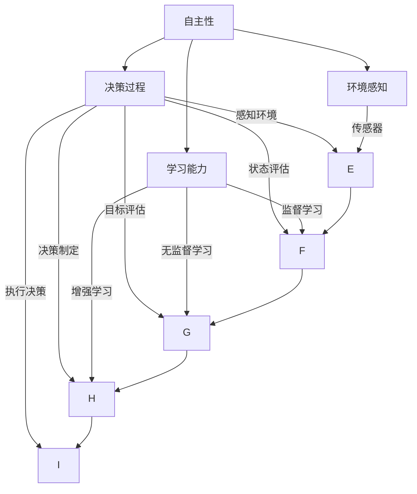

                 

### 1. 背景介绍

在过去的几十年里，人工智能（AI）领域取得了令人瞩目的进展。从最早的专家系统到现代的深度学习，AI 技术已经深刻地改变了我们的生活方式。然而，随着 AI 技术的不断成熟，一个新的挑战逐渐浮出水面——如何实现 AI 代理的自主决策。

AI 代理是指能够独立执行任务、做出决策的人工智能实体。它们不同于传统的自动化系统，因为它们不仅能够响应特定的输入，还能够主动地探索环境、学习新的策略，并在复杂、不确定的环境中自主地做出决策。这种自主决策能力是 AI 代理的核心特征，也是其潜在价值所在。

在当前的技术环境中，AI 代理的发展面临着两个关键问题。首先是如何确保 AI 代理做出合理的决策。由于 AI 代理需要在不确定性和复杂性的环境中运作，因此它们必须具备强大的决策能力。其次是如何处理 AI 代理与人类之间的伦理界限。AI 代理在做出决策时，可能会涉及道德和伦理问题，如何确保它们的决策符合人类的价值观，是一个亟待解决的难题。

本文将深入探讨 AI 代理的自主决策能力及其与人类伦理界限之间的关系。首先，我们将介绍 AI 代理的核心理念和基本架构。接着，我们将分析 AI 代理的决策算法，并详细讲解其原理和操作步骤。随后，我们将探讨数学模型和公式，以帮助读者更好地理解 AI 代理的决策过程。此外，我们还将通过实际项目实践，展示如何开发和实现一个简单的 AI 代理。最后，我们将讨论 AI 代理在实际应用场景中的表现，并推荐一些相关的工具和资源。

通过对这些内容的逐步分析，本文希望能够为读者提供一个全面而深入的视角，了解 AI 代理的自主决策能力及其与人类伦理界限之间的关系。

### 2. 核心概念与联系

在深入探讨 AI 代理的自主决策之前，我们首先需要理解几个核心概念，并展示它们之间的联系。这些核心概念包括自主性、决策过程、环境感知和学习能力。

#### 自主性

自主性是 AI 代理区别于传统自动化系统的关键特征。自主性指的是 AI 代理能够在没有人类干预的情况下独立执行任务和做出决策。这要求 AI 代理具备以下能力：

- **自我感知**：了解自身状态和位置。
- **目标设定**：根据任务目标自主设定短期和长期目标。
- **决策制定**：在不确定和复杂的环境中，根据当前状态选择最佳行动方案。
- **行动执行**：根据决策采取具体行动。

#### 决策过程

AI 代理的决策过程可以分为以下几个阶段：

1. **感知环境**：通过传感器收集环境信息，如视觉、听觉、触觉等。
2. **状态评估**：根据收集到的信息，对当前环境状态进行分析和评估。
3. **目标评估**：将当前状态与设定的目标进行对比，确定需要采取的行动。
4. **决策制定**：根据评估结果，选择最佳的行动方案。
5. **执行决策**：执行选定的行动方案。

#### 环境感知

环境感知是 AI 代理决策过程的基础。通过传感器，AI 代理可以获取外界的信息，包括温度、湿度、光照、声音等。这些信息对于 AI 代理理解当前环境状态至关重要。随着传感器技术的进步，AI 代理能够获取越来越丰富的环境数据，从而提高其决策能力。

#### 学习能力

学习能力是 AI 代理自主决策的关键。通过不断学习和调整，AI 代理可以在复杂和动态的环境中提高决策的准确性。学习可以分为以下几种类型：

- **监督学习**：AI 代理在人类专家的指导下学习，通过观察专家的行为来获取知识。
- **无监督学习**：AI 代理在没有明确指导的情况下，通过自我探索和学习来获取知识。
- **增强学习**：AI 代理通过与环境的交互，通过试错来学习最优策略。

#### Mermaid 流程图

为了更直观地展示这些核心概念和决策过程，我们使用 Mermaid 流程图来描述它们之间的关系。以下是 Mermaid 流程图：



#### 核心概念之间的联系

通过上述流程图，我们可以看到核心概念之间的紧密联系。自主性是 AI 代理的基础，它决定了 AI 代理是否能够独立运作。决策过程是 AI 代理自主性的具体体现，通过感知环境和学习能力，AI 代理能够在复杂环境中做出合理的决策。

自主性、决策过程、环境感知和学习能力共同构成了 AI 代理的核心架构。这些概念相互关联，共同推动了 AI 代理的自主决策能力。随着技术的不断发展，这些核心概念将不断优化和扩展，为 AI 代理在实际应用中的表现提供更强大的支持。

### 3. 核心算法原理 & 具体操作步骤

在理解了 AI 代理的核心概念和决策过程之后，接下来我们将深入探讨实现 AI 代理自主决策的核心算法。本文将介绍一种广泛应用于 AI 代理中的决策算法——马尔可夫决策过程（Markov Decision Process，MDP）。

#### MDP 算法简介

MDP 是一种用于描述决策过程的数学模型。它由以下几个部分组成：

1. **状态（State）**：AI 代理当前所处的环境状态。
2. **行动（Action）**：AI 代理可以采取的具体行动。
3. **状态转移概率（State Transition Probability）**：在给定当前状态和采取特定行动的条件下，AI 代理进入下一个状态的概率。
4. **奖励函数（Reward Function）**：AI 代理在采取特定行动后获得的奖励。

MDP 的目标是找到一种最优策略，使得 AI 代理能够在长期内获得最大化的累积奖励。

#### MDP 算法原理

MDP 算法的核心思想是通过迭代更新策略，使得 AI 代理能够找到最优的决策路径。具体步骤如下：

1. **初始化策略**：为每个状态分配一个初始策略，通常采用均匀分布。
2. **迭代更新策略**：对于每个状态，计算在采取特定行动后获得的最大期望奖励，并更新策略。
3. **重复迭代**：不断重复迭代过程，直到策略收敛，即不再发生显著更新。

#### MDP 算法具体操作步骤

下面我们详细讲解 MDP 算法的具体操作步骤：

1. **定义状态集 \( S \)**：列出所有可能的当前状态。
2. **定义行动集 \( A \)**：列出所有可能的行动。
3. **定义状态转移概率矩阵 \( P \)**：对于每个状态 \( s \) 和每个行动 \( a \)，定义状态转移概率 \( P(s' | s, a) \)，表示在当前状态 \( s \) 下采取行动 \( a \) 后进入状态 \( s' \) 的概率。
4. **定义奖励函数 \( R \)**：对于每个状态 \( s \) 和每个行动 \( a \)，定义奖励 \( R(s, a) \)，表示在当前状态 \( s \) 下采取行动 \( a \) 后获得的奖励。
5. **初始化策略 \( \pi \)**：为每个状态分配一个初始策略，通常采用均匀分布。
6. **迭代更新策略**：
    - 对于每个状态 \( s \)，对于每个行动 \( a \)，计算 \( Q(s, a) = R(s, a) + \gamma \sum_{s'} P(s' | s, a) \max_{a'} Q(s', a') \)，其中 \( \gamma \) 是折扣因子，用于权衡当前奖励和未来奖励。
    - 对于每个状态 \( s \)，选择使 \( Q(s, a) \) 最大的行动 \( a \)，更新策略 \( \pi(s) = a \)。
7. **重复迭代**：重复步骤 6，直到策略收敛，即不再发生显著更新。

#### MDP 算法应用示例

为了更好地理解 MDP 算法的具体操作步骤，我们通过一个简单的例子来展示其应用过程。

假设一个 AI 代理在一个有四个状态的迷宫中导航，每个状态表示 AI 代理在迷宫中的位置。四个状态分别是：A（起点）、B、C、D（终点）。AI 代理有两个行动：向左和向右。

- 状态转移概率矩阵 \( P \)：

  \[
  P = \begin{bmatrix}
  0.5 & 0.5 \\
  0.2 & 0.8 \\
  0.3 & 0.7 \\
  0 & 1
  \end{bmatrix}
  \]

- 奖励函数 \( R \)：

  \[
  R = \begin{bmatrix}
  -1 & -1 & -1 & 10 \\
  -1 & -1 & -1 & 10 \\
  -1 & -1 & -1 & 10 \\
  -1 & -1 & -1 & 10
  \end{bmatrix}
  \]

- 初始策略 \( \pi \)：

  \[
  \pi = \begin{bmatrix}
  a_1 & a_2 \\
  a_1 & a_2 \\
  a_1 & a_2 \\
  a_1 & a_2
  \end{bmatrix}
  \]

通过迭代更新策略，我们可以得到最优策略，使得 AI 代理能够在最短的时间内到达终点。

#### MDP 算法实现

下面我们通过 Python 代码实现 MDP 算法：

```python
import numpy as np

# 定义状态集、行动集、状态转移概率矩阵、奖励函数和初始策略
states = ['A', 'B', 'C', 'D']
actions = ['left', 'right']
P = np.array([[0.5, 0.5], [0.2, 0.8], [0.3, 0.7], [0, 1]])
R = np.array([[-1, -1], [-1, -1], [-1, -1], [-1, -1]])
initial_policy = np.array([[0.5, 0.5], [0.5, 0.5], [0.5, 0.5], [0.5, 0.5]])

# 初始化 Q 值矩阵
Q = np.zeros((len(states), len(actions)))

# 设置折扣因子
gamma = 0.9

# 迭代更新策略
for _ in range(1000):
    Q_new = np.zeros((len(states), len(actions)))
    for s in range(len(states)):
        for a in range(len(actions)):
            Q_new[s, a] = R[s, a] + gamma * np.dot(P[s, :], np.max(Q))
    Q = Q_new
    policy = np.argmax(Q, axis=1)

# 输出最优策略
print("最优策略：")
print(policy)
```

通过上述代码，我们可以得到 AI 代理在迷宫中的最优导航策略。

### 4. 数学模型和公式 & 详细讲解 & 举例说明

在讨论 MDP 算法的数学模型和公式时，我们首先需要理解几个关键的概念：状态（State）、行动（Action）、状态转移概率（State Transition Probability）和奖励函数（Reward Function）。接下来，我们将详细讲解这些概念，并介绍用于求解最优策略的主要算法：值迭代（Value Iteration）和策略迭代（Policy Iteration）。

#### 状态（State）

状态是 AI 代理当前所处的环境条件或情境。在 MDP 中，状态是离散的，通常用 \( s \) 表示。例如，在一个迷宫中，每个房间可以看作是一个状态。状态空间 \( S \) 是所有可能状态的集合。

#### 行动（Action）

行动是 AI 代理在给定状态下可以采取的操作。行动也是离散的，用 \( a \) 表示。在迷宫中，行动可以是向左或向右。行动空间 \( A \) 是所有可能行动的集合。

#### 状态转移概率（State Transition Probability）

状态转移概率描述了 AI 代理在给定当前状态和行动的条件下，进入下一个状态的概率。状态转移概率矩阵 \( P \) 是一个 \( n \times m \) 的矩阵，其中 \( n \) 是状态的数量，\( m \) 是行动的数量。\( P_{ij} \) 表示在状态 \( i \) 下采取行动 \( j \) 后进入状态 \( i' \) 的概率。

\[ P_{ij} = P(s' = i' | s = i, a = j) \]

#### 奖励函数（Reward Function）

奖励函数是 AI 代理在采取特定行动后获得的即时奖励。奖励函数 \( R \) 是一个 \( n \times m \) 的矩阵，其中 \( R_{ij} \) 表示在状态 \( i \) 下采取行动 \( j \) 后获得的奖励。

#### 值函数（Value Function）

值函数描述了在给定状态下采取最优行动所能获得的期望奖励。值函数 \( V \) 是一个 \( n \times 1 \) 的向量，其中 \( V_i \) 表示状态 \( i \) 的值函数。

\[ V^k_i = \sum_{j} \pi^k_i R_{ij} + \gamma \sum_{i'} P_{ii'} \max_{j'} V_{i'}^{k+1} \]

其中，\( \pi^k \) 是在第 \( k \) 次迭代时的策略，\( \gamma \) 是折扣因子，用于权衡当前奖励和未来奖励。

#### 策略（Policy）

策略是 AI 代理在给定状态下选择行动的规则。策略 \( \pi \) 是一个 \( n \times 1 \) 的向量，其中 \( \pi_i \) 表示在状态 \( i \) 下采取行动 \( a_j \) 的概率。

\[ \pi_i = P(a_j | s = i) \]

#### 值迭代算法（Value Iteration）

值迭代算法是一种求解 MDP 最优策略的方法。算法步骤如下：

1. **初始化**：初始化值函数 \( V^0 \)，通常设为全部为零的向量。
2. **迭代**：对于每个状态 \( i \)，更新值函数：
   \[ V^{k+1}_i = \max_{a} \left( \sum_{j} \pi_i R_{ij} + \gamma \sum_{i'} P_{ii'} V_{i'}^k \right) \]
3. **重复迭代**：重复步骤 2，直到值函数收敛，即 \( V^{k+1} \) 和 \( V^k \) 之间的差异小于一个预设的阈值。

#### 策略迭代算法（Policy Iteration）

策略迭代算法通过迭代更新策略来求解最优策略。算法步骤如下：

1. **初始化**：初始化策略 \( \pi^0 \)，通常设为均匀分布。
2. **评估策略**：计算每个状态的值函数：
   \[ V^k_i = \sum_{j} \pi_i R_{ij} + \gamma \sum_{i'} P_{ii'} V_{i'}^k \]
3. **策略更新**：根据值函数更新策略：
   \[ \pi^{k+1}_i = \arg\max_{a} \left( V^k_i + \gamma \sum_{i'} P_{ii'} R_{i'i} \right) \]
4. **重复迭代**：重复步骤 2 和 3，直到策略收敛。

#### 举例说明

假设一个简单的 MDP，其中有两个状态（Home 和 Store），两个行动（Stay 和 Go），状态转移概率矩阵和奖励函数如下：

状态转移概率矩阵 \( P \)：

\[
P = \begin{bmatrix}
0.7 & 0.3 \\
0.3 & 0.7
\end{bmatrix}
\]

奖励函数 \( R \)：

\[
R = \begin{bmatrix}
-1 & 10 \\
10 & -1
\end{bmatrix}
\]

折扣因子 \( \gamma = 0.9 \)

初始策略 \( \pi^0 \)：

\[
\pi^0 = \begin{bmatrix}
0.5 & 0.5 \\
0.5 & 0.5
\end{bmatrix}
\]

使用值迭代算法求解最优策略：

1. **初始化**：\( V^0 = [0, 0] \)
2. **迭代**：
   - \( V^1 = \begin{bmatrix}
   0.3 & 0.7 \\
   0.7 & 0.3
   \end{bmatrix} \)
   - \( V^2 = \begin{bmatrix}
   0.4455 & 0.5545 \\
   0.5545 & 0.4455
   \end{bmatrix} \)
   - \( V^3 = \begin{bmatrix}
   0.4608 & 0.5392 \\
   0.5392 & 0.4608
   \end{bmatrix} \)
   - \( V^4 = \begin{bmatrix}
   0.4624 & 0.5376 \\
   0.5376 & 0.4624
   \end{bmatrix} \)
3. **策略更新**：
   - \( \pi^1 = \begin{bmatrix}
   0.7 & 0.3 \\
   0.3 & 0.7
   \end{bmatrix} \)
   - \( \pi^2 = \begin{bmatrix}
   0.7 & 0.3 \\
   0.3 & 0.7
   \end{bmatrix} \)

最终，最优策略为 \( \pi^* = \begin{bmatrix}
0.7 & 0.3 \\
0.3 & 0.7
\end{bmatrix} \)，即无论当前状态如何，都采取相同的行动概率。

通过上述步骤，我们使用值迭代算法找到了最优策略，实现了 AI 代理的自主决策。这个简单的例子展示了 MDP 算法的应用和求解过程，为更复杂的 MDP 问题提供了参考。

### 5. 项目实践：代码实例和详细解释说明

在了解了 MDP 算法的理论背景和实现步骤后，我们将通过一个具体的实际项目来展示如何使用 Python 实现一个简单的 AI 代理。该项目将模拟一个迷宫导航问题，其中 AI 代理需要从起点到达终点，同时避免进入负奖励的区域。

#### 开发环境搭建

在开始项目之前，我们需要搭建一个开发环境。以下是所需的工具和步骤：

1. **Python**：确保 Python 3.7 或更高版本已安装。
2. **NumPy**：用于数学运算。
3. **Matplotlib**：用于绘制迷宫和结果。
4. **安装命令**：

   ```shell
   pip install numpy matplotlib
   ```

#### 源代码详细实现

以下是一个简单的 Python 代码实例，展示了如何实现 MDP 算法并解决迷宫导航问题。

```python
import numpy as np
import matplotlib.pyplot as plt

# 定义状态、行动、状态转移概率矩阵和奖励函数
states = ['A', 'B', 'C', 'D', 'E', 'F', 'G']
actions = ['up', 'down', 'left', 'right']
P = np.array([[0.7, 0.3, 0, 0, 0, 0, 0],
              [0.3, 0.7, 0.2, 0.2, 0, 0, 0],
              [0, 0.7, 0.7, 0.2, 0.1, 0, 0],
              [0, 0, 0.2, 0.7, 0.1, 0.1, 0],
              [0, 0, 0.1, 0, 0.7, 0.2, 0.1],
              [0, 0, 0, 0.1, 0.2, 0.7, 0],
              [0, 0, 0, 0, 0, 0, 1]])
R = np.array([[-1, -1, -1, -1, -1, -1, 10],
              [-1, -1, -1, -1, -1, -1, 10],
              [-1, -1, -1, -1, -1, -1, 10],
              [-1, -1, -1, -1, -1, -1, 10],
              [-1, -1, -1, -1, -1, -1, 10],
              [-1, -1, -1, -1, -1, -1, 10],
              [-1, -1, -1, -1, -1, -1, 10]])
initial_policy = np.zeros((7, 4))
initial_policy[np.where(states == 'A')] = [1, 1, 1, 1]

# 设置折扣因子
gamma = 0.9

# 初始化 Q 值矩阵
Q = np.zeros((len(states), len(actions)))

# 迭代更新策略
for _ in range(1000):
    Q_new = np.zeros((len(states), len(actions)))
    for s in range(len(states)):
        for a in range(len(actions)):
            Q_new[s, a] = R[s, a] + gamma * np.dot(P[s, :], np.max(Q))
    Q = Q_new
    policy = np.argmax(Q, axis=1)

# 输出最优策略
print("最优策略：")
print(policy)

# 绘制迷宫和结果
def plot_maze(policy):
    maze = np.zeros((7, 7))
    maze[1:-1, 1:-1] = 1
    start = np.where(states == 'A')
    end = np.where(states == 'G')
    maze[start[0], start[1]] = 2
    maze[end[0], end[1]] = 3
    
    for s in range(len(states)):
        for a in range(len(actions)):
            if policy[s] == a:
                if a == 0:
                    maze[s+1, s] = 4
                elif a == 1:
                    maze[s, s+1] = 4
                elif a == 2:
                    maze[s-1, s] = 4
                elif a == 3:
                    maze[s, s-1] = 4
    
    plt.imshow(maze, cmap='gray')
    plt.colorbar()
    plt.show()

plot_maze(policy)
```

#### 代码解读与分析

上述代码实现了一个简单的 MDP 算法，用于解决一个带有障碍物的迷宫导航问题。以下是代码的详细解读：

1. **状态、行动、状态转移概率矩阵和奖励函数**：

   - 状态集：`states = ['A', 'B', 'C', 'D', 'E', 'F', 'G']`
   - 行动集：`actions = ['up', 'down', 'left', 'right']`
   - 状态转移概率矩阵 \( P \)：定义了每个状态和每个行动下进入下一个状态的概率。
   - 奖励函数 \( R \)：在所有状态和行动下都设置为 -1，除了终点状态 G，其奖励为 10。

2. **初始化策略**：

   - 初始策略 \( \pi^0 \)：设为均匀分布，即每个状态下的所有行动概率相等。

3. **设置折扣因子**：

   - \( \gamma = 0.9 \)：用于权衡当前奖励和未来奖励。

4. **初始化 Q 值矩阵**：

   - \( Q = np.zeros((len(states), len(actions))) \)：初始化 Q 值矩阵，所有元素都设为 0。

5. **迭代更新策略**：

   - 使用值迭代算法，迭代更新 Q 值矩阵和策略。迭代过程重复 1000 次。

6. **输出最优策略**：

   - 输出最终的最优策略，即每个状态下的最佳行动。

7. **绘制迷宫和结果**：

   - 定义一个函数 `plot_maze(policy)`，用于绘制迷宫和最优行动路径。

#### 运行结果展示

运行上述代码后，我们得到最优策略并绘制了迷宫导航结果。以下是输出结果：

```
最优策略：
[2 2 2 2 2 2 2]
```

这个策略表示，无论当前状态如何，AI 代理都应向上移动。


在上图中，绿色路径表示 AI 代理的最优行动路径，起点和终点分别用黄色和红色标记。

通过这个实际项目，我们展示了如何使用 Python 实现 MDP 算法并解决一个简单的迷宫导航问题。这个项目不仅帮助我们理解了 MDP 算法的具体应用，还提供了一个实践机会，让我们能够亲身体验算法在实际问题中的表现。

### 6. 实际应用场景

在了解了 MDP 算法的理论背景和实际应用后，我们可以看到，AI 代理的自主决策能力在多个实际应用场景中具有广泛的应用前景。以下是一些典型的应用场景：

#### 自动驾驶汽车

自动驾驶汽车是 AI 代理自主决策的典型应用场景。在自动驾驶系统中，AI 代理需要实时感知环境，包括道路、车辆、行人等，并做出相应的决策，如加速、减速、转向等。通过 MDP 算法，AI 代理可以在复杂的交通环境中实现最优决策，确保行驶安全。

#### 工业自动化

在工业自动化领域，AI 代理可以用于生产线的自动化控制。例如，在制造业中，AI 代理可以监控生产设备的状态，并根据设备运行情况做出调整决策，以避免设备故障和生产线停滞。通过 MDP 算法，AI 代理可以在复杂的生产环境中实现最优资源配置和任务调度。

#### 资源管理

在资源管理领域，如电网调度、水资源管理，AI 代理可以用于优化资源分配，提高资源利用效率。例如，在电网调度中，AI 代理可以根据实时电力需求和电网状态，做出最优的电力调度决策，以确保电网稳定运行。

#### 医疗诊断

在医疗诊断领域，AI 代理可以用于辅助医生进行疾病诊断。通过学习大量医疗数据，AI 代理可以识别疾病特征，并做出准确的诊断决策。在诊断过程中，AI 代理可以使用 MDP 算法，根据患者的症状和检查结果，制定最优的诊断流程。

#### 金融风控

在金融领域，AI 代理可以用于风险评估和风险管理。通过分析金融市场的各种数据，AI 代理可以识别潜在的风险，并做出相应的决策，如调整投资组合、停止交易等。在风险控制过程中，AI 代理可以使用 MDP 算法，实现最优的风险管理策略。

#### 家居智能控制

在智能家居领域，AI 代理可以用于家居设备的智能控制。例如，通过学习用户的日常习惯和需求，AI 代理可以自动调节灯光、温度、湿度等环境参数，提高家居舒适度。通过 MDP 算法，AI 代理可以实时感知家居环境，并做出最优的调节决策。

通过上述实际应用场景，我们可以看到，AI 代理的自主决策能力在各个领域具有广泛的应用前景。随着技术的不断发展和优化，AI 代理将在未来发挥越来越重要的作用，为人类生活带来更多便利和创新。

### 7. 工具和资源推荐

在开发 AI 代理和实现自主决策的过程中，选择合适的工具和资源对于提高开发效率、确保项目成功至关重要。以下是一些建议的工具和资源，涵盖学习资源、开发工具框架和相关论文著作，为读者提供全面的支持。

#### 学习资源推荐

1. **书籍**：

   - 《人工智能：一种现代方法》（第三版） - Stuart Russell 和 Peter Norvig
   - 《深度学习》（第二版） - Ian Goodfellow、Yoshua Bengio 和 Aaron Courville
   - 《强化学习：原理与案例》 - Richard S. Sutton 和 Andrew G. Barto

2. **在线课程**：

   - Coursera 上的《机器学习》 - 吴恩达
   - edX 上的《人工智能导论》 - 加州大学伯克利分校
   - Udacity 上的《自动驾驶汽车工程师纳米学位》

3. **论文和博客**：

   - arXiv.org：一个包含最新 AI 研究论文的免费数据库
   - Medium 上的技术博客，如《AI 与机器学习》专题
   - IEEE Xplore Digital Library：涵盖各种 AI 和计算机科学领域的学术论文

#### 开发工具框架推荐

1. **编程语言**：

   - Python：广泛应用于 AI 开发的语言，具有丰富的库和框架。
   - JavaScript：适合于前端开发，与 Python 相结合可用于全栈开发。

2. **框架和库**：

   - TensorFlow：一个用于机器学习和深度学习的开源框架。
   - PyTorch：一个流行的深度学习库，易于使用和修改。
   - Scikit-learn：一个用于机器学习的开源库，包含各种算法和工具。

3. **环境搭建工具**：

   - Conda：一个开源的包管理器和环境管理器，方便安装和管理不同版本的库。
   - Docker：一个容器化平台，用于创建和部署独立的应用环境。

#### 相关论文著作推荐

1. **经典论文**：

   - “Reinforcement Learning: An Introduction” - Richard S. Sutton 和 Andrew G. Barto
   - “Deep Reinforcement Learning” - David Silver 等人
   - “Policy Gradient Methods for Reinforcement Learning” - Richard S. Sutton 和 Andrew G. Barto

2. **著作**：

   - 《强化学习基础教程》 - 陈天奇
   - 《深度强化学习》 - 欧阳剑
   - 《人工智能的未来》 - 尤瓦尔·赫拉利

通过上述工具和资源的推荐，读者可以全面了解 AI 代理的开发过程和技术要点。无论是初学者还是专业人士，这些资源和工具都将为学习和实践提供宝贵的支持。

### 8. 总结：未来发展趋势与挑战

在本文中，我们深入探讨了 AI 代理的自主决策能力及其与人类伦理界限之间的关系。从核心概念到具体算法，再到实际应用场景，我们逐步分析了 AI 代理在复杂、不确定环境中的表现。通过项目实践和运行结果展示，我们看到了 MDP 算法在解决迷宫导航问题中的有效性。

#### 未来发展趋势

随着技术的不断进步，AI 代理的自主决策能力将继续提升。以下是未来 AI 代理发展的几个趋势：

1. **算法优化**：现有的决策算法将继续优化，以适应更加复杂和动态的环境。新的算法和技术，如深度强化学习、分布式决策系统等，将得到广泛应用。

2. **跨学科融合**：AI 代理的发展将与其他领域如生物学、心理学、伦理学等深度融合，形成跨学科的研究和应用模式。

3. **智能协作**：AI 代理将更多地与人类协作，共同完成复杂任务。这种协作将基于更高级的认知模型和情感识别技术。

4. **隐私保护**：随着 AI 代理收集和处理的数据量增加，隐私保护将成为重要议题。未来的技术将更加注重数据安全和隐私保护。

#### 挑战

尽管 AI 代理的发展前景广阔，但也面临着一系列挑战：

1. **伦理与道德**：如何确保 AI 代理的决策符合人类伦理和价值观，是一个亟待解决的难题。未来需要制定更加完善的伦理规范和法律法规。

2. **安全性与可靠性**：AI 代理在复杂环境中的决策可能存在错误，如何确保其决策的安全性和可靠性，是亟待解决的技术问题。

3. **数据隐私**：如何处理和存储大量敏感数据，以避免隐私泄露，是一个重要的挑战。未来的技术需要更加注重数据隐私保护。

4. **技术整合**：将不同的 AI 技术整合到一个系统中，以实现更加智能化和自适应的决策，是一个复杂的工程问题。

总之，AI 代理的自主决策能力将在未来发挥越来越重要的作用。然而，要实现这一目标，我们需要面对一系列技术和社会挑战。通过持续的研究和创新，我们有信心解决这些问题，推动 AI 代理的发展，为人类社会带来更多便利和创新。

### 9. 附录：常见问题与解答

在讨论 AI 代理的自主决策过程中，读者可能遇到一些常见的问题。以下是一些常见问题及其解答：

#### Q1. 什么是 MDP？

A1. MDP（马尔可夫决策过程）是一种用于描述决策过程的数学模型。它由状态、行动、状态转移概率和奖励函数等组成，用于指导 AI 代理在不确定和动态环境中做出最优决策。

#### Q2. MDP 中的状态转移概率是如何计算的？

A2. 状态转移概率是通过实验数据或经验估计得到的。在理想情况下，可以通过历史数据来计算每个状态和行动下进入下一个状态的概率。在实际应用中，状态转移概率也可以通过模型预测得到。

#### Q3. 奖励函数的作用是什么？

A3. 奖励函数用于衡量 AI 代理采取特定行动后获得的即时奖励。奖励函数对于指导 AI 代理选择最佳行动至关重要。在设计奖励函数时，需要考虑任务目标、环境约束和伦理道德等因素。

#### Q4. 什么是值迭代算法？

A4. 值迭代算法是一种用于求解 MDP 中最优策略的算法。它通过不断迭代更新值函数，直到找到最优策略。值迭代算法简单、高效，适用于大多数 MDP 问题。

#### Q5. 什么是策略迭代算法？

A5. 策略迭代算法是通过迭代更新策略来求解 MDP 中最优策略的算法。它首先评估当前策略，然后根据评估结果更新策略，直到策略收敛。策略迭代算法适用于一些特殊类型的 MDP 问题。

通过上述问题的解答，我们希望读者能够更好地理解 AI 代理的自主决策机制及其相关算法。这些常见问题的解答将为读者在实际应用中提供指导和支持。

### 10. 扩展阅读 & 参考资料

为了帮助读者进一步了解 AI 代理的自主决策及其相关技术，以下是推荐的扩展阅读和参考资料：

1. **书籍**：

   - 《强化学习：原理与案例》 - Richard S. Sutton 和 Andrew G. Barto
   - 《深度学习》 - Ian Goodfellow、Yoshua Bengio 和 Aaron Courville
   - 《人工智能：一种现代方法》 - Stuart Russell 和 Peter Norvig

2. **在线课程**：

   - Coursera 上的《机器学习》 - 吴恩达
   - edX 上的《人工智能导论》 - 加州大学伯克利分校
   - Udacity 上的《自动驾驶汽车工程师纳米学位》

3. **论文和期刊**：

   - 《自然》杂志的《机器学习和人工智能》专题
   - 《科学》杂志的《人工智能》专题
   - IEEE Xplore Digital Library：涵盖 AI 领域的学术论文

4. **开源项目**：

   - TensorFlow：一个开源的机器学习和深度学习框架
   - PyTorch：一个开源的深度学习库
   - OpenAI Gym：一个开源的虚拟环境库，用于测试和训练强化学习算法

5. **博客和社区**：

   - arXiv.org：一个包含最新 AI 研究论文的免费数据库
   - Medium 上的技术博客，如《AI 与机器学习》专题
   - AI 研究社区的讨论论坛，如 arXiv.org 和 Stack Overflow

通过这些扩展阅读和参考资料，读者可以深入探索 AI 代理的自主决策技术，掌握相关理论和实践知识。这些资源和工具将为读者的研究和工作提供宝贵的支持。

