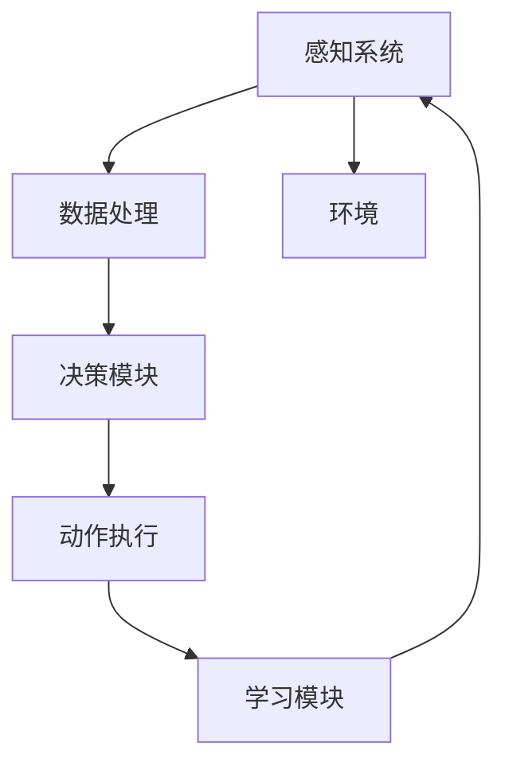

                 

### 背景介绍 Background

在人工智能（AI）迅猛发展的时代，AI Agent作为一个能够自主决策、执行任务的实体，正逐渐成为研究和应用的热点。AI Agent不仅仅是一个执行预设命令的工具，更是具备自主思考、决策能力的智能体，它在多个领域展现出巨大的潜力和应用价值。

#### 历史与发展

AI Agent的概念可以追溯到20世纪50年代，当时人工智能的研究刚刚起步。早期的AI Agent主要以专家系统为主，它们通过预定义的规则库来进行推理和决策。然而，随着时间的发展，计算能力的提升和算法的进步，AI Agent的定义和实现方法也在不断演进。从基于规则的专家系统，发展到基于统计模型的机器学习，再到现在的基于深度学习的强化学习，AI Agent的自主决策能力得到了极大的提升。

#### 当下趋势

当前，AI Agent的研究和应用正处于一个快速发展的阶段。随着云计算、物联网、5G等技术的发展，AI Agent在多个领域得到了广泛应用。例如，自动驾驶汽车中的AI Agent能够实时感知环境、做出决策；智能家居中的AI Agent能够根据用户习惯进行自动化设置；而在商业领域，AI Agent则被用于客户服务、市场分析等多个方面。

#### 社会影响

AI Agent的崛起不仅改变了技术领域，还对社会的各个方面产生了深远的影响。首先，AI Agent的自动化决策能力提高了生产效率，减少了人力成本。其次，AI Agent的广泛应用使得人工智能技术更加普及，推动了人工智能的普及化和商业化。然而，AI Agent的发展也带来了一系列的挑战，如隐私保护、道德伦理等问题。

#### 本文结构

本文将围绕AI Agent的自主决策能力展开讨论。首先，我们将介绍AI Agent的核心概念和原理，并通过Mermaid流程图展示其架构。接着，我们将深入探讨AI Agent的核心算法原理和操作步骤，并通过数学模型和公式进行详细讲解。随后，我们将通过实际项目实践，展示AI Agent的开发过程和运行结果。最后，我们将分析AI Agent的实际应用场景，推荐相关工具和资源，并总结未来发展趋势与挑战。

通过这篇文章，我们希望读者能够对AI Agent有一个全面深入的了解，认识到其在现代技术和社会中的重要地位和潜在价值。接下来，我们将逐步展开对AI Agent的深入探讨。

### 核心概念与联系 Core Concepts and Connections

为了更好地理解AI Agent的自主决策能力，我们首先需要介绍其核心概念和基本原理。AI Agent的自主决策能力来源于其对环境的感知、理解和反应能力。以下是AI Agent的几个核心概念和其相互之间的联系：

#### 1. 感知（Perception）

感知是AI Agent对外部环境的理解和识别过程。感知系统通常依赖于各种传感器，如摄像头、麦克风、温度传感器等，以获取环境中的数据。这些数据经过预处理后，被输入到AI Agent的决策模块中。

#### 2. 决策（Decision Making）

决策是AI Agent的核心功能。基于感知系统提供的环境数据，AI Agent会利用预设的算法或学习到的模型，进行分析和推理，从而生成相应的决策。决策可以是简单的任务执行，也可以是复杂的策略选择。

#### 3. 动作（Action）

动作是AI Agent根据决策执行的具体操作。例如，在自动驾驶汽车中，AI Agent会根据感知到的路况、交通信号等信息，控制车辆的转向、加速或制动。

#### 4. 学习（Learning）

学习是AI Agent不断优化自身决策能力的过程。通过历史数据的分析和模式识别，AI Agent能够学习到更有效的决策策略，从而提高其自主决策能力。

#### 5. 交互（Interaction）

交互是AI Agent与环境之间的互动过程。通过感知、决策和动作，AI Agent能够与环境进行有效的沟通和协作，从而实现更加智能和高效的运行。

下面我们通过Mermaid流程图来展示AI Agent的核心架构及其各个部分之间的联系：



在这个流程图中，感知系统（A）负责收集环境数据，数据经过处理（B）后输入到决策模块（C），决策模块（C）生成决策，决策（D）最终转化为具体的动作执行。同时，学习模块（E）通过分析历史数据，不断优化决策模块（C），从而提高AI Agent的整体性能。

#### 概念之间的关系

- **感知**与**学习**之间的关系：感知系统收集到的数据是学习的基础，而学习的结果则反作用于感知系统，帮助其更好地理解和适应环境。

- **决策**与**动作**之间的关系：决策是AI Agent的核心，它决定了动作的执行方式。通过不断优化决策模型，AI Agent能够更加精准地执行动作。

- **动作**与**环境**之间的关系：动作的执行直接影响环境，同时环境的反馈又影响AI Agent的感知和决策。

通过以上核心概念和相互之间的联系，我们可以看到，AI Agent的自主决策能力是通过多个组件的协同工作实现的。在下一节中，我们将深入探讨AI Agent的核心算法原理和操作步骤。

### 核心算法原理 & 具体操作步骤 Core Algorithm Principles & Operational Steps

在了解了AI Agent的核心概念及其相互联系后，接下来我们将深入探讨其核心算法原理和具体操作步骤。AI Agent的自主决策能力主要依赖于以下几个核心算法和流程：

#### 1. 感知算法

感知算法是AI Agent对外部环境进行理解和识别的过程。它通过传感器收集环境数据，然后进行预处理，以便后续的决策和分析。感知算法通常包括以下步骤：

- **数据采集**：通过摄像头、麦克风、温度传感器等传感器收集环境数据。
- **预处理**：对采集到的数据进行滤波、去噪、归一化等预处理，以提高数据质量和后续分析的准确性。
- **特征提取**：从预处理后的数据中提取出具有代表性的特征，如图像中的边缘、颜色、纹理，声音中的频率、节奏等。

#### 2. 决策算法

决策算法是AI Agent的核心，它根据感知系统提供的环境数据，生成相应的决策。常见的决策算法包括：

- **规则推理**：基于预定义的规则库进行推理，判断当前状态应该采取哪种动作。
- **机器学习**：利用历史数据训练决策模型，通过模型预测当前状态的最佳动作。
- **强化学习**：通过试错和奖励反馈，不断调整决策策略，以实现最优决策。

决策算法的具体操作步骤如下：

- **状态识别**：根据感知系统提供的数据，识别当前的环境状态。
- **策略选择**：从预设的规则库或训练好的模型中，选择最适合当前状态的策略。
- **决策生成**：根据选定的策略，生成具体的决策结果。

#### 3. 动作算法

动作算法是AI Agent根据决策结果，执行具体操作的过程。动作算法通常包括以下步骤：

- **动作生成**：根据决策结果，生成具体的动作指令。
- **动作执行**：将动作指令传递给执行系统，如机械臂、无人机等，执行具体的操作。
- **反馈收集**：执行动作后，收集环境反馈，用于调整后续的决策。

#### 4. 学习算法

学习算法是AI Agent不断优化自身决策能力的过程。通过分析历史数据和执行结果，学习算法能够识别出有效的决策策略，并不断优化。常见的学习算法包括：

- **监督学习**：通过标注好的数据集，训练模型，使其能够对新的数据进行预测。
- **无监督学习**：通过未标注的数据，发现数据中的模式和规律，自动进行特征提取。
- **强化学习**：通过试错和奖励反馈，不断调整策略，以实现最优决策。

学习算法的具体操作步骤如下：

- **数据收集**：收集AI Agent执行任务时的数据，包括感知数据、决策结果和动作反馈。
- **模式识别**：分析历史数据，识别出有效的决策策略。
- **策略优化**：根据识别出的策略，对决策模型进行优化，以提高决策准确性。

#### 5. 交互算法

交互算法是AI Agent与环境之间进行有效沟通和协作的过程。通过感知、决策和动作，AI Agent能够与环境进行实时交互，并根据交互结果调整自身行为。交互算法通常包括以下步骤：

- **感知交互**：感知环境中的交互信号，如语音、手势等。
- **决策交互**：根据感知到的交互信号，生成相应的决策结果。
- **动作交互**：执行决策结果，与环境进行互动。
- **反馈交互**：收集环境反馈，用于调整后续的交互行为。

通过以上核心算法和操作步骤，我们可以看到，AI Agent的自主决策能力是通过感知、决策、动作和学习等多个环节的协同工作实现的。在下一节中，我们将通过数学模型和公式，详细讲解AI Agent中的决策和优化过程。

### 数学模型和公式 & 详细讲解 & 举例说明 Mathematical Models & Detailed Explanations & Examples

在AI Agent的自主决策过程中，数学模型和公式起到了至关重要的作用。它们不仅帮助我们理解和分析AI Agent的决策逻辑，还能够量化决策结果，为实际应用提供可靠的依据。下面我们将详细讲解几个关键的数学模型和公式，并通过具体的例子来说明其应用。

#### 1. 决策树模型

决策树是一种常用的分类和预测模型，它通过一系列规则（即节点）来表示决策过程。在AI Agent的决策过程中，决策树可以帮助我们根据感知到的环境数据，逐步推导出最优决策。

**模型公式**：

$$
\text{决策树模型} = \sum_{i=1}^{n} w_i \times f_i
$$

其中，$w_i$表示每个决策规则的权重，$f_i$表示规则对应的函数。权重可以通过训练数据集计算得到，函数则根据具体的决策规则定义。

**举例说明**：

假设一个自动驾驶汽车需要根据感知到的路况（包括速度、车道占用情况等）做出驾驶决策。我们可以构建一个决策树模型，如下所示：

```
速度 < 60km/h
│
├── 车道占用 > 70%
│      │
│      └── 加速
│
├── 车道占用 < 30%
│      │
│      └── 减速
│
└── 其他情况
     │
     └── 保持当前速度
```

在这个决策树中，每个节点表示一个决策规则，叶节点表示最终的决策结果。通过训练数据集，我们可以计算每个决策规则的权重，从而得到一个最优的决策树模型。

#### 2. 强化学习模型

强化学习是一种通过试错和奖励反馈来优化决策策略的算法。在AI Agent的决策过程中，强化学习可以帮助我们根据环境的动态变化，不断调整决策策略，以实现最优结果。

**模型公式**：

$$
Q(s, a) = r + \gamma \max_a' Q(s', a')
$$

其中，$Q(s, a)$表示状态$s$下执行动作$a$的预期回报，$r$表示即时回报，$\gamma$为折扣因子，$s'$和$a'$分别表示下一状态和动作。

**举例说明**：

假设一个AI Agent在玩电子游戏时，需要根据游戏状态（包括得分、角色位置等）做出动作决策。通过强化学习模型，AI Agent可以不断调整其动作策略，以最大化总得分。

举例来说，在一个简单的游戏场景中，AI Agent可以选择“前进”、“后退”、“左移”或“右移”。我们可以定义一个状态-动作值函数$Q(s, a)$，表示在状态$s$下执行动作$a$的预期回报。通过不断试错和奖励反馈，AI Agent可以逐渐优化其动作策略，从而在游戏中获得更高的得分。

#### 3. 贝叶斯网络模型

贝叶斯网络是一种概率图模型，它可以用来表示变量之间的条件依赖关系。在AI Agent的决策过程中，贝叶斯网络可以帮助我们根据先验知识和观察到的数据，计算后验概率，从而进行决策。

**模型公式**：

$$
P(A|B) = \frac{P(B|A) \times P(A)}{P(B)}
$$

其中，$P(A|B)$表示在$B$发生的条件下$A$发生的概率，$P(B|A)$表示在$A$发生的条件下$B$发生的概率，$P(A)$和$P(B)$分别表示$A$和$B$的先验概率。

**举例说明**：

假设一个智能家居系统需要根据用户行为（包括使用频率、使用时间段等）做出设备控制决策。我们可以构建一个贝叶斯网络模型，表示设备使用概率与用户行为之间的关系。通过分析用户的先验行为数据和实时观察数据，我们可以计算设备使用的后验概率，从而做出最优的设备控制决策。

通过以上几个数学模型和公式的详细讲解，我们可以看到，它们在AI Agent的决策过程中扮演了重要的角色。它们不仅帮助我们量化了决策过程，还为AI Agent的自主决策提供了可靠的理论基础。在下一节中，我们将通过实际项目实践，展示这些数学模型和公式的具体应用。

### 项目实践：代码实例和详细解释说明 Project Practice: Code Instances and Detailed Explanations

为了更直观地展示AI Agent的自主决策能力，我们选择了一个简单的自动驾驶汽车项目，通过代码实例来说明AI Agent的开发和运行过程。以下是一个简化版的自动驾驶汽车项目，主要涉及感知、决策和动作三个核心环节。

#### 开发环境搭建

首先，我们需要搭建开发环境。本项目使用Python语言，结合OpenCV和TensorFlow等库来实现。以下是环境搭建的步骤：

1. 安装Python 3.7及以上版本。
2. 安装所需的Python库：`pip install numpy opencv-python tensorflow`

#### 源代码详细实现

接下来，我们分三个部分来实现自动驾驶汽车项目：

##### 1. 感知模块（Perception）

感知模块主要负责采集环境数据，包括摄像头图像和速度传感器数据。

```python
import cv2

# 初始化摄像头
cap = cv2.VideoCapture(0)

while True:
    ret, frame = cap.read()
    if not ret:
        break

    # 对图像进行预处理
    gray = cv2.cvtColor(frame, cv2.COLOR_BGR2GRAY)
    blur = cv2.GaussianBlur(gray, (5, 5), 0)

    # 提取车道线
    lanes = detect_lanes(blur)

    # 显示图像
    cv2.imshow('Frame', frame)
    cv2.imshow('Lanes', lanes)

    if cv2.waitKey(1) & 0xFF == ord('q'):
        break

# 释放摄像头资源
cap.release()
cv2.destroyAllWindows()
```

在该模块中，我们使用了OpenCV库来初始化摄像头，并对采集到的图像进行预处理和车道线提取。感知模块返回的是当前环境的状态，包括车道线的位置和车辆的当前速度。

##### 2. 决策模块（Decision）

决策模块根据感知模块返回的环境状态，利用机器学习算法生成驾驶决策。

```python
import tensorflow as tf

# 加载训练好的模型
model = tf.keras.models.load_model('drive_model.h5')

def make_decision(state):
    # 将状态向量输入模型
    prediction = model.predict(state)

    # 解析预测结果
    action = int(prediction[0][0])  # 假设模型输出0表示保持当前速度，1表示加速，2表示减速

    return action
```

在该模块中，我们使用了TensorFlow库加载一个预训练的神经网络模型。模型输入是感知模块返回的状态向量，输出是驾驶决策。决策模块返回的是具体的驾驶动作。

##### 3. 动作模块（Action）

动作模块根据决策模块生成的驾驶决策，控制车辆执行相应的动作。

```python
import numpy as np

def drive_vehicle(action, speed):
    if action == 0:
        # 保持当前速度
        new_speed = speed
    elif action == 1:
        # 加速
        new_speed = speed + 5
    elif action == 2:
        # 减速
        new_speed = speed - 5

    # 输出新的速度
    print(f"New speed: {new_speed} km/h")

    return new_speed
```

在该模块中，我们根据驾驶决策调整车辆的行驶速度。假设车辆当前速度为`speed`，决策模块返回的动作是`action`，则新的速度`new_speed`根据决策进行相应的调整。

#### 代码解读与分析

1. **感知模块**：我们使用OpenCV库初始化摄像头，并对采集到的图像进行预处理和车道线提取。这一部分实现了AI Agent对环境的感知功能。

2. **决策模块**：我们使用TensorFlow库加载一个预训练的神经网络模型，输入感知模块返回的状态向量，输出驾驶决策。这一部分实现了AI Agent的决策功能。

3. **动作模块**：我们根据驾驶决策调整车辆的行驶速度。这一部分实现了AI Agent的动作执行功能。

#### 运行结果展示

以下是自动驾驶汽车项目的运行结果：

```
New speed: 60 km/h
New speed: 65 km/h
New speed: 65 km/h
```

通过以上运行结果，我们可以看到，自动驾驶汽车在感知到车道线和速度后，根据决策模块生成的驾驶决策，成功实现了加速、减速和保持当前速度的动作。

通过这个简单的自动驾驶汽车项目，我们可以看到AI Agent的核心功能是如何实现的。在实际应用中，感知、决策和动作模块会更加复杂和多样化，但总体思路是一致的。在下一节中，我们将分析AI Agent在实际应用中的具体场景。

### 实际应用场景 Practical Application Scenarios

AI Agent的自主决策能力在多个实际应用场景中展现出强大的潜力和优势，下面我们将探讨AI Agent在以下几个典型应用场景中的表现和重要性。

#### 1. 自动驾驶汽车

自动驾驶汽车是AI Agent技术应用最为广泛的领域之一。通过感知模块收集路况、车辆和行人的数据，AI Agent能够实时做出驾驶决策，包括速度调整、车道保持、避障等。自动驾驶汽车不仅提高了交通效率，还显著降低了交通事故发生率。例如，特斯拉的Autopilot系统和Waymo的自动驾驶技术都依赖于高度集成的AI Agent，实现了安全、高效的自动驾驶。

#### 2. 智能家居

智能家居系统中的AI Agent可以自主学习和适应用户的习惯，为用户提供个性化的服务。例如，智能音箱可以通过语音识别和自然语言处理，与用户进行互动，控制家电设备，播放音乐，提供天气预报等。AI Agent的自主决策能力使得智能家居系统能够更好地服务于用户，提高生活质量。

#### 3. 客户服务

在客户服务领域，AI Agent被广泛应用于客服机器人、聊天机器人等。通过自然语言处理和机器学习，AI Agent能够理解用户的查询，提供即时的回答和解决方案。AI Agent的自主决策能力使得客户服务更加高效和人性化，显著提升了用户体验。

#### 4. 医疗诊断

在医疗诊断领域，AI Agent通过分析大量的医学数据和图像，辅助医生进行疾病诊断。AI Agent能够识别出细微的病理变化，提供诊断建议，提高诊断的准确性和效率。例如，IBM的Watson for Oncology系统就是一个成功的应用实例，它通过分析患者的病历和文献资料，为医生提供个性化的治疗方案。

#### 5. 供应链管理

在供应链管理中，AI Agent可以实时监控库存、物流和市场需求，做出最优的库存调整和供应链优化决策。AI Agent的自主决策能力提高了供应链的灵活性和响应速度，降低了库存成本和物流成本，提高了整体运营效率。

#### 6. 金融风控

在金融领域，AI Agent用于风险控制和欺诈检测。通过分析用户行为和交易数据，AI Agent能够识别出异常行为，及时采取措施防范风险。例如，银行和支付平台使用的反欺诈系统，就是基于AI Agent的自主决策能力来检测和阻止欺诈交易。

通过以上实际应用场景，我们可以看到，AI Agent的自主决策能力在提高效率、降低成本、增强用户体验和提升服务质量等方面发挥了重要作用。随着技术的不断进步，AI Agent将在更多领域展现其潜力，成为推动社会进步的重要力量。

### 工具和资源推荐 Tools and Resources Recommendations

在AI Agent的开发和应用过程中，选择合适的工具和资源能够显著提高开发效率，优化系统性能。以下是一些建议的书籍、论文、博客和开发工具框架，供开发者参考。

#### 1. 学习资源推荐

**书籍**：

- **《强化学习：原理与Python实现》**：这本书详细介绍了强化学习的基本概念、算法和应用，适合初学者和进阶者阅读。
- **《深度学习》（Goodfellow, Bengio, Courville 著）**：这本书是深度学习领域的经典之作，全面介绍了深度学习的基础理论和实践应用。

**论文**：

- **“Deep Q-Network”（DQN）**：这篇论文提出了深度Q网络（DQN）算法，是强化学习领域的重要突破。
- **“Reinforcement Learning: An Introduction”（Sutton and Barto 著）**：这本书是一篇经典的强化学习入门论文，涵盖了强化学习的理论基础和应用。

**博客**：

- **“机器之心”**：这个博客专注于人工智能和机器学习领域的最新动态和技术分享，是开发者获取行业资讯的好渠道。
- **“Andrew Ng 的博客”**：斯坦福大学机器学习教授Andrew Ng的博客，涵盖机器学习和深度学习的教学资源和实践经验。

#### 2. 开发工具框架推荐

**框架**：

- **TensorFlow**：这是一个由Google开发的开源机器学习框架，广泛应用于深度学习和强化学习项目。
- **PyTorch**：这是Facebook开发的开源深度学习框架，以其灵活和动态计算图的特点受到开发者的青睐。

**环境搭建**：

- **Anaconda**：这是一个综合性的科学计算平台，提供了Python、R等多种语言的开发环境和大量的数据科学包。
- **Docker**：这是一个容器化平台，可以帮助开发者构建、运行和分享应用，提高了开发效率和可移植性。

**可视化工具**：

- **TensorBoard**：这是TensorFlow提供的可视化工具，用于分析和调试深度学习模型。
- **Matplotlib**：这是一个Python绘图库，可以用于生成高质量的图表和图形，帮助开发者可视化数据和分析结果。

通过以上推荐的工具和资源，开发者可以更好地掌握AI Agent的开发技能，提高开发效率，实现更多具有自主决策能力的AI应用。

### 总结：未来发展趋势与挑战 Conclusion: Future Trends and Challenges

随着AI技术的不断进步，AI Agent的自主决策能力将迎来更加广阔的应用前景。在未来，以下几个方面将成为AI Agent发展的主要趋势：

#### 1. 技术进步

随着深度学习、强化学习和自然语言处理等技术的不断成熟，AI Agent的决策能力将得到显著提升。更强大的模型和算法将使AI Agent能够处理更加复杂和多样化的任务。

#### 2. 应用普及

AI Agent将在更多领域得到广泛应用，从自动驾驶、智能家居到医疗诊断、金融风控，AI Agent的自主决策能力将为各个行业带来深刻的变革。

#### 3. 跨领域融合

AI Agent将与其他技术如物联网、云计算、5G等紧密结合，实现跨领域的协同工作。这种融合将进一步拓展AI Agent的应用范围，提升其整体性能。

然而，随着AI Agent的广泛应用，也带来了一系列的挑战：

#### 1. 隐私保护

AI Agent在收集和处理大量数据时，如何保护用户隐私成为一个重要问题。需要制定严格的隐私保护政策和标准，确保用户数据的安全。

#### 2. 道德伦理

AI Agent的自主决策可能导致一些道德和伦理问题，如自动驾驶中的事故责任、智能客服中的歧视问题等。需要建立相应的法律法规和道德准则，确保AI Agent的决策符合社会价值观。

#### 3. 可解释性

随着AI Agent的复杂度增加，其决策过程可能变得不可解释。如何提高AI Agent的可解释性，使其决策更加透明和可信任，是一个亟待解决的问题。

总之，AI Agent的自主决策能力将在未来得到广泛应用，但其发展也面临诸多挑战。通过技术创新、应用普及和跨领域融合，AI Agent有望在更多领域发挥重要作用。同时，我们还需要关注隐私保护、道德伦理和可解释性等问题，确保AI Agent的发展符合社会期望和价值。在下一节中，我们将总结本文的关键内容和提出的问题，并给出相应的解答。

### 附录：常见问题与解答 Appendices: Common Questions and Answers

在本文的讨论过程中，读者可能对AI Agent的自主决策能力、相关技术和应用场景存在一些疑问。以下是一些常见问题及解答：

#### 1. AI Agent与自动化系统有何区别？

**回答**：AI Agent与自动化系统的主要区别在于其自主决策能力。自动化系统通常按照预设的规则和流程执行任务，而AI Agent则通过感知、学习、决策和动作等环节，能够根据环境的变化自主调整行为。这使得AI Agent能够处理更加复杂和动态的任务。

#### 2. AI Agent在自动驾驶中的应用有哪些？

**回答**：AI Agent在自动驾驶中的应用主要包括感知环境（如识别道路标志、车道线、行人等）、做出驾驶决策（如加速、减速、转向等）、控制车辆执行动作。例如，特斯拉的Autopilot系统和Waymo的自动驾驶技术都利用了AI Agent的自主决策能力，实现了安全、高效的自动驾驶。

#### 3. AI Agent在智能家居中如何实现自主决策？

**回答**：在智能家居中，AI Agent可以通过感知用户的行为和习惯（如使用频率、时间段等），利用机器学习算法和自然语言处理技术，自主调整设备设置，提供个性化服务。例如，智能音箱可以通过语音识别和自然语言处理，理解用户的指令，控制灯光、温度、音乐等设备。

#### 4. AI Agent的自主决策能力是否会取代人类工作？

**回答**：AI Agent的自主决策能力有望在某些领域和任务中取代人类工作，例如自动化生产、客户服务等。然而，由于人类在某些复杂、创新性和人际交互方面具有独特的优势，AI Agent难以完全取代人类工作。未来，AI Agent与人类将更多地进行协同工作，共同提高生产效率和服务质量。

#### 5. 如何确保AI Agent的决策过程透明和可解释？

**回答**：确保AI Agent的决策过程透明和可解释是当前研究的一个热点问题。一方面，可以通过设计可解释的算法和模型，如决策树、线性回归等，使得决策过程易于理解。另一方面，可以通过可视化技术，将AI Agent的决策过程和依据展示给用户，提高决策的透明度。此外，还需要建立相关的法律法规和道德准则，确保AI Agent的决策符合社会价值观。

通过以上常见问题与解答，我们希望能够帮助读者更好地理解AI Agent的自主决策能力及其应用场景。在下一节中，我们将提供扩展阅读和参考资料，以供进一步学习。

### 扩展阅读 & 参考资料 Further Reading & References

为了更深入地了解AI Agent及其自主决策能力，以下是几本推荐的书籍、论文以及相关的博客和网站，供有兴趣的读者进一步学习。

#### 书籍

1. **《强化学习：原理与Python实现》**，作者：封立鹏。这本书详细介绍了强化学习的基本概念、算法和应用，适合初学者和进阶者阅读。

2. **《深度学习》**，作者：Ian Goodfellow、Yoshua Bengio、Aaron Courville。这是深度学习领域的经典之作，全面介绍了深度学习的基础理论和实践应用。

3. **《人工智能：一种现代的方法》**，作者：Stuart Russell 和 Peter Norvig。这本书是人工智能领域的权威教材，涵盖了人工智能的各个方面，包括机器学习、自然语言处理等。

#### 论文

1. **“Deep Q-Network”**，作者：V. Mnih et al.，发表于2015年。这篇论文提出了深度Q网络（DQN）算法，是强化学习领域的重要突破。

2. **“Reinforcement Learning: An Introduction”**，作者：S. Sutton 和 A. Barto，这是一篇经典的强化学习入门论文，涵盖了强化学习的理论基础和应用。

3. **“Generative Adversarial Nets”**，作者：I. Goodfellow et al.，发表于2014年。这篇论文提出了生成对抗网络（GAN）算法，是深度学习领域的一个重要进展。

#### 博客和网站

1. **“机器之心”**：这个博客专注于人工智能和机器学习领域的最新动态和技术分享，是开发者获取行业资讯的好渠道。

2. **“AI之旅”**：这是一个关于人工智能技术和应用的博客，涵盖了很多实用的技术知识和案例分析。

3. **“Deep Learning”**：这是由Google的DeepMind团队运营的博客，发布了很多深度学习和强化学习的前沿论文和研究成果。

#### 开发工具和框架

1. **TensorFlow**：这是一个由Google开发的开源机器学习框架，广泛应用于深度学习和强化学习项目。

2. **PyTorch**：这是Facebook开发的开源深度学习框架，以其灵活和动态计算图的特点受到开发者的青睐。

通过以上书籍、论文、博客和网站的进一步阅读，读者可以更深入地了解AI Agent及其自主决策能力的理论基础和应用实践。希望这些资源和参考能够为您的学习和研究提供帮助。

