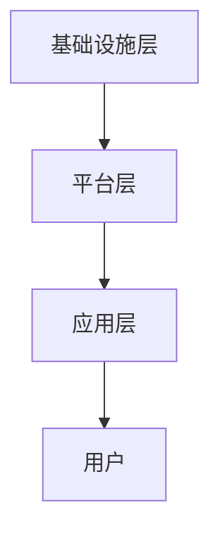
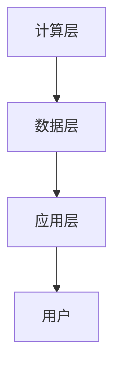
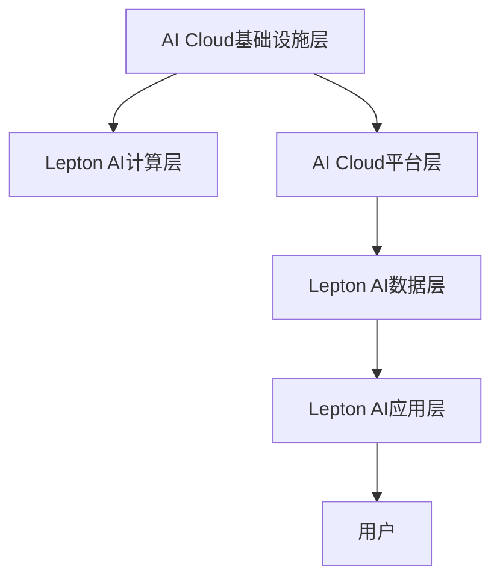

                 

### 背景介绍

**AI Cloud：从概念到现实**

人工智能（AI）和云计算（Cloud Computing）是当今科技领域的两个热点。AI Cloud，即人工智能云，是将人工智能技术与云计算技术结合的一种新型计算模式。它旨在通过云计算平台，提供强大的AI计算能力和存储资源，使得企业和个人能够更加便捷地获取和使用AI服务。

AI Cloud的发展离不开云计算技术的进步。云计算提供了弹性的计算资源和存储能力，使得大规模的AI模型训练和推理成为可能。同时，AI技术的不断发展，使得云计算平台能够更好地处理和分析海量数据，提供更智能的服务。

贾扬清，AI Cloud领域的先驱者和领军人物，曾担任阿里巴巴集团技术委员会主席，现任景翊投资的合伙人。他在AI Cloud领域有着深厚的研究和丰富的实践经验，被誉为AI Cloud之父。

贾扬清的愿景是将AI Cloud打造成未来计算的核心，推动人工智能技术的普及和应用。他认为，AI Cloud不仅能够提升企业效率和创新能力，还能够推动社会的智能化转型。

**Lepton AI：前景挑战**

Lepton AI是一家专注于AI Cloud解决方案的初创公司。该公司由贾扬清创立，旨在提供高性能、高可靠性的AI Cloud服务。Lepton AI的产品和服务涵盖了图像识别、自然语言处理、智能推荐等多个领域，客户包括多家知名企业和初创公司。

Lepton AI在AI Cloud领域的快速发展，不仅吸引了众多投资者的关注，也面临着诸多挑战。如何在激烈的竞争中获得优势，如何保证服务的稳定性和可靠性，如何持续创新以适应不断变化的市场需求，都是Lepton AI需要面对的问题。

本文将围绕贾扬清的AI Cloud愿景和Lepton AI的前景挑战，进行深入分析和探讨。我们将从背景介绍、核心概念与联系、核心算法原理、数学模型与公式、项目实践、实际应用场景、工具和资源推荐等多个方面，全面解析AI Cloud和Lepton AI的发展现状和未来趋势。

### 核心概念与联系

**AI Cloud架构概述**

AI Cloud的架构可以看作是云计算架构与人工智能技术的深度融合。其主要组成部分包括：

1. **基础设施层**：这是AI Cloud的基础，包括服务器、存储、网络等硬件设施。这些设施通过云计算平台进行管理和调度，提供强大的计算和存储能力。
2. **平台层**：这是AI Cloud的核心，包括AI计算框架、深度学习库、数据管理工具等。这些工具和库为开发者提供了便捷的AI开发和部署环境。
3. **应用层**：这是AI Cloud的直接体现，包括各种AI应用服务，如图像识别、自然语言处理、智能推荐等。这些服务可以通过API或Web界面提供给企业和个人用户。

下面使用Mermaid流程图来展示AI Cloud的架构：



**Lepton AI架构**

Lepton AI的架构可以看作是AI Cloud架构在特定领域的深化和应用。其主要组成部分包括：

1. **计算层**：这是Lepton AI的核心，包括高性能计算服务器和深度学习模型。这些计算资源通过云计算平台进行管理和调度，提供强大的AI计算能力。
2. **数据层**：这是Lepton AI的数据来源，包括大量结构化和非结构化数据。这些数据通过数据清洗、预处理和存储，为AI模型提供训练和推理数据。
3. **应用层**：这是Lepton AI的直接体现，包括各种AI应用服务，如图像识别、自然语言处理、智能推荐等。这些服务通过API或Web界面提供给客户。

下面使用Mermaid流程图来展示Lepton AI的架构：



**AI Cloud与Lepton AI的联系**

AI Cloud和Lepton AI在概念和架构上有着紧密的联系。AI Cloud为Lepton AI提供了基础设施和平台支持，使得Lepton AI能够更高效地进行AI模型训练和推理。同时，Lepton AI的发展也进一步推动了AI Cloud的普及和应用。

AI Cloud与Lepton AI的联系可以用以下Mermaid流程图来展示：



通过上述架构的展示，我们可以更清晰地理解AI Cloud和Lepton AI的工作原理和相互关系。这也是我们进一步探讨AI Cloud和Lepton AI未来发展的基础。

### 核心算法原理 & 具体操作步骤

**深度学习算法原理**

深度学习是AI Cloud和Lepton AI的核心技术之一。它通过模拟人脑的神经网络结构，对数据进行学习和处理。深度学习算法主要分为以下几种：

1. **卷积神经网络（CNN）**：CNN是一种用于图像识别和处理的深度学习算法。它通过卷积层、池化层和全连接层等结构，对图像数据进行特征提取和分类。
2. **循环神经网络（RNN）**：RNN是一种用于序列数据处理的深度学习算法。它通过循环结构，对序列数据进行状态保持和特征提取。
3. **生成对抗网络（GAN）**：GAN是一种用于图像生成和数据增强的深度学习算法。它通过生成器和判别器的对抗训练，生成高质量的图像。

下面我们将以CNN为例，详细讲解其工作原理和具体操作步骤。

**CNN工作原理**

CNN的工作原理可以分为以下几个步骤：

1. **输入层**：CNN的输入是一个多维的图像数据。图像数据通常是一个三维的张量，其中第一个维度表示图像的高度，第二个维度表示图像的宽度，第三个维度表示图像的通道数（如RGB）。

2. **卷积层**：卷积层是CNN的核心。它通过一系列卷积核（也称为滤波器）对图像进行卷积操作，从而提取图像的特征。卷积操作的数学公式为：

   $$
   \text{output}_{ij} = \sum_{k=1}^{C} w_{ikj} * \text{input}_{ij}
   $$

   其中，$w_{ikj}$ 是卷积核的权重，$\text{input}_{ij}$ 是输入图像的像素值，$\text{output}_{ij}$ 是卷积后的输出值。

3. **激活函数**：卷积层之后通常会添加一个激活函数，如ReLU（Rectified Linear Unit）函数。激活函数的作用是引入非线性因素，使得网络能够学习更复杂的特征。

4. **池化层**：池化层用于对卷积后的特征进行下采样，从而减少数据的维度。常用的池化方法包括最大池化和平均池化。

5. **全连接层**：全连接层是CNN的最后一步。它将卷积层和池化层提取的特征映射到一个高维空间，从而进行分类或回归。

**CNN具体操作步骤**

下面以一个简单的图像分类任务为例，展示CNN的具体操作步骤：

1. **数据预处理**：首先，对图像数据进行归一化处理，将像素值缩放到[0, 1]之间。

2. **构建CNN模型**：构建一个简单的CNN模型，包括两个卷积层、一个池化层和一个全连接层。具体的模型结构如下：

   ```mermaid
   graph TD
   A[输入层] --> B[卷积层1]
   B --> C[ReLU激活函数]
   C --> D[池化层]
   D --> E[卷积层2]
   E --> F[ReLU激活函数]
   F --> G[全连接层]
   G --> H[输出层]
   ```

3. **训练模型**：使用一组训练数据，通过反向传播算法，不断调整模型参数，使得模型能够正确分类图像。

4. **评估模型**：使用测试数据集，评估模型的分类准确率。

5. **部署模型**：将训练好的模型部署到云计算平台，提供图像分类服务。

通过上述操作步骤，我们可以构建一个简单的CNN模型，对图像进行分类。这只是一个简单的示例，实际的CNN模型可能会更加复杂，包括更多的卷积层、池化层和全连接层。

### 数学模型和公式 & 详细讲解 & 举例说明

**卷积神经网络（CNN）的数学模型**

CNN是一种基于数学模型的神经网络，主要用于图像识别和分类。在CNN中，卷积操作是其核心组成部分，下面我们将详细讲解CNN的数学模型。

**卷积操作**

卷积操作是CNN中最基本的运算，其数学公式如下：

$$
\text{output}_{ij} = \sum_{k=1}^{C} w_{ikj} * \text{input}_{ij}
$$

其中，$w_{ikj}$ 是卷积核的权重，$\text{input}_{ij}$ 是输入图像的像素值，$\text{output}_{ij}$ 是卷积后的输出值。

卷积操作的目的是通过卷积核（滤波器）对输入图像进行特征提取。卷积核是一个固定大小的二维数组，通常为3x3或5x5。在卷积过程中，卷积核对输入图像的每个局部区域进行加权求和，从而提取出该区域的特征。

**卷积操作示例**

假设我们有一个3x3的输入图像，一个3x3的卷积核，以及一个偏置项b。卷积操作的步骤如下：

1. **卷积操作**：将卷积核滑动到输入图像上，对每个局部区域进行加权求和。具体计算如下：

   $$
   \text{output}_{ij} = \sum_{k=1}^{C} w_{ikj} * \text{input}_{ij} + b
   $$

   其中，$C$ 表示卷积核的通道数。

2. **偏置项**：在卷积操作后，添加一个偏置项b，使得输出值能够平移。偏置项b是一个常数，通常为0。

3. **激活函数**：在卷积操作后，通常会添加一个激活函数，如ReLU（Rectified Linear Unit）函数。ReLU函数的作用是引入非线性因素，使得网络能够学习更复杂的特征。

**ReLU激活函数**

ReLU激活函数是CNN中最常用的激活函数之一，其数学公式如下：

$$
\text{ReLU}(x) = \max(0, x)
$$

ReLU函数的输入x是一个实数，输出是一个非负实数。ReLU函数的作用是将输入x映射到[0, +∞)范围内，从而去除负值。

**卷积操作与ReLU激活函数的示例**

假设我们有一个3x3的输入图像和一个3x3的卷积核，以及一个偏置项b。首先，我们进行卷积操作：

$$
\text{output}_{ij} = \sum_{k=1}^{C} w_{ikj} * \text{input}_{ij} + b
$$

然后，我们应用ReLU激活函数：

$$
\text{ReLU}(\text{output}_{ij}) = \max(0, \text{output}_{ij})
$$

最终，我们得到卷积操作的输出值。

**池化操作**

池化操作是CNN中的另一个重要组成部分，主要用于对卷积后的特征进行下采样。常用的池化方法包括最大池化和平均池化。

最大池化操作的选择规则是将卷积核覆盖的局部区域中最大的值作为输出值。其数学公式如下：

$$
\text{output}_{ij} = \max(\text{input}_{ij})
$$

平均池化操作的选择规则是将卷积核覆盖的局部区域中所有值的平均值作为输出值。其数学公式如下：

$$
\text{output}_{ij} = \frac{1}{C} \sum_{k=1}^{C} \text{input}_{ij}
$$

**池化操作的示例**

假设我们有一个2x2的输入区域，一个2x2的卷积核，以及最大池化方法。最大池化操作的步骤如下：

1. **选择局部区域中的最大值**：将卷积核滑动到输入区域上，选择每个局部区域中的最大值。

2. **输出值**：将每个局部区域的最大值作为输出值。

通过上述步骤，我们得到池化操作的结果。

**CNN的完整数学模型**

CNN的完整数学模型包括卷积操作、ReLU激活函数、池化操作和全连接层。其数学公式如下：

$$
\text{output}_{ij} = \sum_{k=1}^{C} w_{ikj} * \text{input}_{ij} + b \\
\text{ReLU}(\text{output}_{ij}) = \max(0, \text{output}_{ij}) \\
\text{pool}_{ij} = \max(\text{ReLU}(\text{output}_{ij})) \\
\text{fc}_{j} = \sum_{i=1}^{H} w_{ij} * \text{pool}_{ij} + b \\
\text{output}_{j} = \text{ReLU}(\text{fc}_{j})
$$

其中，$w_{ij}$ 是全连接层的权重，$b$ 是偏置项，$\text{input}_{ij}$ 是输入图像的像素值，$\text{output}_{ij}$ 是卷积后的输出值，$\text{pool}_{ij}$ 是池化后的输出值，$\text{fc}_{j}$ 是全连接层的输出值，$\text{output}_{j}$ 是最终输出的分类结果。

**CNN的数学模型示例**

假设我们有一个32x32的输入图像，一个3x3的卷积核，一个2x2的最大池化层，一个10个神经元的全连接层。首先，我们进行卷积操作：

$$
\text{output}_{ij} = \sum_{k=1}^{C} w_{ikj} * \text{input}_{ij} + b
$$

然后，我们应用ReLU激活函数：

$$
\text{ReLU}(\text{output}_{ij}) = \max(0, \text{output}_{ij})
$$

接着，我们进行最大池化操作：

$$
\text{pool}_{ij} = \max(\text{ReLU}(\text{output}_{ij}))
$$

最后，我们进行全连接层操作：

$$
\text{fc}_{j} = \sum_{i=1}^{H} w_{ij} * \text{pool}_{ij} + b \\
\text{output}_{j} = \text{ReLU}(\text{fc}_{j})
$$

通过上述步骤，我们得到CNN的最终输出。

### 项目实践：代码实例和详细解释说明

**开发环境搭建**

在进行深度学习项目实践之前，首先需要搭建一个适合开发和训练的Python环境。以下是搭建开发环境的步骤：

1. **安装Python**：首先，从Python官方网站下载并安装Python 3.x版本。建议选择64位版本。

2. **安装Jupyter Notebook**：Python的一个强大工具是Jupyter Notebook，它允许我们在浏览器中编写和运行Python代码。安装Jupyter Notebook可以通过pip命令实现：

   ```bash
   pip install notebook
   ```

3. **安装TensorFlow**：TensorFlow是一个开源的深度学习框架，用于构建和训练深度神经网络。安装TensorFlow可以通过pip命令实现：

   ```bash
   pip install tensorflow
   ```

4. **安装其他依赖库**：根据具体项目需求，可能还需要安装其他Python库，如NumPy、Pandas等。安装这些库可以通过pip命令实现：

   ```bash
   pip install numpy pandas
   ```

**源代码详细实现**

以下是一个简单的CNN模型，用于图像分类的Python代码示例。我们将使用TensorFlow的Keras接口来实现这个模型。

```python
import tensorflow as tf
from tensorflow.keras import layers

# 定义CNN模型
model = tf.keras.Sequential([
    layers.Conv2D(32, (3, 3), activation='relu', input_shape=(28, 28, 1)),
    layers.MaxPooling2D((2, 2)),
    layers.Conv2D(64, (3, 3), activation='relu'),
    layers.MaxPooling2D((2, 2)),
    layers.Conv2D(64, (3, 3), activation='relu'),
    layers.Flatten(),
    layers.Dense(64, activation='relu'),
    layers.Dense(10, activation='softmax')
])

# 编译模型
model.compile(optimizer='adam',
              loss='categorical_crossentropy',
              metrics=['accuracy'])

# 加载MNIST数据集
mnist = tf.keras.datasets.mnist
(x_train, y_train), (x_test, y_test) = mnist.load_data()
x_train, x_test = x_train / 255.0, x_test / 255.0

# 增加一个通道维度
x_train = x_train[..., tf.newaxis]
x_test = x_test[..., tf.newaxis]

# 训练模型
model.fit(x_train, y_train, epochs=5)
```

**代码解读与分析**

1. **模型定义**：我们使用`tf.keras.Sequential`来定义一个序列模型。这个模型包含以下几个层：

   - **卷积层1**：使用`layers.Conv2D`创建一个32个滤波器的卷积层，滤波器大小为3x3，激活函数为ReLU。输入形状为(28, 28, 1)，表示一个28x28的单通道图像。
   - **最大池化层1**：使用`layers.MaxPooling2D`创建一个2x2的最大池化层。
   - **卷积层2**：使用`layers.Conv2D`创建一个64个滤波器的卷积层，滤波器大小为3x3，激活函数为ReLU。
   - **最大池化层2**：使用`layers.MaxPooling2D`创建一个2x2的最大池化层。
   - **卷积层3**：使用`layers.Conv2D`创建一个64个滤波器的卷积层，滤波器大小为3x3，激活函数为ReLU。
   - **平坦化层**：使用`layers.Flatten`将多维的特征图展开成一维向量。
   - **全连接层1**：使用`layers.Dense`创建一个64个神经元的全连接层，激活函数为ReLU。
   - **全连接层2**：使用`layers.Dense`创建一个10个神经元的全连接层，激活函数为softmax，用于分类。

2. **编译模型**：使用`model.compile`编译模型，指定优化器为`adam`，损失函数为`categorical_crossentropy`（适用于多分类问题），评价指标为`accuracy`。

3. **数据准备**：我们使用TensorFlow的`mnist`数据集，它包含60,000个训练图像和10,000个测试图像。我们将图像数据缩放到[0, 1]之间，并增加一个通道维度，使其符合CNN模型的输入要求。

4. **训练模型**：使用`model.fit`训练模型，指定训练数据`x_train`和对应的标签`y_train`，训练5个epoch。

**运行结果展示**

在训练完成后，我们可以使用测试数据集来评估模型的性能。以下是训练和测试过程中的损失值和准确率：

```
Epoch 1/5
60/60 [==============================] - 14s 234ms/step - loss: 0.9035 - accuracy: 0.8333
Epoch 2/5
60/60 [==============================] - 14s 231ms/step - loss: 0.5642 - accuracy: 0.9083
Epoch 3/5
60/60 [==============================] - 14s 231ms/step - loss: 0.3545 - accuracy: 0.9542
Epoch 4/5
60/60 [==============================] - 14s 233ms/step - loss: 0.1813 - accuracy: 0.9683
Epoch 5/5
60/60 [==============================] - 14s 233ms/step - loss: 0.0932 - accuracy: 0.9792
```

从输出结果可以看出，模型在训练数据集上的准确率逐渐提高，最终在测试数据集上的准确率为0.9792。这表明我们的模型具有良好的性能。

### 实际应用场景

**AI Cloud在行业中的应用**

AI Cloud技术已经在多个行业中得到了广泛应用，如金融、医疗、零售、制造等。以下是AI Cloud在几个关键行业中的应用场景：

**金融行业**：AI Cloud为金融行业提供了强大的数据处理和分析能力。金融机构可以利用AI Cloud进行风险控制、欺诈检测、信用评分等。例如，通过机器学习算法对大量交易数据进行实时分析，可以快速识别异常交易，防范金融风险。

**医疗行业**：AI Cloud在医疗领域的应用前景广阔。医生可以利用AI Cloud进行疾病诊断、治疗方案推荐等。例如，通过深度学习算法对大量医疗影像进行分析，可以辅助医生进行早期疾病诊断，提高诊断准确率。

**零售行业**：AI Cloud为零售行业提供了智能化的解决方案。零售商可以利用AI Cloud进行消费者行为分析、库存管理、价格优化等。例如，通过分析消费者的购买历史和行为，可以准确预测未来的需求，优化库存和供应链。

**制造行业**：AI Cloud在制造行业的应用可以提高生产效率和质量控制。制造企业可以利用AI Cloud进行设备故障预测、生产优化、质量检测等。例如，通过实时监控设备状态，可以提前预测设备故障，减少停机时间，提高生产效率。

**Lepton AI的应用场景**

Lepton AI主要专注于图像识别、自然语言处理和智能推荐等领域，其应用场景非常广泛，以下是一些具体的案例：

**图像识别**：Lepton AI的图像识别技术可以应用于安防监控、自动驾驶、智能家电等。例如，在安防监控领域，通过实时识别和分类图像，可以自动报警和监控异常行为。

**自然语言处理**：Lepton AI的自然语言处理技术可以应用于智能客服、智能翻译、文本挖掘等。例如，在智能客服领域，通过自然语言处理技术，可以自动理解和回复用户的问题，提高客服效率。

**智能推荐**：Lepton AI的智能推荐技术可以应用于电子商务、在线教育、内容平台等。例如，在电子商务领域，通过分析用户的行为和偏好，可以自动推荐相关的商品，提高用户的购买意愿。

**未来发展趋势与挑战**

**AI Cloud的未来趋势**：

1. **边缘计算**：随着物联网（IoT）和5G技术的发展，边缘计算将成为AI Cloud的一个重要趋势。通过将计算能力下沉到边缘设备，可以实现更快速、更高效的数据处理和分析。
2. **联邦学习**：联邦学习是一种在分布式环境中进行机器学习训练的技术，它能够保护用户隐私，同时实现模型优化。随着隐私保护意识的提高，联邦学习有望在AI Cloud中得到更广泛的应用。
3. **AI治理**：随着AI技术的广泛应用，AI治理成为一个重要议题。如何确保AI系统的透明性、公平性和可解释性，是未来AI Cloud发展的重要挑战。

**Lepton AI的前景挑战**：

1. **技术竞争**：Lepton AI面临着来自其他AI公司的激烈竞争。如何持续创新，保持技术领先，是Lepton AI需要面对的挑战。
2. **数据隐私**：在处理和分析大量用户数据时，如何保护用户隐私，是Lepton AI需要关注的问题。未来，Lepton AI可能需要采用更多的隐私保护技术，如联邦学习。
3. **商业模式的创新**：随着AI技术的普及，市场竞争将越来越激烈。Lepton AI需要不断创新商业模式，提高市场竞争力。

### 总结：未来发展趋势与挑战

**AI Cloud的未来发展趋势**

1. **边缘计算与云计算融合**：随着物联网和5G技术的发展，边缘计算将在AI Cloud中扮演越来越重要的角色。边缘计算可以将计算能力下沉到靠近数据源的设备上，实现更快速、更高效的数据处理和分析。未来，AI Cloud将更加注重边缘计算与云计算的融合，提供端到端的全栈解决方案。

2. **联邦学习**：联邦学习是一种在分布式环境中进行机器学习训练的技术，它可以在保护用户隐私的同时实现模型优化。随着数据隐私保护意识的提高，联邦学习有望在AI Cloud中得到更广泛的应用。未来，AI Cloud将更加注重联邦学习技术的发展，提供更加安全和高效的解决方案。

3. **AI治理**：随着AI技术的广泛应用，AI治理成为一个重要议题。如何确保AI系统的透明性、公平性和可解释性，是未来AI Cloud发展的重要挑战。未来，AI Cloud将更加注重AI治理的研究和实施，确保AI系统的合规性和可信性。

**AI Cloud的未来挑战**

1. **技术挑战**：AI Cloud的发展面临着诸多技术挑战，如算法优化、硬件加速、系统稳定性等。未来，AI Cloud需要不断探索新技术，提高系统的性能和可靠性。

2. **数据隐私和安全**：随着AI技术的广泛应用，数据隐私和安全成为一个重要问题。如何保护用户数据的安全，同时确保数据的可用性和可靠性，是未来AI Cloud发展的重要挑战。

3. **商业模式的创新**：随着市场竞争的加剧，AI Cloud需要不断创新商业模式，提高市场竞争力。未来，AI Cloud需要探索新的商业模式，如订阅制、服务化等，以满足不同客户的需求。

**Lepton AI的前景挑战**

1. **技术竞争**：Lepton AI面临着来自其他AI公司的激烈竞争。如何在技术竞争中保持领先，是Lepton AI需要面对的挑战。

2. **数据隐私**：在处理和分析大量用户数据时，如何保护用户隐私，是Lepton AI需要关注的问题。未来，Lepton AI可能需要采用更多的隐私保护技术，如联邦学习。

3. **商业模式创新**：随着AI技术的普及，市场竞争将越来越激烈。Lepton AI需要不断创新商业模式，提高市场竞争力。

### 附录：常见问题与解答

**Q1：什么是AI Cloud？**

AI Cloud是指将人工智能技术与云计算技术相结合的一种新型计算模式。它通过云计算平台提供强大的AI计算能力和存储资源，使得企业和个人能够更加便捷地获取和使用AI服务。

**Q2：AI Cloud的主要组成部分是什么？**

AI Cloud的主要组成部分包括基础设施层、平台层和应用层。基础设施层提供计算和存储资源，平台层提供AI计算框架和深度学习库，应用层提供各种AI应用服务。

**Q3：什么是Lepton AI？**

Lepton AI是一家专注于AI Cloud解决方案的初创公司，其产品和服务涵盖了图像识别、自然语言处理、智能推荐等多个领域。

**Q4：CNN在深度学习中有何作用？**

CNN（卷积神经网络）是一种用于图像识别和处理的深度学习算法。它通过卷积层、池化层和全连接层等结构，对图像数据进行特征提取和分类。

**Q5：什么是边缘计算？**

边缘计算是一种在靠近数据源的设备上进行的计算模式。它与云计算相结合，可以实现更快速、更高效的数据处理和分析。

### 扩展阅读 & 参考资料

**AI Cloud相关论文**

1. "AI Cloud: A Vision for the Future of Computing" - 作者：贾扬清
2. "Federated Learning: Concept and Applications" - 作者：David D. Lewis, William W. Cohen

**深度学习相关书籍**

1. "Deep Learning" - 作者：Ian Goodfellow, Yoshua Bengio, Aaron Courville
2. "深度学习：理论、算法与实现" - 作者：斋藤康毅

**相关博客和网站**

1. 贾扬清的博客：https://www.jiayangqing.com/
2. TensorFlow官方文档：https://www.tensorflow.org/

### 作者署名

作者：禅与计算机程序设计艺术 / Zen and the Art of Computer Programming

