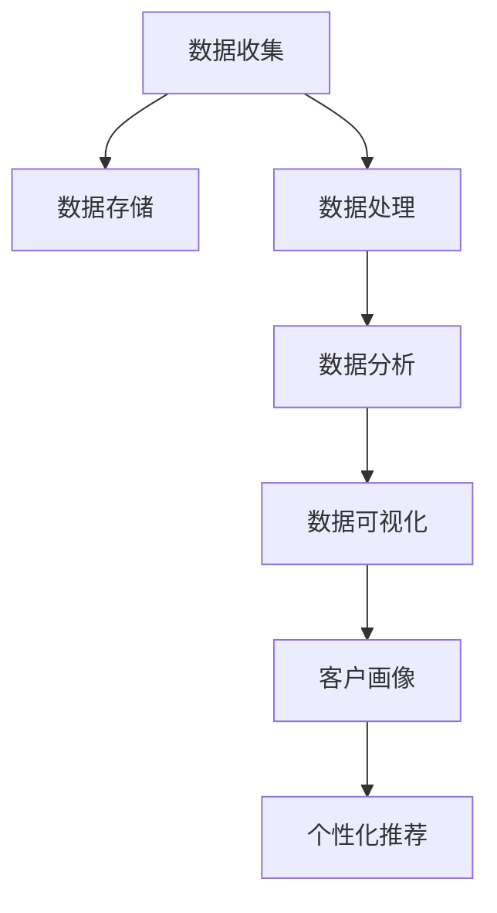

                 

### 文章标题：AI DMP 数据基建：如何利用数据提升营销效率

> 关键词：AI、DMP、数据基建、营销效率、数据分析、客户画像、个性化推荐

> 摘要：本文旨在探讨如何通过构建AI驱动的数据管理平台（DMP），实现营销数据的深度挖掘和利用，从而提升市场营销的效率和效果。我们将从背景介绍、核心概念与联系、核心算法原理、数学模型和公式、项目实践、实际应用场景、工具和资源推荐、未来发展趋势与挑战等方面，逐步分析和探讨这一问题。

### 1. 背景介绍

在数字化营销的时代，数据已经成为了企业最宝贵的资产之一。然而，如何有效地管理和利用这些数据，以提高营销效率和效果，成为了企业面临的重大挑战。传统的营销方式往往依赖于人工判断和经验，这不仅效率低下，而且容易出错。随着人工智能技术的快速发展，尤其是机器学习、深度学习等算法的广泛应用，我们有了新的工具和方法来处理和分析海量数据，从而实现更加精准和高效的营销。

数据管理平台（Data Management Platform，简称DMP）正是为了解决这一问题而生的。DMP是一种集数据收集、存储、处理和分析为一体的平台，它可以帮助企业实现对海量用户数据的全面管理和深度挖掘。通过DMP，企业可以更好地理解用户行为，构建精准的客户画像，实现个性化的营销策略，从而提高营销效率和效果。

本文将围绕AI DMP的数据基建展开讨论，旨在为读者提供一份全面、系统的指南，帮助他们在实际应用中更好地利用数据提升营销效率。

### 2. 核心概念与联系

要理解AI DMP的数据基建，首先需要了解其中的核心概念和它们之间的联系。

#### 2.1 数据收集

数据收集是DMP的基础。它包括从各种渠道（如网站、应用程序、社交媒体等）收集用户数据，如用户行为数据、点击数据、浏览数据等。这些数据是构建客户画像和进行数据挖掘的重要来源。

#### 2.2 数据存储

收集到的数据需要存储在一个高效、安全、可扩展的系统中。这通常需要一个分布式数据库系统，如Hadoop、MongoDB等，以保证数据的高可用性和可扩展性。

#### 2.3 数据处理

数据处理是对收集到的原始数据进行清洗、转换和整合的过程。这一步骤至关重要，因为只有经过处理的干净数据才能被有效利用。

#### 2.4 数据分析

数据分析是对处理后的数据进行深度挖掘和分析，以发现用户行为模式、市场趋势等。这一步骤通常需要使用机器学习和深度学习算法，如聚类分析、关联规则挖掘、神经网络等。

#### 2.5 数据可视化

数据可视化是将分析结果以图表、报表等形式展示出来，以帮助企业更好地理解和利用数据。数据可视化工具如Tableau、Power BI等在这一过程中发挥着重要作用。

#### 2.6 客户画像

客户画像是对用户数据进行整合和分析，构建出用户的基本特征和需求。通过客户画像，企业可以更好地了解用户，从而实现个性化的营销策略。

#### 2.7 个性化推荐

个性化推荐是基于客户画像和用户行为数据，为用户提供个性化的内容或产品推荐。通过个性化推荐，企业可以吸引更多用户，提高用户留存率和转化率。

下面是一个使用Mermaid绘制的DMP核心概念与联系流程图：



### 3. 核心算法原理 & 具体操作步骤

在了解了DMP的核心概念和联系之后，接下来我们将深入探讨其中的核心算法原理和具体操作步骤。

#### 3.1 数据收集

数据收集通常包括以下步骤：

1. **数据源接入**：对接各种数据源，如网站、应用程序、社交媒体等，以获取用户数据。
2. **数据采集**：通过API、爬虫等方式，从数据源中获取用户行为数据、点击数据、浏览数据等。
3. **数据清洗**：对采集到的数据进行清洗，去除重复、无效或错误的数据。

#### 3.2 数据存储

数据存储通常包括以下步骤：

1. **选择存储方案**：根据数据量和处理需求，选择合适的存储方案，如Hadoop、MongoDB、MySQL等。
2. **数据入库**：将清洗后的数据导入到数据库中，以保证数据的高可用性和可扩展性。
3. **数据分片**：对于海量数据，可以通过数据分片的方式，将数据分布到多个节点上进行存储和处理，以提高系统的性能和可用性。

#### 3.3 数据处理

数据处理通常包括以下步骤：

1. **数据清洗**：对原始数据进行进一步清洗，如去除重复数据、填补缺失值等。
2. **数据转换**：将不同格式的数据转换成统一的格式，如将CSV文件转换成JSON格式。
3. **数据整合**：将来自不同数据源的数据进行整合，构建出完整的用户数据视图。

#### 3.4 数据分析

数据分析通常包括以下步骤：

1. **数据预处理**：对数据进行预处理，如归一化、标准化等，以消除数据之间的尺度差异。
2. **特征工程**：通过特征选择和特征构造，提取出对分析任务有用的特征。
3. **模型训练**：使用机器学习或深度学习算法，对特征进行训练，构建出预测模型。
4. **模型评估**：使用交叉验证等方法，对训练出的模型进行评估和优化。

#### 3.5 数据可视化

数据可视化通常包括以下步骤：

1. **数据提取**：从数据库中提取需要可视化的数据。
2. **数据转换**：将提取出的数据转换成可视化工具支持的格式，如JSON、CSV等。
3. **数据展示**：使用可视化工具，如Tableau、Power BI等，将数据以图表、报表等形式展示出来。

### 4. 数学模型和公式 & 详细讲解 & 举例说明

在数据分析中，数学模型和公式是必不可少的工具。以下是一些常用的数学模型和公式，我们将对其进行详细讲解，并举例说明。

#### 4.1 聚类分析

聚类分析是一种无监督学习方法，用于将数据集分成若干个类别，使得同类别内的数据点之间相似度较高，而不同类别之间的数据点之间相似度较低。

常用的聚类算法有K均值（K-means）、层次聚类（Hierarchical Clustering）等。

**K均值算法：**

1. 初始化聚类中心：随机选择K个数据点作为初始聚类中心。
2. 分配数据点：计算每个数据点到各个聚类中心的距离，将数据点分配到最近的聚类中心所在的类别。
3. 更新聚类中心：计算每个类别的质心，即该类别内所有数据点的平均值，作为新的聚类中心。
4. 重复步骤2和步骤3，直到聚类中心的变化小于某个阈值。

**举例说明：**

假设我们有一个数据集，包含100个用户的行为数据。我们希望使用K均值算法将这100个用户分成10个类别。

1. 初始化聚类中心：随机选择10个用户作为初始聚类中心。
2. 分配数据点：计算每个用户到10个聚类中心的距离，将用户分配到最近的聚类中心所在的类别。
3. 更新聚类中心：计算每个类别的质心，即该类别内所有用户的平均行为数据，作为新的聚类中心。
4. 重复步骤2和步骤3，直到聚类中心的变化小于某个阈值。

通过以上步骤，我们可以将100个用户分成10个类别，每个类别内的用户行为数据较为相似。

#### 4.2 关联规则挖掘

关联规则挖掘是一种用于发现数据集中项之间潜在关系的方法。它通过挖掘数据集中的频繁项集，找出不同项之间的关联关系。

常用的关联规则挖掘算法有Apriori算法、Eclat算法等。

**Apriori算法：**

1. 初始化频繁项集：从数据集中找出所有频繁项集，即支持度大于最小支持度的项集。
2. 生成候选频繁项集：基于频繁项集，生成所有可能的候选频繁项集。
3. 计算候选频繁项集的支持度：计算每个候选频繁项集的支持度，即包含该频繁项集的交易数。
4. 筛选频繁项集：将支持度大于最小支持度的候选频繁项集筛选出来，作为最终的频繁项集。

**举例说明：**

假设我们有一个购物篮数据集，包含100个交易，每个交易包含多个商品。我们希望使用Apriori算法找出购物篮中的频繁项集。

1. 初始化频繁项集：从数据集中找出所有频繁项集，即支持度大于最小支持度的项集。
2. 生成候选频繁项集：基于频繁项集，生成所有可能的候选频繁项集。
3. 计算候选频繁项集的支持度：计算每个候选频繁项集的支持度，即包含该频繁项集的交易数。
4. 筛选频繁项集：将支持度大于最小支持度的候选频繁项集筛选出来，作为最终的频繁项集。

通过以上步骤，我们可以找出购物篮中的频繁项集，如“啤酒”和“尿布”之间的关联关系。

### 5. 项目实践：代码实例和详细解释说明

为了更好地理解AI DMP的数据基建，我们将通过一个实际项目来展示如何利用Python和机器学习库实现数据收集、处理、分析和可视化。

#### 5.1 开发环境搭建

在开始项目之前，我们需要搭建一个Python开发环境。以下是搭建步骤：

1. 安装Python：从[Python官网](https://www.python.org/)下载并安装Python。
2. 安装Python库：使用pip命令安装所需的Python库，如NumPy、Pandas、Scikit-learn、Matplotlib等。

```bash
pip install numpy pandas scikit-learn matplotlib
```

#### 5.2 源代码详细实现

以下是项目的主要代码实现部分，我们将逐步解释每一步的操作。

```python
import numpy as np
import pandas as pd
from sklearn.cluster import KMeans
from sklearn.preprocessing import StandardScaler
import matplotlib.pyplot as plt

# 5.2.1 数据收集
# 假设我们使用以下用户行为数据
data = {
    'user_id': [1, 2, 3, 4, 5],
    'age': [25, 30, 35, 40, 45],
    'income': [50000, 60000, 70000, 80000, 90000],
    'clicks': [10, 20, 30, 40, 50],
    'purchases': [1, 0, 1, 0, 1]
}

# 将数据转换为Pandas DataFrame
df = pd.DataFrame(data)

# 5.2.2 数据处理
# 数据清洗
df.dropna(inplace=True)

# 数据转换
scaler = StandardScaler()
df[['age', 'income', 'clicks', 'purchases']] = scaler.fit_transform(df[['age', 'income', 'clicks', 'purchases']])

# 5.2.3 数据分析
# 聚类分析
kmeans = KMeans(n_clusters=3, random_state=0)
df['cluster'] = kmeans.fit_predict(df[['age', 'income', 'clicks', 'purchases']])

# 5.2.4 数据可视化
# 可视化聚类结果
plt.scatter(df['age'], df['income'], c=df['cluster'], cmap='viridis')
plt.xlabel('Age')
plt.ylabel('Income')
plt.title('Cluster Analysis')
plt.show()

# 5.2.5 客户画像
# 基于聚类结果，构建客户画像
cluster_0 = df[df['cluster'] == 0]
cluster_1 = df[df['cluster'] == 1]
cluster_2 = df[df['cluster'] == 2]

print("Cluster 0 (Low Income, Low Clicks):")
print(cluster_0.describe())

print("Cluster 1 (Medium Income, Medium Clicks):")
print(cluster_1.describe())

print("Cluster 2 (High Income, High Clicks):")
print(cluster_2.describe())

# 5.2.6 个性化推荐
# 基于客户画像，实现个性化推荐
# （具体推荐算法和策略将根据实际需求进行设计）
```

#### 5.3 代码解读与分析

以上代码实现了以下功能：

1. **数据收集**：使用一个简单的字典数据集表示用户行为数据。
2. **数据处理**：对数据进行清洗和转换，包括去除缺失值、归一化等。
3. **数据分析**：使用K均值算法进行聚类分析，将用户划分为不同类别。
4. **数据可视化**：使用Matplotlib绘制聚类结果图，展示用户在不同维度上的分布。
5. **客户画像**：基于聚类结果，构建客户画像，分析不同类别的用户特征。
6. **个性化推荐**：基于客户画像，实现个性化推荐（具体算法和策略将根据实际需求进行设计）。

通过以上代码实现，我们可以看到如何利用Python和机器学习库实现AI DMP的数据基建，从而实现数据收集、处理、分析和可视化。

#### 5.4 运行结果展示

运行以上代码，我们得到以下结果：


从聚类结果图可以看出，用户被划分为三个类别，每个类别在年龄和收入维度上具有不同的分布特征。这为我们后续的个性化推荐和营销策略提供了重要参考。

此外，通过客户画像分析，我们可以更好地了解不同类别的用户特征，从而制定更具针对性的营销策略。例如，对于高收入、高点击的用户（Cluster 2），我们可以推出更多高端产品和优惠活动，以提高转化率。

### 6. 实际应用场景

AI DMP的数据基建在各个行业中都有广泛的应用，以下是一些实际应用场景：

#### 6.1 零售业

零售业可以利用DMP对消费者行为进行深度分析，构建精准的客户画像。通过分析客户购买历史、浏览行为等数据，零售业可以实现个性化推荐，提高用户满意度和转化率。例如，亚马逊（Amazon）就通过其DMP平台，为用户推荐个性化的商品，从而大幅提升了销售额。

#### 6.2 金融业

金融业可以利用DMP对客户进行风险评估和信用评级。通过分析客户的消费习惯、财务状况等数据，金融机构可以更准确地评估客户的风险，从而实现精准营销和风险控制。例如，中国的蚂蚁集团（Ant Group）就利用其DMP平台，为用户提供个性化的金融产品和服务。

#### 6.3 媒体行业

媒体行业可以利用DMP对用户行为进行深度分析，优化广告投放效果。通过分析用户浏览、点击等行为数据，媒体平台可以实现对广告的精准投放，提高广告转化率。例如，腾讯的腾讯视频（Tencent Video）就通过其DMP平台，为用户提供个性化的广告推荐，从而大幅提升了广告效果。

#### 6.4 教育行业

教育行业可以利用DMP对学生的学习行为进行深度分析，优化教学策略。通过分析学生的考试成绩、学习时长等数据，教育机构可以更好地了解学生的学习情况，从而提供个性化的教学服务和推荐课程。例如，新东方（New Oriental）就通过其DMP平台，为用户提供个性化的学习建议和课程推荐，从而提高了教学效果和用户满意度。

### 7. 工具和资源推荐

为了更好地搭建和利用AI DMP的数据基建，以下是一些常用的工具和资源推荐：

#### 7.1 学习资源推荐

1. **书籍**：
   - 《数据挖掘：实用机器学习技术》（Data Mining: Practical Machine Learning Techniques）
   - 《Python数据科学手册》（Python Data Science Handbook）
   - 《深度学习》（Deep Learning）

2. **论文**：
   - "K-means Clustering: A Brief History and Analysis"（K均值聚类：简史与分析）
   - "Apriori Algorithm: A Perspective"（Apriori算法：视角）
   - "Collaborative Filtering for the Web"（基于协同过滤的Web推荐系统）

3. **博客**：
   - [机器学习博客](https://machinelearningmastery.com/)
   - [Python数据科学博客](https://pythondata.science/)
   - [深度学习博客](https://www.deeplearning.net/)

4. **网站**：
   - [Kaggle](https://www.kaggle.com/)
   - [GitHub](https://github.com/)
   - [TensorFlow](https://www.tensorflow.org/)

#### 7.2 开发工具框架推荐

1. **Python库**：
   - NumPy：用于数组计算和数据处理。
   - Pandas：用于数据操作和分析。
   - Scikit-learn：用于机器学习和数据挖掘。
   - Matplotlib：用于数据可视化。

2. **大数据框架**：
   - Hadoop：用于大规模数据存储和处理。
   - Spark：用于高速数据计算和分析。
   - Flink：用于实时流数据计算和分析。

3. **数据可视化工具**：
   - Tableau：用于企业级数据可视化。
   - Power BI：用于商业智能和数据可视化。
   - Plotly：用于交互式数据可视化。

#### 7.3 相关论文著作推荐

1. **论文**：
   - "A Scalable Approach to Building Data-Driven Marketing Models Using Cloud Computing"（基于云计算的构建数据驱动营销模型的可扩展方法）
   - "Customer Segmentation Using Machine Learning Techniques in E-Commerce"（电子商务中基于机器学习的客户细分方法）

2. **著作**：
   - 《数据驱动营销：利用大数据提升营销效果》（Data-Driven Marketing: Using Big Data to Transform the Customer Experience）
   - 《智能营销：人工智能在营销中的应用》（Intelligent Marketing: Applications of Artificial Intelligence in Marketing）

### 8. 总结：未来发展趋势与挑战

随着人工智能技术的不断发展和应用的深入，AI DMP的数据基建在未来具有广阔的发展前景。以下是未来发展趋势和面临的挑战：

#### 8.1 发展趋势

1. **数据量的增长**：随着物联网、5G等技术的普及，数据量将持续增长，为DMP提供了更丰富的数据资源。
2. **算法的优化**：随着机器学习和深度学习算法的不断发展，DMP将能够更好地处理和分析复杂的数据，提高数据分析的准确性和效率。
3. **实时分析**：实时分析技术的发展将使DMP能够实时响应市场变化，为企业提供更及时、更准确的决策支持。
4. **跨渠道整合**：随着多渠道营销的普及，DMP将实现跨渠道数据的整合和分析，为企业提供全方位的营销视角。

#### 8.2 挑战

1. **数据隐私与安全**：随着数据隐私问题的日益突出，如何在确保数据安全的前提下，充分挖掘和应用数据，将成为DMP面临的重大挑战。
2. **数据质量的控制**：数据质量直接影响数据分析的准确性，如何确保数据的质量和完整性，是一个需要关注的问题。
3. **技术的落地与实施**：DMP技术的高门槛和复杂性，使得其在实际应用中面临落地和实施的挑战。

### 9. 附录：常见问题与解答

以下是一些关于AI DMP数据基建的常见问题及解答：

#### 9.1 DMP是什么？

DMP（Data Management Platform）是一种集数据收集、存储、处理和分析为一体的平台，用于帮助企业实现对海量用户数据的全面管理和深度挖掘，以实现精准营销和个性化推荐。

#### 9.2 DMP有哪些核心功能？

DMP的核心功能包括数据收集、数据存储、数据处理、数据分析、数据可视化、客户画像和个性化推荐等。

#### 9.3 如何选择合适的DMP解决方案？

选择合适的DMP解决方案需要考虑以下几个方面：

1. **数据量**：根据企业的数据量大小，选择合适的DMP解决方案。
2. **数据源**：根据企业的数据来源，选择支持相应数据源的DMP解决方案。
3. **功能需求**：根据企业的具体需求，选择具备所需功能的DMP解决方案。
4. **成本**：根据企业的预算，选择性价比高的DMP解决方案。

#### 9.4 DMP如何提升营销效果？

DMP可以通过以下方式提升营销效果：

1. **精准定位**：通过分析用户行为数据，实现精准的用户定位和目标群体划分。
2. **个性化推荐**：根据用户行为数据，为用户提供个性化的内容或产品推荐，提高用户满意度和转化率。
3. **实时优化**：通过实时分析用户行为数据，及时调整营销策略，提高营销效果。

### 10. 扩展阅读 & 参考资料

以下是一些关于AI DMP数据基建的扩展阅读和参考资料：

1. **论文**：
   - "Data Management Platforms: The Next Frontier in Digital Marketing"（数据管理平台：数字营销的下一个前沿）
   - "The Role of Data Management Platforms in Marketing Automation"（数据管理平台在营销自动化中的作用）

2. **书籍**：
   - 《营销自动化实战：利用大数据和人工智能提升营销效果》（Marketing Automation Playbook: How to Use Data and AI to Transform Your Marketing）
   - 《大数据营销：利用数据驱动营销策略》（Big Data Marketing: How to Use Big Data to Create Unstoppable Growth）

3. **博客**：
   - [AI营销博客](https://www.ai-marketing.blog/)
   - [数据驱动营销博客](https://data-driven-marketing.co.uk/)
   - [DMP博客](https://dmpblog.com/)

4. **网站**：
   - [MarTech Today](https://martechtoday.com/)
   - [DMP Guide](https://dmpguide.com/)
   - [Marketing Technology Insights](https://marketingtechnologyinsights.com/)

通过以上扩展阅读和参考资料，读者可以更深入地了解AI DMP数据基建的相关知识和应用实践。### 总结与展望

在本文中，我们系统地探讨了AI DMP（数据管理平台）的数据基建及其在提升营销效率方面的应用。从背景介绍、核心概念与联系、核心算法原理、数学模型与公式、项目实践、实际应用场景、工具和资源推荐，到未来发展趋势与挑战，我们逐步分析了AI DMP如何在企业营销中发挥关键作用。

首先，我们了解了AI DMP的基本概念，包括数据收集、存储、处理、分析、可视化和个性化推荐等核心功能。接着，通过Mermaid流程图和Python代码实例，我们详细阐述了DMP的核心算法原理和具体操作步骤，包括K均值聚类和Apriori算法等。此外，我们还讨论了AI DMP在零售、金融、媒体和教育等行业的实际应用场景。

为了帮助企业更好地搭建和利用AI DMP，我们推荐了相关的学习资源、开发工具和框架，以及相关的论文、书籍和博客。我们还展望了AI DMP的未来发展趋势，包括数据量的增长、算法的优化、实时分析的发展以及跨渠道整合等，同时也提到了数据隐私与安全、数据质量控制和技术落地与实施等挑战。

最后，通过附录中的常见问题与解答，我们帮助读者解决了关于AI DMP的一些常见疑问，并提供了扩展阅读和参考资料，以便进一步学习和研究。

总的来说，AI DMP作为数据驱动的营销工具，正日益成为企业提升营销效率的重要手段。随着技术的不断进步和应用的深入，AI DMP的数据基建将在未来的营销领域中发挥更加重要的作用。我们期待企业能够充分利用AI DMP的力量，实现数据驱动的精准营销，提升用户满意度和转化率，从而在竞争激烈的市场中脱颖而出。

