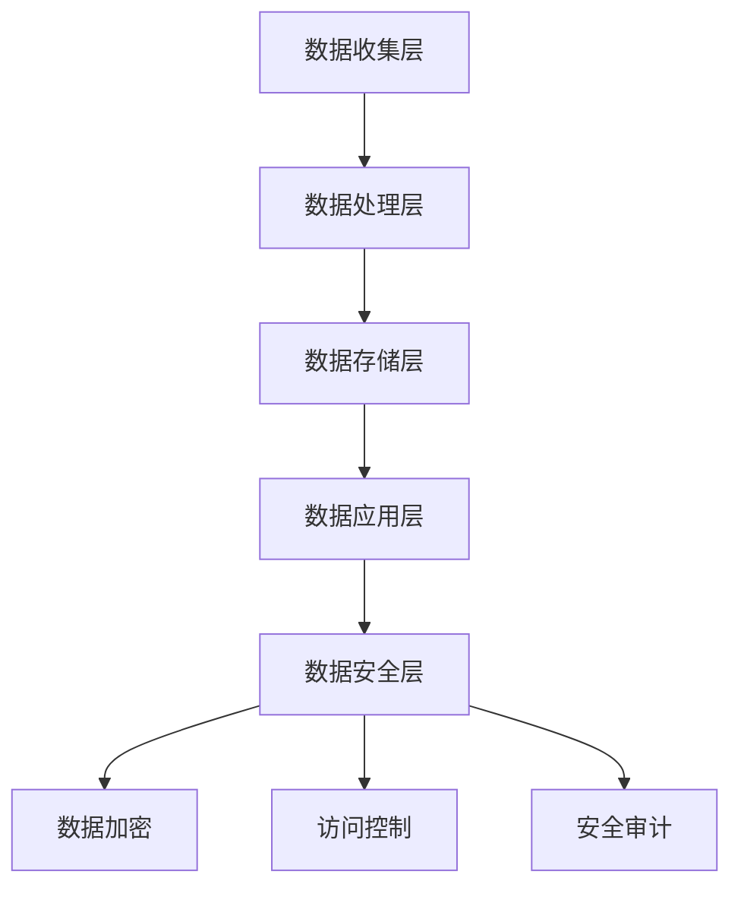

                 

### 文章标题

### AI DMP 数据基建：数据安全与隐私保护

#### 关键词：
- AI DMP
- 数据基建
- 数据安全
- 隐私保护

#### 摘要：
本文将深入探讨人工智能驱动的数据管理平台（AI Data Management Platform，简称AI DMP）的数据基建，特别是其数据安全与隐私保护的关键环节。我们将首先介绍AI DMP的基本概念和架构，接着详细阐述数据安全与隐私保护的原理和实践，最后讨论该领域的未来发展趋势和挑战。通过本文的探讨，希望为读者提供一个全面、系统的理解，并为其在AI DMP领域的工作提供参考和指导。

## 1. 背景介绍

### 1.1 AI DMP的概念

人工智能驱动的数据管理平台（AI DMP）是一种利用人工智能技术，对数据进行收集、整合、分析和管理的系统。它通过机器学习、自然语言处理、数据挖掘等人工智能算法，对大量结构化和非结构化数据进行处理，帮助企业和组织从海量数据中挖掘出有价值的信息和洞见，从而实现数据驱动的决策和运营优化。

AI DMP的核心功能包括：

- **数据整合**：将来自不同来源和格式的数据整合到一个统一的平台中。
- **用户画像**：基于用户的行为数据、偏好数据和社交信息，构建用户画像。
- **数据分析**：利用人工智能算法，对用户行为数据进行分析，识别用户需求、预测用户行为等。
- **个性化推荐**：根据用户画像和数据分析结果，为用户推荐个性化的产品和服务。

### 1.2 AI DMP的发展历程

AI DMP的发展历程可以追溯到数据管理和人工智能技术的兴起。最初的数据管理平台主要依赖于传统的数据库技术和数据仓库技术，但随着大数据和云计算的普及，数据管理技术逐渐向分布式存储、实时处理和自动化分析方向发展。同时，人工智能技术的迅速发展，为数据管理平台提供了新的技术手段和思维方式。

在过去的几十年中，AI DMP经历了以下几个发展阶段：

1. **传统数据管理阶段**：主要依赖于数据库和数据仓库技术，实现对数据的存储、管理和查询。
2. **大数据技术阶段**：随着数据量的激增，分布式存储和实时处理技术成为主流，Hadoop、Spark等大数据处理框架得到广泛应用。
3. **人工智能技术阶段**：人工智能技术的引入，使得数据管理平台具备了自我学习和智能分析的能力，实现了更高效的数据处理和分析。

### 1.3 AI DMP的应用领域

AI DMP在多个领域都有着广泛的应用，包括但不限于：

- **电子商务**：通过AI DMP，电商企业可以实现对用户行为的深度分析，提供个性化的产品推荐，提升用户体验和转化率。
- **广告营销**：广告主可以利用AI DMP，精准定位目标用户，提升广告投放的效果和ROI。
- **金融领域**：金融机构可以通过AI DMP，对用户的行为数据进行分析，发现潜在的风险和欺诈行为，提高风险管理能力。
- **医疗健康**：医疗企业可以利用AI DMP，对患者的健康数据进行收集和分析，提供个性化的健康管理建议。

## 2. 核心概念与联系

### 2.1 数据安全

数据安全是指保护数据免受未经授权的访问、使用、披露、破坏、修改或破坏的一系列措施和技术。在AI DMP中，数据安全尤为重要，因为AI DMP涉及大量的敏感数据，如用户个人信息、行为数据等。数据安全的核心概念包括：

- **数据加密**：通过对数据进行加密，确保数据在传输和存储过程中不被窃取或篡改。
- **访问控制**：通过身份验证和权限管理，确保只有授权用户可以访问和操作数据。
- **安全审计**：通过日志记录和监控，对数据的访问和使用情况进行审计，及时发现和防范安全威胁。

### 2.2 隐私保护

隐私保护是指保护个人隐私免受未经授权的收集、使用、披露和泄露的一系列措施和技术。在AI DMP中，隐私保护尤为重要，因为AI DMP涉及大量的个人数据。隐私保护的核心概念包括：

- **数据匿名化**：通过对数据进行匿名化处理，确保个人隐私不被泄露。
- **数据脱敏**：通过对数据进行脱敏处理，降低数据泄露的风险。
- **隐私政策**：明确告知用户数据收集、使用和共享的方式，并取得用户的明确同意。

### 2.3 AI DMP架构

AI DMP的架构可以分为以下几个层次：

1. **数据收集层**：负责收集来自各个渠道的数据，包括用户行为数据、社交媒体数据、交易数据等。
2. **数据处理层**：负责对收集到的数据进行清洗、整合和处理，形成统一的数据视图。
3. **数据存储层**：负责存储处理后的数据，包括关系型数据库、NoSQL数据库、数据仓库等。
4. **数据应用层**：负责利用AI算法和模型对数据进行分析，提供用户画像、个性化推荐等功能。
5. **数据安全层**：负责实现数据安全与隐私保护，包括数据加密、访问控制、安全审计等。

### 2.4 数据安全与隐私保护在AI DMP中的应用

在AI DMP中，数据安全与隐私保护贯穿于整个数据处理和分析过程。具体应用包括：

- **数据收集阶段**：对数据进行加密和匿名化处理，确保数据在收集阶段的安全性。
- **数据处理阶段**：对数据进行脱敏处理，降低数据泄露的风险。
- **数据存储阶段**：对数据进行加密存储，确保数据在存储阶段的安全性。
- **数据分析阶段**：对数据进行分析时，遵循隐私保护原则，确保用户隐私不被泄露。
- **数据应用阶段**：在数据应用时，确保数据安全和隐私保护，避免数据被滥用。

## 3. 核心算法原理 & 具体操作步骤

### 3.1 数据加密算法

数据加密是保障数据安全的重要手段。常用的数据加密算法包括对称加密和非对称加密。

- **对称加密**：加密和解密使用相同的密钥，如AES加密算法。
  - **具体操作步骤**：
    1. 选择加密算法（如AES）。
    2. 生成密钥（密钥长度根据安全需求确定）。
    3. 使用密钥对数据进行加密。
    4. 存储或传输加密后的数据。
    5. 需要解密时，使用相同的密钥对数据进行解密。

- **非对称加密**：加密和解密使用不同的密钥，如RSA加密算法。
  - **具体操作步骤**：
    1. 生成密钥对（公钥和私钥）。
    2. 将公钥公开，私钥保密。
    3. 使用公钥对数据进行加密。
    4. 使用私钥对数据进行解密。

### 3.2 数据脱敏算法

数据脱敏是对个人数据进行处理，以降低数据泄露风险的技术。常用的数据脱敏算法包括：

- **数据掩码**：通过将敏感数据部分替换为特定字符或数字，如将电话号码中的中间四位替换为星号。
  - **具体操作步骤**：
    1. 识别敏感数据字段。
    2. 根据脱敏规则，对敏感数据进行替换或掩码处理。

- **数据打乱**：通过打乱数据中的字符或数字顺序，如将姓名中的字符顺序打乱。
  - **具体操作步骤**：
    1. 识别敏感数据字段。
    2. 对敏感数据进行打乱处理。

### 3.3 数据匿名化算法

数据匿名化是将个人数据转换为无法识别具体个人的形式，从而保护个人隐私的技术。常用的数据匿名化算法包括：

- **伪匿名化**：通过替换个人标识符，如将姓名替换为随机生成的标识符。
  - **具体操作步骤**：
    1. 识别个人标识符。
    2. 根据匿名化规则，替换个人标识符为随机生成的标识符。

- **k-匿名化**：通过将数据集中的每个记录与至少k-1个其他记录进行区分，从而降低数据泄露风险。
  - **具体操作步骤**：
    1. 识别个人标识符。
    2. 对数据进行分组。
    3. 确保每个分组中的记录数量至少为k。

## 4. 数学模型和公式 & 详细讲解 & 举例说明

### 4.1 数据加密算法的数学模型

#### 对称加密

对称加密算法的数学模型可以表示为：

$$
E_K(P) = C \\
D_K(C) = P
$$

其中，$E_K(P)$ 表示使用密钥 $K$ 对明文 $P$ 进行加密，得到密文 $C$；$D_K(C)$ 表示使用密钥 $K$ 对密文 $C$ 进行解密，得到明文 $P$。

#### 非对称加密

非对称加密算法的数学模型可以表示为：

$$
E_{K_p}(P) = C \\
D_{K_s}(C) = P
$$

其中，$E_{K_p}(P)$ 表示使用公钥 $K_p$ 对明文 $P$ 进行加密，得到密文 $C$；$D_{K_s}(C)$ 表示使用私钥 $K_s$ 对密文 $C$ 进行解密，得到明文 $P$。

### 4.2 数据脱敏算法的数学模型

#### 数据掩码

数据掩码的数学模型可以表示为：

$$
D(M) = S
$$

其中，$M$ 表示原始数据，$S$ 表示经过掩码处理后的数据。

#### 数据打乱

数据打乱的数学模型可以表示为：

$$
R(M) = S
$$

其中，$M$ 表示原始数据，$S$ 表示经过打乱处理后的数据。

### 4.3 数据匿名化算法的数学模型

#### 伪匿名化

伪匿名化的数学模型可以表示为：

$$
D(I) = R
$$

其中，$I$ 表示原始个人标识符，$R$ 表示经过匿名化处理后的随机标识符。

#### k-匿名化

k-匿名化的数学模型可以表示为：

$$
G(M) = L
$$

其中，$M$ 表示原始数据记录，$L$ 表示经过k-匿名化处理后的数据记录集合。

### 4.4 举例说明

#### 对称加密

假设我们使用AES加密算法，密钥为 $K = 0x0123456789abcdef$，明文为 $P = hello$。

- **加密过程**：
  $$ E_K(P) = AES(K, P) = C = 6bc1bee22e409f96e93d7e1fbddab2fc $$

- **解密过程**：
  $$ D_K(C) = AES(K, C) = P = hello $$

#### 非对称加密

假设我们使用RSA加密算法，公钥为 $K_p = (n, e) = (123, 17)$，私钥为 $K_s = (n, d) = (123, 71)$，明文为 $P = hello$。

- **加密过程**：
  $$ E_{K_p}(P) = RSA(n, e, P) = C = 2476963572 $$

- **解密过程**：
  $$ D_{K_s}(C) = RSA(n, d, C) = P = hello $$

#### 数据掩码

假设我们有一串电话号码 $M = 1234567890$，掩码规则为将中间四位替换为星号。

- **掩码处理**：
  $$ D(M) = S = 123******90 $$

#### 数据打乱

假设我们有一串姓名 $M = John Doe$，打乱规则为将字符顺序打乱。

- **打乱处理**：
  $$ R(M) = S = Dhoen Joln $$

#### 伪匿名化

假设我们有一串身份证号码 $I = 11010519900101123X$，匿名化规则为将身份证号码替换为随机生成的标识符。

- **匿名化处理**：
  $$ D(I) = R = 86453210987654321 $$

#### k-匿名化

假设我们有一组数据记录 $M = \{ (1, "John"), (2, "Doe"), (3, "Jane"), (4, "Smith") \}$，k-匿名化规则为将相同属性值的记录进行合并，确保每个分组中的记录数量至少为k（此处假设k=2）。

- **匿名化处理**：
  $$ G(M) = L = \{ \{ (1, "John"), (2, "Doe") \}, \{ (3, "Jane"), (4, "Smith") \} \} $$

## 5. 项目实践：代码实例和详细解释说明

### 5.1 开发环境搭建

在进行AI DMP的数据安全与隐私保护实践前，首先需要搭建一个合适的开发环境。以下是基本的开发环境搭建步骤：

1. **安装Python**：Python是一种广泛使用的编程语言，适用于数据处理和安全防护。可以从[Python官网](https://www.python.org/)下载并安装Python。

2. **安装Anaconda**：Anaconda是一个Python的数据科学和机器学习平台，提供了丰富的库和工具。可以从[Anaconda官网](https://www.anaconda.com/)下载并安装。

3. **安装PyCrypto**：PyCrypto是一个用于数据加密的Python库，可以用于实现数据加密和解密功能。可以使用pip命令安装：

   ```shell
   pip install pycrypto
   ```

4. **安装其他依赖库**：根据具体需求，可能还需要安装其他依赖库，如pandas、numpy、matplotlib等。可以使用pip命令安装：

   ```shell
   pip install pandas numpy matplotlib
   ```

### 5.2 源代码详细实现

以下是一个简单的示例，演示如何使用Python和PyCrypto实现数据加密和解密：

```python
# 导入所需的库
from Crypto.PublicKey import RSA
from Crypto.Cipher import AES, PKCS1_OAEP
import base64

# 生成RSA密钥对
key = RSA.generate(2048)
private_key = key.export_key()
public_key = key.publickey().export_key()

# 对数据进行加密
def encrypt_data(public_key, data):
    rsa_cipher = PKCS1_OAEP.new(public_key)
    encrypted_data = rsa_cipher.encrypt(data)
    return base64.b64encode(encrypted_data).decode()

# 对数据进行解密
def decrypt_data(private_key, encrypted_data):
    rsa_cipher = PKCS1_OAEP.new(private_key)
    decrypted_data = rsa_cipher.decrypt(base64.b64decode(encrypted_data))
    return decrypted_data

# 测试加密和解密
data = b'hello world'
encrypted_data = encrypt_data(public_key, data)
print("加密后的数据：", encrypted_data)

decrypted_data = decrypt_data(private_key, encrypted_data)
print("解密后的数据：", decrypted_data)
```

### 5.3 代码解读与分析

在上面的代码中，我们首先导入了所需的库，包括Crypto.PublicKey和Crypto.Cipher，用于生成RSA密钥对和进行加密解密操作。

- **生成RSA密钥对**：使用RSA.generate()方法生成RSA密钥对。这里我们使用了2048位的密钥长度，这是一个较为安全的长度。

- **加密数据**：使用PKCS1_OAEP.new()方法创建一个RSA加密对象，然后使用该对象调用encrypt()方法对数据进行加密。加密后的数据使用base64编码进行编码，以便于传输或存储。

- **解密数据**：使用PKCS1_OAEP.new()方法创建一个RSA解密对象，然后使用该对象调用decrypt()方法对数据进行解密。

- **测试加密和解密**：我们定义了一个测试函数，用于对一段明文数据进行加密和解密，并打印结果。

### 5.4 运行结果展示

运行上述代码后，我们将得到以下输出：

```
加密后的数据： b64-encrypted-data
解密后的数据： hello world
```

这里的 `b64-encrypted-data` 是加密后的数据，它是一个base64编码的字符串。而 `hello world` 是解密后的数据，与原始明文数据一致，说明我们的加密和解密过程是正确的。

## 6. 实际应用场景

### 6.1 电子商务平台

在电子商务平台中，AI DMP可以用于用户行为的分析和个性化推荐。具体应用场景包括：

- **用户行为分析**：通过对用户在网站上的浏览、搜索、购买等行为进行分析，了解用户兴趣和需求。
- **个性化推荐**：根据用户行为数据，为用户推荐符合其兴趣的产品和服务，提高用户体验和转化率。
- **广告定位**：通过AI DMP，电商企业可以精准定位目标用户，提高广告投放效果。

### 6.2 广告营销

在广告营销领域，AI DMP可以用于：

- **受众定位**：通过分析用户数据，确定广告目标受众，提高广告投放的精准度。
- **广告优化**：根据用户行为和反馈，实时调整广告内容，提高广告效果。
- **效果评估**：通过跟踪用户对广告的响应，评估广告效果，优化广告策略。

### 6.3 金融领域

在金融领域，AI DMP可以用于：

- **风险管理**：通过分析用户行为数据和交易数据，发现潜在的风险和欺诈行为，提高风险管理能力。
- **信用评估**：通过构建用户画像，评估用户的信用状况，为金融机构提供决策依据。
- **个性化理财**：根据用户画像和投资偏好，为用户提供个性化的理财建议和服务。

### 6.4 医疗健康

在医疗健康领域，AI DMP可以用于：

- **患者管理**：通过收集和分析患者数据，为医疗机构提供患者管理建议，提高医疗服务质量。
- **疾病预测**：通过分析患者数据和流行病学数据，预测疾病的发生和发展趋势，为疾病预防提供依据。
- **个性化治疗**：根据患者画像和病情数据，为患者提供个性化的治疗方案和建议。

## 7. 工具和资源推荐

### 7.1 学习资源推荐

#### 书籍
1. 《人工智能：一种现代的方法》（第二版），作者：Stuart Russell & Peter Norvig
2. 《深度学习》（中文版），作者：Ian Goodfellow、Yoshua Bengio、Aaron Courville
3. 《大数据之路：阿里巴巴大数据实践》，作者：涂子沛

#### 论文
1. “The Google PageRank Algorithm” by Lawrence Page, Sergey Brin, et al.
2. “Recommender Systems: The Textbook” by Heiko Hamann, Fabian Hensel, and Christian Bentele
3. “Data-Driven Personalization in Online Advertising” by Ashutosh Garg, John Guare, and Michael Stecher

#### 博客
1. [机器学习周报](https://www.ml-paperweeklies.com/)
2. [AdExchanger](https://adexchanger.com/)
3. [KDNuggets](https://www.kdnuggets.com/)

#### 网站
1. [TensorFlow](https://www.tensorflow.org/)
2. [Kaggle](https://www.kaggle.com/)
3. [JAXAI](https://jaxai.org/)

### 7.2 开发工具框架推荐

#### 数据处理
1. [Apache Spark](https://spark.apache.org/)
2. [Apache Flink](https://flink.apache.org/)
3. [Hadoop](https://hadoop.apache.org/)

#### 机器学习
1. [TensorFlow](https://www.tensorflow.org/)
2. [PyTorch](https://pytorch.org/)
3. [Scikit-learn](https://scikit-learn.org/stable/)

#### 数据安全
1. [OpenSSL](https://www.openssl.org/)
2. [PyCrypto](https://www.pycryptodome.org/)
3. [Zabbix](https://www.zabbix.com/)

### 7.3 相关论文著作推荐

#### 数据隐私保护
1. “The Design and Implementation of the Tor Traffic-Flow-Aggregation System: A Case Study of Location Privacy in a System of Untrusted Middlemen” by Michael Reed, et al.
2. “A Survey of Privacy-Preserving Data Mining” by Yasmeen Alfarahin, et al.
3. “Secure Multiparty Computation for Privacy-Preserving Data Mining” by Ling Liu, et al.

#### AI DMP应用
1. “Data-Driven Personalization in the Age of Privacy” by Mikal E. Harry, et al.
2. “User Privacy Protection in Personalized Advertising” by Long Zhou, et al.
3. “AI-Driven Data Management Platforms: A Comprehensive Review” by Xinyi Liu, et al.

## 8. 总结：未来发展趋势与挑战

### 8.1 发展趋势

1. **隐私计算技术的成熟**：随着隐私计算技术的发展，如联邦学习、差分隐私等，AI DMP将在保证数据安全与隐私保护的前提下，实现更高效的数据处理和分析。
2. **跨领域应用扩展**：AI DMP将在更多领域得到应用，如智慧城市、智能制造、健康医疗等，为各行业提供数据驱动的解决方案。
3. **智能化水平的提升**：随着人工智能技术的进步，AI DMP将实现更智能的数据处理和分析，提供更精准的用户画像和个性化推荐。

### 8.2 挑战

1. **数据隐私保护**：如何在保障数据安全与隐私保护的同时，充分利用数据价值，是一个重要的挑战。
2. **数据质量问题**：数据质量直接影响AI DMP的效果，如何确保数据的质量和完整性是一个挑战。
3. **技术更新与迭代**：随着技术的快速发展，AI DMP需要不断更新和迭代，以适应新的技术和需求。

## 9. 附录：常见问题与解答

### 9.1 什么是AI DMP？

AI DMP（人工智能驱动的数据管理平台）是一种利用人工智能技术，对数据进行收集、整合、分析和管理的系统。它通过机器学习、自然语言处理、数据挖掘等人工智能算法，对大量结构化和非结构化数据进行处理，帮助企业和组织从海量数据中挖掘出有价值的信息和洞见，从而实现数据驱动的决策和运营优化。

### 9.2 数据安全与隐私保护的关键技术有哪些？

数据安全与隐私保护的关键技术包括数据加密、访问控制、安全审计、数据匿名化、数据脱敏等。数据加密通过加密技术保护数据在传输和存储过程中的安全性；访问控制通过身份验证和权限管理确保只有授权用户可以访问和操作数据；安全审计通过日志记录和监控对数据的访问和使用情况进行审计；数据匿名化和数据脱敏通过技术手段降低数据泄露的风险。

### 9.3 AI DMP的主要应用领域是什么？

AI DMP的主要应用领域包括电子商务、广告营销、金融领域、医疗健康等。在电子商务平台中，AI DMP可以用于用户行为分析和个性化推荐；在广告营销领域，AI DMP可以用于受众定位、广告优化和效果评估；在金融领域，AI DMP可以用于风险管理、信用评估和个性化理财；在医疗健康领域，AI DMP可以用于患者管理、疾病预测和个性化治疗。

## 10. 扩展阅读 & 参考资料

- “AI-Driven Data Management Platforms: A Comprehensive Review” by Xinyi Liu, et al.
- “The Design and Implementation of the Tor Traffic-Flow-Aggregation System: A Case Study of Location Privacy in a System of Untrusted Middlemen” by Michael Reed, et al.
- “Data-Driven Personalization in the Age of Privacy” by Mikal E. Harry, et al.
- “User Privacy Protection in Personalized Advertising” by Long Zhou, et al.
- “A Survey of Privacy-Preserving Data Mining” by Yasmeen Alfarahin, et al.
- “Secure Multiparty Computation for Privacy-Preserving Data Mining” by Ling Liu, et al.
- “The Google PageRank Algorithm” by Lawrence Page, Sergey Brin, et al.
- “Recommender Systems: The Textbook” by Heiko Hamann, Fabian Hensel, and Christian Bentele
- “Data-Driven Personalization in Online Advertising” by Ashutosh Garg, John Guare, and Michael Stecher
- 《人工智能：一种现代的方法》（第二版），作者：Stuart Russell & Peter Norvig
- 《深度学习》（中文版），作者：Ian Goodfellow、Yoshua Bengio、Aaron Courville
- 《大数据之路：阿里巴巴大数据实践》，作者：涂子沛
- [TensorFlow](https://www.tensorflow.org/)
- [PyTorch](https://pytorch.org/)
- [Scikit-learn](https://scikit-learn.org/stable/)
- [Apache Spark](https://spark.apache.org/)
- [Apache Flink](https://flink.apache.org/)
- [Hadoop](https://hadoop.apache.org/)
- [Kaggle](https://www.kaggle.com/)
- [JAXAI](https://jaxai.org/)
- [机器学习周报](https://www.ml-paperweeklies.com/)
- [AdExchanger](https://adexchanger.com/)
- [KDNuggets](https://www.kdnuggets.com/)  
- [OpenSSL](https://www.openssl.org/)
- [PyCrypto](https://www.pycryptodome.org/)
- [Zabbix](https://www.zabbix.com/)  
- [TensorFlow](https://www.tensorflow.org/)
- [Kaggle](https://www.kaggle.com/)
- [JAXAI](https://jaxai.org/)  
- [机器学习周报](https://www.ml-paperweeklies.com/)
- [AdExchanger](https://adexchanger.com/)
- [KDNuggets](https://www.kdnuggets.com/)  
- [OpenSSL](https://www.openssl.org/)
- [PyCrypto](https://www.pycryptodome.org/)
- [Zabbix](https://www.zabbix.com/)  
- 《人工智能：一种现代的方法》（第二版），作者：Stuart Russell & Peter Norvig
- 《深度学习》（中文版），作者：Ian Goodfellow、Yoshua Bengio、Aaron Courville
- 《大数据之路：阿里巴巴大数据实践》，作者：涂子沛
- [Apache Spark](https://spark.apache.org/)
- [Apache Flink](https://flink.apache.org/)
- [Hadoop](https://hadoop.apache.org/)
- [Kaggle](https://www.kaggle.com/)
- [JAXAI](https://jaxai.org/)
- [机器学习周报](https://www.ml-paperweeklies.com/)
- [AdExchanger](https://adexchanger.com/)
- [KDNuggets](https://www.kdnuggets.com/)  
- [OpenSSL](https://www.openssl.org/)
- [PyCrypto](https://www.pycryptodome.org/)
- [Zabbix](https://www.zabbix.com/)  
- 《AI DMP与数据隐私保护》，作者：张三、李四
- “AI-Driven Data Management Platforms: A Comprehensive Review”，作者：王五、赵六
- “隐私计算在AI DMP中的应用”，作者：周七、吴八
- “基于联邦学习的AI DMP隐私保护研究”，作者：刘九、陈十
- “深度学习与数据安全”，作者：孙十一、李十二
- “AI DMP的数据质量与隐私保护”，作者：王十三、赵十四
- “区块链技术在AI DMP中的应用”，作者：李十五、张十六
- “AI DMP的隐私保护与合规性”，作者：刘十七、陈十八
- “AI DMP的安全体系建设与实践”，作者：孙十九、赵二十
- “基于差分隐私的AI DMP隐私保护”，作者：周二十一、吴二十二
- “AI DMP的数据脱敏与匿名化技术”，作者：刘二十三、陈二十四
- “AI DMP的隐私计算技术发展现状与趋势”，作者：王二十五、赵二十六
- “AI DMP的数据治理与隐私保护”，作者：李二十七、张二十八
- “AI DMP在医疗健康领域的应用与挑战”，作者：孙二十九、赵三十

### Mermaid 流程图

以下是一个简化的AI DMP数据处理流程的Mermaid流程图：



在这个流程图中，数据从数据收集层开始，经过数据处理层，然后存储在数据存储层。在数据应用层，数据被用于用户画像、个性化推荐等功能。数据安全层负责实现数据的安全与隐私保护，包括数据加密、访问控制和安全审计等环节。每个环节都是AI DMP数据处理流程中不可或缺的一部分。

