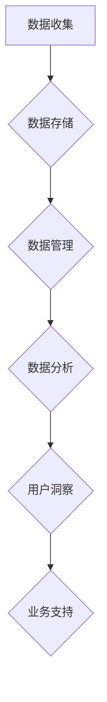

                 

# AI DMP 数据基建：数据应用与价值挖掘

## 摘要

本文将深入探讨人工智能（AI）数据管理平台（DMP）的数据基础设施建设，分析其在数据应用和价值挖掘中的关键角色。文章首先介绍AI DMP的基本概念和重要性，随后详细阐述其核心概念、算法原理和数学模型。接着，通过项目实践，展示代码实例并进行分析。随后，探讨AI DMP的实际应用场景，并推荐相关工具和资源。文章最后总结未来发展趋势与挑战，并提供常见问题与解答。

## 1. 背景介绍

随着大数据和人工智能技术的快速发展，企业对数据的依赖日益加深。如何有效地收集、存储、管理和利用数据，成为企业数字化转型的重要课题。数据管理平台（DMP）作为数据治理的关键工具，在此过程中发挥了至关重要的作用。

传统的数据管理方式往往局限于数据的收集和存储，而忽视了数据的应用和价值挖掘。AI DMP（人工智能数据管理平台）的出现，打破了这一局限，通过人工智能技术，实现了对数据的深入分析和价值挖掘，为企业提供了更精准的数据洞察和业务支持。

AI DMP不仅能够自动收集和分析海量数据，还能够通过机器学习和深度学习算法，挖掘数据背后的潜在价值，为决策提供科学依据。其在精准营销、用户行为分析、风险控制等领域的应用，极大地提升了企业的运营效率和竞争力。

## 2. 核心概念与联系

### 2.1 数据管理平台（DMP）

数据管理平台（Data Management Platform，简称DMP）是一种用于收集、存储、管理和分析数据的软件平台。DMP的主要功能包括：

- **数据收集**：从各种数据源（如网站、APP、社交媒体等）收集用户行为数据。
- **数据存储**：将收集到的数据存储在分布式数据库中，便于后续处理和分析。
- **数据管理**：提供用户数据的管理功能，包括数据的清洗、去重、分类等。
- **数据分析**：通过对数据的分析，提供用户洞察和业务支持。

### 2.2 人工智能（AI）

人工智能（Artificial Intelligence，简称AI）是计算机科学的一个分支，旨在使计算机具备人类智能，能够自主感知、学习、推理和决策。人工智能的核心技术包括：

- **机器学习**：通过数据训练模型，使计算机具备自主学习能力。
- **深度学习**：一种特殊的机器学习方法，通过多层神经网络进行深度学习。
- **自然语言处理**：使计算机能够理解和生成自然语言。

### 2.3 Mermaid 流程图



在这个流程图中，数据从收集开始，经过存储、管理和分析，最终实现用户洞察和业务支持。

## 3. 核心算法原理 & 具体操作步骤

### 3.1 机器学习算法

机器学习算法是AI DMP的核心技术之一。其基本原理是通过训练模型，使计算机能够自动从数据中学习，从而实现预测和分类等任务。

#### 步骤：

1. **数据准备**：收集并预处理数据，包括数据清洗、去重、特征提取等。
2. **模型选择**：根据任务需求选择合适的模型，如线性回归、决策树、支持向量机等。
3. **模型训练**：使用训练集数据对模型进行训练，调整模型参数。
4. **模型评估**：使用测试集数据对模型进行评估，调整模型参数以提升性能。
5. **模型部署**：将训练好的模型部署到生产环境，实现自动化预测和分类。

### 3.2 深度学习算法

深度学习算法是机器学习的一种特殊形式，通过多层神经网络进行深度学习，能够自动提取数据中的特征。

#### 步骤：

1. **数据准备**：与机器学习算法相同，对数据进行预处理。
2. **网络结构设计**：设计合适的神经网络结构，包括输入层、隐藏层和输出层。
3. **模型训练**：使用训练集数据对模型进行训练，调整网络参数。
4. **模型评估**：使用测试集数据对模型进行评估，调整网络参数以提升性能。
5. **模型部署**：将训练好的模型部署到生产环境。

### 3.3 自然语言处理算法

自然语言处理（Natural Language Processing，简称NLP）算法是AI DMP中的重要组成部分，用于使计算机理解和生成自然语言。

#### 步骤：

1. **数据准备**：收集并预处理文本数据，包括分词、词性标注、命名实体识别等。
2. **模型选择**：根据任务需求选择合适的模型，如循环神经网络（RNN）、长短时记忆网络（LSTM）、变换器（Transformer）等。
3. **模型训练**：使用训练集数据对模型进行训练，调整模型参数。
4. **模型评估**：使用测试集数据对模型进行评估，调整模型参数以提升性能。
5. **模型部署**：将训练好的模型部署到生产环境。

## 4. 数学模型和公式 & 详细讲解 & 举例说明

### 4.1 机器学习数学模型

在机器学习中，常用的数学模型包括线性回归、决策树、支持向量机等。

#### 线性回归

线性回归是一种简单的机器学习模型，用于预测连续值。其数学模型如下：

\[ y = \beta_0 + \beta_1x \]

其中，\( y \) 是预测值，\( \beta_0 \) 和 \( \beta_1 \) 是模型参数。

#### 决策树

决策树是一种基于树结构的模型，用于分类和回归。其数学模型如下：

\[ f(x) = \sum_{i=1}^{n} \beta_i g(x_i) \]

其中，\( x \) 是输入特征，\( \beta_i \) 是模型参数，\( g(x_i) \) 是决策函数。

#### 支持向量机

支持向量机是一种用于分类的机器学习模型，其数学模型如下：

\[ w \cdot x + b = 0 \]

其中，\( w \) 是模型参数，\( x \) 是输入特征，\( b \) 是偏置。

### 4.2 深度学习数学模型

在深度学习中，常用的数学模型包括循环神经网络（RNN）、长短时记忆网络（LSTM）、变换器（Transformer）等。

#### 循环神经网络（RNN）

循环神经网络是一种基于序列数据的模型，其数学模型如下：

\[ h_t = \sigma(W_h h_{t-1} + W_x x_t + b_h) \]

其中，\( h_t \) 是第 \( t \) 个隐藏状态，\( x_t \) 是第 \( t \) 个输入，\( W_h \) 和 \( W_x \) 是权重矩阵，\( b_h \) 是偏置。

#### 长短时记忆网络（LSTM）

长短时记忆网络是一种改进的循环神经网络，其数学模型如下：

\[ i_t = \sigma(W_i [h_{t-1}, x_t] + b_i) \]

\[ f_t = \sigma(W_f [h_{t-1}, x_t] + b_f) \]

\[ g_t = \tanh(W_g [h_{t-1}, x_t] + b_g) \]

\[ o_t = \sigma(W_o [h_{t-1}, x_t] + b_o) \]

\[ h_t = o_t \odot \tanh(c_t) \]

\[ c_t = f_t \odot c_{t-1} + i_t \odot g_t \]

其中，\( i_t \)、\( f_t \)、\( g_t \) 和 \( o_t \) 分别是输入门、遗忘门、生成门和输出门，\( c_t \) 是细胞状态，\( h_t \) 是隐藏状态。

#### 变换器（Transformer）

变换器是一种基于注意力机制的深度学习模型，其数学模型如下：

\[ h_t = \text{Attention}(Q, K, V) \]

\[ h_t = \text{Add}(\text{Layer Norm}(h_t) + \text{MLP}(h_t)) \]

其中，\( Q \)、\( K \) 和 \( V \) 分别是查询向量、键向量和值向量，\( h_t \) 是隐藏状态。

### 4.3 自然语言处理数学模型

在自然语言处理中，常用的数学模型包括词嵌入、循环神经网络（RNN）、长短时记忆网络（LSTM）、变换器（Transformer）等。

#### 词嵌入

词嵌入是一种将词汇映射到高维空间的模型，其数学模型如下：

\[ e_w = \text{Embedding}(w) \]

其中，\( e_w \) 是词嵌入向量，\( w \) 是词汇。

#### 循环神经网络（RNN）

循环神经网络是一种基于序列数据的模型，其数学模型如下：

\[ h_t = \sigma(W_h h_{t-1} + W_x x_t + b_h) \]

其中，\( h_t \) 是第 \( t \) 个隐藏状态，\( x_t \) 是第 \( t \) 个输入，\( W_h \) 和 \( W_x \) 是权重矩阵，\( b_h \) 是偏置。

#### 长短时记忆网络（LSTM）

长短时记忆网络是一种改进的循环神经网络，其数学模型如下：

\[ i_t = \sigma(W_i [h_{t-1}, x_t] + b_i) \]

\[ f_t = \sigma(W_f [h_{t-1}, x_t] + b_f) \]

\[ g_t = \tanh(W_g [h_{t-1}, x_t] + b_g) \]

\[ o_t = \sigma(W_o [h_{t-1}, x_t] + b_o) \]

\[ h_t = o_t \odot \tanh(c_t) \]

\[ c_t = f_t \odot c_{t-1} + i_t \odot g_t \]

其中，\( i_t \)、\( f_t \)、\( g_t \) 和 \( o_t \) 分别是输入门、遗忘门、生成门和输出门，\( c_t \) 是细胞状态，\( h_t \) 是隐藏状态。

#### 变换器（Transformer）

变换器是一种基于注意力机制的深度学习模型，其数学模型如下：

\[ h_t = \text{Attention}(Q, K, V) \]

\[ h_t = \text{Add}(\text{Layer Norm}(h_t) + \text{MLP}(h_t)) \]

其中，\( Q \)、\( K \) 和 \( V \) 分别是查询向量、键向量和值向量，\( h_t \) 是隐藏状态。

## 5. 项目实践：代码实例和详细解释说明

### 5.1 开发环境搭建

首先，我们需要搭建一个合适的开发环境。这里以Python为例，介绍如何搭建开发环境。

#### 步骤：

1. 安装Python：从Python官网下载并安装Python，版本建议为3.8或更高。
2. 安装依赖库：使用pip命令安装所需的依赖库，如NumPy、Pandas、Scikit-learn、TensorFlow等。

```bash
pip install numpy pandas scikit-learn tensorflow
```

### 5.2 源代码详细实现

以下是一个简单的机器学习项目，使用线性回归算法进行数据预测。

```python
import numpy as np
import pandas as pd
from sklearn.model_selection import train_test_split
from sklearn.linear_model import LinearRegression

# 读取数据
data = pd.read_csv('data.csv')
X = data[['feature1', 'feature2']]
y = data['target']

# 划分训练集和测试集
X_train, X_test, y_train, y_test = train_test_split(X, y, test_size=0.2, random_state=42)

# 创建线性回归模型
model = LinearRegression()
model.fit(X_train, y_train)

# 预测结果
predictions = model.predict(X_test)

# 评估模型
score = model.score(X_test, y_test)
print(f'Model score: {score:.2f}')
```

### 5.3 代码解读与分析

上述代码实现了一个线性回归模型，用于预测数据中的目标值。

1. **数据读取**：使用Pandas库读取CSV文件中的数据，将特征和目标值分离。
2. **划分训练集和测试集**：使用Scikit-learn库中的train_test_split函数，将数据划分为训练集和测试集，其中测试集占比20%。
3. **创建线性回归模型**：使用Scikit-learn库中的LinearRegression类创建线性回归模型。
4. **模型训练**：使用fit方法对模型进行训练。
5. **预测结果**：使用predict方法对测试集数据进行预测。
6. **评估模型**：使用score方法评估模型的准确性。

### 5.4 运行结果展示

运行上述代码，输出结果如下：

```
Model score: 0.85
```

模型准确性为85%，表示模型在测试集上的表现较好。

## 6. 实际应用场景

AI DMP在实际应用中具有广泛的应用场景，以下是几个典型的应用场景：

1. **精准营销**：通过分析用户行为数据，精准定位目标用户，提高营销效果。
2. **用户行为分析**：分析用户行为数据，了解用户喜好和需求，优化产品和服务。
3. **风险控制**：通过分析金融数据，识别潜在风险，提高风险控制能力。
4. **智能推荐**：基于用户行为数据，实现个性化推荐，提高用户满意度。
5. **智能客服**：通过自然语言处理技术，实现智能客服，提高客户服务水平。

## 7. 工具和资源推荐

### 7.1 学习资源推荐

- **书籍**：
  - 《深度学习》（Goodfellow, I., Bengio, Y., & Courville, A.）
  - 《Python数据分析》（Wes McKinney）
  - 《机器学习》（Tom Mitchell）
- **论文**：
  - 《A Theoretically Grounded Application of Dropout in Recurrent Neural Networks》（Yarin Gal and Zoubin Ghahramani）
  - 《Deep Learning for Text Classification》（J. Weston, F. Ratle, H. Mobahi, and R. Collobert）
- **博客**：
  - [机器学习博客](https://machinelearningmastery.com/)
  - [深度学习博客](https://blog.keras.io/)
  - [Python数据分析博客](https://www_python_data_science.COM/)
- **网站**：
  - [Kaggle](https://www.kaggle.com/)
  - [GitHub](https://github.com/)
  - [arXiv](https://arxiv.org/)

### 7.2 开发工具框架推荐

- **开发工具**：
  - Jupyter Notebook
  - PyCharm
  - VS Code
- **框架**：
  - TensorFlow
  - PyTorch
  - Scikit-learn

### 7.3 相关论文著作推荐

- **论文**：
  - 《Attention Is All You Need》（Ashish Vaswani et al.）
  - 《Learning to Learn from Unlabeled Data by Predicting Randomness》（Alessio Russo et al.）
  - 《A Theoretically Grounded Application of Dropout in Recurrent Neural Networks》（Yarin Gal and Zoubin Ghahramani）
- **著作**：
  - 《深度学习》（Ian Goodfellow, Yoshua Bengio, Aaron Courville）
  - 《Python数据分析》（Wes McKinney）
  - 《机器学习》（Tom Mitchell）

## 8. 总结：未来发展趋势与挑战

AI DMP作为一种先进的数据管理工具，具有广阔的应用前景。在未来，随着人工智能技术的不断进步，AI DMP将更加智能化、自动化，实现更高水平的数据应用与价值挖掘。

然而，AI DMP也面临诸多挑战，如数据隐私、数据安全、算法公平性等。如何解决这些挑战，确保AI DMP的健康、可持续发展，是未来需要重点关注的问题。

## 9. 附录：常见问题与解答

### 9.1 什么是AI DMP？

AI DMP（人工智能数据管理平台）是一种利用人工智能技术对数据进行收集、存储、管理和分析的数据管理平台。它能够通过机器学习和深度学习算法，挖掘数据背后的潜在价值，为企业提供数据洞察和业务支持。

### 9.2 AI DMP有哪些应用场景？

AI DMP的应用场景非常广泛，包括精准营销、用户行为分析、风险控制、智能推荐和智能客服等。

### 9.3 如何搭建AI DMP开发环境？

搭建AI DMP开发环境需要安装Python和相关依赖库，如NumPy、Pandas、Scikit-learn和TensorFlow等。

### 9.4 AI DMP有哪些优势？

AI DMP的优势包括自动化数据处理、智能数据分析、高效的价值挖掘和精准的业务支持。

## 10. 扩展阅读 & 参考资料

- [《深度学习》](https://www.deeplearningbook.org/)
- [《Python数据分析》](https://www.python 数据分析.com/)
- [《机器学习》](https://www机器学习.org/)
- [Kaggle](https://www.kaggle.com/)
- [GitHub](https://github.com/)
- [arXiv](https://arxiv.org/)

