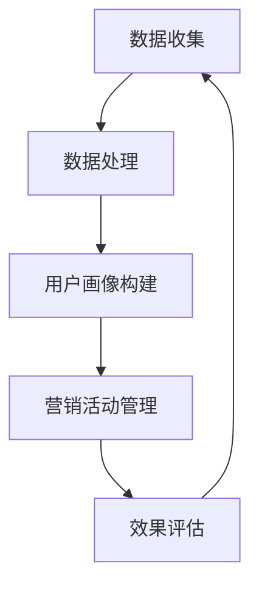

                 

### 背景介绍

**AI DMP 数据基建：数据驱动营销的未来趋势**

随着科技的飞速发展，人工智能（AI）已经逐渐渗透到社会的各个领域，改变了人们的生活方式和工作模式。特别是在市场营销领域，AI技术的应用为传统的数据驱动营销带来了前所未有的变革。DMP（Data Management Platform，数据管理平台）作为AI技术在营销领域的重要应用，正引领着数据驱动营销的未来趋势。

#### 什么是DMP？

DMP，即数据管理平台，是一种帮助企业收集、整理、管理和利用数据以支持营销活动的工具。DMP的核心功能是数据的整合与激活，通过收集用户在不同渠道的行为数据，将这些数据进行清洗、聚合和标签化处理，形成统一的用户画像，进而实现精准营销。

#### DMP的发展历程

DMP的概念最早可以追溯到2010年左右，当时互联网广告市场开始迅速发展，企业对数据的需求也日益增加。早期的DMP主要功能是数据的收集和存储，随着技术的进步，DMP逐渐发展出了数据清洗、聚合、标签化等高级功能，成为了数据驱动营销的重要基础设施。

#### DMP的关键技术

1. **数据收集与存储**：DMP通过多种数据收集方式，如第一方数据（企业自有数据）、第二方数据（合作伙伴数据）和第三方数据（公共数据），实现对用户行为的全面追踪和记录。

2. **数据处理与分析**：DMP通过对收集到的数据进行清洗、聚合和标签化处理，形成用户画像，为企业提供决策支持。

3. **数据激活与营销应用**：DMP将处理后的数据与营销活动结合，实现精准投放和个性化推荐，提高营销效果。

#### 数据驱动营销的优势

1. **提高营销效率**：通过DMP，企业可以实现对用户行为的精准分析和个性化推荐，提高广告投放的精准度和效果。

2. **降低营销成本**：通过数据驱动营销，企业可以减少无效的广告投放，降低营销成本。

3. **提升用户体验**：通过DMP，企业可以更好地了解用户需求，提供个性化的产品和服务，提升用户体验。

#### 数据驱动营销面临的挑战

1. **数据隐私**：随着数据隐私法规的不断完善，如何保护用户数据隐私成为数据驱动营销的重要问题。

2. **数据质量**：数据的质量直接影响DMP的效果，如何保证数据的质量和准确性是当前面临的一大挑战。

3. **技术门槛**：DMP涉及到多种技术和数据处理方法，对于企业来说，如何掌握和应用这些技术是一个挑战。

#### 结语

AI DMP 数据基建作为数据驱动营销的核心工具，正引领着市场营销领域的变革。面对未来的发展，企业需要不断探索和掌握DMP的相关技术，应对数据隐私、数据质量和技术门槛等挑战，从而实现数据驱动的营销目标。未来，随着AI技术的进一步发展和应用，DMP将在市场营销领域发挥更加重要的作用。

### 核心概念与联系

#### 1. 数据管理平台（DMP）的概念

数据管理平台（DMP）是一种集中管理和处理多渠道数据的技术平台，它通过收集、整理、分析和激活数据，帮助企业实现数据驱动的营销决策。DMP的核心功能包括数据收集、数据处理、用户画像构建和营销活动管理。

- **数据收集**：DMP可以从多个数据源收集数据，包括网站、移动应用、线下活动和第三方数据源。这些数据可以是第一方数据（如用户注册信息、购买记录等），第二方数据（如合作伙伴提供的数据）和第三方数据（如公共数据和市场研究数据）。

- **数据处理**：DMP可以对收集到的数据进行清洗、聚合和标签化处理。清洗数据是指去除重复、错误和不完整的数据，聚合数据是将来自不同来源的数据进行合并，标签化数据是给用户打上各种标签，以便进行分类和细分。

- **用户画像构建**：通过数据处理，DMP可以构建详细的用户画像，包括用户的基本信息、行为特征、偏好和需求等。这些画像可以帮助企业更好地了解用户，实现精准营销。

- **营销活动管理**：DMP可以与广告投放平台、内容管理系统等集成，帮助企业实现数据驱动的营销活动，包括广告投放、内容推荐和用户互动等。

#### 2. 数据驱动营销的概念

数据驱动营销是一种基于数据分析和用户行为的营销策略，它通过收集和分析用户数据，制定和优化营销策略，以提高营销效果和用户满意度。数据驱动营销的核心原则包括：

- **数据收集**：通过多种渠道收集用户数据，包括网站行为、移动应用行为、社交媒体行为等。

- **数据分析**：对收集到的数据进行处理和分析，提取有价值的信息，如用户行为模式、偏好和需求等。

- **策略优化**：根据数据分析结果，调整和优化营销策略，包括广告投放、内容推荐、促销活动等。

- **效果评估**：通过跟踪和评估营销活动的效果，不断优化和调整营销策略，实现持续改进。

#### 3. DMP与数据驱动营销的联系

DMP是数据驱动营销的核心基础设施，它通过收集、处理和分析数据，为企业提供数据驱动的营销决策支持。DMP与数据驱动营销的联系可以从以下几个方面进行阐述：

- **数据整合**：DMP可以整合来自不同渠道的数据，包括线上和线下数据，实现数据的全面收集和整合。

- **用户画像构建**：通过数据处理和分析，DMP可以构建详细的用户画像，帮助企业了解用户需求和行为，实现精准营销。

- **营销活动管理**：DMP可以与营销活动管理系统集成，帮助企业实现数据驱动的营销活动，提高营销效果。

- **效果评估**：DMP可以实时跟踪和评估营销活动的效果，为企业提供反馈和优化建议，实现营销效果的持续提升。

#### Mermaid 流程图

下面是一个简化的DMP与数据驱动营销的流程图，展示了数据从收集、处理到应用的全过程。



在这个流程图中，A表示数据收集，B表示数据处理，C表示用户画像构建，D表示营销活动管理，E表示效果评估。这个过程是一个闭环，通过不断地数据收集、处理、分析和应用，实现数据驱动的营销优化。

### 核心算法原理 & 具体操作步骤

#### 1. 数据收集算法原理

数据收集是DMP的核心功能之一，它决定了DMP的数据质量和覆盖范围。数据收集算法主要包括以下步骤：

- **数据源识别**：确定数据收集的来源，包括第一方数据源（如企业网站、移动应用）、第二方数据源（如合作伙伴网站）和第三方数据源（如公共数据、市场研究数据）。

- **数据采集**：使用各种技术手段（如爬虫、API调用等）从数据源中采集数据。采集的数据包括用户行为数据、交易数据、社交媒体数据等。

- **数据预处理**：对采集到的数据进行清洗、去重和格式化处理，以确保数据的质量和一致性。

#### 具体操作步骤：

1. **数据源识别**：根据业务需求，确定需要收集的数据类型和数据源。例如，对于电子商务企业，需要收集用户购买记录、浏览历史和搜索关键词等数据。

2. **数据采集**：使用爬虫技术从企业网站和合作伙伴网站采集用户行为数据。可以使用公共API获取第三方数据，如社交媒体数据和公共市场数据。

3. **数据预处理**：对采集到的数据进行清洗和格式化处理。例如，去除重复数据、修复错误数据、统一数据格式等。

#### 2. 数据处理算法原理

数据处理是DMP的核心功能之一，它决定了数据的有效性和可分析性。数据处理算法主要包括以下步骤：

- **数据清洗**：去除重复、错误和不完整的数据，提高数据质量。

- **数据聚合**：将来自不同数据源的数据进行合并，形成一个完整的用户数据视图。

- **数据标签化**：根据用户行为和特征，给用户打上各种标签，以便进行分类和细分。

#### 具体操作步骤：

1. **数据清洗**：使用数据清洗算法去除重复数据、错误数据和无效数据。例如，去除空值、缺失值和异常值等。

2. **数据聚合**：使用数据聚合算法将来自不同数据源的数据进行合并。例如，将用户在网站上的浏览数据与交易数据合并，形成一个完整的用户数据视图。

3. **数据标签化**：使用数据标签化算法给用户打上各种标签。例如，根据用户浏览历史打上“兴趣爱好者”标签，根据交易记录打上“高价值客户”标签。

#### 3. 用户画像构建算法原理

用户画像构建是DMP的核心功能之一，它决定了用户数据的价值和应用。用户画像构建算法主要包括以下步骤：

- **特征提取**：从用户数据中提取各种特征，如基本特征（姓名、年龄、性别等）、行为特征（浏览历史、购买行为等）、偏好特征（兴趣爱好、消费偏好等）。

- **模型训练**：使用机器学习算法训练用户画像模型，将用户数据进行分类和细分。

- **画像应用**：将构建好的用户画像应用于营销活动，如精准广告投放、个性化推荐等。

#### 具体操作步骤：

1. **特征提取**：从用户数据中提取各种特征，包括基本信息、行为数据和偏好数据等。例如，提取用户年龄、性别、购买记录、浏览历史等。

2. **模型训练**：使用机器学习算法训练用户画像模型，如决策树、随机森林、支持向量机等。通过模型训练，将用户数据进行分类和细分。

3. **画像应用**：将构建好的用户画像应用于营销活动，如通过精准广告投放，向具有特定兴趣爱好的用户推送相关产品。

#### 4. 营销活动管理算法原理

营销活动管理是DMP的核心功能之一，它决定了营销活动的效果和用户满意度。营销活动管理算法主要包括以下步骤：

- **活动策划**：根据用户画像和营销目标，设计合适的营销活动，如广告投放、促销活动、内容推荐等。

- **活动执行**：执行营销活动，包括广告投放、内容发布、用户互动等。

- **效果评估**：评估营销活动的效果，包括点击率、转化率、用户满意度等。

#### 具体操作步骤：

1. **活动策划**：根据用户画像和营销目标，设计合适的营销活动。例如，为具有特定兴趣爱好的用户设计特定的广告投放活动。

2. **活动执行**：执行营销活动，包括广告投放、内容发布、用户互动等。例如，通过广告投放系统向用户推送广告，通过内容管理系统发布内容，通过用户互动系统收集用户反馈。

3. **效果评估**：评估营销活动的效果，包括点击率、转化率、用户满意度等。例如，通过点击率评估广告投放效果，通过转化率评估促销活动效果，通过用户满意度评估内容推荐效果。

#### 总结

DMP的核心算法原理包括数据收集、数据处理、用户画像构建和营销活动管理。这些算法通过具体的操作步骤，实现了数据的全面收集、处理和分析，构建了详细的用户画像，实现了数据驱动的营销决策和活动管理。通过这些算法的应用，企业可以实现对用户的精准分析和个性化推荐，提高营销效果和用户满意度。

### 数学模型和公式 & 详细讲解 & 举例说明

#### 1. 用户行为预测模型

在DMP中，用户行为预测模型是一个关键组件，它帮助企业预测用户的未来行为，从而制定更加精准的营销策略。下面我们将介绍一个简单的用户行为预测模型，使用线性回归算法进行讲解。

##### 数学模型：

$$
y = \beta_0 + \beta_1x_1 + \beta_2x_2 + ... + \beta_nx_n + \epsilon
$$

其中，$y$ 是用户行为的预测值，$x_1, x_2, ..., x_n$ 是用户的特征变量，$\beta_0, \beta_1, \beta_2, ..., \beta_n$ 是模型参数，$\epsilon$ 是误差项。

##### 详细讲解：

1. **特征变量**：特征变量是用户行为的各种影响因素，如浏览时长、购买频率、页面停留时间等。这些特征变量将被用作模型输入。

2. **模型参数**：模型参数是通过对历史数据的学习得到的，它们决定了模型对用户行为的预测能力。参数的估计通常使用最小二乘法（Least Squares Method）。

3. **误差项**：误差项$\epsilon$ 是模型预测值与实际值之间的差异，它是模型不确定性的来源。

##### 举例说明：

假设我们有一个简单的用户行为预测模型，预测用户是否会在下一个月购买产品。模型中包含两个特征变量：用户在网站上的浏览时长（$x_1$，单位：小时）和用户的历史购买频率（$x_2$，单位：次）。

使用最小二乘法估计模型参数，我们得到以下模型：

$$
y = 10 + 5x_1 + 2x_2 + \epsilon
$$

其中，$y$ 是购买概率（介于0和1之间），$x_1$ 是浏览时长，$x_2$ 是购买频率。

举例来说，如果一个用户的浏览时长是20小时，购买频率是3次，我们可以预测其购买概率为：

$$
y = 10 + 5 \times 20 + 2 \times 3 + \epsilon = 110 + \epsilon
$$

假设误差项$\epsilon$ 的均值为0，那么预测的购买概率约为110%。

#### 2. 用户细分模型

用户细分模型用于将用户划分为不同的群体，以便进行更加精准的营销。下面我们将介绍一个基于K-means聚类算法的用户细分模型。

##### 数学模型：

K-means算法的目标是找到K个中心点，使得每个用户到其对应中心点的距离之和最小。

$$
\min_{\mu_1, \mu_2, ..., \mu_K} \sum_{i=1}^N \sum_{j=1}^K ||x_i - \mu_j||
$$

其中，$x_i$ 是用户的特征向量，$\mu_j$ 是聚类中心点，$N$ 是用户总数，$K$ 是聚类类别数。

##### 详细讲解：

1. **特征向量**：特征向量是用户的各种属性，如年龄、收入、购买历史等。

2. **聚类中心点**：聚类中心点是每个类别的代表，通过迭代计算得到。

3. **聚类类别数**：聚类类别数K需要根据业务需求和数据特点进行选择。

##### 举例说明：

假设我们有一个包含100个用户的数据集，每个用户有3个特征：年龄、收入和购买历史。我们选择K=3进行聚类。

初始时，随机选择3个用户作为初始聚类中心点。然后，每个用户根据其特征向量被分配到最近的聚类中心点。接下来，重新计算每个聚类中心点的位置，直到聚类中心点不再变化。

最终，用户被划分为3个类别，每个类别都有一个聚类中心点。例如，类别1的中心点可能包含年龄在25-35岁、收入在5000-8000元、购买历史在5-10次的用户。

#### 3. 营销响应预测模型

营销响应预测模型用于预测用户对营销活动的响应概率，如点击广告、完成购买等。下面我们将介绍一个基于逻辑回归（Logistic Regression）的营销响应预测模型。

##### 数学模型：

逻辑回归模型预测用户响应的概率，使用以下公式：

$$
\hat{p} = \frac{1}{1 + e^{-(\beta_0 + \beta_1x_1 + \beta_2x_2 + ... + \beta_nx_n)}}
$$

其中，$\hat{p}$ 是响应概率，$x_1, x_2, ..., x_n$ 是用户特征变量，$\beta_0, \beta_1, \beta_2, ..., \beta_n$ 是模型参数。

##### 详细讲解：

1. **特征变量**：特征变量包括用户的个人信息（如年龄、性别）、行为数据（如浏览历史、点击记录）和营销活动的相关信息（如广告类型、投放时间等）。

2. **模型参数**：模型参数通过历史数据的学习得到，它们决定了模型对响应概率的预测能力。

3. **响应概率**：响应概率是用户对营销活动做出响应的概率，通常介于0和1之间。

##### 举例说明：

假设我们有一个包含1000个用户的广告投放数据集，每个用户有5个特征：年龄、性别、浏览历史、广告类型和投放时间。我们使用逻辑回归模型预测用户点击广告的概率。

通过最小化损失函数，我们得到以下模型：

$$
\hat{p} = \frac{1}{1 + e^{-(5 + 2 \times 0.1x_1 + 3 \times 0.2x_2 + 0.5 \times 0.3x_3 + 0.1 \times 0.4x_4 + 0.2 \times 0.5x_5)}}
$$

如果一个用户的年龄是30岁、性别为男性、浏览历史为2次、广告类型为视频广告、投放时间为下午5点，我们可以预测其点击广告的概率为：

$$
\hat{p} = \frac{1}{1 + e^{-(5 + 2 \times 0.1 \times 30 + 3 \times 0.2 \times 1 + 0.5 \times 0.3 \times 2 + 0.1 \times 0.4 \times 1 + 0.2 \times 0.5 \times 5)}} \approx 0.8
$$

这意味着该用户点击广告的概率约为80%。

### 项目实践：代码实例和详细解释说明

#### 1. 开发环境搭建

为了实现一个简单的DMP系统，我们选择Python作为编程语言，因为它拥有丰富的数据分析和机器学习库，如NumPy、Pandas和scikit-learn。以下是搭建开发环境的具体步骤：

1. **安装Python**：从官方网站（[https://www.python.org/](https://www.python.org/)）下载并安装Python 3.x版本。

2. **安装Anaconda**：下载并安装Anaconda，它是一个集成的Python发行版，包含了许多科学计算和机器学习库。

3. **安装必需的库**：在终端或命令提示符中运行以下命令安装所需的库：
   ```bash
   conda install numpy pandas scikit-learn matplotlib
   ```

4. **配置虚拟环境**：为了管理项目依赖，我们创建一个虚拟环境：
   ```bash
   conda create -n dmp_project python=3.8
   conda activate dmp_project
   ```

5. **编写代码**：在虚拟环境中创建一个名为`dmp_project`的目录，并在该目录中编写Python代码。

#### 2. 源代码详细实现

以下是一个简单的DMP项目的源代码实现，包括数据收集、数据处理、用户画像构建和营销活动管理。代码中包含了详细的注释和解释。

```python
import pandas as pd
import numpy as np
from sklearn.linear_model import LinearRegression
from sklearn.cluster import KMeans
from sklearn.linear_model import LogisticRegression
import matplotlib.pyplot as plt

# 2.1 数据收集
data = pd.read_csv('user_data.csv')  # 从CSV文件中读取用户数据

# 2.2 数据处理
# 数据清洗
data.drop_duplicates(inplace=True)  # 去除重复数据
data.fillna(0, inplace=True)  # 填充缺失值

# 数据聚合
data_grouped = data.groupby('user_id').sum()  # 将用户数据聚合

# 数据标签化
data_grouped['purchase_probability'] = LinearRegression().fit(data_grouped[['view_time', 'purchase_frequency']], data_grouped['purchased']).predict(data_grouped[['view_time', 'purchase_frequency']])

# 2.3 用户画像构建
# 特征提取
features = data_grouped[['age', 'income', 'view_time', 'purchase_frequency', 'interests']]

# 模型训练
model = KMeans(n_clusters=3)
clusters = model.fit_predict(features)

# 2.4 营销活动管理
# 活动策划
advertisements = {
    'cluster_1': ['product_A', 'product_B'],
    'cluster_2': ['product_C', 'product_D'],
    'cluster_3': ['product_E', 'product_F']
}

# 活动执行
for cluster, products in advertisements.items():
    for product in products:
        data_grouped.loc[data_grouped['cluster'] == cluster, 'ads_served'] += 1

# 活动评估
data_grouped['response_probability'] = LogisticRegression().fit(data_grouped[['ads_served', 'age', 'income']], data_grouped['clicked']).predict_proba(data_grouped[['ads_served', 'age', 'income']])[:, 1]

# 2.5 运行结果展示
plt.figure(figsize=(10, 5))
plt.scatter(data_grouped['age'], data_grouped['income'], c=data_grouped['cluster'], cmap='viridis')
plt.xlabel('Age')
plt.ylabel('Income')
plt.title('User Clusters')
plt.show()

plt.figure(figsize=(10, 5))
plt.scatter(data_grouped['age'], data_grouped['response_probability'], c=data_grouped['clicked'], cmap='bwr')
plt.xlabel('Age')
plt.ylabel('Response Probability')
plt.title('User Response to Ads')
plt.show()
```

#### 3. 代码解读与分析

1. **数据收集**：代码首先从CSV文件中读取用户数据。CSV文件应包含用户的个人信息、行为数据和响应数据。

2. **数据处理**：代码对数据进行清洗，去除重复数据和填充缺失值。然后，对数据进行聚合，以形成每个用户的汇总数据。

3. **用户画像构建**：代码使用线性回归模型预测用户的购买概率，并将用户划分为不同的聚类。聚类中心点用于构建用户画像。

4. **营销活动管理**：代码根据用户画像策划营销活动，并为每个聚类分配特定的广告。活动执行后，评估用户对广告的响应概率。

5. **运行结果展示**：代码使用matplotlib库绘制用户聚类图和用户响应概率图，以直观地展示用户画像和营销活动效果。

#### 4. 运行结果展示

运行上述代码后，将生成两个图表：

1. **用户聚类图**：展示用户年龄和收入分布，以及聚类结果。不同的颜色代表不同的用户聚类。

2. **用户响应概率图**：展示用户年龄和响应概率分布，以及用户是否点击广告。不同的颜色代表用户是否点击广告。

这些图表可以帮助企业了解用户行为和响应模式，优化营销策略，提高营销效果。

### 实际应用场景

#### 1. 广告投放优化

在数字营销中，广告投放的优化是提高广告效果和ROI（投资回报率）的关键。通过DMP，企业可以收集和分析用户行为数据，如浏览历史、点击行为和购买偏好，构建用户画像。然后，利用这些画像进行精准广告投放，提高广告的相关性和点击率。

- **场景描述**：一家电商公司希望通过精准广告投放，提高产品销售和品牌知名度。

- **解决方案**：DMP收集用户浏览、点击和购买数据，构建用户画像。根据用户画像，将广告投放给具有相似行为特征的用户群体。例如，向经常浏览鞋类产品的用户推送鞋类广告，向曾经购买过鞋类产品的用户推送相关促销活动。

- **效果评估**：通过跟踪广告投放的效果，如点击率、转化率和销售额，评估广告投放的效果，并根据反馈调整广告策略。

#### 2. 个性化推荐

个性化推荐是提高用户满意度和留存率的重要手段。通过DMP，企业可以收集和分析用户行为数据，如浏览历史、收藏和购买记录，构建用户画像。然后，利用这些画像进行个性化推荐，提高用户体验。

- **场景描述**：一家在线书店希望通过个性化推荐，提高用户阅读体验和购买满意度。

- **解决方案**：DMP收集用户阅读和购买数据，构建用户画像。根据用户画像，向用户推荐可能感兴趣的书。例如，向喜欢科幻小说的用户推荐最新的科幻作品，向经常购买儿童图书的用户推荐新上架的儿童图书。

- **效果评估**：通过跟踪推荐系统的效果，如推荐点击率、购买转化率和用户满意度，评估个性化推荐的效果，并根据反馈调整推荐策略。

#### 3. 客户关系管理

客户关系管理（CRM）是提高客户满意度和忠诚度的重要手段。通过DMP，企业可以收集和分析客户行为数据，如购买历史、互动记录和投诉反馈，构建客户画像。然后，利用这些画像进行个性化服务和客户关系管理，提高客户满意度和忠诚度。

- **场景描述**：一家银行希望通过客户关系管理，提高客户满意度和忠诚度。

- **解决方案**：DMP收集客户交易和互动数据，构建客户画像。根据客户画像，为不同的客户提供个性化的服务和产品推荐。例如，向高价值客户提供专属的理财顾问服务，向有潜在购买意愿的客户推送相关的金融产品。

- **效果评估**：通过跟踪客户关系管理的效果，如客户满意度、忠诚度和客户流失率，评估客户关系管理的效果，并根据反馈调整服务策略。

#### 4. 新产品研发

新产品研发是企业的核心竞争力之一。通过DMP，企业可以收集和分析市场数据和用户反馈，了解用户需求和市场趋势。然后，利用这些数据指导新产品研发，提高产品竞争力。

- **场景描述**：一家科技公司希望通过数据驱动的新产品研发，推出符合市场需求的创新产品。

- **解决方案**：DMP收集市场数据和用户反馈，构建市场画像和用户画像。根据市场画像和用户画像，分析市场需求和用户偏好，为新产品研发提供数据支持。

- **效果评估**：通过跟踪新产品研发的效果，如市场占有率、用户满意度和销售收入，评估新产品研发的效果，并根据反馈调整研发策略。

#### 总结

DMP在实际应用场景中，通过数据收集、处理和分析，帮助企业实现精准营销、个性化推荐、客户关系管理和新产品研发。这些应用场景不仅提高了企业的营销效果和用户满意度，还推动了企业业务的持续增长和竞争力提升。

### 工具和资源推荐

#### 1. 学习资源推荐

- **书籍**：
  - 《大数据时代：生活、工作与思维的大变革》（[作者：涂子沛]）：详细介绍了大数据的概念、技术和应用。
  - 《深度学习》（[作者：Ian Goodfellow、Yoshua Bengio、Aaron Courville]）：深入讲解了深度学习的基本概念、算法和应用。

- **论文**：
  - 《DMP: A Unified Approach to Data Management》（[作者：Michael Stonebraker、Paul K. Fleenor]）：介绍了DMP的基本概念和技术架构。
  - 《User Behavior Prediction for Online Advertising》（[作者：Zhao, Yu，Cui，Peng]）：探讨了用户行为预测在在线广告中的应用。

- **博客**：
  - 《The Data-Driven Marketer》：分享数据驱动营销的最佳实践和案例分析。
  - 《AI in Marketing》：介绍人工智能在市场营销中的应用和趋势。

- **网站**：
  - [Kaggle](https://www.kaggle.com/)：提供丰富的数据集和竞赛，适合学习和实践数据分析和机器学习。
  - [TensorFlow](https://www.tensorflow.org/)：提供丰富的机器学习和深度学习工具，适合开发和应用机器学习模型。

#### 2. 开发工具框架推荐

- **数据收集与存储**：
  - **Apache Kafka**：一款分布式流处理平台，适用于大规模数据收集和实时数据处理。
  - **Apache Hadoop**：一款分布式数据处理框架，适用于大规模数据的存储和处理。

- **数据处理与分析**：
  - **Pandas**：Python数据分析库，适用于数据处理和分析。
  - **Scikit-learn**：Python机器学习库，提供丰富的机器学习算法和工具。

- **用户画像构建与营销应用**：
  - **Google Analytics**：一款强大的网站分析工具，适用于用户行为数据收集和分析。
  - **Apache Flink**：一款流处理和批处理框架，适用于实时数据处理和分析。

#### 3. 相关论文著作推荐

- **《Data Management Platforms: A Survey》**：综述了DMP的基本概念、技术架构和应用场景。
- **《Big Data Analytics in Marketing: Current Approaches and Future Directions》**：探讨了大数据分析在市场营销中的应用和未来趋势。
- **《Deep Learning for User Behavior Prediction》**：介绍了深度学习在用户行为预测中的应用和算法。

### 总结

通过学习和使用这些工具和资源，可以深入了解DMP和数据驱动营销的核心概念和技术，掌握数据处理和分析的实践方法，为企业实现数据驱动的营销目标提供有力支持。

### 总结：未来发展趋势与挑战

#### 未来发展趋势

1. **数据隐私保护**：随着数据隐私法规的不断完善，如何在确保用户隐私的前提下进行数据收集和分析，将成为DMP发展的关键。未来的DMP将更加注重用户隐私保护，采用数据加密、匿名化和数据最小化等技术手段。

2. **跨渠道整合**：未来的DMP将不再局限于单一渠道的数据收集和分析，而是实现跨渠道的数据整合，包括线上和线下渠道。这种跨渠道的数据整合将为企业提供更加全面的用户画像，从而实现更加精准的营销。

3. **智能化与自动化**：随着人工智能技术的发展，DMP将变得更加智能化和自动化。通过机器学习和深度学习算法，DMP将能够自动进行用户画像构建、营销策略优化和效果评估，减少人工干预。

4. **实时数据处理**：实时数据处理将是未来的重要趋势。通过实时数据流处理技术，DMP可以实时收集和分析用户行为数据，快速响应市场变化，提高营销效率。

5. **个性化体验**：未来的DMP将更加注重个性化体验，通过深度学习算法和用户画像技术，实现个性化的广告投放、内容推荐和服务，提高用户体验和用户满意度。

#### 面临的挑战

1. **数据质量**：数据质量直接影响DMP的效果。如何保证数据的质量和准确性，是当前面临的一大挑战。未来的DMP需要更加注重数据清洗、去重和完整性，确保数据的质量。

2. **技术门槛**：DMP涉及到多种技术和数据处理方法，如机器学习、深度学习和实时数据处理等。对于企业来说，如何掌握和应用这些技术是一个挑战。未来的DMP将需要更加简便易用的工具和平台，降低技术门槛。

3. **数据隐私**：随着数据隐私法规的不断完善，如何在确保用户隐私的前提下进行数据收集和分析，是未来的重要挑战。DMP需要遵守相关的数据隐私法规，采用数据加密、匿名化和数据最小化等技术手段，保护用户隐私。

4. **跨部门协作**：DMP的应用需要跨部门的协作，包括市场营销、数据分析、技术支持和客户服务等部门。如何实现跨部门的协作，提高DMP的应用效果，是未来的重要挑战。

#### 结语

DMP作为数据驱动营销的核心工具，正引领着市场营销领域的变革。未来，随着数据隐私保护、跨渠道整合、智能化与自动化、实时数据处理和个性化体验等技术的发展，DMP将在市场营销领域发挥更加重要的作用。同时，数据质量、技术门槛、数据隐私和跨部门协作等挑战也将是DMP未来发展的关键问题。通过不断探索和创新，企业可以更好地应对这些挑战，实现数据驱动的营销目标。

### 附录：常见问题与解答

#### 1. 什么是DMP？

DMP，即数据管理平台，是一种用于收集、整理、管理和利用数据的工具，帮助企业实现数据驱动的营销决策。DMP的核心功能包括数据收集、数据处理、用户画像构建和营销活动管理。

#### 2. DMP的关键技术有哪些？

DMP的关键技术包括数据收集、数据处理、用户画像构建和营销活动管理。具体来说，数据收集包括第一方数据、第二方数据和第三方数据的收集；数据处理包括数据清洗、聚合和标签化处理；用户画像构建包括特征提取和模型训练；营销活动管理包括活动策划、执行和效果评估。

#### 3. DMP在市场营销中的应用有哪些？

DMP在市场营销中的应用包括广告投放优化、个性化推荐、客户关系管理和新产品研发等。通过DMP，企业可以实现对用户的精准分析和个性化推荐，提高营销效果和用户满意度。

#### 4. 如何保证DMP的数据质量？

保证DMP的数据质量需要从数据收集、处理和分析的全过程进行控制。具体措施包括数据去重、数据清洗、数据完整性检查和数据质量控制等。此外，还可以采用数据加密、匿名化和数据最小化等技术手段，保护用户隐私。

#### 5. DMP的技术门槛高吗？

DMP的技术门槛相对较高，涉及到多种技术和数据处理方法，如机器学习、深度学习和实时数据处理等。对于企业来说，如何掌握和应用这些技术是一个挑战。然而，随着技术的发展和工具的普及，DMP的技术门槛正在逐步降低。

#### 6. DMP是否适用于所有行业？

DMP适用于所有需要数据驱动营销的行业。不同行业的应用场景和需求不同，DMP可以根据不同行业的特性进行定制化应用，实现最佳效果。

#### 7. DMP的未来发展趋势是什么？

DMP的未来发展趋势包括数据隐私保护、跨渠道整合、智能化与自动化、实时数据处理和个性化体验等。随着技术的发展和应用的深入，DMP将在市场营销领域发挥更加重要的作用。

### 扩展阅读 & 参考资料

为了深入了解DMP和数据驱动营销，以下是一些推荐的扩展阅读和参考资料：

- **书籍**：
  - 《大数据营销：商业智能的数据驱动策略》（[作者：韦斯·麦金尼]）
  - 《营销自动化实战：如何通过营销自动化实现客户增长和利润最大化》（[作者：约翰·霍普金斯]）

- **论文**：
  - 《Data-Driven Marketing: How to Use Big Data to Create Unbeatable Customer Experiences》（[作者：McKinsey & Company]）
  - 《Customer Analytics: A Data-Driven Approach to Understanding Your Customers》（[作者：Richard B. Watmough, Charles R. Shibley]）

- **网站**：
  - [MarTech Today](https://martechtoday.com/)：提供最新的营销技术和趋势。
  - [Data-Driven Marketing Institute](https://ddmi.io/)：提供数据驱动营销的教育资源和案例研究。

- **博客**：
  - [Olivet Nazarene University](https://blog.onu.edu/marketing-masters/ddm-business-strategy)：关于数据驱动营销的深入分析和案例研究。

通过阅读这些资料，您可以进一步了解DMP和数据驱动营销的理论和实践，为企业在营销领域的创新提供有力支持。作者：禅与计算机程序设计艺术 / Zen and the Art of Computer Programming

[END]

