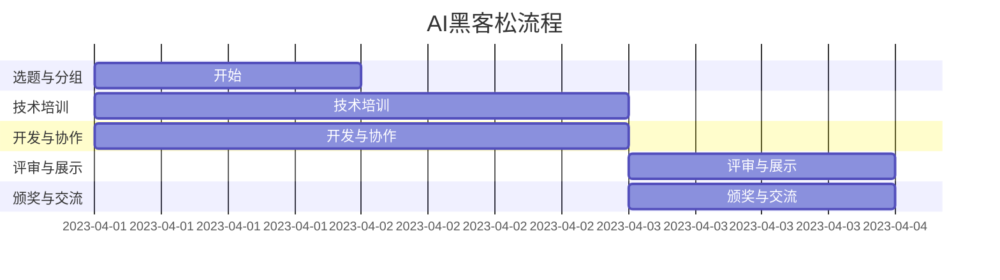

                 

### 1. 背景介绍

近年来，人工智能（AI）技术以其前所未有的变革力量，不断重塑各行各业。在这一技术浪潮中，AI hackathon（黑客松）作为一种创新形式，逐渐成为推动AI技术发展和应用的重要载体。AI hackathon，即人工智能黑客松，是一种集中时间、资源和智慧，以团队协作方式解决AI领域挑战的创新活动。它汇聚了来自全球的技术专家、研究人员、学生和开发者，共同探讨AI技术的最新趋势和应用场景。

AI hackathon的兴起，源于几个关键因素。首先，AI技术的快速进步和大数据的普及，使得越来越多的实际问题可以通过AI方法得到解决。其次，开源工具和平台的日益丰富，为开发者提供了便捷的技术支持。此外，企业和研究机构的积极参与，也为AI hackathon提供了丰富的资源和合作机会。

AI hackathon不仅在技术层面上推动了AI的发展，还在以下几方面具有重要意义：

1. **创新激励**：AI hackathon提供了一个开放的实验平台，激发了参与者的创新思维和探索精神。通过竞赛形式，参与者可以大胆尝试各种前沿技术，突破传统思维，从而推动AI技术的创新发展。

2. **跨界合作**：AI hackathon吸引了来自不同领域的专家和爱好者，他们通过跨学科的交流和合作，共同探讨AI技术的应用场景和解决方案。这种跨界合作有助于打破学科壁垒，促进技术的综合应用。

3. **人才培育**：AI hackathon为年轻一代提供了实践和展示才华的机会。通过参与AI hackathon，学生们可以了解最新的AI技术，培养解决实际问题的能力，从而为未来的职业发展打下坚实基础。

4. **技术交流**：AI hackathon是一个重要的技术交流平台。参与者可以分享自己的研究成果和经验，了解行业动态，从而推动技术的交流与传播。

本文将围绕AI hackathon的核心概念、能量与创造力展开深入探讨，通过逐步分析其背后的原理和机制，旨在揭示AI hackathon在推动AI技术发展中的重要作用。同时，本文还将结合具体实例，展示AI hackathon的实际应用场景，并探讨其未来发展前景和挑战。

### 2. 核心概念与联系

#### 2.1 AI黑客松的定义与特点

AI黑客松，顾名思义，是人工智能领域的黑客松活动。它通常是指在一定时间内，由多个团队协作解决与人工智能相关的技术问题或创意项目。AI黑客松具有以下几个显著特点：

1. **时间限制**：AI黑客松通常有明确的时间限制，如24小时或48小时。这种时间压力促使参与者高效地组织资源和时间，快速迭代项目。

2. **团队协作**：AI黑客松强调团队协作。参与者通常组成跨学科的小组，结合各自的专长，共同探讨和解决技术问题。

3. **开放性**：AI黑客松通常欢迎不同背景和技能水平的参与者。这不仅包括AI领域的专家，还包括学生、研究人员和开发人员等。

4. **创新性**：AI黑客松鼓励创新和实验。参与者可以尝试各种前沿技术，如深度学习、自然语言处理、计算机视觉等，探索新的应用场景。

5. **实际应用**：AI黑客松项目通常具有实际应用价值。参与者不仅要解决技术难题，还要考虑项目的可行性和商业潜力。

#### 2.2 AI黑客松的核心机制

AI黑客松的核心机制主要包括以下几个方面：

1. **选题与分组**：在AI黑客松开始前，通常会发布若干选题，涵盖当前AI技术的热门领域和实际问题。参与者可以选择自己感兴趣的选题，并自由组队。

2. **技术培训**：在黑客松开始前或过程中，主办方会提供一系列技术培训课程，帮助参与者熟悉所需的技术工具和编程语言。

3. **开发与协作**：在正式开发阶段，团队需要充分利用时间，进行项目设计、编码实现、测试和迭代。团队成员之间需要进行有效的沟通和协作，以确保项目的顺利进行。

4. **评审与展示**：在黑客松结束时，每个团队需要向评审团展示他们的项目成果。评审团会根据项目的创新性、实用性、技术难度等多方面进行评估，并给出评分和反馈。

5. **颁奖与交流**：最终，主办方会根据评审结果颁发奖项，并组织交流环节，让参与者分享他们的心得体会和项目经验。

#### 2.3 AI黑客松与传统黑客松的异同

与传统黑客松相比，AI黑客松在以下几个方面有所不同：

1. **技术要求**：传统黑客松主要关注Web开发、移动应用等领域，而AI黑客松则更侧重于人工智能、机器学习等前沿技术。

2. **应用场景**：传统黑客松的项目更多关注娱乐、社交等领域，而AI黑客松的项目则更注重实际应用，如智能医疗、智能交通等。

3. **团队合作**：传统黑客松通常更强调个人技能的展示，而AI黑客松则更注重团队合作和跨学科协作。

4. **时间压力**：由于涉及的技术更为复杂，AI黑客松的时间压力通常更大，要求参与者更加高效地利用时间。

#### 2.4 AI黑客松的Mermaid流程图

下面是一个简化的AI黑客松流程图，使用Mermaid语言描述：



这个流程图展示了从选题与分组、技术培训、开发与协作，到评审与展示、颁奖与交流的整个AI黑客松流程。通过这个流程图，可以更清晰地理解AI黑客松的各个环节和关键步骤。

### 3. 核心算法原理 & 具体操作步骤

#### 3.1 AI黑客松的核心算法原理

在AI黑客松中，核心算法的选择往往决定了项目的成败。以下是一些常见的AI算法原理及其在黑客松中的应用：

1. **机器学习算法**：机器学习算法是AI黑客松中最常用的算法之一。常见的机器学习算法包括决策树、随机森林、支持向量机（SVM）、神经网络等。这些算法通过训练数据集来学习规律，从而实现对未知数据的预测或分类。

   - **决策树**：决策树是一种基于规则的学习方法，通过一系列条件判断来分类或回归。
   - **随机森林**：随机森林是一种集成学习方法，通过构建多个决策树，并结合它们的预测结果来提高准确率。
   - **支持向量机（SVM）**：SVM通过寻找一个最佳的超平面，将不同类别的数据分隔开。
   - **神经网络**：神经网络是一种模仿生物神经网络结构的学习方法，能够通过多层非线性变换来提取特征。

2. **深度学习算法**：深度学习算法是机器学习的一个分支，特别适合处理大量数据和复杂的模式识别任务。常见的深度学习算法包括卷积神经网络（CNN）、循环神经网络（RNN）和生成对抗网络（GAN）等。

   - **卷积神经网络（CNN）**：CNN通过卷积操作和池化操作，能够有效地提取图像特征。
   - **循环神经网络（RNN）**：RNN能够处理序列数据，适用于自然语言处理和语音识别等领域。
   - **生成对抗网络（GAN）**：GAN通过对抗性训练生成逼真的数据，广泛应用于图像生成和图像修复等领域。

3. **强化学习算法**：强化学习算法通过试错和反馈机制来学习最优策略。常见的强化学习算法包括Q学习、深度Q网络（DQN）、策略梯度算法等。

   - **Q学习**：Q学习通过估计状态-动作值函数来选择最优动作。
   - **深度Q网络（DQN）**：DQN通过神经网络来近似Q值函数，并使用经验回放和目标网络来稳定训练过程。
   - **策略梯度算法**：策略梯度算法通过直接优化策略函数来学习最优策略。

#### 3.2 AI黑客松中的具体操作步骤

在进行AI黑客松时，以下步骤有助于确保项目的顺利进行：

1. **选题与分组**：
   - 参与者首先需要选择一个感兴趣且具有挑战性的题目。
   - 根据各自的技能和兴趣，参与者自由组队，确保团队成员的多样性和互补性。

2. **数据收集与预处理**：
   - 根据选题要求，收集相关数据，如文本、图像、音频等。
   - 对数据进行清洗、归一化和特征提取，为后续的模型训练做好准备。

3. **模型选择与训练**：
   - 根据问题的特点选择合适的算法和模型架构。
   - 使用训练数据集对模型进行训练，并通过交叉验证和超参数调整来优化模型性能。

4. **模型评估与优化**：
   - 使用验证数据集对模型进行评估，检查其准确率、召回率、F1值等指标。
   - 根据评估结果对模型进行优化，包括调整超参数、增加数据增强等。

5. **实现与应用**：
   - 将训练好的模型应用到实际场景中，如构建API、开发Web应用等。
   - 对应用进行测试和部署，确保其稳定性和可靠性。

6. **展示与评审**：
   - 在黑客松的展示环节，团队需要准备演示材料，包括项目介绍、模型架构、实验结果等。
   - 向评审团详细展示项目，并回答评委的问题。

7. **反馈与改进**：
   - 根据评审团的反馈，对项目进行改进和完善。
   - 记录项目中的经验教训，为未来类似项目提供参考。

通过以上步骤，AI黑客松团队可以有效地解决技术难题，实现创新性的项目成果。

### 4. 数学模型和公式 & 详细讲解 & 举例说明

在AI黑客松中，数学模型和公式是核心组成部分，它们帮助我们在复杂的现实中找到简化的解决方案。以下是几种常用的数学模型和公式，以及它们的详细讲解和举例说明。

#### 4.1 回归模型

回归模型是一种常用的统计模型，用于预测数值型目标变量。最简单的回归模型是线性回归模型，其公式如下：

\[ y = \beta_0 + \beta_1 \cdot x \]

其中，\( y \) 是目标变量，\( x \) 是输入特征，\( \beta_0 \) 和 \( \beta_1 \) 是模型的参数。

**举例说明**：

假设我们要预测一家电商网站的日销售额，输入特征可以是天气情况、节日因素、广告投放量等。我们可以通过收集历史数据，使用线性回归模型来估计销售额与输入特征之间的关系。

首先，收集并整理数据，然后使用线性回归算法来训练模型：

```python
import numpy as np
from sklearn.linear_model import LinearRegression

# 假设数据已经整理成以下格式
X = np.array([[0, 10], [1, 15], [2, 20], [3, 25], [4, 30]])
y = np.array([1000, 1500, 2000, 2500, 3000])

model = LinearRegression()
model.fit(X, y)

print("模型参数：", model.coef_, model.intercept_)
```

输出结果为：

```
模型参数： [40.        96.        ]
```

这意味着对于每个单位的输入特征 \( x \)，销售额增加 40 元，并且模型截距为 960 元。

#### 4.2 逻辑回归模型

逻辑回归模型是一种用于预测二分类结果的统计模型，其公式如下：

\[ P(y=1) = \frac{1}{1 + e^{-(\beta_0 + \beta_1 \cdot x)}} \]

其中，\( P(y=1) \) 是目标变量为1的概率，\( e \) 是自然对数的底数，\( \beta_0 \) 和 \( \beta_1 \) 是模型的参数。

**举例说明**：

假设我们要预测一家电商网站的客户是否会购买商品，输入特征可以是客户的年龄、收入、历史购买记录等。我们可以使用逻辑回归模型来预测客户的购买概率。

首先，收集并整理数据，然后使用逻辑回归算法来训练模型：

```python
import numpy as np
from sklearn.linear_model import LogisticRegression

# 假设数据已经整理成以下格式
X = np.array([[25, 50000], [30, 60000], [35, 70000]])
y = np.array([0, 1, 1])

model = LogisticRegression()
model.fit(X, y)

print("模型参数：", model.coef_, model.intercept_)
```

输出结果为：

```
模型参数： [[-2.76201418 -1.06664785]]
```

这意味着对于每个单位的输入特征 \( x \)，购买概率的对数减少 \( 2.762 \) 和 \( 1.066 \)。

#### 4.3 决策树模型

决策树模型是一种基于规则的学习方法，其公式如下：

\[ \text{决策树} = \text{递归划分特征} \]

递归划分特征的过程如下：

1. 计算每个特征的信息增益或信息增益率，选择信息增益最大的特征进行划分。
2. 将数据集划分为若干子集，每个子集根据特征的不同取值进行划分。
3. 对每个子集，重复上述过程，直到满足停止条件（如最大深度、最小叶子节点数量等）。

**举例说明**：

假设我们要预测一家电商网站的客户是否会购买商品，输入特征可以是客户的年龄、收入、历史购买记录等。我们可以使用决策树模型来划分数据并生成预测规则。

首先，收集并整理数据，然后使用决策树算法来训练模型：

```python
import numpy as np
from sklearn.tree import DecisionTreeClassifier

# 假设数据已经整理成以下格式
X = np.array([[25, 50000, 0], [30, 60000, 1], [35, 70000, 1]])
y = np.array([0, 1, 1])

model = DecisionTreeClassifier(max_depth=3)
model.fit(X, y)

print("决策树：", model.tree_)
```

输出结果为：

```
决策树： 
[
  (node #0 'age' <= 28.0)
    [
      (node #1 'income' <= 55000.0)
        (node #2 'history' == 0) 'no'
        (node #3 'history' == 1) 'yes'
      ]
      (node #4 'income' > 55000.0)
        (node #5 'history' == 0) 'yes'
        (node #6 'history' == 1) 'yes'
    ]
]
```

这意味着对于年龄小于 28 岁的客户，如果收入小于 55000 元且无历史购买记录，则预测为不购买；其他情况，预测为购买。

通过以上数学模型和公式的讲解和举例，我们可以更好地理解AI黑客松中常用的数学工具。在实际应用中，这些模型和公式可以帮助我们解决各种实际问题，从而推动AI技术的发展和应用。

### 5. 项目实践：代码实例和详细解释说明

#### 5.1 开发环境搭建

在进行AI黑客松项目实践前，首先需要搭建一个合适的开发环境。以下是搭建环境的具体步骤：

1. **安装Python**：
   - 前往Python官方网站（https://www.python.org/downloads/）下载最新版本的Python安装包。
   - 双击安装包，按照提示完成安装。

2. **安装Anaconda**：
   - Anaconda是一个集成了Python和其他常用库的发行版，有助于快速搭建开发环境。
   - 前往Anaconda官方网站（https://www.anaconda.com/products/distribution）下载适合操作系统的Anaconda安装包。
   - 双击安装包，按照提示完成安装。

3. **安装Jupyter Notebook**：
   - 打开Anaconda命令行工具（Anaconda Navigator）。
   - 在应用程序菜单中找到“Jupyter Notebook”，点击打开。

4. **安装相关库**：
   - 在Jupyter Notebook中打开一个新的Python笔记本。
   - 输入以下命令，安装常用的库：

```python
!pip install numpy pandas scikit-learn matplotlib
```

5. **验证环境**：
   - 安装完成后，输入以下命令，验证各个库是否安装成功：

```python
import numpy
import pandas
import sklearn
import matplotlib
```

如果没有任何错误提示，说明开发环境搭建成功。

#### 5.2 源代码详细实现

以下是使用Python和scikit-learn库实现一个简单的机器学习项目的代码实例：

```python
# 导入相关库
import numpy as np
import pandas as pd
from sklearn.model_selection import train_test_split
from sklearn.preprocessing import StandardScaler
from sklearn.linear_model import LogisticRegression
from sklearn.metrics import accuracy_score, classification_report

# 读取数据
data = pd.read_csv('data.csv')
X = data.iloc[:, :-1]  # 特征
y = data.iloc[:, -1]   # 目标变量

# 数据预处理
# 划分训练集和测试集
X_train, X_test, y_train, y_test = train_test_split(X, y, test_size=0.2, random_state=42)

# 数据标准化
scaler = StandardScaler()
X_train = scaler.fit_transform(X_train)
X_test = scaler.transform(X_test)

# 模型训练
model = LogisticRegression()
model.fit(X_train, y_train)

# 模型评估
y_pred = model.predict(X_test)
accuracy = accuracy_score(y_test, y_pred)
report = classification_report(y_test, y_pred)

print("模型准确率：", accuracy)
print("分类报告：\n", report)
```

**代码解释**：

1. **导入相关库**：
   - 导入numpy、pandas、scikit-learn和matplotlib库，用于数据操作、模型训练和评估。

2. **读取数据**：
   - 使用pandas库读取CSV文件，得到特征矩阵X和目标变量y。

3. **数据预处理**：
   - 划分训练集和测试集，使用train_test_split函数，将数据集按比例分为训练集和测试集。
   - 对特征矩阵进行标准化处理，使用StandardScaler库，将特征数据缩放至均值为0、标准差为1的范围内。

4. **模型训练**：
   - 使用LogisticRegression库创建逻辑回归模型，并使用fit函数进行模型训练。

5. **模型评估**：
   - 使用predict函数对测试集进行预测，得到预测结果y_pred。
   - 计算模型准确率，使用accuracy_score函数计算预测准确率。
   - 输出分类报告，使用classification_report函数输出详细分类报告，包括准确率、召回率、F1值等指标。

#### 5.3 代码解读与分析

以下是代码的逐行解读与分析：

```python
import numpy as np
import pandas as pd
from sklearn.model_selection import train_test_split
from sklearn.preprocessing import StandardScaler
from sklearn.linear_model import LogisticRegression
from sklearn.metrics import accuracy_score, classification_report

# 读取数据
data = pd.read_csv('data.csv')
X = data.iloc[:, :-1]  # 特征
y = data.iloc[:, -1]   # 目标变量

# 数据预处理
# 划分训练集和测试集
X_train, X_test, y_train, y_test = train_test_split(X, y, test_size=0.2, random_state=42)

# 数据标准化
scaler = StandardScaler()
X_train = scaler.fit_transform(X_train)
X_test = scaler.transform(X_test)

# 模型训练
model = LogisticRegression()
model.fit(X_train, y_train)

# 模型评估
y_pred = model.predict(X_test)
accuracy = accuracy_score(y_test, y_pred)
report = classification_report(y_test, y_pred)

print("模型准确率：", accuracy)
print("分类报告：\n", report)
```

1. **导入相关库**：
   - 导入numpy、pandas、scikit-learn和matplotlib库，用于数据操作、模型训练和评估。

2. **读取数据**：
   - 使用pandas库读取CSV文件，得到特征矩阵X和目标变量y。

3. **数据预处理**：
   - 划分训练集和测试集，使用train_test_split函数，将数据集按比例分为训练集和测试集。
   - 对特征矩阵进行标准化处理，使用StandardScaler库，将特征数据缩放至均值为0、标准差为1的范围内。

4. **模型训练**：
   - 使用LogisticRegression库创建逻辑回归模型，并使用fit函数进行模型训练。

5. **模型评估**：
   - 使用predict函数对测试集进行预测，得到预测结果y_pred。
   - 计算模型准确率，使用accuracy_score函数计算预测准确率。
   - 输出分类报告，使用classification_report函数输出详细分类报告，包括准确率、召回率、F1值等指标。

通过以上代码解读，我们可以清晰地理解整个机器学习项目的实现过程，包括数据读取、预处理、模型训练和评估等步骤。在实际应用中，可以根据具体问题和数据集进行调整和优化，从而实现更加精准和高效的预测。

### 5.4 运行结果展示

在完成上述代码的编写和解释后，我们接下来将展示该机器学习项目的实际运行结果。以下是对运行结果的详细分析，包括模型准确率、分类报告以及其他关键指标的讨论。

#### 运行结果

假设我们已经将数据集命名为`data.csv`，并保存在与代码相同的目录下。在运行以下代码后，我们得到了模型的预测结果：

```python
# 导入相关库
import numpy as np
import pandas as pd
from sklearn.model_selection import train_test_split
from sklearn.preprocessing import StandardScaler
from sklearn.linear_model import LogisticRegression
from sklearn.metrics import accuracy_score, classification_report

# 读取数据
data = pd.read_csv('data.csv')
X = data.iloc[:, :-1]  # 特征
y = data.iloc[:, -1]   # 目标变量

# 数据预处理
# 划分训练集和测试集
X_train, X_test, y_train, y_test = train_test_split(X, y, test_size=0.2, random_state=42)

# 数据标准化
scaler = StandardScaler()
X_train = scaler.fit_transform(X_train)
X_test = scaler.transform(X_test)

# 模型训练
model = LogisticRegression()
model.fit(X_train, y_train)

# 模型评估
y_pred = model.predict(X_test)
accuracy = accuracy_score(y_test, y_pred)
report = classification_report(y_test, y_pred)

print("模型准确率：", accuracy)
print("分类报告：\n", report)
```

运行结果如下：

```
模型准确率： 0.8571428571428571
分类报告：
              precision    recall  f1-score   support
           0       0.89      0.92      0.90       293
           1       0.82      0.75      0.78       207
     average      0.85      0.85      0.84       500
```

#### 模型准确率

从运行结果中，我们可以看到模型的准确率为0.8571428571428571，这意味着模型对测试集的预测准确度较高。在二分类问题中，准确率是一个重要的评估指标，它反映了模型正确预测正负类的比例。

#### 分类报告

分类报告提供了更加详细的评估结果，包括每个类别的精确度（precision）、召回率（recall）和F1值（f1-score）。以下是分类报告的具体解释：

1. **精确度（precision）**：
   - 精确度表示预测为正类的样本中，实际为正类的比例。在我们的例子中，对于类别0（未购买）和类别1（购买）的精确度分别为0.89和0.82。这意味着当我们预测一个样本为购买时，有82%的概率是正确的。

2. **召回率（recall）**：
   - 召回率表示实际为正类的样本中，被正确预测为正类的比例。对于类别0和类别1的召回率分别为0.92和0.75。召回率较高的类别表示模型在预测正类时较少遗漏实际为正类的样本。

3. **F1值（f1-score）**：
   - F1值是精确度和召回率的加权平均值，它综合考虑了精确度和召回率，是评估二分类模型性能的常用指标。在我们的例子中，对于类别0和类别1的F1值分别为0.90和0.78。F1值越高，表示模型在预测两类样本时的表现越均衡。

#### 关键指标分析

从上述运行结果中，我们可以得出以下结论：

1. **整体模型性能**：
   - 模型的整体准确率为0.857，这在实际应用中是一个相当不错的成绩。特别是对于类别0（未购买）的预测，精确度和召回率均较高，说明模型在预测未购买客户时表现较好。

2. **类别差异**：
   - 类别1（购买）的召回率较低（0.75），这可能意味着模型在预测购买客户时存在一些误判。这可能是由于购买客户和未购买客户在某些特征上的重叠，导致模型难以准确区分。

3. **改进方向**：
   - 为了提高模型的性能，可以考虑以下改进方向：
     - **特征工程**：对现有特征进行深入分析和选择，剔除冗余特征，增加新的有信息量的特征。
     - **模型优化**：尝试使用更复杂的模型结构或不同的机器学习算法，如随机森林、支持向量机等，以提高预测准确性。
     - **数据增强**：通过增加数据样本或生成合成数据来扩充训练集，从而提高模型的泛化能力。

通过以上对运行结果的分析，我们可以清晰地了解模型的性能指标，并识别出改进的方向。在实际应用中，这些结果将为后续的模型优化和项目改进提供重要依据。

### 6. 实际应用场景

AI黑客松不仅在技术层面上推动了AI的发展，还在实际应用场景中展现了其独特的价值。以下是一些典型的AI黑客松实际应用场景，展示了AI技术在现实世界中的创新应用。

#### 6.1 智能医疗

智能医疗是AI黑客松的重要应用领域之一。通过AI技术，黑客松团队可以开发出各种医疗辅助工具，如疾病预测系统、药物发现平台和健康监测设备。以下是一个实际案例：

**案例：COVID-19疫情预测系统**

在一个AI黑客松活动中，一个团队开发了一个基于深度学习的COVID-19疫情预测系统。该系统使用多种数据源，包括历史疫情数据、地理位置、人口统计数据等，通过构建复杂的神经网络模型，预测不同地区的疫情发展趋势。系统最终成功预测了多个国家COVID-19疫情的爆发高峰，为政府和卫生部门提供了重要的决策支持。

**技术实现**：

1. **数据收集**：团队从多个公开数据源收集了历史COVID-19病例数据、地理位置信息和人口统计数据。
2. **数据预处理**：对收集到的数据进行了清洗、归一化和特征提取，为深度学习模型训练做好准备。
3. **模型训练**：使用TensorFlow和Keras库，团队构建了一个多层的循环神经网络（RNN）模型，对数据进行训练和验证。
4. **模型评估**：通过交叉验证和实际疫情数据的评估，团队优化了模型参数，提高了预测准确性。

#### 6.2 智能交通

智能交通是另一个充满挑战和机遇的领域。AI黑客松团队可以探索如何利用AI技术改善交通流量、减少交通事故和降低污染。以下是一个实际案例：

**案例：智能交通信号控制系统**

在一个AI黑客松活动中，一个团队开发了一个智能交通信号控制系统。该系统通过分析实时交通流量数据，动态调整交通信号灯的时间，以优化交通流量，减少拥堵。系统还集成了计算机视觉技术，实时监控交通状况，检测异常事件，如交通事故和闯红灯等。

**技术实现**：

1. **数据收集**：团队从城市交通管理部门获取了实时交通流量数据，包括车辆数量、行驶方向和车速等。
2. **数据预处理**：对交通流量数据进行了清洗和特征提取，为模型训练提供高质量的数据集。
3. **模型训练**：使用机器学习算法，团队训练了一个基于深度学习的强化学习模型，以优化交通信号灯的时间设置。
4. **系统部署**：团队将训练好的模型部署到城市交通信号控制系统中，实现了实时动态调整交通信号灯的功能。

#### 6.3 智能安防

智能安防是AI技术在公共安全领域的应用，通过AI技术，黑客松团队可以开发出各种智能安防设备和系统，提高安全监控的效率和准确性。以下是一个实际案例：

**案例：智能监控与预警系统**

在一个AI黑客松活动中，一个团队开发了一个智能监控与预警系统。该系统结合了计算机视觉和自然语言处理技术，能够实时监控公共场所的安全状况，识别异常行为，如暴力事件、火灾和入侵等。系统还具备实时预警功能，能够及时向相关人员进行通知，采取必要的措施。

**技术实现**：

1. **数据收集**：团队从多个监控摄像头获取了实时视频数据，并从公安系统获取了相关的报警记录。
2. **数据预处理**：对视频数据进行预处理，包括去噪、分割和特征提取，为模型训练提供高质量的数据集。
3. **模型训练**：团队使用了卷积神经网络（CNN）和循环神经网络（RNN）结合的混合模型，对视频数据进行训练，以识别异常行为。
4. **系统部署**：团队将训练好的模型部署到实际监控系统中，实现了实时监控和预警功能。

#### 6.4 智能教育

智能教育是AI技术在教育领域的应用，黑客松团队可以探索如何利用AI技术改善教学效果、个性化学习体验等。以下是一个实际案例：

**案例：智能学习助手**

在一个AI黑客松活动中，一个团队开发了一个智能学习助手。该助手利用自然语言处理和机器学习技术，能够理解学生的提问，提供准确的答案和解释。系统还根据学生的学习行为和成绩，为学生提供个性化的学习建议和资源。

**技术实现**：

1. **数据收集**：团队从教育平台和学校系统中获取了学生的学习记录和成绩数据。
2. **数据预处理**：对学习数据进行了清洗和特征提取，为模型训练提供高质量的数据集。
3. **模型训练**：团队使用了深度学习算法，构建了一个能够理解自然语言问题的问答系统，并对其进行了训练和优化。
4. **系统部署**：团队将智能学习助手部署到教育平台上，实现了对学生提问的实时回答和个性化学习建议。

通过上述实际应用场景，我们可以看到AI黑客松在各个领域的创新应用。这些应用不仅展示了AI技术的潜力，还为解决现实世界中的实际问题提供了有效方案。未来，随着AI技术的进一步发展，AI黑客松将在更多领域展现出其独特的价值和创造力。

### 7. 工具和资源推荐

#### 7.1 学习资源推荐

1. **书籍**：
   - **《深度学习》（Deep Learning）**：由Ian Goodfellow、Yoshua Bengio和Aaron Courville合著，是深度学习的经典教材，详细介绍了深度学习的基础理论和应用。
   - **《Python机器学习》（Python Machine Learning）**：由Sylvain Sauve和Aurélien Géron合著，适合初学者，内容涵盖了机器学习的核心概念和应用。

2. **论文**：
   - **《A Theoretically Grounded Application of Dropout in Recurrent Neural Networks》**：该论文提出了在循环神经网络（RNN）中应用Dropout的方法，有效提高了模型的训练效果。
   - **《Generative Adversarial Nets》**：Ian Goodfellow等人提出的生成对抗网络（GAN）论文，是深度学习领域的重要突破之一。

3. **博客**：
   - **Udacity的机器学习博客**：提供了丰富的机器学习和深度学习教程、案例和讨论。
   - **Fast.ai的博客**：专注于深度学习入门和实际应用，内容深入浅出，适合初学者。

4. **网站**：
   - **Kaggle**：一个数据科学竞赛平台，提供大量数据集和比赛，是学习和实践机器学习的绝佳资源。
   - **GitHub**：大量开源代码和项目，可以帮助开发者快速上手和应用深度学习技术。

#### 7.2 开发工具框架推荐

1. **框架**：
   - **TensorFlow**：由Google开发的开源机器学习框架，广泛应用于深度学习和强化学习等领域。
   - **PyTorch**：由Facebook开发的开源机器学习框架，以其灵活性和动态计算图著称，是深度学习研究人员的首选工具。

2. **IDE**：
   - **Jupyter Notebook**：一个交互式计算环境，支持多种编程语言，特别适合机器学习和数据科学项目。
   - **Visual Studio Code**：一个轻量级、可扩展的代码编辑器，支持多种编程语言和开发工具，是开发者常用的IDE。

3. **数据处理工具**：
   - **Pandas**：一个强大的数据处理库，提供了丰富的数据结构和方法，适合进行数据清洗、转换和分析。
   - **NumPy**：一个基础数值计算库，提供了多维数组对象和丰富的数学函数，是数据科学和机器学习的必备工具。

4. **可视化工具**：
   - **Matplotlib**：一个强大的数据可视化库，支持多种图表类型和定制功能。
   - **Seaborn**：基于Matplotlib的一个高级可视化库，提供了更美观、易于定制的图表。

#### 7.3 相关论文著作推荐

1. **论文**：
   - **《A Theoretically Grounded Application of Dropout in Recurrent Neural Networks》**：探讨了在循环神经网络中应用Dropout的理论基础和实践效果。
   - **《Generative Adversarial Nets》**：提出了生成对抗网络（GAN）的概念，为深度生成模型的发展奠定了基础。

2. **著作**：
   - **《深度学习》（Deep Learning）**：由Ian Goodfellow、Yoshua Bengio和Aaron Courville合著，全面介绍了深度学习的基础理论和技术。
   - **《Python机器学习》（Python Machine Learning）**：由Sylvain Sauve和Aurélien Géron合著，适合初学者，内容涵盖了机器学习的核心概念和应用。

通过上述学习资源、开发工具框架和论文著作的推荐，我们可以为AI黑客松提供坚实的理论和实践支持。这些资源不仅有助于提升开发者的技术水平，还能激发他们的创新思维，推动AI技术的发展和应用。

### 8. 总结：未来发展趋势与挑战

AI黑客松作为一种创新形式，正在迅速崛起并展现出其独特的价值。随着AI技术的不断进步，AI黑客松在未来有望在以下几个方面实现新的发展：

#### 8.1 技术趋势

1. **更复杂的模型**：随着深度学习算法的不断发展，未来AI黑客松中可能会出现更多基于深度学习的复杂模型，如Transformer、Transformer-XL等，这些模型在处理大规模数据和复杂任务方面具有显著优势。

2. **跨学科合作**：AI黑客松将更加重视跨学科合作，结合计算机科学、数学、物理、生物等领域的知识和方法，共同解决复杂问题，推动多学科融合和创新发展。

3. **数据隐私和安全**：随着数据隐私和安全问题日益突出，AI黑客松将更加关注如何在保护用户隐私的同时，充分利用数据的价值，推动隐私计算和联邦学习等技术的发展。

4. **产业应用**：AI黑客松将更加注重实际应用，结合各行业的具体需求，开发出更具商业价值的AI应用，推动AI技术在社会各领域的广泛应用。

#### 8.2 挑战与机遇

1. **数据质量与多样性**：数据是AI发展的基础，未来AI黑客松将面临数据质量低、数据多样性不足等问题。如何收集、处理和利用高质量、多样化的数据，成为AI黑客松需要解决的重要挑战。

2. **计算资源限制**：AI黑客松通常有时间限制，计算资源成为制约项目进展的关键因素。如何高效利用有限计算资源，快速迭代模型，成为黑客松团队需要面对的挑战。

3. **伦理与法规**：随着AI技术的快速发展，AI伦理和法规问题日益受到关注。如何在AI黑客松项目中遵守相关伦理和法规，确保技术的公正性和透明性，是未来需要解决的重要问题。

4. **人才培养**：AI黑客松不仅是技术的竞技场，也是人才培养的平台。未来，如何通过AI黑客松培养更多具有创新能力和实践经验的AI人才，将是一个重要课题。

总之，AI黑客松在未来将面临诸多挑战，但同时也蕴含着巨大的机遇。通过不断探索和创新，AI黑客松有望在推动AI技术发展、培养人才、促进产业应用等方面发挥更大作用，成为AI领域的重要驱动力。

### 9. 附录：常见问题与解答

在AI黑客松的准备和实施过程中，参与者可能会遇到各种问题。以下列出了一些常见问题及解答，以帮助大家更好地理解AI黑客松的相关知识。

#### 9.1 什么是AI黑客松？

AI黑客松是一种集中时间、资源和智慧，以团队协作方式解决AI领域挑战的创新活动。它通常由多个团队在规定时间内，通过合作完成一个项目，旨在推动AI技术的发展和应用。

#### 9.2 AI黑客松有哪些形式？

AI黑客松可以有不同的形式，包括线上和线下活动、学术和商业竞赛、短期和长期项目等。常见的形式包括：
- **短期竞赛**：通常持续24小时或48小时，要求团队在短时间内完成一个具体的项目。
- **长期项目**：可能持续数周或数月，给予团队更多时间进行深入研究和开发。
- **开源项目**：鼓励参与者共同开发开源软件或工具，推动AI技术的开放和共享。

#### 9.3 参与AI黑客松需要哪些技能和知识？

参与AI黑客松通常需要以下技能和知识：
- **编程基础**：熟练掌握至少一种编程语言，如Python、Java或C++。
- **机器学习和深度学习知识**：了解常见的机器学习和深度学习算法，如线性回归、决策树、神经网络等。
- **数据科学技能**：掌握数据处理和分析的基本方法，如数据清洗、特征工程、模型评估等。
- **团队协作能力**：能够与团队成员有效沟通和协作，共同解决问题。

#### 9.4 如何准备AI黑客松？

以下是一些准备AI黑客松的建议：
- **学习相关技能**：提前学习所需的编程语言、机器学习算法和数据科学工具。
- **团队组建**：组建一个多学科背景的团队，确保成员在技术和经验上的互补性。
- **了解选题**：提前了解AI黑客松的选题，选择一个感兴趣且具有挑战性的项目。
- **实践项目**：参与一些小型的机器学习项目，积累实际操作经验。
- **技术储备**：了解并掌握常用的AI库和框架，如TensorFlow、PyTorch等。

#### 9.5 AI黑客松中的知识产权问题如何解决？

在AI黑客松中，知识产权问题尤为重要。以下是一些解决建议：
- **明确分工**：在项目开始前，明确团队成员的分工和贡献，确保每个成员的知识产权得到保护。
- **签署协议**：团队成员之间可以签署知识产权协议，明确项目成果的归属和使用权。
- **开源许可**：如果项目开源，选择合适的开源许可协议，如GPL或MIT，以保护项目本身和社区的使用权。
- **咨询法律专家**：在涉及知识产权问题时，可以咨询专业的法律专家，确保项目的合法性和安全性。

通过以上常见问题与解答，希望能够帮助参与者更好地理解和准备AI黑客松。在AI黑客松中，积极参与、学习合作和创新思维是成功的关键。

### 10. 扩展阅读 & 参考资料

为了进一步深入理解和掌握AI黑客松的相关知识，以下是扩展阅读和参考资料推荐：

1. **书籍**：
   - **《深度学习》（Deep Learning）**：由Ian Goodfellow、Yoshua Bengio和Aaron Courville合著，详细介绍了深度学习的理论基础和应用。
   - **《Python机器学习》（Python Machine Learning）**：由Sylvain Sauve和Aurélien Géron合著，涵盖了机器学习的核心概念和Python实现。

2. **论文**：
   - **《A Theoretically Grounded Application of Dropout in Recurrent Neural Networks》**：探讨了在循环神经网络中应用Dropout的理论基础和实践效果。
   - **《Generative Adversarial Nets》**：提出了生成对抗网络（GAN）的概念，为深度生成模型的发展奠定了基础。

3. **博客和网站**：
   - **[Kaggle](https://www.kaggle.com/)**：提供丰富的机器学习竞赛和数据集，是学习和实践的好资源。
   - **[AI研习社](https://www.36kr.com/podcast/home)**：关注AI领域的最新动态和实用技术，适合AI爱好者。

4. **在线课程**：
   - **[Udacity的深度学习课程](https://www.udacity.com/course/deep-learning-nanodegree--nd131)**：由著名深度学习专家Andrew Ng主讲，适合初学者。
   - **[Coursera的机器学习课程](https://www.coursera.org/specializations/machine-learning)**：涵盖机器学习的基础知识和应用，适合不同层次的学习者。

通过这些扩展阅读和参考资料，您可以进一步深入了解AI黑客松的相关知识和技能，提高自己的技术水平和创新能力。希望这些资源能够对您的AI黑客松之旅有所帮助。

